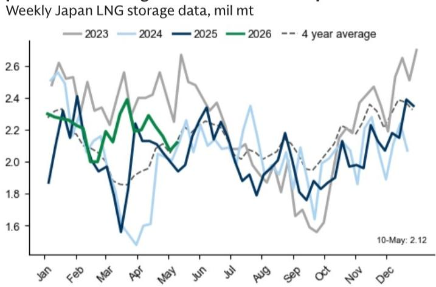
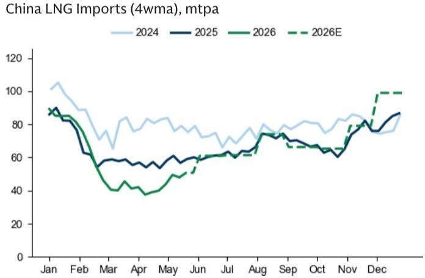

# Asia’s LNG Demand Recovery Has Already Begun, and It Will Redraw the Risk Map for European Gas Prices Through Late 2026

The single most important dynamic in global natural gas markets over the past year has been the weakness of Asian LNG demand. That weakness acted as a safety valve for Europe, diverting cargoes away from price-sensitive buyers in China, South Korea, and Japan toward a continent scrambling to replace Russian pipeline gas. But that safety valve is now closing. With two weeks of May data in hand, Asia’s LNG imports are showing clear and accelerating signs of recovery, and the implications for European TTF prices are far from academic. The question is no longer whether Asian demand will rebound, but how fast, and how far the resulting price pressure will travel.

For months, the analytical consensus held that Europe’s gas price premium over Asia would persist as long as the continent needed to outbid other buyers for spot LNG cargoes. That logic was always conditional on Asia staying on the sidelines. The moment Asian buyers re-enter the market in force, the calculus shifts. Europe no longer enjoys the luxury of being the only marginal buyer. The recovery now visible in the data suggests that the second half of 2026 will look very different from the first, and the risks to TTF prices are decisively skewed to the upside. This is not a forecast of a crisis; it is an argument that the market has underpriced the speed and scale of Asia’s return.

What makes this moment strategically important is the interaction between demand recovery and a specific geopolitical variable: the ongoing disruption at the Strait of Hormuz. The report’s base case assumes a normalization of flows by late June. But if that normalization is delayed to late July, the combination of rising Asian demand and constrained supply could push third-quarter TTF prices to 65 EUR/MWh and fourth-quarter prices to 53 EUR/MWh, well above the current forecasts of 44 and 40 EUR/MWh respectively. That is a 48% upside risk to the third quarter estimate. The market is not pricing this scenario. It should be.

## The Four-Week Moving Average Tells a Different Story from the Headline Data, and the Trend Is Unambiguously Upward

Headline year-on-year comparisons can be misleading. China’s LNG imports are still down year-on-year, which might suggest continued weakness. But the four-week moving average tells a more forward-looking story. That average now stands at 48 mtpa, well above the 36 mtpa March average. The sequential improvement is the key signal. The market is not moving sideways; it is moving up, and at a pace that has already exceeded the report’s May expectations by 4 mtpa. That is not a rounding error. It is an early warning.

The same pattern holds for South Korea, though at a smaller scale. The four-week moving average for Korean imports is 42 mtpa, above the 39 mtpa April average and the 40 mtpa May expectation. The shoulder season is ending, and summer cooling demand is beginning to pull cargoes into Asia. The report expects further upside to Chinese imports through the third quarter, targeting 67 mtpa, which would allow China to build gas inventories to levels slightly above last year’s ahead of next winter. That is a deliberate, policy-driven storage strategy, not a passive response to market conditions.

The critical insight here is that Asian buyers are not just reacting to price; they are executing a storage build that will require sustained import volumes. The price elasticity of Asian LNG demand is not infinite. Once the need to fill storage becomes binding, buyers will pay what it takes to secure cargoes. Europe will have to compete for those same cargoes. The price floor is rising.

## The JKM-TTF Spread Has Already Repriced to Reflect a Stronger Asian Appetite for Atlantic-Basin LNG

The most direct market signal of Asia’s renewed demand is the behavior of the JKM-TTF spread. In April, the spread stood at roughly 1.59 USD/mmBtu. In May, it has risen to 1.87 USD/mmBtu. That increase is even more significant when adjusted for the month-on-month change in LNG shipping costs. The shipping cost differential for US LNG suppliers to deliver a cargo to Asia versus to Europe has narrowed slightly, yet the spread has widened. That means Asia is paying a premium relative to the pure logistics cost advantage. It is a sign of genuine demand pull, not just a mechanical adjustment to shipping rates.

This is the kind of price action that changes behavior. When the JKM premium over TTF rises, it signals to global traders that Asia is the more attractive destination for flexible cargoes. Europe, which relies on spot LNG to balance its market, will have to offer a higher price to redirect those cargoes. The spread is not yet at crisis levels, but the direction of travel is clear. If the spread continues to widen through June and July, European gas storage injections will become more expensive, and the risk of a winter price spike will increase.

The report’s data on this point is unambiguous. Exhibit 3 shows the shipping cost differential and the JKM-TTF spread side by side. The May bar is higher than the April bar for both series, but the spread has risen more than the shipping cost differential. That is the signature of a market where Asian buyers are actively outbidding European buyers for marginal cargoes. It is not a theoretical risk. It is happening now.

## Japan’s Weakness Is a Temporary Distortion That Will Reverse as Summer Cooling Demand and Storage Needs Kick In

Japan presents the one notable exception to the Asian recovery story. The four-week moving average for Japanese LNG imports is currently 44 mtpa, below the report’s 48 mtpa May expectation. That is a meaningful gap. But the report is clear that this weakness is temporary, driven by a combination of warm April weather, increased coal utilization, low operating rates at chemical companies due to reduced feedstock availability, and comfortable LNG inventories that allowed for temporary destocking.

Each of these factors is self-correcting. Warm weather ends. Coal utilization faces regulatory and operational limits. Chemical plant operating rates will recover as feedstock availability improves. And destocking cannot continue indefinitely because Japan needs to rebuild LNG inventories ahead of peak summer and next winter. The report’s Exhibit 5 shows the trajectory of Japanese storage levels relative to the five-year range. Inventories are currently comfortable, but the path to winter requires a sustained build from here. Once cooling demand for power rises seasonally, Japan will have no choice but to increase imports.

The implication is that the current dip in Japanese imports is a lag, not a structural change. When Japan re-enters the market, it will add to the demand pressure already visible in China and South Korea. The combined effect of all three major Asian buyers importing at or above expectations will tighten the global LNG balance significantly. Europe cannot afford to ignore this. The temporary weakness in Japan has given Europe a few extra weeks of breathing room. That window is closing.

## The Report Leaves a Critical Question Unanswered: How Much of the Asian Demand Recovery Is Price-Elastic Versus Structurally Committed?

This is the analytical gap that matters most. The report establishes convincingly that Asian LNG imports are recovering and that the recovery will continue through the third quarter. What it does not fully answer is the composition of that demand. How much of the increase is driven by price-sensitive buying that could reverse if European bids push spot prices higher? And how much is driven by structural or policy commitments that will persist regardless of price?

The distinction is crucial for forecasting the equilibrium price. If Asian demand is highly price-elastic, then Europe can still outbid Asia for cargoes, but only at a cost. The price will rise until Asian buyers step back. That is the classic marginal pricing model. But if a significant portion of Asian demand is inelastic—driven by storage mandates, long-term contracts, or political commitments to energy security—then the price will rise until European demand is destroyed. That is a much more dangerous scenario for Europe.

The report hints at the answer by noting that China’s storage build is aimed at reaching levels slightly above last year’s ahead of winter. That sounds like a policy-driven target, not a price-sensitive decision. Similarly, Japan’s need to rebuild inventories before peak summer and winter suggests a degree of commitment that will not easily yield to price signals. The report does not quantify the share of price-elastic versus inelastic demand in the Asian recovery. That is the question every reader should be asking. The answer determines whether the upside risk to TTF is moderate or severe.

## A Decision Framework for Readers: Three Scenarios That Should Inform Your Positioning

The report’s data and analysis support a structured decision framework for anyone exposed to European gas prices, Asian LNG procurement, or the broader energy complex. The framework has three scenarios, each defined by two variables: the timing of Hormuz flow normalization and the trajectory of Asian LNG imports relative to the report’s base case.

Scenario one is the base case: Hormuz normalizes by late June, and Asian imports follow the report’s expectations. In this scenario, TTF prices average 44 EUR/MWh in the third quarter and 40 EUR/MWh in the fourth quarter. Asian buyers re-enter the market gradually, but the supply response from new LNG capacity and the resolution of the Hormuz disruption keep prices in check. This is the scenario the market is currently pricing. It is not the most likely outcome; it is the most comfortable one.

Scenario two is the delayed Hormuz case: normalization is pushed to late July, but Asian imports remain at or slightly above the base case. In this scenario, the report estimates TTF prices at 65 EUR/MWh in the third quarter and 53 EUR/MWh in the fourth quarter. The 48% upside to the third quarter forecast is driven entirely by the supply constraint. This scenario is plausible and underappreciated. It does not require a dramatic acceleration in Asian demand; it only requires the current recovery to continue while supply remains disrupted.

Scenario three is the combined shock: Hormuz normalization is delayed beyond July, and Asian imports accelerate faster than the base case, driven by a hot summer in China and Japan. In this scenario, TTF prices could exceed 65 EUR/MWh in the third quarter and approach 60 EUR/MWh in the fourth quarter. This is the tail risk. It is not the report’s base case, but the data already available for May suggests that the trajectory is consistent with this scenario. The report does not provide explicit price estimates for this case, which is itself a signal. The authors are leaving the door open for a more severe outcome.

The actionable insight from this framework is that the base case is fragile. The market is pricing a benign outcome that depends on multiple favorable assumptions: a timely resolution of the Hormuz disruption, a gradual Asian demand recovery, and no additional supply disruptions. Each of these assumptions is reasonable in isolation, but together they create a narrow path. The probability that at least one assumption fails is high. The asymmetry of risk is to the upside for TTF prices.

## Join the Community to Read the Full Report and Review the Original Charts

The data behind this analysis is worth examining directly. The exhibits in the full report show the four-week moving averages for Asia, China, South Korea, and Japan, as well as the JKM-TTF spread adjusted for shipping costs and the Japanese storage trajectory. These charts are not just illustrations; they are the raw evidence for the argument that Asian demand recovery is real and accelerating. The report also includes detailed scenario analysis and the full set of assumptions behind the price forecasts. Readers who want to assess the robustness of the analysis for themselves should review the original material.

The most valuable part of the full report is the discussion of what the authors do not know. The report is explicit about the temporary nature of Japan’s weakness and the uncertainty around the Hormuz timeline. But it is also honest about the limits of its own analysis. The question of price elasticity in Asian demand, the potential for additional supply disruptions, and the behavior of European storage operators in response to rising prices are all areas where the report provides data but not certainty. These are the questions that will determine whether the upside risk to TTF materializes or fades. The full report gives readers the tools to form their own view.

Join the community to read the full report and review the original charts.

*This article is for learning and discussion only and does not constitute investment advice.*

Personal reading notes and learning share only. Not investment advice.

