# European Business Services

# AI for Business Services: From job fears to productivity on a plate

  
Sabrina Blanc

+33 1 42 13 47 32

sabrina.blanc@Bernsteinsg.com

  
Will Kirkness

+44 20 7676 8355

will.kirkness@Bernsteinsg.com

  
Filippo Giardini

+44 20 7762 4723

filippo.giardini@Bernsteinsg.com

This is part of a series of reports on AI disruption. Business services and catering stocks have been hard hit by fears of significant job destruction. While we acknowledge the importance of the shift induced by AI, we are convinced that its impact will not necessarily be negative for the two sectors. A long-term decline in employment seems unlikely, in our view, as we see clear signs of these companies leveraging AI to increase productivity and efficiency. In this report, we address two key questions: i) What will these two industries look like when AI has been fully integrated? ii) How might estimates change to reflect the impact of AI?

Market sentiment has cooled recently on AI-exposed names, amid either white-collar job loss fears at catering or structurally lower barriers to entry for some business services names (EXPN, TEP, staffers). Some argue that job destruction could outpace job creation, particularly for white-collar workers, as AI automates an increasing share of cognitive tasks. This reinforces the view of AI as primarily a major economic disruptor in its own right, rather than merely an efficiency tailwind.

History suggests reallocation, not collapse. Past technological shocks (electrification, IT, the internet) resulted in reallocation of jobs and lifted employment over the long term, as noted by Adecco. Generative AI could accelerate the automation of certain white-collar tasks, and thus render some roles obsolete, but it is also likely to drive demand for new capabilities, such as development of AI systems to manage migration complexity, retrain users, re-implement integrations, and mitigate switching risks. Disrupted or supercharged? Mapping AI risks in Services and Software. McKinsey's 2030 scenario projects that c.30% of work hours will be automated across Europe and the US, reducing headcount in canteens and restaurants (non-cooking roles) and in back-offices, which are core exposures in the Business & Industry segment, while boosting demand in healthcare and STEM fields.

In European business services we differ from consensus opinions on key stocks: 1) for Experian (U), AI is a contributory factor to our lower medium term organic growth estimates, 2) likewise at TP (OP) we see lower organic growth vs medium term expectations as higher automated volumes = lower price, 3) for staffers, we are more optimistic than consensus, we think the incumbents are primed to deliver efficiencies from AI tooling and the nature of revenues - blue collar temp focused placements - are well-placed.

We estimate that for catering operators, AI-linked operational gains could ultimately offset most of the demand risk. We analyze the impact of AI as a means for catering companies to optimize processes, accelerate task automation and gain efficiencies across business models. For catering companies, we assume a maximum negative impact on revenue of around 1-2%, partially mitigated by additional cost efficiencies. This would imply that the sector will be disrupted but only to a limited extent.

Our top picks within the two sectors remains Compass (Outperform, PT \$38.7) and Rentokil (Outperform, PT 576p).

Bernstein TICKER TABLE 

<table><tr><td colspan="3"></td><td rowspan="2">14 May2026ClosingPrice</td><td rowspan="2">PriceTarget</td><td rowspan="2">TTMRel.Perf.</td><td colspan="4">Adjusted EPS</td><td colspan="3">Adjusted P/E (x)</td></tr><tr><td>Ticker</td><td>Rating</td><td>Cur</td><td>Cur</td><td>2025A</td><td>2026E</td><td>2027E</td><td>2025A</td><td>2026E</td><td>2027E</td></tr><tr><td>SW.FP (Sodexo)</td><td>M</td><td>EUR</td><td>47.36</td><td>43.30</td><td>(29.7)%</td><td>EUR</td><td>5.58</td><td>3.04</td><td>4.22</td><td>8.5</td><td>15.6</td><td>11.2</td></tr><tr><td>CPG.LN (Compass)</td><td>O</td><td>USD</td><td>33.31</td><td>38.70</td><td>(13.9)%</td><td>USD</td><td>1.32</td><td>1.47</td><td>1.62</td><td>25.3</td><td>22.6</td><td>20.6</td></tr><tr><td>ELIOR.FP (Elior)</td><td>U</td><td>EUR</td><td>2.96</td><td>3.00</td><td>(4.4)%</td><td>EUR</td><td>0.43</td><td>0.33</td><td>0.39</td><td>6.9</td><td>9.0</td><td>7.5</td></tr><tr><td>ELIS.FP (Elis)</td><td>O</td><td>EUR</td><td>27.50</td><td>30.50</td><td>8.4%</td><td>EUR</td><td>1.85</td><td>2.15</td><td>2.20</td><td>14.8</td><td>12.8</td><td>12.5</td></tr><tr><td>ADEN.SW (Adecco)</td><td>O</td><td>EUR</td><td>15.25</td><td>26.00</td><td>(49.1)%</td><td>EUR</td><td>2.37</td><td>2.60</td><td>2.99</td><td>6.4</td><td>5.9</td><td>5.1</td></tr><tr><td>BNZL.LN (Bunzl)</td><td>O</td><td>GBp</td><td>2,350.00</td><td>2,750.00</td><td>(18.7)%</td><td>GBP</td><td>1.78</td><td>1.81</td><td>1.90</td><td>13.2</td><td>13.0</td><td>12.4</td></tr><tr><td>BVI.FP (Bureau Veritas)</td><td>O</td><td>EUR</td><td>26.56</td><td>34.00</td><td>(22.2)%</td><td>EUR</td><td>1.41</td><td>1.51</td><td>1.69</td><td>18.8</td><td>17.6</td><td>15.7</td></tr><tr><td>EXPN.LN (Experian)</td><td>U</td><td>GBp</td><td>2,564.00</td><td>2,850.00</td><td>(46.4)%</td><td>USD</td><td>1.56</td><td>1.75</td><td>1.91</td><td>22.1</td><td>19.6</td><td>17.9</td></tr><tr><td>RAND.NA (Randstad)</td><td>O</td><td>EUR</td><td>24.42</td><td>45.00</td><td>(49.0)%</td><td>EUR</td><td>2.29</td><td>2.51</td><td>2.61</td><td>10.7</td><td>9.7</td><td>9.4</td></tr><tr><td>ITRK.LN (Intertek)</td><td>M</td><td>GBp</td><td>5,675.00</td><td>6,000.00</td><td>2.3%</td><td>GBP</td><td>2.50</td><td>2.57</td><td>2.77</td><td>22.7</td><td>22.1</td><td>20.5</td></tr><tr><td>RTO.LN (Rentokil)</td><td>O</td><td>GBp</td><td>475.90</td><td>576.00</td><td>23.8%</td><td>USD</td><td>0.26</td><td>0.31</td><td>0.35</td><td>24.7</td><td>20.5</td><td>18.3</td></tr><tr><td>TEP.FP (Teleperformance)</td><td>O</td><td>EUR</td><td>66.54</td><td>140.00</td><td>(44.0)%</td><td>EUR</td><td>13.20</td><td>13.76</td><td>14.28</td><td>5.0</td><td>4.8</td><td>4.7</td></tr><tr><td>SGSN.SW (SGS)</td><td>O</td><td>CHF</td><td>84.68</td><td>103.00</td><td>(13.4)%</td><td>CHF</td><td>3.81</td><td>4.20</td><td>4.43</td><td>22.2</td><td>20.2</td><td>19.1</td></tr><tr><td>SUNB (Sunbelt Rentals)</td><td>O</td><td>USD</td><td>79.47</td><td>86.00</td><td>NA</td><td>USD</td><td>3.76</td><td>3.82</td><td>4.26</td><td>21.1</td><td>20.8</td><td>18.7</td></tr><tr><td>EDME</td><td></td><td></td><td>1,526.12</td><td></td><td></td><td></td><td></td><td></td><td></td><td></td><td></td><td></td></tr></table>

O - Outperform, M - Market-Perform, U - Underperform, NR - Not Rated, CS - Coverage Suspended   
RAND.NA base year is 2024; ADEN.SW Price Target currency is in CHF   
Source: Bloomberg, Bernstein estimates and analysis.

# INVESTMENT IMPLICATIONS

Our top picks within the two sectors remains Compass (Outperform, PT \$38.7) and Rentokil (Outperform, PT 576p).

# DETAILS

# BUSINESS SERVICES SECTORS FACING THE AI ROLL-OUT

# IS THE STOCK MARKET OVERREACTING TO THE RISKS OF AI?

Over the past year and a half, market concerns have been building about the potential impact of AI on companies in the business services sector — whether firms involved in task automation or database management (Experian, Teleperformance) or in the temporary work segment (Adecco, Randstad), or more broadly suppliers to other businesses that could be affected — namely caterers (Compass, Sodexo, Elior). There have been fewer concerns raised with regard to TIC companies. Overall, the stock performance of business services stocks has been negative over the past 16 months: Teleperformance has lost 25%, while Adecco and Experian are down 20%. Even though there may be other factors that could explain this performance, particularly for Sodexo, Sunbelt and Bunzl, sentiment on the sector is clearly negative.

EXHIBIT 1: Business services peers - Normalized performance LTM since 01/01/2025   
  
Source: Bloomberg, Bernstein analysis

EXHIBIT 2: Business services peers - Normalized performance LTM since 01/01/2025   
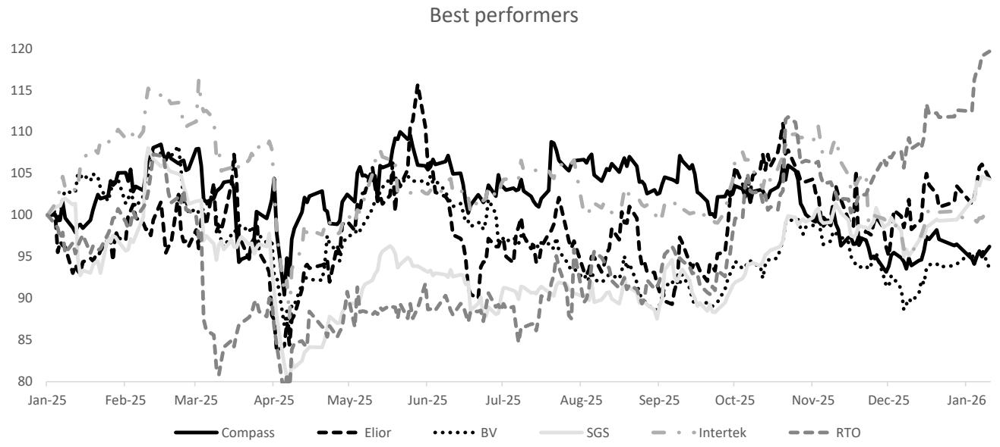

line

| Month   | Compass | Elior | BV  | SGS | Intertek | RTO |
|---------|---------|-------|-----|-----|----------|-----|
| Jan-25  | 100     | 98    | 97  | 96  | 105      | 104 |
| Feb-25  | 105     | 103   | 102 | 101 | 110      | 108 |
| Mar-25  | 108     | 106   | 105 | 104 | 112      | 107 |
| Apr-25  | 85      | 87    | 86  | 85  | 88       | 87  |
| May-25  | 105     | 104   | 103 | 102 | 107      | 106 |
| Jun-25  | 110     | 115   | 108 | 107 | 109      | 108 |
| Jul-25  | 105     | 103   | 102 | 101 | 106      | 105 |
| Aug-25  | 108     | 106   | 105 | 104 | 108      | 107 |
| Sep-25  | 105     | 104   | 103 | 102 | 106      | 105 |
| Oct-25  | 108     | 107   | 106 | 105 | 109      | 108 |
| Nov-25  | 105     | 106   | 105 | 104 | 110      | 109 |
| Dec-25  | 95      | 97    | 96  | 95  | 105      | 104 |
| Jan-26  | 95      | 96    | 95  | 94  | 104      | 120 |

Source: Bloomberg, Bernstein analysis

The business services sector offers disparate exposure to the rise of AI. A collection of stocks that are expected to have negative implications, albeit debated to varying degrees and stocks that offer a degree of immunity due to the physicality of the work. Our central thesis is that AI is a force for productivity which changes the nature of work, changes the shape of markets and increases the speed that new products and services can be brought to market. It doesn't necessarily change who owns the revenue streams but will have implications for mix, shape and pricing in markets. It will also create new markets.

Below is a table of stocks that assesses where we see impacts in order of concern:

EXHIBIT 3: Summary - Magnitude of impact of AI on business services companies 

<table><tr><td>Company</td><td>BERN vs guidance</td><td>Employees</td></tr><tr><td>Teleperformance</td><td>We assume a medium term growth framework below guidance</td><td>446,716</td></tr><tr><td>Experian</td><td>Growth expectations below consensus driven by harder fought TAM</td><td>23,297</td></tr><tr><td>Randstad</td><td>Broad and global blue collar temp exposure favoured</td><td>38,000</td></tr><tr><td>Adecco</td><td>Broad and global blue collar temp exposure favoured</td><td>34,000</td></tr><tr><td>Elior</td><td></td><td>132,783</td></tr><tr><td>Sodexo</td><td>White collar accounts for a limited amount of revenues compared to activities</td><td>426,000</td></tr><tr><td>Compass</td><td>not affected while AI could benefit to global productivity</td><td>590,000</td></tr><tr><td>Bureau Veritas</td><td>AI enhances demand for some segments and grows new markets, albeit</td><td>82,000</td></tr><tr><td>SGS</td><td>unlikely to be material and allows for opex efficiencies. See inspection activities</td><td>100,000</td></tr><tr><td>Intertek</td><td>as modestly more impacted than testing.</td><td>45,425</td></tr><tr><td>Bunzl</td><td></td><td>27,000</td></tr><tr><td>Rentokil</td><td>Limited impact</td><td>68,500</td></tr><tr><td>Elis</td><td></td><td>58,445</td></tr><tr><td>Sunbelt</td><td></td><td>25,940</td></tr></table>

Source: Bernstein analysis, Bloomberg, Company data

# AREEMPLOYMENT LEVELS DETERIORATING?

Markets have turned more cautious on AI-exposed names in recent months, as sentiment has shifted from pure optimism on productivity gains to concerns about the broader economic and labor-market impacts. Consequently, companies for which demand is correlated to labor-market dynamics have seen their market valuations suffer, reflecting this rising caution.

McKinsey's 2030 midpoint scenario points to roughly $30\%$ of hours worked being automated by generative AI in Europe and the US, driving significant occupational shifts. Labor demand is expected to tilt towards higher-wage roles in healthcare and STEM (Science, Technology, Engineering, and Mathematics). At the same time, roles in food services (cashiers), sales, customer service, office support and production, which already declined over 2012-22, are set to shrink.

EXHIBIT 4: Automation of current work tasks with development of Gen-AI   
Automation of current work activities, % of working hours modeled to be automated, with generative AI acceleration, Europe $^{1}$ and the US, 2022–80   
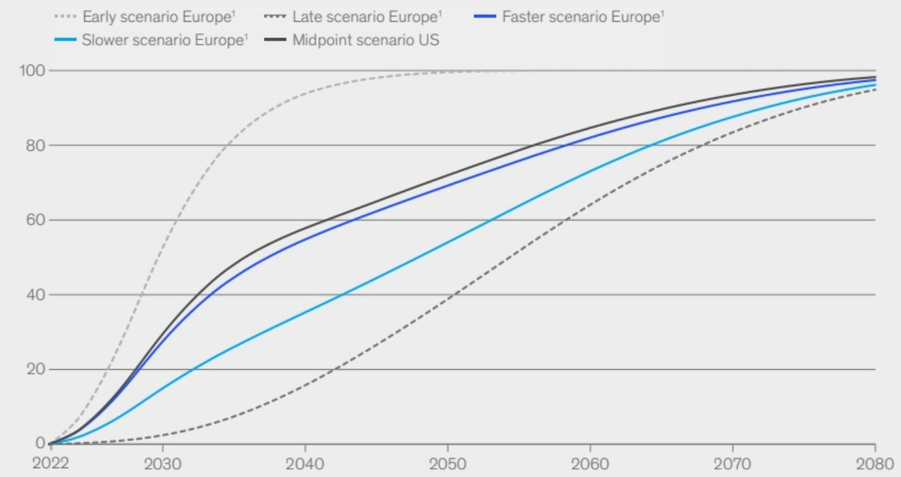

line

| Year | Early scenario Europe¹ | Late scenario Europe¹ | Faster scenario Europe¹ | Slower scenario Europe¹ | Midpoint scenario US |
|------|------------------------|-----------------------|-------------------------|-------------------------|----------------------|
| 2022 | 0                      | 0                     | 0                       | 0                       | 0                    |
| 2030 | ~60                    | ~5                    | ~30                     | ~15                     | ~40                  |
| 2040 | ~95                    | ~20                   | ~55                     | ~35                     | ~60                  |
| 2050 | ~100                   | ~40                   | ~70                     | ~55                     | ~75                  |
| 2060 | ~100                   | ~60                   | ~85                     | ~75                     | ~85                  |
| 2070 | ~100                   | ~80                   | ~95                     | ~90                     | ~95                  |
| 2080 | ~100                   | ~95                   | ~100                    | ~98                     | ~100                 |

Note: The range of scenarios represents uncertainty regarding the availability of technical capabilities, based on interviews with experts and survey responses. The early scenario makes more-aggressive assumptions for all key model parameters (technical potential, integration timeline, economic feasibility, and regulatory and public adoption). The “faster” or midpoint adoption scenario is the average between the early and late scenarios. The “slower” scenario is the average between the late scenario and the midpoint scenario.   
$^{1}$ Includes Czech Republic, Denmark, France, Germany, Italy, Netherlands, Poland, Spain, Sweden, and United Kingdom.   
Source: Eurostat; Occupational Information Network; Oxford Economics; US Bureau of Labor Statistics; national statistical agencies of the European countries considered; McKinsey Global Institute analysis   
Source: Adecco

# EVIDENCE AND ANALYSIS INVITES GREATER NUANCE

At the same time, the most extreme “AI kills more jobs than it creates” narrative seems debatable. Historically, major productivity shocks (electrification, IT, the internet) have tended to result in job reallocation rather than job elimination with higher productivity ultimately supporting growth and employment.

Economists James Feigenbaum and Daniel P. Gross noted in their studies relative to the transformation of telephone operator jobs in France in the 1920s to 1940s that automation is not necessarily synonymous with job destruction. Rather, they show that demand for similar-quality jobs grew to offset the lost employment. A similar dynamic of increased productivity leading to greater labor demand could play out with generative AI. McKinsey's estimates suggest that it could add 0.5-0.9 percentage points to annual US labor-productivity growth out to 2030, with broader automation potentially lifting the rate to $3 - 4\%$ .

Overall, we think that generative and agentic AI should be seen primarily as a particularly effective tool for accelerating routine processes and automating tasks, with white-collar jobs being the first at risk. We expect a net shift from “automation-prone” roles to “augmentation-prone” roles, rather than a simple collapse in employment.

# EXHIBIT 5: Positive correlation between productivity and employment

# History shows that technological changes creates productivity and employment

Consistently high correlation between increased labor productivity and increased employment (% of rolling periods, 1960-2016)

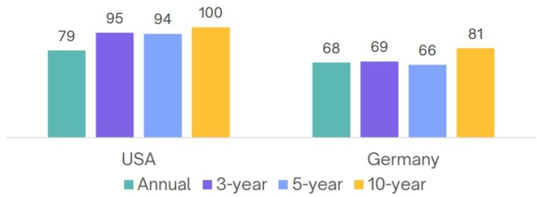

bar

| Country | Year | Annual | 3-year | 5-year | 10-year |
| :--- | :--- | :--- | :--- | :--- | :--- |
| USA | 1 | 79 | 95 | 94 | 100 |
| Germany | 1 | 68 | 69 | 66 | 81 |

Source: Adecco, Bernstein analysis

We view our coverage as helpful because it includes staffers, who have half a million temps working globally, data companies, service companies and very large employers more broadly. From that coverage we have a number of helpful data points:

- Adecco's career transition business (which is the global leader) found $1.4\%$ of layoffs because of AI while $12\%$ found AI had some impact. There is a sense within the $12\%$ however, that adding AI as a reason for a layoff enhances the companies view with other stake holders but may have been a minimal component of the decision.   
- Adecco's CMD highlighted that there is a high correlation between periods of increased labour productivity and increased employment. In the US the correlation is $c.80\%$ on an annual view and $100\%$ on a ten-year view.   
- Randstad see AI driving job losses of 6-7% over the next 5-10 years with a focus on clerical, customer service, marketing and software. Of the current jobs they fill, 60-70% did not exist when RAND was founded 65 years ago.

# AI COULD GENERATE HALF A BILLION JOBS BY 2033

AI development and implementation is also likely to require additional jobs, particularly to develop AI systems to manage migration complexity, retrain users, re-implement integrations, and mitigate switching risks. Bernstein report: Disrupted or supercharged? Mapping AI risks in Services and Software. A Gartner report estimates that automation software will generate half a billion jobs by 2033. In Exhibit 7 we provide a list of potential jobs linked to AI that could be created. We note, in particular, that some of the large software companies are set to increase their AI talent; for example Accenture has already announced that it aims to virtually double hiring dedicated to AI (to 80,000 engineers from 50,000).

Compass is a further example. It grew its business with tech clients by 14% in 1Q26, which contributed c.1 point of group growth both across net-new business and volume like-for-like. According to Compass' management, there are plans for roughly 6,000 data centers in the US by 2030, either through new construction or the scaling up of existing facilities. When these facilities reach scale, Compass sees an opportunity of around \$4m to \$5m per data center at project launch, before a return to more normal levels during the maintenance phase.

# EXHIBIT 6: Compass realease -1Q26 - Dominic Blakemore

# Dominic Blakemore, CEO of Compass:

" After spending three weeks meeting with around 40 current and prospective clients, one message came through loud and clear. AI is driving significant improvements in efficiency, productivity, and growth, but capturing the opportunity requires new skills and evolving roles across organizations".

1Q26 - Compass release

Source: Compass, Bloomberg

EXHIBIT 7: Example of job creation linked to AI 

<table><tr><td>Job title</td><td>Role</td></tr><tr><td>AI Trainer</td><td>Corrects, annotates and curates data used to train AI models</td></tr><tr><td>Data Labeler / Data Annotator</td><td>Labels images, text, audio, etc. to build high-quality training datasets</td></tr><tr><td>Prompt Engineer</td><td>Designs and optimizes prompts to get reliable outputs from AI models</td></tr><tr><td>AI Experience Designer</td><td>Defines how AI is integrated into products and user journeys</td></tr><tr><td>AI Ethics &amp; Risk Specialist</td><td>Manages bias, compliance, and regulatory risks related to AI systems</td></tr><tr><td>MLOps Engineer</td><td>Deploys, monitors, and maintains AI/ML models in production</td></tr><tr><td>AI Product Manager</td><td>Sets strategy and roadmap for products that embed AI capabilities</td></tr><tr><td>AI Transformation Consultant</td><td>Helps companies redesign processes and jobs around AI tools</td></tr><tr><td>Conversational Agent Persona Designer</td><td>Creates the tone, personality, and boundaries of chatbots and AI agents</td></tr></table>

Source: PWC, lemondeinformatique

# THE NON AFFECTED ONES

We also cover a number of stocks, namely Elis or Rentokil, where there is high a degree of physical action to the revenues and unless we are to consider robotics + AI, then risks of disruption appear much more long-dated.

# CROSS-CHECKING THE DATA

It has been nearly 42 months since the launch of generative AI systems such as ChatGPT, so we are now starting to get some visibility on the potential impacts in terms of job creation or destruction. According to recent data, in February 2026, the US economy lost about 133,000 jobs, but created about 178,000 in March. Overall, the US labor market slowed in 2025. This could be attributable to various factors: i) slower labor force growth due to demographics and weaker immigration; ii) economic and political uncertainty (tariffs, immigration rules) leading to greater caution on hiring; iii) the slowdown in US employment after the huge post-Covid catch-up; or iv) growth being absorbed through productivity gains (including automation/AI).

EXHIBIT 8: US employees on Nonfarm Payrolls Total MoM Net Change   
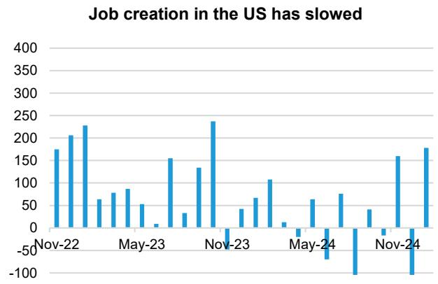

bar

| Month    | Job Creation |
| -------- | ------------ |
| Nov-22   | 180          |
|         | 210          |
|         | 230          |
| May-23   | 60           |
|         | 80           |
|         | 90           |
|         | 50           |
|         | 10           |
|         | 160          |
|         | 30           |
|         | 130          |
| Nov-23   | 240          |
|         | -10          |
|         | 40           |
|         | 70           |
|         | 110          |
| May-24   | 10           |
|         | -50          |
|         | -70          |
|         | 80           |
|         | -100         |
| Nov-24   | 40           |
|         | 160          |
|         | -100         |
|         | 180          |

Source: US Bureau of Labor Statistics, Bernstein analysis

EXHIBIT 9: US employees on Nonfarm Payrolls Total Private MoM Net Change   
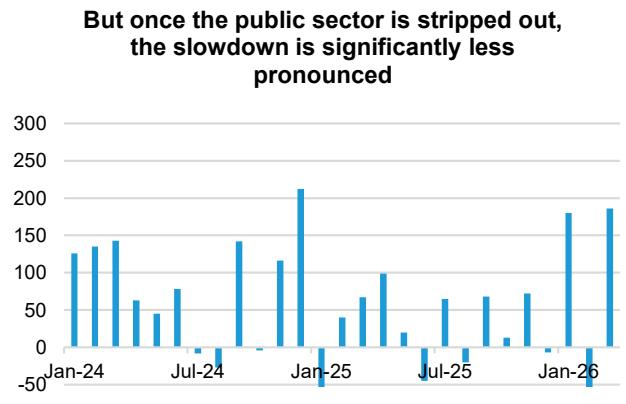

bar

| Date   | Value |
|--------|-------|
| Jan-24 | 120   |
| Feb-24 | 135   |
| Mar-24 | 145   |
| Apr-24 | 60    |
| May-24 | 40    |
| Jun-24 | 75    |
| Jul-24 | -10   |
| Aug-24 | -5    |
| Sep-24 | 140   |
| Oct-24 | 110   |
| Nov-24 | 210   |
| Dec-24 | -50   |
| Jan-25 | 40    |
| Feb-25 | 65    |
| Mar-25 | 95    |
| Apr-25 | 15    |
| May-25 | -10   |
| Jun-25 | 60    |
| Jul-25 | -5    |
| Aug-25 | 65    |
| Sep-25 | 10    |
| Oct-25 | 70    |
| Nov-25 | 15    |
| Dec-25 | 70    |
| Jan-26 | 180   |
| Feb-26 | -30   |
| Mar-26 | 190   |

Source: US Bureau of Labor Statistics, Bernstein analysis

EXHIBIT 10: US employees on Nonfarm Payrolls Total Private MoM Change   
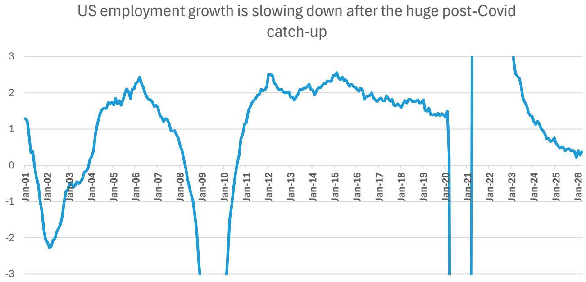

line

| Date   | Value |
|--------|-------|
| Jan-01 | 1.3   |
| Jan-02 | -2.3  |
| Jan-03 | -0.5  |
| Jan-04 | 0.8   |
| Jan-05 | 1.7   |
| Jan-06 | 2.4   |
| Jan-07 | 1.5   |
| Jan-08 | 0.8   |
| Jan-09 | -3.0  |
| Jan-10 | -3.0  |
| Jan-11 | 1.5   |
| Jan-12 | 2.5   |
| Jan-13 | 2.0   |
| Jan-14 | 2.2   |
| Jan-15 | 2.5   |
| Jan-16 | 2.0   |
| Jan-17 | 1.8   |
| Jan-18 | 1.7   |
| Jan-19 | 1.5   |
| Jan-20 | 1.4   |
| Jan-21 | -3.0  |
| Jan-22 | 3.0   |
| Jan-23 | 3.0   |
| Jan-24 | 1.5   |
| Jan-25 | 0.8   |
| Jan-26 | 0.3   |

Source: US Bureau of Labor Statistics, Bernstein analysis

# DATA OR LABOUR-INTENSIVE BUSINESS SERVICES, UNDER MOST SCRUTINY

# TELEPERFORMANCE - A LOWER MEDIUM TERM GROWTH RATE

We see Teleperformance as having the highest degree of risk associated with AI as some of the more basic end of interactions around customer services and translation lend themselves more easily to automation. As a user rather than developer of technology, it doesn't mean that TP won't still ‘own’ the transaction, but the method of delivery will change and become more efficient. This has potentially negative implications for volumes if clients believe they can in-house it and negative implications for values as cost savings are shared with clients and/or new entrants force new pricing dynamics. This means our central case for growth at TP is lower than company guidance.

EXHIBIT 11: TP group organic growth   
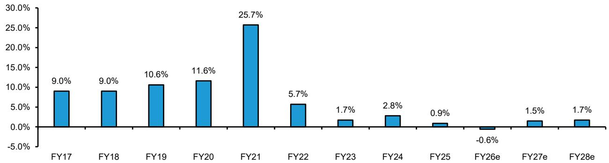

bar

| Fiscal Year | Value (%) |
| :--- | :--- |
| FY17 | 9.0 |
| FY18 | 9.0 |
| FY19 | 10.6 |
| FY20 | 11.6 |
| FY21 | 25.7 |
| FY22 | 5.7 |
| FY23 | 1.7 |
| FY24 | 2.8 |
| FY25 | 0.9 |
| FY26e | -0.6 |
| FY27e | 1.5 |
| FY28e | 1.7 |

Source: Company data, Bernstein estimates and analysis

# THE PACE OF ADOPTION

Since 2010, digital transactions have increased at 6% per annum while human-to-human interactions have increased at 2%. Across various market sources we estimate that 20-50% of current volumes could be automated the next few years, offset by underlying growth and share gains. How this flows through depends on the complexity of the exact transaction and the industry. Customers of TP are a broad mix but we consider the split of customer industries that are more complex and perhaps more risk-adverse are at around 50/50 vs potentially more straightforward industries

# IS THE SPECIAL SAUCE, SPECIAL ENOUGH?

As the industry continues to evolve, legacy players need to be able to make their case for market share. We look at this through two perspectives, firstly the special sauce that TP provide to keep them relevant and secondly the likely desires and actions of competitors. Where we see the distinct advantages and USPs for TP is around their role using (not building) tech to manage client ecosystems in terms of people and process. TP have entrenched relationships and a global footprint as well as 30+ years of track record. We do not anticipate that technology firms would want to move down the complexity curve into higher headcount lower margin activities.

# EXPERIAN - AI DISRUPTION IN THE CORE?

Experian drives the highest level of AI debate in the space, although the intensity of the incoming moderated into 2Q. Our central case for Experian is that the current envelope of revenues is relatively well protected but we see more debate around competition within the TAM and future growth drivers. This could have negative implications for future growth, which is the central pillar of our Underperform thesis, that consensus expectations of 8-9% over the medium term are too high. From our perspective this was independent of AI, it was driven by the increasingly overlapping with driver as well as the laws of large numbers. To believe in consensus organic growth expectations, we need to believe that Experian can accelerate revenues from scaling and recently introduced products which accounted for c4% of the 7% organic growth in FY25:

EXHIBIT 12: The building blocks of Experian's FY25 organic revenue growth   
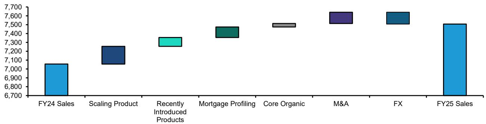

bar

| Category | Value |
| :--- | :--- |
| FY24 Sales | 7050 |
| Scaling Product | 7180 |
| Recently Introduced Products | 7300 |
| Mortgage Profiling | 7420 |
| Core Organic | 7480 |
| M&A | 7620 |
| FX | 7630 |
| FY25 Sales | 7520 |

Source: Company data, Bernstein analysis and estimates

# GROWTH FROM NEW TAMS

As we think about the current envelope of revenues and future growth drivers, we envisage three scenarios:

There is limited to no impact. AI allows the group to develop new products and services faster. The group cannot invent everything but is able to partner and/or acquire companies that have innovate and different solutions. We already see this to some degree in credit scores (albeit non AI driven) like Plaid with real time cash flow analytics. Square have talked about their alternative credit scores but are looking for a distribution partner. New more AI driven themes in fraud, analytics, insurance etc could be future partners or acquisitions. In this scenario, depending on how innovative Experian can continue to be, acquired growth could become a slightly larger weighting than currently.

Impact in limited segments but future growth is compromised by new entrants which weighs on volumes and/or values. This would be more aligned to our base case view, where there be some risk of new entrants in fraud or healthcare but the revenue exposure is likely lower than 10-15%. We see more risk that the \$150bn TAM identified by Experian starts to attract new competition which lowers volumes and/or values.

Structurally lower barriers to entry across the group. In this more concerning scenario, AI developments allow new entrants or new products from competitors to challenge the main moat. The unique and proprietary nature of the data is created because of the wide range of data sources, with a lot of history and frequent updates. The majority of Experian's data that feeds the B2B and in turn the B2C business is driven by data feeds from a wide range of financial and other institutions. These are updated frequently, we estimate Experian has 1bn of monthly feed updates a month. We estimate that 80-90% of revenues are covered by data that comes from these sources, i.e they are to a large degree unique and proprietary. Or are they? Bears are concerned that with time and money this data set is replicable, although we would see three main requirements for this to be the case. Any competitor would have to:

1. Replicate every relationship with data providers and receive monthly updates. This data would also need to go back 6 years to be of good use although going back 10-11 could help with statistical and profiling analysis.   
2. Create relationships with regulators who agree that data can be obtained, stored and used. For example, in the UK this is the FCA and in the US the CFPB (amongst others)

3. Prove to potential customers that the data is useful, that it can help that drive revenues and/or reduce credit losses

As such, while in theory barriers to entry in the core business may appear at risk of being reduced, we think the reality is much more complicated and the practical reality is that barriers to entry remain high.

The other factor we consider here is customer motivation. We do not consider Experian's customer as making quick decisions or having the motivation to disrupt their current data and decisioning provider because:

- Risk of failure is high. A client switching providers or models runs the risk of new parameters increasing credit losses. As such customers tend to be slow moving.   
- Cost is relatively low. Experian are a slither of their customers costs, a combination of low cost and high risk of failure results in lower motivation to change.   
- Customers are numerous and diverse. The annual report states that no one customer is over 10% of revenues but in reality we think that few are more than 1%.

EXHIBIT 13: Forward PE - Experian, Wolters and Relx   
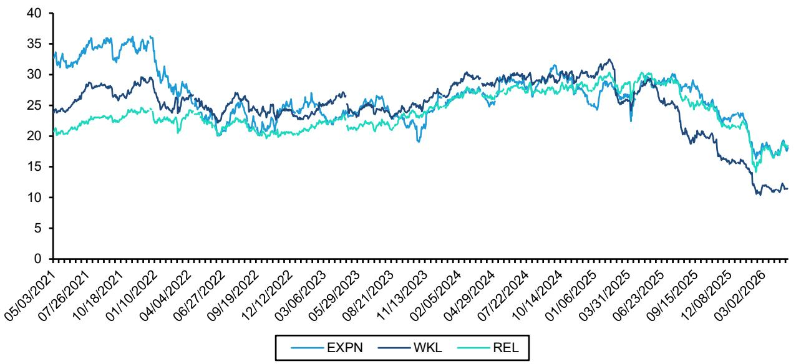

line

| Date       | EXPN | WKL  | REL  |
| ---------- | ---- | ---- | ---- |
| 05/03/2021 | 33   | 24   | 21   |
| 07/26/2021 | 35   | 28   | 23   |
| 10/18/2021 | 36   | 29   | 24   |
| 01/10/2022 | 35   | 27   | 23   |
| 04/04/2022 | 30   | 25   | 22   |
| 06/27/2022 | 28   | 24   | 21   |
| 09/19/2022 | 26   | 23   | 20   |
| 12/12/2022 | 25   | 24   | 21   |
| 03/06/2023 | 26   | 25   | 22   |
| 05/29/2023 | 27   | 26   | 23   |
| 08/21/2023 | 25   | 24   | 21   |
| 11/13/2023 | 24   | 23   | 20   |
| 02/05/2024 | 26   | 25   | 22   |
| 04/29/2024 | 28   | 27   | 24   |
| 07/22/2024 | 30   | 29   | 26   |
| 10/14/2024 | 31   | 30   | 27   |
| 01/06/2025 | 30   | 31   | 28   |
| 03/31/2025 | 31   | 32   | 29   |
| 06/23/2025 | 30   | 31   | 30   |
| 09/15/2025 | 31   | 30   | 31   |
| 12/08/2025 | 30   | 29   | 30   |
| 03/02/2026 | 18   | 17   | 19   |

Source: Bloomberg

# WHERE IS THE RISK IN NEW PRODUCTS?

Bureaus are undoubtedly experiencing a more noisy time and competitive threats appear to be increasing, especially in core secured credit decisions. Our Underperform was predicted on concerns that growth would slow because growth drivers are increasingly overlapping with existing peers, namely in areas like income and employment verification, real time credit scores, Brazil and Consumer. When we consider growth drivers where AI could weigh on market value we consider the following

Insourcing. Clients could decide to build and govern models using their own data via natural language, auto-documentation and synthetic data.

Alternative data scoring. While we see these as largely complimentary and additive to traditional credit scores, alternative data sets and open banking could prove useful enough that traditional credit scoring loses its value.

Insurance. A number of developments could have a detrimental impact here: 1) AI assistants could disintermediate by running these tasks for consumers. 2) Alternative aggregators will find it easier to create insurance marketplaces, even if they lack Experian's asset or expertise.

Health. We see risk of margin pressure and commoditization of revenue cycle management services, insourcing or other data providers competing down the TAM.

Fraud. Much of that stack here (document forensics, device intelligence, behavioral biometrics, transaction monitoring) is contestable, because specialized AI vendors can train models on consortium or client data without needing core credit files; Experian then has to win on scale, integration and distribution rather than on a unique algorithm.

# STAFFERS - A DUAL PRONGED AI ATTACK

Staffers have found themselves facing both barrels of Al concerns:

1. That there will be less jobs in general which will have negative implications for companies that place workers, either on a temporary or permanent basis   
2. Digital and AI platforms will disintermediate the staffers

On the first point we take a different viewpoint. As AI has matured organic growth at Adecco and Randstad has accelerated.

EXHIBIT 14: Adecco and Randstad group organic growth   
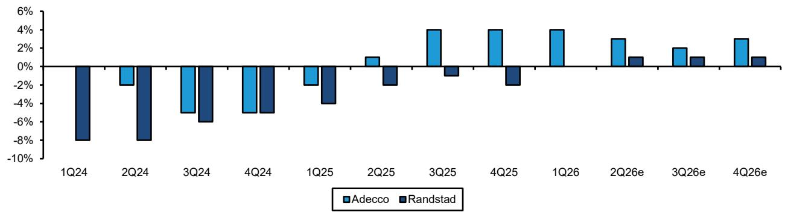

bar

| Quarter | Adecco | Randstad |
| ------- | ------ | -------- |
| 1Q24    | -8%    | -9%      |
| 2Q24    | -2%    | -8%      |
| 3Q24    | -5%    | -6%      |
| 4Q24    | -5%    | -5%      |
| 1Q25    | -2%    | -4%      |
| 2Q25    | 1%     | -2%      |
| 3Q25    | 4%     | -1%      |
| 4Q25    | 4%     | -2%      |
| 1Q26    | 4%     | -1%      |
| 2Q26e   | 3%     | 1%       |
| 3Q26e   | 2%     | 1%       |
| 4Q26e   | 3%     | 1%       |

Source: Company data, Bernstein estimates and analysis, Visible Alpha

Market data, such as number of temps on the US non-farm payroll has stabilised

EXHIBIT 15: Absolue number of temps on US non-farm payrolls, seasonally adjusted ('000)   
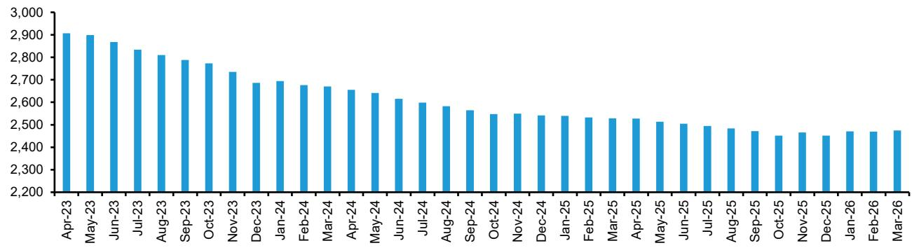

bar

| Month | Value |
|---|---|
| Apr-23 | 2900 |
| May-23 | 2900 |
| Jun-23 | 2850 |
| Jul-23 | 2820 |
| Aug-23 | 2800 |
| Sep-23 | 2780 |
| Oct-23 | 2760 |
| Nov-23 | 2730 |
| Dec-23 | 2680 |
| Jan-24 | 2680 |
| Feb-24 | 2670 |
| Mar-24 | 2660 |
| Apr-24 | 2650 |
| May-24 | 2640 |
| Jun-24 | 2610 |
| Jul-24 | 2590 |
| Aug-24 | 2580 |
| Sep-24 | 2560 |
| Oct-24 | 2540 |
| Nov-24 | 2540 |
| Dec-24 | 2530 |
| Jan-25 | 2530 |
| Feb-25 | 2520 |
| Mar-25 | 2510 |
| Apr-25 | 2510 |
| May-25 | 2500 |
| Jun-25 | 2490 |
| Jul-25 | 2480 |
| Aug-25 | 2470 |
| Sep-25 | 2460 |
| Oct-25 | 2440 |
| Nov-25 | 2450 |
| Dec-25 | 2440 |
| Jan-26 | 2450 |
| Feb-26 | 2450 |
| Mar-26 | 2450 |

Source: Bloomberg

EXHIBIT 16: YOY change in temp workers on non-farm payroll (seasonally adjusted)   
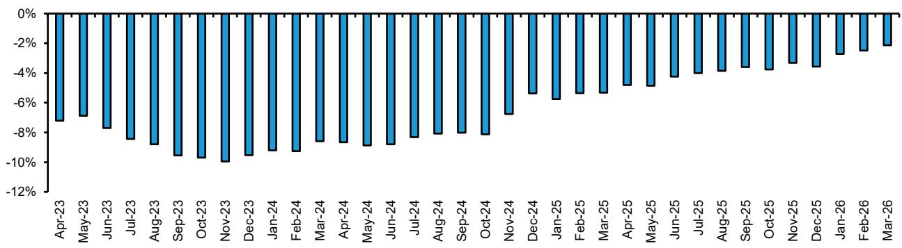

bar

| Month | Value (%) |
|---|---|
| Apr-23 | -7.5 |
| May-23 | -7.0 |
| Jun-23 | -8.0 |
| Jul-23 | -8.5 |
| Aug-23 | -9.0 |
| Sep-23 | -9.5 |
| Oct-23 | -9.8 |
| Nov-23 | -10.0 |
| Dec-23 | -10.2 |
| Jan-24 | -10.5 |
| Feb-24 | -10.7 |
| Mar-24 | -10.9 |
| Apr-24 | -11.0 |
| May-24 | -11.1 |
| Jun-24 | -11.2 |
| Jul-24 | -11.3 |
| Aug-24 | -11.4 |
| Sep-24 | -11.5 |
| Oct-24 | -11.6 |
| Nov-24 | -7.0 |
| Dec-24 | -5.5 |
| Jan-25 | -5.8 |
| Feb-25 | -5.9 |
| Mar-25 | -5.7 |
| Apr-25 | -5.3 |
| May-25 | -5.0 |
| Jun-25 | -4.5 |
| Jul-25 | -4.3 |
| Aug-25 | -4.1 |
| Sep-25 | -3.8 |
| Oct-25 | -3.6 |
| Nov-25 | -3.4 |
| Dec-25 | -3.2 |
| Jan-26 | -2.8 |
| Feb-26 | -2.6 |
| Mar-26 | -2.3 |

Source: Bloomberg

Adecco's career transition business (which is the global leader) found $1.4\%$ of layoffs because of AI while $12\%$ found AI had some impact. There is a sense within the $12\%$ however, that adding AI as a reason for a layoff enhances the companies view with other stake holders but may have been a minimal component of the decision.

Adecco's CMD highlighted that there is a high correlation between periods of increased labour productivity and increased employment. In the US the correlation is $c80\%$ on an annual view and $100\%$ on a ten-year view.

EXHIBIT 17: Labor market productivity and increases employment have 90%+ correlation in the US on a 3+ year view   
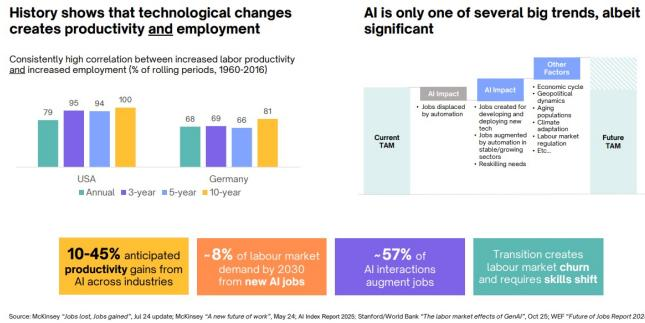  
Source: Adecco CMD 2025

EXHIBIT 18: Change in US workforce occupational mix is only slightly faster than previous big tech leaps   
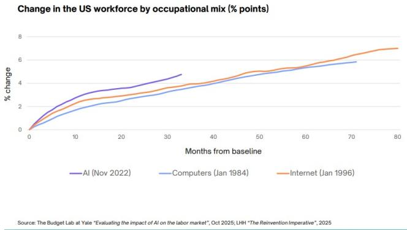

line

Change in the US workforce by occupational mix (% points)
| Months from baseline | AI (Nov 2022) (%) | Computers (Jan 1984) (%) | Internet (Jan 1996) (%) |
|---|---|---|---|
| 0 | 0 | 0 | 0 |
| 10 | 3.5 | 2.0 | 2.8 |
| 20 | 3.8 | 2.5 | 3.2 |
| 30 | 4.5 | 3.2 | 3.8 |
| 40 | 5.0 | 3.8 | 4.5 |
| 50 | 5.5 | 4.5 | 5.2 |
| 60 | 5.8 | 5.0 | 5.8 |
| 70 | 6.0 | 5.5 | 6.5 |
| 80 | - | - | 7.0 |

Source: Adecco CMD 2025

Randstad see AI driving job losses of 6-7% over the next 5-10 years with a focus on clerical, customer service, marketing and software. Of the current jobs they fill, 60-70% did not exist when RAND was founded 65 years ago.

On the second point, we see Adecco and Randstad's exposure to skilled and unskilled blue collar temp as advantageous. As well as matching job specs with talent, they are also involved in with on-boarding, training, HR and ensuring workers turn up, amongst other activities. Randstad have $15\%$ of their business flowing through digital now and at the end of the year expect it to be around $20\%$ . We see the incumbents as better placed to win as they have scope to invest and have the customer and candidate relationships.

EXHIBIT 19: Adecco GBU client industry (FY25)   
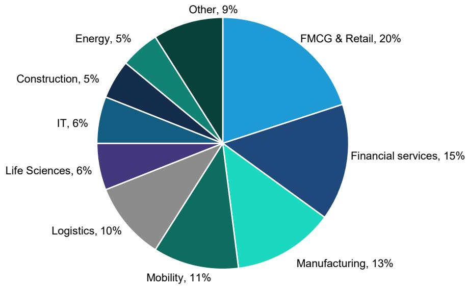

pie

| Category | Percentage (%) |
| :--- | :--- |
| FMCG & Retail | 20 |
| Financial services | 15 |
| Manufacturing | 13 |
| Mobility | 11 |
| Logistics | 10 |
| Life Sciences | 6 |
| IT | 6 |
| Construction | 5 |
| Energy | 5 |
| Other | 9 |

Source: Company data

# TESTING AND INSPECTION

We do not think that AI will have a material impact on the testing stocks within the medium term. We consider the peripheral impacts in three areas:

1. Driving growth in certain existing verticals   
2. Driving new growth   
3. Driving efficiencies in internal processes

# GROWTH IN EXISTING VERTICALS

EXHIBIT 20: Industry demand from AI 

<table><tr><td>Layer</td><td>Industry</td></tr><tr><td>Compute &amp; chips</td><td>GPU/accelerator vendors, advanced logic foundries, HBM, optical networking</td></tr><tr><td>Data centers</td><td>Hyperscale &amp; colo operators, DC construction, racks, PDUs, UPS, generators</td></tr><tr><td>Power &amp; grid</td><td>Transformers, switchgear, T&amp;D equipment, utilities, renewables, storage</td></tr><tr><td>Cooling &amp; efficiency</td><td>Liquid cooling, HVAC, industrial energy saving equipment, thermal components</td></tr><tr><td>Software &amp; services</td><td>Cloud AI platforms, enterprise software, cybersecurity</td></tr></table>

Source: Bernstein analysis

Bureau Veritas has more exposure to the physical infrastructure side of things in their B&I division while SGS specifically targets digital trust as a growth driver in Strategy 27.

# NEW GROWTH

AI is developing at pace in a largely unregulated environment. We do see some strategies:

In the EU the AI Act is the first comprehensive binding law, sitting alongside GDPR, product safety rules, and sectoral rules (e.g., medical devices, financial services). Fines can reach up to 7% of global turnover, so it becomes the de facto global standard for companies selling into Europe.

In the US there is an evolving mix of federal guidance, an AI focused Executive Order, and a patchwork of state laws. Recent federal action has pivoted toward national security and competitiveness, with Executive Order 14179 reorienting policy away from stricter “trust and safety” obligations and more toward enabling innovation and strategic dominance.

The UK is pursuing “pro-innovation” model with no single AI Act; instead, sector regulators (FCA, ICO, CMA, etc) apply AI principles in their domains, with a dedicated AI regulation bill emerging mainly for frontier developers.

China has several binding, AI-specific regulations (recommendation algorithms, “deep synthesis”/deepfakes, generative AI services), focused on content controls, labeling AI-generated content, security reviews, and centralized state oversight.

EXHIBIT 21: Potential future regulatory needs 

<table><tr><td>Theme</td><td>Likely Regulatory Measures</td><td>Typical Targets</td></tr><tr><td>Safety and robustness of models</td><td>Requirements for safety testing, evaluation against benchmarks, and serious incident reporting.</td><td>High risk sectors and models</td></tr><tr><td>Model registration and reporting</td><td>Obligations to register or notify regulators about high impact models, including capability summaries and safeguards.</td><td>Frontier model providers, large GPAI developers.</td></tr><tr><td>Transparency and content labeling</td><td>Mandatory labeling or watermarking of AI generated content to address deepfakes and disinformation.</td><td>Generative image, video, and text systems, social platforms.</td></tr><tr><td>System disclosure and explainability</td><td>Duties to tell users when AI is used and provide explanations for certain automated decisions.</td><td>Consumer facing systems, HR, finance, public sector decisions.</td></tr><tr><td>Bias, discrimination, fairness</td><td>Bias assessments, requirements for representative data, and recurring audits of algorithmic performance.</td><td>Hiring tools, credit scoring, insurance pricing, policing tools.</td></tr><tr><td>Impact and risk assessments</td><td>Algorithmic impact assessments / AI risk assessments prior to deployment in sensitive domains.</td><td>HR tech, public services, healthcare, education, welfare decisions.</td></tr><tr><td>Privacy and data protection</td><td>Tighter application of existing privacy laws to AI training and inference, limits on sensitive data use.</td><td>Any model trained on personal or sensitive data.</td></tr><tr><td>Training data and copyright / IP</td><td>Clarification of lawful training on copyrighted works, optouts, and rules around infringement.</td><td>Foundation model training, content platforms, creative industries.</td></tr><tr><td>Security and model protection</td><td>Requirements for safeguarding models and data against theft, prompt injection, and adversarial attacks.</td><td>Providers and deployers of critical AI systems.</td></tr><tr><td>Misuse and dual use controls</td><td>Obligations to mitigate misuse (cyber attacks, bio/chem risks) via access control, monitoring, and safety rails.</td><td>high risk applications</td></tr><tr><td>National security related controls</td><td>Export controls on advanced chips and models, foreign investment screening for AI infrastructure.</td><td>Chip and model exporters, hyperscalers, critical AI projects.</td></tr><tr><td>Liability and accountability</td><td>Clearer rules on who is responsible when AI causes harm, plus human in the loop requirements for key decisions.</td><td>Product manufacturers, AI developers and deployers</td></tr></table>

Source: Bernstein analysis

# EFFICIENCIES AND PRODUCTIVITY GAINS

We see TIC firms having a good degree of protection from disintermediation by pure digital platform as on the testing side a physical global network of labs is required, combined with a workforce to move samples through labs, set up labs and interpret results. On the inspection side a global base of auditors to visit infrastructure and set up inspection protocols. Within this framework of tasks, however, there is scope for adding AI process to enhance efficiencies:

• Automated visual or NDT testing   
- Robotics + AI analytics (drones/robots etc)   
- Lab test enhancements. Using AI to infer mineralogical composition and physical properties and using multiple predictive inferences   
- Automated document review   
• Report drafting and summarisation   
- Maintenance of audit records   
- Predictive and risk based services. Predictive maintenance and condition monitoring and continuous compliance monitoring

While it may be more challenging to argue for sustained margin accretion, we don't see any reason why there should be margin compression. While tasks may be quicker, clients are getting a better service, and turn around times should improve which is generally an important KPI. As such better service should lead to happy clients and certainly sustained payments. If the testing industry can use any time saved in additional revenue generating activities there may be scope for margin improvement.

# CATERING

We do not think that AI will have a material impact on catering stocks over the medium term. We would highlight that the contract catering industry has historically been very resilient. More specifically, Compass' revenues have consistently grown 2-3x faster than GDP or employment, and to a lesser extent this has also been true for Sodexo with the exception of the COVID-19 period. Around 80% of all group business (across healthcare, education, sports and blue-collar industry) is at little risk from AI.

# WHAT COULD BE THE IMPACT ON CATERING FIRMS? EXPOSURE TO WHITE-COLLAR WORKERS IS LIMITED

We assess the overall impact of AI on catering companies, both in terms of the top line and bottom line. On the top line, we look at how AI-driven changes may affect demand volume for business services in a period of a destabilized employment market. On the bottom line, we consider the scope for potential productivity gains at catering companies through the use of AI technology.

# Around80% of groups' revenues are at little risk from AI

We believe that the shift in the employment landscape will not materially impact catering firms in the long run, and could even be marginally positive as we do not expect drastic reductions in the level of employment. At present, our forecasts are supported by continuing positive trends in terms of outsourcing, while volumes remain marginally positive and inflation steadily growing; although this might evolve due to the Iran conflict and the pressure on oil price. In particular, our estimates capture company-specific situations — for example those of Sodexo and Elior, companies that have not yet regained adequate retention levels in the industry.

EXHIBIT 22: Organic growth rates; FY17 - FY30e   
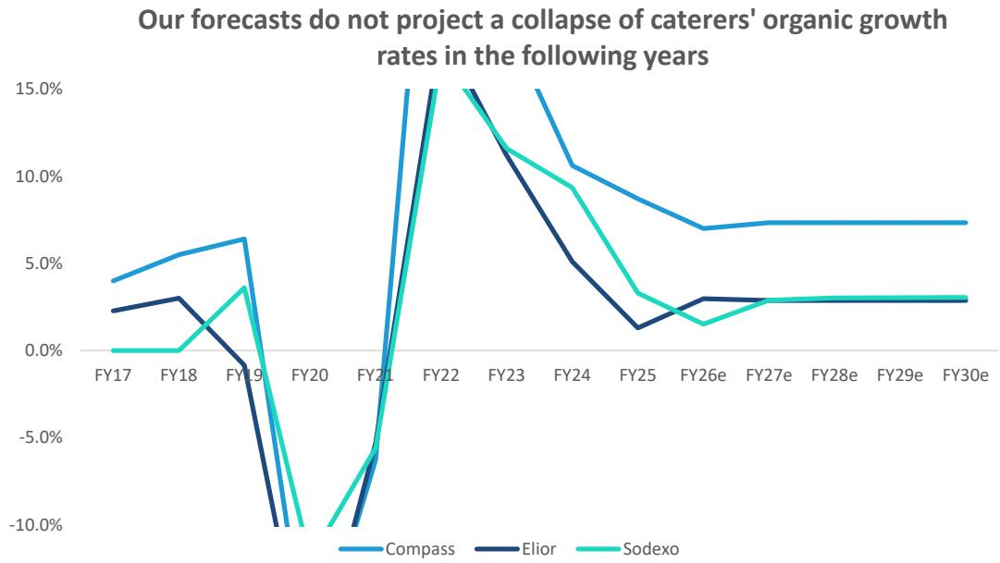

line

| Fiscal Year | Compass | Elior | Sodexo |
|-------------|---------|-------|--------|
| FY17        | 4.0%    | 2.5%  | 0.0%   |
| FY18        | 5.5%    | 3.0%  | 0.0%   |
| FY19        | 6.5%    | -1.0% | 3.5%   |
| FY20        | -10.0%  | -10.0%| -10.0% |
| FY21        | -6.0%   | -10.0%| -6.0%  |
| FY22        | 15.0%   | 15.0% | 15.0%  |
| FY23        | 15.0%   | 12.0% | 12.0%  |
| FY24        | 10.0%   | 5.0%  | 9.0%   |
| FY25        | 8.0%    | 1.0%  | 3.0%   |
| FY26e       | 7.0%    | 3.0%  | 1.5%   |
| FY27e       | 7.5%    | 3.0%  | 3.0%   |
| FY28e       | 7.5%    | 3.0%  | 3.0%   |
| FY29e       | 7.5%    | 3.0%  | 3.0%   |
| FY30e       | 7.5%    | 3.0%  | 3.0%   |

Source: Company reports, Bernstein analysis and estimates

# What could happen to the remaining 20% at risk (white-collar workers)

Compass and Sodexo generate c.40% of their revenues from Business & Industry (B&I), of which half from white-collar workers, who might be affected by Al. B&I (white- and blue-collar functions) continues to be one of the fastest-growing sectors for Compass, both globally and in North America, supported by strong net-new business and positive volume trends. This is particularly true for Compass. Over the last 4 to 5 years, its contract signings were healthy with over half of the new wins coming from first-time outsourcing. This was driven in part by the continued expansion in the tech sector, where the group has a very strong presence, with revenues growing in double-digits (14% in 1Q26).

The 20% of the portfolio relating to white-collar B&I spans tech, professional, and financial services. At Compass, over one-third of this is related to tech, where the group is benefiting from one of the largest-ever infrastructure build-outs. Elior seems less exposed to white-collar workers (c. 10% of group revenues).

EXHIBIT 23: Compass- Revenue breakdown by segment   
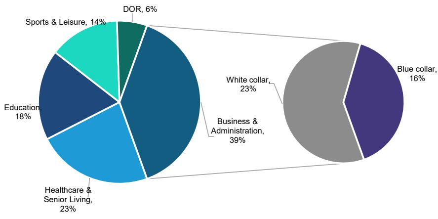

pie

| Category | Percentage (%) |
| :--- | :--- |
| DOR | 6 |
| Sports & Leisure | 14 |
| Education | 18 |
| Healthcare & Senior Living | 23 |
| Business & Administration | 39 |
| White collar | 23 |
| Blue collar | 16 |

Source: Company, Bernstein analysis

EXHIBIT 24: Sodexo - Revenue breakdown by segment   
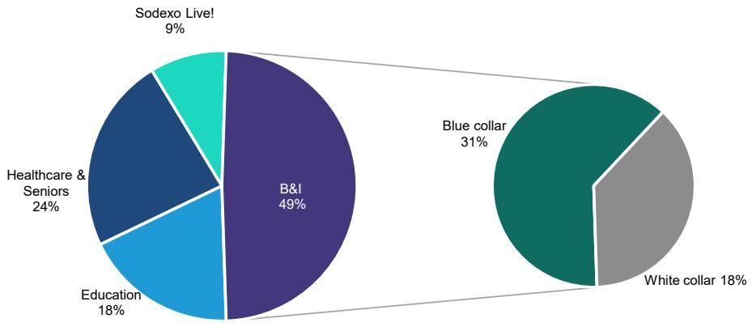

pie

| Category | Percentage (%) |
| :--- | :--- |
| Sodexo Live! | 9 |
| B&I | 49 |
| Healthcare & Seniors | 24 |
| Education | 18 |
| Blue collar | 31 |
| White collar | 18 |

Source: Company reports, Bernstein analysis

EXHIBIT 25: Elior - Revenue breakdown by segment   
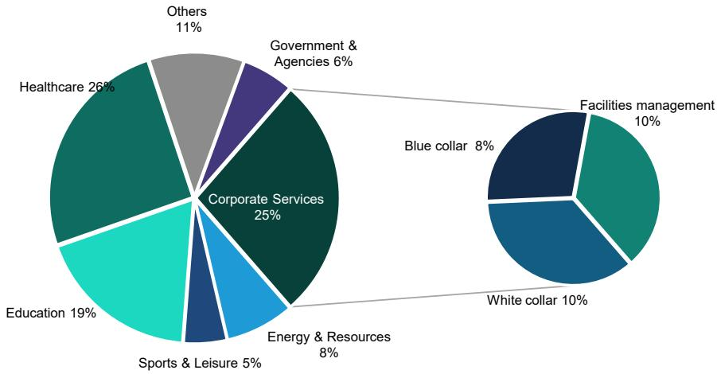

pie

| Category | Percentage (%) |
| :--- | :--- |
| Corporate Services | 25 |
| Healthcare | 26 |
| Education | 19 |
| Others | 11 |
| Government & Agencies | 6 |
| Energy & Resources | 8 |
| Sports & Leisure | 5 |
| Facilities management | 10 |
| Blue collar | 8 |
| White collar | 10 |

Source: Company reports, Bernstein analysis

# Our scenarios point to a 1% to 2% revenue impact

Increased automation might still jeopardize the existence of some jobs in caterers' B&I end-markets. Because AI is particularly effective at automating repetitive tasks, data collection and basic processing, white-collar functions appear most exposed. Thus, we expect the degree of the impact to be correlated to the size of the share of revenues derived from white-collar workers in the B&I or corporate services segments by the companies we cover.

On that basis, we have built three scenarios to project the potential impact of the development of AI on the revenues of the catering companies under our coverage. These scenarios all reflect the same pessimistic view, according to which the progress in AI adoption will be detrimental overall to the level of employment. As a matter of reference, Compass stated during its 1Q26 release that it believes entry-level roles – which are, in its view, the categories currently seen as most exposed – represent no more than 10-15% of its c.13% exposure to white-collar functions in professional services, financial services and B&I. On that basis, even if around half of those roles were ultimately at risk over the next few years, the impact would equate to only about 1-1.5% of the overall base. We therefore expect the effect to be very limited and manageable.

These assumptions are broadly consistent with those we adopted in the post-Covid-19 period, reflecting the extension of working from home and its impact on sector companies' revenues.

EXHIBIT 26: Bull case: 5% of white collar jobs are suppressed and no additional jobs are created 

<table><tr><td>Company</td><td>FY28e Revenue, €m</td><td>FY28e EBIT, €m</td><td>% WC* B&amp;I in revenue</td><td>% WC jobs suppressed</td><td>Lost business implied %</td><td>Effect on FY28e Revenue, €m</td><td>Effect on FY28e EBIT, €m</td></tr><tr><td></td><td></td><td></td><td rowspan="2">23%, 13% excluding tech sector</td><td></td><td></td><td></td><td></td></tr><tr><td>Compass</td><td>50,121</td><td>3,757</td><td>5%</td><td>-0.7%</td><td>-326</td><td>-24</td></tr><tr><td>Sodexo</td><td>25,145</td><td>1,128</td><td>18%</td><td>5%</td><td>-0.9%</td><td>-226</td><td>-10</td></tr><tr><td>Elior</td><td>6,702</td><td>236</td><td>10%</td><td>5%</td><td>-0.5%</td><td>-34</td><td>-1</td></tr></table>

Source: Bernstein analysis and estimates, \*White collar

EXHIBIT 27: Base case: 10% of white collar jobs are suppressed and no additional jobs are created 

<table><tr><td>Company</td><td>FY28e Revenue, €m</td><td>FY28e EBIT, €m</td><td>% WC B&amp;I in revenue</td><td>% WC jobs suppressed</td><td>Lost business implied %</td><td>Effect on FY28e Revenue, €m</td><td>Effect on FY28e EBIT, €m</td></tr><tr><td></td><td></td><td></td><td rowspan="2">23%, 13% excluding tech sector</td><td></td><td></td><td></td><td></td></tr><tr><td>Compass</td><td>50,121</td><td>3,757</td><td>10%</td><td>-1.3%</td><td>-652</td><td>-49</td></tr><tr><td>Sodexo</td><td>25,145</td><td>1,128</td><td>18%</td><td>10%</td><td>-1.8%</td><td>-453</td><td>-20</td></tr><tr><td>Elior</td><td>6,702</td><td>236</td><td>10%</td><td>10%</td><td>-1.0%</td><td>-67</td><td>-2</td></tr></table>

Source: Bernstein analysis and estimates

EXHIBIT 28: Bear case: 20% of white collar jobs are suppressed and no additional jobs are created 

<table><tr><td>Company</td><td>FY28e Revenue, €m</td><td>FY28e EBIT, €m</td><td>% WC B&amp;I in revenue</td><td>% WC jobs suppressed</td><td>Lost business implied %</td><td>Effect on FY28e Revenue, €m</td><td>Effect on FY28e EBIT, €m</td></tr><tr><td></td><td></td><td></td><td rowspan="2">23%, 13% excluding tech sector</td><td></td><td></td><td></td><td></td></tr><tr><td>Compass</td><td>50,121</td><td>3,757</td><td>20%</td><td>-2.6%</td><td>-1,303</td><td>-98</td></tr><tr><td>Sodexo</td><td>25,145</td><td>1,128</td><td>18%</td><td>20%</td><td>-3.6%</td><td>-905</td><td>-41</td></tr><tr><td>Elior</td><td>6,702</td><td>236</td><td>10%</td><td>20%</td><td>-2.0%</td><td>-134</td><td>-5</td></tr></table>

Source: Bernstein analysis and estimates

# CATERING AI ADOPTER

Industry gains in efficiency could offset deterioration in demand over the short term.

AI could reshape the employment market. Routine, automatable tasks could be increasingly taken over by AI, while demand could grow for workers able to deploy and manage these technologies. In our view, this transition implies an initial deterioration in labor-market conditions, potentially weighing on caterers, before a shift in the medium to long term to dynamics similar to those seen in previous major waves of productivity gains (electrification, IT, the internet), i.e. a net increase in employment. B&I-exposed catering firms could thus face modest top-line headwinds at first, before benefiting from sUBSequent expansion in the workforce as the employment structure adjusts.

Furthermore, AI represents a material operational opportunity for caterers which could partially offset eventual demand headwinds. AI-powered tools can lead to tangible improvements in operating performance and efficiency, from procurement and production to front-of-house and back-office processes.

The catering industry is particularly well positioned to capture sUBStantial AI-driven gains, as multiple high-impact applications are already designed or in development. According to Deloitte's study on AI in restaurants, generative and agentic AI can materially assist companies across core operations in the following ways.:

- Real-time inventory tracking: AI can help restaurants forecast inventory and demand, stock equipment and supplies, and cut unnecessary costs by reducing waste   
- Sales forecasting: With AI-powered predictive analytics, restaurants can quickly analyze large volumes of data to identify guest traffic patterns, detect sales trends, and make more accurate sales forecasts. AI can also be used to improve the customer proposition to optimize product mix and pricing: for example, AI can suggest an offer tailored to a BTS concert – a Korean K-pop group – rather than a Los Angeles Dodgers baseball match.   
- Recruiting and onboarding: for example in the US Compass has already streamlined the hiring process and reduced the number of recruiters.   
- Labor scheduling and deployment: Many restaurants use AI tools to simplify and enhance scheduling, resulting in more efficient labor utilization and improving their employees' experience.

- Checkout-free / frictionless retail formats. For example, Compass has launched services such as the “checkout-free store” and “grab-and-go market” through technology called “Just Walk Out”.   
- There are also many other examples in the fields of procurement, accounting, and tender offers.

Several start-ups and early-stage ventures are also addressing the subject of AI in restaurants and canteens. Kikleo, a French start-up, has raised €2.5m to develop an AI-driven solution that can detect waste, optimize stock levels, and provide helpful data to enable operators to better tailor their offerings and achieve sUBStantial cost-savings.

EXHIBIT 29: Deployment of digital in the catering sector - Compass example   
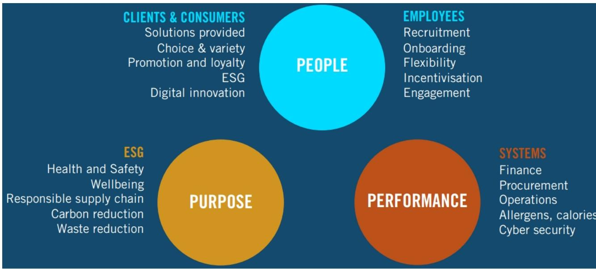

flowchart

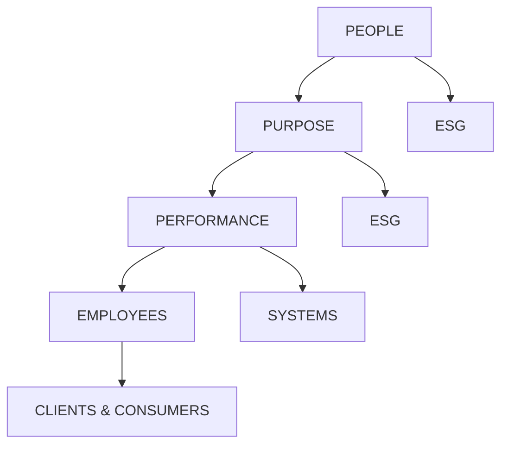

Source: Compass, Bernstein analysis

EXHIBIT 30: Compass digital development on the consumer side   
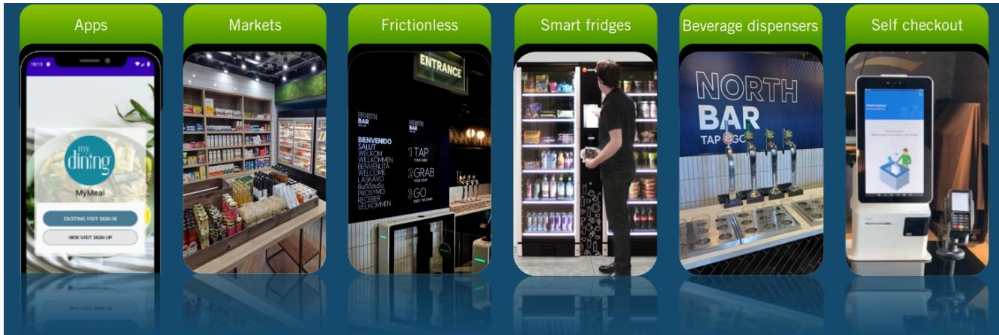

text_image

Apps
My
dining
MyMeal
EXISTING VISIT SIGN IN
NEW VISIT SIGN UP
Markets
ENTRANCE
FRICIONLESS
Smart fridges
BENNYENDO
SALUTIR
WELKOM
WELKOMEN
WELKOMUA
WELCOME
LARKMO
GURDMAY
PROSYMO
PEPPER
WELKOMEN
BIT DO UVE
BAR
TAP
GRAB
GO
NORTH
BAR
TAP & GO
Beverage dispensers
Self checkout

EXHIBIT 31: Compass example of frictionless retail with "Just Walk out"   

text_image

Check in.
Shop.
Carry est.

Source: Compass, Bernstein estimates

EXHIBIT 32: Food Hive is Sodexo's rapid and cashless payment convenience experience with a community focus   

text_image

grab & go
bengue
grab & go
grab & go
coffee & tea
groceries

Source: Sodexo, Bernstein analysis

# Catering companies didn't wait for ChatGPT to invest in data

Although the pace of AI adoption has accelerated recently, the companies under our coverage had already been implementing various strategies to integrate a digital and data-driven approach into their day-to-day operations. They had also been integrating AI into their business models. The capex trends at catering companies point to sustained IT investment, reflecting the ongoing transformation of operational capabilities aimed at efficiency gains supported by AI and IT infrastructure.

Compass has been developing a digital approach for over a decade, implementing this in its in-house capabilities via multiple tools and proprietary solutions. The group had 1,350 digital and technology members in 2022, and allocates c.25% of its capex to IT & Digital — with this percentage set to increase. Compass has, for example, estimated that automating day-to-day operations delivers tangible productivity gains, saving 10-20 hours depending on the role per month — equivalent to a cumulative 300-460 hours per month across a function or c. \$160,000 p.a.

EXHIBIT 33: Compass - CapEx FY17 - FY30e   
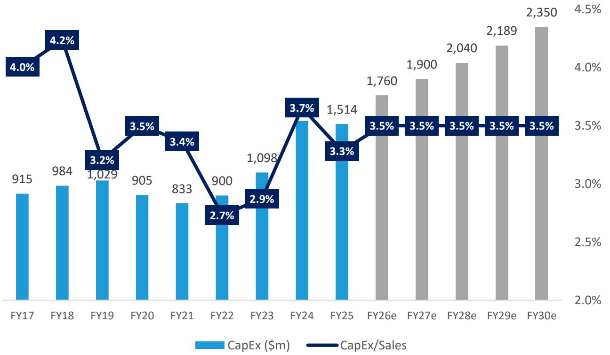

bar_line

| Year | CapEx ($m) | CapEx/Sales (%) |
| :--- | :--- | :--- |
| FY17 | 915 | 4.0 |
| FY18 | 984 | 4.2 |
| FY19 | 1,029 | 3.2 |
| FY20 | 905 | 3.5 |
| FY21 | 833 | 3.4 |
| FY22 | 900 | 2.7 |
| FY23 | 1,098 | 2.9 |
| FY24 | 1,514 | 3.7 |
| FY25 | 1,514 | 3.3 |
| FY26e | 1,760 | 3.5 |
| FY27e | 1,900 | 3.5 |
| FY28e | 2,040 | 3.5 |
| FY29e | 2,189 | 3.5 |
| FY30e | 2,350 | 3.5 |

Source: Compass Group, Bernstein analysis and estimates

Sodexo prioritizes client personalization. In a November 2025 press release, Sodexo's Chief Tech Officer Alice Guéhennec underscored the role of AI in further developing the group's operational performance, highlighting the following.

- The use of agentic AI to ensure better personalization of the end-customer experience. AI can help the end-customer to find exactly what he/she wants among large list of choices. Interestingly, Sodexo's AI approach seems to focus, first and foremost, on accompanying employees in their purchase decisions.   
- Consequently, AI can also help Sodexo take decisions in terms of menus and supply requirements by considering customer preferences. Alice Guéhennec explained that the final objective is full-scale prediction of culinary preferences through a variety of different data.

In its 2022 CMD, Sodexo highlighted the importance of digital-channel tools for most of its clients. We note, nevertheless, that while management did flag with the FY25 release that Sodexo intends to accelerate opex and capex, so far the group has invested significantly less than Compass.

EXHIBIT 34: Consumer behaviors are changing fast - Sodexo 

<table><tr><td colspan="2">Consumers want more...</td><td>Work</td><td>Heal</td><td>Learn</td><td>Play</td></tr><tr><td>...Flexibility</td><td>Services adapted to hybrid modelsWorking from home stabilizing at ~2 days/week for white collars (50% of Work consumers)</td><td>Work from home</td><td></td><td>Hybrid education in universities</td><td></td></tr><tr><td>...Personalisation</td><td>Individualized optionsBest for me food option through science and IA41% of consumers expect a food offer with a variety of affordable choices</td><td></td><td>Food as medicine</td><td></td><td>Unique &amp; emotio experiences</td></tr><tr><td>...CSR</td><td>Local production, waste reduction, transparency and traceability41% of consumers want more responsible waste management</td><td>Plant based alternative demand</td><td></td><td>Local sourcing &amp; traceability</td><td></td></tr><tr><td>...Digital</td><td>Seamless digital channelsTools enhancing food experienceNearly 4 in 10 employees mentions convenience (online ordering, delivery...) among their top 5 food choice criteria</td><td></td><td></td><td></td><td></td></tr></table>

Capital Markets Day – November 2, 2022 © Sodexo. All rights Reserved   
Source: Sodexo, Bernstein analysis

EXHIBIT 35: Sodexo - CapEx FY17 - FY30e   
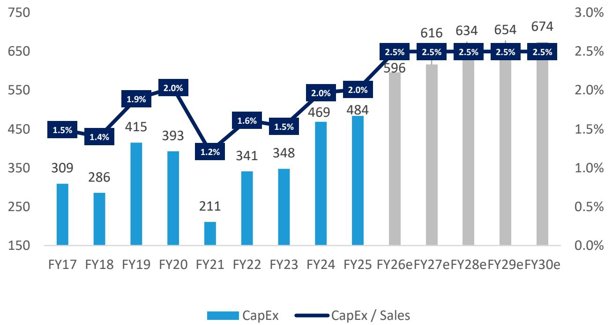

bar_line

| Fiscal Year | CapEx | CapEx / Sales (%) |
| :--- | :--- | :--- |
| FY17 | 309 | 1.5 |
| FY18 | 286 | 1.4 |
| FY19 | 415 | 1.9 |
| FY20 | 393 | 2.0 |
| FY21 | 211 | 1.2 |
| FY22 | 341 | 1.6 |
| FY23 | 348 | 1.5 |
| FY24 | 469 | 2.0 |
| FY25 | 484 | 2.0 |
| FY26e | 596 | 2.5 |
| FY27e | 616 | 2.5 |
| FY28e | 634 | 2.5 |
| FY29e | 654 | 2.5 |
| FY30e | 674 | 2.5 |

Source: Sodexo, Bernstein analysis and estimates

Elior partners with IBM for IT and AI scale and capacity. On 10 July 2025, Elior announced an collaboration with IBM to establish an "Agentic AI & Data Factory" aimed at accelerating Elior's AI transformation across its business units. Elior presented this new partnership as way of improving operating efficiency within the group's various business units and of developing the ability to bring personalized and innovative value to customers.

# BUSINESS SERVICES SECTOR NOT AFFECTED

We also cover a number of stocks, namely Elis, Bunzl, Sunbelt or Rentokil, where there is high a degree of physical action to the revenues and unless we are to consider robotics + AI, then risks of disruption appear much more long-dated.

EXHIBIT 36: Elis - Breakdown of permanent workforce by socio-professional categories - FY25   
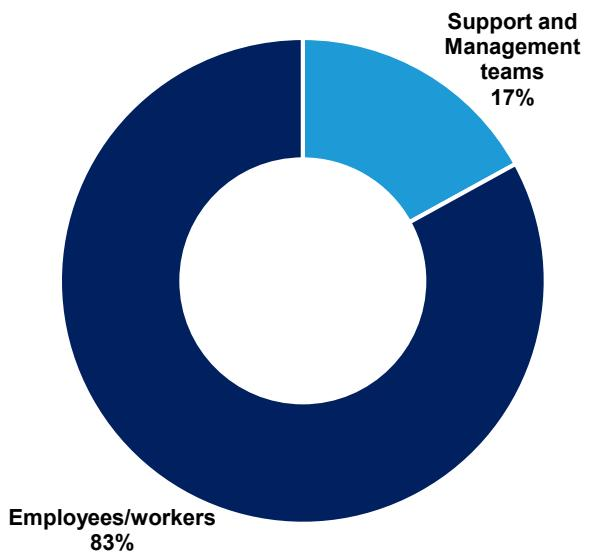

pie

| Category | Percentage (%) |
| :--- | :--- |
| Support and Management teams | 17 |
| Employees/workers | 83 |

Source: Elis, Bernstein analysis

# I. REQUIRED DISCLOSURES

References to "Bernstein" or the "Firm" in these disclosures relate to the following entities: Bernstein Institutional Services LLC (April 1, 2024 onwards), Bernstein & Co., LLC (pre April 1, 2024), Bernstein Autonomous LLP, BSG France S.A. (April 1, 2024 onwards), Bernstein (Hong Kong) Limited 盛博香港有限公司, Bernstein (Canada) Limited, Bernstein (India) Private Limited (SEBI registration no. INH000006378), Bernstein (Singapore) Private Limited, Bernstein Japan KK (サンフォード・C・バーンスタイン株式会社) and analysts employed by SG Africa Technologies & Services to produce Bernstein under a Global Services Agreement in place between Bernstein and SG.

Bernstein is part of a joint venture between SG (SG) and AllianceBernstein, L.P. (AB). Unless specifically noted otherwise, for purposes of these disclosures, references to Bernstein's “affiliates” relate to both SG and AB and their respective affiliates.

# VALUATION METHODOLOGY

This research publication covers six or more companies. For valuation methodology and other company disclosures:

Please visit: https://Bernstein-autonomous.bluematrix.com/sellside/Disclosures.action.

Or, you can also write to the Director of Compliance, Bernstein Institutional Services LLC, 245 Park Avenue, New York, NY 10167.

# RISKS

This research publication covers six or more companies. For risks and other company disclosures:

Please visit: https://Bernstein-autonomous.bluematrix.com/sellside/Disclosures.action.

Or, you can also write to the Director of Compliance, Bernstein Institutional Services LLC, 245 Park Avenue, New York, NY 10167.

# RATINGS DEFINITIONS, BENCHMARKS AND DISTRIBUTION

# EQUITY RATINGS DEFINITIONS

# Bernstein brand

The Bernstein brand rates stocks based on forecasts of relative performance for the next 12 months versus the S&P 500 for stocks listed on the U.S. and Canadian exchanges, versus the Bloomberg Europe Developed Markets Large and Mid Cap Price Return Index EUR (EDME) for stocks listed on the European exchanges and emerging markets exchanges outside of the Asia Pacific region, versus the Bloomberg Japan Large and Mid Cap Price Return Index USD (JPL) for stocks listed on the Japanese exchanges, and versus the Bloomberg Asia ex-Japan Large and Mid Cap Price Return Index (ASIAX) for stocks listed on the Asian (ex-Japan) exchanges -unless otherwise specified.

The Bernstein brand has three categories of ratings:

- Outperform: Stock will outpace the market index by more than 15 pp   
• Market-Perform: Stock will perform in line with the market index to within +/-15 pp   
• Underperform: Stock will trail the performance of the market index by more than 15 pp

Coverage Suspended: Coverage of a company under the Bernstein brand has been suspended. Ratings and price targets are suspended temporarily, are no longer current, and should therefore not be relied upon.

Not Rated: A rating assigned when the stock cannot be accurately valued, or the performance of the company accurately predicted, at the present time. The covering analyst may continue to publish research reports on the company to update investors on events and developments.

Not Covered (NC) denotes companies that are not under coverage.

Bernstein brand stock ratings are based on a 12-month time horizon.

# Autonomous brand – common stocks

The Autonomous brand rates common stocks as indicated below. As our benchmarks we use the Bloomberg Europe 500 Banks And Financial Services Index (BEBANKS) and Bloomberg Europe Dev Mkt Financials Large and Mid Cap Price Ret Index EUR (EDMFI) index for developed European banks and Payments, the Bloomberg Europe 500 Insurance Index (BEINSUR) for European insurers, the S&P 500 and S&P Financials for US banks and Payments coverage, S5LIFE for US Insurance, the S&P Insurance Select Industry (SPSIINS) for US Non-Life Insurers coverage, and the Bloomberg Emerging Markets Financials Large, Mid and Small Cap Price Return Index (EMLSF) for emerging market banks and insurers and Payments. Ratings are stated relative to the sector (not the market).

The Autonomous brand has three categories of common stock ratings:

- Outperform (OP): Stock will outpace the relevant index by more than 10 pp   
- Neutral (N): Stock will perform in line with the market index to within +/-10 pp   
• Underperform (UP): Stock will trail the performance of the relevant index by more than 10 pp

Coverage Suspended: Coverage of a company under the Autonomous research brand has been suspended. Ratings and price targets are suspended temporarily, are no longer current, and should therefore not be relied upon.

Not Rated: A rating assigned when the stock cannot be accurately valued, or the performance of the company accurately predicted, at the present time. The covering analyst may continue to publish research reports on the company to update investors on events and developments.

Those denoted as ‘Feature’ (e.g., Feature Outperform FOP, Feature Under Outperform FUP) are our core ideas.

Not Covered (NC) denotes companies that are not under coverage.

Autonomous brand common stock ratings are based on a 12-month time horizon.

# Autonomous brand – preferred stocks

The Autonomous brand has three categories of preferred stock ratings:

- Outperform (OP): The total return of the preferred instrument is expected to outperform preferred securities of other issuers operating in similar sectors or rating categories over the next six months.   
- Neutral (N): The total return of the preferred instrument is expected to perform in line with preferred securities of other issuers operating in similar sectors or rating categories over the next six months.   
- Underperform (UP): The total return of the preferred instrument is expected to underperform preferred securities of other issuers operating in similar sectors or rating categories over the next six months.

Autonomous preferred stock ratings are based on a 6-month time horizon.

# AUTONOMOUS CREDIT RESEARCH

Where this report contains investment recommendations for credit instruments, as defined in article 3(1)(35) of the Market Abuse Regulation, the information below is presented to comply with its disclosure requirements.

The report may also include reference(s) to published opinions by other Autonomous or Bernstein analysts covering the equity securities of the issuer(s) referenced herein. Please note an investment recommendation for credit instruments published by the author(s) of this report may differ from the published view of the analyst covering equity securities for the issuer(s) contained in this report and vice versa.

# CREDIT RATINGS DEFINITIONS

The Autonomous brand has three categories of credit ratings:

\- Credit Outperform (C-OP): The total return of the Reference Credit Instrument is expected to outperform the credit spread of bonds of other issuers operating in similar sectors or rating categories over the next six months.

- Credit Neutral (C-N): The total return of the Reference Credit Instrument is expected to perform in line with the credit spread of bonds of other issuers operating in similar sectors or rating categories over the next six months.   
- Credit Underperform (C-UP): The total return of the Reference Credit Instrument is expected to underperform the credit spread of bonds of other issuers operating in similar sectors or rating categories over the next six months.

Autonomous credit ratings are based on a 6-month time horizon.

A list of all investment recommendations produced by the author(s) of this report alongside credit ratings history are available upon request.

It is at the sole discretion of the Firm as to when to initiate, update and cease research coverage. The Firm has established, maintains and relies on information barriers to control the flow of information contained in one or more areas (i.e. the private side) within the Firm, and into other areas, units, groups or affiliates (i.e. public side) of the Firm

DISTRIBUTION OF EQUITY RATINGS/INVESTMENT BANKING SERVICES 

<table><tr><td>Equity Rating</td><td>Market Abuse Regulation (MAR) and FINRA Rating Category</td><td>Global Rating Distribution</td><td>Investment Banking Relationships*</td></tr><tr><td>Outperform</td><td>BUY</td><td>51.1%</td><td>16.5%</td></tr><tr><td>Market-Perform (Bernstein Brand) Neutral (Autonomous Brand)</td><td>HOLD</td><td>36.3%</td><td>17.8%</td></tr><tr><td>Underperform</td><td>SELL</td><td>12.6%</td><td>14.9%</td></tr></table>

\* These figures represent the percentage of companies within each equity rating category for which affiliates of Bernstein have provided investment banking services within the previous 12 months.
As of March 31, 2026. All figures are updated quarterly.

# PRICE CHARTS/ RATINGS AND PRICE TARGET HISTORY

This research publication covers six or more companies. For price chart and other company disclosures, please visit https://Bernstein-autonomous.bluematrix.com/sellside/Disclosures.action or you can write to the Director of Compliance, Bernstein Institutional Services LLC, 245 Park Avenue, New York, NY 10167.

Experian PLC is covered by both the Autonomous and Bernstein brands. For the research ratings and price target history please go to https://Bernstein-autonomous.bluematrix.com/sellside/Disclosures.action.

# CONFLICTS OF INTEREST

SG and/or an affiliate acted as Joint Bookrunner in Elis' bond issue (EUR 400m, 6y).

SG and/or its affiliates beneficially own 1% or more of a class of common equity securities of the following companies: Experian PLC, Intertek Group PLC and Teleperformance.

Bernstein and/or affiliates have received compensation for investment banking services in the past twelve months from Sodexo SA, Elior Group SA, Elis and Bureau Veritas SA.

Bernstein and/or affiliates have received compensation for non-investment banking securities-related products or services in the previous twelve months from the following clients: Sodexo SA, Compass Group PLC, Elior Group SA, Elis, Adecco, Bureau Veritas SA, Randstad, Teleperformance and SGS SA.

An affiliate of Bernstein has received compensation for non-investment banking securities-related products or services in the previous twelve months from the following clients: Adecco and Teleperformance.

Bernstein and/or affiliates expect to receive or intend to seek compensation for investment banking services in the next three months from Elis and Teleperformance.

Affiliates of Bernstein managed or co-managed in the past twelve months a public offering of securities of Sodexo SA, Elior Group SA, Elis and Bureau Veritas SA.

Bernstein and/or affiliates had an investment banking client relationship during the past twelve months with Sodexo SA, Elior Group SA, Elis, Bureau Veritas SA and Teleperformance.

Certain affiliates of Bernstein act as market maker or liquidity provider in the equities securities of: Sodexo SA, Compass Group PLC, Elior Group SA, Elis, Adecco, Bunzl, Bureau Veritas SA, Experian PLC, Randstad, Intertek Group PLC, Rentokil Initial, Teleperformance and SGS SA.

Certain affiliates of Bernstein act as market maker or liquidity provider in the debt securities of: Elior Group SA, Elis and Adecco.

# OTHER MATTERS

The legal entity(ies) employing the analyst(s) listed in this report, and their location, can be determined by the country code of their phone number, as follows:

+1 Bernstein Institutional Services LLC; New York, New York, USA

+44 Bernstein Autonomous LLP; London UK

+212 SG Africa Technologies & Services; Casablanca, Morocco

+33 BSG France S.A.; Paris, France

+34 BSG France S.A.; Madrid, Spain

+41 Bernstein Autonomous LLP; Geneva, Switzerland

+49 BSG France S.A.; Frankfurt, Germany

+91 Bernstein (India) Private Limited; Mumbai, India

+852 Bernstein (Hong Kong) Limited 盛博香港有限公司; Hong Kong, China

+65 Bernstein (Singapore) Private Limited; Singapore

+81 Bernstein Japan KK; Tokyo, Japan

Where this report has been prepared by research analyst(s) employed by a non-US affiliate, such analyst(s), is/are (unless otherwise expressly noted below) not registered as associated persons of Bernstein Institutional Services LLC or any other SEC-registered broker-dealer and are not licensed or qualified as research analysts with FINRA. Accordingly, such analyst(s) may not be subject to FINRA's restrictions regarding (among other things) communications by research analysts with a subject company, interactions between research analysts and investment banking personnel, participation by research analysts in solicitation and marketing activities relating to investment banking transactions, public appearances by research analysts, and trading securities held by a research analyst account.

Where this report has been prepared by research analyst(s) employed by SG Africa Technologies & Services (part of the SG group of companies), it has been prepared on behalf of a Bernstein company under a Global Services Agreement in place between Bernstein and SG.

# CERTIFICATION

Each research analyst listed in this report, who is primarily responsible for the preparation of the content of this report, certifies that all of the views expressed in this publication accurately reflect that analyst's personal views about any and all of the subject securities or issuers and that no part of that analyst's compensation was, is, or will be, directly or indirectly, related to the specific recommendations or views in this publication.

# II. ADDITIONAL GLOBAL CONFLICT DISCLOSURES

It is at the sole discretion of the Firm as to when to initiate, update and cease research coverage. The Firm has established, maintains and relies on information barriers to control the flow of information contained in one or more areas (i.e., the private side)

within the Firm, and into other areas, units, groups or affiliates (i.e., public side) of the Firm.

# III. OTHER IMPORTANT INFORMATION AND DISCLOSURES

Separate branding is maintained for “Bernstein” and “Autonomous” research products.

- Bernstein produces a number of different types of research products including, among others, fundamental analysis and quantitative analysis under both the “Autonomous” and “Bernstein” brands. Recommendations contained within one type of research product may differ from recommendations contained within other types of research products, whether as a result of differing time horizons, methodologies or otherwise. Furthermore, views or recommendations within a research product issued under one brand may differ from views or recommendations under the same type of research product issued under the other brand. The Research Ratings System for the two brands and other information related to those Rating Systems are included in the previous section.   
- Autonomous operates as a separate business unit within the following entities: Bernstein Institutional Services LLC, Bernstein Autonomous LLP, Bernstein (Hong Kong) Limited 盛博香港有限公司 and Bernstein (India) Private Limited. For information relating to “Autonomous” branded products (including certain Sales materials) please visit: www.autonomous.com. For information relating to Bernstein branded products please visit: www.Bernsteinresearch.com.

Analysts are compensated based on aggregate contributions to the research franchise as measured by account penetration, productivity and proactivity of investment ideas. No analysts are compensated based on performance in, or contributions to, generating investment banking revenues.

This report has been produced by an independent analyst as defined in Article 3 (1)(34)(i) of EU 596/2014 Market Abuse Regulation (“MAR”) and the same article of MAR as it forms part of United Kingdom domestic law by virtue of the European Union (Withdrawal) Act 2018.

To our readers in the United States: Bernstein Institutional Services LLC, a broker-dealer registered with the U.S. Securities and Exchange Commission (“SEC”) and a member of the U.S. Financial Industry Regulatory Authority, Inc. (“FINRA”) is distributing this publication in the United States and accepts responsibility for its contents. Where this material contains an analysis of debt product(s), such material is intended only for institutional investors and is not subject to the US independence and disclosure standards applicable to debt research prepared for retail investors.

Bernstein Institutional Services LLC may act as principal for its own account or as agent for another person (including an affiliate) in sales or purchases of any security which is a subject of this report. This report does not purport to meet the objectives or needs of any specific individuals, entities or accounts.

To our readers in Canada: If this publication pertains to a Canadian domiciled company, it is being distributed in Canada by Bernstein (Canada) Limited, which is licensed and regulated by the Canadian Investment Regulatory Organization. If the publication pertains to a non-Canadian domiciled company, it is being distributed by Bernstein Institutional Services LLC, which is licensed and regulated by both the SEC and FINRA, into Canada under the International Dealers Exemption.

This document may not be passed onto any person in Canada unless that person qualifies as "permitted client" as defined in Section 1.1 of NI 31-103.

To our readers in Brazil: This report has been prepared by Bernstein Institutional Services LLC, and Banco BTG Pactual S.A. ("BTG") is responsible for the distribution of this report in Brazil.

To readers in the United Kingdom: This publication has been issued or approved for issue in the United Kingdom by Bernstein Autonomous LLP, authorised and regulated by the Financial Conduct Authority and located at 60 London Wall, London EC2M 5SH, +44 (0)20-7170-5000. Registered in England & Wales No OC343985.

This document is for distribution only to persons who (i) have professional experience in matters relating to investments falling within Article 19(5) of the Financial Services and Markets Act 2000 (Financial Promotion) Order 2005 (as amended, the “Financial Promotion Order”), (ii) are persons falling within Article 49(2)(a) to (d) (“high net worth companies, unincorporated associations, etc.”) of the Financial Promotion Order, (iii) are outside the United Kingdom, or (iv) are persons to whom an invitation or inducement to engage in investment activity (within the meaning of section 21 of the FSMA) in connection with the issue or sale of any securities may otherwise lawfully be communicated or caused to be communicated (all such persons together being referred to as “relevant persons”). This document is directed only at relevant persons and must not be acted on or relied on by persons who are not relevant persons. Any investment or investment activity to which this document relates is available only to relevant persons and will be engaged in only with relevant persons.

To our readers in the member states of the EEA: This publication is being distributed by BSG France SA, which is authorised and regulated by the Autorité de Contrôle Prudentiel et de Résolution (ACPR) and Autorité des Marchés Financiers (AMF).

To our readers in Hong Kong: This publication is being distributed in Hong Kong by Bernstein (Hong Kong) Limited 盛博香港有限公司, which is licensed and regulated by the Hong Kong Securities and Futures Commission (Central Entity No. AXC846) to carry out Type 4 (Advising on Securities) regulated activities and subject to the licensing conditions mentioned in the SFC Public Register (https://www.sfc.hk/publicregWeb/corp/AXC846/details)). This publication is solely for professional investors, as defined in the Securities and Futures Ordinance (Cap. 571). The purpose of this report is solely to provide an analysis of the issuers referred to in this report and is not intended for any purpose contrary to the laws of Hong Kong.

To our readers in Singapore: This publication is being distributed in Singapore by Bernstein (Singapore) Private Limited, only to accredited investors or institutional investors, as defined in the Securities and Futures Act 2001 of Singapore ("SFA"). Recipients in Singapore should contact Bernstein (Singapore) Private Limited in respect of matters arising from, or in connection with, this publication. Bernstein (Singapore) Private Limited is regulated by the Monetary Authority of Singapore and licensed under the SFA as a capital markets services licence holder for dealing in capital markets products that are securities and collective investment schemes and an exempt financial adviser for advising on, issuing and promulgating analyses and reports on securities. Bernstein (Singapore) Private Limited is registered in Singapore with Company Registration No. 20213710W and located at One Raffles Quay, #27-11 South Tower, Singapore 048583, +65-6230-4612.

To our readers in the People's Republic of China: The securities referred to in this document are not being offered or sold and may not be offered or sold, directly or indirectly, in the People's Republic of China (for such purposes, not including the Hong Kong and Macau Special Administrative Regions or Taiwan, the "PRC") in contravention of any applicable laws of the PRC.

This document does not constitute an offer to sell or the solicitation of an offer to buy any securities in the PRC to any person to whom it is unlawful to make the offer or solicitation in the PRC.

We do not represent that this document may be lawfully distributed, or that any securities may be lawfully offered, in compliance with any applicable registration or other requirements in the PRC, or pursuant to an exemption available thereunder, or assume any responsibility for facilitating any such distribution or offering. In particular, no action has been taken by us which would permit a public offering of any securities or distribution of this document in the PRC. Accordingly, the securities are not being offered or sold within the PRC by means of this document or any other document. Neither this document nor any advertisement or other offering material may be distributed or published in the PRC, except under circumstances that will result in compliance with any applicable laws and regulations.

To our readers in Japan: This publication is being distributed in Japan by Bernstein Japan KK (サンフォード・C・バーンスタイン株式会社), which is registered in Japan as a Financial Instruments Business Operator with the Kanto Local Finance Bureau (registration number: The Director-General of Kanto Local Finance Bureau (FIBO) No.3387) and regulated by the Financial Services Agency. It is also a member of Japan Investment Advisers Association. This publication is solely for qualified institutional investors in Japan only, as defined in Article 2, paragraph (3), items (i) of the Financial Instruments and Exchange Act.

For the institutional client readers in Japan who have been granted access to the Bernstein website by Daiwa Group Inc. ("Daiwa"), your access to this document should not be construed as meaning that Bernstein is providing you with investment advice for any purposes. Whilst Bernstein has prepared this document, your relationship is, and will remain with, Daiwa, and Bernstein has neither any contractual relationship with you nor any obligations towards you.

To our readers in Australia: Bernstein (Hong Kong) Limited 盛博香港有限公司 is responsible for distributing research in Australia. It is regulated by the Securities and Exchange Commission under U.S. laws, by the Financial Conduct Authority under U.K. laws, which differs from Australian laws. Bernstein (Hong Kong) Limited 盛博香港有限公司 is exempt from the requirement to hold an Australian financial services license under the Corporations Act 2001 in respect of the provision of the following financial services to wholesale clients:

• providing financial product advice;   
• dealing in a financial product;   
• making a market for a financial product; and   
• providing a custodial or depository service.

To our readers in India: This publication is being distributed in India by Bernstein (India) Private Limited (SCB India) which is licensed and regulated by Securities and Exchange Board of India ("SEBI") as a research analyst entity under the SEBI (Research Analyst) Regulations, 2014, having registration no. INH000006378 and as a stock broker having registration no. INZ000213537. SCB India is currently engaged in the business of providing research and stock broking services. Please refer to

www.Bernsteinresearch.in for more information.

\- SCB India is a Private limited company incorporated under the Companies Act, 2013, on April 12, 2017 bearing corporate identification number U65999MH2017FTC293762, and registered office at Level 3A, 4th Floor, First International Financial Centre, Plot Nos C-54 and C-55, G Block, Near CBI Office, Bandra Kurla Complex, Bandra (East), Mumbai 400098, Maharashtra, India (Phone No: +91-22-68421401).

\- For details of Associates (i.e., affiliates/group companies) of SCB India, kindly email MUM-Bernstein-InCompliance@Bernsteinsg.com.

• SCB India does not have any disciplinary history as on the date of this report.

\- Except as noted above, SCB India and/or its Associates (i.e., affiliates/group companies), the Research Analysts authoring this report, and their relatives

• do not have any financial interest in the subject company   
• do not have actual/beneficial ownership of one percent or more in securities of the subject company;   
- is not engaged in any investment banking activities for Indian companies, as such;

• have not managed or co-managed a public offering in the past twelve months for any Indian companies;

\- have not received any compensation for investment banking services or merchant banking services from the subject company in the past 12 months;

• have not received compensation for brokerage services from the subject company in the past twelve months;

\- have not received any compensation or other benefits from the subject company or third party related to the specific recommendations or views in this report; and

\- do not currently, but may in the future, act as a market maker in the financial instruments of the companies covered in the report.

\- do not have any conflict of interest in the subject company as of the date of this report.

\- Except as noted above, the subject company has not been a client of SCB India during twelve months preceding the date of distribution of this research report. Neither SCB India nor its Associates (i.e., affiliates/group companies) have received compensation for products or services other than investment banking, merchant banking or brokerage services from the subject company in the past twelve months.

\- The principal research analyst(s) who prepared this report, members of the analysts' team, and members of their households are not an officer, director, employee or advisory board member of the companies covered in the report.

\- Our Compliance officer / Grievance officer is Ms. Rupal Talati, who can be reached at +91-22-68421451, or MUM-Bernstein-InCompliance@Bernsteinsg.com / Scbin-investorgrievance@Bernsteinsg.com

\- The Research investor charter and Terms & Conditions of SCB India are available on its website and may be accessed at Bernstein (India) Private Limited (https://Bernsteinresearch.in/) for your reference.

\- Disclaimer: Registration granted by SEBI, and certification from NISM, is in no way a guarantee of performance of the intermediary or provide any assurance of returns to investors. Investments in securities market are subject to market risks. Read all the related documents carefully before investing.

To our readers in Switzerland: This document is provided in Switzerland by or through Bernstein Autonomous LLP, and is provided only to qualified investors as defined in article 10 of the Swiss Collective Investment Scheme Act (“CISA”) and related provisions of the Collective Investment Scheme Ordinance and in strict compliance with applicable Swiss law and regulations. The products mentioned in this document may not be suitable for all types of investors. This document is based on the Directives on the Independence of Financial Research issued by the Swiss Bankers Association (SBA) in January 2008.

To our readers in the Middle East: Bernstein Autonomous LLP, DIFC branch has its principal office at Gate Village 06, DIFC, Dubai, UAE. Bernstein Autonomous LLP, DIFC branch is regulated by the Dubai Financial Services Authority (DFSA) with the registration number CL10040 and is provisioned for Arranging Deals in Investments and Advising on Financial Products. All communications and services are directed at Professional Clients and Market Counterparties only (as defined in the DFSA rulebook). Persons other than Professional Clients and Market Counterparties, such as Retail Clients, are not the intended recipients of our communications or services.

# LEGAL

All research publications are disseminated to our clients through posting on the firm's password protected websites, Bernsteinresearch.com and autonomous.com. Certain, but not all, research publications are also made available to clients through third-party vendors or redistributed to clients through alternate electronic means as a convenience.

This publication has been published and distributed in accordance with the Firm's policy for management of conflicts of interest in investment research, a copy of which is available from Bernstein Institutional Services LLC, Director of Compliance, 245 Park Avenue, New York, NY 10167. Additional disclosures and information regarding Bernstein's business are available on our website www.Bernsteinresearch.com.

The securities described herein may not be eligible for sale in all jurisdictions or to certain categories of investors where that permission profile is not consistent with the licenses held by the entities noted herein. This document is for distribution only as may be permitted by law. This publication is not directed to, or intended for distribution to or use by, any person or entity who is a Citizen or resident of, or located in any locality, state, country or other jurisdiction where such distribution, publication, availability or use would be contrary to law or regulation or which would subject any of the entities referenced herein or any of their sUBSidiaries or affiliates to any registration or licensing requirement within such jurisdiction. This publication is based upon public sources we believe to be reliable, but no representation is made by us that the publication is accurate or complete. We do not undertake to advise you of any change in the reported information or in the opinions herein. This publication was prepared and issued by entity referred to herein for distribution to eligible counterparties or professional clients. This publication is not an offer to buy or sell any security, and it does not constitute investment, legal or tax advice. The investments referred to herein may not be suitable for you. Investors must make their own investment decisions in consultation with their professional advisors in light of their specific circumstances. The value of investments may fluctuate, and investments that are denominated in foreign currencies may fluctuate in value as a result of exposure to exchange rate movements. Information about past performance of an investment is not necessarily a guide to, indicator of, or assurance of, future performance.

This report is directed to and intended only for our clients who are “eligible counterparties”, “professional clients”, “institutional investors” and/or “professional investors” as defined by the aforementioned regulators, and must not be redistributed to retail clients as defined by the aforementioned regulators. Retail clients who receive this report should note that the services of the entities noted herein are not available to them and should not rely on the material herein to make an investment decision. The result of such act will not hold the entities noted herein liable for any loss thus incurred as the entities noted herein are not registered/authorised/licensed to deal with retail clients and will not enter into any contractual agreement/arrangement with retail clients. This report is provided subject to the terms and conditions of any agreement that the clients may have entered into with the entities noted herein. All research reports are disseminated on a simultaneous basis to eligible clients through electronic publication to our client portal.

The information in this report was prepared by Bernstein solely for the internal business use of our clients. Clients may store, display, analyze, reformat and print the information in this report for this limited use only. Clients may not copy, alter, create derivative works, resell, reverse engineer, commercially exploit, share or distribute any part of the information contained herein for any purpose without Bernstein's express written consent. These restrictions include extracting data or using the content to develop indices or other products. Further, you may not use this report, or any portion of this report, to train or finetune any third-party machine learning or artificial intelligence system, or as a prompt or input into any such system. You also may not, without Bernstein's express written consent, do any of the foregoing in connection with your own internal machine learning or artificial intelligence system.

Bernstein may use artificial intelligence tools in the preparation of its materials. Any such materials are reviewed by Bernstein's research analysts prior to publication.

This report has been prepared for information purposes only and is based on current public information that we consider reliable, but the entities noted herein do not warrant or represent (express or implied) as to the sources of information or data contained herein are accurate, complete, not misleading or as to its fitness for the purpose intended even though the entities noted herein rely on reputable or trustworthy data providers, it should not be relied upon as such. Opinions expressed are the author(s)' current opinions as of the date appearing on the material only and we do not undertake to advise you of any change in the reported information or in the opinions herein.

This publication was prepared and issued by the entity referred to herein for distribution to eligible counterparties or professional clients. The information in this report is intended for general circulation and does not constitute an offer to buy or sell any security, investment, legal or tax advice nor a personal recommendation, as defined by any of the aforementioned regulators. It does not take into account the particular investment objectives, financial situations, or needs of individual investors. The report has not been reviewed by any of the aforementioned regulators and does not represent any official recommendation from the aforementioned regulators. The investments referred to herein may not be suitable for you. Investors must make their own investment decisions in consultation with advice sought from a financial adviser regarding the suitability of the investment product, taking into account the specific investment objectives, financial situation or particular needs of any recipient of the recommendation, before the recipient makes a commitment to purchase the investment product.

The analysis contained herein is based on numerous assumptions. Different assumptions could result in materially different results. The information in this report does not constitute, or form part of, any offer to sell or issue, or any offer to purchase or sUBScribe for shares, or to induce engage in any other investment activity. The value of any securities or financial instruments mentioned in this report may fluctuate subject to market conditions. Information about past performance of an investment is not necessarily a guide to, indicative of, or assurance of future performance. Estimates of future performance mentioned by the research analyst in this report are based on assumptions that may not be realized due to unforeseen factors like market volatility/fluctuation. In relation to securities or financial instruments denominated in a foreign currency other than the clients' home currency, movements in exchange rates will have an effect on the value, either favorable or unfavorable. Before acting on any recommendations in this report, recipients should consider the appropriateness of investing in the subject securities or financial instruments mentioned in this report and, if necessary, seek for independent professional advice.

The securities described herein may not be eligible for sale in all jurisdictions or to certain categories of investors where that permission profile is not consistent with the licenses held by the entities noted herein. This document is for distribution only as may be permitted by law. It is not directed to, or intended for distribution to or use by, any person or entity who is a Citizen or resident of or located in any locality, state, country or other jurisdiction where such distribution, publication, availability or use would be contrary to law or regulation or would subject the entities noted herein to any regulation or licensing requirement within such jurisdiction.

Source: Bloomberg Index Services Limited. BLOOMBERG® is a trademark and service mark of Bloomberg Finance L.P. and its affiliates (collectively “Bloomberg”). Bloomberg or Bloomberg’s licensors own all proprietary rights in the Bloomberg Indices. Neither Bloomberg nor Bloomberg’s licensors approves or endorses this material, or guarantees the accuracy or completeness of any information herein, or makes any warranty, express or implied, as to the results to be obtained therefrom and, to the maximum extent allowed by law, neither shall have any liability or responsibility for injury or damages arising in connection therewith.

No part of this material may be reproduced, distributed or transmitted or otherwise made available without prior consent of the entities noted herein. Copyright Bernstein Institutional Services LLC Bernstein Autonomous LLP, BSG France S.A., Bernstein (Hong Kong) Limited 盛博香港有限公司, Bernstein (Canada) Limited, Bernstein (India) Private Limited (SEBI registration no. INH000006378), Bernstein (Singapore) Private Limited and Bernstein Japan KK (サンフォード・C・バーンスタイン株式会社). All rights reserved. The trademarks and service marks contained herein are the property of their respective owners. Any unauthorized use or disclosure is strictly prohibited. The entities noted herein may pursue legal action if the unauthorized use results in any defamation and/or reputational risk to the entities noted herein and research published under the Bernstein and Autonomous brands.