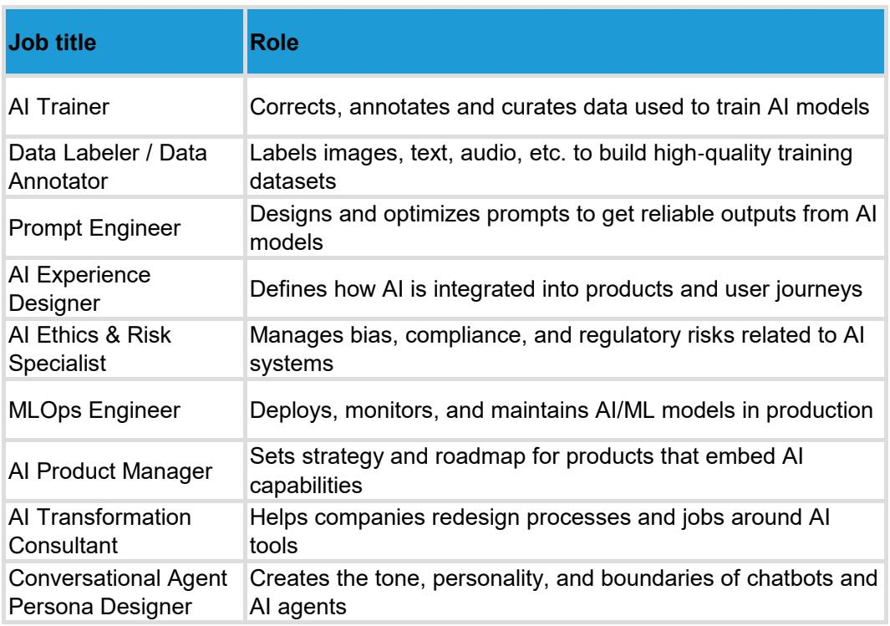

# AI对商业服务业的冲击被高估了：真正的故事是生产力重构，而非就业毁灭

过去16个月，欧洲商业服务板块经历了显著的估值回调。Teleperformance下跌25%，Adecco和Experian跌幅超过20%。市场的主流叙事是：AI正在自动化白领工作，这将摧毁这些公司的收入基础。但一份来自某外资投行的深度研报提出了相反的判断——市场可能过度定价了“AI毁灭就业”的风险，却低估了这些企业将AI转化为生产力的能力。

这份研报的核心主张是：AI对商业服务业的影响不是简单的需求萎缩，而是收入结构、定价模式和成本曲线的重塑。对于投资者而言，真正的机会不在于避开AI暴露度高的公司，而在于识别哪些企业有能力把AI从“威胁”转化为“护城河”。

## 1. 历史证据不支持“AI大规模消灭就业”的极端叙事

市场对AI的恐惧很大程度上源于对“结构性失业”的假设。但研报引用了Adecco的研究数据：在其全球领先的职业转型业务中，仅有1.4%的裁员直接归因于AI，而12%的裁员中AI被列为影响因素之一。更关键的是，在这12%的案例中，企业将AI列为裁员理由更多是出于利益相关者沟通的需要，AI的实际决策权重可能微乎其微。

历史规律同样不支持极端叙事。研报展示了1960年至2016年间劳动生产率和就业增长的关系：在美国，年度视角下两者正相关的概率约为80%，十年视角下这一概率接近100%。电气化、IT革命和互联网浪潮都曾引发“工作消失”的恐慌，但最终结果是就业的再分配而非净减少。

这意味着什么？市场可能混淆了“任务自动化”和“岗位消灭”。AI更可能改变特定岗位的工作内容，而非让整个职业消失。对于商业服务公司而言，真正的问题是它们能否在任务结构变化中保持对客户的价值主张。

## 2. 不同子行业的AI暴露度高度分化，不能一概而论

研报对覆盖的14家公司进行了系统性的AI影响评估，结论是影响幅度和方向差异巨大。这种分化是理解投资机会的关键。

最脆弱的无疑是Teleperformance和Experian。Teleperformance拥有约44.7万员工，其客户服务中心业务高度依赖人工处理标准化流程。AI自动化直接威胁其收入计量模式——如果AI替代了人工坐席，公司按坐席数量收费的基础就会动摇。研报假设其中期增长框架将低于管理层指引，这意味着市场对其增长预期的下调可能尚未充分反映。

但即便是这两家公司，情况也并非一边倒的利空。Teleperformance的股价已经下跌44%，当前估值隐含了极为悲观的预期。如果公司能够将AI工具转化为增值服务（例如AI训练、系统集成咨询），收入模型可能从“按人头收费”转向“按价值收费”。这个转型能否成功，是当前估值中最大的未解变量。

另一端是Rentokil和Bunzl这样的公司。它们的业务核心是物理服务——除虫、卫生、设备维护。这些工作的物理属性赋予了它们对AI的“免疫力”。研报对Rentokil维持Outperform评级，目标价576便士，隐含约21%的上行空间。这不是因为Rentokil在AI方面有什么特别优势，而是因为市场过度恐慌时，这类“免疫型”资产被错误地一起抛售了。

## 3. 餐饮服务运营商：AI既是需求风险，也是成本对冲

餐饮服务（catering）是商业服务业中一个容易被忽视的AI暴露领域。Compass、Sodexo和Elior这类公司的收入与客户企业的员工数量正相关。如果AI导致白领岗位缩减，这些公司的潜在市场（TAM）就会收缩。

但研报的测算显示，这种需求风险的幅度被高估了。其模型假设AI对餐饮服务收入的最大负面影响约为1-2%，同时AI还能带来运营效率的提升——例如通过智能排班减少人力浪费、通过需求预测优化食材采购、通过自动化简化后台流程。这些效率提升可以在很大程度上对冲需求端的负面影响。

这里有一个重要的二阶效应：如果AI确实提升了客户企业的生产率，这些企业的盈利能力改善反而可能增加对员工福利（包括餐饮服务）的支出。换句话说，AI对餐饮服务的影响可能是“量减价升”而非“量价齐跌”。这种可能性在市场的简单线性推演中几乎被完全忽略了。

## 4. 人力资源服务公司可能是最大的预期差

在商业服务板块中，人力资源服务公司（Adecco、Randstad）可能是市场预期与实际情况偏差最大的子行业。市场认为AI将减少临时工需求，尤其是白领临时工。但研报提出了一个反直觉的论点：AI创造的就业机会可能超过其消灭的。

Randstad的数据显示，当前其填补的岗位中，60-70%在其65年前成立时根本不存在。Gartner的预测更为激进：自动化软件到2033年将创造5亿个新工作岗位。这些新岗位将集中在AI系统开发、模型训练、数据标注、用户再培训、系统集成和迁移管理等领域——而这些恰恰是人力资源公司可以参与的服务环节。

更重要的是，Adecco和Randstad的核心业务是蓝领临时工，而非白领。蓝领工作的物理属性使其对AI自动化的免疫力远高于市场假设。研报对这两家公司维持Outperform评级，隐含的上行空间分别高达70%和84%。如果市场开始重新定价AI对人力资源服务的影响，这些公司的估值修复空间可能是板块中最大的。

## 5. 报告尚未完全回答的关键问题：竞争优势的可持续性

尽管研报提供了富有洞察力的分析框架，但有一个关键问题它没有完全回答：当AI工具变得普及时，商业服务公司的竞争优势还能持续吗？

以Teleperformance为例，如果AI可以自动处理大部分客户服务查询，那么客户企业可能会选择直接购买AI软件，而不是外包给Teleperformance。即使Teleperformance自己部署AI，它如何保证自己不会被软件公司或科技巨头绕过？这个“中介被解中介化”的风险，在研报中只是被提及而没有深入分析。

同样，对于Experian，AI可能降低数据分析和信用评估的进入门槛，导致更多竞争者涌入。研报承认Experian的中期有机增长预期低于市场共识，但没有充分展开这种竞争加剧对估值倍数的影响。

这些未解问题恰恰是深度研究可以创造价值的领域。投资者需要追问：哪些商业服务公司的护城河来自规模效应和客户粘性（这些可能被AI增强），哪些来自信息不对称（这些可能被AI削弱）？

## 6. 投资者的行动框架：从“AI暴露度”到“AI转化力”

基于研报的分析，我们可以提炼出一个更精细的投资框架。传统上，市场用“AI暴露度”来区分公司——暴露度高的是输家，暴露度低的是赢家。但这个框架过于粗糙。更有效的框架应该是评估公司的“AI转化力”——即它能否将AI从成本中心转化为收入增长引擎。

高转化力的典型是Compass和Rentokil。它们的业务具有物理属性，AI不会直接替代其核心服务，但可以显著改善运营效率。研报维持Compass的Outperform评级，目标价38.7美元，隐含约16%的上行空间。

低转化力但已充分定价的是Teleperformance。市场已经将其估值压缩至极低水平，但公司能否成功转型仍不确定。这里需要区分“价值陷阱”和“深度价值”——前者是业务模式被永久性破坏但估值尚未反映，后者是市场过度悲观但公司有能力适应。

最有趣的是中间地带——Adecco和Randstad这类公司。市场对它们的AI风险定价可能过高，因为它们被错误地归入“白领自动化受害者”类别，而实际上它们的业务结构对AI有天然防御力。如果市场开始纠正这一错误认知，估值修复的空间可能是最大的。

---

这份研报的价值不在于给出了确切的答案，而在于提供了一个更精细的分析框架。它告诉我们，AI对商业服务业的影响不是均匀的，不是线性的，也不是单向的。真正的投资机会在于识别哪些公司有能力把生产力提升转化为自己的竞争优势，而不是被动承受行业结构的改变。

关于这些公司具体的AI转型路径、估值敏感度分析以及不同情景下的概率权重，研报中有更详细的图表和测算。这些内容无法在一篇导读中完整呈现，但它们是做出投资决策不可或缺的拼图。

欢迎来星球微信群里继续讨论——我们会在群内分享完整的研报原文和原始图表，并围绕上述未解问题展开更深入的拆解。

Personal reading notes and learning share only. Not investment advice.

