# Oil Tracker: US Gasoline Market Tightening; Global April Deficit May Be Less Large Than Expected

- Prompt Brent/WTI crude nearby futures increased by 5/7% week-over-week to \$105/101 as flows through the Strait of Hormuz remained very low (Exhibit 5) and on limited signs of progress on a US-Iran deal.   
The US gasoline market has become very tight, with inventories drawing at a rapid average pace of 0.7mb/d since April 1st to 5% below their historical seasonal median this week (Exhibit 1).

☐ This has been driven by a combination of:

- Surging net exports demand. US gasoline net exports are up 0.34mb/d year-over-year (4-week average) (Exhibit 8).   
- Resilient domestic demand. Gasoline demand is resilient at just 0.2mb/d below its year-ago level (Exhibit 20), and we are now entering the summer driving season.   
- Price incentives to shift production to distillates. Strong jet fuel and diesel margins are incentivizing refineries to increase yields of those products.

☐ Wholesale gasoline prices in the US are approximately 15% (\$21/bbl) higher than in Asia and Europe (Exhibit 1), and US retail prices are just \$0.5/gal below their all-time high (Exhibit 16).   
☐ While not our base case, the probability of US oil export restrictions likely rises with US retail gasoline prices.

The IEA estimates in its latest Oil Market Report (OMR) an April deficit of 5.3mb/d, suggesting that the deficit may be less large than we estimated last month (Exhibit 2), driven by:

☐ Slightly lower IEA demand. Since the beginning of the crisis, the IEA has cumulatively (May - Feb OMR) downgraded its estimate of April demand by 3.1mb/d to 100.4mb/d (vs. a slightly smaller downgrade of 2.9mb/d in our balance).

- By product: Net cumulative downgrades by the IEA were largest (in mb/d terms) for LPG and ethane (11%), naphtha (13%), and jet and kerosene (7%) (Exhibit 3), for which we have also been seeing the highest risks of scarcity of supply.   
- By region: Net cumulative downgrades were largest for the Middle East (11%), China (5%), EM Asia ex China ex India (5%), and OECD

# Alexandra Paulus

+1(212)902-7111

alexandra.paulus@gs.com

GS & Co. LLC

# Daan Struyven

+1(212)357-4172

daan.struyven@gs.com

GS & Co. LLC

# Yulia Zhestkova Grigsby

+1(646)446-3905

yulia.grigsby@gs.com

GS & Co. LLC

# Filippo Cuscito

+44(20)7051-9073

filippo.cuscito@gs.com

GS International

Asia Oceania (7%) (Exhibit 3). Notably, the IEA upgraded US demand from last month's OMR by 0.5mb/d on resilient diesel and gasoline demand.

☐ Less large IEA drop in Middle East Supply. The IEA estimates Gulf (defined as Iran, Iraq, Kuwait, Qatar, Saudi Arabia, UAE) crude supply in April at 15.0mb/d, which is 4.0mb/d higher than our balance estimate (11.0mb/d) and 1.2mb/d higher than OPEC secondary sources (13.8mb/d) $^{1}$ .

\- The IEA supply beat relative to our balance estimate was driven primarily by Iran and the UAE, likely reflecting less binding storage constraints than expected due to untrackable storage capacity.

The IEA reports that SPR releases from IEA countries averaged 2.1mb/d in April (but picked up significantly in the second half of the month), which is in line with our tracking. This has been a significantly larger offset for crude than for refined products—of the 90mb of total government inventories released since March 11th, 82mb are crude oil, while only 8mb are refined products.   
US production in 2026Q1 also surprised to the upside, with the modest beats concentrated in oil production by E&Ps (+2.1%) and liquids production by majors (+1.3%) (Exhibit 4).

# Charts of the Day

Exhibit 1: US Gasoline Inventories Have Drawn Sharply to 5% Below The Historical Seasonal Median; Wholesale Gasoline Prices Are 15% (\$21/bbl) Higher in the US Than in Asia/EU   
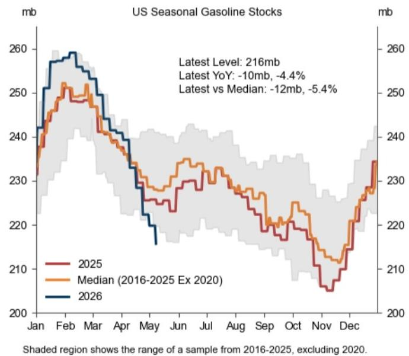

line

| Month | 2025 (mb) | Median (2016-2025 Ex 2020) (mb) | 2026 (mb) |
|-------|-----------|----------------------------------|-----------|
| Jan   | ~235      | ~235                             | ~240      |
| Feb   | ~250      | ~250                             | ~260      |
| Mar   | ~245      | ~245                             | ~255      |
| Apr   | ~235      | ~235                             | ~245      |
| May   | ~225      | ~225                             | ~230      |
| Jun   | ~230      | ~230                             | ~235      |
| Jul   | ~235      | ~235                             | ~240      |
| Aug   | ~230      | ~230                             | ~235      |
| Sep   | ~225      | ~225                             | ~230      |
| Oct   | ~215      | ~215                             | ~220      |
| Nov   | ~205      | ~205                             | ~210      |
| Dec   | ~235      | ~235                             | ~240      |

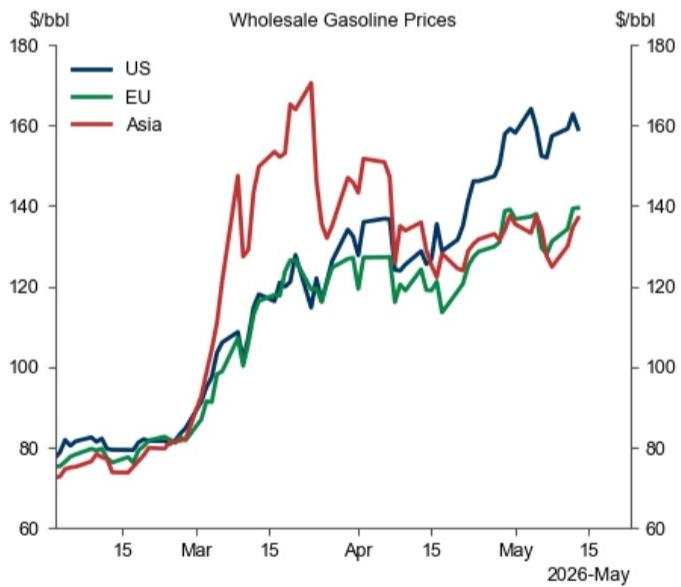

line

| Date       | US   | EU   | Asia |
| ---------- | ---- | ---- | ---- |
| 2026-May   | 160  | 140  | 130  |

Source: DOE, Platts, GS Global Investment Research

Exhibit 2: Averaging Across Estimates Suggests That the Oil Market Has Been in a Deficit of 7-8mb/d Since March 1st   
Average Global Oil Deficit Since March 1   
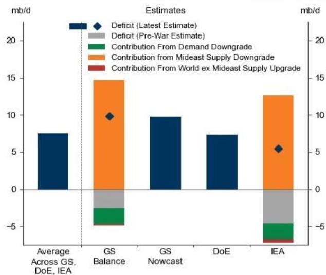

bar

| Category           | Deficit (Latest Estimate) | Deficit (Pre-War Estimate) | Contribution From Demand Downgrade | Contribution from Mideast Supply Downgrade | Contribution From World ex Mideast Supply Upgrade |
| ------------------ | ------------------------- | -------------------------- | ----------------------------------- | ------------------------------------------ | ------------------------------------------------- |
| Average Across GS, DoE, IEA | 7.5                       | -                          | -                                   | -                                          | -                                                 |
| GS Balance         | 10.0                      | 2.0                        | -3.0                                | 14.0                                       | -                                                 |
| GS Nowcast         | 10.0                      | -                          | -                                   | -                                          | -                                                 |
| DoE                | 7.5                       | -                          | -                                   | -                                          | -                                                 |
| IEA                | 5.0                       | 3.0                        | -3.0                                | 12.5                                       | -1.0                                              |

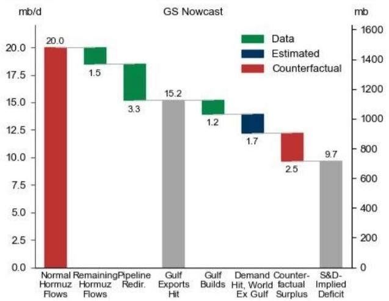

bar

| Category | Data (mb/d) | Estimated (mb/d) | Counterfactual (mb/d) |
| :--- | :--- | :--- | :--- |
| Normal Hormuz Flows | 20.0 | | 20.0 |
| Remaining Hormuz Flows | 1.5 | | 1.5 |
| Pipeline Redir. | 3.3 | | 3.3 |
| Gulf Exports Hit | 15.2 | | 15.2 |
| Gulf Builds | 1.2 | | 1.2 |
| Demand Hit, World Ex Gulf | | 1.7 | |
| Counter-factual Surplus | | | 2.5 |
| S&D-Implied Deficit | | | 9.7 |

To estimate the May global deficit for IEA, we assume OPEC production remains flat at April levels.   
Source: IEA, EIA, GS Global Investment Research

Exhibit 3: IEA Downgrades to April 2026 Demand Are Largest for LPG and Ethane, Naphtha, and Jet/Kerosene, and for the Middle East and Asia   
IEA Revisions to April 2026 Global Demand Level   
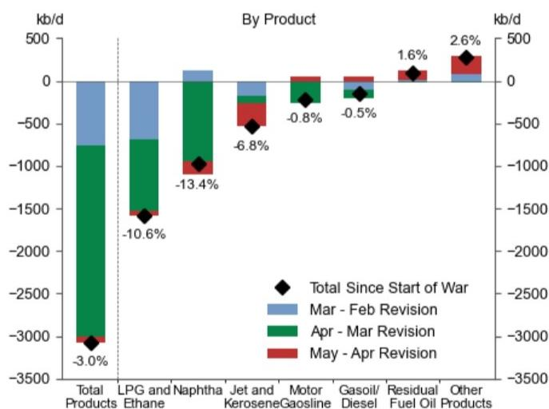

bar

| By Product           | Mar - Feb Revision | Apr - Mar Revision | May - Apr Revision | Total Since Start of War |
|----------------------|--------------------|--------------------|--------------------|--------------------------|
| Total Products       | -300               | -3000              | -300               | -300                     |
| LPG and Ethane       | -100               | -750               | -100               | -100                     |
| Naphtha              | -134               | -1000              | -134               | -134                     |
| Jet and Kerosene     | -68                | -250               | -68                | -68                      |
| Motor Gasoline       | -0.8               | -150               | -0.8               | -0.8                     |
| Gasoil/ Diesel       | -0.5               | -150               | -0.5               | -0.5                     |
| Residual Fuel Oil    | 1.6                | 0                  | 1.6                | 1.6                      |
| Other Products       | 2.6                | 0                  | 2.6                | 2.6                      |

Data labels indicate May - Feb revisions in percent terms.

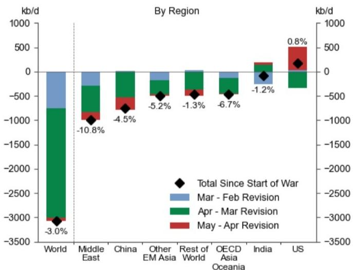

bar

| Region        | Mar - Feb Revision | Apr - Mar Revision | May - Apr Revision | Total Since Start of War |
| ------------- | ------------------ | ------------------ | ------------------ | ------------------------ |
| World         | -300               | -3000              | -300               | -3.0%                    |
| Middle East   | -100               | -500               | -100               | -10.8%                   |
| China         | -50                | -500               | -50                | -4.5%                    |
| Other EM Asia | -50                | -500               | -50                | -5.2%                    |
| Rest of World | -50                | -500               | -50                | -1.3%                    |
| OECD Asia     | -50                | -500               | -50                | -6.7%                    |
| India         | -50                | 0                  | 0                  | -1.2%                    |
| US            | 0                  | -500               | 50                 | 0.8%                     |

Data labels indicate May - Feb revisions in percent terms.   
Source: IEA, GS Global Investment Research

Exhibit 4: US Majors and E&Ps Modestly Exceeded Production Expectations in 2026Q1, With Positive Surprises Concentrated in Oil Production by E&Ps and Liquids Production by Majors 

<table><tr><td colspan="5">Surprises in 2026Q1 US Production by Public Firms</td></tr><tr><td></td><td>Realized (kb/d)</td><td>GS Expected (kb/d)</td><td>Realized vs GS Expected (kb/d)</td><td>Realized vs GS Expected (%)</td></tr><tr><td>Liquids, Majors*</td><td>4,346</td><td>4,292</td><td>54</td><td>1.3</td></tr><tr><td>Oil, E&amp;Ps Only</td><td>2,812</td><td>2,753</td><td>59</td><td>2.1</td></tr><tr><td>NGLs, E&amp;Ps Only</td><td>1,860</td><td>1,863</td><td>-3</td><td>-0.1</td></tr><tr><td>Liquids, Majors and E&amp;Ps</td><td>9,018</td><td>8,908</td><td>110</td><td>1.2</td></tr></table>

\*Majors are defined as XOM, CVX, and COP. E&Ps are the other US producers covered by our GS equity research team.

Source: GS Global Investment Research

# 1) Persian Gulf Exports

Exhibit 5: Based on Reported Vessel Counts, We Estimate That Average Daily Flows Through the Strait of Hormuz Are Down 95% from Their Normal Levels (4-Day Moving Average)   
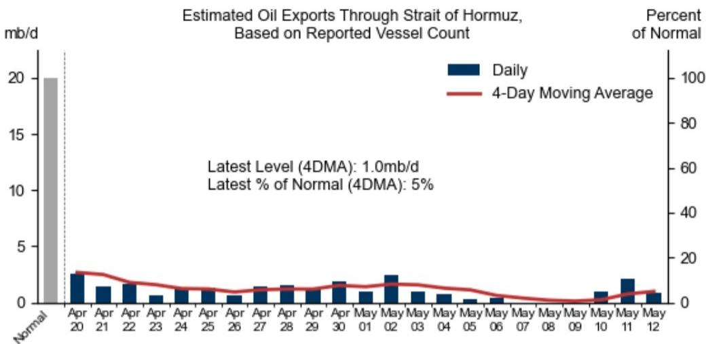

bar_line

Estimated Oil Exports Through Strait of Hormuz, Based on Reported Vessel Count
| Date | Daily (mb/d) | 4-Day Moving Average (Percent of Normal) |
|---|---|---|
| Apr 20 | 2.5 | 18 |
| Apr 21 | 1.5 | 16 |
| Apr 22 | 1.8 | 14 |
| Apr 23 | 0.7 | 12 |
| Apr 24 | 1.2 | 10 |
| Apr 25 | 1.0 | 9 |
| Apr 26 | 0.6 | 8 |
| Apr 27 | 1.3 | 9 |
| Apr 28 | 1.4 | 10 |
| Apr 29 | 1.1 | 9 |
| Apr 30 | 1.7 | 10 |
| May 01 | 0.9 | 9 |
| May 02 | 2.5 | 10 |
| May 03 | 0.9 | 9 |
| May 04 | 0.7 | 8 |
| May 05 | 0.3 | 7 |
| May 06 | 0.5 | 6 |
| May 07 | 0.3 | 5 |
| May 08 | 0.2 | 4 |
| May 09 | 0.1 | 3 |
| May 10 | 0.8 | 2 |
| May 11 | 2.2 | 3 |
| May 12 | 0.8 | 4 |

Vessel count as percent of normal is based on an average of S&P and Kpler data on the daily number of oil tankers crossing the Strait of Hormuz, relative to the Jan 1 - Feb 14 average for S&P and the Jan 1 - Feb 27 average for Kpler. Flows are estimated by applying this proportion to assumed normal flows of 20mb/d.   
Source: S&P Global Commodities at Sea, Kpler, GS Global Investment Research

Exhibit 6: The Estimated Total Hit to Oil Flows from the Persian Gulf Is Currently at 15mb/d   
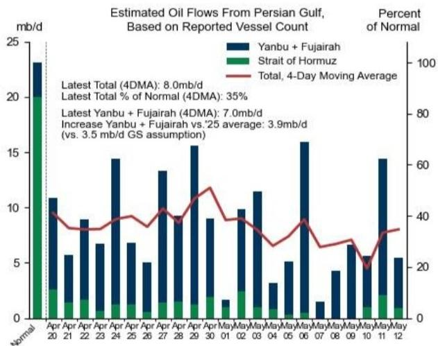

bar_line

Estimated Oil Flows From Persian Gulf, Based on Reported Vessel Count
| Date | Yanbu + Fujairah (mb/d) | Strait of Hormuz (mb/d) | Total, 4-Day Moving Average (mb/d) | Percent of Normal (%) |
|---|---|---|---|---|
| Apr 20 | 11 | 20 | 95 | 35 |
| Apr 21 | 5.5 | 1.5 | 35 | 35 |
| Apr 22 | 9 | 1.5 | 35 | 35 |
| Apr 23 | 6.5 | 1.5 | 38 | 35 |
| Apr 24 | 14.5 | 1.5 | 40 | 35 |
| Apr 25 | 6.5 | 1.5 | 40 | 35 |
| Apr 26 | 5 | 1.5 | 40 | 35 |
| Apr 27 | 13.5 | 1.5 | 42 | 35 |
| Apr 28 | 10.5 | 1.5 | 42 | 35 |
| Apr 29 | 15.5 | 1.5 | 48 | 35 |
| Apr 30 | 9 | 1.5 | 52 | 35 |
| May 01 | 1.5 | 2.0 | 40 | 35 |
| May 02 | 10 | 2.0 | 40 | 35 |
| May 03 | 11.5 | 0.0 | 40 | 35 |
| May 04 | 3.0 | 0.0 | 30 | 35 |
| May 05 | 5.0 | 0.0 | 38 | 35 |
| May 06 | 16.0 | 0.0 | 40 | 35 |
| May 07 | 1.5 | 0.0 | 30 | 35 |
| May 08 | 4.0 | 0.0 | 30 | 35 |
| May 09 | 6.5 | 0.0 | 38 | 35 |
| May 10 | 5.0 | 0.0 | 22 | 35 |
| May 11 | 14.5 | 2.0 | 38 | 35 |
| May 12 | 5.5 | 0.0 | 38 | 35 |
Latest Total (4DMA): 8.0mb/d; Latest Total % of Normal (4DMA): 35%; Latest Yanbu + Fujairah (4DMA): 7.0mb/d; Increase Yanbu + Fujairah vs '25 average: 3.9mb/d (vs. 3.5 mb/d GS assumption)

Normal flows are assumed to be 20mb/d for Strait of Hormuz and 2025 average for Yanbu (1.4mb/d) + Fujairah (1.7mb/d).

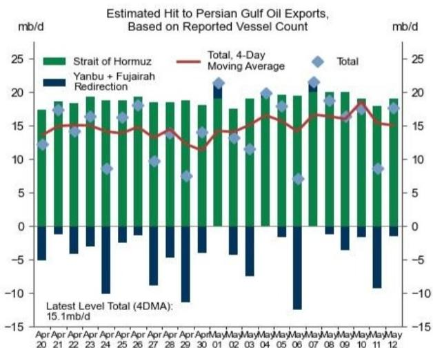

bar_line

Estimated Hit to Persian Gulf Oil Exports, Based on Reported Vessel Count
| Date | Strait of Hormuz (mb/d) | Yanbu + Fujairah (mb/d) | Total (mb/d) |
|---|---|---|---|
| Apr 20 | 17.5 | -4.0 | 12.5 |
| Apr 21 | 18.0 | -3.5 | 14.0 |
| Apr 22 | 18.5 | -4.5 | 15.0 |
| Apr 23 | 19.0 | -5.0 | 16.0 |
| Apr 24 | 18.5 | -9.0 | 9.0 |
| Apr 25 | 18.0 | -3.0 | 16.0 |
| Apr 26 | 18.5 | -4.0 | 15.0 |
| Apr 27 | 18.0 | -7.0 | 10.0 |
| Apr 28 | 18.5 | -5.0 | 8.0 |
| Apr 29 | 18.0 | -10.0 | 14.0 |
| Apr 30 | 18.5 | -4.0 | 22.0 |
| May 01 | 17.5 | -4.5 | 13.5 |
| May 02 | 19.0 | -7.0 | 12.0 |
| May 03 | 19.5 | -2.0 | 20.5 |
| May 04 | 20.0 | -1.0 | 18.5 |
| May 05 | 20.5 | -13.0 | 7.0 |
| May 06 | 20.0 | -14.0 | 22.0 |
| May 07 | 21.0 | -3.0 | 19.5 |
| May 08 | 20.5 | -3.5 | 19.5 |
| May 09 | 20.0 | -2.0 | 18.5 |
| May 10 | 19.5 | -3.0 | 18.5 |
| May 11 | 18.5 | -9.0 | 9.0 |
| May 12 | 19.0 | -3.0 | 18.5 |
Latest Level (4DMA): 15.1mb/d

Hit is calculated relative to normal flows.   
Source: S&P Global Commodities at Sea, Kpler, GS Global Investment Research

Exhibit 7: Total Estimated Oil Loadings from Iran Stand at 0.8mb/d (7-Day Moving Average), or 1.7mb/d Lower Than the 2025 Average   
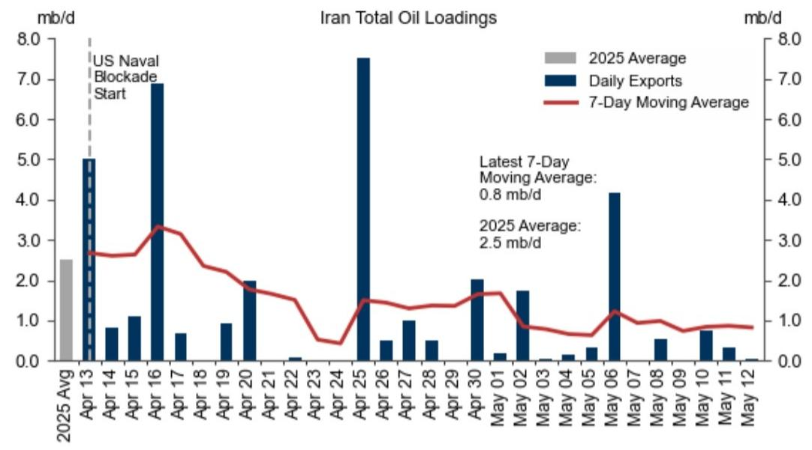

bar_line

Iran Total Oil Loadings
| Date | Daily Exports (mb/d) | 7-Day Moving Average (mb/d) |
| :--- | :--- | :--- |
| 2025 Avg | 2.5 | 2.8 |
| Apr 13 | 5.0 | 2.7 |
| Apr 14 | 0.8 | 2.6 |
| Apr 15 | 1.1 | 2.7 |
| Apr 16 | 6.9 | 3.3 |
| Apr 17 | 0.6 | 3.1 |
| Apr 18 | 0.0 | 2.4 |
| Apr 19 | 0.9 | 2.2 |
| Apr 20 | 2.0 | 1.8 |
| Apr 21 | 0.0 | 1.6 |
| Apr 22 | 0.1 | 1.4 |
| Apr 23 | 0.0 | 0.5 |
| Apr 24 | 0.0 | 0.4 |
| Apr 25 | 7.5 | 1.5 |
| Apr 26 | 0.5 | 1.4 |
| Apr 27 | 1.0 | 1.3 |
| Apr 28 | 0.5 | 1.3 |
| Apr 29 | 0.0 | 1.4 |
| Apr 30 | 2.0 | 1.7 |
| May 01 | 0.2 | 1.7 |
| May 02 | 1.7 | 1.0 |
| May 03 | 0.0 | 0.8 |
| May 04 | 0.1 | 0.7 |
| May 05 | 0.3 | 0.6 |
| May 06 | 4.2 | 1.2 |
| May 07 | 0.0 | 1.0 |
| May 08 | 0.5 | 0.9 |
| May 09 | 0.0 | 0.8 |
| May 10 | 0.8 | 0.9 |
| May 11 | 0.3 | 0.9 |
| May 12 | 0.0 | 0.9 |

Source: Kpler, GS Global Investment Research

Exhibit 8: 40% of the Hit to Persian Gulf Crude/Condensate Exports Is Currently Being Offset, With Contributions from the US/Americas Ex US/Russia of 19pp/8pp/5pp; World Ex Middle East Refined Products Exports Are Now Contributing 1mb/d to the Hit, Rather Than Offsetting It   
  
Refined products include LPG.   
Source: Kpler, GS Global Investment Research

# 2) Inventories

Exhibit 9: Global Visible Oil Inventories Have Drawn Sharply Since Late February Outside of China and the Gulf   
Global Visible Total Oil Inventories, Change Since Feb 27   
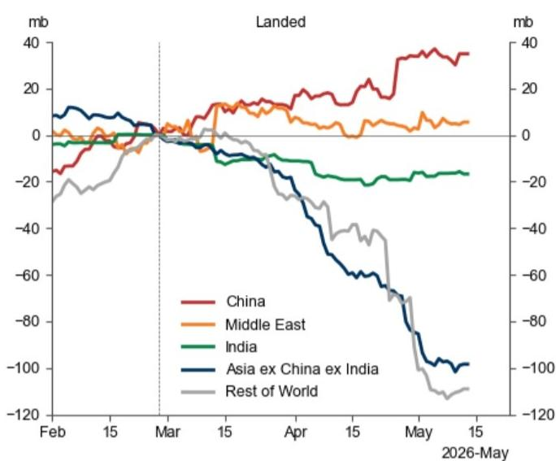

line

| Date       | China | Middle East | India | Asia ex China ex India | Rest of World |
| ---------- | ----- | ----------- | ----- | ----------------------- | ------------- |
| Feb        | -15   | 0           | -5    | 10                      | -30           |
| 15         | 5     | 5           | -5    | 5                       | -20           |
| Mar        | 0     | 0           | 0     | 0                       | 0             |
| Apr        | 15    | 10          | -10   | -20                     | -40           |
| May        | 35    | 5           | -15   | -100                    | -100          |
| 15         | 35    | 5           | -15   | -100                    | -120          |

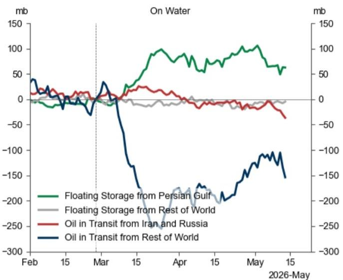

line

| Date       | Floating Storage from Persian Gulf (mb) | Floating Storage from Rest of World (mb) | Oil in Transit from Iran and Russia (mb) | Oil in Transit from Rest of World (mb) |
| ---------- | ---------------------------------------- | ----------------------------------------- | --------------------------------------- | -------------------------------------- |
| Feb 15     | ~0                                       | ~0                                        | ~0                                      | ~0                                     |
| Mar 15     | ~0                                       | ~0                                        | ~0                                      | ~0                                     |
| Apr 15     | ~100                                     | ~0                                        | ~0                                      | ~-200                                  |
| May 15     | ~50                                      | ~0                                        | ~-50                                    | ~-150                                  |

Source: IEA, Kpler, DOE, Euroilstocks, ARA PJK, PAJ, Haver, GS Global Investment Research

Exhibit 10: Global Visible Draws Have Averaged 4.4mb/d Since March 1st 

<table><tr><td colspan="5">Visible Oil Stocks, Month-Over-Month Changes (mb/d)</td></tr><tr><td></td><td>March</td><td>April</td><td>May</td><td>Average Since March 1st</td></tr><tr><td>Global Visible Stocks</td><td>-4.7</td><td>-2.5</td><td>-7.5</td><td>-4.4</td></tr><tr><td>Landed Crude Stocks</td><td>0.1</td><td>-2.4</td><td>-2.2</td><td>-1.3</td></tr><tr><td>OECD</td><td>0.3</td><td>-2.6</td><td>-2.6</td><td>-1.4</td></tr><tr><td>China</td><td>0.3</td><td>0.3</td><td>0.4</td><td>0.3</td></tr><tr><td>Non-OECD Ex China</td><td>-0.5</td><td>0.0</td><td>-0.1</td><td>-0.2</td></tr><tr><td>Landed Products Stocks</td><td>-1.3</td><td>-1.5</td><td>-0.8</td><td>-1.3</td></tr><tr><td>OECD NGL</td><td>-0.3</td><td>0.2</td><td>0.4</td><td>0.0</td></tr><tr><td>OECD Refined Products</td><td>-0.9</td><td>-1.8</td><td>-0.8</td><td>-1.2</td></tr><tr><td>Non-OECD Total Products</td><td>-0.1</td><td>0.1</td><td>-0.4</td><td>-0.1</td></tr><tr><td>Oil on Water</td><td>-3.5</td><td>1.4</td><td>-4.5</td><td>-1.7</td></tr><tr><td>Floating Crude</td><td>1.5</td><td>0.5</td><td>-1.6</td><td>0.6</td></tr><tr><td>Floating Products</td><td>0.7</td><td>0.0</td><td>-0.4</td><td>0.2</td></tr><tr><td>Crude in Transit</td><td>-3.9</td><td>1.1</td><td>0.5</td><td>-1.1</td></tr><tr><td>Products in Transit</td><td>-1.8</td><td>-0.3</td><td>-3.1</td><td>-1.4</td></tr></table>

Latest observation is today, and data is unsmoothed. “Crude” categories (landed and on water) include both crude and condensate. Month-over-month changes are calculated by taking the end-of-month level, subtracting the previous month’s end-of-month level, and dividing by the number of days.   
Source: GS Global Investment Research

Exhibit 11: China Longzhong Gasoline Stocks Edged Down by 2mb Week-Over-Week But Remain 9mb Above Year-Ago Levels; Diesel Stocks Remained Resilient and Stand 14mb Above Year-Ago Levels   
China Refined Products Stocks   
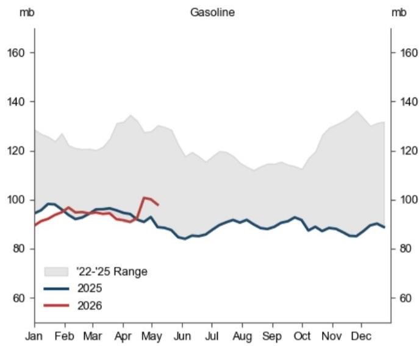

line

| Month | 2025 (mb) | 2026 (mb) | '22-'25 Range (mb) |
|-------|-----------|-----------|---------------------|
| Jan   | ~95       | ~90       | ~130                |
| Feb   | ~98       | ~95       | ~135                |
| Mar   | ~97       | ~96       | ~140                |
| Apr   | ~96       | ~97       | ~145                |
| May   | ~95       | ~100      | ~150                |
| Jun   | ~85       | ~95       | ~130                |
| Jul   | ~88       | ~90       | ~135                |
| Aug   | ~90       | ~88       | ~140                |
| Sep   | ~92       | ~87       | ~145                |
| Oct   | ~90       | ~86       | ~150                |
| Nov   | ~88       | ~85       | ~155                |
| Dec   | ~87       | ~86       | ~160                |

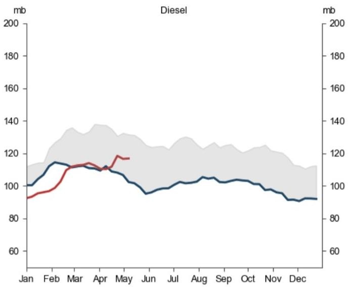

line

| Month | Diesel (mb) |
|-------|-------------|
| Jan   | 95          |
| Feb   | 110         |
| Mar   | 115         |
| Apr   | 110         |
| May   | 120         |
| Jun   | 95          |
| Jul   | 100         |
| Aug   | 105         |
| Sep   | 100         |
| Oct   | 95          |
| Nov   | 90          |
| Dec   | 90          |

Source: MySteel, GS Global Investment Research

# 3) Refining

Exhibit 12: Chinese Refineries Runs Have Declined by 1.2mb/d Since the Outbreak of the Conflict   
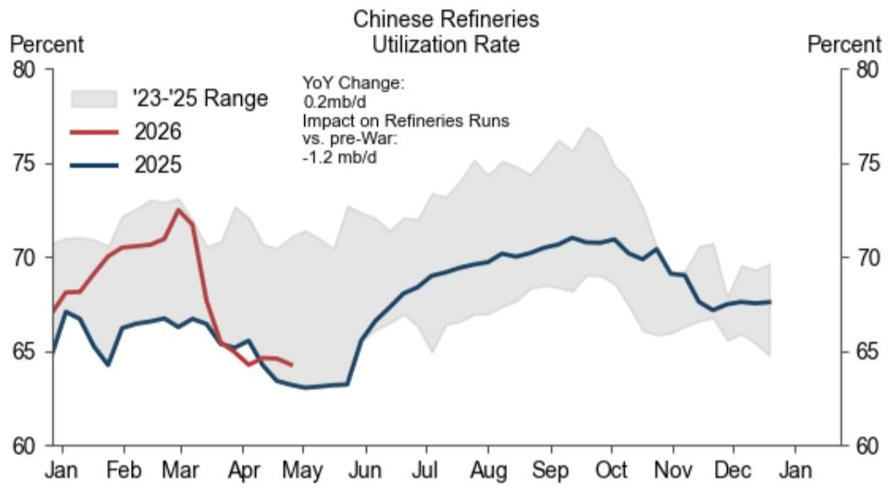

line

| Month | 2025 Utilization Rate | 2026 Utilization Rate | YoY Change |
|-------|------------------------|------------------------|----------|
| Jan   | ~65.5                  | ~67.0                  | -        |
| Feb   | ~64.5                  | ~70.0                  | -        |
| Mar   | ~66.0                  | ~72.5                  | -        |
| Apr   | ~65.0                  | ~64.5                  | -        |
| May   | ~63.0                  | ~64.0                  | -        |
| Jun   | ~63.5                  | ~64.5                  | -        |
| Jul   | ~68.0                  | ~69.0                  | -        |
| Aug   | ~70.0                  | ~71.0                  | -        |
| Sep   | ~71.0                  | ~72.0                  | -        |
| Oct   | ~71.5                  | ~71.5                  | -        |
| Nov   | ~70.0                  | ~70.0                  | -        |
| Dec   | ~68.0                  | ~69.0                  | -        |
| Jan   | ~67.5                  | ~68.5                  | -        |

Source: Oilchem, GS Global Investment Research

Exhibit 13: Japanese Refineries Runs Are 0.3mb/d Lower Than Their Pre-Conflict Levels   
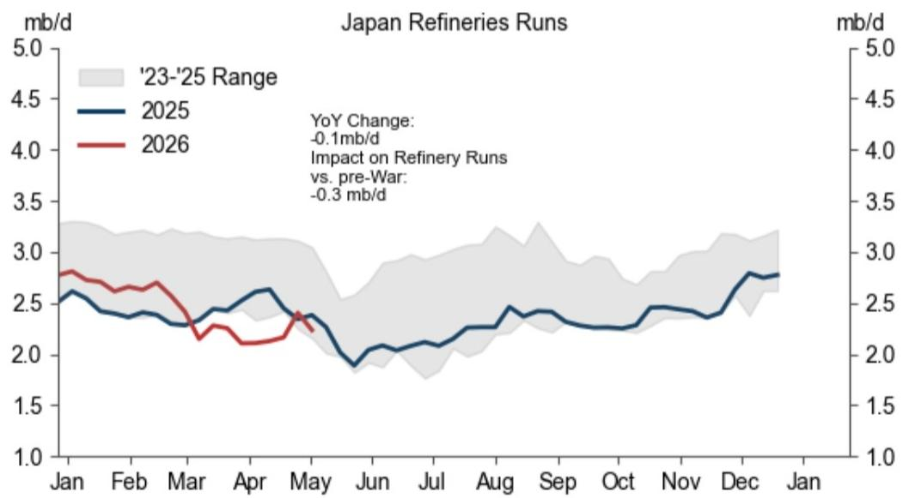

line

| Month | 2025 (mb/d) | 2026 (mb/d) |
|-------|-------------|-------------|
| Jan   | ~2.6        | ~2.8        |
| Feb   | ~2.4        | ~2.7        |
| Mar   | ~2.3        | ~2.2        |
| Apr   | ~2.5        | ~2.1        |
| May   | ~2.4        | ~2.3        |
| Jun   | ~1.9        | —           |
| Jul   | ~2.1        | —           |
| Aug   | ~2.3        | —           |
| Sep   | ~2.4        | —           |
| Oct   | ~2.3        | —           |
| Nov   | ~2.4        | —           |
| Dec   | ~2.7        | —           |
| Jan   | ~2.8        | —           |

Source: PAJ, GS Global Investment Research

# 4) Energy Prices

Energy Prices Across Regions

Exhibit 14: US Jet Fuel, Diesel, and Gasoline Prices Increased the Most Since Last Week   
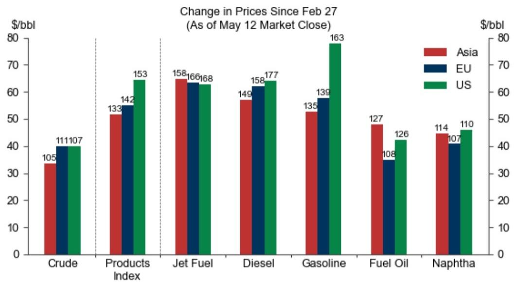

bar

Change in Prices Since Feb 27 (As of May 12 Market Close)
| Category | Asia ($/bbl) | EU ($/bbl) | US ($/bbl) |
| :--- | :--- | :--- | :--- |
| Crude | 105 | 111 | 107 |
| Products Index | 133 | 142 | 153 |
| Jet Fuel | 158 | 166 | 168 |
| Diesel | 149 | 158 | 177 |
| Gasoline | 135 | 139 | 163 |
| Fuel Oil | 127 | 108 | 126 |
| Naphtha | 114 | 107 | 110 |

Bar labels indicate crude/refined products prices as of May 12th market close. We consider cash or cash-equivalent prices.   
Source: ICE, Platts, GS Global Investment Research

Exhibit 15: The US Refined Products Price Index Is Currently 7% Higher Than Its Asia/EU Counterparts, as Market Tightness Has Spread From East to West   
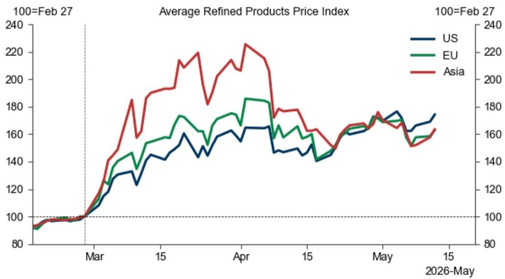

line

| Date       | US   | EU   | Asia |
| ---------- | ---- | ---- | ---- |
| 2026-May   | 170  | 165  | 160  |

We take a weighted average of products prices of gasoline, diesel, jet fuel, fuel oil, and naphtha based on the relative 2025 average demand share of each product (after rescaling the February 27, 2026 data point to 100) for each region. We consider cash prices for refined products.   
Source: Platts, GS Global Investment Research

Exhibit 16: US Retail Diesel and Gasoline Prices Remain Just \$0.2/gal and \$0.5/gal Below Their Respective All-Time Highs   
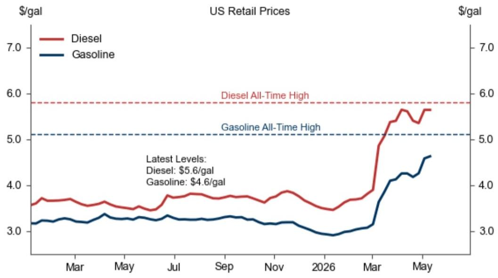

line

| Month   | Diesel Price ($/gal) | Gasoline Price ($/gal) |
|---------|----------------------|------------------------|
| Mar     | ~3.6                 | ~3.1                   |
| May     | ~3.5                 | ~3.2                   |
| Jul     | ~3.7                 | ~3.2                   |
| Sep     | ~3.6                 | ~3.2                   |
| Nov     | ~3.7                 | ~3.1                   |
| 2026    | ~3.5                 | ~2.9                   |
| Mar     | ~4.8                 | ~3.8                   |
| May     | ~5.6                 | ~4.6                   |

Source: EIA, GS Global Investment Research

# Crude Prices

Exhibit 17: Prompt Timespreads Across Regions Have Converged to High Levels   
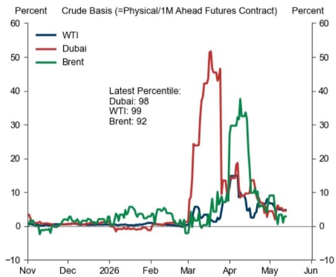

line

| Date   | WTI  | Dubai | Brent |
|--------|------|-------|-------|
| Nov    | 0    | 0     | 0     |
| Dec    | 0    | 0     | 0     |
| 2026   | 0    | 0     | 0     |
| Feb    | 0    | 0     | 0     |
| Mar    | 0    | 0     | 0     |
| Apr    | 0    | 52    | 38    |
| May    | 0    | 0     | 0     |
| Jun    | 0    | 0     | 0     |

Percentiles over a sample from 2011 to the present.

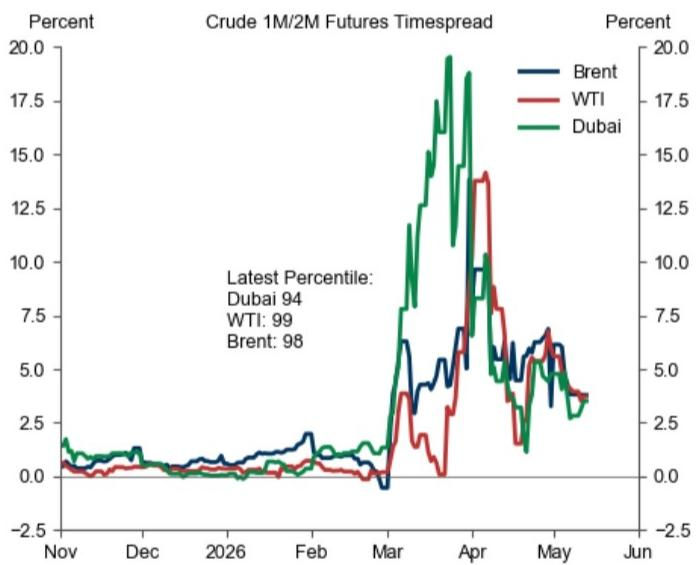

line

| Date       | Brent | WTI  | Dubai |
| ---------- | ----- | ---- | ----- |
| Latest Percentile | 94    | 99   | 98    |

Percentiles over a sample from 2011 to the present.

Basis represents the difference (in % of 1M ahead futures) between spot physical crude futures and 1M ahead financial futures. We include Brent, Dubai, and WTI in crude basis on the left panel and in 1M/2M timespreads on the right panel.

Source: Platts, CME, GS Global Investment Research

# 5) Demand

Exhibit 18: We Estimate That Global Jet Fuel Demand in May Will be 101kb/d Softer Year-Over-Year, or 6% Below Trend   
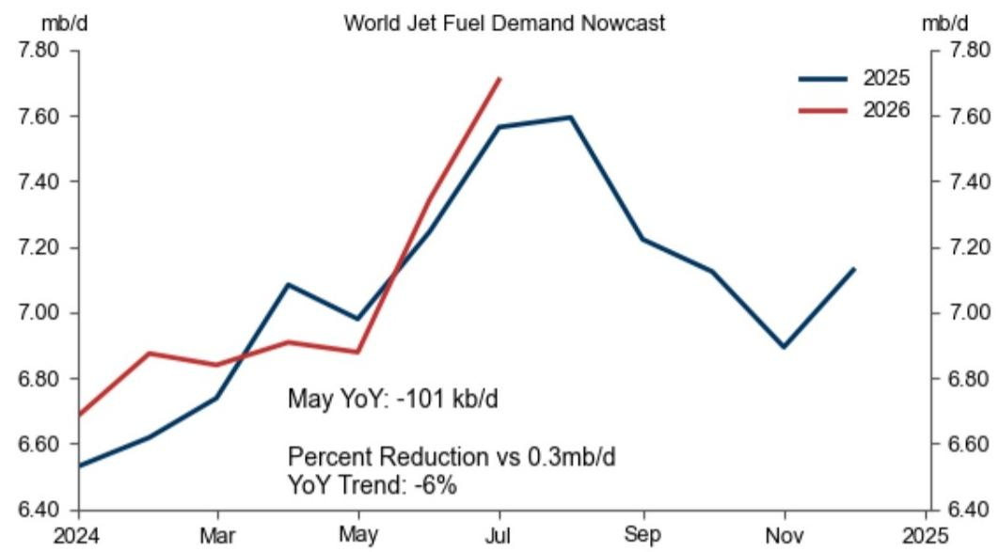

line

| Month | 2025 (mb/d) | 2026 (mb/d) |
|-------|-------------|-------------|
| May   | -101        | -           |
| Percent Reduction vs 0.3mb/d | -           | -           |
| YoY Trend | -           | -6%         |

Source: EIA, OAG, GS Global Investment Research

Exhibit 19: Our China Oil Demand Nowcast Remains 1.5mb/d (8%) Below Its Mid-March Level   
  
Source: IEA, S&P, Kpler, GTT, Oilchem, MySteel, Bloomberg, GS Global Investment Research

Exhibit 20: US Gasoline Demand Remains Resilient at Just 0.2mb/d Below Its Year-Ago Levels   
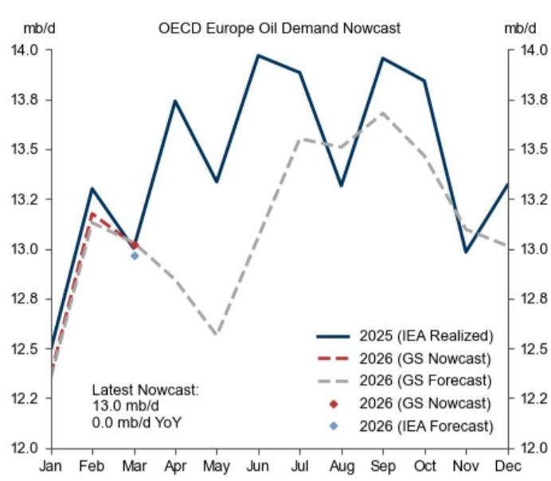

line

| Month | 2025 (IEA Realized) | 2026 (GS Nowcast) | 2026 (GS Forecast) | 2026 (GS Nowcast) | 2026 (IEA Forecast) |
|-------|----------------------|-------------------|--------------------|-------------------|---------------------|
| Jan   | 12.5                 | 12.4              | 12.4               | 12.4              | -                   |
| Feb   | 13.2                 | 13.1              | 13.1               | 13.1              | -                   |
| Mar   | 13.0                 | 13.0              | 13.0               | 13.0              | 13.0                |
| Apr   | 13.8                 | -                 | -                  | -                 | -                   |
| May   | 13.3                 | -                 | 12.7               | -                 | -                   |
| Jun   | 14.0                 | -                 | -                  | -                 | -                   |
| Jul   | 13.9                 | -                 | 13.6               | -                 | -                   |
| Aug   | 13.3                 | -                 | 13.5               | -                 | -                   |
| Sep   | 14.0                 | -                 | 13.8               | -                 | -                   |
| Oct   | 13.9                 | -                 | 13.5               | -                 | -                   |
| Nov   | 13.0                 | -                 | 13.1               | -                 | -                   |
| Dec   | 13.3                 | -                 | 13.0               | -                 | -                   |

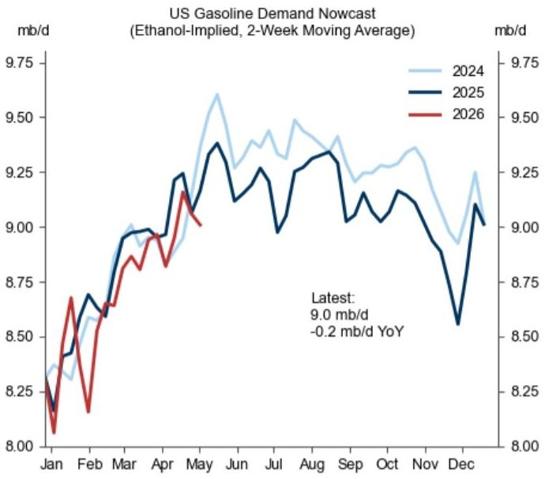

line

| Month | 2024 (mb/d) | 2025 (mb/d) | 2026 (mb/d) |
|-------|-------------|-------------|-------------|
| Jan   | ~8.3        | ~8.1        | ~8.0        |
| Feb   | ~8.6        | ~8.7        | ~8.6        |
| Mar   | ~8.9        | ~9.0        | ~8.9        |
| Apr   | ~9.0        | ~9.1        | ~9.0        |
| May   | ~9.6        | ~9.4        | ~9.2        |
| Jun   | ~9.4        | ~9.3        | ~9.1        |
| Jul   | ~9.5        | ~9.2        | ~9.0        |
| Aug   | ~9.4        | ~9.3        | ~9.1        |
| Sep   | ~9.3        | ~9.2        | ~9.0        |
| Oct   | ~9.3        | ~9.1        | ~8.9        |
| Nov   | ~9.3        | ~8.9        | ~8.7        |
| Dec   | ~9.0        | ~8.5        | ~8.5        |

Source: IEA, S&P, Kpler, GTT, Oilchem, MySteel, Bloomberg, GS Global Investment Research

Exhibit 21: Asia-Pacific Crude/Condensate Imports Are Down 6.6mb/d from 2025 Average Levels; Global Refined Products Imports Declined By 0.5mb/d Since Last Week   
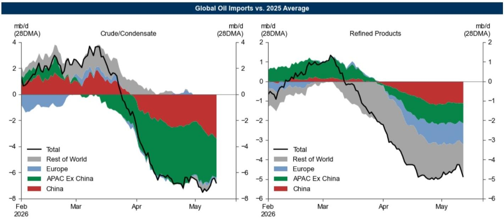

area

Global Oil Imports vs. 2025 Average
| Region | Total (mb/d 28DMA) | Rest of World (mb/d 28DMA) | Europe (mb/d 28DMA) | APAC Ex China (mb/d 28DMA) | China (mb/d 28DMA) |
|---|---|---|---|---|---|
| Crude/Condensate | ~1.5 | ~1.0 | ~-0.5 | ~0.5 | ~0.5 |
| Refined Products | ~-1.0 | ~-1.5 | ~-1.0 | ~0.5 | ~0.5 |

Refined products include LPG.   
Source: Kpler, GS Global Investment Research

Exhibit 22: While Satellite Data on Strait of Hormuz Crossings Are Affected by AIS Signals Disruptions in the Region, Various Sources Point to Severe Disruptions in the Strait of Hormuz Flows   
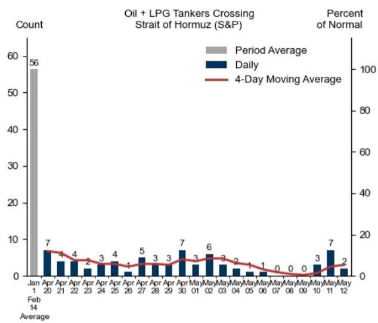

bar_line

Oil + LPG Tankers Crossing Strait of Hormuz (S&P)
| Date | Count | Period Average | Daily | 4-Day Moving Average |
|---|---|---|---|---|
| Jan Feb 14 | 56 | 100 | 7 | 7 |
| Apr 20 | 7 | 90 | 4 | 4 |
| Apr 21 | 4 | 80 | 4 | 3 |
| Apr 22 | 2 | 70 | 2 | 2 |
| Apr 23 | 3 | 60 | 3 | 2 |
| Apr 24 | 4 | 50 | 3 | 2 |
| Apr 25 | 1 | 40 | 4 | 1 |
| Apr 26 | 5 | 30 | 1 | 1 |
| Apr 27 | 3 | 20 | 5 | 1 |
| Apr 28 | 3 | 10 | 3 | 1 |
| Apr 29 | 3 | 5 | 3 | 1 |
| Apr 30 | 7 | 10 | 7 | 3 |
| May 01 | 3 | 50 | 3 | 3 |
| May 02 | 6 | 80 | 6 | 3 |
| May 03 | 3 | 60 | 3 | 2 |
| May 04 | 2 | 40 | 2 | 1 |
| May 05 | 1 | 20 | 1 | 1 |
| May 06 | 1 | 10 | 1 | 0 |
| May 07 | 0 | 50 | 0 | 0 |
| May 08 | 0 | 30 | 0 | 0 |
| May 09 | 0 | 100 | 3 | 0 |
| May 10 | 7 | -100 | -7 | -1 |
| May 11 | -2 | -50 | -2 | -1 |
Percent of Normal
Average

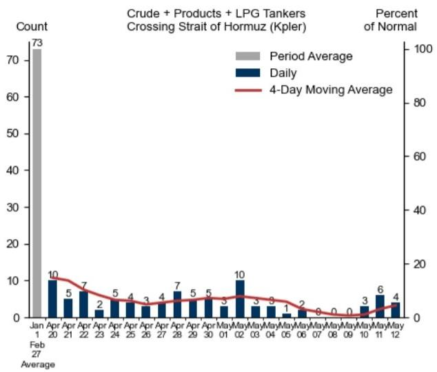

bar_line

Crude + Products + LPG Tankers Crossing Strait of Hormuz (Kpler)
| Date | Count | Daily | Percent of Normal |
|---|---|---|---|
| Jan Feb 27 | 73 | 10 | 100 |
| Apr 20 | 5 | 5 | 90 |
| Apr 21 | 7 | 7 | 85 |
| Apr 22 | 2 | 2 | 75 |
| Apr 23 | 5 | 5 | 65 |
| Apr 24 | 4 | 4 | 60 |
| Apr 25 | 3 | 3 | 55 |
| Apr 26 | 4 | 4 | 50 |
| Apr 27 | 7 | 7 | 60 |
| Apr 28 | 5 | 5 | 55 |
| Apr 29 | 5 | 5 | 50 |
| Apr 30 | 5 | 5 | 45 |
| May 01 | 3 | 3 | 40 |
| May 02 | 10 | 10 | 45 |
| May 03 | 3 | 3 | 40 |
| May 04 | 3 | 3 | 35 |
| May 05 | 1 | 1 | 30 |
| May 06 | 2 | 2 | 25 |
| May 07 | 0 | 0 | 20 |
| May 08 | 0 | 0 | 15 |
| May 09 | 0 | 0 | 10 |
| May 10 | 3 | 3 | 15 |
| May 11 | 6 | 6 | 20 |
| May 12 | 4 | 4 | 15 |

We consider both "laden" and "ballast" vessels.   
Source: S&P Global Commodities at Sea, Kpler, GS Investment Research

# Disclosure Appendix

# Reg AC

We, Alexandra Paulus, Daan Struyven, Yulia Zhestkova Grigsby and Filippo Cuscito, hereby certify that all of the views expressed in this report accurately reflect our personal views, which have not been influenced by considerations of the firm's business or client relationships.

Unless otherwise stated, the individuals listed on the cover page of this report are analysts in GS' Global Investment Research division.

Contributing Authors: Alexandra Paulus GS & Co. LLC, Daan Struyven GS & Co. LLC, Yulia Zhestkova Grigsby GS & Co. LLC, Filippo Cuscito GS International.

Unless otherwise stated, the individuals listed in the Contributing Authors disclosure of this report are analysts in GS' Global Investment Research division.

# Disclosures

# Disclosure

Iran is subject to comprehensive sanctions by the United States.

# Regulatory disclosures

# Disclosures required by United States laws and regulations

See company-specific regulatory disclosures above for any of the following disclosures required as to companies referred to in this report: manager or co-manager in a pending transaction; $1\%$ or other ownership; compensation for certain services; types of client relationships; managed/co-managed public offerings in prior periods; directorships; for equity securities, market making and/or specialist role. GS trades or may trade as a principal in debt securities (or in related derivatives) of issuers discussed in this report.

The following are additional required disclosures: Ownership and material conflicts of interest: GS policy prohibits its analysts, professionals reporting to analysts and members of their households from owning securities of any company in the analyst's area of coverage. Analyst compensation: Analysts are paid in part based on the profitability of GS, which includes investment banking revenues. Analyst as officer or director: GS policy generally prohibits its analysts, persons reporting to analysts or members of their households from serving as an officer, director or advisor of any company in the analyst's area of coverage. Non-U.S. Analysts: Non-U.S. analysts may not be associated persons of GS & Co. LLC and therefore may not be subject to FINRA Rule 2241 or FINRA Rule 2242 restrictions on communications with a subject company, public appearances and trading in securities covered by the analysts.

# Additional disclosures required under the laws and regulations of jurisdictions other than the United States

The following disclosures are those required by the jurisdiction indicated, except to the extent already made above pursuant to United States laws and regulations. Australia: GS Australia Pty Ltd and its affiliates are not authorised deposit-taking institutions (as that term is defined in the Banking Act 1959 (Cth)) in Australia and do not provide banking services, nor carry on a banking business, in Australia. This research, and any access to it, is intended only for “wholesale clients” within the meaning of the Australian Corporations Act, unless otherwise agreed by GS. In producing research reports, members of Global Investment Research of GS Australia may attend site visits and other meetings hosted by the companies and other entities which are the subject of its research reports. In some instances the costs of such site visits or meetings may be met in part or in whole by the issuers concerned if GS Australia considers it is appropriate and reasonable in the specific circumstances relating to the site visit or meeting. To the extent that the contents of this document contains any financial product advice, it is general advice only and has been prepared by GS without taking into account a client’s objectives, financial situation or needs. A client should, before acting on any such advice, consider the appropriateness of the advice having regard to the client’s own objectives, financial situation and needs. A copy of certain GS Australia and New Zealand disclosure of interests and a copy of GS’ Australian Sell-Side Research Independence Policy Statement are available at: https://www.goldmansachs.com/disclosures/australia-new-zealand/index.html. Brazil: Disclosure information in relation to CVM Resolution n. 20 is available at https://www.gs.com/worldwide/brazil/area/gir/index.html. Where applicable, the Brazil-registered analyst primarily responsible for the content of this research report, as defined in Article 20 of CVM Resolution n. 20, is the first author named at the beginning of this report, unless indicated otherwise at the end of the text. Canada: This information is being provided to you for information purposes only and is not, and under no circumstances should be construed as, an advertisement, offering or solicitation by GS & Co. LLC for purchasers of securities in Canada to trade in any Canadian security. GS & Co. LLC is not registered as a dealer in any jurisdiction in Canada under applicable Canadian securities laws and generally is not permitted to trade in Canadian securities and may be prohibited from selling certain securities and products in certain jurisdictions in Canada. If you wish to trade in any Canadian securities or other products in Canada please contact GS Canada Inc., an affiliate of The GS Group Inc., or another registered Canadian dealer. Hong Kong: Further information on the securities of covered companies referred to in this research may be obtained on request from GS (Asia) L.L.C. India: Further information on the subject company or companies referred to in this research may be obtained from GS (India) Securities Private Limited, Research Analyst - SEBI Registration Number INH000001493, 10th Floor, Ascent-Worli, Sudam Kalu Ahire Marg, Worli, Mumbai-400 025, India, Corporate Identity Number U74140MH2006FTC160634, Phone +91 22 6616 9000, Fax +91 22 6616 9001. GS may beneficially own 1% or more of the securities (as such term is defined in clause 2 (h) the Indian Securities Contracts (Regulation) Act, 1956) of the subject company or companies referred to in this research report. Investment in securities market are subject to market risks. Read all the related documents carefully before investing. Registration granted by SEBI and certification from NISM in no way guarantee performance of the intermediary or provide any assurance of returns to investors. GS (India) Securities Private Limited compliance officer and investor grievance contact details can be found at: https://www.goldmansachs.com/worldwide/india/documents/Grievance-Redressal-and-Escalation-Matrix.pdf, and a copy of the annual audit compliance report can be found at this link: https://publishing.gs.com/content/site/india-annual-compliance-report.html. Japan: See below. Korea: This research, and any access to it, is intended only for “professional investors” within the meaning of the Financial Services and Capital Markets Act, unless otherwise agreed by GS. Further information on the subject company or companies referred to in this research may be obtained from GS (Asia) L.L.C., Seoul Branch. New Zealand: GS New Zealand Limited and its affiliates are neither “registered banks” nor “deposit takers” (as defined in the Reserve Bank of New Zealand Act 1989) in New Zealand. This research, and any access to it, is intended for “wholesale clients” (as defined in the Financial Advisers Act 2008) unless otherwise agreed by GS. A copy of certain GS Australia and New Zealand disclosure of interests is available at: https://www.goldmansachs.com/disclosures/australia-new-zealand/index.html. Russia: Research reports distributed in the Russian Federation are not advertising as defined in the Russian legislation, but are information and analysis not having product promotion as their main purpose and do not provide appraisal within the meaning of the Russian legislation on appraisal activity. Research reports do not constitute a personalized investment recommendation as defined in Russian laws and regulations, are not addressed to a specific client, and are prepared without analyzing the financial circumstances, investment profiles or risk profiles of clients. GS assumes no responsibility for any investment decisions that may be taken by a client or any other person based on this research report. Singapore: GS (Singapore) Pte. (Company Number: 198602165W), which is regulated by the Monetary Authority of Singapore, accepts legal responsibility for this

research, and should be contacted with respect to any matters arising from, or in connection with, this research. Taiwan: This material is for reference only and must not be reprinted without permission. Investors should carefully consider their own investment risk. Investment results are the responsibility of the individual investor. United Kingdom: Persons who would be categorized as retail clients in the United Kingdom, as such term is defined in the rules of the Financial Conduct Authority, should read this research in conjunction with prior GS on the covered companies referred to herein and should refer to the risk warnings that have been sent to them by GS International. A copy of these risks warnings, and a glossary of certain financial terms used in this report, are available from GS International on request.

European Union and United Kingdom: Disclosure information in relation to Article 6 (2) of the European Commission Delegated Regulation (EU) (2016/958) supplementing Regulation (EU) No 596/2014 of the European Parliament and of the Council (including as that Delegated Regulation is implemented into United Kingdom domestic law and regulation following the United Kingdom's departure from the European Union and the European Economic Area) with regard to regulatory technical standards for the technical arrangements for objective presentation of investment recommendations or other information recommending or suggesting an investment strategy and for disclosure of particular interests or indications of conflicts of interest is available at https://www.gs.com/disclosures/europeanpolicy.html which states the European Policy for Managing Conflicts of Interest in Connection with Investment Research.

Japan: GS Japan Co., Ltd. is a Financial Instrument Dealer registered with the Kanto Financial Bureau under registration number Kinsho 69, and a member of Japan Securities Dealers Association, Financial Futures Association of Japan Type II Financial Instruments Firms Association, and Investment Management Association of Japan. Sales and purchase of equities are subject to commission pre-determined with clients plus consumption tax. See company-specific disclosures as to any applicable disclosures required by Japanese stock exchanges, the Japanese Securities Dealers Association or the Japanese Securities Finance Company.

# Global product; distributing entities

GS Global Investment Research produces and distributes research products for clients of GS on a global basis. Analysts based in GS offices around the world produce research on industries and companies, and research on macroeconomics, currencies, commodities and portfolio strategy. This research is disseminated in Australia by GS Australia Pty Ltd (ABN 21 006 797 897); in Brazil by GS do Brasil Corretora de Títulos e Valores Mobiliários S.A.; Public Communication Channel GS Brazil: 0800 727 5764 and / or contatogoldmanbrasil@gs.com. Available Weekdays (except holidays), from 9am to 6pm. Canal de Comunicação com o Público GS Brasil: 0800 727 5764 e/ou contatogoldmanbrasil@gs.com. Horário de funcionamento: segunda-feira à sexta-feira (exceto feriados), das 9h às 18h; in Canada by GS & Co. LLC; in Hong Kong by GS (Asia) L.L.C.; in India by GS (India) Securities Private Ltd.; in Japan by GS Japan Co., Ltd.; in the Republic of Korea by GS (Asia) L.L.C., Seoul Branch; in New Zealand by GS New Zealand Limited; in Russia by OOO GS; in Singapore by GS (Singapore) Pte. (Company Number: 198602165W); and in the United States of America by GS & Co. LLC. GS International has approved this research in connection with its distribution in the United Kingdom.

GS International (“GSI”), authorised by the Prudential Regulation Authority (“PRA”) and regulated by the Financial Conduct Authority (“FCA”) and the PRA, has approved this research in connection with its distribution in the United Kingdom.

European Economic Area: GS Bank Europe SE ("GSBE") is a credit institution incorporated in Germany and, within the Single Supervisory Mechanism, subject to direct prudential supervision by the European Central Bank and in other respects supervised by German Federal Financial Supervisory Authority (Bundesanstalt für Finanzdienstleistungsaufsicht, BaFin) and Deutsche Bundesbank and disseminates research within the European Economic Area.

# General disclosures

This research is for our clients only. Other than disclosures relating to GS, this research is based on current public information that we consider reliable, but we do not represent it is accurate or complete, and it should not be relied on as such. The information, opinions, estimates and forecasts contained herein are as of the date hereof and are subject to change without prior notification. We seek to update our research as appropriate, but various regulations may prevent us from doing so. Other than certain industry reports published on a periodic basis, the large majority of reports are published at irregular intervals as appropriate in the analyst's judgment.

GS conducts a global full-service, integrated investment banking, investment management, and brokerage business. We have investment banking and other business relationships with a sUBStantial percentage of the companies covered by Global Investment Research. GS & Co. LLC, the United States broker dealer, is a member of SIPC (https://www.sipc.org).

Our salespeople, traders, and other professionals may provide oral or written market commentary or trading strategies to our clients and principal trading desks that reflect opinions that are contrary to the opinions expressed in this research. Our asset management area, principal trading desks and investing businesses may make investment decisions that are inconsistent with the recommendations or views expressed in this research.

We and our affiliates, officers, directors, and employees will from time to time have long or short positions in, act as principal in, and buy or sell, the securities or derivatives, if any, referred to in this research, unless otherwise prohibited by regulation or GS policy.

The views attributed to third party presenters at GS arranged conferences, including individuals from other parts of GS, do not necessarily reflect those of Global Investment Research and are not an official view of GS.

Any third party referenced herein, including any salespeople, traders and other professionals or members of their household, may have positions in the products mentioned that are inconsistent with the views expressed by analysts named in this report.

This research is focused on investment themes across markets, industries and sectors. It does not attempt to distinguish between the prospects or performance of, or provide analysis of, individual companies within any industry or sector we describe.

Any trading recommendation in this research relating to an equity or credit security or securities within an industry or sector is reflective of the investment theme being discussed and is not a recommendation of any such security in isolation.

This research is not an offer to sell or the solicitation of an offer to buy any security in any jurisdiction where such an offer or solicitation would be illegal. It does not constitute a personal recommendation or take into account the particular investment objectives, financial situations, or needs of individual clients. Clients should consider whether any advice or recommendation in this research is suitable for their particular circumstances and, if appropriate, seek professional advice, including tax advice. The price and value of investments referred to in this research and the income from them may fluctuate. Past performance is not a guide to future performance, future returns are not guaranteed, and a loss of original capital may occur. Fluctuations in exchange rates could have adverse effects on the value or price of, or income derived from, certain investments.

Certain transactions, including those involving futures, options, and other derivatives, give rise to sUBStantial risk and are not suitable for all investors. Investors should review current options and futures disclosure documents which are available from GS sales representatives or at https://www.theocc.com/about/publications/character-risks.jsp and https://www.goldmansachs.com/disclosures/cftc\_fcm\_disclosures. Transaction costs may be significant in option strategies calling for multiple purchase and sales of options such as spreads. Supporting documentation will be

supplied upon request.

Differing Levels of Service provided by Global Investment Research: The level and types of services provided to you by GS Global Investment Research may vary as compared to that provided to internal and other external clients of GS, depending on various factors including your individual preferences as to the frequency and manner of receiving communication, your risk profile and investment focus and perspective (e.g., marketwide, sector specific, long term, short term), the size and scope of your overall client relationship with GS, and legal and regulatory constraints. As an example, certain clients may request to receive notifications when research on specific securities is published, and certain clients may request that specific data underlying analysts' fundamental analysis available on our internal client websites be delivered to them electronically through data feeds or otherwise. No change to an analyst's fundamental research views (e.g., ratings, price targets, or material changes to earnings estimates for equity securities), will be communicated to any client prior to inclusion of such information in a research report broadly disseminated through electronic publication to our internal client websites or through other means, as necessary, to all clients who are entitled to receive such reports.

All research reports are disseminated and available to all clients simultaneously through electronic publication to our internal client websites. Not all research content is redistributed to our clients or available to third-party aggregators, nor is GS responsible for the redistribution of our research by third party aggregators. For research, models or other data related to one or more securities, markets or asset classes (including related services) that may be available to you, please contact your GS representative or go to https://research.gs.com.

Disclosure information is also available at https://www.gs.com/research/hedge.html or from Research Compliance, 200 West Street, New York, NY 10282.

# © 2026 GS.

You are permitted to store, display, analyze, modify, reformat, and print the information made available to you via this service only for your own use. You may not resell or reverse engineer this information to calculate or develop any index for disclosure and/or marketing or create any other derivative works or commercial product(s), data or offering(s) without the express written consent of GS. You are not permitted to publish, transmit, or otherwise reproduce this information, in whole or in part, in any format to any third party without the express written consent of GS. This foregoing restriction includes, without limitation, using, extracting, downloading or retrieving this information, in whole or in part, to train or finetune a machine learning or artificial intelligence system, or to provide or reproduce this information, in whole or in part, as a prompt or input to any such system.