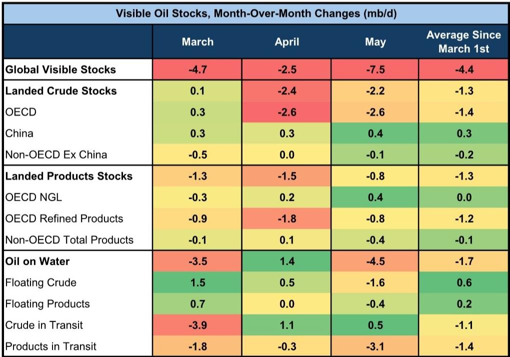
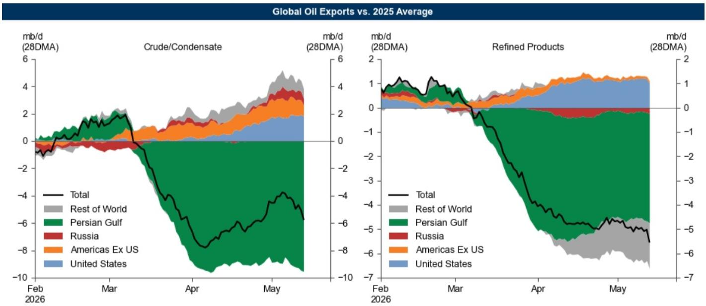

# 美国汽油市场正在成为全球原油定价的新锚点

全球原油市场正经历一场前所未有的结构性分裂。霍尔木兹海峡的流量降至正常水平的5%，波斯湾出口总量每日减少约1500万桶，这些数字本身已足够震撼。但这份某外资投行最新发布的石油追踪报告揭示了一个更值得关注的信号：美国汽油市场正在以远超预期的速度收紧，其库存自4月1日以来以每日70万桶的速度快速下降，目前已低于历史季节性中位数5%。这一变化，正在重塑全球成品油定价体系，并可能成为触发美国石油出口限制的关键变量。

市场目前的注意力主要集中在供给端的巨大缺口上，但真正决定未来几个月油价走向的，可能不是中东的产量恢复速度，而是美国汽油市场能否在夏季出行高峰到来前找到新的平衡。报告中的数据表明，美国汽油批发价格已比亚洲和欧洲高出约15%，每桶溢价21美元，美国零售汽油价格距离历史最高点仅差0.5美元/加仑。这不是一个孤立的价格现象，而是一个正在形成的新的全球定价锚点。

## 1. 美国汽油市场的收紧并非需求驱动，而是出口和炼厂结构调整的共同结果

许多人本能地将汽油价格上涨归因于需求复苏，但报告中的数据显示了不同的逻辑。美国汽油需求仅比去年同期低20万桶/日，表现确实具有韧性，但真正推动库存快速下降的是两个供给侧因素。

第一个因素是净出口的激增。美国汽油净出口同比增长34万桶/日，这意味着美国炼厂生产的汽油正在以更快的速度流向海外市场。美国汽油价格相对于亚洲和欧洲的溢价，使得出口成为比国内销售更具吸引力的选择。这种价差结构本身就在自我强化：出口越多，国内库存越低，价格越高，进一步刺激出口。

第二个因素更为隐蔽。强劲的航空燃料和柴油利润率正在激励炼厂调整产品结构，将更多的原油转化为中间馏分油，而非汽油。这意味着即使原油加工总量不变，汽油的产出比例也会下降。这种炼厂内部的“产品竞争”正在加剧汽油市场的供应紧张。

这两个因素叠加在一起，意味着美国汽油市场的收紧与全球成品油市场的结构性失衡高度相关。美国不再仅仅是一个原油消费国，它正在成为全球成品油市场的关键供应方，而这一角色的转变正在改变其国内市场的定价逻辑。

## 2. 15%的跨区域价差不是套利窗口，而是一个即将触发政策反应的价格信号

美国与亚洲、欧洲之间15%的汽油价差，在正常情况下会引发大规模的套利交易，通过增加进口或减少出口来缩小价差。但当前的市场环境使得这一机制失效——全球可用的汽油供应本身就处于紧张状态。

更关键的是，报告明确指出了这一价差的政治敏感性。美国零售汽油价格距离历史最高点仅一步之遥，而在高通胀环境和中期选举周期中，汽油价格从来不是一个纯粹的市场变量。报告原文的表述值得仔细推敲：“虽然这不是我们的基准情景，但美国石油出口限制的概率可能会随着美国零售汽油价格的上升而增加。”

这是一个典型的政策尾部风险。美国历史上并非没有实施过石油出口限制，2015年才解除的原油出口禁令持续了40年。当前的法律框架下，总统确实拥有在国家安全或经济紧急状态下限制原油和成品油出口的权力。如果零售汽油价格突破历史新高并持续高位运行，政策干预的可能性将从“低概率”变为“不可忽视”。

对于全球原油市场的参与者而言，这意味着需要重新评估美国出口限制这一情景对全球供需平衡的影响。如果美国限制成品油出口，全球汽油市场将面临更严重的供应短缺，而美国国内炼厂利润率则可能进一步上升。

## 3. IEA的供需估算差异揭示了一个被低估的关键变量：不可追踪的存储能力

报告中最具信息增量价值的部分，可能是对IEA与投行自身供需估算差异的分析。IEA对4月全球原油市场的供需缺口估算为530万桶/日，低于投行此前预期的更大缺口。造成这一差异的核心原因是：IEA对中东地区原油供给的估算显著高于投行模型。

具体而言，IEA估算海湾国家4月原油供应为1500万桶/日，比投行模型的1100万桶/日高出400万桶/日，甚至比OPEC二级来源数据（1380万桶/日）还高出120万桶/日。报告指出，这一差异主要由伊朗和阿联酋的供应数据驱动，其背后可能的原因是“不可追踪的存储能力”——即一些存储设施不在常规监控范围内，使得实际可动用的库存高于市场预期。

这是一个非常关键但尚未被充分讨论的问题。如果中东地区确实存在大量未被追踪的存储能力，那么当前市场对供给缺口严重性的判断可能被高估。但反过来，如果这些存储能力只是临时性的库存释放而非可持续的供给，那么市场将在未来几个月面临更大的供需失衡。

报告没有给出明确结论，而是留下了开放性问题：这些“不可追踪的存储能力”到底有多大？它们能维持多久？对于投资者而言，这意味着需要密切关注中东地区的库存数据，而不是仅仅盯着霍尔木兹海峡的船运流量。

## 4. 美国原油产量的小幅超预期掩盖了一个更重要的结构性问题

报告中的一个细节值得单独讨论：2026年第一季度美国原油产量小幅超出预期，其中E&P公司的石油产量比预期高2.1%，综合能源公司的液体产量比预期高1.3%。这看起来是一个积极信号，表明美国生产商正在响应高油价增加产量。

但问题在于，这种增产的幅度相对于全球供给缺口而言几乎是杯水车薪。即便按照报告中的超预期幅度线性外推，美国全年增产也不过几十万桶/日，而波斯湾地区的出口损失是以百万桶/日为单位的。更重要的是，美国生产商的资本纪律在过去两年已经显著收紧，股东回报优先于产量增长已经成为行业共识。这意味着即使油价继续上涨，美国产量增长的空间也可能远低于历史周期中的表现。

这里需要验证的是：美国生产商是否会因为当前的极端价格环境而改变资本配置策略？报告没有给出明确判断，但历史经验表明，当油价足够高、持续时间足够长时，生产商最终会做出响应。只是这一次，响应的时间和幅度可能比市场预期的要慢、要小。

## 5. 全球库存的“区域分化”正在创造新的套利机会和风险点

报告中的全球库存数据呈现出一个明显的区域分化格局：中国和中东的库存增加，而世界其他地区的库存快速下降。自2月底以来，中国库存增加约3500万桶，中东增加约500万桶，而世界其他地区（包括OECD国家）的库存下降幅度更大。

这种分化意味着全球原油市场正在形成三个不同的“价格区域”：中东地区由于出口受阻而出现库存积压，价格相对承压；中国凭借与俄罗斯和伊朗的长期供应协议，获得了相对稳定的供给；而世界其他地区则面临库存快速消耗的压力。

对于炼厂和贸易商而言，这种区域分化创造了明显的套利机会——从中东或中国采购原油运往欧洲或美国，理论上可以获得可观的价差收益。但实际操作中，这种套利受到运力、保险、支付系统等多重因素的限制。报告没有深入分析这些限制条件，但这是理解当前市场流动性的关键。

对于资产定价而言，区域分化的持续意味着不同地区的炼厂利润率将出现显著差异。拥有稳定原油供应的炼厂将获得超额利润，而依赖现货采购的炼厂则面临成本失控的风险。

## 6. 报告尚未完全回答的关键问题：SPR释放的“产品结构失衡”会如何改变市场

报告提到一个容易被忽视但极其重要的细节：自3月11日以来，IEA国家释放的战略石油储备（SPR）总量为9000万桶，其中8200万桶是原油，仅有800万桶是成品油。这意味着SPR释放对成品油市场的直接缓解作用非常有限。

这引出了一个尚未被充分讨论的问题：如果成品油市场（尤其是汽油）继续收紧，而SPR中的成品油库存已经非常有限，各国政府将如何应对？理论上，炼厂可以将释放的原油转化为成品油，但这需要时间，而且炼厂本身的产能利用率已经处于高位。更直接的选项是减少成品油出口或实施价格管制，但这又会引发新的市场扭曲。

报告没有深入分析这一问题的政策含义，但这是一个值得投资者持续跟踪的关键变量。如果美国汽油价格在夏季出行高峰期间突破历史新高，而政府发现SPR无法直接缓解汽油供应紧张，政策干预的力度和方向可能会发生根本性变化。

---

以上讨论的问题——不可追踪的存储能力、美国生产商的资本纪律、区域分化的套利限制、SPR释放的产品结构失衡——正是完整报告的核心分析框架中尚未完全展开的部分。在完整报告中，投行分析师对每一个问题都提供了更详细的数据支撑和情景分析，包括不同情景下的供需平衡表、价格路径模拟，以及对炼厂利润率和跨区域价差的量化预测。

这些内容对于理解当前市场的真实风险和机会至关重要。欢迎来我们的知识星球和微信群继续讨论，我们将围绕完整报告中的关键图表和假设展开更深入的拆解，并持续跟踪后续数据更新对核心判断的验证或修正。

Personal reading notes and learning share only. Not investment advice.

