# Global Air Tech

# Global Air Tech: Airline supply under the microscope. Maintain Outperform on Amadeus and Market-Perform on Sabre

Alex Irving, CFA

+44 20 7676 7044

alex.irving@Bernsteinsg.com

Antoine Madre

+33 1 58 98 74 52

antoine.madre@Bernsteinsg.com

# Specialist Sales

Kiran Shah, CFA

+44 20 3547 1533

kiran.shah@Bernsteinsg.com

AI was dethroned as the hottest topic at air tech earnings, as investor focus shifted to near-term volume trends, and pressure on these following the outbreak of war in the Middle East and the rise in fuel prices. Q1 results were solid, despite cancellations weighing on both bookings and passengers boarded, with a more pronounced impact at Amadeus than Sabre given the regional footprints. However, the former was able to offset this through its broad IT product portfolio, with upselling, Nevio revenues, professional services and rebooking all contributing. Looking ahead, airlines are adjusting capacity dynamically, and we see particular risk to winter capacity should fuel remain expensive and/or demand worsen. We remain conviction buyers of Amadeus, supported by its low leverage, scale and strong product innovation, and maintain Sabre at Market-Perform, given persistently high leverage that we expect to remain above 5x through the end of the decade.

A robust Q1. Amadeus' results were strong, as upselling and other solutions mitigated the impact of geopolitical headwinds to volume. Somewhat surprisingly, full-year guidance was maintained despite the geopolitical impact on air travel: we still see downside risk to this year's volume targets as airlines decide on winter capacity. Sabre, which has lower direct exposure to the conflict, reported its strongest air booking growth in over two years (+6%) despite cancellations. Its EBITDA guidance for the full year was maintained, despite a modest reduction in booking volume expectations (from MSD to LSD-MSD).

Airlines are reducing schedules ... The world's airlines have reduced capacity since the conflict, with the Middle East most impacted by restrictions, and other carriers trimming schedules to better absorb the c.70% increase in jet fuel prices versus pre-conflict levels. Global schedules are now flat YoY in Q2 and +3.9% in Q3. This represents a mid-single-digit decline in Q2 vs pre-conflict expectations and a low-single-digit shortfall in Q3. Amadeus and Sabre expect around 3% volume growth for the full year, supported by a recovery in H2.

... with downside risks ahead. Air Tech stocks generate profit from volume, while airlines rely on both volumes and fares, leading to a divergence in interests. The risk of capacity cuts remains, as despite a robust fare environment, and in our view if jet fuel prices remain elevated, the small reductions announced so far will not be enough. We see winter as more exposed to potential cuts, given seasonally lower contribution margins. We also see shorter stagelength routes as more likely to be cut, given their higher share of variable costs (i.e. lower contribution margins), suggesting seats may fall by more than ASKs if airlines start to pull back on schedules.

Remain Outperform on Amadeus, Market-Perform on Sabre. In the current volatile environment, our medium-term thesis remains unchanged. We continue to view Amadeus as well positioned as the leader in Air IT, with Air Distribution, in our view, more of an ex-growth cash cow. We have slightly reduced our 2027 forecasts for Amadeus to reflect risks to capacity, while incorporating IDEMIA into our forecasts. We revise Sabre numbers higher following the strong quarter, but still expect its leverage to remain above 5x net debt/EBITDA through the end of the decade. We maintain Outperform on Amadeus and Market-

Perform on Sabre.

Bernstein TICKER TABLE 

<table><tr><td rowspan="2" colspan="3"></td><td colspan="2">12 May2026</td><td colspan="2">TTM</td><td colspan="4">Adjusted EPS</td><td colspan="3">Adjusted P/E (x)</td></tr><tr><td rowspan="2">ClosingPrice</td><td rowspan="2">PriceTarget</td><td rowspan="2">Rel.Perf.</td><td rowspan="2">Cur</td><td rowspan="2">2025A</td><td rowspan="2">2026E</td><td rowspan="2">2027E</td><td rowspan="2">2025A</td><td rowspan="2">2026E</td><td rowspan="2">2027E</td><td></td></tr><tr><td>Ticker</td><td>Rating</td><td>Cur</td><td></td></tr><tr><td>AMS.SM (Amadeus)</td><td>O</td><td>EUR</td><td>52.40</td><td>75.00</td><td>(39.5)%</td><td>EUR</td><td>2.92</td><td>3.31</td><td>3.68</td><td>17.9</td><td>15.8</td><td>14.2</td><td></td></tr><tr><td>OLD</td><td></td><td></td><td></td><td></td><td></td><td></td><td></td><td>3.16</td><td>3.85</td><td></td><td></td><td></td><td></td></tr><tr><td>SABR (Sabre)</td><td>M</td><td>USD</td><td>1.83</td><td>1.75</td><td>(64.2)%</td><td>USD</td><td>(0.04)</td><td>(0.02)</td><td>0.08</td><td>(48.6)</td><td>(94.9)</td><td>21.8</td><td></td></tr><tr><td>OLD</td><td></td><td></td><td></td><td>1.50</td><td></td><td></td><td></td><td>(0.03)</td><td>0.04</td><td></td><td></td><td></td><td></td></tr><tr><td>EDME</td><td></td><td></td><td>1,514.65</td><td></td><td></td><td></td><td></td><td></td><td></td><td></td><td></td><td></td><td></td></tr><tr><td>SPX</td><td></td><td></td><td>7,444.25</td><td></td><td></td><td></td><td></td><td></td><td></td><td></td><td></td><td></td><td></td></tr></table>

# PRICE TARGET CHANGE / ESTIMATE CHANGE IN BOLD

O - Outperform, M - Market-Perform, U - Underperform, NR - Not Rated, CS - Coverage Suspended

Source: Bloomberg, Bernstein estimates and analysis.

# INVESTMENT IMPLICATIONS

Amadeus (Outperform, €75.00) is the largest player in Air distribution and Air IT. It is skewed to better businesses, with >60% of EBITDA contribution (and rising) coming from Air IT and Hospitality, leaving 40% - and falling - coming from the ex-growth GDS business. Amadeus continues to take share among GDSs in distribution, and keeps picking up new contracts in Air IT. The balance sheet is healthy, and the group is returning cash. We see a c. 18% annual TSR in 2027-30 at a constant multiple: 10% annual growth in net income (boosted also by the acquisition of IDEMIA), with a 4% dividend yield and 4% buyback (which keeps leverage constant, but we do not rule out the possibility of further accretive M&A). The products are well-invested and well-positioned for the future. Nevio also looks likely to lead to further contract wins in Air IT, and likely to pick up steam following the announcement of deals with British Airways, Air France-KLM, and Lufthansa Group. Further eventual share gains for Amadeus, either from competitors or through newly-outsourced contracts, continue to look likely. We remain Outperform.

Our price target of €75.00 is set at 20.1x our 2027 EPS estimate of €3.7. We remain convinced of Amadeus's ability to compound returns in the high-teens, and see the group as a highly appealing medium-term holding. A moderation of (in our view overdone) fears around AI disruption would be the clearest path to a re-rating.

Sabre (Market-Perform, \$1.75) is far more skewed to the ex-growth GDS market, at c. 80% of revenues. Its smaller IT Solutions business depends on a few large customers (chiefly American at c. 35% of volumes). In both segments it is overweight North America and more levered to booking and passenger trends in this region. Leverage remains stubbornly high: while there is no meaningful near-term refinancing risk, with debt maturities minimal until 2029, we see only very slow organic deleveraging. On our assessment that the GDS industry is essentially ex-growth, we have net debt / EBITDA remaining above 5x until the end the decade. Investors should bear in mind that the airline industry is cyclical, and a future downturn will come. Absent a significant improvement in earnings, Sabre risks going into that eventual downturn with a too-fragile balance sheet.

We value Sabre at 7.0x FY+1 EV/EBITDA, down from 7.4x, which on our 2027 EBITDA estimate provides our target price of \$1.75, and we rate the company Market-Perform.

# RELATED RESEARCH

Air Tech Deck

# Company Models

Amadeus | Sabre

# Primer Library

Global Distribution Systems: A primer on Global Distribution Systems — the crumbling oligopoly

Hotel Distribution: What happens when you click "Book now"? - A primer on hotel distribution tech

Hotel IT: Byte and breakfast - A primer on hotel IT systems

# Sector research

Amadeus: Artificial Intelligence... Sooner or Later - Risk-averse airlines mean slow change for Air Tech

Amadeus: Al defenses in Paris. Roadshow takeaways from this week's investor meetings

Global Air Tech: Strong AI defences, weak AI defences. Downgrading Sabre to Market-Perform, TP \$1.50

Amadeus: Air IT's four defences against AI disruption

Amadeus: The GDS is not about to vanish... But shares are priced as though it will

Global Air Tech: The year of AI disintermediation? Plenty of talk, limited action (2026 outlook)

# DETAILS

# FOCUS TOPIC: MIDDLE EAST CONFLICT AND AIRLINE CAPACITY FOR 2026 AND BEYOND

# AIRLINE CAPACITY RISKS REMAIN AHEAD

The Middle East conflict has created both direct and indirect headwinds for air travel. There was initially a sharp reduction in flying in the region on security concerns, with significant cancellations impacting booking volumes. At the same time, higher fuel costs are putting pressure on an already low-margin industry, forcing airlines into a capacity response. Q2 schedules now appear largely flat YoY, while Q3 is more resilient (+3.9% globally). For now, airlines continue to highlight a strong demand and fare environment — particularly on long-haul routes — which is helping to offset cost pressures. Booking visibility diminishes into winter, where we see capacity as being at greater risk, on seasonally lower contribution margins and lower hedging (for those that hedge). For Air Tech, revenues are primarily volume-driven, while airlines rely on a mix of pricing and capacity adjustments, creating a divergence in interests. With airlines still retaining flexibility to cut capacity any further demand weakness could translate into additional cuts, ultimately weighing on bookings and passengers boarded.

- Middle East conflict creates volume headwind, with effects both direct... The first two months of the year were broadly stable. However, the war in the Middle East has since changed the outlook, with the most immediate impact being a reduction in flying across the region. Many airlines from other regions canceled flights to affected countries, while airlines based in the region are operating well below pre-war activity levels. For the two largest carriers, Emirates is down around 20% and Qatar around 40%. Booking volumes have been impacted even more, as figures are reported net of cancellations. For Amadeus, the Middle East represents a high-single-digit share of both bookings and passengers boarded.   
- ...And indirect, with capacity cuts beyond the Middle East coming. The typical airline runs at a single digit EBIT margin and spends \~25% of its revenue on fuel. Jet fuel prices have doubled: all else equal, and before the impact of hedging (for those that do hedge), margins fall well into the negative double digits. That is clearly unsustainable, and prices need to rise. Airlines largely lack pricing power, and the only reliable way to get unit revenue up is to reduce capacity. Into summer, these cuts have been modest, but if conditions persist, additional cuts in the 5-10% range become plausible. Several carriers, particularly in Europe, are still supported by fuel hedges, but they will become increasingly exposed to spot prices over time. If the industry resists voluntary capacity cuts, these could become involuntary, as weaker airlines cease to exist.   
- Current schedule: cuts in Q2, Q3 in wait-and-see mode. Airline schedules have declined compared with pre-conflict levels, with global capacity currently at +0.4% YoY in Q2 and +3.9% in Q3. This is a mid-single-digit percentage point cut vs pre-conflict expectations in Q2, and slightly below pre-conflict levels in Q3. Regionally, the Middle East has seen the largest cuts, with Emirates operating at 82% of normal capacity as of May 5, Etihad at 73%, and Qatar at 57%, highlighting the disruption to travel in the region. By contrast, Asia-Europe routes are adding capacity, benefiting from the reduction in Gulf connectivity. Elsewhere, capacity cuts have been more limited, with Latin America, Europe, and China remaining among the most resilient regions, still delivering low to mid-single-digit growth, while North America and Asia ex-China are now flat YoY. The Q3 peak season appears, for now, relatively less affected. For the full year, Air Tech providers are assuming c.3% growth, supported by a recovery in the second half of the year: an expectation we see as optimistic.   
- From airlines: fewer flights, but fares remain very strong. Europe's and North America's largest legacy airlines have now reported their Q1 results, with most reducing capacity guidance for the year: United by $5\%$ through September, Delta by $3.5\%$ in Q2, and Air France-KLM, Lufthansa, and IAG by low-single-digit percentages versus prior plans. Meanwhile, airlines point to a strong demand and fare environment, particularly on long-haul routes, while trends in medium-haul and domestic markets remain more mixed depending on hedging levels and competitive intensity. Notably, Lufthansa expects to offset $>100\%$ of fuel cost increases in H2, primarily through higher fares adjustments in 2026.   
- Airline supply: from summer strength to winter strain? Air Tech stocks generate revenue from volumes — i.e. bookings and passengers boarded — while airlines rely on a combination of yields (fares) and volumes, meaning their interests can diverge, especially during periods requiring schedule cuts. Airlines currently have around 80% of Q2 capacity booked and roughly 50% for Q3, with visibility likely around 20-30% for Q4. As a consequence, the currently strong fare environment discussed is likely to reflect less than half of the flights on sale. Airlines benefit from a cost base that is 60-80% variable, allowing them to adjust capacity and mitigate losses if needed. Q2 schedules now appear largely finalized, with global capacity at around +0.4% YoY, while Q3 capacity of +3.9% YoY still carry downside risk if current conditions persist. Elevated jet fuel prices — around 70% above pre-conflict levels — are putting pressure on an industry that typically operates on

single-digit margins, reinforcing capacity discipline. Looking further ahead, winter is in our view even more exposed to potential cuts given weaker seasonality, increasing macro headwinds and lower visibility, weighing on Air Tech volumes.

EXHIBIT 1: Global aviation seat capacity, YoY, Q2 2026   
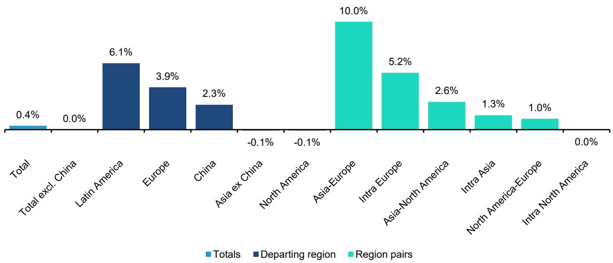

bar

| Category | Total (%) | Departing region (%) | Region pairs (%) |
| :--- | :--- | :--- | :--- |
| Total | 0.4 | 0.0 | 0.0 |
| Total excl. China | 0.0 | 6.1 | 0.0 |
| Latin America | 0.0 | 3.9 | 0.0 |
| Europe | 0.0 | 2.3 | 0.0 |
| China | 0.0 | 0.0 | 0.0 |
| Asia ex China | -0.1 | 0.0 | 0.0 |
| North America | -0.1 | 0.0 | 0.0 |
| Asia-Europe | 0.0 | 10.0 | 5.2 |
| Intra Europe | 0.0 | 0.0 | 2.6 |
| Asia-North America | 0.0 | 0.0 | 1.3 |
| Intra Asia | 0.0 | 0.0 | 1.0 |
| North America-Europe | 0.0 | 0.0 | 1.0 |
| Intra North America | 0.0 | 0.0 | 0.0 |

Source: SRS, Bernstein analysis

EXHIBIT 2: Global aviation seat capacity, YoY, Q3 2026   
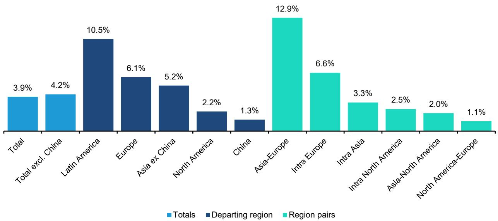

bar

| Category | Total (%) | Departing region (%) | Region pairs (%) |
| :--- | :--- | :--- | :--- |
| Total | 3.9 | | |
| Total excl. China | 4.2 | | |
| Latin America | 10.5 | | |
| Europe | 6.1 | | |
| Asia ex China | 5.2 | | |
| North America | 2.2 | | |
| China | 1.3 | | |
| Asia-Europe | 12.9 | | |
| Intra Europe | 6.6 | | |
| Intra Asia | 3.3 | | |
| Intra North America | 2.5 | | |
| Asia-North America | 2.0 | | |
| North America-Europe | 1.1 | | |

Source: SRS, Bernstein analysis

EXHIBIT 3: Airlines continue to announce capacity reductions following the increase in fuel prices 

<table><tr><td>Airlines</td><td>% of total airline capacity</td><td>Period</td><td>Details</td></tr><tr><td>United Airlines</td><td>5.0%</td><td>Till September 2026</td><td>Announced in response to fuel costs for most of 2026 (through September)</td></tr><tr><td>Delta Air Lines</td><td>3.5%</td><td>Q2 2026 reduction</td><td>Trimming Q2 2026 capacity growth to manage $2 billion in extra fuel costs</td></tr><tr><td>Lufthansa Group</td><td>2-4%</td><td>Full year 2026</td><td>2–4 percentage-points lower ASK growth</td></tr><tr><td>IAG</td><td>2.0%</td><td>Q2 2026 / Q3 2026</td><td>2% reduction vs prior Q2 &amp; Q3 plan</td></tr><tr><td>Air France KLM</td><td>1.0%</td><td>Full year 2026</td><td>AF-KLM cut its 2026 capacity guidance by ~1pt of growth</td></tr><tr><td>Batik Air Malaysia</td><td>36% of domestic capacity</td><td>Undisclosed</td><td>Cites &quot;crisis-mode&quot; environment.</td></tr><tr><td>HK Express</td><td>6.0%</td><td>May - June</td><td>Reduction in total frequencies from May 11 through June 30</td></tr><tr><td>Cathay Pacific</td><td>2.0%</td><td>May - June</td><td>Consolidation of passenger flights from mid-May to late June</td></tr><tr><td>Air Canada</td><td>1.0%</td><td>June - Oct</td><td>Includes cuts to e.g. JFK</td></tr></table>

Source: Media and company reports, Bernstein analysis

EXHIBIT 4: Middle East carriers are operating at reduced activity levels, with Emirates currently at 82%, Etihad at 73% and Qatar at 57%   
Flight count as percentage of average before Feb 28 2026   
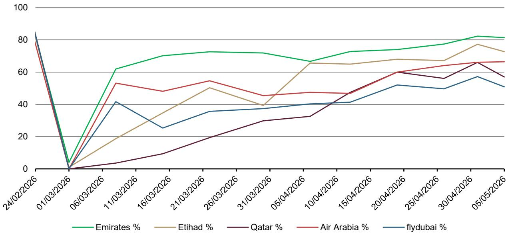

line

| Date       | Emirates % | Etihad % | Qatar % | Air Arabia % | flydubai % |
| ---------- | ---------- | -------- | ------- | ------------ | ---------- |
| 24/02/2026 | 85         | 80       | 80      | 80           | 85         |
| 01/03/2026 | 0          | 0        | 0       | 0            | 0          |
| 06/03/2026 | 60         | 20       | 5       | 50           | 40         |
| 11/03/2026 | 70         | 30       | 10      | 55           | 25         |
| 16/03/2026 | 75         | 40       | 15      | 50           | 35         |
| 21/03/2026 | 75         | 50       | 20      | 55           | 35         |
| 26/03/2026 | 75         | 45       | 25      | 50           | 35         |
| 31/03/2026 | 75         | 40       | 30      | 45           | 35         |
| 05/04/2026 | 70         | 65       | 35      | 45           | 40         |
| 10/04/2026 | 75         | 65       | 40      | 45           | 40         |
| 15/04/2026 | 75         | 65       | 45      | 50           | 45         |
| 20/04/2026 | 75         | 65       | 50      | 60           | 50         |
| 25/04/2026 | 75         | 65       | 55      | 65           | 45         |
| 30/04/2026 | 80         | 75       | 65      | 65           | 55         |
| 05/05/2026 | 80         | 70       | 55      | 65           | 50         |

Source: Flightradar24, Bernstein analysis

# Q1 RECAP

# Amadeus

- Beat on the quarter. Amadeus's Q1 '26 results beat on EBITDA (+5.5%). Net income was 4% ahead.   
- Air IT: 12% revenue growth at constant fx. In Air IT, passengers boarded increased by +3.1% YoY, and +3.9% excluding the MEA region and drag from the Iran war (as a reminder, a high single digit share of Amadeus's volumes derives from the region). Revenue per PB grew +8.6% at constant fx with upselling, Nevio revenue, professional services and rebooking all adding support. Revenue in the segment was +5% ahead of consensus.   
- Air distribution: 4.6% revenue growth at constant fx. Air distribution bookings were broadly flat YoY (-0.2%), with a 4%pt drag from the Middle East, by +3.3% YoY. Revenue per booking was especially strong, growing +4.8% YoY at constant currency, despite a likely drag in the Middle East, which overindexes to international bookings. Segment revenue was +1% ahead of consensus.   
- HOS: +9.8 revenue growth at constant fx. The smaller HOS division saw constant currency revenue growth fall to +9.8% YoY after the sharp acceleration in Q4, resulting in revenue in line with consensus.   
- EBITDA margins ahead. Amadeus's EBITDA margin was up 80bps YoY at $39.3\%$ , representing a 125bps beat vs consensus expectations. EBITDA ultimately beat by $5.5\%$ . Among the group's main cost lines, cost of revenue grew by $+4\%$ YoY, while personnel costs fell $-1\%$ .   
- Outlook held. Amadeus expects to be within the guided range for 2026: surprisingly in our view, given the impact on air travel from the war in the Middle East, and in our assessment a high probability of a capacity slowdown into winter, following the sharp move higher in jet fuel prices (spot and forward). The guide is predicated on a recovery in H2, and global air traffic growing 3% in 2026. As a reminder, the guidance is:

2026 revenue: HSD growth

2026 adj. EBIT margin: stable

2026 FCF: €1.35bn-€1.45bn

2026 Air IT: HSD revenue growth (constant fx), margins slightly dilutive (mix effect)

2026 Air Distribution: MSD-HSD revenue growth (constant fx), stable margin

2026 HOS: low double digit revenue growth (constant fx), expanding margins

# Sabre

Numbers: EBITDA above guidance, on higher booking growth. Sabre's quarterly revenue came in at \$760m, a 8% beat versus consensus, with Market place (new name replacing Distribution) +9% and Airline Technology (new name replacing IT solutions) +7% YoY. Adj. EBITDA reached \$159m, above company guidance of \$130m, on higher revenues. As a result, operating income stood at \$116m, a 27% increase YoY (was \$91m in Q1 2025). Q1 FCF reached -\$155m. Q1 passengers boarded were +3% YoY, at 170m. Bookings increased by 6% YoY.

2026 Guidance: EBITDA outlook held at \$585m, Air distribution volume lowered from mid single digit growth to low-mid single digit growth, and negative FCF. Sabre now expects air distribution volumes to see low-mid single digit growth in FY26 (Q2 guided near flat). It sees revenue also growing low-mid single digit for FY26 (Q2 seen flat to nominal growth), and pro forma adj. EBITDA at c. \$585m for FY, unchanged from the FY guide and with \$130m expected for Q2. The company continues to expect FCF of -\$70m and capex of \$80m. The outlook assumes the Middle East war sUBSides during the second quarter, with a gradual recovery through Q3/Q4.

Initial indications for 2027 point to mid single digit revenue growth, YoY adjusted EBITDA growth, and return to positive free cash flow.

• EBITDA: \$585m (unchanged from \$585m)   
• Air distribution volume: low to mid single digit growth (lowered from mid single digit growth)   
• FCF: -\$70m (unchanged from -\$70m)

# LEARNINGS FROM Q1 EARNINGS

# AIR IT: AMADEUS' ADDITIONAL MODULES ACT AS A HEDGE AGAINST DISRUPTION

Amadeus and Sabre recorded broadly similar growth in passengers boarded and revenue in Q1, despite still-significant FX headwinds at the Spanish company (revenue per PB +8.6% at constant fx). Nevertheless, Amadeus benefited from upselling additional modules (upselling, Nevio revenue, professional services and rebooking all adding support). This helps to offset volume declines in the MEA region, representing a high single digit share of both passengers boarded and bookings. The transition to Order Management continues to gain momentum, with Lufthansa Group notably signing for Nevio during the quarter. Looking ahead, we therefore expect airlines in other regions to increasingly make decisions on modernizing their IT infrastructure, with Amadeus Nevio well positioned to attract incremental customers.

- Volumes: The conflict is weighting on 2026. Passengers boarded increased by 3.1% at Amadeus in Q1 (3.9% excluding MEA), supported by a strong start to the year in January and February. Sabre reported PB growth of 2.5%. Looking ahead, we expect Amadeus to decelerate in Q2 and Sabre to slightly accelerate, based on current schedule data for their respective PSS customers. Amadeus is more exposed to the conflict due to its high-single-digit exposure to the MEA region, while Sabre has a soft comp from Liberation Day and DOGE-induced headwinds from prior year, and benefits from the PSS cutover of Hawaiian. Amadeus also suffers from the end of operations at Navitaire customer Spirit.   
- Revenue per PB growing 4% at Amadeus and Sabre. Despite FX headwinds, Amadeus continues to report rising revenue per passenger boarded, +4% reported (+8.6% at constant FX in Q1). This growth is driven by ongoing upselling, additional Nevio revenues, airline professional services, and rebooking/distribution services, which provide some hedging against volume cuts. Sabre has seen a similar trend, with revenue per passenger boarded up 4%, recovering from -7% YoY in Q4 against a relatively tough comparable base in Q4.   
- Capacity cuts vs upselling: can Amadeus hold the line? Amadeus was particularly vocal during its earnings call, highlighting its ability to offset volume declines through modular upselling, with revenue per booking continuing to rise. This acts as a genuine hedge against declines in passengers boarded, supported by its broad suite of solutions. The company is well positioned across all segments, with the ability to sell additional modules to airlines on a modular basis, underpinned by higher R&D investment and strong product capabilities. While Amadeus has so far maintained its guidance of high-single-digit revenue growth for the year, it appears in our assessment more likely to land at the lower end of the range, with potential downside risk once visibility improves.   
- Order management systems: the snowball gathering pace, as Lufthansa contracts for Nevio. Airlines are increasingly moving towards Order Management Systems. The modernization of IT and eventual replacement of the PSS look set to bring major benefits to airlines: potentially adding 2-3% to unit revenue, which on typical margins may add 25-35% to EBIT. Some airline executives we have spoken to see the potential benefit to industry unit revenues as even larger. During Q1, Lufthansa announced that 9 of its group airlines are set to adopt Nevio. Amadeus seems to broadly agree that a good double-digit revenue per PB uplift is appropriate, although understandably is not sharing details of commercially sensitive and confidential contracts. We expect that the more airlines move, the more other airlines will feel the pressure to undertake their own modernizations. Quoting Amadeus management at the FY 2025 results: “After the major European players, major players in the US, in Asia and the Middle East [are] coming out with RFIs and RFPs. So we really see the market moving, and we expect now a lot more movement than these foundational customers.”

EXHIBIT 5: Passengers boarded growth trends across Amadeus and Sabre   
YoY change   
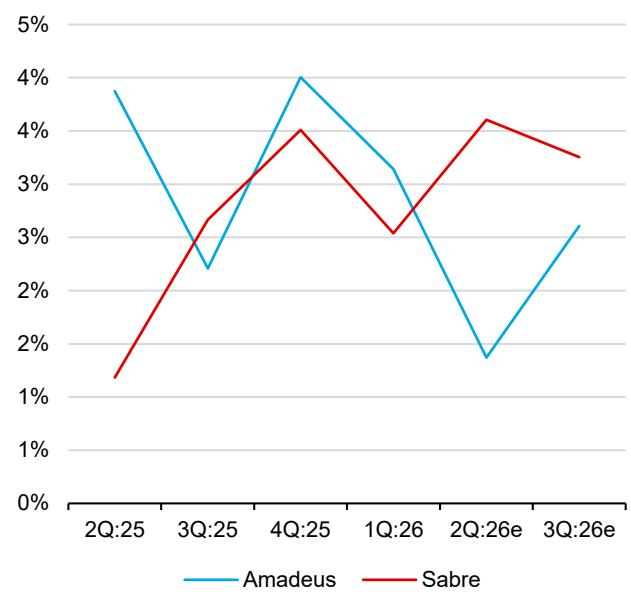

line

| Quarter | Amadeus | Sabre |
| ------- | ------- | ----- |
| 2Q:25   | 4%      | 1.3%  |
| 3Q:25   | 2.4%    | 3.0%  |
| 4Q:25   | 4%      | 4%    |
| 1Q:26   | 3.3%    | 3%    |
| 2Q:26e  | 1.8%    | 4.2%  |
| 3Q:26e  | 3.2%    | 3.5%  |

Source: Company reports, Bernstein estimates and analysis

EXHIBIT 6: Revenue per PB growth trends across Amadeus and Sabre   
YoY change   
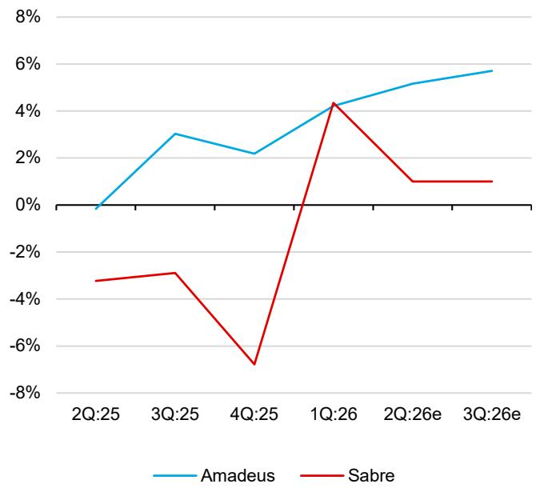

line

| Quarter | Amadeus | Sabre |
| ------- | ------- | ----- |
| 2Q:25   | 0%      | -3%   |
| 3Q:25   | 3%      | -3%   |
| 4Q:25   | 2%      | -7%   |
| 1Q:26   | 4%      | 4%    |
| 2Q:26e  | 5%      | 1%    |
| 3Q:26e  | 6%      | 1%    |

Source: Company reports, Bernstein estimates and analysis

EXHIBIT 7: Air IT (IT Solutions) growth trends across Amadeus and Sabre   
YoY change   
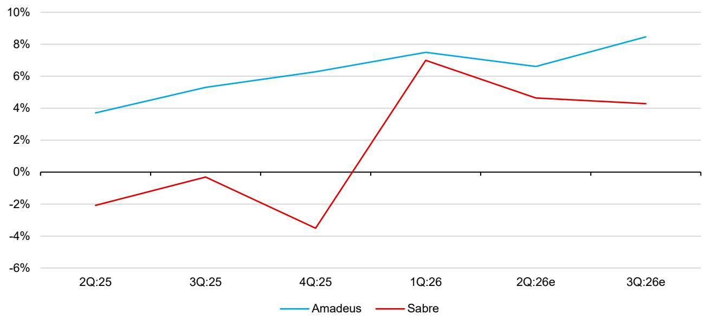

line

| Quarter | Amadeus | Sabre |
| ------- | ------- | ----- |
| 2Q:25   | 3.7%    | -2.0% |
| 3Q:25   | 5.2%    | -0.5% |
| 4Q:25   | 6.0%    | -3.5% |
| 1Q:26   | 7.5%    | 7.0%  |
| 2Q:26e  | 6.5%    | 4.5%  |
| 3Q:26e  | 8.5%    | 4.2%  |

Source: Company reports, Bernstein estimates and analysis

EXHIBIT 8: Our proprietary model suggests Amadeus sees c. 580m passengers boarded in the next quarter   
Amadeus PSS customer seats vs passengers boarded   
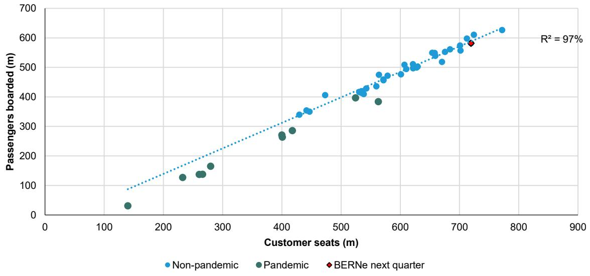

scatter

| Customer seats (m) | Passengers boarded (m) | Category        |
| ------------------ | ---------------------- | --------------- |
| 140                | 30                     | Pandemic        |
| 230                | 130                    | Pandemic        |
| 260                | 140                    | Pandemic        |
| 280                | 160                    | Pandemic        |
| 400                | 270                    | Pandemic        |
| 420                | 280                    | Pandemic        |
| 450                | 350                    | Non-pandemic    |
| 470                | 400                    | Non-pandemic    |
| 520                | 400                    | Non-pandemic    |
| 550                | 450                    | Non-pandemic    |
| 570                | 470                    | Non-pandemic    |
| 580                | 480                    | Non-pandemic    |
| 600                | 500                    | Non-pandemic    |
| 620                | 510                    | Non-pandemic    |
| 650                | 530                    | Non-pandemic    |
| 670                | 550                    | Non-pandemic    |
| 680                | 560                    | Non-pandemic    |
| 690                | 570                    | Non-pandemic    |
| 700                | 580                    | Non-pandemic    |
| 710                | 590                    | Non-pandemic    |
| 720                | 600                    | Non-pandemic    |
| 730                | 610                    | Non-pandemic    |
| 740                | 620                    | Non-pandemic    |
| 750                | 630                    | Non-pandemic    |
| 760                | 640                    | Non-pandemic    |
| 770                | 650                    | Non-pandemic    |
| 780                | 660                    | Non-pandemic    |
| 790                | 670                    | Non-pandemic    |
| 800                | 680                    | Non-pandemic    |
| 810                | 690                    | Non-pandemic    |
| 820                | 700                    | Non-pandemic    |
| 830                | 710                    | Non-pandemic    |
| 840                | 720                    | Non-pandemic    |
| 850                | 730                    | Non-pandemic    |
| 860                | 740                    | Non-pandemic    |
| 870                | 750                    | Non-pandemic    |
| 880                | 760                    | Non-pandemic    |
| 890                | 770                    | Non-pandemic    |
| 900                | 780                    | Non-pandemic    |
| 140                | 90                     | Non-pandemic    |
| 230                | -                      | Non-pandemic    |
| 260                | -                      | Non-pandemic    |
| 280                | -                      | Non-pandemic    |
| 400                | -                      | Non-pandemic    |
| 420                | -                      | Non-pandemic    |
| 450                | -                      | Non-pandemic    |
| 470                | -                      | Non-pandemic    |
| 520                | -                      | Non-pandemic    |
| 550                | -                      | Non-pandemic    |
| 570                | -                      | Non-pandemic    |
| 600                | -                      | Non-pandemic    |
| 620                | -                      | Non-pandemic    |
| 650                | -                      | Non-pandemic    |
| 670                | -                      | Non-pandemic    |
| 680                | -                      | Non-pandemic    |
| 690                | -                      | Non-pandemic    |
| 700                | -                      | Non-pandemic    |
| 710                | -                      | Non-pandemic    |
| 720                | -                      | Non-pandemic    |
| 730                | -                      | Non-pandemic    |
| 740                | -                      | Non-pandemic    |
| 750                | -                      | Non-pandemic    |
| 760                | -                      | Non-pandemic    |
| 770                | -                      | Non-pandemic    |
| 780                | -                      | Non-pandemic    |
| 790                | -                      | Non-pandemic    |
| 800                | -                      | Non-pandemic    |
| 810                | -                      | Non-pandemic    |
| 820                | -                      | Non-pandemic    |
| 830                | -                      | Non-pandemic    |
| 840                | -                      | Non-pandemic    |
| 850                | -                      | Non-pandemic    |
| 860                | -                      | Non-pandemic    |
| 870                | -                      | Non-pandemic    |
| 880                | -                      | Non-pandemic    |
| 890                | -                      | Non-pandemic    |
| 900                | -                      | Non-pandemic    |
| 140                | -                      | Non-pandemic    |
| 230                | -                      | Non-pandemic    |
| 260                | -                      | Non-pandemic    |
| 280                | -                      | Non-pandemic    |
| 400                | -                      | Non-pandemic    |
| 420                | -                      | Non-pandemic    |
| 450                | -                      | Non-panemic    |
| 470                | -                      | Non-panemic    |
| 520                | -                      | Non-panemic    |
| 550                | -                      | Non-panemic    |
| 570                | -                      | Non-panemic    |
| 600                | -                      | Non-panemic    |
| 620                | -                      | Non-panemic    |
| 650                | -                      | Non-panemic    |
| 670                | -                      | Non-panemic    |
| 680                | -                      | Non-panemic    |
| 690                | -                      | Non-panemic    |
| 700                | -                      | Non-panemic    |
| 710                | -                      | Non-panemic    |
| 720                | -                      | Non-panemic    |
| 730                | -                      | Non-panemic    |
| 740                | -                      | Non-panemic    |
| 750                | -                      | Non-panemic    |
| 760                | -                      | Non-panemic    |
| 770                | -                      | Non-panemic    |
| 780                | -                      | Non-panemic    |
| 790                | -                      | Non-panemic    |
| 800                | -                      | Non-panemic    |
| 810                | -                      | Non-panemic    |
| 820                | -                      | Non-panemic    |
| 830                | -                      | Non-panemic    |
| 840                | -                      | Non-panemic    |
| 850                | -                      | Non-panemic    |
| 860                | -                      | Non-panemic    |
| 870                | -                      | Non-panemic    |
| 880                | -                      | Non-panemic    |
| 890                | -                      | Non-panemic    |
| 900                | -                      | Non-panemic    |
R² = 97%

Source: SRS, Company reports, Bernstein analysis

EXHIBIT 9: Our proprietary model suggests Sabre sees c. 175m passengers boarded in the next quarter   
Sabre PSS customer seats vs passengers boarded   
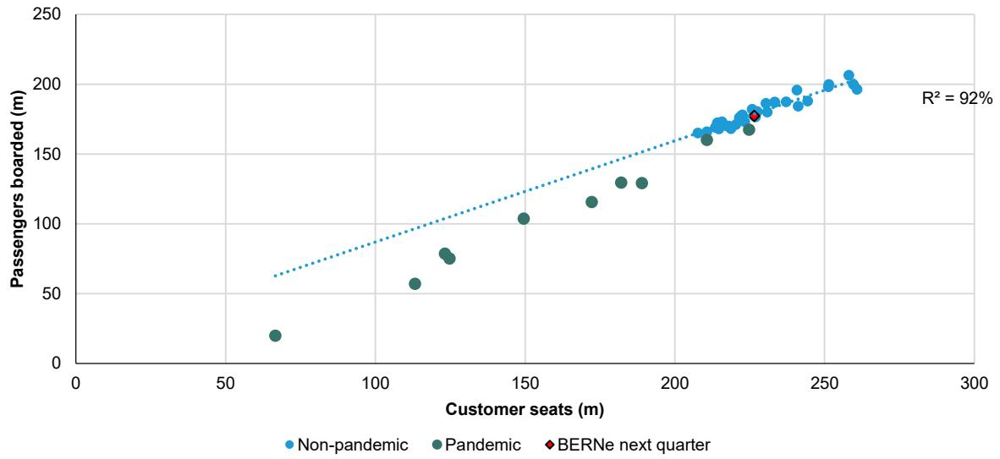

scatter

| Customer seats (m) | Passengers boarded (m) | Category        |
| ------------------ | ---------------------- | --------------- |
| 60                 | 20                     | Pandemic       |
| 110                | 55                     | Pandemic       |
| 120                | 75                     | Pandemic       |
| 150                | 100                    | Pandemic       |
| 170                | 115                    | Pandemic       |
| 180                | 130                    | Pandemic       |
| 190                | 130                    | Pandemic       |
| 210                | 160                    | Non-pandemic    |
| 220                | 170                    | Non-pandemic    |
| 230                | 180                    | Non-pandemic    |
| 240                | 190                    | Non-pandemic    |
| 250                | 200                    | Non-pandemic    |
| 260                | 205                    | Non-pandemic    |
| 270                | 210                    | Non-pandemic    |
| 280                | 215                    | Non-pandemic    |
| 290                | 220                    | Non-pandemic    |
| 300                | 225                    | Non-pandemic    |
| 230                | 175                    | BERNe next quarter |

Source: SRS, Company reports, Bernstein analysis

# AIR DISTRIBUTION: BOOKINGS IMPACTED BY CANCELLATIONS, 2026 STILL A QUESTION MARK, BUT LONGER-TERM RISKS REMAIN

Air Distribution delivered an exceptional quarter, with bookings flat at Amadeus due to cancellations, while Sabre reached +5.5%, benefiting from lower exposure to the conflict as well as strong momentum in North America and corporate travel. Overall, revenue grew +5% for Amadeus at constant currency (reported flat) and +8% for Sabre. Outlooks for both Amadeus and Sabre have softened, with weaker Q2 net bookings, but a recovery still expected in H2. FY 2026 air travel growth is now seen at c.3% by both companies, with downside risks from potential additional capacity cuts, particularly in winter. Air travel demand remains resilient so far, with strong fares — especially on long-haul routes — helping airlines offset fuel cost increases and maintain schedules. However, any further deterioration in demand with the current macro could trigger additional capacity cuts and weigh on Air Tech stocks.

- Sabre continues to outgrow Amadeus this quarter. Amadeus has outgrown Sabre in Air Distribution volumes since 2023. However, this trend reversed in Q4'25 and Q1'26, with Q1 volumes at -0.2% for Amadeus versus +5.5% for Sabre. Amadeus was growing at a single-digit rate in the first two months, before cancellations in March brought the quarter close to flat. Sabre was exceptionally strong, with +9% growth in the first two months and flat performance in March due to cancellations. Excluding the impact of the Middle East, Amadeus grew +3.8%, although this still trails Sabre. This divergence is likely driven by stronger performance in North America and solid corporate travel demand in the region. However, revenue per booking was stronger at Amadeus on a constant currency basis, at +4.8% YoY compared with +3.3% at Sabre.   
- Softening expectations for Amadeus and Sabre, although 2026 is unlikely to see significant capacity cuts. Expectations for Q2 and the rest of 2026 were a key focus ahead of results. Amadeus expects Q2 bookings to decline (BERNe -2%), while Sabre guides to growth below prior expectations but still above the industry (BERNe +1%). Both companies anticipate an improvement thereafter, with a recovery in H2 and FY 2026 air traffic growth c.3% (vs. 5-6% pre-conflict). While this aligns with current airline schedules, we see downside risks for H2, including potential additional capacity cuts in winter driven by oil prices and pressures on some indebtedness airlines.   
- How the demand for air travel is holding? Robust so far. Europe's and North America's largest legacy airlines have now reported, with most reducing capacity guidance for the year: United by \~5% through September, Delta by \~3.5% in Q2, and Air France-KLM, Lufthansa, and IAG by low-single-digit percentages versus prior plans. The fare environment remains robust, as highlighted by the airlines, particularly on long-haul routes, while trends in medium-haul and domestic markets are more mixed depending on hedging levels and competitive intensity. Lufthansa expects to offset >100% of fuel cost increases primarily through fare adjustments, with IAG using revenue and cost to offset c. 60% of the headwind. However, any further weakening in demand could prompt additional capacity cuts from airlines, which would weigh on both Air Tech stocks.   
- AI distribution has displaced NDC as the source of investor concern... It used to be that GDSs were seen as a melting ice cube as NDC would lead to the disintermediation of travel. Now, GDSs are seen as a melting ice cube as AI will lead to the disintermediation of travel. We see the argument: existing structures border on the absurd, with GDSs' largest “expense” being payments to travel agents as an incentive to use their platforms, and airlines being more than capable of their own offer creation. However, neither the internet (a prior source of disintermediation worry) nor NDC have been able to existentially threaten existing distribution ecosystems to date, and near-term outlooks from both Sabre and Amadeus continue to point to growth.   
- ...And while we see the longer term risk, we do not expect near-term challenges. There is a logical argument, though an uncertain one, that over the very long run, AI spells the end of the travel agent, and consequently the GDS — or at least, diminishes the role of the travel agent to actual services (24/7 help, expense management, monitoring and enforcement of policy compliance). Having an in-house travel manager email a TMC, asking them to book employee x on flight y, is clearly inefficient, and something that technology can help to solve. However, we only expect this change over the long run, as incentives to change in the all-important corporate channel are weak. First, we are likely to see booking capability exist within an LLM environment, with direct leisure passengers adopting it and displacing airline.com bookings. As with NDC, a real incentive must exist to force change. NDC, with its better content and lower prices, barely made a debt in corporate bookings for a decade. Current processes work extremely well for the TMC and the GDS. We expect corporates to be hesitant to undertake process change, until airlines press the big red button of differentiating status accrual by distribution channel (the same risk existed with NDC). That is not obviously imminent, and even when one airline does, we would expect this to be with plenty of advance notice after American Airlines' rapid succession of changes led to a profit warning in 2024.

\- We doubt GDS economics can hold up over the long term. Over the long term, we expect the GDS share of global bookings to fall, and GDS power over airlines to diminish with it. While corporate travel is a lower share of passengers than it used to be, these are still the highest-yielding passengers, and GDSs and TMCs control access to them. As the balance of power moves in favor of airlines, we expect some carriers to become emboldened to negotiate increasingly aggressively, improving their own economics and lowering those of GDSs.

EXHIBIT 10: Air booking trends across the two GDSs under coverage   
YoY change   
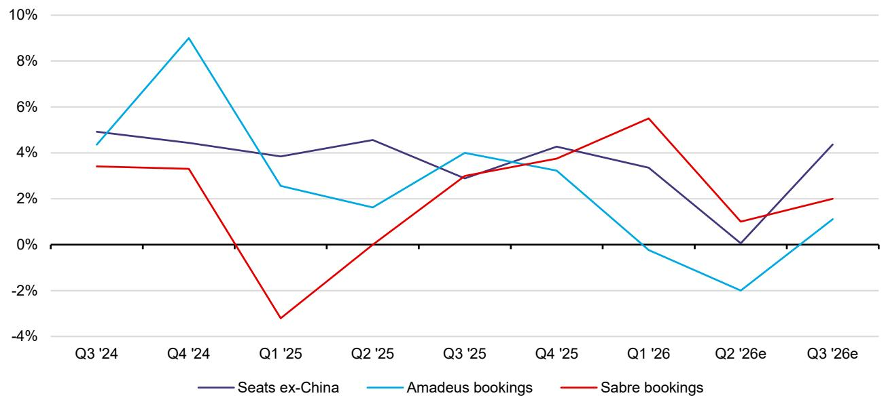

line

| Quarter | Seats ex-China | Amadeus bookings | Sabre bookings |
| ------- | -------------- | ---------------- | -------------- |
| Q3 '24  | 4.8%           | 4.3%             | 3.3%           |
| Q4 '24  | 4.5%           | 9.0%             | 3.2%           |
| Q1 '25  | 3.8%           | 2.5%             | -3.0%          |
| Q2 '25  | 4.5%           | 1.5%             | -1.0%          |
| Q3 '25  | 3.0%           | 4.0%             | 2.8%           |
| Q4 '25  | 4.2%           | 3.2%             | 3.5%           |
| Q1 '26  | 3.3%           | -0.5%            | 5.5%           |
| Q2 '26e | 0.0%           | -1.8%            | 1.0%           |
| Q3 '26e | 4.3%           | 1.0%             | 1.8%           |

Source: Company reports, SRS, Bernstein estimates and analysis

EXHIBIT 11: Revenue per booking trends across the two GDSs under coverage   
YoY change   
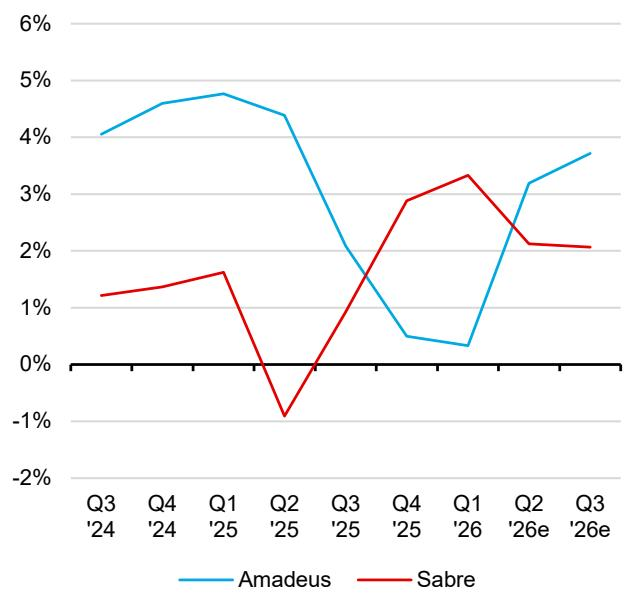

line

| Quarter | Amadeus | Sabre |
| ------- | ------- | ----- |
| Q3 '24  | 4.0%    | 1.2%  |
| Q4 '24  | 4.5%    | 1.4%  |
| Q1 '25  | 4.7%    | 1.6%  |
| Q2 '25  | 4.4%    | -1.0% |
| Q3 '25  | 2.0%    | 0.0%  |
| Q4 '25  | 0.5%    | 2.9%  |
| Q1 '26  | 0.3%    | 3.3%  |
| Q2 '26e | 3.2%    | 2.1%  |
| Q3 '26e | 3.7%    | 2.0%  |

Source: Company reports, Bernstein estimates and analysis

EXHIBIT 12: Revenue growth trends across the two GDSs under coverage   
YoY change   
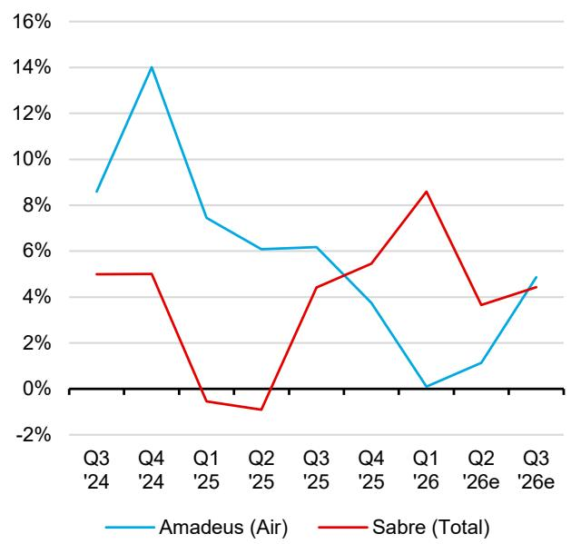

line

| Quarter | Amadeus (Air) | Sabre (Total) |
| ------- | ------------- | ------------- |
| Q3 '24  | 8.5%          | 5.0%          |
| Q4 '24  | 14.0%         | 5.0%          |
| Q1 '25  | 7.5%          | -1.0%         |
| Q2 '25  | 6.0%          | -1.5%         |
| Q3 '25  | 6.0%          | 4.5%          |
| Q4 '25  | 4.0%          | 5.5%          |
| Q1 '26  | 0.0%          | 8.5%          |
| Q2 '26e | 1.0%          | 3.5%          |
| Q3 '26e | 4.5%          | 4.5%          |

Source: Company reports, Bernstein estimates and analysis

# AMADEUS: EL CONQUISTADOR. OUTPERFORM, TP €75.00

Amadeus is the champion of Air Tech, with the #1 position in market share in both distribution and IT. It serves the largest share of indirect bookings in air distribution, with c. 50% of GDS bookings coming through its systems: more than either of its two global competitors Sabre or Travelport. It is even more dominant in Airline IT: more than 50% of airlines' passenger volumes ex-China are handled by one of its two passenger service systems: Altéa or Navitaire, which focus on full-service airlines and low-cost carriers respectively and occupy the #1 and #2 spots by passengers boarded, and the company allocates c. 20% of revenue to investment in R&D. The group is also growing in hospitality IT, bringing its technological expertise to bear for hotels and other travel businesses. While the best days of the GDS business are behind it, the group is reinvesting cash flows from this mature business into the growth areas of Airlines IT and Hospitality, both of which have structural growth and optionality with new customers.

- Using scale to build scale. As the largest incumbent in the sector, Amadeus generates the highest revenues and cash flows. It continues to invest heavily in R&D, with typically 20% of revenues reinvested into improving the product, and this is further augmented with acquisitions of high-quality businesses that are complementary to the portfolio. This shows no sign of slowing down, and constitutes a key competitive advantage for the company through lasting product differentiation.   
- 18% 2027-30 TSR at constant multiple... Amadeus offers an attractive return profile: a 18% constant multiple return, comprising 10% net income growth (boosted by IDEMIA acquisition), a 4% dividend and a 4% buyback (to keep leverage constant). The growth is all driven by the Air IT and HOS segments, while we see Air Distribution broadly ex-growth, and potentially entering decline in the medium to long term. It is possible that further M&A deals arrive over the years to come, and the company has executed smartly here in the past. If so, expect more net income growth and fewer buybacks. In the near-term, growth should be boosted by customer implementations (ANA, Marriott, Accor), accelerating volumes, revenues and earnings beyond the typical pace of expansion.   
- ...And a grab bag of call options. In addition to the base case returns here, our numbers for Amadeus could well be too low. We see the company as best conceived of as these base case returns, plus a grab bag of call options – it has the opportunity to sell its PSS to further airline customers. Four larger airlines (United, Delta, Emirates, Turkish) still run an in-house PSS, and have a decision to make: self-build modern infrastructure (expensive), stay in a legacy world of tickets, passenger name records, etc (and risk falling behind) or outsource (in our view the best option). Amadeus has significant success in competitive tenders, and we expect this to continue, paving the way for further, albeit lumpy, share gains to come.

Attractively valued for its earnings growth profile. Amadeus has been hit by fears over AI, along with other technology companies. We see these fears as unsupported by fundamentals: management would appear to agree, given medium-term guidance of a double-digit EPS CAGR. In 2027-30, we see a net income CAGR of 10%, EPS CAGR of 14% and a 4% average annual dividend. The business mix is also improving, shifting away from lower-growth Air Distribution and towards the higher-growth segments of Air IT and Hospitality. Our target price of €75.00 is set at 20.1x FY+1 P/E, lower than the median historic multiple following the broader technology sector de-rating in recent weeks. We remain convinced of the company's compounding potential, however disproving the bear case of eventual AI disruption could take a long time.

EXHIBIT 13: Amadeus EBITDA vs consensus   
€m   
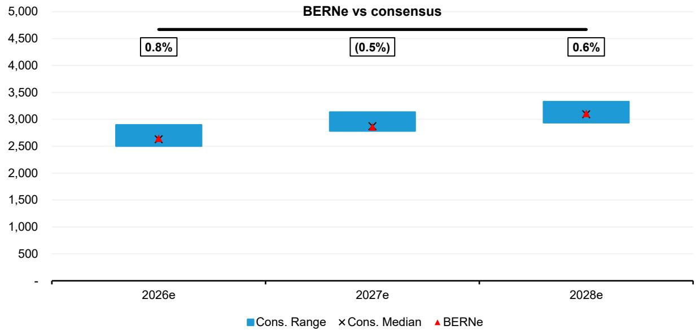

bar

| Year   | Cons. Range | Cons. Median | BERNe |
| ------ | ----------- | ------------ | ----- |
| 2026e  | 2900        | 2600         | -     |
| 2027e  | 3100        | 2850         | -     |
| 2028e  | 3300        | 3100         | -     |

Source: Bloomberg, Bernstein estimates and analysis

EXHIBIT 14: Air IT and Hospitality drive Amadeus EPS growth: we see a 13.6% EPS CAGR 2027-30, with an additional 3% dividend   
Contributors to Amadeus TSR   
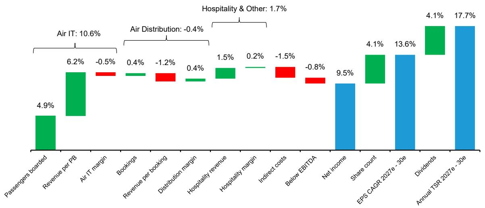

bar

| Category | Value (%) |
| :--- | :--- |
| Passengers boarded | 4.9 |
| Revenue per PB | 6.2 |
| Air IT margin | -0.5 |
| Bookings | 0.4 |
| Revenue per booking | -1.2 |
| Distribution margin | 0.4 |
| Hospitality revenue | 1.5 |
| Hospitality margin | 0.2 |
| Indirect costs | -1.5 |
| Below EBITDA | -0.8 |
| Net income | 9.5 |
| Share count | 4.1 |
| EPS CAGR 2027e - 30e | 13.6 |
| Dividends | 4.1 |
| Annual TSR 2027e - 30e | 17.7 |
Air IT: 10.6%; Air Distribution: -0.4%; Hospitality & Other: 1.7%

Source: Bernstein estimates and analysis

EXHIBIT 15: Changes to our Amadeus forecasts 

<table><tr><td>Income Statement (M EUR)</td><td></td><td>FY2025a</td><td>FY2026e</td><td>FY2027e</td><td>FY2028e</td><td>FY2029e</td><td>FY2030e</td></tr><tr><td rowspan="3">Revenue</td><td>new</td><td>6,517</td><td>6,880</td><td>7,649</td><td>8,427</td><td>8,818</td><td>9,192</td></tr><tr><td>previous</td><td></td><td>6,681</td><td>7,271</td><td>7,636</td><td>7,957</td><td>8,257</td></tr><tr><td>Δ</td><td></td><td>3.0%</td><td>5.2%</td><td>10.4%</td><td>10.8%</td><td>11.3%</td></tr><tr><td rowspan="3">Underlying EBITDA</td><td>new</td><td>2,480</td><td>2,651</td><td>2,860</td><td>3,113</td><td>3,355</td><td>3,579</td></tr><tr><td>previous</td><td></td><td>2,504</td><td>2,864</td><td>3,081</td><td>3,263</td><td>3,421</td></tr><tr><td>Δ</td><td></td><td>5.8%</td><td>-0.1%</td><td>1.0%</td><td>2.8%</td><td>4.6%</td></tr><tr><td rowspan="3">Underlying net income</td><td>new</td><td>1,300</td><td>1,432</td><td>1,580</td><td>1,752</td><td>1,923</td><td>2,080</td></tr><tr><td>previous</td><td></td><td>1,338</td><td>1,595</td><td>1,743</td><td>1,862</td><td>1,965</td></tr><tr><td>Δ</td><td></td><td>7.0%</td><td>-1.0%</td><td>0.5%</td><td>3.3%</td><td>5.9%</td></tr><tr><td rowspan="3">Underlying EPS (€)</td><td>new</td><td>2.92</td><td>3.35</td><td>3.72</td><td>4.27</td><td>4.86</td><td>5.46</td></tr><tr><td>previous</td><td></td><td>3.16</td><td>3.85</td><td>4.36</td><td>4.83</td><td>5.30</td></tr><tr><td>Δ</td><td></td><td>6.1%</td><td>-3.3%</td><td>-2.0%</td><td>0.6%</td><td>3.1%</td></tr></table>

Source: Company reports, Bernstein estimates and analysis

EXHIBIT 16: Changes to our Amadeus KPI forecasts 

<table><tr><td>KPIs</td><td></td><td>FY2025a</td><td>FY2026e</td><td>FY2027e</td><td>FY2028e</td><td>FY2029e</td><td>FY2030e</td></tr><tr><td rowspan="3">Passengers Boarded (m)</td><td>new</td><td>2,249</td><td>2,284</td><td>2,376</td><td>2,537</td><td>2,648</td><td>2,754</td></tr><tr><td>previous</td><td></td><td>2,297</td><td>2,436</td><td>2,564</td><td>2,675</td><td>2,782</td></tr><tr><td>Δ</td><td></td><td>-0.6%</td><td>-2.5%</td><td>-1.0%</td><td>-1.0%</td><td>-1.0%</td></tr><tr><td rowspan="3">Air IT revenue per PB (€)</td><td>new</td><td>1.04</td><td>1.10</td><td>1.30</td><td>1.49</td><td>1.55</td><td>1.60</td></tr><tr><td>previous</td><td></td><td>1.07</td><td>1.11</td><td>1.15</td><td>1.20</td><td>1.24</td></tr><tr><td>Δ</td><td></td><td>2.9%</td><td>16.7%</td><td>28.9%</td><td>29.0%</td><td>29.0%</td></tr><tr><td rowspan="3">Air IT contribution (€m)</td><td>new</td><td>1,664</td><td>1,775</td><td>1,982</td><td>2,267</td><td>2,502</td><td>2,724</td></tr><tr><td>previous</td><td></td><td>1,725</td><td>1,917</td><td>2,122</td><td>2,321</td><td>2,513</td></tr><tr><td>Δ</td><td></td><td>2.9%</td><td>3.4%</td><td>6.9%</td><td>7.8%</td><td>8.4%</td></tr><tr><td rowspan="3">Bookings (m)</td><td>new</td><td>485</td><td>484</td><td>497</td><td>502</td><td>506</td><td>506</td></tr><tr><td>previous</td><td></td><td>470</td><td>505</td><td>510</td><td>512</td><td>512</td></tr><tr><td>Δ</td><td></td><td>3.0%</td><td>-1.7%</td><td>-1.5%</td><td>-1.3%</td><td>-1.1%</td></tr><tr><td rowspan="3">Distribution revenue per booking (€)</td><td>new</td><td>6.4</td><td>6.6</td><td>6.6</td><td>6.5</td><td>6.4</td><td>6.2</td></tr><tr><td>previous</td><td></td><td>6.5</td><td>6.5</td><td>6.4</td><td>6.3</td><td>6.2</td></tr><tr><td>Δ</td><td></td><td>1.5%</td><td>1.7%</td><td>0.8%</td><td>0.8%</td><td>0.8%</td></tr><tr><td rowspan="3">Air distribution contribution (€m)</td><td>new</td><td>1,563</td><td>1,634</td><td>1,705</td><td>1,706</td><td>1,695</td><td>1,673</td></tr><tr><td>previous</td><td></td><td>1,546</td><td>1,706</td><td>1,720</td><td>1,706</td><td>1,679</td></tr><tr><td>Δ</td><td></td><td>5.7%</td><td>-0.1%</td><td>-0.9%</td><td>-0.6%</td><td>-0.4%</td></tr><tr><td rowspan="3">Hospitality revenue (€m)</td><td>new</td><td>1,052</td><td>1,163</td><td>1,285</td><td>1,389</td><td>1,500</td><td>1,620</td></tr><tr><td>previous</td><td></td><td>1,160</td><td>1,278</td><td>1,393</td><td>1,512</td><td>1,633</td></tr><tr><td>Δ</td><td></td><td>0.3%</td><td>0.5%</td><td>-0.3%</td><td>-0.8%</td><td>-0.8%</td></tr><tr><td rowspan="3">Hospitality contribution (€m)</td><td>new</td><td>379</td><td>429</td><td>489</td><td>529</td><td>577</td><td>629</td></tr><tr><td>previous</td><td></td><td>434</td><td>494</td><td>549</td><td>606</td><td>660</td></tr><tr><td>Δ</td><td></td><td>-1.1%</td><td>-1.1%</td><td>-3.7%</td><td>-4.7%</td><td>-4.7%</td></tr><tr><td rowspan="3">Indirect costs (€m)</td><td>new</td><td>(1,099)</td><td>(1,179)</td><td>(1,315)</td><td>(1,389)</td><td>(1,419)</td><td>(1,448)</td></tr><tr><td>previous</td><td></td><td>(1,200)</td><td>(1,252)</td><td>(1,310)</td><td>(1,369)</td><td>(1,431)</td></tr><tr><td>Δ</td><td></td><td>-1.8%</td><td>5.0%</td><td>6.0%</td><td>3.6%</td><td>1.2%</td></tr></table>

Source: Company reports, Bernstein estimates and analysis

EXHIBIT 17: Amadeus valuation framework 

<table><tr><td rowspan="3" colspan="2">DCF VALUATION</td><td colspan="4">MULTIPLES VALUATION</td><td rowspan="3">PRICE TARGET(Range is 1st-3rd quartile)</td></tr><tr><td rowspan="2">KPI Progression</td><td colspan="3">All estimates Bernstein</td></tr><tr><td>Sales</td><td>EBITDA</td><td>EPS (€)</td></tr><tr><td colspan="2">WACC</td><td>2025</td><td>6,517</td><td>2,494</td><td>2.9</td><td>DCF</td></tr><tr><td>Risk Free Rate</td><td>3.0%</td><td>2026e</td><td>6,880</td><td>2,660</td><td>3.3</td><td>P/E (FY+2)</td></tr><tr><td>Equity Risk Premium</td><td>6.0%</td><td>2027e</td><td>7,649</td><td>2,860</td><td>3.7</td><td>EV/EBITDA (FY+2)</td></tr><tr><td>Beta (unlevered)</td><td>1.10</td><td>2028e</td><td>8,427</td><td>3,113</td><td>4.3</td><td>EV/Sales (FY+2)</td></tr><tr><td>Beta (levered)</td><td>1.56</td><td>2029e</td><td>8,818</td><td>3,355</td><td>4.9</td><td>P/E (FY+1)</td></tr><tr><td>Cost of Equity</td><td>12.4%</td><td>2030e</td><td>9,192</td><td>3,579</td><td>5.5</td><td>EV/EBITDA (FY+1)</td></tr><tr><td>Cost of Debt</td><td>3.0%</td><td>2030e vs. 2025</td><td>41.0%</td><td>43.5%</td><td>86.9%</td><td>EV/Sales (FY+1)</td></tr><tr><td>Tax Rate</td><td>22.3%</td><td>CAGR 2025-30e</td><td>5.9%</td><td>6.2%</td><td>11.0%</td><td>Current price: BERN TP</td></tr><tr><td>WACC</td><td>9.4%</td><td></td><td></td><td></td><td></td><td>Potential Upside / (Downside) 45%</td></tr><tr><td>DCF</td><td>FY&#x27;30e</td><td>Multiples</td><td>2027e</td><td>2027e</td><td>2027e</td><td rowspan="14">Target Price €75.00</td></tr><tr><td>Terminal growth rate</td><td>5.0%</td><td>Metric</td><td>EV/Sales (FY1)</td><td>EV/EBITDA (FY1)</td><td>P/E (FY1)</td></tr><tr><td>WACC</td><td>9.4%</td><td>Datapoint</td><td>7,649</td><td>2,860</td><td>3.7</td></tr><tr><td>Terminal EBITDA margin</td><td>42.5%</td><td></td><td></td><td></td><td></td></tr><tr><td>Terminal capex / sales</td><td>10%</td><td></td><td></td><td></td><td></td></tr><tr><td>PV</td><td>41,540</td><td>10y multiple</td><td>4.8x</td><td>12.2x</td><td>20.7x</td></tr><tr><td>Net debt (€m)</td><td>2,253</td><td>Third quartile</td><td>5.4x</td><td>13.3x</td><td>23.1x</td></tr><tr><td>Pension (€m)</td><td>-</td><td>First quartile</td><td>4.4x</td><td>11.2x</td><td>18.7x</td></tr><tr><td>Minority interest (€m)</td><td>(1)</td><td></td><td></td><td></td><td></td></tr><tr><td>Net DTAs (€m)</td><td>6</td><td>Implied multiple (BERN TP)</td><td>4.4x</td><td>11.9x</td><td>20.1x</td></tr><tr><td>Investments in assoc. &amp; JVs (€m)</td><td>51</td><td>BERN premium vs LT median</td><td>(7%)</td><td>(2%)</td><td>(2%)</td></tr><tr><td>Equity value</td><td>39,345</td><td></td><td></td><td></td><td></td></tr><tr><td>Implied price from DCF</td><td>€88.5</td><td>Implied price from LT median</td><td>€78.9</td><td>€76.8</td><td>€76.9</td></tr><tr><td>Premium vs. Bernstein TP</td><td>18%</td><td>BERN TP premium vs LT median</td><td>(5%)</td><td>(2%)</td><td>(2%)</td></tr></table>

Source: Company reports, Bernstein estimates and analysis

# SABRE: COMPETITIVELY CHALLENGED, BUT RELATIVELY DE-RISKED NEAR-TERM. MARKET-PERFORM, TP \$ 1.75

Sabre looks trapped. The business is overweight the deteriorating GDS market, threatened by technological change, and with a larger competitor in IT Solutions with a superior product. Meanwhile, a stretched balance sheet leaves it unable to invest at the same level as its larger peer, as deleveraging must be the priority call on cash - and this sees Amadeus continuing to widen the product gap. Since 2023, Amadeus has taken Etihad, ITA and Vietnam Airlines from Sabre on the core PSS. However, near-term, most major customers have renewed, providing protection against further losses. Notably, its two largest customers (American and LATAM) are contracted until the mid-2030s. The sale of Hospitality went some way to repairing the balance sheet, and beyond that maturities are pushed out, with the main maturities in 2029.

- When you open a door to a competitor, don't be surprised if they walk through it. Amadeus already invests an amount greater than Sabre's entire market cap into research and development every year. It has long led the field on NDC and its two Passenger Service Systems (PSSs) are the world's largest. More recently, it has been attacking Sabre's heartland of North America - once a market where Sabre's volumes far exceeded everyone else's, now a two-horse race. The IT businesses count one US giant each, with some smaller airlines (American / Alaska / JetBlue at Sabre; Southwest / Frontier / Allegiant at Amadeus), and north of the border, Air Canada is with Amadeus and WestJet with Sabre. With Sabre management forced to spend in a restrained way given the indebted balance sheet, now is the opportune moment for Amadeus throw sales and marketing muscle behind its IT and GDS products, further expanding its market share.   
- Deleveraging is the #1 priority, but this is likely to be slow. Yet we do not see management as making the wrong choice here. Deleveraging the balance sheet must be the priority, given the highly-indebted position of the group, with leverage still in the mid-single digits for years to come. However, near-term refinancing risk has been dealt with: the meaningful maturities are not until 2029. Until then, Sabre will chip away at its debt pile, however we still see leverage remaining above 5x until the end of the decade. That may create an eventual issue for a company exposed to the airline industry, which has typically gone through a downturn about once a decade.   
- AI risk to GDSs further out than feared. Sabre is largely a GDS, having sold its Hospitality IT business. We see an eventual risk in this business from a diminution in the role of travel agents in air booking: first leisure, and eventually corporate. Sabre's bookings are around 50% corporate, and in our view that affords it medium-term protection and should see volumes continue to grow. However, over the longer term, there is in our view an eventual risk to the existence of legacy pipes, which were built to solve yesterday's problems of fragmentation and a lack of technological expertise at travel agents.

EXHIBIT 18: Sabre EBITDA vs cons   
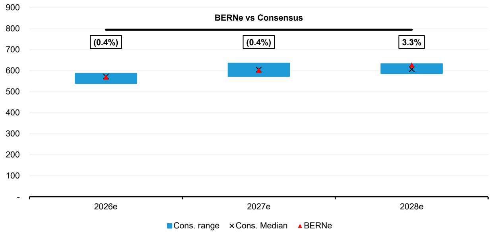

bar

| Year   | Cons. range | Cons. Median | BERNe |
| ------ | ----------- | ------------ | ----- |
| 2026e  | 580         | 570          | -     |
| 2027e  | 630         | 610          | -     |
| 2028e  | 630         | 610          | 3.3%  |

Source: Bloomberg, Bernstein estimates and analysis

EXHIBIT 19: Changes to our Sabre forecasts 

<table><tr><td>Income Statement (M USD)</td><td></td><td>FY2025a</td><td>FY2026e</td><td>FY2027e</td><td>FY2028e</td><td>FY2029e</td><td>FY2030e</td></tr><tr><td rowspan="3">Revenue</td><td>new</td><td>2,846</td><td>2,907</td><td>2,968</td><td>3,006</td><td>3,008</td><td>2,990</td></tr><tr><td>previous</td><td></td><td>2,862</td><td>2,925</td><td>2,960</td><td>2,962</td><td>2,945</td></tr><tr><td>Δ</td><td></td><td>1.6%</td><td>1.5%</td><td>1.6%</td><td>1.5%</td><td>1.5%</td></tr><tr><td rowspan="3">Adj. EBITDA</td><td>new</td><td>500</td><td>570</td><td>603</td><td>627</td><td>633</td><td>630</td></tr><tr><td>previous</td><td></td><td>540</td><td>573</td><td>595</td><td>601</td><td>598</td></tr><tr><td>Δ</td><td></td><td>5.7%</td><td>5.1%</td><td>5.4%</td><td>5.3%</td><td>5.3%</td></tr><tr><td rowspan="3">Underlying net income</td><td>new</td><td>(15)</td><td>(9)</td><td>37</td><td>54</td><td>72</td><td>116</td></tr><tr><td>previous</td><td></td><td>(11)</td><td>21</td><td>38</td><td>54</td><td>97</td></tr><tr><td>Δ</td><td></td><td>19.2%</td><td>79.2%</td><td>43.4%</td><td>32.9%</td><td>19.8%</td></tr><tr><td rowspan="3">EPS ($)</td><td>new</td><td>(0.04)</td><td>(0.02)</td><td>0.08</td><td>0.11</td><td>0.13</td><td>0.20</td></tr><tr><td>previous</td><td></td><td>(0.03)</td><td>0.04</td><td>0.07</td><td>0.09</td><td>0.16</td></tr><tr><td>Δ</td><td></td><td>27.9%</td><td>90.2%</td><td>52.0%</td><td>41.9%</td><td>28.0%</td></tr></table>

Source: Company reports, Bernstein estimates and analysis

EXHIBIT 20: Changes to our Sabre KPI forecasts 

<table><tr><td>KPIs</td><td></td><td>FY2025a</td><td>FY2026e</td><td>FY2027e</td><td>FY2028e</td><td>FY2029e</td><td>FY2030e</td></tr><tr><td rowspan="3">Air bookings (m)</td><td>new</td><td>309</td><td>318</td><td>327</td><td>332</td><td>332</td><td>329</td></tr><tr><td>previous</td><td></td><td>313</td><td>323</td><td>327</td><td>327</td><td>324</td></tr><tr><td>Δ</td><td></td><td>1.4%</td><td>1.4%</td><td>1.5%</td><td>1.5%</td><td>1.5%</td></tr><tr><td rowspan="3">Revenue per booking ($)</td><td>new</td><td>6.1</td><td>6.2</td><td>6.1</td><td>6.0</td><td>5.9</td><td>5.8</td></tr><tr><td>previous</td><td></td><td>6.1</td><td>6.1</td><td>6.0</td><td>5.9</td><td>5.8</td></tr><tr><td>Δ</td><td></td><td>0.6%</td><td>0.6%</td><td>0.6%</td><td>0.6%</td><td>0.6%</td></tr><tr><td rowspan="3">Passengers Boarded (m)</td><td>new</td><td>695</td><td>712</td><td>734</td><td>763</td><td>787</td><td>812</td></tr><tr><td>previous</td><td></td><td>711</td><td>736</td><td>763</td><td>787</td><td>811</td></tr><tr><td>Δ</td><td></td><td>0.0%</td><td>-0.3%</td><td>0.1%</td><td>0.1%</td><td>0.1%</td></tr><tr><td rowspan="3">Revenue per PB ($)</td><td>new</td><td>0.80</td><td>0.81</td><td>0.82</td><td>0.83</td><td>0.84</td><td>0.84</td></tr><tr><td>previous</td><td></td><td>0.81</td><td>0.81</td><td>0.82</td><td>0.83</td><td>0.84</td></tr><tr><td>Δ</td><td></td><td>0.8%</td><td>0.8%</td><td>0.8%</td><td>0.8%</td><td>0.8%</td></tr><tr><td rowspan="3">Net debt ($m)</td><td>new</td><td>3,439</td><td>3,505</td><td>3,465</td><td>3,401</td><td>3,313</td><td>3,167</td></tr><tr><td>previous</td><td></td><td>3,536</td><td>3,515</td><td>3,471</td><td>3,404</td><td>3,282</td></tr><tr><td>Δ</td><td></td><td>-0.9%</td><td>-1.4%</td><td>-2.0%</td><td>-2.7%</td><td>-3.5%</td></tr><tr><td rowspan="3">Net debt / EBITDA</td><td>new</td><td>6.9</td><td>6.1</td><td>5.7</td><td>5.4</td><td>5.2</td><td>5.0</td></tr><tr><td>previous</td><td></td><td>6.6</td><td>6.1</td><td>5.8</td><td>5.7</td><td>5.5</td></tr><tr><td>Δ</td><td></td><td>-6.2%</td><td>-6.3%</td><td>-7.0%</td><td>-7.6%</td><td>-8.4%</td></tr></table>

Source: Company reports, Bernstein estimates and analysis

EXHIBIT 21: Sabre valuation framework 

<table><tr><td colspan="2">DCF VALUATION</td><td colspan="4">MULTIPLES VALUATION</td><td>PRICE TARGET</td></tr><tr><td colspan="2"></td><td colspan="4">All estimates Bernstein</td><td rowspan="2">(Range is 1st-3rd quartile)</td></tr><tr><td colspan="2">WACC</td><td>KPI Progression</td><td>Sales</td><td>EBITDA</td><td>EPS ($)</td></tr><tr><td>Risk Free Rate</td><td>4.4%</td><td>2025</td><td>2,846</td><td>500</td><td>(0.04)</td><td>$1.75</td></tr><tr><td>Equity Risk Premium</td><td>6.0%</td><td>2026e</td><td>2,907</td><td>570</td><td>(0.02)</td><td>+</td></tr><tr><td>Beta (unlevered)</td><td>0.69</td><td>2027e</td><td>2,968</td><td>603</td><td>0.08</td><td>+</td></tr><tr><td>Beta (levered)</td><td>2.22</td><td>2028e</td><td>3,006</td><td>627</td><td>0.11</td><td>+</td></tr><tr><td>Cost of Equity</td><td>17.7%</td><td>2029e</td><td>3,008</td><td>633</td><td>0.13</td><td>+</td></tr><tr><td>Cost of Debt</td><td>10.0%</td><td>2030e</td><td>2,990</td><td>630</td><td>0.20</td><td>+</td></tr><tr><td>Tax Rate</td><td>22.0%</td><td>2030e vs. 2025</td><td>5.1%</td><td>25.9%</td><td>(637.5%)</td><td>+</td></tr><tr><td>WACC assumption</td><td>10.4%</td><td>CAGR 2025-30e</td><td>1.0%</td><td>4.7%</td><td>(240.0%)</td><td>+</td></tr><tr><td>DCF</td><td>FY&#x27;30e</td><td>Multiples</td><td>2027e</td><td>2027e</td><td>2027e</td><td>-</td></tr><tr><td>Sales / IC</td><td>88.8%</td><td>Metric</td><td>EV/Sales</td><td>EV/EBITDA</td><td>P/E</td><td>-</td></tr><tr><td>Marginal ROIC</td><td>15.4%</td><td>Datapoint</td><td>(FY1)</td><td>(FY1)</td><td>(FY1)</td><td>-</td></tr><tr><td>WACC assumption</td><td>10.4%</td><td></td><td></td><td></td><td></td><td></td></tr><tr><td>Sales / IC</td><td>0.9x</td><td></td><td></td><td></td><td></td><td></td></tr><tr><td>PV</td><td>4,563</td><td>10Y median multiple</td><td>2.0x</td><td>8.2x</td><td>13.1x</td><td>-</td></tr><tr><td>Net debt ($m)</td><td>3,439</td><td>Third quartile</td><td>2.3x</td><td>9.6x</td><td>15.3x</td><td>-</td></tr><tr><td>Pension ($m)</td><td>(58)</td><td>First quartile</td><td>1.7x</td><td>7.6x</td><td>8.2x</td><td>-</td></tr><tr><td>Minority interest ($m)</td><td>14</td><td></td><td></td><td></td><td></td><td></td></tr><tr><td>Net DTAs ($m)</td><td>-</td><td>Implied multiple (BERN TP)</td><td>1.4x</td><td>7.0x</td><td>20.9x</td><td>-</td></tr><tr><td>Investments in assoc. &amp; JVs ($m)</td><td>23</td><td>BERN premium vs LT median</td><td>(30%)</td><td>(15%)</td><td>59%</td><td>-</td></tr><tr><td>Equity value</td><td>1,190</td><td></td><td></td><td></td><td></td><td></td></tr><tr><td>Implied price from DCF</td><td>$2.1</td><td>Implied price from LT median</td><td>$5.7</td><td>$3.2</td><td>$1.1</td><td>Potential Upside / (Downside) -15%</td></tr><tr><td>Premium vs. Bernstein TP</td><td>18%</td><td>BERN TP premium vs LT median</td><td>(69%)</td><td>(46%)</td><td>59%</td><td>Target Price $1.75</td></tr></table>

Source: Company reports, Bernstein estimates and analysis

# APPENDIX: AMADEUS CHART BANK

EXHIBIT 22: TTM Air IT passengers boarded   
bn   
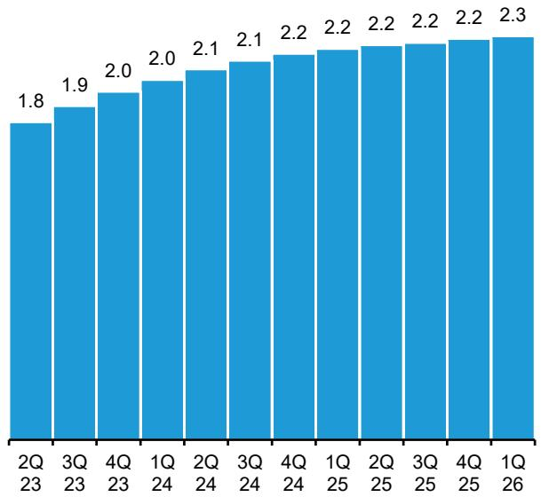

bar

| Quarter | Value |
|---|---|
| 2Q 23 | 1.8 |
| 3Q 23 | 1.9 |
| 4Q 23 | 2.0 |
| 1Q 24 | 2.0 |
| 2Q 24 | 2.1 |
| 3Q 24 | 2.1 |
| 4Q 24 | 2.2 |
| 1Q 25 | 2.2 |
| 2Q 25 | 2.2 |
| 3Q 25 | 2.2 |
| 4Q 25 | 2.2 |
| 1Q 26 | 2.3 |

Source: Company reports, Bernstein analysis

EXHIBIT 24: TTM Air Distribution bookings   
millions   
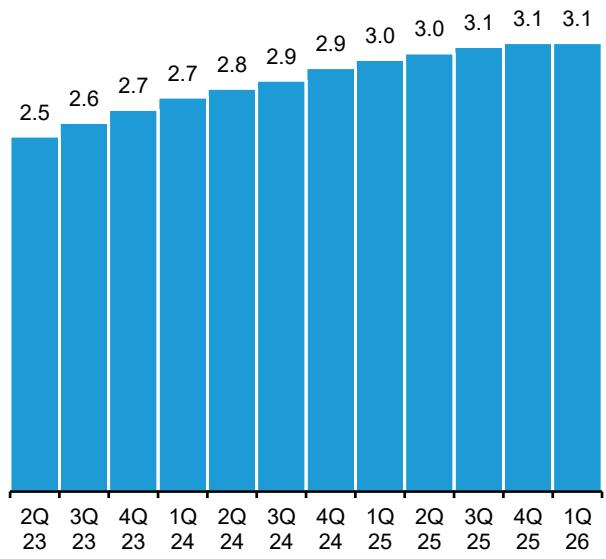

bar

| Quarter | Value |
|---|---|
| 2Q 23 | 2.5 |
| 3Q 23 | 2.6 |
| 4Q 23 | 2.7 |
| 1Q 24 | 2.7 |
| 2Q 24 | 2.8 |
| 3Q 24 | 2.9 |
| 4Q 24 | 2.9 |
| 1Q 25 | 3.0 |
| 2Q 25 | 3.0 |
| 3Q 25 | 3.1 |
| 4Q 25 | 3.1 |
| 1Q 26 | 3.1 |

Source: Company reports, Bernstein analysis

EXHIBIT 23: TTM Air IT revenue per passenger boarded €   
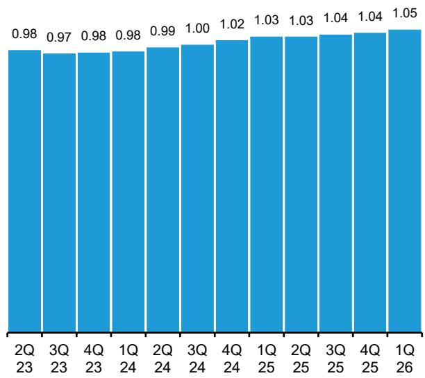

bar

| Quarter | Value |
| :--- | :--- |
| 2Q 23 | 0.98 |
| 3Q 23 | 0.97 |
| 4Q 23 | 0.98 |
| 1Q 24 | 0.98 |
| 2Q 24 | 0.99 |
| 3Q 24 | 1.00 |
| 4Q 24 | 1.02 |
| 1Q 25 | 1.03 |
| 2Q 25 | 1.03 |
| 3Q 25 | 1.04 |
| 4Q 25 | 1.04 |
| 1Q 26 | 1.05 |

Source: Company reports, Bernstein analysis

EXHIBIT 25: TTM Air Distribution revenue per booking €   
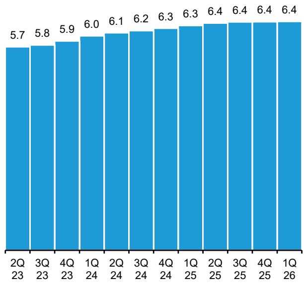

bar

| Quarter | Value |
|---|---|
| 2Q 23 | 5.7 |
| 3Q 23 | 5.8 |
| 4Q 23 | 5.9 |
| 1Q 24 | 6.0 |
| 2Q 24 | 6.1 |
| 3Q 24 | 6.2 |
| 4Q 24 | 6.3 |
| 1Q 25 | 6.3 |
| 2Q 25 | 6.4 |
| 3Q 25 | 6.4 |
| 4Q 25 | 6.4 |
| 1Q 26 | 6.4 |

Source: Company reports, Bernstein analysis

EXHIBIT 26: TTM Air IT contribution   
€ bn   
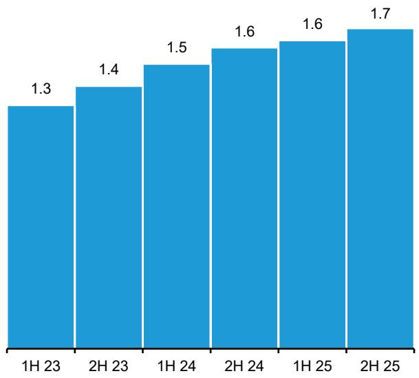

bar

| Period | Value |
|---|---|
| 1H 23 | 1.3 |
| 2H 23 | 1.4 |
| 1H 24 | 1.5 |
| 2H 24 | 1.6 |
| 1H 25 | 1.6 |
| 2H 25 | 1.7 |

Source: Company reports, Bernstein analysis

EXHIBIT 28: TTM Hospitality revenue   
€ bn   
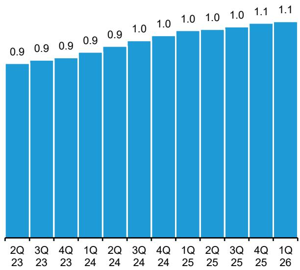

bar

| Quarter | Value |
|---|---|
| 2Q 23 | 0.9 |
| 3Q 23 | 0.9 |
| 4Q 23 | 0.9 |
| 1Q 24 | 0.9 |
| 2Q 24 | 0.9 |
| 3Q 24 | 1.0 |
| 4Q 24 | 1.0 |
| 1Q 25 | 1.0 |
| 2Q 25 | 1.0 |
| 3Q 25 | 1.0 |
| 4Q 25 | 1.1 |
| 1Q 26 | 1.1 |

Source: Company reports, Bernstein analysis

EXHIBIT 27: TTM Air distribution contribution   
€ bn   
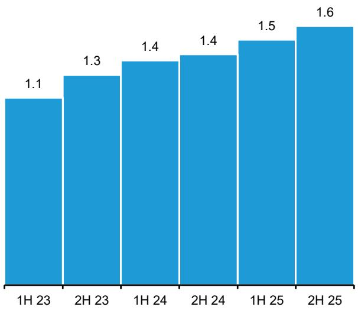

bar

| Period | Value |
|---|---|
| 1H 23 | 1.1 |
| 2H 23 | 1.3 |
| 1H 24 | 1.4 |
| 2H 24 | 1.4 |
| 1H 25 | 1.5 |
| 2H 25 | 1.6 |

Source: Company reports, Bernstein analysis

EXHIBIT 29: TTM Hospitality contribution   
€ bn   
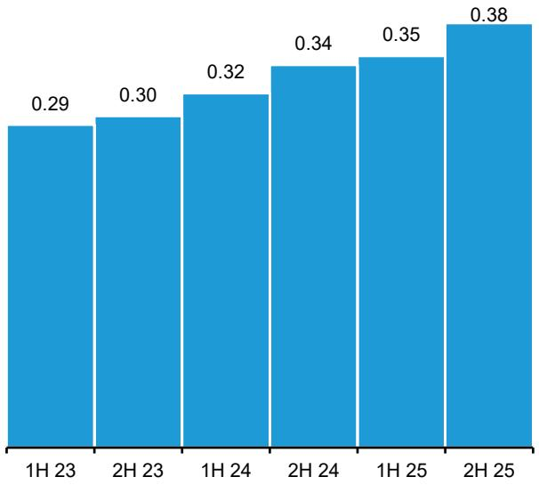

bar

| Period | Value |
|---|---|
| 1H 23 | 0.29 |
| 2H 23 | 0.30 |
| 1H 24 | 0.32 |
| 2H 24 | 0.34 |
| 1H 25 | 0.35 |
| 2H 25 | 0.38 |

Source: Company reports, Bernstein analysis

EXHIBIT 30: TTM Fixed cash cost

€ bn

■ Staff and other cost ■ Capex

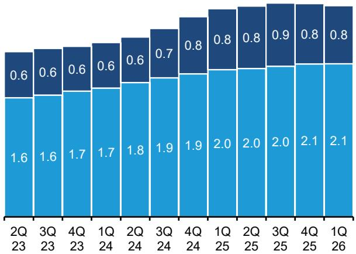

bar_stacked

| Quarter | Bottom Segment | Top Segment |
|---|---|---|
| 2Q 23 | 0.6 | 1.6 |
| 3Q 23 | 0.6 | 1.6 |
| 4Q 23 | 0.6 | 1.7 |
| 1Q 24 | 0.6 | 1.7 |
| 2Q 24 | 0.6 | 1.8 |
| 3Q 24 | 0.7 | 1.9 |
| 4Q 24 | 0.8 | 1.9 |
| 1Q 25 | 0.8 | 2.0 |
| 2Q 25 | 0.8 | 2.0 |
| 3Q 25 | 0.9 | 2.0 |
| 4Q 25 | 0.8 | 2.1 |
| 1Q 26 | 0.8 | 2.1 |

Source: Company reports, Bernstein analysis

EXHIBIT 31: TTM EBITDA   
€ bn   
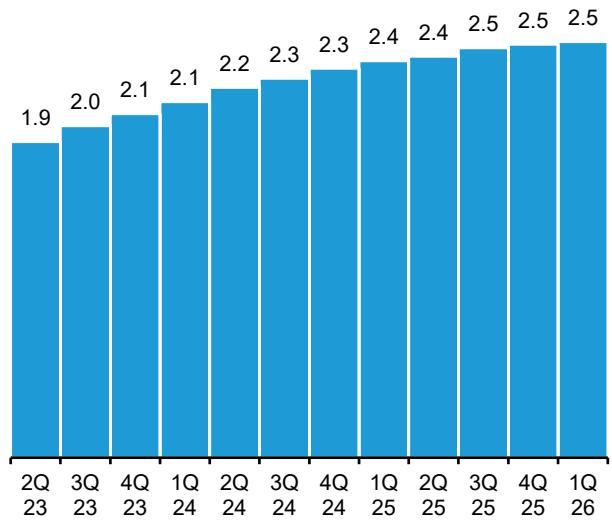

bar

| Quarter | Value |
|---|---|
| 2Q 23 | 1.9 |
| 3Q 23 | 2.0 |
| 4Q 23 | 2.1 |
| 1Q 24 | 2.1 |
| 2Q 24 | 2.2 |
| 3Q 24 | 2.3 |
| 4Q 24 | 2.3 |
| 1Q 25 | 2.4 |
| 2Q 25 | 2.4 |
| 3Q 25 | 2.5 |
| 4Q 25 | 2.5 |
| 1Q 26 | 2.5 |

Source: Company reports, Bernstein analysis

EXHIBIT 32: TTM R&D Investment   
€ bn   
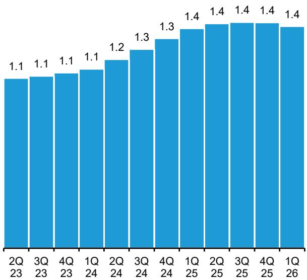

bar

| Quarter | Value |
|---|---|
| 2Q 23 | 1.1 |
| 3Q 23 | 1.1 |
| 4Q 23 | 1.1 |
| 1Q 24 | 1.1 |
| 2Q 24 | 1.2 |
| 3Q 24 | 1.3 |
| 4Q 24 | 1.3 |
| 1Q 25 | 1.4 |
| 2Q 25 | 1.4 |
| 3Q 25 | 1.4 |
| 4Q 25 | 1.4 |
| 1Q 26 | 1.4 |

Source: Company reports, Bernstein analysis

EXHIBIT 33: TTM Revenue per employee   
€ k   
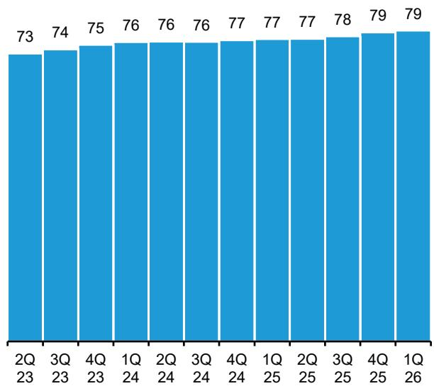

bar

| Quarter | Value |
|---|---|
| 2Q 23 | 73 |
| 3Q 23 | 74 |
| 4Q 23 | 75 |
| 1Q 24 | 76 |
| 2Q 24 | 76 |
| 3Q 24 | 76 |
| 4Q 24 | 77 |
| 1Q 25 | 77 |
| 2Q 25 | 77 |
| 3Q 25 | 78 |
| 4Q 25 | 79 |
| 1Q 26 | 79 |

Source: Company reports, Bernstein analysis

Revenue per segment (€bn)   
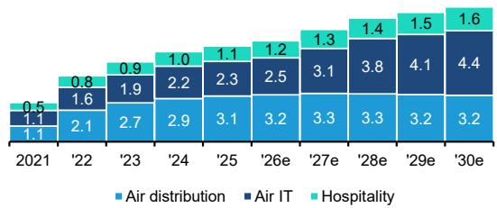

bar_stacked

| Year | Air distribution | Air IT | Hospitality |
|---|---|---|---|
| 2021 | 1.1 | 1.1 | 0.5 |
| '22 | 2.1 | 1.6 | 0.8 |
| '23 | 2.7 | 1.9 | 0.9 |
| '24 | 2.9 | 2.2 | 1.0 |
| '25 | 3.1 | 2.3 | 1.1 |
| '26e | 3.2 | 2.5 | 1.2 |
| '27e | 3.3 | 3.1 | 1.3 |
| '28e | 3.3 | 3.8 | 1.4 |
| '29e | 3.2 | 4.1 | 1.5 |
| '30e | 3.2 | 4.4 | 1.6 |

Air bookings and contribution /booking (€)   
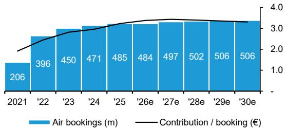

bar_line

| Year | Air bookings (m) | Contribution / booking (€) |
| :--- | :--- | :--- |
| 2021 | 206 | 2.0 |
| '22 | 396 | 2.5 |
| '23 | 450 | 2.8 |
| '24 | 471 | 2.9 |
| '25 | 485 | 3.0 |
| '26e | 484 | 3.1 |
| '27e | 497 | 3.2 |
| '28e | 502 | 3.1 |
| '29e | 506 | 3.0 |
| '30e | 506 | 2.9 |

Passengers boarded and IT revenue / PB(€)   
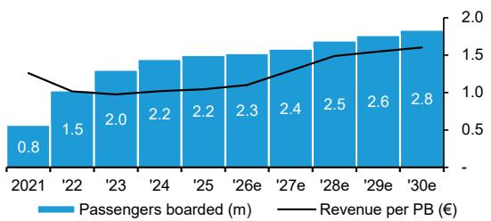

bar_line

| Year | Passengers boarded (m) | Revenue per PB (€) |
| :--- | :--- | :--- |
| 2021 | 0.8 | 1.3 |
| '22 | 1.5 | 1.0 |
| '23 | 2.0 | 0.95 |
| '24 | 2.2 | 0.98 |
| '25 | 2.2 | 1.0 |
| '26e | 2.3 | 1.05 |
| '27e | 2.4 | 1.15 |
| '28e | 2.5 | 1.45 |
| '29e | 2.6 | 1.55 |
| '30e | 2.8 | 1.65 |

Contribution per segment (€bn)   
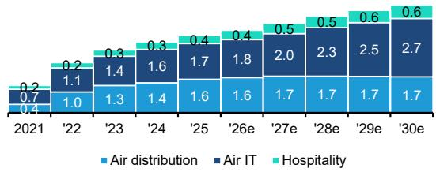

bar_stacked

| Year | Air distribution | Air IT | Hospitality |
|---|---|---|---|
| 2021 | 0.4 | 0.7 | 0.2 |
| '22 | 1.0 | 1.1 | 0.2 |
| '23 | 1.3 | 1.4 | 0.3 |
| '24 | 1.4 | 1.6 | 0.3 |
| '25 | 1.6 | 1.7 | 0.4 |
| '26e | 1.6 | 1.8 | 0.4 |
| '27e | 1.7 | 2.0 | 0.5 |
| '28e | 1.7 | 2.3 | 0.5 |
| '29e | 1.7 | 2.5 | 0.6 |
| '30e | 1.7 | 2.7 | 0.6 |

EBITDA(€bn) and EBITDA margin   
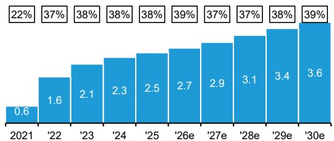

bar

| Year | Value | Percentage (%) |
| :--- | :--- | :--- |
| 2021 | 0.6 | 22 |
| '22 | 1.6 | 37 |
| '23 | 2.1 | 38 |
| '24 | 2.3 | 38 |
| '25 | 2.5 | 38 |
| '26e | 2.7 | 39 |
| '27e | 2.9 | 37 |
| '28e | 3.1 | 37 |
| '29e | 3.4 | 38 |
| '30e | 3.6 | 39 |

Net debt(€bn) and leverage   
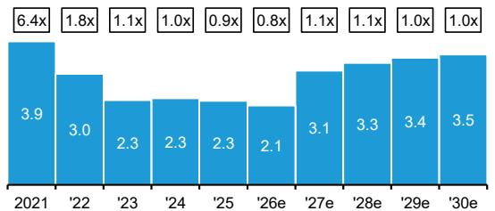

bar

| Year | Value | Multiple |
| :--- | :--- | :--- |
| 2021 | 3.9 | 6.4x |
| '22 | 3.0 | 1.8x |
| '23 | 2.3 | 1.1x |
| '24 | 2.3 | 1.0x |
| '25 | 2.3 | 0.9x |
| '26e | 2.1 | 0.8x |
| '27e | 3.1 | 1.1x |
| '28e | 3.3 | 1.1x |
| '29e | 3.4 | 1.0x |
| '30e | 3.5 | 1.0x |

ROIC   
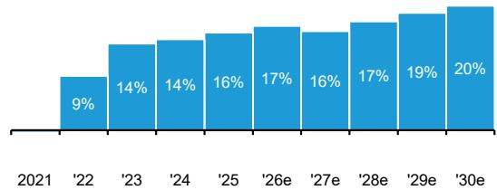

bar

| Year | Value (%) |
|---|---|
| '22 | 9 |
| '23 | 14 |
| '24 | 14 |
| '25 | 16 |
| '26e | 17 |
| '27e | 16 |
| '28e | 17 |
| '29e | 19 |
| '30e | 20 |

FCFE (€bn) and FCFE/Net Income   
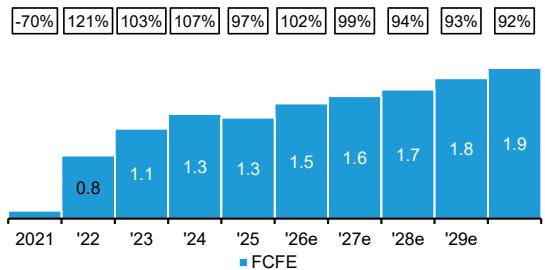

bar

| Year | FCFE |
| :--- | :--- |
| 2021 | 0.1 |
| '22 | 0.8 |
| '23 | 1.1 |
| '24 | 1.3 |
| '25 | 1.3 |
| '26e | 1.5 |
| '27e | 1.6 |
| '28e | 1.7 |
| '29e | 1.8 |
| 2022 | -70% |
| 2023 | 121% |
| 2024 | 103% |
| 2025 | 107% |
| 2026e | 97% |
| 2027e | 102% |
| 2028e | 99% |
| 2029e | 94% |
| 2030e | 93% |
| 2031e | 92% |
The chart displays a single series of values for each year from 2021 to 2029. The percentage change above the bars is also indicated on the top axis.

EPS (€) & DPS (€)   
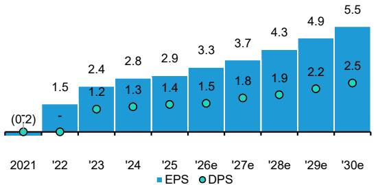

bar_line

| Year | EPS | DPS |
| :--- | :--- | :--- |
| 2021 | (0.2) | |
| '22 | 1.5 | - |
| '23 | 2.4 | 1.2 |
| '24 | 2.8 | 1.3 |
| '25 | 2.9 | 1.4 |
| '26e | 3.3 | 1.5 |
| '27e | 3.7 | 1.8 |
| '28e | 4.3 | 1.9 |
| '29e | 4.9 | 2.2 |
| '30e | 5.5 | 2.5 |

Source: Company reports, Bernstein estimates and analysis

# FINANCIAL OVERVIEW

Financial drivers and performance: (1) Segment metrics

GLOBAL AIR TECH   
EXHIBIT 35: Passengers boarded   
bn   
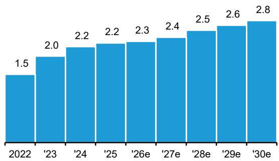

bar

| Year | Value |
|---|---|
| 2022 | 1.5 |
| '23 | 2.0 |
| '24 | 2.2 |
| '25 | 2.2 |
| '26e | 2.3 |
| '27e | 2.4 |
| '28e | 2.5 |
| '29e | 2.6 |
| '30e | 2.8 |

Source: Company reports, Bernstein analysis and estimates

EXHIBIT 36: Revenue per passenger boarded   
€   
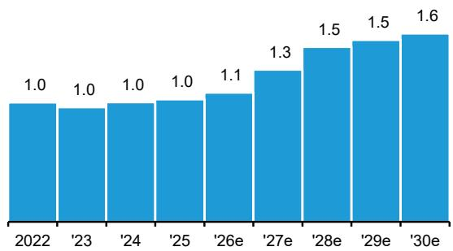

bar

| Year | Value |
| :--- | :--- |
| 2022 | 1.0 |
| '23 | 1.0 |
| '24 | 1.0 |
| '25 | 1.0 |
| '26e | 1.1 |
| '27e | 1.3 |
| '28e | 1.5 |
| '29e | 1.5 |
| '30e | 1.6 |

Company reports, Bernstein analysis and estimates

EXHIBIT 37: Contribution per passenger boarded   
€   
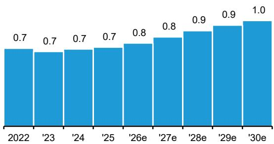

bar

| Year | Value |
| :--- | :--- |
| 2022 | 0.7 |
| '23 | 0.7 |
| '24 | 0.7 |
| '25 | 0.7 |
| '26e | 0.8 |
| '27e | 0.8 |
| '28e | 0.9 |
| '29e | 0.9 |
| '30e | 1.0 |

Source: Company reports, Bernstein analysis and estimates

EXHIBIT 38: Air bookings   
millions   
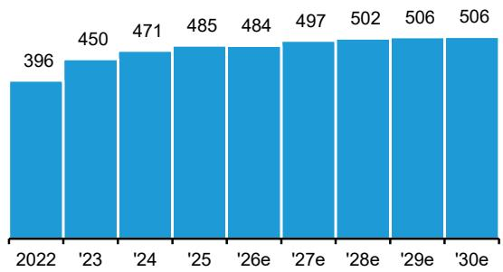

bar

| Year | Value |
|---|---|
| 2022 | 396 |
| '23 | 450 |
| '24 | 471 |
| '25 | 485 |
| '26e | 484 |
| '27e | 497 |
| '28e | 502 |
| '29e | 506 |
| '30e | 506 |

Source: Company reports, Bernstein analysis and estimates

EXHIBIT 39: Revenue per booking   
€   
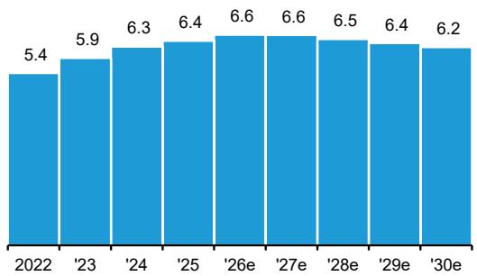

bar

| Year | Value |
| :--- | :--- |
| 2022 | 5.4 |
| '23 | 5.9 |
| '24 | 6.3 |
| '25 | 6.4 |
| '26e | 6.6 |
| '27e | 6.6 |
| '28e | 6.5 |
| '29e | 6.4 |
| '30e | 6.2 |

Source: Company reports, Bernstein analysis and estimates

EXHIBIT 40: Contribution per booking   
€   
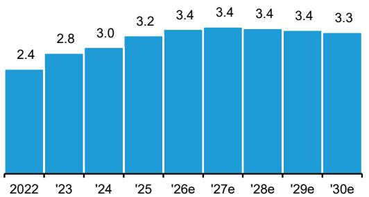

bar

| Year | Value |
| :--- | :--- |
| 2022 | 2.4 |
| '23 | 2.8 |
| '24 | 3.0 |
| '25 | 3.2 |
| '26e | 3.4 |
| '27e | 3.4 |
| '28e | 3.4 |
| '29e | 3.4 |
| '30e | 3.3 |

Source: Company reports, Bernstein analysis and estimates

€ bn   
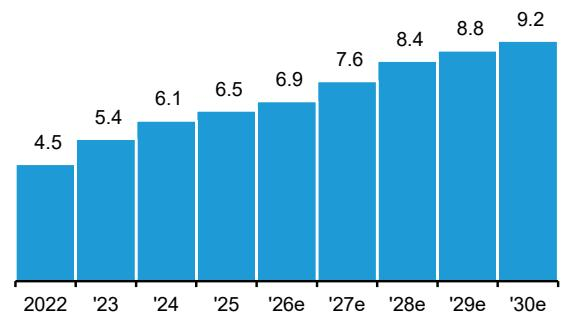

bar

| Year | Value |
|---|---|
| 2022 | 4.5 |
| '23 | 5.4 |
| '24 | 6.1 |
| '25 | 6.5 |
| '26e | 6.9 |
| '27e | 7.6 |
| '28e | 8.4 |
| '29e | 8.8 |
| '30e | 9.2 |

Source: Company reports, Bernstein analysis and estimates

EXHIBIT 42: Revenue per segment   
€ bn   
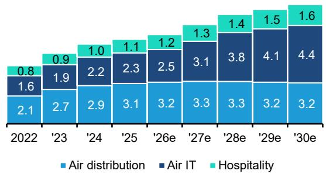

bar_stacked

| Year | Air distribution | Air IT | Hospitality |
|---|---|---|---|
| 2022 | 2.1 | 1.6 | 0.8 |
| '23 | 2.7 | 1.9 | 0.9 |
| '24 | 2.9 | 2.2 | 1.0 |
| '25 | 3.1 | 2.3 | 1.1 |
| '26e | 3.2 | 2.5 | 1.2 |
| '27e | 3.3 | 3.1 | 1.3 |
| '28e | 3.3 | 3.8 | 1.4 |
| '29e | 3.2 | 4.1 | 1.5 |
| '30e | 3.2 | 4.4 | 1.6 |

Source: Company reports, Bernstein analysis and estimates

EXHIBIT 43: Indirect costs and Indirect cost / sales €m   
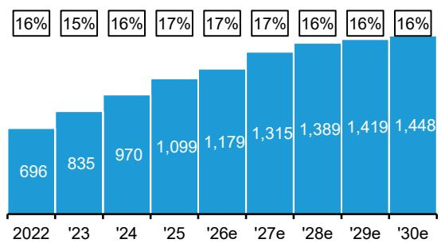

bar

| Year | Value |
| :--- | :--- |
| 2022 | 696 |
| '23 | 835 |
| '24 | 970 |
| '25 | 1,099 |
| '26e | 1,179 |
| '27e | 1,315 |
| '28e | 1,389 |
| '29e | 1,419 |
| '30e | 1,448 |
16% (top of bars) 15% (bottom of bars) 16% (top of bars) 17% (bottom of bars) 17% (bottom of bars) 16% (bottom of bars) 16% (bottom of bars)

Source: Company reports, Bernstein analysis and estimates

EXHIBIT 44: EBITDA   
€ bn   
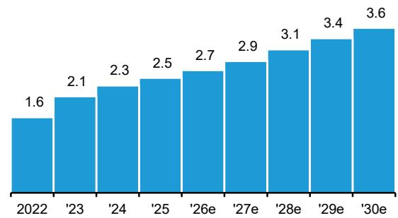

bar

| Year | Value |
|---|---|
| 2022 | 1.6 |
| '23 | 2.1 |
| '24 | 2.3 |
| '25 | 2.5 |
| '26e | 2.7 |
| '27e | 2.9 |
| '28e | 3.1 |
| '29e | 3.4 |
| '30e | 3.6 |

Source: Company reports, Bernstein analysis and estimates

EXHIBIT 45: Contribution per segment   
€ bn   
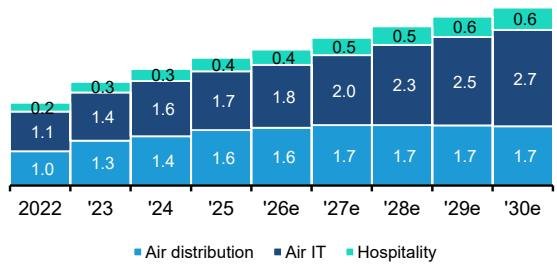

bar_stacked

| Year | Air distribution | Air IT | Hospitality |
|---|---|---|---|
| 2022 | 1.0 | 1.1 | 0.2 |
| '23 | 1.3 | 1.4 | 0.3 |
| '24 | 1.4 | 1.6 | 0.3 |
| '25 | 1.6 | 1.7 | 0.4 |
| '26e | 1.6 | 1.8 | 0.4 |
| '27e | 1.7 | 2.0 | 0.5 |
| '28e | 1.7 | 2.3 | 0.5 |
| '29e | 1.7 | 2.5 | 0.6 |
| '30e | 1.7 | 2.7 | 0.6 |

Source: Company reports, Bernstein analysis and estimates

EXHIBIT 46: R&D investment and R&D investment / sales   
€ m   
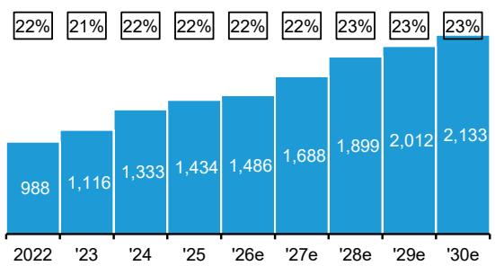

bar

| Year | Value |
| :--- | :--- |
| 2022 | 988 |
| '23 | 1,116 |
| '24 | 1,333 |
| '25 | 1,434 |
| '26e | 1,486 |
| '27e | 1,688 |
| '28e | 1,899 |
| '29e | 2,012 |
| '30e | 2,133 |
The chart displays a single series of values for each year from 2022 to '30e, with percentages (22%, 21%, 22%, 22%, 23%) above each bar indicating the percentage change relative to the previous year.

Source: Company reports, Bernstein analysis and estimates

# Financial drivers and performance: (3) Margins, returns and leverage

EXHIBIT 47: EBITDA margin   
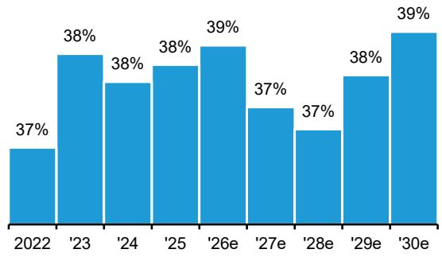

bar

| Year | Value (%) |
| :--- | :--- |
| 2022 | 37 |
| '23 | 38 |
| '24 | 38 |
| '25 | 38 |
| '26e | 39 |
| '27e | 37 |
| '28e | 37 |
| '29e | 38 |
| '30e | 39 |

Source: Company reports, Bernstein analysis and estimates

EXHIBIT 48: EPS & DPS (€)   
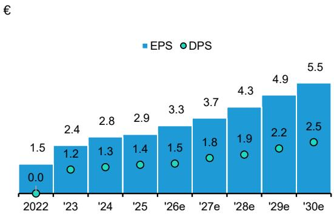

bar_line

| Year | EPS (€) | DPS (€) |
| :--- | :--- | :--- |
| 2022 | 1.5 | 0.0 |
| '23 | 2.4 | 1.2 |
| '24 | 2.8 | 1.3 |
| '25 | 2.9 | 1.4 |
| '26e | 3.3 | 1.5 |
| '27e | 3.7 | 1.8 |
| '28e | 4.3 | 1.9 |
| '29e | 4.9 | 2.2 |
| '30e | 5.5 | 2.5 |

Source: Company reports, Bernstein analysis and estimates

EXHIBIT 49: FCFE and FCFE/Net Income  
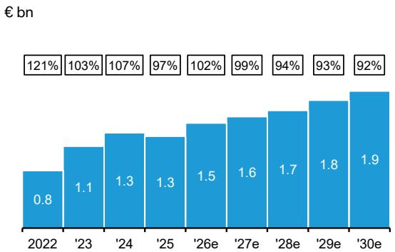

bar

| Year | Value (€ bn) | Growth Rate (%) |
| :--- | :--- | :--- |
| 2022 | 0.8 | 121 |
| '23 | 1.1 | 103 |
| '24 | 1.3 | 107 |
| '25 | 1.3 | 97 |
| '26e | 1.5 | 102 |
| '27e | 1.6 | 99 |
| '28e | 1.7 | 94 |
| '29e | 1.8 | 93 |
| '30e | 1.9 | 92 |

Source: Company reports, Bernstein analysis and estimates

EXHIBIT 50: Net debt   
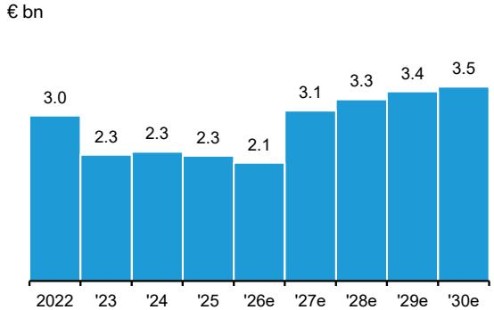

bar

| Year | Value (€ bn) |
| :--- | :--- |
| 2022 | 3.0 |
| '23 | 2.3 |
| '24 | 2.3 |
| '25 | 2.3 |
| '26e | 2.1 |
| '27e | 3.1 |
| '28e | 3.3 |
| '29e | 3.4 |
| '30e | 3.5 |

Source: Company reports, Bernstein analysis and estimates

EXHIBIT 51: Net Debt/EBITDA   
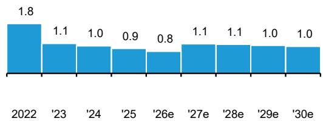

bar

| Year | Value |
| :--- | :--- |
| 2022 | 1.8 |
| '23 | 1.1 |
| '24 | 1.0 |
| '25 | 0.9 |
| '26e | 0.8 |
| '27e | 1.1 |
| '28e | 1.1 |
| '29e | 1.0 |
| '30e | 1.0 |

Source: Company reports, Bernstein analysis and estimates

EXHIBIT 52: ROIC   
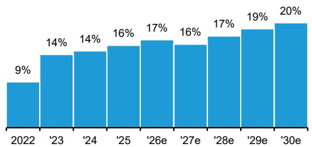

bar

| Year | Value (%) |
|---|---|
| 2022 | 9 |
| '23 | 14 |
| '24 | 14 |
| '25 | 16 |
| '26e | 17 |
| '27e | 16 |
| '28e | 17 |
| '29e | 19 |
| '30e | 20 |

Source: Company reports, Bernstein analysis and estimates

Financial drivers and performance: (4) Valuation
EXHIBIT 53: Amadeus 10-year FY+2 consensus P/E   
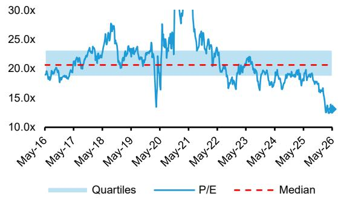

line

| Date   | P/E  | Median |
|--------|------|--------|
| May-16 | 18.0x| 20.0x  |
| May-17 | 20.0x| 20.0x  |
| May-18 | 25.0x| 20.0x  |
| May-19 | 22.0x| 20.0x  |
| May-20 | 14.0x| 20.0x  |
| May-21 | 30.0x| 20.0x  |
| May-22 | 25.0x| 20.0x  |
| May-23 | 20.0x| 20.0x  |
| May-24 | 18.0x| 20.0x  |
| May-25 | 16.0x| 20.0x  |
| May-26 | 13.0x| 20.0x  |

Source: Bloomberg, Bernstein analysis

EXHIBIT 54: Amadeus 10-year FY+2 consensus EV-EBITDA   
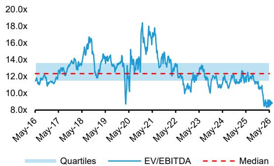

line

| Date   | EV/EBITDA |
|--------|-----------|
| May-16 | 12.0x     |
| May-17 | 13.0x     |
| May-18 | 16.0x     |
| May-19 | 14.0x     |
| May-20 | 15.0x     |
| May-21 | 18.0x     |
| May-22 | 14.0x     |
| May-23 | 13.0x     |
| May-24 | 12.0x     |
| May-25 | 11.0x     |
| May-26 | 9.0x      |

Source: Bloomberg, Bernstein analysis

EXHIBIT 55: Amadeus 10-year FY+2 consensus EV/sales   
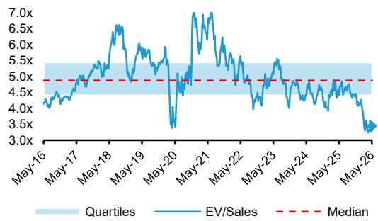

line

| Date   | EV/Sales | Median |
|--------|----------|--------|
| May-16 | 4.0x     | 4.8x   |
| May-17 | 4.5x     | 4.8x   |
| May-18 | 6.5x     | 4.8x   |
| May-19 | 5.5x     | 4.8x   |
| May-20 | 3.5x     | 4.8x   |
| May-21 | 7.0x     | 4.8x   |
| May-22 | 6.0x     | 4.8x   |
| May-23 | 5.5x     | 4.8x   |
| May-24 | 4.5x     | 4.8x   |
| May-25 | 4.8x     | 4.8x   |
| May-26 | 3.5x     | 4.8x   |

Source: Bloomberg, Bernstein analysis

EXHIBIT 56: Amadeus relative P/E   
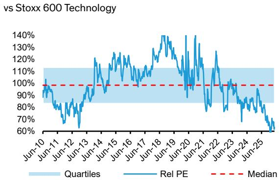

line

| Date   | Rel PE | Quartiles |
|--------|--------|-----------|
| Jun-10 | 100%   | 100%      |
| Jun-11 | 90%    | 100%      |
| Jun-12 | 80%    | 100%      |
| Jun-13 | 70%    | 100%      |
| Jun-14 | 120%   | 100%      |
| Jun-15 | 110%   | 100%      |
| Jun-16 | 120%   | 100%      |
| Jun-17 | 110%   | 100%      |
| Jun-18 | 130%   | 100%      |
| Jun-19 | 140%   | 100%      |
| Jun-20 | 130%   | 100%      |
| Jun-21 | 120%   | 100%      |
| Jun-22 | 130%   | 100%      |
| Jun-23 | 120%   | 100%      |
| Jun-24 | 100%   | 100%      |
| Jun-25 | 60%    | 100%      |

Source: Bloomberg, Bernstein analysis

EXHIBIT 57: Amadeus relative EV/EBITDA   
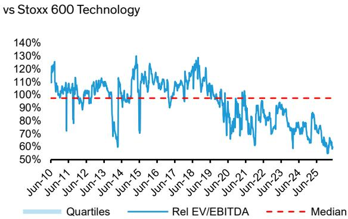

line

| Date   | Quartiles | Rel EV/EBITDA |
|--------|-----------|---------------|
| Jun-10 | 120%      | 120%          |
| Jun-11 | 100%      | 70%           |
| Jun-12 | 100%      | 100%          |
| Jun-13 | 100%      | 100%          |
| Jun-14 | 100%      | 60%           |
| Jun-15 | 130%      | 120%          |
| Jun-16 | 100%      | 100%          |
| Jun-17 | 100%      | 90%           |
| Jun-18 | 120%      | 120%          |
| Jun-19 | 100%      | 100%          |
| Jun-20 | 90%       | 90%           |
| Jun-21 | 90%       | 60%           |
| Jun-22 | 90%       | 90%           |
| Jun-23 | 90%       | 60%           |
| Jun-24 | 80%       | 80%           |
| Jun-25 | 60%       | 60%           |

Source: Bloomberg, Bernstein analysis

EXHIBIT 58: Amadeus relative EV/sales   
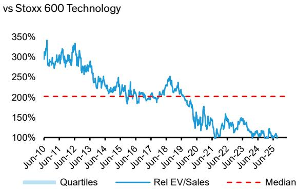

line

| Date   | Quartiles | Rel EV/Sales |
|--------|-----------|--------------|
| Jun-10 | 350%      | 350%         |
| Jun-11 | 300%      | 300%         |
| Jun-12 | 280%      | 280%         |
| Jun-13 | 260%      | 260%         |
| Jun-14 | 240%      | 240%         |
| Jun-15 | 220%      | 220%         |
| Jun-16 | 200%      | 200%         |
| Jun-17 | 180%      | 180%         |
| Jun-18 | 200%      | 200%         |
| Jun-19 | 220%      | 220%         |
| Jun-20 | 150%      | 150%         |
| Jun-21 | 100%      | 100%         |
| Jun-22 | 120%      | 120%         |
| Jun-23 | 100%      | 100%         |
| Jun-24 | 80%       | 80%          |
| Jun-25 | 60%       | 60%          |

Source: Bloomberg, Bernstein analysis

# QUESTIONS TO MANAGEMENT

# Trading

- How strong are demand trends across your key volume drivers (air bookings, air passengers, hospitality transactions)?   
- Any regions / customer groups with particular strength or weakness to call out?   
• How is pricing evolving?

# Air IT

• How is demand evolving at your key customers?   
- What recent contract wins / losses have you had for Altéa and Navitaire and how meaningful are these for overall volumes?   
• What trends are you currently seeing in your non-PSS products?   
- How do you expect a move to order management systems to happen? Is this an opportunity or a threat?   
- Are you expecting new competitors to emerge in order management? How will you defend against this?   
• How do you expect Nevio to contribute to revenues?   
- What traction are you experiencing with non-Altea/Navitaire customers on their willingness to adopt Nevio?   
• Is AI an opportunity or a threat in Air IT? Why?

# Air Distribution

• Where is Amadeus taking or losing share in air distribution? Why?   
- Can you make money in AI distribution? How? What is your value add?   
- Do you expect LLMs to rely on GDSs for content or to get this from airlines? Why?   
- Is the move towards NDC accelerating or decelerating? What have been the most meaningful recent changes in this space?   
• What are the biggest barriers to further NDC adoption among airlines or agents, and how are you helping overcome these?   
• What share of your bookings are NDC vs EDIFACT today? Where do you expect that to be in 1, 2, 5 years?   
• How do the relative economics of an NDC booking and a GDS booking, like for like, compare on both revenue and cost?

# Hospitality

- How much of your hospitality revenue comes from each of your key products?   
• How is the rollout of ACRS going? What sort of feedback have you had from customers?   
- What would success look like with ACRS? How many chains do you think you can sell this to?   
- Which products are your largest growth opportunities?

# Cost and capital allocation

• How are you thinking about inorganic growth? What products / verticals would be most appealing?   
- Which areas are you prioritizing for R&D spend? How do you expect those priorities to evolve?

- Is there an opportunity to reduce your indirect costs? What do you need to spend €1.2bn on per year?   
- Can you stop increasing R&D spend

# APPENDIX: SABRE CHART BANK

EXHIBIT 59: TTM bookings   
millions   
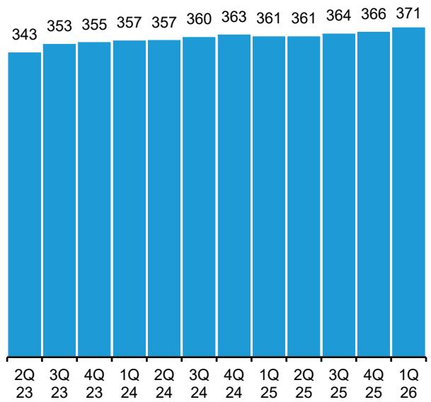

bar

| Quarter | Value |
| :--- | :--- |
| 2Q 23 | 343 |
| 3Q 23 | 353 |
| 4Q 23 | 355 |
| 1Q 24 | 357 |
| 2Q 24 | 357 |
| 3Q 24 | 360 |
| 4Q 24 | 363 |
| 1Q 25 | 361 |
| 2Q 25 | 361 |
| 3Q 25 | 364 |
| 4Q 25 | 366 |
| 1Q 26 | 371 |

Source: Company reports, Bernstein analysis

EXHIBIT 61: TTM passenger boarded   
millions   
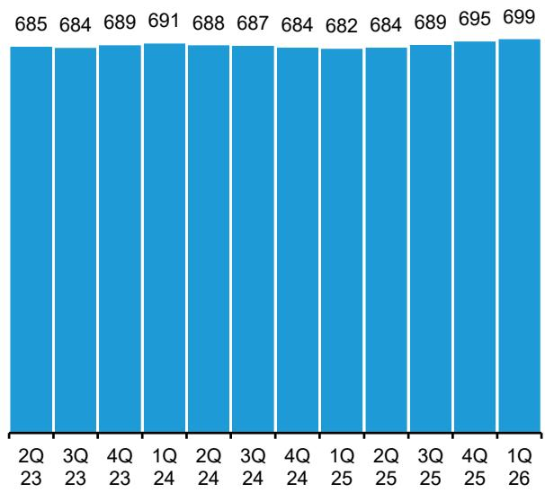

bar

| Quarter | Value |
| :--- | :--- |
| 2Q 23 | 685 |
| 3Q 23 | 684 |
| 4Q 23 | 689 |
| 1Q 24 | 691 |
| 2Q 24 | 688 |
| 3Q 24 | 687 |
| 4Q 24 | 684 |
| 1Q 25 | 682 |
| 2Q 25 | 684 |
| 3Q 25 | 689 |
| 4Q 25 | 695 |
| 1Q 26 | 699 |

Source: Company reports, Bernstein analysis

EXHIBIT 60: TTM Revenue per booking   
\$   
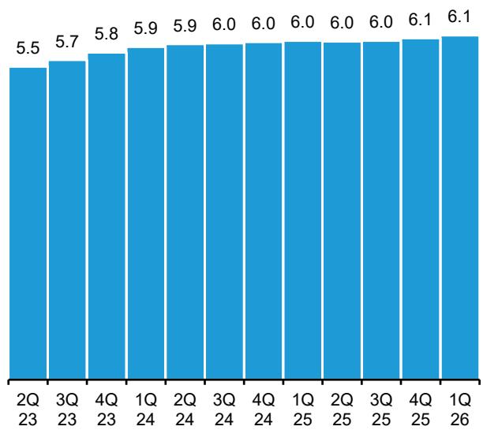

bar

| Quarter | Value |
|---|---|
| 2Q 23 | 5.5 |
| 3Q 23 | 5.7 |
| 4Q 23 | 5.8 |
| 1Q 24 | 5.9 |
| 2Q 24 | 5.9 |
| 3Q 24 | 6.0 |
| 4Q 24 | 6.0 |
| 1Q 25 | 6.0 |
| 2Q 25 | 6.0 |
| 3Q 25 | 6.0 |
| 4Q 25 | 6.1 |
| 1Q 26 | 6.1 |

Source: Company reports, Bernstein analysis

EXHIBIT 62: TTM Revenue per passenger boarded   
\$   
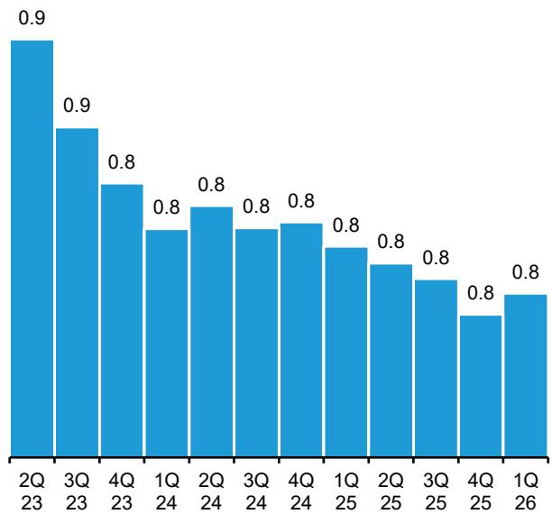

bar

| Quarter | Value |
|---|---|
| 2Q 23 | 0.9 |
| 3Q 23 | 0.9 |
| 4Q 23 | 0.8 |
| 1Q 24 | 0.8 |
| 2Q 24 | 0.8 |
| 3Q 24 | 0.8 |
| 4Q 24 | 0.8 |
| 1Q 25 | 0.8 |
| 2Q 25 | 0.8 |
| 3Q 25 | 0.8 |
| 4Q 25 | 0.8 |
| 1Q 26 | 0.8 |

Source: Company reports, Bernstein analysis

EXHIBIT 63: TTM EBITDA   
\$ millions   
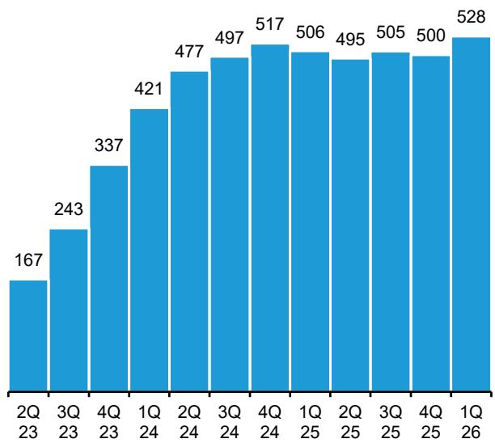

bar

| Quarter | Value |
|---|---|
| 2Q 23 | 167 |
| 3Q 23 | 243 |
| 4Q 23 | 337 |
| 1Q 24 | 421 |
| 2Q 24 | 477 |
| 3Q 24 | 497 |
| 4Q 24 | 517 |
| 1Q 25 | 506 |
| 2Q 25 | 495 |
| 3Q 25 | 505 |
| 4Q 25 | 500 |
| 1Q 26 | 528 |

Source: Company reports, Bernstein analysis

Revenue per segment (\$bn)   
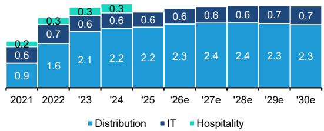

bar_stacked

| Year | Distribution | IT | Hospitality |
| :--- | :--- | :--- | :--- |
| 2021 | 0.9 | 0.6 | 0.2 |
| 2022 | 1.6 | 0.7 | 0.3 |
| '23 | 2.1 | 0.6 | 0.3 |
| '24 | 2.2 | 0.6 | 0.3 |
| '25 | 2.2 | 0.6 | 0.3 |
| '26e | 2.3 | 0.6 | 0.3 |
| '27e | 2.4 | 0.6 | 0.3 |
| '28e | 2.4 | 0.6 | 0.3 |
| '29e | 2.3 | 0.7 | 0.3 |
| '30e | 2.3 | 0.7 | 0.3 |

GDS bookings and revenue /booking (\$)   
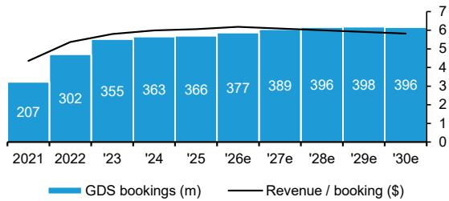

bar_line

| Year | GDS bookings (m) | Revenue / booking ($) |
| :--- | :--- | :--- |
| 2021 | 207 | 4.5 |
| 2022 | 302 | 5.5 |
| '23 | 355 | 5.8 |
| '24 | 363 | 5.9 |
| '25 | 366 | 6.0 |
| '26e | 377 | 6.1 |
| '27e | 389 | 6.0 |
| '28e | 396 | 5.9 |
| '29e | 398 | 5.8 |
| '30e | 396 | 5.7 |

Passengers boarded and IT revenue / PB (\$)   
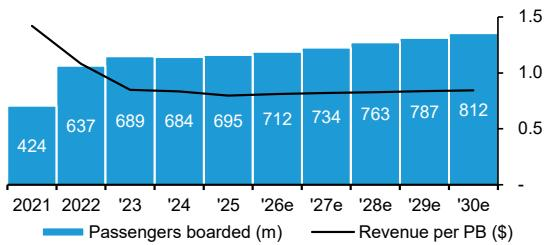

bar_line

| Year | Passengers boarded (m) | Revenue per PB ($) |
| :--- | :--- | :--- |
| 2021 | 424 | 1.5 |
| 2022 | 637 | 1.1 |
| '23 | 689 | 0.9 |
| '24 | 684 | 0.9 |
| '25 | 695 | 0.85 |
| '26e | 712 | 0.85 |
| '27e | 734 | 0.85 |
| '28e | 763 | 0.85 |
| '29e | 787 | 0.85 |
| '30e | 812 | 0.85 |

EBITDA per segment (\$bn)   
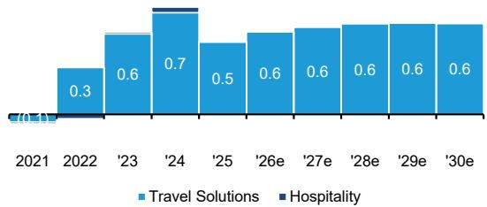

bar

| Year   | Travel Solutions | Hospitality |
| ------ | ---------------- | ----------- |
| 2021   | 0.1              | 0.1         |
| 2022   | 0.3              | 0.1         |
| '23    | 0.6              | 0.1         |
| '24    | 0.7              | 0.1         |
| '25    | 0.5              | 0.1         |
| '26e   | 0.6              | 0.1         |
| '27e   | 0.6              | 0.1         |
| '28e   | 0.6              | 0.1         |
| '29e   | 0.6              | 0.1         |
| '30e   | 0.6              | 0.1         |

EBITDA (\$m) and EBITDA margin   
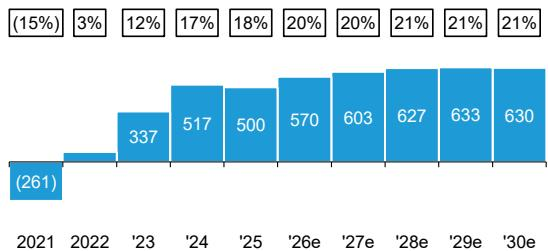

bar

| Year | Value |
| :--- | :--- |
| 2021 | (261) |
| 2022 | 337 |
| '23 | 517 |
| '24 | 500 |
| '25 | 570 |
| '26e | 603 |
| '27e | 627 |
| '28e | 633 |
| '29e | 630 |
The chart displays a single series of values for each year from 2021 to '30e, with percentage changes indicated above each bar. The absolute value in parentheses is also displayed on top of the bars. The percentage change between consecutive years is annotated above each bar.

Net debt (\$bn) and leverage   
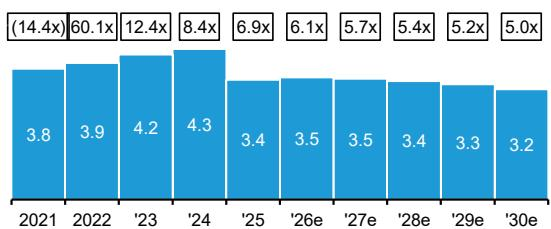

bar

| Year | Value (x) |
| :--- | :--- |
| 2021 | 3.8 |
| 2022 | 3.9 |
| '23 | 4.2 |
| '24 | 4.3 |
| '25 | 3.4 |
| '26e | 3.5 |
| '27e | 3.5 |
| '28e | 3.4 |
| '29e | 3.3 |
| '30e | 3.2 |
(14.4x) | 60.1x |
| 12.4x | 12.4x |
| 8.4x | 8.4x |
| 6.9x | 6.9x |
| 6.1x | 6.1x |
| 5.7x | 5.7x |
| 5.4x | 5.4x |
| 5.2x | 5.2x |
| 5.0x | 5.0x |

ROIC   
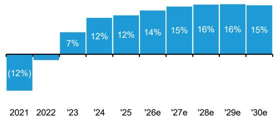

bar

| Year | Value (%) |
| :--- | :--- |
| 2021 | -12 |
| 2022 | 7 |
| '23 | 12 |
| '24 | 12 |
| '25 | 12 |
| '26e | 14 |
| '27e | 15 |
| '28e | 16 |
| '29e | 16 |
| '30e | 15 |

FCFE (\$bn) and FCFE/Net Income   
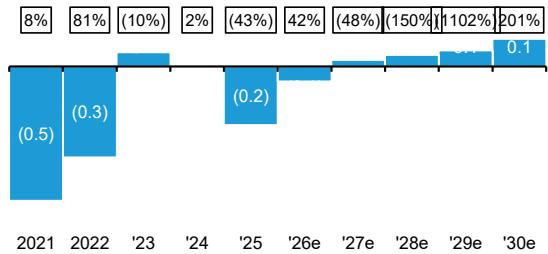

bar

| Year | Value |
| :--- | :--- |
| 2021 | (0.5) |
| 2022 | (0.3) |
| '23 | |
| '24 | |
| '25 | (0.2) |
| '26e | |
| '27e | |
| '28e | |
| '29e | 0.1 |
| '30e | 0.1 |
8% 81% (10%) 2% (43%) 42% (48%) (150%) (1102%) 201%

Adj. and GAAP EPS (\$)   
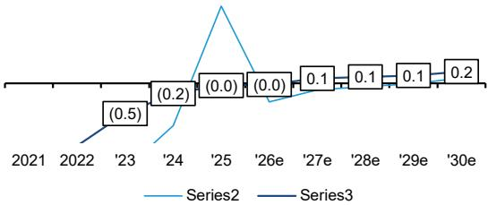

line

| Year   | Series2 | Series3 |
| ------ | ------- | ------- |
| '23    |         | (0.5)   |
| '24    |         | (0.2)   |
| '25    |         | (0.0)   |
| '26e   |         | (0.0)   |
| '27e   |         | 0.1     |
| '28e   |         | 0.1     |
| '29e   |         | 0.1     |
| '30e   |         | 0.2     |

Source: Company reports, Bernstein estimates and analysis

# FINANCIAL OVERVIEW

Financial drivers and performance: (1) Segment metrics

GLOBAL AIR TECH   
EXHIBIT 65: Air bookings   
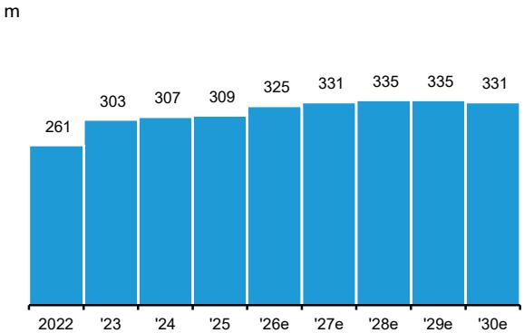

bar

| Year | Value (m) |
| :--- | :--- |
| 2022 | 261 |
| '23 | 303 |
| '24 | 307 |
| '25 | 309 |
| '26e | 325 |
| '27e | 331 |
| '28e | 335 |
| '29e | 335 |
| '30e | 331 |

Source: Company reports, Bernstein estimates and analysis

EXHIBIT 66: Revenue per booking   
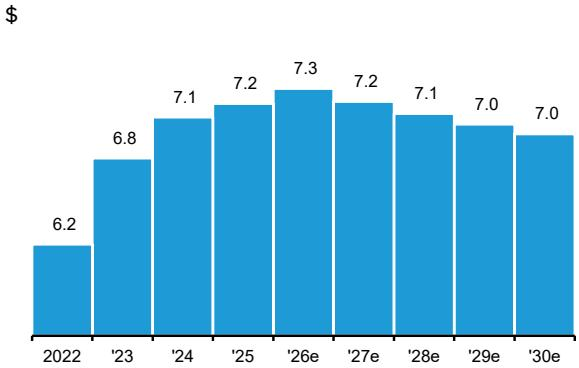

bar

| Year | Value ($) |
| :--- | :--- |
| 2022 | 6.2 |
| '23 | 6.8 |
| '24 | 7.1 |
| '25 | 7.2 |
| '26e | 7.3 |
| '27e | 7.2 |
| '28e | 7.1 |
| '29e | 7.0 |
| '30e | 7.0 |

Source: Company reports, Bernstein estimates and analysis

EXHIBIT 67: Passenger boarded   
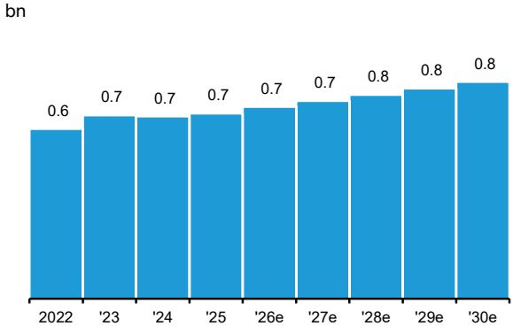

bar

| Year | Value (bn) |
| :--- | :--- |
| 2022 | 0.6 |
| '23 | 0.7 |
| '24 | 0.7 |
| '25 | 0.7 |
| '26e | 0.7 |
| '27e | 0.7 |
| '28e | 0.8 |
| '29e | 0.8 |
| '30e | 0.8 |

Source: Company reports, Bernstein analysis and estimates

EXHIBIT 68: Revenue per passenger boarded   
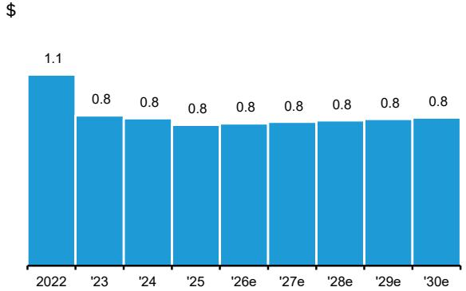

bar

| Year | Value ($) |
| :--- | :--- |
| 2022 | 1.1 |
| '23 | 0.8 |
| '24 | 0.8 |
| '25 | 0.8 |
| '26e | 0.8 |
| '27e | 0.8 |
| '28e | 0.8 |
| '29e | 0.8 |
| '30e | 0.8 |

Source: Company reports, Bernstein estimates and analysis

# Financial drivers and performance: (2) Earnings and cash contribution

EXHIBIT 69: Total revenue   
\$bn   
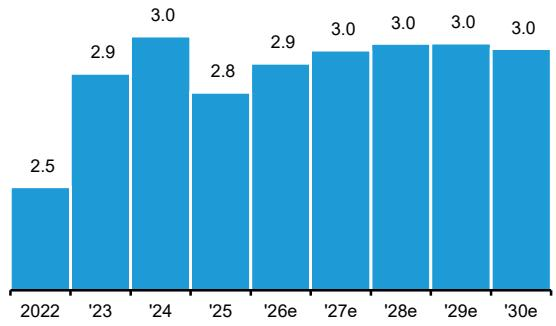

bar

| Year | Value |
| :--- | :--- |
| 2022 | 2.5 |
| '23 | 2.9 |
| '24 | 3.0 |
| '25 | 2.8 |
| '26e | 2.9 |
| '27e | 3.0 |
| '28e | 3.0 |
| '29e | 3.0 |
| '30e | 3.0 |

Source: Company reports, Bernstein estimates and analysis

EXHIBIT 70: Revenue per segment   
\$bn   
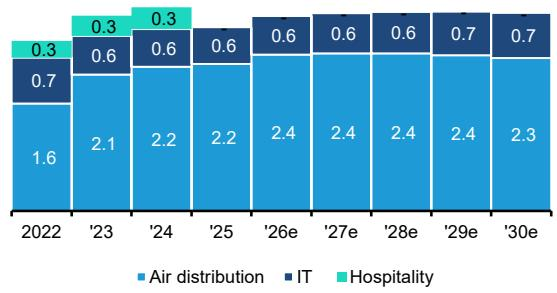

bar_stacked

| Year | Air distribution | IT | Hospitality |
| :--- | :--- | :--- | :--- |
| 2022 | 1.6 | 0.7 | 0.3 |
| '23 | 2.1 | 0.6 | 0.3 |
| '24 | 2.2 | 0.6 | 0.3 |
| '25 | 2.2 | 0.6 | 0.0 |
| '26e | 2.4 | 0.6 | 0.0 |
| '27e | 2.4 | 0.6 | 0.0 |
| '28e | 2.4 | 0.6 | 0.0 |
| '29e | 2.4 | 0.7 | 0.0 |
| '30e | 2.3 | 0.7 | 0.0 |

Source: Company reports, Bernstein estimates and analysis

EXHIBIT 71: Corporate costs and corporate cost/sales   
\$m   
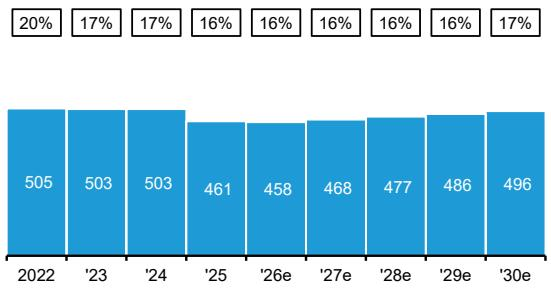

bar

| Year | Value |
| :--- | :--- |
| 2022 | 505 |
| '23 | 503 |
| '24 | 503 |
| '25 | 461 |
| '26e | 458 |
| '27e | 468 |
| '28e | 477 |
| '29e | 486 |
| '30e | 496 |
20% 17% 17% 16% 16% 16% 16% 17%

Source: Company reports, Bernstein estimates and analysis

EXHIBIT 72: Adj. EBITDA   
\$m   
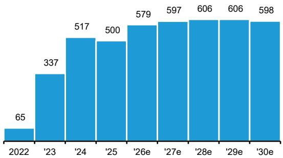

bar

| Year | Value |
|---|---|
| 2022 | 65 |
| '23 | 337 |
| '24 | 517 |
| '25 | 500 |
| '26e | 579 |
| '27e | 597 |
| '28e | 606 |
| '29e | 606 |
| '30e | 598 |

Source: Company reports, Bernstein estimates and analysis

EXHIBIT 73: Adj. EBITDA per segment   
\$bn   
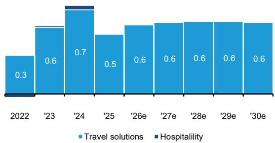

bar_stacked

| Year | Travel solutions | Hospitality |
| :--- | :--- | :--- |
| 2022 | 0.3 | 0.1 |
| '23 | 0.6 | 0.05 |
| '24 | 0.7 | 0.1 |
| '25 | 0.5 | 0.0 |
| '26e | 0.6 | 0.0 |
| '27e | 0.6 | 0.0 |
| '28e | 0.6 | 0.0 |
| '29e | 0.6 | 0.0 |
| '30e | 0.6 | 0.0 |

Source: Company reports, Bernstein estimates and analysis

EXHIBIT 74: Adj. technology costs   
\$m   
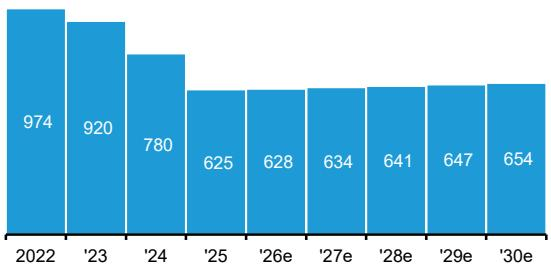

bar

| Year | Value |
| :--- | :--- |
| 2022 | 974 |
| '23 | 920 |
| '24 | 780 |
| '25 | 625 |
| '26e | 628 |
| '27e | 634 |
| '28e | 641 |
| '29e | 647 |
| '30e | 654 |

Source: Company reports, Bernstein estimates and analysis

# Financial drivers and performance: (3) Margins, returns and leverage

EXHIBIT 75: EBITDA margin   
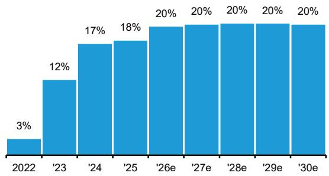

bar

| Year | Value (%) |
|---|---|
| 2022 | 3 |
| '23 | 12 |
| '24 | 17 |
| '25 | 18 |
| '26e | 20 |
| '27e | 20 |
| '28e | 20 |
| '29e | 20 |
| '30e | 20 |

Source: Company reports, Bernstein analysis and estimates

EXHIBIT 76: EPS and DPS   
\$   
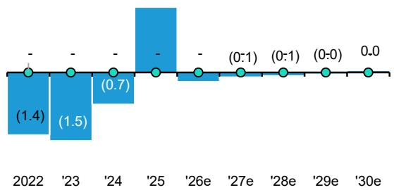

bar

| Year | Value |
| :--- | :--- |
| 2022 | -1.4 |
| '23 | -1.5 |
| '24 | -0.7 |
| '25 | - |
| '26e | - |
| '27e | (0:1) |
| '28e | (0:1) |
| '29e | (0:0) |
| '30e | 0.0 |

Source: Company reports, Bernstein estimates and analysis

EXHIBIT 77: FCFE and FCFE/ net income   
bn   
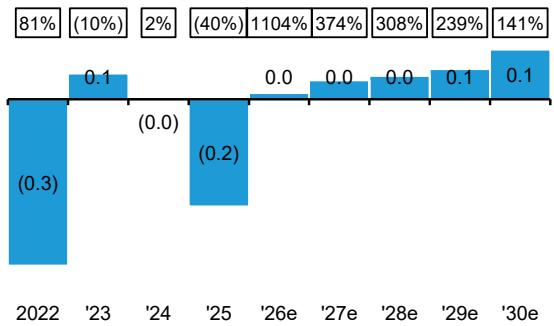

bar

| Year | Value | Percentage (%) |
| :--- | :--- | :--- |
| 2022 | -0.3 | 81 |
| '23 | 0.1 | (10) |
| '24 | -0.0 | 2 |
| '25 | -0.2 | (40) |
| '26e | 0.0 | 1104 |
| '27e | 0.0 | 374 |
| '28e | 0.0 | 308 |
| '29e | 0.1 | 239 |
| '30e | 0.1 | 141 |

Source: Company reports, Bernstein analysis and estimates

EXHIBIT 78: Net debt   
bn   
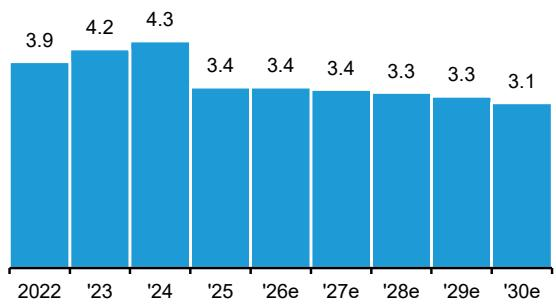

bar

| Year | Value |
| :--- | :--- |
| 2022 | 3.9 |
| '23 | 4.2 |
| '24 | 4.3 |
| '25 | 3.4 |
| '26e | 3.4 |
| '27e | 3.4 |
| '28e | 3.3 |
| '29e | 3.3 |
| '30e | 3.1 |

Source: Company reports, Bernstein estimates and analysis

EXHIBIT 79: Net debt/EBITDA   
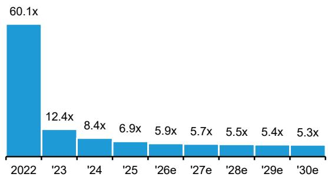

bar

| Year | Value (x) |
| :--- | :--- |
| 2022 | 60.1 |
| '23 | 12.4 |
| '24 | 8.4 |
| '25 | 6.9 |
| '26e | 5.9 |
| '27e | 5.7 |
| '28e | 5.5 |
| '29e | 5.4 |
| '30e | 5.3 |

Source: Company reports, Bernstein estimates and analysis

EXHIBIT 80: ROIC   
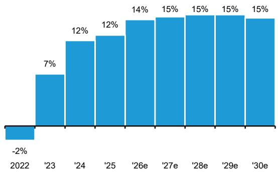

bar

| Year | Value (%) |
| :--- | :--- |
| 2022 | -2 |
| '23 | 7 |
| '24 | 12 |
| '25 | 12 |
| '26e | 14 |
| '27e | 15 |
| '28e | 15 |
| '29e | 15 |
| '30e | 15 |

Source: Company reports, Bernstein estimates and analysis

Financial drivers and performance: (4) Valuation   
EXHIBIT 81: SABR 10y FY+1 consensus P/E   
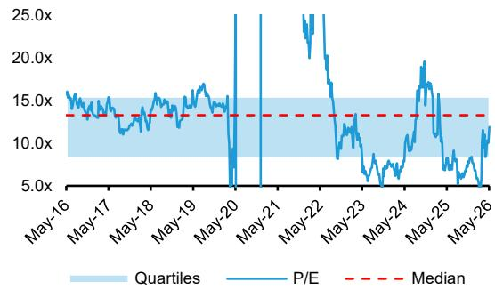

line

| Date   | Quartiles | P/E  |
|--------|-----------|------|
| May-16 | 14.0x     | 15.0x|
| May-17 | 13.5x     | 14.5x|
| May-18 | 13.0x     | 14.0x|
| May-19 | 13.5x     | 14.5x|
| May-20 | 14.0x     | 25.0x|
| May-21 | 14.0x     | 25.0x|
| May-22 | 14.0x     | 24.0x|
| May-23 | 13.5x     | 13.0x|
| May-24 | 13.0x     | 18.0x|
| May-25 | 13.5x     | 17.0x|
| May-26 | 13.0x     | 12.0x|

Source: Bloomberg, Bernstein analysis

EXHIBIT 82: SABR 10y FY+1 consensus EV/EBITDA   
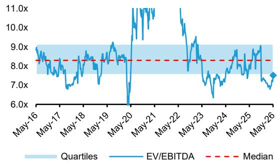

line

| Date   | EV/EBITDA |
|--------|-----------|
| May-16 | 9.0x      |
| May-17 | 8.0x      |
| May-18 | 8.5x      |
| May-19 | 9.0x      |
| May-20 | 6.0x      |
| May-21 | 10.0x     |
| May-22 | 9.0x      |
| May-23 | 7.0x      |
| May-24 | 8.0x      |
| May-25 | 9.0x      |
| May-26 | 7.5x      |

Source: Bloomberg, Bernstein analysis

EXHIBIT 83: SABR 10y FY+1 consensus EV/sales   
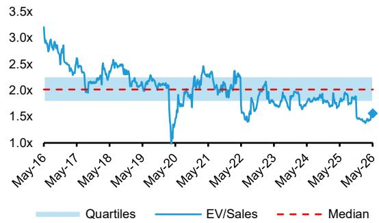

line

| Date   | EV/Sales |
|--------|----------|
| May-16 | 3.2x     |
| May-17 | 2.8x     |
| May-18 | 2.5x     |
| May-19 | 2.3x     |
| May-20 | 1.0x     |
| May-21 | 2.4x     |
| May-22 | 2.2x     |
| May-23 | 1.8x     |
| May-24 | 1.9x     |
| May-25 | 1.7x     |
| May-26 | 1.5x     |

Source: Bloomberg, Bernstein analysis

EXHIBIT 84: Sabre relative P/E   
vs NASDAQ composite   
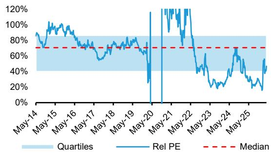

line

| Date   | Quartiles | Rel PE |
|--------|-----------|--------|
| May-14 | 60%       | 80%    |
| May-15 | 60%       | 90%    |
| May-16 | 60%       | 85%    |
| May-17 | 60%       | 75%    |
| May-18 | 60%       | 70%    |
| May-19 | 60%       | 75%    |
| May-20 | 60%       | 30%    |
| May-21 | 60%       | 120%   |
| May-22 | 60%       | 110%   |
| May-23 | 60%       | 40%    |
| May-24 | 60%       | 20%    |
| May-25 | 60%       | 10%    |

Relative to the NASDAQ Composite Index (CCMP)   
Source: Bloomberg, Bernstein analysis

EXHIBIT 85: Sabre relative EV/EBITDA   
vs NASDAQ composite   
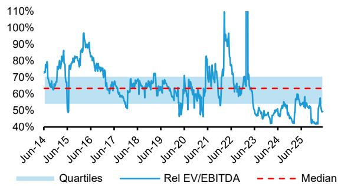

line

| Date   | Rel EV/EBITDA |
|--------|---------------|
| Jun-14 | 70%           |
| Jun-15 | 80%           |
| Jun-16 | 90%           |
| Jun-17 | 70%           |
| Jun-18 | 60%           |
| Jun-19 | 70%           |
| Jun-20 | 60%           |
| Jun-21 | 80%           |
| Jun-22 | 100%          |
| Jun-23 | 60%           |
| Jun-24 | 50%           |
| Jun-25 | 40%           |

Relative to the NASDAQ Composite Index (CCMP)   
Source: Bloomberg, Bernstein analysis

EXHIBIT 86: Sabre relative EV/sales   
vs NASDAQ composite   
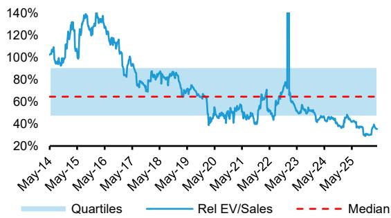

line

| Date   | Rel EV/Sales | Median |
|--------|--------------|--------|
| May-14 | ~100%        | 60%    |
| May-15 | ~130%        | 60%    |
| May-16 | ~140%        | 60%    |
| May-17 | ~120%        | 60%    |
| May-18 | ~90%         | 60%    |
| May-19 | ~80%         | 60%    |
| May-20 | ~40%         | 60%    |
| May-21 | ~50%         | 60%    |
| May-22 | ~70%         | 60%    |
| May-23 | ~140%        | 60%    |
| May-24 | ~40%         | 60%    |
| May-25 | ~30%         | 60%    |

Relative to the NASDAQ Composite Index (CCMP)   
Source: Bloomberg, Bernstein analysis

# APPENDIX - FINANCIAL FORECASTS

EXHIBIT 87: Amadeus financial model 

<table><tr><td></td><td>FY2021a</td><td>FY2022a</td><td>FY2023a</td><td>FY2024a</td><td>FY2025a</td><td>FY2026e</td><td>FY2027e</td><td>FY2028e</td><td>FY2029e</td><td>FY2030e</td></tr><tr><td colspan="11">KPIs</td></tr><tr><td>Air bookings (m)</td><td>206</td><td>396</td><td>450</td><td>471</td><td>485</td><td>484</td><td>497</td><td>502</td><td>506</td><td>506</td></tr><tr><td>Air distribution revenue per booking (€)</td><td>5.1</td><td>5.4</td><td>5.9</td><td>6.3</td><td>6.4</td><td>6.6</td><td>6.6</td><td>6.5</td><td>6.4</td><td>6.2</td></tr><tr><td>Air distribution contribution per booking (€)</td><td>1.9</td><td>2.4</td><td>2.8</td><td>3.0</td><td>3.2</td><td>3.4</td><td>3.4</td><td>3.4</td><td>3.4</td><td>3.3</td></tr><tr><td>Passengers boarded (m)</td><td>849</td><td>1,540</td><td>1,952</td><td>2,166</td><td>2,249</td><td>2,284</td><td>2,376</td><td>2,537</td><td>2,648</td><td>2,754</td></tr><tr><td>IT revenue per passenger boarded (€)</td><td>1.26</td><td>1.02</td><td>0.98</td><td>1.02</td><td>1.04</td><td>1.10</td><td>1.30</td><td>1.49</td><td>1.55</td><td>1.60</td></tr><tr><td>IT contribution per passenger boarded (€)</td><td>0.83</td><td>0.73</td><td>0.70</td><td>0.72</td><td>0.74</td><td>0.78</td><td>0.83</td><td>0.89</td><td>0.94</td><td>0.99</td></tr><tr><td colspan="11">Income Statement (€m)</td></tr><tr><td>Air IT</td><td>1,070</td><td>1,565</td><td>1,904</td><td>2,205</td><td>2,346</td><td>2,512</td><td>3,078</td><td>3,778</td><td>4,101</td><td>4,415</td></tr><tr><td>Air distribution</td><td>1,062</td><td>2,148</td><td>2,655</td><td>2,946</td><td>3,119</td><td>3,205</td><td>3,287</td><td>3,260</td><td>3,217</td><td>3,157</td></tr><tr><td>Hospitality and other</td><td>539</td><td>773</td><td>883</td><td>991</td><td>1,052</td><td>1,163</td><td>1,285</td><td>1,389</td><td>1,500</td><td>1,620</td></tr><tr><td>Total revenue</td><td>2,670</td><td>4,486</td><td>5,441</td><td>6,142</td><td>6,517</td><td>6,880</td><td>7,649</td><td>8,427</td><td>8,818</td><td>9,192</td></tr><tr><td>Contribution - Air IT</td><td>705</td><td>1,121</td><td>1,364</td><td>1,563</td><td>1,664</td><td>1,775</td><td>1,982</td><td>2,267</td><td>2,502</td><td>2,724</td></tr><tr><td>Contribution - Air distribution</td><td>395</td><td>970</td><td>1,268</td><td>1,392</td><td>1,563</td><td>1,634</td><td>1,705</td><td>1,706</td><td>1,695</td><td>1,673</td></tr><tr><td>Contribution - Hospitality and other</td><td>172</td><td>245</td><td>296</td><td>342</td><td>379</td><td>429</td><td>489</td><td>529</td><td>577</td><td>629</td></tr><tr><td>Indirect costs</td><td>(645)</td><td>(696)</td><td>(866)</td><td>(962)</td><td>(1,126)</td><td>(1,188)</td><td>(1,315)</td><td>(1,389)</td><td>(1,419)</td><td>(1,448)</td></tr><tr><td>Underlying EBITDA</td><td>628</td><td>1,641</td><td>2,063</td><td>2,335</td><td>2,480</td><td>2,651</td><td>2,860</td><td>3,113</td><td>3,355</td><td>3,579</td></tr><tr><td>Contribution margin - Air IT</td><td>66%</td><td>72%</td><td>72%</td><td>71%</td><td>71%</td><td>71%</td><td>64%</td><td>60%</td><td>61%</td><td>62%</td></tr><tr><td>Contribution margin - Air distribution</td><td>37%</td><td>45%</td><td>48%</td><td>47%</td><td>50%</td><td>51%</td><td>52%</td><td>52%</td><td>53%</td><td>53%</td></tr><tr><td>Contribution margin - Hospitality and other</td><td>32%</td><td>32%</td><td>34%</td><td>34%</td><td>36%</td><td>37%</td><td>38%</td><td>38%</td><td>38%</td><td>39%</td></tr><tr><td>Indirect costs / Total revenue</td><td>24%</td><td>16%</td><td>16%</td><td>16%</td><td>17%</td><td>17%</td><td>17%</td><td>16%</td><td>16%</td><td>16%</td></tr><tr><td>Underlying EBITDA margin</td><td>24%</td><td>37%</td><td>38%</td><td>38%</td><td>38%</td><td>39%</td><td>37%</td><td>37%</td><td>38%</td><td>39%</td></tr><tr><td>Depreciation &amp; amortisation</td><td>(682)</td><td>(678)</td><td>(680)</td><td>(700)</td><td>(735)</td><td>(711)</td><td>(723)</td><td>(738)</td><td>(756)</td><td>(777)</td></tr><tr><td>Underlying EBIT</td><td>(54)</td><td>963</td><td>1,383</td><td>1,635</td><td>1,745</td><td>1,940</td><td>2,138</td><td>2,375</td><td>2,599</td><td>2,802</td></tr><tr><td>Underlying net income</td><td>(105)</td><td>677</td><td>1,098</td><td>1,261</td><td>1,300</td><td>1,432</td><td>1,580</td><td>1,752</td><td>1,923</td><td>2,080</td></tr><tr><td>Net margin</td><td>-3.9%</td><td>15.1%</td><td>20.2%</td><td>20.5%</td><td>19.9%</td><td>20.8%</td><td>20.6%</td><td>20.8%</td><td>21.8%</td><td>22.6%</td></tr><tr><td>Underlying EPS (€)</td><td>(0.2)</td><td>1.5</td><td>2.4</td><td>2.8</td><td>2.9</td><td>3.3</td><td>3.7</td><td>4.3</td><td>4.9</td><td>5.5</td></tr><tr><td>EPS growth</td><td>-75.5%</td><td>-744.4%</td><td>63.0%</td><td>17.7%</td><td>4.7%</td><td>14.6%</td><td>11.2%</td><td>14.7%</td><td>13.8%</td><td>12.3%</td></tr><tr><td>Average shares out (m)</td><td>465</td><td>465</td><td>463</td><td>452</td><td>444</td><td>428</td><td>424</td><td>410</td><td>396</td><td>381</td></tr><tr><td>P/E</td><td>(264.1x)</td><td>33.4x</td><td>27.4x</td><td>24.4x</td><td>21.5x</td><td>15.6x</td><td>14.0x</td><td>12.2x</td><td>10.7x</td><td>9.5x</td></tr><tr><td>EV/EBITDA</td><td>50.1x</td><td>15.5x</td><td>15.6x</td><td>14.2x</td><td>12.1x</td><td>9.2x</td><td>8.8x</td><td>7.9x</td><td>7.2x</td><td>6.5x</td></tr><tr><td>PEG</td><td>3.5x</td><td>(0.0x)</td><td>0.4x</td><td>1.4x</td><td>4.6x</td><td>1.1x</td><td>1.2x</td><td>0.8x</td><td>0.8x</td><td>0.8x</td></tr><tr><td colspan="11">Balance Sheet (€m)</td></tr><tr><td>Goodwill</td><td>3,654</td><td>3,767</td><td>3,711</td><td>4,091</td><td>3,912</td><td>3,996</td><td>5,246</td><td>5,246</td><td>5,246</td><td>5,246</td></tr><tr><td>Other non-current assets</td><td>4,884</td><td>4,880</td><td>4,685</td><td>5,100</td><td>5,079</td><td>5,208</td><td>5,329</td><td>5,473</td><td>5,640</td><td>5,832</td></tr><tr><td>Other current assets</td><td>1,516</td><td>1,631</td><td>1,361</td><td>1,545</td><td>1,504</td><td>1,598</td><td>1,815</td><td>1,902</td><td>1,978</td><td>2,053</td></tr><tr><td>Cash and cash equivalents</td><td>1,128</td><td>1,435</td><td>1,038</td><td>1,049</td><td>976</td><td>1,454</td><td>812</td><td>909</td><td>1,068</td><td>1,279</td></tr><tr><td>Total assets</td><td>11,182</td><td>11,712</td><td>10,795</td><td>11,784</td><td>11,471</td><td>12,256</td><td>13,203</td><td>13,529</td><td>13,932</td><td>14,411</td></tr><tr><td>Current liabilities ex-debt</td><td>1,369</td><td>1,644</td><td>1,925</td><td>2,232</td><td>2,349</td><td>2,590</td><td>2,909</td><td>3,042</td><td>3,173</td><td>3,302</td></tr><tr><td>Total debt</td><td>4,980</td><td>4,411</td><td>3,309</td><td>3,376</td><td>3,228</td><td>3,581</td><td>3,881</td><td>4,181</td><td>4,481</td><td>4,781</td></tr><tr><td>Other non-current liabilities</td><td>1,088</td><td>1,075</td><td>1,080</td><td>1,114</td><td>1,042</td><td>1,057</td><td>1,083</td><td>1,094</td><td>1,103</td><td>1,112</td></tr><tr><td>Total equity</td><td>3,745</td><td>4,583</td><td>4,483</td><td>5,064</td><td>4,854</td><td>5,030</td><td>5,331</td><td>5,214</td><td>5,177</td><td>5,218</td></tr><tr><td>Total equity and liabilities</td><td>11,182</td><td>11,712</td><td>10,795</td><td>11,784</td><td>11,471</td><td>12,256</td><td>13,203</td><td>13,529</td><td>13,932</td><td>14,411</td></tr><tr><td>Net debt</td><td>3,852</td><td>2,976</td><td>2,271</td><td>2,327</td><td>2,253</td><td>2,127</td><td>3,068</td><td>3,272</td><td>3,413</td><td>3,501</td></tr><tr><td>Net debt / EBITDA</td><td>6.4x</td><td>1.8x</td><td>1.1x</td><td>1.0x</td><td>0.9x</td><td>0.8x</td><td>1.1x</td><td>1.1x</td><td>1.0x</td><td>1.0x</td></tr><tr><td>Underlying ROIC</td><td>-0.4%</td><td>8.6%</td><td>13.8%</td><td>14.5%</td><td>15.5%</td><td>16.6%</td><td>15.8%</td><td>17.3%</td><td>18.7%</td><td>19.8%</td></tr><tr><td colspan="11">Cash Flow Statement (€m)</td></tr><tr><td>EBITDA</td><td>599</td><td>1,641</td><td>2,094</td><td>2,329</td><td>2,494</td><td>2,660</td><td>2,860</td><td>3,113</td><td>3,355</td><td>3,579</td></tr><tr><td>Working capital</td><td>83</td><td>(131)</td><td>(34)</td><td>81</td><td>94</td><td>84</td><td>106</td><td>43</td><td>37</td><td>37</td></tr><tr><td>Capex</td><td>(460)</td><td>(567)</td><td>(600)</td><td>(770)</td><td>(814)</td><td>(801)</td><td>(839)</td><td>(874)</td><td>(912)</td><td>(951)</td></tr><tr><td>Net interest</td><td>(77)</td><td>(69)</td><td>(46)</td><td>(52)</td><td>(41)</td><td>(99)</td><td>(93)</td><td>(110)</td><td>(118)</td><td>(125)</td></tr><tr><td>Taxes</td><td>61</td><td>(205)</td><td>(243)</td><td>(296)</td><td>(385)</td><td>(428)</td><td>(470)</td><td>(521)</td><td>(571)</td><td>(616)</td></tr><tr><td>Free Cash Flow</td><td>99</td><td>805</td><td>1,149</td><td>1,336</td><td>1,289</td><td>1,473</td><td>1,565</td><td>1,650</td><td>1,793</td><td>1,924</td></tr><tr><td>Dividends</td><td>-</td><td>-</td><td>(333)</td><td>(542)</td><td>(613)</td><td>(635)</td><td>(706)</td><td>(755)</td><td>(834)</td><td>(914)</td></tr><tr><td>Buybacks</td><td>(38)</td><td>(4)</td><td>(613)</td><td>(362)</td><td>(1,906)</td><td>(661)</td><td>(550)</td><td>(1,100)</td><td>(1,100)</td><td>(1,100)</td></tr><tr><td>Other cash movements</td><td>(488)</td><td>(495)</td><td>(599)</td><td>(419)</td><td>1,155</td><td>300</td><td>(950)</td><td>301</td><td>301</td><td>301</td></tr><tr><td>Change in cash and cash equivalents</td><td>(426)</td><td>306</td><td>(396)</td><td>12</td><td>(73)</td><td>478</td><td>(641)</td><td>96</td><td>159</td><td>211</td></tr><tr><td>BERN FCFF</td><td>176</td><td>874</td><td>1,195</td><td>1,387</td><td>1,331</td><td>1,571</td><td>1,657</td><td>1,760</td><td>1,910</td><td>2,048</td></tr><tr><td>FCFF yield</td><td>0.6%</td><td>3.4%</td><td>3.7%</td><td>4.2%</td><td>4.4%</td><td>6.4%</td><td>6.6%</td><td>7.1%</td><td>8.0%</td><td>8.8%</td></tr><tr><td>BERN FCFE</td><td>99</td><td>805</td><td>1,149</td><td>1,336</td><td>1,289</td><td>1,473</td><td>1,565</td><td>1,650</td><td>1,793</td><td>1,924</td></tr><tr><td>FCFE yield</td><td>0.4%</td><td>3.6%</td><td>3.8%</td><td>4.3%</td><td>4.6%</td><td>6.6%</td><td>7.1%</td><td>7.7%</td><td>8.7%</td><td>9.7%</td></tr><tr><td>DPS</td><td>-</td><td>-</td><td>1.2</td><td>1.3</td><td>1.4</td><td>1.5</td><td>1.8</td><td>1.9</td><td>2.2</td><td>2.5</td></tr><tr><td>Dividend yield</td><td>0.0%</td><td>0.0%</td><td>1.8%</td><td>1.9%</td><td>2.3%</td><td>2.8%</td><td>3.4%</td><td>3.7%</td><td>4.3%</td><td>4.9%</td></tr><tr><td>Dividend+buyback yield</td><td>0.1%</td><td>0.0%</td><td>3.1%</td><td>2.9%</td><td>9.0%</td><td>5.8%</td><td>5.7%</td><td>8.7%</td><td>9.4%</td><td>10.1%</td></tr></table>

Source: Company reports, Bernstein estimates and analysis

EXHIBIT 88: Sabre financial model 

<table><tr><td>KPIs</td><td>FY2021a</td><td>FY2022a</td><td>FY2023a</td><td>FY2024a</td><td>FY2025a</td><td>FY2026e</td><td>FY2027e</td><td>FY2028e</td><td>FY2029e</td><td>FY2030e</td></tr><tr><td>Air bookings (m)</td><td>184</td><td>261</td><td>303</td><td>307</td><td>309</td><td>318</td><td>327</td><td>332</td><td>332</td><td>329</td></tr><tr><td>Non-air bookings (m)</td><td>23</td><td>41</td><td>52</td><td>56</td><td>57</td><td>59</td><td>61</td><td>64</td><td>65</td><td>67</td></tr><tr><td>Revenue per booking ($)</td><td>4.4</td><td>5.4</td><td>5.8</td><td>6.0</td><td>6.1</td><td>6.2</td><td>6.1</td><td>6.0</td><td>5.9</td><td>5.8</td></tr><tr><td>Passengers boarded (m)</td><td>424</td><td>637</td><td>689</td><td>684</td><td>695</td><td>712</td><td>734</td><td>763</td><td>787</td><td>812</td></tr><tr><td>IT revenue per passenger boarded ($)</td><td>1.42</td><td>1.08</td><td>0.85</td><td>0.83</td><td>0.80</td><td>0.81</td><td>0.82</td><td>0.83</td><td>0.84</td><td>0.84</td></tr><tr><td>Income Statement ($m)</td><td>FY2021a</td><td>FY2022a</td><td>FY2023a</td><td>FY2024a</td><td>FY2025a</td><td>FY2026e</td><td>FY2027e</td><td>FY2028e</td><td>FY2029e</td><td>FY2030e</td></tr><tr><td>Distribution</td><td>901</td><td>1,623</td><td>2,057</td><td>2,174</td><td>2,217</td><td>2,329</td><td>2,367</td><td>2,374</td><td>2,349</td><td>2,304</td></tr><tr><td>IT Solutions</td><td>602</td><td>689</td><td>585</td><td>571</td><td>554</td><td>577</td><td>602</td><td>632</td><td>658</td><td>685</td></tr><tr><td>Total revenue</td><td>1,689</td><td>2,537</td><td>2,908</td><td>3,030</td><td>2,846</td><td>2,907</td><td>2,968</td><td>3,006</td><td>3,008</td><td>2,990</td></tr><tr><td>Cost of sales</td><td>(645)</td><td>(993)</td><td>(1,149)</td><td>(1,232)</td><td>(1,187)</td><td>(1,258)</td><td>(1,272)</td><td>(1,271)</td><td>(1,252)</td><td>(1,223)</td></tr><tr><td>Gross profit</td><td>1,044</td><td>1,544</td><td>1,758</td><td>1,797</td><td>1,659</td><td>1,649</td><td>1,696</td><td>1,735</td><td>1,756</td><td>1,767</td></tr><tr><td>Gross margin</td><td>62%</td><td>61%</td><td>60%</td><td>59%</td><td>58%</td><td>57%</td><td>57%</td><td>58%</td><td>58%</td><td>59%</td></tr><tr><td>Adj. EBITDA</td><td>(261)</td><td>65</td><td>337</td><td>517</td><td>500</td><td>570</td><td>603</td><td>627</td><td>633</td><td>630</td></tr><tr><td>Adj. EBITDA margin</td><td>(15%)</td><td>3%</td><td>12%</td><td>17%</td><td>18%</td><td>20%</td><td>20%</td><td>21%</td><td>21%</td><td>21%</td></tr><tr><td>Depreciation &amp; amortisation</td><td>(198)</td><td>(133)</td><td>(108)</td><td>(92)</td><td>(72)</td><td>(83)</td><td>(74)</td><td>(76)</td><td>(77)</td><td>(77)</td></tr><tr><td>Adj. EBIT</td><td>(459)</td><td>(68)</td><td>229</td><td>425</td><td>428</td><td>487</td><td>529</td><td>552</td><td>556</td><td>553</td></tr><tr><td>Adj. EBIT margin</td><td>(27%)</td><td>(3%)</td><td>8%</td><td>14%</td><td>15%</td><td>17%</td><td>18%</td><td>18%</td><td>18%</td><td>18%</td></tr><tr><td>Interest expense</td><td>(258)</td><td>(296)</td><td>(450)</td><td>(507)</td><td>(443)</td><td>(487)</td><td>(481)</td><td>(482)</td><td>(464)</td><td>(403)</td></tr><tr><td>EBITDA interest cover</td><td>(1.0x)</td><td>0.2x</td><td>0.7x</td><td>1.0x</td><td>1.1x</td><td>1.2x</td><td>1.3x</td><td>1.3x</td><td>1.4x</td><td>1.6x</td></tr><tr><td>Taxes and other</td><td>7</td><td>(7)</td><td>42</td><td>14</td><td>0</td><td>(9)</td><td>(11)</td><td>(15)</td><td>(20)</td><td>(33)</td></tr><tr><td>Underlying net income</td><td>(709)</td><td>(371)</td><td>(180)</td><td>(67)</td><td>(15)</td><td>(9)</td><td>37</td><td>54</td><td>72</td><td>116</td></tr><tr><td>Net income margin</td><td>-42.0%</td><td>-14.6%</td><td>-6.2%</td><td>-2.2%</td><td>-0.5%</td><td>-0.3%</td><td>1.3%</td><td>1.8%</td><td>2.4%</td><td>3.9%</td></tr><tr><td>Underlying EPS ($)</td><td>(2.21)</td><td>(1.08)</td><td>(0.52)</td><td>(0.17)</td><td>(0.04)</td><td>(0.02)</td><td>0.08</td><td>0.11</td><td>0.13</td><td>0.20</td></tr><tr><td>GAAP EPS</td><td>(2.90)</td><td>(1.35)</td><td>(1.48)</td><td>(0.73)</td><td>1.32</td><td>(0.32)</td><td>(0.11)</td><td>(0.06)</td><td>(0.01)</td><td>0.09</td></tr><tr><td>Average shares out (m)</td><td>321</td><td>348</td><td>355</td><td>384</td><td>392</td><td>413</td><td>454</td><td>495</td><td>536</td><td>578</td></tr><tr><td>P/E</td><td>(3.9x)</td><td>(5.7x)</td><td>(8.5x)</td><td>(20.9x)</td><td>(36.2x)</td><td>(106.9x)</td><td>24.5x</td><td>18.6x</td><td>15.3x</td><td>10.2x</td></tr><tr><td>EV/EBITDA</td><td>(25.1x)</td><td>92.6x</td><td>17.0x</td><td>11.0x</td><td>7.8x</td><td>7.6x</td><td>7.3x</td><td>7.0x</td><td>6.9x</td><td>6.9x</td></tr><tr><td>Balance Sheet ($m)</td><td>FY2021a</td><td>FY2022a</td><td>FY2023a</td><td>FY2024a</td><td>FY2025a</td><td>FY2026e</td><td>FY2027e</td><td>FY2028e</td><td>FY2029e</td><td>FY2030e</td></tr><tr><td>Goodwill</td><td>2,470</td><td>2,542</td><td>2,554</td><td>2,553</td><td>2,384</td><td>2,383</td><td>2,383</td><td>2,383</td><td>2,383</td><td>2,383</td></tr><tr><td>Other non-current assets</td><td>1,419</td><td>1,059</td><td>960</td><td>919</td><td>822</td><td>802</td><td>787</td><td>768</td><td>746</td><td>723</td></tr><tr><td>Other current assets</td><td>403</td><td>546</td><td>489</td><td>418</td><td>386</td><td>397</td><td>407</td><td>411</td><td>412</td><td>410</td></tr><tr><td>Cash and cash equivalents</td><td>999</td><td>816</td><td>669</td><td>746</td><td>910</td><td>611</td><td>731</td><td>796</td><td>510</td><td>861</td></tr><tr><td>Total assets</td><td>5,291</td><td>4,963</td><td>4,672</td><td>4,635</td><td>4,502</td><td>4,194</td><td>4,309</td><td>4,357</td><td>4,050</td><td>4,376</td></tr><tr><td>Current liabilities ex-debt</td><td>687</td><td>792</td><td>911</td><td>912</td><td>968</td><td>966</td><td>976</td><td>979</td><td>980</td><td>977</td></tr><tr><td>Total debt</td><td>4,753</td><td>4,741</td><td>4,834</td><td>5,065</td><td>4,349</td><td>4,116</td><td>4,196</td><td>4,196</td><td>3,822</td><td>4,027</td></tr><tr><td>Other non-current liabilities</td><td>351</td><td>303</td><td>304</td><td>263</td><td>222</td><td>226</td><td>231</td><td>232</td><td>233</td><td>232</td></tr><tr><td>Total equity</td><td>(500)</td><td>(873)</td><td>(1,376)</td><td>(1,605)</td><td>(1,036)</td><td>(1,114)</td><td>(1,094)</td><td>(1,051)</td><td>(984)</td><td>(860)</td></tr><tr><td>Total equity and liabilities</td><td>5,291</td><td>4,963</td><td>4,672</td><td>4,635</td><td>4,502</td><td>4,194</td><td>4,309</td><td>4,357</td><td>4,050</td><td>4,376</td></tr><tr><td>Net debt</td><td>3,754</td><td>3,925</td><td>4,164</td><td>4,319</td><td>3,439</td><td>3,505</td><td>3,465</td><td>3,401</td><td>3,313</td><td>3,167</td></tr><tr><td>Adj. net debt / EBITDA</td><td>-14.4x</td><td>60.1x</td><td>12.4x</td><td>8.4x</td><td>6.9x</td><td>6.1x</td><td>5.7x</td><td>5.4x</td><td>5.2x</td><td>5.0x</td></tr><tr><td>Underlying ROIC</td><td>-11.5%</td><td>-1.9%</td><td>7.0%</td><td>11.5%</td><td>12.3%</td><td>13.8%</td><td>15.0%</td><td>15.7%</td><td>15.8%</td><td>15.4%</td></tr><tr><td>Cash Flow Statement ($m)</td><td>FY2021a</td><td>FY2022a</td><td>FY2023a</td><td>FY2024a</td><td>FY2025a</td><td>FY2026e</td><td>FY2027e</td><td>FY2028e</td><td>FY2029e</td><td>FY2030e</td></tr><tr><td>EBITDA</td><td>(261)</td><td>65</td><td>337</td><td>517</td><td>500</td><td>570</td><td>603</td><td>627</td><td>633</td><td>630</td></tr><tr><td>Working capital</td><td>79</td><td>(24)</td><td>136</td><td>(54)</td><td>(24)</td><td>(44)</td><td>(2)</td><td>(1)</td><td>(0)</td><td>(0)</td></tr><tr><td>Net interest</td><td>(258)</td><td>(295)</td><td>(394)</td><td>(392)</td><td>(619)</td><td>(491)</td><td>(485)</td><td>(487)</td><td>(471)</td><td>(411)</td></tr><tr><td>Other CFO</td><td>26</td><td>(22)</td><td>(24)</td><td>(0)</td><td>(4)</td><td>(13)</td><td>5</td><td>5</td><td>6</td><td>7</td></tr><tr><td>Addition of PPE</td><td>(54)</td><td>(69)</td><td>(87)</td><td>(84)</td><td>(83)</td><td>(81)</td><td>(80)</td><td>(80)</td><td>(80)</td><td>(80)</td></tr><tr><td>FCF (company definition)</td><td>(469)</td><td>(345)</td><td>(31)</td><td>(14)</td><td>(229)</td><td>(59)</td><td>40</td><td>64</td><td>88</td><td>146</td></tr><tr><td>Other cash movements</td><td>(26)</td><td>168</td><td>(117)</td><td>94</td><td>(677)</td><td>(242)</td><td>80</td><td>-</td><td>(374)</td><td>205</td></tr><tr><td>Change in cash and cash equivalents</td><td>(495)</td><td>(177)</td><td>(148)</td><td>81</td><td>(906)</td><td>(301)</td><td>120</td><td>64</td><td>(286)</td><td>351</td></tr><tr><td>BERN FCFF</td><td>(257)</td><td>(53)</td><td>448</td><td>387</td><td>395</td><td>434</td><td>510</td><td>531</td><td>532</td><td>517</td></tr><tr><td>FCFF yield</td><td>-3.9%</td><td>-0.9%</td><td>7.8%</td><td>6.8%</td><td>10.1%</td><td>10.0%</td><td>11.6%</td><td>12.1%</td><td>12.1%</td><td>12.0%</td></tr><tr><td>BERN FCFE</td><td>(515)</td><td>(348)</td><td>54</td><td>(5)</td><td>(224)</td><td>(57)</td><td>25</td><td>44</td><td>62</td><td>106</td></tr><tr><td>FCFE yield</td><td>-18.7%</td><td>-16.2%</td><td>3.5%</td><td>-0.3%</td><td>-42.0%</td><td>-6.7%</td><td>2.6%</td><td>4.3%</td><td>5.6%</td><td>8.9%</td></tr></table>

Source: Company reports, Bernstein estimates and analysis

# I. REQUIRED DISCLOSURES

References to "Bernstein" or the "Firm" in these disclosures relate to the following entities: Bernstein Institutional Services LLC (April 1, 2024 onwards), Bernstein & Co., LLC (pre April 1, 2024), Bernstein Autonomous LLP, BSG France S.A. (April 1, 2024 onwards), Bernstein (Hong Kong) Limited 盛博香港有限公司, Bernstein (Canada) Limited, Bernstein (India) Private Limited (SEBI registration no. INH000006378), Bernstein (Singapore) Private Limited, Bernstein Japan KK (サンフォード・C・バーンスタイン株式会社) and analysts employed by SG Africa Technologies & Services to produce Bernstein under a Global Services Agreement in place between Bernstein and SG.

Bernstein is part of a joint venture between SG (SG) and AllianceBernstein, L.P. (AB). Unless specifically noted otherwise, for purposes of these disclosures, references to Bernstein's “affiliates” relate to both SG and AB and their respective affiliates.

# VALUATION METHODOLOGY

# Amadeus IT Group, SA

Our price target of €75 is set at 20.1x our 2027 EPS estimate of €3.7

# Sabre Corp

Our price target of \$1.75 is set at 7.0x EV/EBITDA on our 2027 EBITDA forecast of \$603m.

# RISKS

# Amadeus IT Group, SA

Downside risks to our Amadeus target price include:

- Weaker-than-expected airline industry passenger and booking growth   
- Faster-than-expected growth of direct distribution among airlines that use indirect distribution (principally full-service carriers)   
- Increased success of alternatives to GDSs, such as direct connections between airlines and travel agents and non-GDS aggregators   
- A major airline customer leaves the Altéa or Navitaire PSS for a competitor solution

# Sabre Corp

Upside risks to our Sabre target price include:

- Faster-than-expected airline industry passenger and booking growth   
- Slower-than-expected growth of direct distribution among airlines that use indirect distribution (principally full-service carriers)   
• A major airline customer joins the Sabre PSS

Downside risks to our Sabre target price include:

- Slower-than-expected airline industry passenger and booking growth   
- Faster-than-expected growth of direct distribution among airlines that use indirect distribution (principally full-service carriers)   
- Rising success of alternatives to GDSs, such as direct connections between airlines and travel agents and non-GDS aggregators

• A major airline customer leaves the Sabre PSS

# RATINGS DEFINITIONS, BENCHMARKS AND DISTRIBUTION

# EQUITY RATINGS DEFINITIONS

# Bernstein brand

The Bernstein brand rates stocks based on forecasts of relative performance for the next 12 months versus the S&P 500 for stocks listed on the U.S. and Canadian exchanges, versus the Bloomberg Europe Developed Markets Large and Mid Cap Price Return Index EUR (EDME) for stocks listed on the European exchanges and emerging markets exchanges outside of the Asia Pacific region, versus the Bloomberg Japan Large and Mid Cap Price Return Index USD (JPL) for stocks listed on the Japanese exchanges, and versus the Bloomberg Asia ex-Japan Large and Mid Cap Price Return Index (ASIAX) for stocks listed on the Asian (ex-Japan) exchanges -unless otherwise specified.

The Bernstein brand has three categories of ratings:

\- Outperform: Stock will outpace the market index by more than 15 pp

• Market-Perform: Stock will perform in line with the market index to within +/-15 pp

• Underperform: Stock will trail the performance of the market index by more than 15 pp

Coverage Suspended: Coverage of a company under the Bernstein brand has been suspended. Ratings and price targets are suspended temporarily, are no longer current, and should therefore not be relied upon.

Not Rated: A rating assigned when the stock cannot be accurately valued, or the performance of the company accurately predicted, at the present time. The covering analyst may continue to publish research reports on the company to update investors on events and developments.

Not Covered (NC) denotes companies that are not under coverage.

Bernstein brand stock ratings are based on a 12-month time horizon.

# Autonomous brand – common stocks

The Autonomous brand rates common stocks as indicated below. As our benchmarks we use the Bloomberg Europe 500 Banks And Financial Services Index (BEBANKS) and Bloomberg Europe Dev Mkt Financials Large and Mid Cap Price Ret Index EUR (EDMFI) index for developed European banks and Payments, the Bloomberg Europe 500 Insurance Index (BEINSUR) for European insurers, the S&P 500 and S&P Financials for US banks and Payments coverage, S5LIFE for US Insurance, the S&P Insurance Select Industry (SPSIINS) for US Non-Life Insurers coverage, and the Bloomberg Emerging Markets Financials Large, Mid and Small Cap Price Return Index (EMLSF) for emerging market banks and insurers and Payments. Ratings are stated relative to the sector (not the market).

The Autonomous brand has three categories of common stock ratings:

\- Outperform (OP): Stock will outpace the relevant index by more than 10 pp

\- Neutral (N): Stock will perform in line with the market index to within +/-10 pp

• Underperform (UP): Stock will trail the performance of the relevant index by more than 10 pp

Coverage Suspended: Coverage of a company under the Autonomous research brand has been suspended. Ratings and price targets are suspended temporarily, are no longer current, and should therefore not be relied upon.

Not Rated: A rating assigned when the stock cannot be accurately valued, or the performance of the company accurately predicted, at the present time. The covering analyst may continue to publish research reports on the company to update investors on events and developments.

Those denoted as ‘Feature’ (e.g., Feature Outperform FOP, Feature Under Outperform FUP) are our core ideas.

Not Covered (NC) denotes companies that are not under coverage.

Autonomous brand common stock ratings are based on a 12-month time horizon.

# Autonomous brand – preferred stocks

The Autonomous brand has three categories of preferred stock ratings:

- Outperform (OP): The total return of the preferred instrument is expected to outperform preferred securities of other issuers operating in similar sectors or rating categories over the next six months.   
- Neutral (N): The total return of the preferred instrument is expected to perform in line with preferred securities of other issuers operating in similar sectors or rating categories over the next six months.   
- Underperform (UP): The total return of the preferred instrument is expected to underperform preferred securities of other issuers operating in similar sectors or rating categories over the next six months.

Autonomous preferred stock ratings are based on a 6-month time horizon.

# AUTONOMOUS CREDIT RESEARCH

Where this report contains investment recommendations for credit instruments, as defined in article 3(1)(35) of the Market Abuse Regulation, the information below is presented to comply with its disclosure requirements.

The report may also include reference(s) to published opinions by other Autonomous or Bernstein analysts covering the equity securities of the issuer(s) referenced herein. Please note an investment recommendation for credit instruments published by the author(s) of this report may differ from the published view of the analyst covering equity securities for the issuer(s) contained in this report and vice versa.

# CREDIT RATINGS DEFINITIONS

The Autonomous brand has three categories of credit ratings:

- Credit Outperform (C-OP): The total return of the Reference Credit Instrument is expected to outperform the credit spread of bonds of other issuers operating in similar sectors or rating categories over the next six months.   
- Credit Neutral (C-N): The total return of the Reference Credit Instrument is expected to perform in line with the credit spread of bonds of other issuers operating in similar sectors or rating categories over the next six months.   
- Credit Underperform (C-UP): The total return of the Reference Credit Instrument is expected to underperform the credit spread of bonds of other issuers operating in similar sectors or rating categories over the next six months.

Autonomous credit ratings are based on a 6-month time horizon.

A list of all investment recommendations produced by the author(s) of this report alongside credit ratings history are available upon request.

It is at the sole discretion of the Firm as to when to initiate, update and cease research coverage. The Firm has established, maintains and relies on information barriers to control the flow of information contained in one or more areas (i.e. the private side) within the Firm, and into other areas, units, groups or affiliates (i.e. public side) of the Firm

DISTRIBUTION OF EQUITY RATINGS/INVESTMENT BANKING SERVICES 

<table><tr><td>Equity Rating</td><td>Market Abuse Regulation (MAR) and FINRA Rating Category</td><td>Global Rating Distribution</td><td>Investment Banking Relationships*</td></tr><tr><td>Outperform</td><td>BUY</td><td>51.1%</td><td>16.5%</td></tr><tr><td>Market-Perform (Bernstein Brand) Neutral (Autonomous Brand)</td><td>HOLD</td><td>36.3%</td><td>17.8%</td></tr><tr><td>Underperform</td><td>SELL</td><td>12.6%</td><td>14.9%</td></tr></table>

\* These figures represent the percentage of companies within each equity rating category for which affiliates of Bernstein have provided investment banking services within the previous 12 months.

As of March 31, 2026. All figures are updated quarterly.

# PRICE CHARTS / RATINGS AND PRICE TARGET HISTORY

Amadeus IT Group, SA (AMS.SM) Rating History for Bernstein as of 05/13/2026   
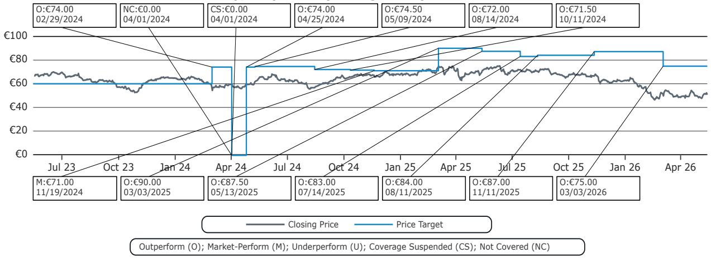

line

| Date       | Closing Price | Price Target |
|------------|---------------|--------------|
| 02/29/2024 | €74.00        | €74.00       |
| 04/01/2024 | €0.00         | €0.00        |
| 04/01/2024 | €0.00         | €0.00        |
| 04/25/2024 | €74.00        | €74.50       |
| 05/09/2024 | €74.50        | €74.50       |
| 08/14/2024 | €72.00        | €71.50       |
| 10/11/2024 | €71.50        | €71.50       |
| 11/19/2024 | €71.00        | €71.00       |
| 03/03/2025 | €90.00        | €87.50       |
| 05/13/2025 | €87.50        | €83.00       |
| 07/14/2025 | €83.00        | €84.00       |
| 08/11/2025 | €84.00        | €87.00       |
| 11/11/2025 | €87.00        | €75.00       |
| 03/03/2026 | €75.00        | €75.00       |

Sabre Corp (SABR) Rating History for Bernstein as of 05/13/2026   
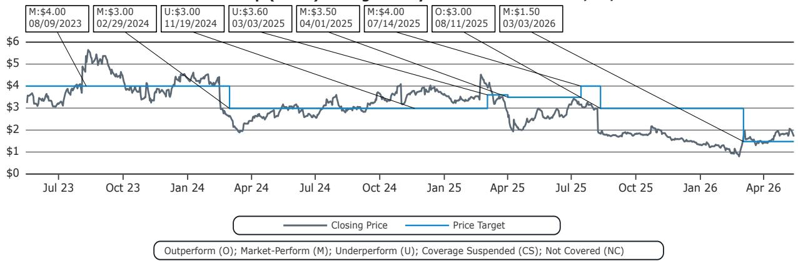

line

| Date       | Closing Price | Price Target |
| ---------- | ------------- | ------------ |
| 08/09/2023 | $4.00         | $4.00        |
| 02/29/2024 | $3.00         | $3.00        |
| 11/19/2024 | $3.00         | $3.00        |
| 03/03/2025 | $3.60         | $3.60        |
| 04/01/2025 | $3.50         | $3.50        |
| 07/14/2025 | $4.00         | $4.00        |
| 08/11/2025 | $3.00         | $3.00        |
| 03/03/2026 | $1.50         | $1.50        |

All price target and closing price data in the chart(s) above are denominated in the currency noted in the Ticker Table of this report.

# CONFLICTS OF INTEREST

SG and/or its affiliates acted as Global Coordinator to Amadeus' new bond issue (EUR, RegS, 5y)

Bernstein and/or affiliates have received compensation for non-investment banking securities-related products or services in the previous twelve months from the following clients: Amadeus IT Group, SA.

Bernstein and/or affiliates expect to receive or intend to seek compensation for investment banking services in the next three months from Amadeus IT Group, SA.

Bernstein and/or affiliates had an investment banking client relationship during the past twelve months with Amadeus IT Group, SA.

Certain affiliates of Bernstein act as market maker or liquidity provider in the equities securities of: Amadeus IT Group, SA and Sabre Corp.

# OTHER MATTERS

The legal entity(ies) employing the analyst(s) listed in this report, and their location, can be determined by the country code of their phone number, as follows:

+1 Bernstein Institutional Services LLC; New York, New York, USA

+44 Bernstein Autonomous LLP; London UK

+212 SG Africa Technologies & Services; Casablanca, Morocco

+33 BSG France S.A.; Paris, France

+34 BSG France S.A.; Madrid, Spain

+41 Bernstein Autonomous LLP; Geneva, Switzerland

+49 BSG France S.A.; Frankfurt, Germany

+91 Bernstein (India) Private Limited; Mumbai, India

+852 Bernstein (Hong Kong) Limited 盛博香港有限公司; Hong Kong, China

+65 Bernstein (Singapore) Private Limited; Singapore

+81 Bernstein Japan KK; Tokyo, Japan

Where this report has been prepared by research analyst(s) employed by a non-US affiliate, such analyst(s), is/are (unless otherwise expressly noted below) not registered as associated persons of Bernstein Institutional Services LLC or any other SEC-registered broker-dealer and are not licensed or qualified as research analysts with FINRA. Accordingly, such analyst(s) may not be subject to FINRA's restrictions regarding (among other things) communications by research analysts with a subject company, interactions between research analysts and investment banking personnel, participation by research analysts in solicitation and marketing activities relating to investment banking transactions, public appearances by research analysts, and trading securities held by a research analyst account.

Where this report has been prepared by research analyst(s) employed by SG Africa Technologies & Services (part of the SG group of companies), it has been prepared on behalf of a Bernstein company under a Global Services Agreement in place between Bernstein and SG.

# CERTIFICATION

Each research analyst listed in this report, who is primarily responsible for the preparation of the content of this report, certifies that all of the views expressed in this publication accurately reflect that analyst's personal views about any and all of the subject securities or issuers and that no part of that analyst's compensation was, is, or will be, directly or indirectly, related to the specific recommendations or views in this publication.

# II. ADDITIONAL GLOBAL CONFLICT DISCLOSURES

It is at the sole discretion of the Firm as to when to initiate, update and cease research coverage. The Firm has established, maintains and relies on information barriers to control the flow of information contained in one or more areas (i.e., the private side) within the Firm, and into other areas, units, groups or affiliates (i.e., public side) of the Firm.

# III. OTHER IMPORTANT INFORMATION AND DISCLOSURES

Separate branding is maintained for “Bernstein” and “Autonomous” research products.

\- Bernstein produces a number of different types of research products including, among others, fundamental analysis and quantitative analysis under both the “Autonomous” and “Bernstein” brands. Recommendations contained within one type of research product may differ from recommendations contained within other types of research products, whether as a result of differing time horizons, methodologies or otherwise. Furthermore, views or recommendations within a research product issued under one brand may differ from views or recommendations under the same type of research product issued under the other brand. The Research Ratings System for the two brands and other information related to those Rating Systems are included in the previous section.

\- Autonomous operates as a separate business unit within the following entities: Bernstein Institutional Services LLC, Bernstein Autonomous LLP, Bernstein (Hong Kong) Limited 盛博香港有限公司 and Bernstein (India) Private Limited. For information relating to “Autonomous” branded products (including certain Sales materials) please visit: www.autonomous.com. For information relating to Bernstein branded products please visit: www.Bernsteinresearch.com.

Analysts are compensated based on aggregate contributions to the research franchise as measured by account penetration, productivity and proactivity of investment ideas. No analysts are compensated based on performance in, or contributions to, generating investment banking revenues.

This report has been produced by an independent analyst as defined in Article 3 (1)(34)(i) of EU 596/2014 Market Abuse Regulation (“MAR”) and the same article of MAR as it forms part of United Kingdom domestic law by virtue of the European Union (Withdrawal) Act 2018.

To our readers in the United States: Bernstein Institutional Services LLC, a broker-dealer registered with the U.S. Securities and Exchange Commission (“SEC”) and a member of the U.S. Financial Industry Regulatory Authority, Inc. (“FINRA”) is distributing this publication in the United States and accepts responsibility for its contents. Where this material contains an analysis of debt product(s), such material is intended only for institutional investors and is not subject to the US independence and disclosure standards applicable to debt research prepared for retail investors.

Bernstein Institutional Services LLC may act as principal for its own account or as agent for another person (including an affiliate) in sales or purchases of any security which is a subject of this report. This report does not purport to meet the objectives or needs of any specific individuals, entities or accounts.

To our readers in Canada: If this publication pertains to a Canadian domiciled company, it is being distributed in Canada by Bernstein (Canada) Limited, which is licensed and regulated by the Canadian Investment Regulatory Organization. If the publication pertains to a non-Canadian domiciled company, it is being distributed by Bernstein Institutional Services LLC, which is licensed and regulated by both the SEC and FINRA, into Canada under the International Dealers Exemption.

This document may not be passed onto any person in Canada unless that person qualifies as "permitted client" as defined in Section 1.1 of NI 31-103.

To our readers in Brazil: This report has been prepared by Bernstein Institutional Services LLC, and Banco BTG Pactual S.A. ("BTG") is responsible for the distribution of this report in Brazil.

To readers in the United Kingdom: This publication has been issued or approved for issue in the United Kingdom by Bernstein Autonomous LLP, authorised and regulated by the Financial Conduct Authority and located at 60 London Wall, London EC2M 5SH, +44 (0)20-7170-5000. Registered in England & Wales No OC343985.

This document is for distribution only to persons who (i) have professional experience in matters relating to investments falling within Article 19(5) of the Financial Services and Markets Act 2000 (Financial Promotion) Order 2005 (as amended, the “Financial Promotion Order”), (ii) are persons falling within Article 49(2)(a) to (d) (“high net worth companies, unincorporated associations, etc.”) of the Financial Promotion Order, (iii) are outside the United Kingdom, or (iv) are persons to whom an invitation or inducement to engage in investment activity (within the meaning of section 21 of the FSMA) in connection with the issue or sale of any securities may otherwise lawfully be communicated or caused to be communicated (all such persons together being referred to as “relevant persons”). This document is directed only at relevant persons and must not be acted on or relied on by persons who are not relevant persons. Any investment or investment activity to which this document relates is available only to relevant persons and will be engaged in only with relevant persons.

To our readers in the member states of the EEA: This publication is being distributed by BSG France SA, which is authorised and regulated by the Autorité de Contrôle Prudentiel et de Résolution (ACPR) and Autorité des Marchés Financiers (AMF).

To our readers in Hong Kong: This publication is being distributed in Hong Kong by Bernstein (Hong Kong) Limited 盛博香港有限公司, which is licensed and regulated by the Hong Kong Securities and Futures Commission (Central Entity No. AXC846) to carry out Type 4 (Advising on Securities) regulated activities and subject to the licensing conditions mentioned in the SFC Public Register (https://www.sfc.hk/publicregWeb/corp/AXC846/details)). This publication is solely for professional investors, as defined in the Securities and Futures Ordinance (Cap. 571). The purpose of this report is solely to provide an analysis of the issuers referred to in this report and is not intended for any purpose contrary to the laws of Hong Kong.

To our readers in Singapore: This publication is being distributed in Singapore by Bernstein (Singapore) Private Limited, only to accredited investors or institutional investors, as defined in the Securities and Futures Act 2001 of Singapore ("SFA"). Recipients in Singapore should contact Bernstein (Singapore) Private Limited in respect of matters arising from, or in connection with, this publication. Bernstein (Singapore) Private Limited is regulated by the Monetary Authority of Singapore and licensed under the SFA as a capital markets services licence holder for dealing in capital markets products that are securities and collective investment schemes and an exempt financial adviser for advising on, issuing and promulgating analyses and reports on securities. Bernstein (Singapore) Private Limited is registered in Singapore with Company Registration No. 20213710W and located at One Raffles Quay, #27-11 South Tower, Singapore 048583, +65-6230-4612.

To our readers in the People's Republic of China: The securities referred to in this document are not being offered or sold and may not be offered or sold, directly or indirectly, in the People's Republic of China (for such purposes, not including the Hong Kong and Macau Special Administrative Regions or Taiwan, the “PRC”) in contravention of any applicable laws of the PRC.

This document does not constitute an offer to sell or the solicitation of an offer to buy any securities in the PRC to any person to whom it is unlawful to make the offer or solicitation in the PRC.

We do not represent that this document may be lawfully distributed, or that any securities may be lawfully offered, in compliance with any applicable registration or other requirements in the PRC, or pursuant to an exemption available thereunder, or assume any responsibility for facilitating any such distribution or offering. In particular, no action has been taken by us which would permit a public offering of any securities or distribution of this document in the PRC. Accordingly, the securities are not being offered or sold within the PRC by means of this document or any other document. Neither this document nor any advertisement or other offering material may be distributed or published in the PRC, except under circumstances that will result in compliance with any applicable laws and regulations.

To our readers in Japan: This publication is being distributed in Japan by Bernstein Japan KK (サンフォード・C・バーンスタイン株式会社), which is registered in Japan as a Financial Instruments Business Operator with the Kanto Local Finance Bureau (registration number: The Director-General of Kanto Local Finance Bureau (FIBO) No.3387) and regulated by the Financial Services Agency. It is also a member of Japan Investment Advisers Association. This publication is solely for qualified institutional investors in Japan only, as defined in Article 2, paragraph (3), items (i) of the Financial Instruments and Exchange Act.

For the institutional client readers in Japan who have been granted access to the Bernstein website by Daiwa Group Inc. ("Daiwa"), your access to this document should not be construed as meaning that Bernstein is providing you with investment advice for any purposes. Whilst Bernstein has prepared this document, your relationship is, and will remain with, Daiwa, and Bernstein has neither any contractual relationship with you nor any obligations towards you.

To our readers in Australia: Bernstein (Hong Kong) Limited 盛博香港有限公司 is responsible for distributing research in Australia. It is regulated by the Securities and Exchange Commission under U.S. laws, by the Financial Conduct Authority under U.K. laws, which differs from Australian laws. Bernstein (Hong Kong) Limited 盛博香港有限公司 is exempt from the requirement to hold an Australian financial services license under the Corporations Act 2001 in respect of the provision of the following financial services to wholesale clients:

• providing financial product advice;   
• dealing in a financial product;   
• making a market for a financial product; and   
• providing a custodial or depository service.

To our readers in India: This publication is being distributed in India by Bernstein (India) Private Limited (SCB India) which is licensed and regulated by Securities and Exchange Board of India ("SEBI") as a research analyst entity under the SEBI (Research Analyst) Regulations, 2014, having registration no. INH000006378 and as a stock broker having registration no. INZ000213537. SCB India is currently engaged in the business of providing research and stock broking services. Please refer to www.Bernsteinresearch.in for more information.

- SCB India is a Private limited company incorporated under the Companies Act, 2013, on April 12, 2017 bearing corporate identification number U65999MH2017FTC293762, and registered office at Level 3A, 4th Floor, First International Financial Centre, Plot Nos C-54 and C-55, G Block, Near CBI Office, Bandra Kurla Complex, Bandra (East), Mumbai 400098, Maharashtra, India (Phone No: +91-22-68421401).   
- For details of Associates (i.e., affiliates/group companies) of SCB India, kindly email MUM-Bernstein-InCompliance@Bernsteinsg.com.   
• SCB India does not have any disciplinary history as on the date of this report.   
- Except as noted above, SCB India and/or its Associates (i.e., affiliates/group companies), the Research Analysts authoring this report, and their relatives

• do not have any financial interest in the subject company   
• do not have actual/beneficial ownership of one percent or more in securities of the subject company;   
- is not engaged in any investment banking activities for Indian companies, as such;   
• have not managed or co-managed a public offering in the past twelve months for any Indian companies;   
- have not received any compensation for investment banking services or merchant banking services from the subject company in the past 12 months;   
• have not received compensation for brokerage services from the subject company in the past twelve months;   
- have not received any compensation or other benefits from the subject company or third party related to the specific recommendations or views in this report; and   
- do not currently, but may in the future, act as a market maker in the financial instruments of the companies covered in the report.   
• do not have any conflict of interest in the subject company as of the date of this report.

- Except as noted above, the subject company has not been a client of SCB India during twelve months preceding the date of distribution of this research report. Neither SCB India nor its Associates (i.e., affiliates/group companies) have received compensation for products or services other than investment banking, merchant banking or brokerage services from the subject company in the past twelve months.   
- The principal research analyst(s) who prepared this report, members of the analysts' team, and members of their households are not an officer, director, employee or advisory board member of the companies covered in the report.   
- Our Compliance officer / Grievance officer is Ms. Rupal Talati, who can be reached at +91-22-68421451, or MUM-Bernstein-InCompliance@Bernsteinsg.com / Scbin-investorgrievance@Bernsteinsg.com   
- The Research investor charter and Terms & Conditions of SCB India are available on its website and may be accessed at Bernstein (India) Private Limited (https://Bernsteinresearch.in/) for your reference.   
- Disclaimer: Registration granted by SEBI, and certification from NISM, is in no way a guarantee of performance of the intermediary or provide any assurance of returns to investors. Investments in securities market are subject to market risks. Read all the related documents carefully before investing.

To our readers in Switzerland: This document is provided in Switzerland by or through Bernstein Autonomous LLP, and is provided only to qualified investors as defined in article 10 of the Swiss Collective Investment Scheme Act (“CISA”) and related provisions of the Collective Investment Scheme Ordinance and in strict compliance with applicable Swiss law and regulations. The products mentioned in this document may not be suitable for all types of investors. This document is based on the Directives on the Independence of Financial Research issued by the Swiss Bankers Association (SBA) in January 2008.

To our readers in the Middle East: Bernstein Autonomous LLP, DIFC branch has its principal office at Gate Village 06, DIFC, Dubai, UAE. Bernstein Autonomous LLP, DIFC branch is regulated by the Dubai Financial Services Authority (DFSA) with the registration number CL10040 and is provisioned for Arranging Deals in Investments and Advising on Financial Products. All communications and services are directed at Professional Clients and Market Counterparties only (as defined in the DFSA rulebook). Persons other than Professional Clients and Market Counterparties, such as Retail Clients, are not the intended recipients of our communications or services.

# LEGAL

All research publications are disseminated to our clients through posting on the firm's password protected websites, Bernsteinresearch.com and autonomous.com. Certain, but not all, research publications are also made available to clients through third-party vendors or redistributed to clients through alternate electronic means as a convenience.

This publication has been published and distributed in accordance with the Firm's policy for management of conflicts of interest in investment research, a copy of which is available from Bernstein Institutional Services LLC, Director of Compliance, 245 Park

Avenue, New York, NY 10167. Additional disclosures and information regarding Bernstein's business are available on our website www.Bernsteinresearch.com.

The securities described herein may not be eligible for sale in all jurisdictions or to certain categories of investors where that permission profile is not consistent with the licenses held by the entities noted herein. This document is for distribution only as may be permitted by law. This publication is not directed to, or intended for distribution to or use by, any person or entity who is a Citizen or resident of, or located in any locality, state, country or other jurisdiction where such distribution, publication, availability or use would be contrary to law or regulation or which would subject any of the entities referenced herein or any of their sUBSidiaries or affiliates to any registration or licensing requirement within such jurisdiction. This publication is based upon public sources we believe to be reliable, but no representation is made by us that the publication is accurate or complete. We do not undertake to advise you of any change in the reported information or in the opinions herein. This publication was prepared and issued by entity referred to herein for distribution to eligible counterparties or professional clients. This publication is not an offer to buy or sell any security, and it does not constitute investment, legal or tax advice. The investments referred to herein may not be suitable for you. Investors must make their own investment decisions in consultation with their professional advisors in light of their specific circumstances. The value of investments may fluctuate, and investments that are denominated in foreign currencies may fluctuate in value as a result of exposure to exchange rate movements. Information about past performance of an investment is not necessarily a guide to, indicator of, or assurance of, future performance.

This report is directed to and intended only for our clients who are “eligible counterparties”, “professional clients”, “institutional investors” and/or “professional investors” as defined by the aforementioned regulators, and must not be redistributed to retail clients as defined by the aforementioned regulators. Retail clients who receive this report should note that the services of the entities noted herein are not available to them and should not rely on the material herein to make an investment decision. The result of such act will not hold the entities noted herein liable for any loss thus incurred as the entities noted herein are not registered/authorised/licensed to deal with retail clients and will not enter into any contractual agreement/arrangement with retail clients. This report is provided subject to the terms and conditions of any agreement that the clients may have entered into with the entities noted herein. All research reports are disseminated on a simultaneous basis to eligible clients through electronic publication to our client portal.

The information in this report was prepared by Bernstein solely for the internal business use of our clients. Clients may store, display, analyze, reformat and print the information in this report for this limited use only. Clients may not copy, alter, create derivative works, resell, reverse engineer, commercially exploit, share or distribute any part of the information contained herein for any purpose without Bernstein's express written consent. These restrictions include extracting data or using the content to develop indices or other products. Further, you may not use this report, or any portion of this report, to train or finetune any third-party machine learning or artificial intelligence system, or as a prompt or input into any such system. You also may not, without Bernstein's express written consent, do any of the foregoing in connection with your own internal machine learning or artificial intelligence system.

Bernstein may use artificial intelligence tools in the preparation of its materials. Any such materials are reviewed by Bernstein's research analysts prior to publication.

This report has been prepared for information purposes only and is based on current public information that we consider reliable, but the entities noted herein do not warrant or represent (express or implied) as to the sources of information or data contained herein are accurate, complete, not misleading or as to its fitness for the purpose intended even though the entities noted herein rely on reputable or trustworthy data providers, it should not be relied upon as such. Opinions expressed are the author(s)' current opinions as of the date appearing on the material only and we do not undertake to advise you of any change in the reported information or in the opinions herein.

This publication was prepared and issued by the entity referred to herein for distribution to eligible counterparties or professional clients. The information in this report is intended for general circulation and does not constitute an offer to buy or sell any security, investment, legal or tax advice nor a personal recommendation, as defined by any of the aforementioned regulators. It does not take into account the particular investment objectives, financial situations, or needs of individual investors. The report has not been reviewed by any of the aforementioned regulators and does not represent any official recommendation from the aforementioned regulators. The investments referred to herein may not be suitable for you. Investors must make their own investment decisions in consultation with advice sought from a financial adviser regarding the suitability of the investment product, taking into account the specific investment objectives, financial situation or particular needs of any recipient of the recommendation, before the recipient makes a commitment to purchase the investment product.

The analysis contained herein is based on numerous assumptions. Different assumptions could result in materially different results. The information in this report does not constitute, or form part of, any offer to sell or issue, or any offer to purchase or sUBScribe for shares, or to induce engage in any other investment activity. The value of any securities or financial instruments mentioned in this report may fluctuate subject to market conditions. Information about past performance of an investment is not necessarily a guide to, indicative of, or assurance of future performance. Estimates of future performance mentioned by the research analyst in this report are based on assumptions that may not be realized due to unforeseen factors like market volatility/fluctuation. In relation to securities or financial instruments denominated in a foreign currency other than the clients' home currency, movements in exchange rates will have an effect on the value, either favorable or unfavorable. Before acting on any recommendations in this report, recipients should consider the appropriateness of investing in the subject securities or financial instruments mentioned in this report and, if necessary, seek for independent professional advice.

The securities described herein may not be eligible for sale in all jurisdictions or to certain categories of investors where that permission profile is not consistent with the licenses held by the entities noted herein. This document is for distribution only as may be permitted by law. It is not directed to, or intended for distribution to or use by, any person or entity who is a Citizen or resident of or located in any locality, state, country or other jurisdiction where such distribution, publication, availability or use would be contrary to law or regulation or would subject the entities noted herein to any regulation or licensing requirement within such jurisdiction.

Source: Bloomberg Index Services Limited. BLOOMBERG® is a trademark and service mark of Bloomberg Finance L.P. and its affiliates (collectively “Bloomberg”). Bloomberg or Bloomberg’s licensors own all proprietary rights in the Bloomberg Indices. Neither Bloomberg nor Bloomberg’s licensors approves or endorses this material, or guarantees the accuracy or completeness of any information herein, or makes any warranty, express or implied, as to the results to be obtained therefrom and, to the maximum extent allowed by law, neither shall have any liability or responsibility for injury or damages arising in connection therewith.

No part of this material may be reproduced, distributed or transmitted or otherwise made available without prior consent of the entities noted herein. Copyright Bernstein Institutional Services LLC Bernstein Autonomous LLP, BSG France S.A., Bernstein (Hong Kong) Limited 盛博香港有限公司, Bernstein (Canada) Limited, Bernstein (India) Private Limited (SEBI registration no. INH000006378), Bernstein (Singapore) Private Limited and Bernstein Japan KK (サンフォード・C・バーンスタイン株式会社). All rights reserved. The trademarks and service marks contained herein are the property of their respective owners. Any unauthorized use or disclosure is strictly prohibited. The entities noted herein may pursue legal action if the unauthorized use results in any defamation and/or reputational risk to the entities noted herein and research published under the Bernstein and Autonomous brands.