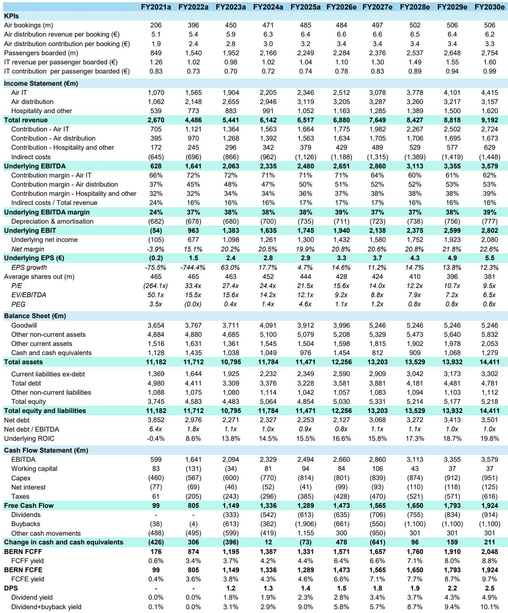
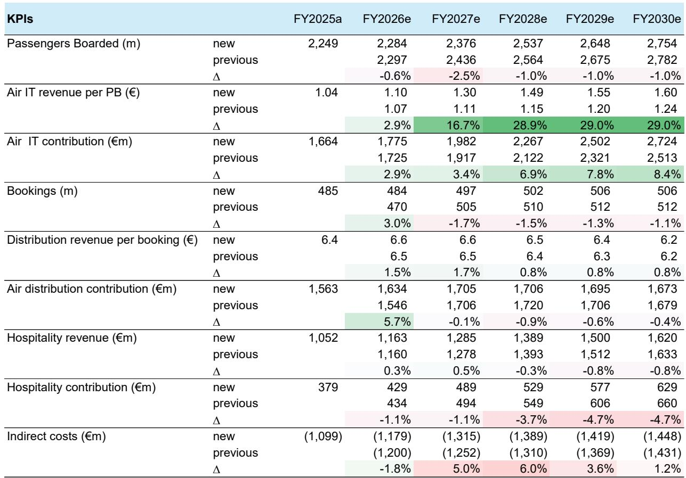

# Air Tech Stocks Face a Volume Trap as Airlines Rethink Capacity — and the Divergence in Interests Is Widening

The most dangerous assumption in air tech investing right now is that airline capacity will recover on its own. After a first quarter that showed surprising resilience, the underlying dynamics have shifted. The conflict in the Middle East and a sustained spike in jet fuel prices — now roughly 70 percent above pre-conflict levels — are forcing airlines into a capacity response that air tech providers cannot simply wait out. The critical insight is this: airlines and air tech companies have fundamentally different revenue drivers, and that divergence is about to create a volume problem that the market has not fully priced in.

Air tech stocks generate their revenue from volumes — bookings and passengers boarded. Airlines, by contrast, rely on a combination of fares and volumes. When fuel costs surge, airlines can raise fares or cut capacity. They are doing both. But for air tech, there is no fare-driven offset. Every seat removed from a schedule is a direct hit to transaction volumes. The first quarter masked this reality because airlines had already locked in much of their summer schedules. The real test begins in the fourth quarter, when winter capacity decisions will be made under conditions of low visibility, high fuel costs, and weakening demand signals.

The report we are drawing on makes a compelling case that the current consensus for roughly 3 percent volume growth this year is optimistic. It identifies a clear risk to winter capacity, particularly on shorter-stage-length routes where contribution margins are thinner. But the implications go deeper. If airlines are forced into deeper cuts than currently anticipated, the air tech providers with the most diversified revenue streams and the strongest balance sheets will be the ones that can absorb the shock and emerge stronger. Those that are over-levered and over-exposed to a single region or business line face a different outcome.

This is not a short-term trading call. It is a structural reassessment of how air tech companies create value in a world where airline capacity is no longer a reliable growth driver. The winners will be those that can decouple their fortunes from airline volume volatility. The losers will be those that cannot.

## Airlines Are Already Cutting Capacity, and the Cuts Are Concentrated in the Regions That Matter Most for Air Tech Volumes

The pattern of capacity reductions is not uniform, and that is where the analytical leverage lies. The Middle East has seen the most dramatic cuts, with Emirates operating at roughly 82 percent of normal capacity, Etihad at 73 percent, and Qatar at just 57 percent. For Amadeus, the Middle East represents a high-single-digit share of both bookings and passengers boarded. That is a direct headwind that cannot be hedged away.

But the indirect effects are spreading. Airlines outside the region are also trimming schedules. United has cut capacity by 5 percent through September. Delta reduced Q2 growth by 3.5 percentage points. Lufthansa, IAG, and Air France-KLM have all announced low-single-digit cuts relative to prior plans. These are not dramatic reductions individually, but they are happening simultaneously across the largest airline groups in the world. The cumulative effect on global seat capacity is material: Q2 schedules are now roughly flat year-on-year, which represents a mid-single-digit decline versus pre-conflict expectations. Q3 looks stronger at plus 3.9 percent, but that number carries significant downside risk.

The question is not whether more cuts will come. It is whether the industry has the discipline to make them voluntarily before the market forces involuntary ones. The typical airline operates on single-digit EBIT margins and spends roughly a quarter of its revenue on fuel. With jet fuel prices doubled, the math is unforgiving. Airlines that have hedged are temporarily protected, but those hedges will roll off. By winter, the exposure to spot prices will be much higher. That is when the real capacity decisions will be made.

## Winter Capacity Is the Hidden Risk That the Consensus Is Underweighting

Summer schedules are largely set. Airlines have already sold around 80 percent of Q2 seats and roughly half of Q3 inventory. The fare environment remains strong on long-haul routes, which is helping to offset some of the cost pressure. But visibility drops sharply for the fourth quarter, where only about 20 to 30 percent of capacity is typically booked at this stage.

Winter is structurally more vulnerable for three reasons. First, seasonal demand is lower, which means contribution margins are thinner. A given percentage cut in capacity has a smaller impact on airline profitability in winter than in summer, making the decision to cut less painful. Second, fuel hedges that are protecting some carriers now will have expired or diminished by then. Third, the macroeconomic backdrop is deteriorating. Consumer confidence is softening in key markets, and business travel — which tends to be more resilient to price increases — is still recovering unevenly.

If airlines cut winter capacity by 5 to 10 percent from current plans, the impact on air tech volumes would be significant. Amadeus and Sabre are both assuming roughly 3 percent volume growth for the full year, with the recovery weighted to the second half. That assumption now looks aggressive. The report we are analyzing notes that the full-year guidance was maintained despite the geopolitical impact, but it also flags downside risk. That is a polite way of saying the guidance is likely too high.

The question for investors is whether the market has already discounted this risk. The share prices of both Amadeus and Sabre have fallen sharply — Amadeus is down nearly 40 percent from its highs, and Sabre is down more than 60 percent. But valuation alone is not a catalyst. The stocks will only re-rate when the market sees a credible path to volume recovery, and that path is not yet visible.

## Amadeus Has Structural Advantages That Make It a Compounder, but the Near-Term Volume Headwind Is Real

Amadeus is the stronger of the two companies by almost every measure. It has a diversified revenue base, with more than 60 percent of EBITDA coming from Air IT and Hospitality, both of which are growing and have higher margins than the traditional GDS business. It has a healthy balance sheet with low leverage. It is returning cash to shareholders through dividends and buybacks. And it is taking share in both distribution and IT, with new contracts from British Airways, Air France-KLM, and Lufthansa Group under its Nevio platform.

The report maintains an Outperform rating on Amadeus with a price target of 75 euros, implying roughly 40 percent upside from current levels. That thesis rests on the company's ability to compound returns in the high teens over the medium term, driven by 10 percent annual net income growth, a 4 percent dividend yield, and a 4 percent buyback. The acquisition of IDEMIA adds further earnings power.

But the near-term volume headwind is real, and it is not fully reflected in the numbers. The report has slightly reduced its 2027 forecasts for Amadeus to account for capacity risk, but the magnitude of the adjustment is modest. If winter capacity cuts are deeper than expected, those forecasts will need to come down further. The question is whether the market will look through a weak 2027 to a stronger 2028 and beyond, or whether it will demand evidence of recovery before re-rating the stock.

The answer depends on how investors view the nature of the current shock. If it is cyclical and temporary, then Amadeus's long-term compounding story remains intact. If it is structural — driven by a permanent shift in fuel costs or geopolitical risk — then the volume growth assumptions that underpin the valuation need to be revisited.

## Sabre Faces a Balance Sheet Trap That Limits Its Strategic Options

Sabre is a different story. The company is far more exposed to the ex-growth GDS market, which accounts for roughly 80 percent of its revenue. Its IT Solutions business is smaller and dependent on a few large customers, with American Airlines alone representing about 35 percent of volumes. Geographically, Sabre is overweight North America, which means it is more directly exposed to the capacity decisions of U.S. carriers.

The more serious issue is leverage. Sabre's net debt-to-EBITDA is expected to remain above 5 times through the end of the decade, even under the report's base case. That is a dangerously high level for a company with cyclical revenue exposure. There is no meaningful near-term refinancing risk — debt maturities are minimal until 2029 — but the lack of deleveraging means Sabre will enter the next airline downturn with a fragile balance sheet.

The report maintains a Market-Perform rating on Sabre with a target price of $1.75, roughly in line with the current price. That is a neutral call, but it carries an implicit warning: absent a significant improvement in earnings, the company is vulnerable. The strong first quarter — Sabre reported its best air booking growth in over two years at plus 6 percent — provides some near-term relief, but it does not change the structural picture.

The critical question for Sabre is whether it can generate enough free cash flow to reduce leverage before the next downturn arrives. The answer, based on the report's analysis, is no. Organic deleveraging is too slow, and the company does not have the balance sheet capacity to pursue accretive M&A or aggressive buybacks. That leaves Sabre in a strategic trap: it needs volume growth to improve earnings, but it cannot afford to invest aggressively in growth because of its debt burden.

## What the Report Does Not Fully Answer: When Does the Capacity Cycle Turn, and Who Bears the Cost of Adjustment?

The report is rigorous on the current state of airline capacity and the risks to winter schedules. But it leaves several important questions unanswered, and those questions are precisely where the most analytical value lies.

First, what is the mechanism that would cause airlines to restore capacity? The report assumes that if fuel prices fall or demand recovers, airlines will add seats back. But that assumption needs scrutiny. Airlines have historically been slow to add capacity after cutting it, partly because of operational constraints and partly because of a newfound discipline around capital allocation. The post-pandemic recovery showed that airlines can be profitable with less capacity. They may not rush to rebuild schedules even if conditions improve.

Second, who bears the cost of the adjustment? The report notes that air tech companies and airlines have divergent interests when it comes to capacity cuts. But it does not fully explore the implications for pricing power. If airlines cut capacity, does that strengthen their negotiating position with GDS providers? Or does it weaken it, because they need distribution partners more than ever to fill the remaining seats? The answer matters for the long-term margin structure of the air tech industry.

Third, what is the role of new technology in mitigating volume risk? The report mentions Nevio and Amadeus's IT product portfolio, but it does not quantify how much of the company's revenue is now tied to non-volume-based business models. If Amadeus can grow its IT and hospitality revenues independently of airline capacity, then the volume risk is less severe than it appears. But if those businesses are still correlated with airline activity, then the diversification is less valuable than it seems.

These are not criticisms of the report. They are the natural next questions that any serious investor should ask. The report provides the data and the framework. The answers depend on how the next six months unfold.

## A Decision Framework for Air Tech Investors: Three Questions to Determine Which Stocks Will Outperform

The report's analysis lends itself to a simple but powerful decision framework. Investors should ask three questions about any air tech holding.

First, how much of the company's revenue is directly tied to airline volume? The answer determines the magnitude of the headwind. For Amadeus, the exposure is significant but declining, as IT and hospitality grow as a share of EBITDA. For Sabre, it is overwhelming. The lower the volume sensitivity, the more resilient the stock.

Second, does the company have the balance sheet to withstand a prolonged volume downturn? The answer determines the risk of permanent capital impairment. Amadeus has low leverage and positive free cash flow. Sabre has high leverage and limited financial flexibility. The stronger the balance sheet, the more likely the company can invest through the cycle and emerge stronger.

Third, does the company have a credible path to re-rating that does not depend on a volume recovery? The answer determines the upside potential. Amadeus has multiple levers: Nevio contract wins, Hospitality growth, share gains in distribution, and potential M&A. Sabre's path is narrower and depends almost entirely on a recovery in North American airline volumes. The more levers a company has, the more likely it is to outperform regardless of the macro environment.

Applying this framework leads to a clear conclusion. Amadeus is the higher-conviction holding, not because it is immune to the volume cycle, but because it has the balance sheet and the business mix to manage through it. Sabre is a show-me story that needs to demonstrate it can generate enough cash to reduce leverage before the next downturn arrives.

## The Full Report Contains the Original Charts and Data That Support This Analysis

The analysis above draws on a detailed research report that includes seat capacity data by region, airline-specific capacity reductions, and historical booking trends. The charts in the full report show the magnitude of the Middle East disruption, the trajectory of airline capacity adjustments, and the divergence between volume assumptions and reality.

The report also contains the complete financial models for both Amadeus and Sabre, including the revised forecasts that incorporate the capacity risk. For investors who want to stress-test their own assumptions, those models are essential.

Join the community to read the full report and review the original charts.

*This article is for learning and discussion only and does not constitute investment advice.*

Personal reading notes and learning share only. Not investment advice.

