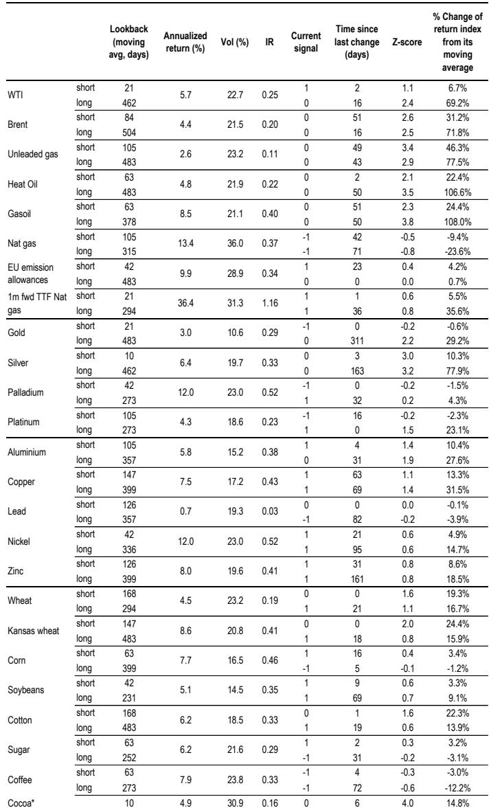

# 市场真正低估的不是IPO抽血，而是4100亿美元被动买入的重新定价

过去几个月，市场围绕三家最大AI公司即将IPO的讨论，几乎都集中在同一个问题上：这些巨无霸上市会不会抽干流动性、压垮现有科技股的估值。

这个担忧并非没有道理。三家公司的合计市值可能达到3.5万亿美元，已经超过多数国家股市的总市值。如果它们同时上市，仅指数纳入和再平衡就会产生巨大的资金需求。但某外资投行最新发布的Flows & Liquidity研报告诉我们，市场的注意力放错了地方。

真正重要的不是IPO本身带来的供给冲击，而是锁定期满后发生的结构性变化：三家AI公司进入指数后，将催生约4100亿美元的被动买入需求。这个数字不是一次性的IPO认购资金，而是指数基金和ETF在纳入和再平衡过程中必须完成的买入。

更重要的是，这4100亿美元的需求如何被满足、谁来卖出、以及指数权重调整对Mag7等现有科技巨头意味着什么，这些问题的答案远比“IPO抽血”这个简单叙事复杂得多。

报告的核心判断是：锁定期满后自由流通股的跳升，更多是指数提供商的机械性重新分类，而非内部人减持的结果。而真正需要关注的，是这4100亿美元被动买入与现有股东减持之间的匹配机制，以及这一过程对指数层面权重结构的重塑。

换句话说，市场正在经历的，不是一次简单的供给冲击，而是一次由被动投资逻辑驱动的、系统性的资产重新定价。

## 1. 锁定期满后自由流通股的跳升，本质是分类问题而非减持问题

许多投资者习惯于将IPO锁定期满后的自由流通股增加，等同于内部人套现压力。但研报通过对2010年以来十只最大IPO的追踪分析，得出了一个反直觉的结论：自由流通股在锁定期满后的跳升，更多是指数提供商的机械性重新分类，而非内部人或大股东的实际卖出。

数据显示，在IPO后的前六个月（锁定期内），自由流通股比例增长非常缓慢。但一旦锁定期满，自由流通股比例会迅速跳升。以这十只IPO的平均数据为例，自由流通股比例从锁定期满前的约50%左右，在短短几十个交易日内跃升至接近80%。

但同期内部人持股比例的变化却温和得多。平均来看，内部人持股在IPO后一年内仅从约7%下降到约5%，而且不同公司之间的差异极大——有些公司的内部人持股几乎没有任何减少。

这背后的机制是：锁定期满后，那些持股比例低于10%的非战略投资者（包括员工和早期小股东）的持股，无论他们是否卖出，都会被指数提供商重新归类为自由流通股。这是一种纯粹的分类调整，而非实际的卖出行为。

更值得关注的是，三家即将上市的AI公司与历史样本存在重要差异。报告指出，这三家公司在上市前已经通过结构性要约收购和二级市场交易，为非战略投资者提供了部分退出机会。这意味着锁定期满后的实际卖出压力可能比历史平均水平更小。

但这里有一个尚未回答的关键问题：这三家公司的资本结构高度不透明，外界对其内部人持股比例、战略投资者构成以及员工持股计划的了解都非常有限。报告提到的自由流通股最终可能落在30%-50%的区间，这个范围本身就反映了巨大的不确定性。

## 2. 4100亿美元被动买入的真实含义：不是一次性冲击，而是持续半年的结构性需求

报告估算，当这三家公司完成上市并进入主要指数后，将产生总计约4100亿美元的被动买入需求。这个数字由两部分构成：首次纳入指数时的约400亿美元，以及锁定期满后自由流通股扩大带来的约3700亿美元。

这个数字的规模需要放在更大的背景下来理解。过去一年，全球股票型基金的平均周度净流入约为80亿美元，峰值接近120亿美元。4100亿美元相当于大约一年的正常流入量——但它的发生时间窗口可能只有几个月。

报告将锁定期满的时间点指向2026年上半年。这意味着在约半年的时间窗口内，被动基金需要完成相当于正常市场一年多的买入量。

但这里的关键问题不是需求有多大，而是谁来满足这个需求。报告提出了两个可能的供给来源：公司自身释放此前回购的股票，以及非战略投资者向被动基金卖出。

这两个来源的性质完全不同。公司释放回购股票是主动的、可控的供给管理行为；而非战略投资者的卖出则是分散的、难以预测的。市场目前对这两类供给的比例没有任何可靠估算，这是一个重大的分析盲点。

更值得思考的是，如果非战略投资者的卖出意愿不足，或者公司释放的回购股票规模有限，被动基金可能不得不通过提高出价来吸引卖方，从而推高新纳入公司的股价——这与市场普遍担心的“IPO抽血”刚好相反。

## 3. 指数权重调整对Mag7的影响，取决于资金流入模式而非机械替代

一个让许多科技股投资者夜不能寐的问题是：三家AI公司纳入指数后，Mag7的权重会被稀释，这是否意味着被动基金必须卖出Mag7来买入新股？

报告的答案是否定的。准确地说，是否定的条件成立。

从指数层面看，新公司的纳入确实会降低Mag7的权重。但被动基金是否真的需要卖出Mag7，取决于一个更根本的变量：被动资金的总流入是否足够快。

过去几年，全球被动股票基金一直保持强劲而稳定的净流入。如果这种趋势持续，那么被动基金完全可以用新增资金中的“超额”部分来买入新纳入的股票，而不必卖出已有的Mag7持仓。换句话说，新公司的纳入吃掉的不是Mag7的存量，而是被动资金增量的一个更大份额。

但这里有一个隐含条件：被动资金流入不能出现显著放缓。如果流入速度下降，或者市场出现系统性赎回，那么权重调整就真的会变成Mag7的卖出压力。

报告没有展开讨论的是，Mag7本身也在发生变化。过去两年，Mag7的盈利增长和估值分化已经非常明显。新AI公司的加入，可能会加速这一分化过程——那些与新公司业务重叠度高的公司，可能面临更大的权重侵蚀和估值压力；而那些业务互补性强的公司，反而可能从整个AI生态系统的扩张中受益。

## 4. 历史经验显示：指数层面的自由流通股比例不会线性变化

报告还提供了一个有意思的历史视角：纳斯达克综合指数和标普500指数的自由流通股比例变化。

从2006年至今，标普500的自由流通股比例一直稳定在94%左右，波动极小。纳斯达克的比例则从89%逐步上升到接近94%，与标普500的差距在不断收窄。

但这个过程并非线性。2020年到2021年，纳斯达克的自由流通股比例曾经显著下降，原因是大量科技IPO和SPAC上市，这些新公司普遍存在创始人、PE和VC持有大量股份的情况。2022年到2024年，随着锁定期满、创始人向机构投资者卖出、以及IPO活动降温，这个比例又回升了。

这个历史模式对当前情况有直接启示：三家AI公司的纳入，可能再次导致纳斯达克自由流通股比例的阶段性下降。因为这些公司上市时的自由流通股比例（约4%）远低于指数平均水平（约94%）。即使锁定期满后上升到30%-50%，仍然显著低于指数中现有公司的水平。

这意味着，在相当长一段时间内，指数层面的自由流通股比例会处于一个“被压低”的状态。这本身不是一个估值信号，但它会影响指数基金的跟踪效率，以及指数提供商对自由流通股的调整节奏。

## 5. 报告尚未完全回答的关键问题：供给侧的微观结构与定价权

尽管报告提供了非常有价值的分析框架，但有几个关键问题仍然没有得到充分回答。

第一个问题是：公司自身回购股票的意愿和能力。报告提到公司可能通过释放此前回购的股票来满足被动需求，但并没有讨论这些公司目前的回购规模、回购成本以及释放回购股票的决策逻辑。对于一家刚刚上市、估值可能已经很高的AI公司来说，管理层是否有意愿在锁定期满后大规模释放回购股票，是一个需要验证的假设。

第二个问题是：非战略投资者的行为模式。报告指出，锁定期满后的自由流通股跳升更多是分类问题而非卖出问题，但这并不意味着非战略投资者不会卖出。事实上，对于三家AI公司的早期员工和天使投资者来说，上市可能是他们多年持有的唯一变现机会。锁定期满后的实际卖出压力，可能比历史样本更大——因为这三家公司的投资者结构中，个人和早期投资机构的占比可能高于典型的科技IPO。

第三个问题是：被动资金流入的可持续性。报告的分析建立在“被动资金持续流入”的假设之上。但这个假设本身正在面临挑战。全球利率环境、经济增长前景以及投资者风险偏好的变化，都可能影响被动资金的流入速度。如果流入放缓，权重调整的机械性卖出压力就会显现。

这些问题不是报告的缺陷，而是这个分析框架内在的边界。它们恰恰是投资者需要持续跟踪和验证的关键变量。

## 6. 对于投资者的观察框架：从“会不会抽血”转向“谁在什么时候卖”

基于报告的分析，投资者可能需要调整自己的观察框架。核心问题不再是“这三家AI公司上市会不会抽走流动性”，而是“在锁定期满后的供给释放过程中，谁在什么价格愿意卖出，以及被动基金如何消化这些卖出”。

具体来说，有四个需要持续跟踪的维度：

第一，锁定期满前的供给信号。公司在上市前是否进行了大规模的回购？是否有结构性要约收购安排？这些信息可以从招股说明书和上市后的披露中获取。

第二，内部人持股的变化节奏。尽管自由流通股的跳升不直接等于内部人减持，但内部人持股的实际变化仍然是判断供给压力的最直接指标。需要关注的是，内部人减持是集中在锁定期满后的短时间内，还是分散在更长的时间周期内。

第三，被动资金流入的趋势。这可能是最重要的宏观变量。如果全球被动股票基金的流入保持强劲，权重调整对Mag7的影响就是可控的；如果流入放缓，就需要警惕结构性卖出压力。

第四，指数提供商的纳入节奏和自由流通股调整时机。报告提到，不同指数提供商的纳入时间表和自由流通股计算方法存在差异。这些技术细节会影响被动需求的释放节奏，从而影响市场的实际供需平衡。

这些问题，以及报告中的原始图表和数据细节，在完整版本中有更深入的拆解。欢迎来知识星球的微信群里继续讨论——我们会围绕这三个关键假设的验证条件、以及不同情景下的投资策略展开更具体的推演。

Personal reading notes and learning share only. Not investment advice.

