# India Industrials and Infrastructure

# India Energy Security - #1 Coal Gasification: The color of energy doesn't matter anymore...

  
Nikhil Nigania

+91 226 842 1414

nikhil.nigania@Bernsteinsg.com

  
Aman Jain

+91 226 842 1486

aman.jain@Bernsteinsg.com

  
Uma Menon

+91 226 842 1490

uma.menon@Bernsteinsg.com

In this report, we dive deeper into one of the 5 key themes we highlighted due to the M.East crisis - Coal Gasification. On paper it looks the easiest answer to solve part of India's big gas import bill, but despite a long history of discussions it has never really taken-off. Now given the push of the war we see high chances of on ground progress with policy support-on supply side (e.g. capital support announced yesterday), and possibly even on demand side (long term off-take agreements, blending requirements).

a) What is coal gasification and learning from global examples: Coal gasification turns solid coal into synthetic gas (syngas - Hydrogen and CO) by subjecting coal to high temperatures and pressures in the presence of steam. This syngas can be used further downstream to make urea, methanol etc. South Africa- Sasol (not covered) built the world's largest coal-to-chemicals complex in 1980 using high-ash coal given oil embargoes on the country. China with a similar resource mix as India has scaled coal gasification from almost nothing to \~340 MTPA through policy support, and today gets \~85% of its ammonia and \~75% of its methanol from coal.

b) Strategic imperative for India: India has \~401 Bn tonne of coal resources (one of the largest globally), and reserves not very far from China- but while China mines \~4.5 BnTPA, India does just 1 BnTPA. India has just \~2 MTPA of coal gasification capacity. Hence, with India's import dependence of 90% for methanol, 100% for ammonia, and 20% for Urea - maximizing coal gasification will drive-a) Energy security, b) Limits Forex outflow, c) Fertilizer sUBSidy of \~ Rs 1 Trn given by govt. stays within the country.

c) Govt. support: In 2020, govt announced a plan to take coal gasification to 100 MTPA. SUBSequently, a) VGF of Rs 85 Bn was announced, b) Regulated coal pricing allocated, c), Guaranteed ROE for specific govt. plants. Yesterday govt. further announced Rs 375 Bn capital sUBSidy - effectively 15% of capex expected to be mobilized towards the target.

d) Commercials & Risks: Considering the announced capex of coal gasification plants in India (+ latest capex support), plant utilization of 80%, and forex at \~ 95 INR/USD, we get a break-even for making Urea via coal gasification at \$11.7/MMBtu of LNG JKM price, vs \~ \$17/MMBTU currently and 3-year avg. LNG price of \$12.6/MMBTU- refer Exhibit 17, Exhibit 19. Key risks: a) The biggest is the absence of a long term off-take agreement - given high upfront capex, b) High Ash Indian Coal- makes it challenging to gasify, on which BHEL(not covered) is working, c) Competition from green NH3, whose economics are getting better with time.

e) Key players (Exhibit 23): The only big operational plant is owned by Jindal Steel & Power and 8 projects worth \~₹880 Bn are underway. Coal India, GAIL and BHEL are involved in most projects as equity holders or as equipment/fuel/ infra providers. NTPC targets to produce 5-10 MTPA of syngas by 2029 and L&T won the downstream construction package for one of the plants. Thermax is in discussion with CIL & MoC, to be made an equipment provider for the planned projects. Please note we cover only L&T and NTPC.

Bernstein TICKER TABLE 

<table><tr><td rowspan="2" colspan="3"></td><td rowspan="2" colspan="2">13 May2026</td><td rowspan="2" colspan="2">TTMRel.</td><td rowspan="2" colspan="4">Reported EPS</td><td rowspan="2" colspan="3">Reported P/E (x)</td></tr><tr></tr><tr><td>Ticker</td><td>Rating</td><td>Cur</td><td>Closing Price</td><td>Price Target</td><td>Perf.</td><td>Cur</td><td>2025A</td><td>2026E</td><td>2027E</td><td>2025A</td><td>2026E</td><td>2027E</td><td></td></tr><tr><td>LT.IN (L&amp;T)</td><td>O</td><td>INR</td><td>3,915.80</td><td>4,637.00</td><td>(32.6)%</td><td>INR</td><td>109.00</td><td>123.00</td><td>155.00</td><td>22.8</td><td>20.1</td><td>16.7</td><td></td></tr><tr><td>NTPC.IN (NTPC Ltd)</td><td>O</td><td>INR</td><td>390.45</td><td>430.00</td><td>(26.9)%</td><td>INR</td><td>24.70</td><td>25.64</td><td>27.02</td><td>15.8</td><td>15.2</td><td>14.5</td><td></td></tr><tr><td>POWF.IN (Power Finance)</td><td>O</td><td>INR</td><td>446.00</td><td>460.00</td><td>(32.2)%</td><td>INR</td><td>69.67</td><td>86.54</td><td>88.18</td><td>6.4</td><td>5.2</td><td>5.1</td><td></td></tr><tr><td>RECL.IN (REC)</td><td>O</td><td>INR</td><td>346.55</td><td>450.00</td><td>(53.2)%</td><td>INR</td><td>60.32</td><td>65.52</td><td>67.62</td><td>5.7</td><td>5.3</td><td>5.1</td><td></td></tr><tr><td>ASIAX</td><td></td><td></td><td>1,965.26</td><td></td><td></td><td></td><td></td><td></td><td></td><td></td><td></td><td></td><td></td></tr></table>

O - Outperform, M - Market-Perform, U - Underperform, NR - Not Rated, CS - Coverage Suspended   
LT.IN valuation is EV/EBITDA (x);   
Source: Bloomberg, Bernstein estimates and analysis.

# INVESTMENT IMPLICATIONS

Within our coverage, we think L&T is the beneficiary of a push for coal gasification on equipment side. Other than L&T, PFC-REC could see a new lending opportunity as it fits with their long term infra lending focus. On asset owners, NTPC's plan to leverage its coal resources for gasification could get accelerated with latest capital support announcement.

# DETAILS

# 1. COAL GASIFICATION & LEARNINGS FROM OTHER MARKETS:

# WHAT IS COAL GASIFICATION?

Gasification is a thermochemical process that subjects solid coal to high temperatures and pressures in the presence of steam and a controlled, limited amount of oxygen. Instead of simply burning the coal, this process breaks it down at a molecular level to produce synthesis gas or “syngas”- a versatile gaseous mixture consisting primarily of carbon monoxide and hydrogen. This syngas acts as a foundational chemical building block that can be directly synthesized into high-value industrial products, including ammonia, urea, methanol or used as a clean reducing agent in steel production.

A single coal feed produces methanol, acetic acid, hydrogen, and power simultaneously. Unlike an LNG terminal locked into natural gas, a gasification complex can pivot between products as commodity economics shift. NITI Aayog's Methanol Economy program— highlights that the syngas producing ammonia can produce methanol for potential petrol blending.

There are majorly 3 types of gasification technologies (or gasifiers):

1. Entrained Flow Gasifier (Used by China)   
2. Fixed Bed Gasifier (Used by South Africa)   
3. Fluidized Bed Gasifier (Most suitable for low-grade & high-ash coal found in India) - BHEL (not covered) is currently developing this indigenously.

EXHIBIT 1: Coal Gasification Process   
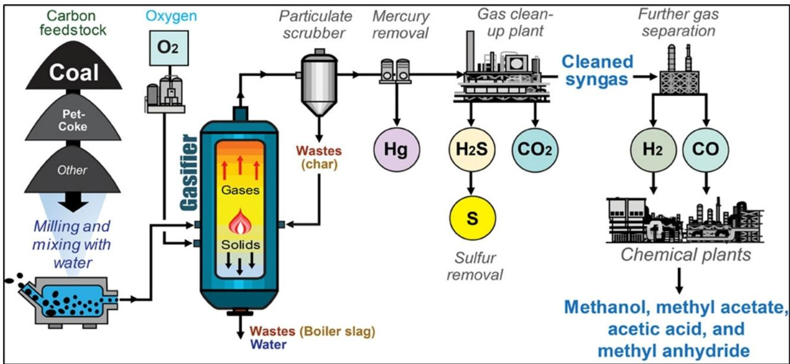

flowchart

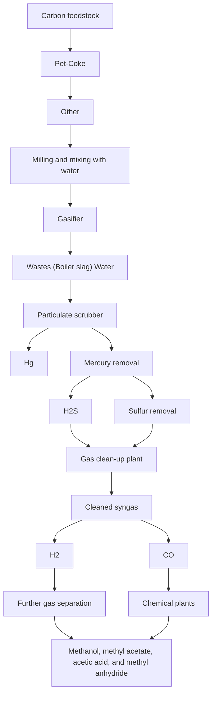

Source: University of Kentucky

EXHIBIT 2: Coal gasification - Downstream use cases   
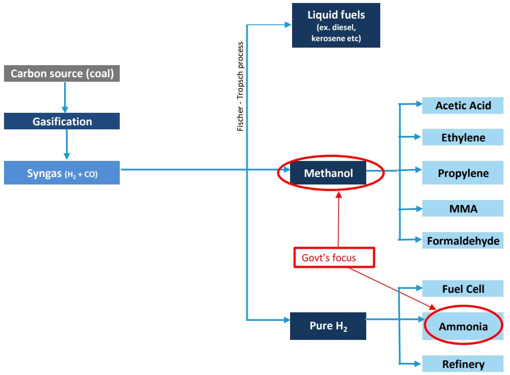

flowchart

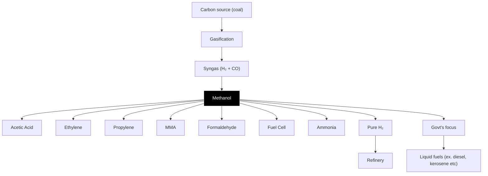

Source: CIL, Bernstein analysis

# SOUTH AFRICA: SASOL – THE ORIGINAL COAL GASIFICATION CASE STUDY

Sasol's first gasification plant was built in the 1950s under apartheid oil sanctions. Sasol aggressively expanded during the '80s, was sustained by state ownership, a Strategic Fuel Fund levy on imported petroleum that sUBSidized domestic synfuels, and govt-guaranteed long-term off-take contracts insulating project economics from price volatility. When built, coal gasification was economically sub-optimal as crude oil was available at \$3–5/barrel. By the 1990s as oil price shot up to \$20–30/barrel, coal gasification became viable. Sasol now licenses its technology globally.

EXHIBIT 3: South Africa's coal consumption history for gasification   
Coal Used For Gasification in SA (in MTPA)   
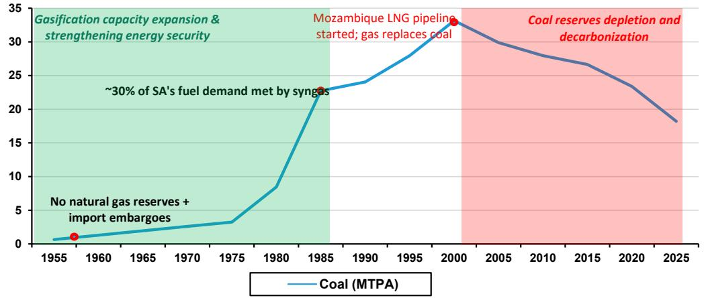

line

| Year | Coal (MTPA) |
|------|-------------|
| 1955 | ~1          |
| 1960 | ~2          |
| 1975 | ~3          |
| 1980 | ~8          |
| 1985 | ~23         |
| 1990 | ~24         |
| 1995 | ~28         |
| 2000 | ~33         |
| 2005 | ~30         |
| 2010 | ~28         |
| 2015 | ~26         |
| 2020 | ~23         |
| 2025 | ~18         |

Source: Sasol reports, Bernstein analysis

South Africa strengthened its energy security by pioneering commercial scale coal gasification. By converting low-grade coal into syngas, the country produces methane-rich gas (MRG) and provides roughly 29% of its locally refined liquid fuel requirements (ex. diesel, kerosene etc.). The coal-to-liquids sUBStitution saves the nation billions in forex annually and actively insulates its industrial economy from the extreme price volatility and supply shocks of global LNG and crude oil markets.

S. Africa has proven the use of high-ash coal, leading the way for India to build on it further (SA 25%, India 35%). JSPL has proven at Angul, Odisha. BHEL's indigenous BCGCL effort follows Sasol's playbook.

EXHIBIT 4: Liquid Fuel Production Mix in South Africa   
South Africa's Liquid Fuel Supply, FY23   
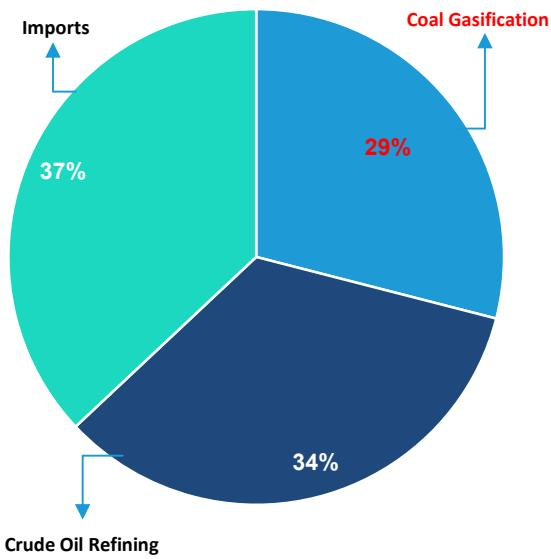

pie

| Category | Percentage (%) |
| :--- | :--- |
| Imports | 37 |
| Coal Gasification | 29 |
| Crude Oil Refining | 34 |

Source: NETL, Sasol reports, Bernstein analysis

# CHINA - REDUCING IMPORT DEPENDENCE

South Africa & China mastered coal gasification with the same playbook: sustained state interventions bridging the gap between high upfront capital costs and long-term import-sUBStitution payoff. China's 2000s-2010s scale-up went further: state-owned enterprises (or SOEs) (Shenhua, Sinopec etc.) deployed coal-to-chemical plants using preferentially-priced captive coal allocations, state-bank debt at well below commercial rates, mandatory grid off-take of coal-derived synthetic natural gas, and tolerance for years of accounting losses absorbed by SOE balance sheets.

Today, about $78 \%$ of China’s urea output comes from coal rather than natural gas. This coal gasification production model gives China access to abundant, domestically sourced energy, reducing exposure to volatile international gas prices and supply disruptions. Due to the Iran war, which has disrupted shipping through the Strait of Hormuz, the urea prices outside China surged by about $70 \%$ . In contrast, China maintained ample stocks, keeping domestic prices roughly a third of international benchmarks, all thanks to its large-scale coal-based production of urea. Today, China is among the largest exporters of fertilizers - shipping more than \$13 billion worth last year.

EXHIBIT 5: China: Coal gasification evolution history (approx. figures)   
Coal feedstock for gasification (MMTPA)   
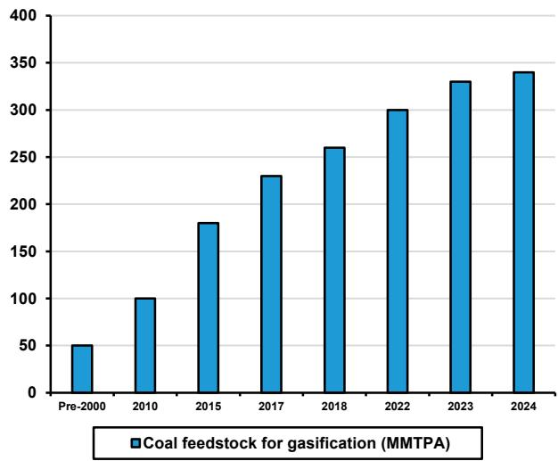

bar

| Year | Coal feedstock for gasification (MMTPA) |
| :--- | :--- |
| Pre-2000 | 50 |
| 2010 | 100 |
| 2015 | 180 |
| 2017 | 230 |
| 2018 | 260 |
| 2022 | 300 |
| 2023 | 330 |
| 2024 | 340 |

Source: CREA, IER, Bernstein analysis

EXHIBIT 6: Split of Methanol Consumption in China, FY24   
Methanol Consumption in China   
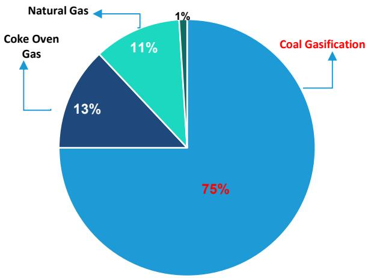

pie

| Category | Percentage (%) |
| :--- | :--- |
| Coal Gasification | 75 |
| Coke Oven Gas | 13 |
| Natural Gas | 11 |
| Coal Gasification | 1 |

Source: US EIA, Bernstein analysis

# 2. COAL GASIFICATION IN INDIA

# WHY DOES INDIA NEED COAL GASIFICATION - THE BIG LNG BILL AND FERTILIZER SUBSIDIES...

The IEA projects India's total LNG import bill to grow at a 26.2% CAGR to ₹2.85 Trillion by FY2028F (Exhibit 8), driven by three forces: (i) absolute volume growth as industrial gas demand expands with GDP, (ii) structural FX depreciation at \~3.3%/yr. Exhibit 7 illustrates the combined impact of LNG price volatility and FX depreciation on India's annual import bill. India's LNG bill in FY2023 hit ₹1.45 Trillion.

EXHIBIT 7: India LNG import bill compounded by commodity price x Forex   
LNG Spot Price & FX Rate History   
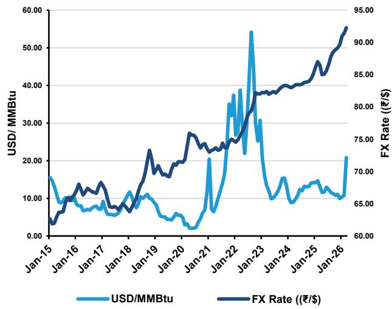

line

| Date   | USD/MMBtu | FX Rate (₹/$) |
|--------|-----------|---------------|
| Jan-15 | ~15.00    | ~65.00        |
| Jan-16 | ~8.00     | ~70.00        |
| Jan-17 | ~7.00     | ~75.00        |
| Jan-18 | ~10.00    | ~80.00        |
| Jan-19 | ~12.00    | ~85.00        |
| Jan-20 | ~5.00     | ~90.00        |
| Jan-21 | ~20.00    | ~95.00        |
| Jan-22 | ~35.00    | ~95.00        |
| Jan-23 | ~55.00    | ~95.00        |
| Jan-24 | ~15.00    | ~95.00        |
| Jan-25 | ~12.00    | ~95.00        |
| Jan-26 | ~20.00    | ~95.00        |

Source: Platts JKM, RBI, Bernstein Analysis

EXHIBIT 8: IEA forecasts this import bill to continue to rise sharply   
LNG Import Bill & Volume   
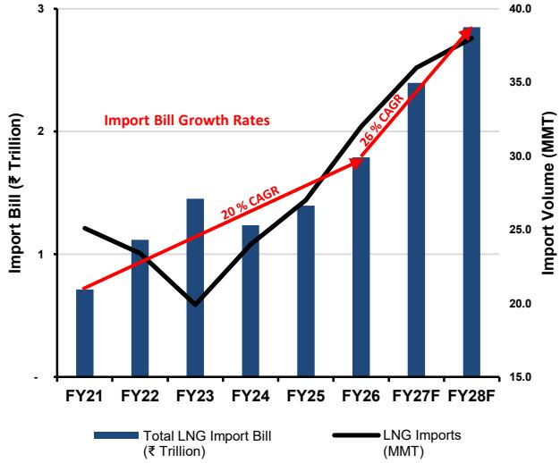

bar_line

| Fiscal Year | Total LNG Import Bill (₹ Trillion) | LNG Imports (MMT) |
| :--- | :--- | :--- |
| FY21 | 0.7 | 24.5 |
| FY22 | 1.1 | 23.0 |
| FY23 | 1.45 | 20.0 |
| FY24 | 1.2 | 26.0 |
| FY25 | 1.35 | 28.0 |
| FY26 | 1.8 | 30.0 |
| FY27F | 2.4 | 35.0 |
| FY28F | 2.9 | 38.0 |

Source: PPAC, IEA, Bernstein Analysis

Fertilizer support bill: Exhibit 9 shows India's gas consumption by sector from FY2021–22 through FY2025–26. Fertilizers consume \~40% of India's imported gas every year. It is the government's highest-priority target for coal gasification sUBStitution.

The fertilizer sUBSidy burden (Exhibit 10) for the Indian govt peaked at ₹2.5 trillion in FY2023 — \~6% of the entire net budget — created by the LNG price spike due to the Russia-Ukraine war along with Rupee depreciation in FY23. Coal gasification could convert this open-ended, LNG-contingent liability into a fixed, rupee-denominated cost — independent of global gas prices.

EXHIBIT 9: 40% of gas usage in India is in Fertilizer industry   
Gas Consumption Sectors FY26 (in MMSCM)   
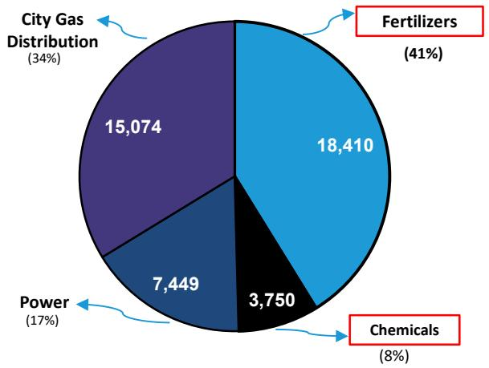

pie

| Category | Value | Percentage (%) |
|---|---|---|
| Fertilizers | 18,410 | 41 |
| Chemicals | 3,750 | 8 |
| Power | 7,449 | 17 |
| City Gas Distribution | 15,074 | 34 |

Source: Niti Aayog, Bernstein Analysis

EXHIBIT 10: There is a big fertilizer sUBSidy burden on the govt. which is primarily supporting LNG / Ammonia imports   
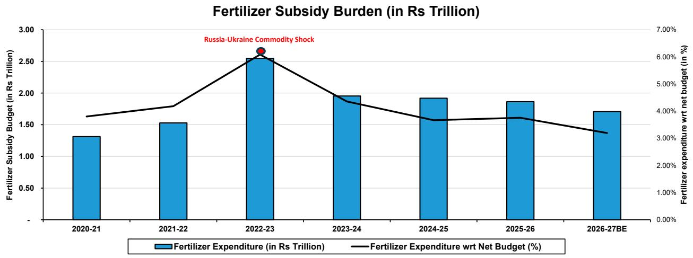

bar_line

Fertilizer SUBSidy Burden (in Rs Trillion)
| Period | Fertilizer Expenditure (in Rs Trillion) | Fertilizer Expenditure wrt Net Budget (%) |
| :--- | :--- | :--- |
| 2020-21 | 1.3 | 3.8 |
| 2021-22 | 1.55 | 4.0 |
| 2022-23 | 2.55 | 6.0 |
| 2023-24 | 1.95 | 4.5 |
| 2024-25 | 1.92 | 3.7 |
| 2025-26 | 1.88 | 3.7 |
| 2026-27BE | 1.72 | 3.3 |
Russia-Ukraine Commodity Shock

Source: India Budget report, Sansad report, PIB, Bernstein analysis

China despite having low oil-gas reserves has successfully reduced import dependence for Methanol and fertilizers with support of coal gasification. India, with a similar resource mix, has not capitalized on its potential yet.

EXHIBIT 11: China has managed to reduce this import dependency with coal gasification, now India needs to step up   
India-China Import Dependency (in %) Comparison, FY26   
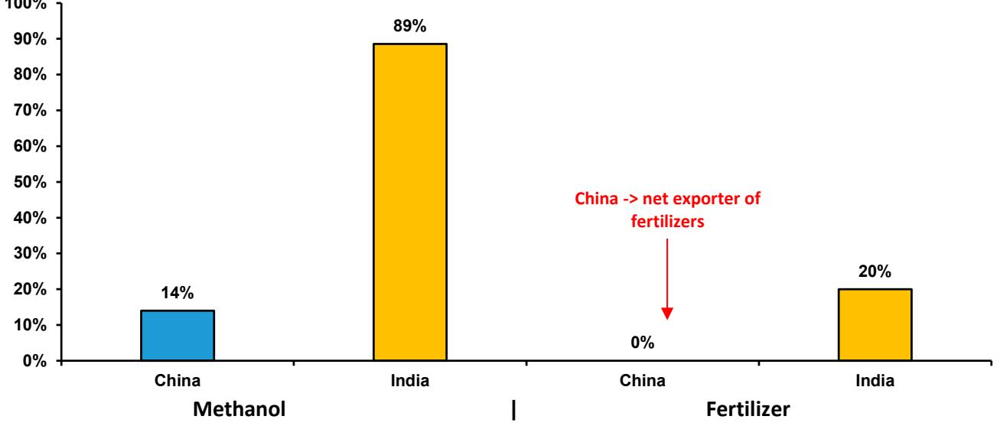

bar

| Category | Country | Percentage (%) |
| :--- | :--- | :--- |
| Methanol | China | 14 |
| Methanol | India | 89 |
| Fertilizer | China | 0 |
| Fertilizer | India | 20 |
China -> net exporter of fertilizers

Source: Ministry of Chemicals & Fertilizers, Bernstein analysis

# UNTAPPED COAL RESOURCES

India's structural gap between its coal reserves & utilization: India has 400 billion tonnes of coal reserves — the fifth-largest in the world — yet currently has coal gasification capacity of just \~ 2.4 million tonnes per year, almost entirely at JSPL's Angul plant.

EXHIBIT 12: India share of global natural resources - Needs to make the most of its large reserves   
Natural resources reserves in India (as % of global reserves)   
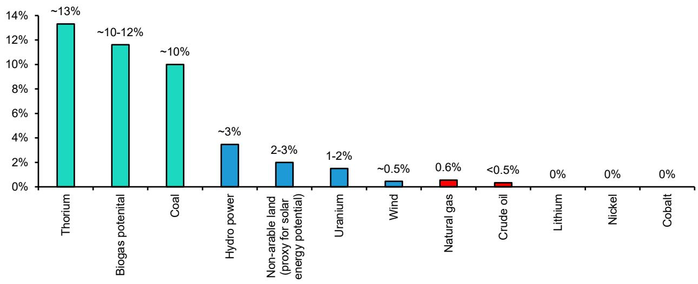

bar

| Category | Value (%) |
|---|---|
| Thorium | ~13 |
| Biogas potential | ~10-12 |
| Coal | ~10 |
| Hydro power | ~3 |
| Non-arable land (proxy for solar energy potential) | 2-3 |
| Uranium | 1-2 |
| Wind | ~0.5 |
| Natural gas | 0.6 |
| Crude oil | <0.5 |
| Lithium | 0 |
| Nickel | 0 |
| Cobalt | 0 |

Source: Govt. data, press articles, Bernstein analysis

EXHIBIT 13: Coal consuming sectors in India   
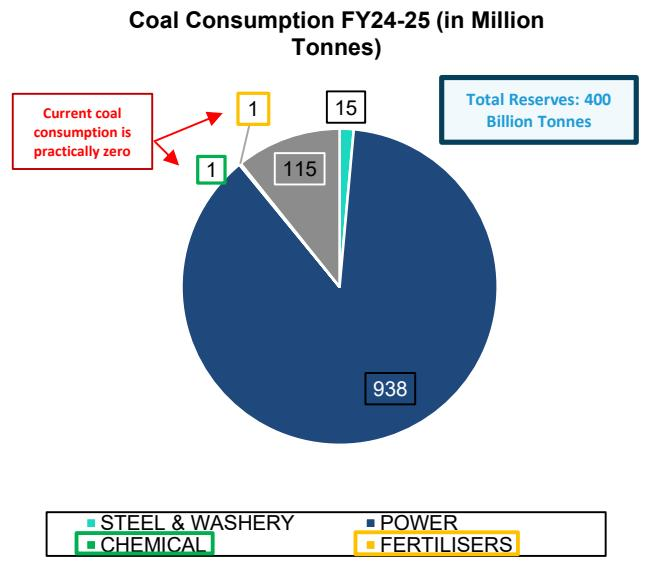

pie

Coal Consumption FY24-25 (in Million Tonnes)
| Category | Value (Million Tonnes) |
|---|---|
| STEEL & WASHERY | 15 |
| CHEMICAL | 1 |
| POWER | 938 |
| FERTILISERS | 1 |
| Current coal consumption is practically zero | 0 |
Total Reserves: 400 Billion Tonnes

EXHIBIT 14: China-SA-India Comparison in Coal Gasification   
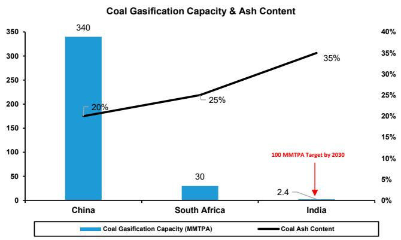

bar_line

Coal Gasification Capacity & Ash Content
| Country | Coal Gasification Capacity (MMTPA) | Coal Ash Content (%) |
| :--- | :--- | :--- |
| China | 340 | 20 |
| South Africa | 30 | 25 |
| India | 2.4 | 35 |
100 MMTPA Target by 2030

Source: CREA, Bernstein analysis   
Source: NITI Aayog, Bernstein analysis

# 3. GOVT. POLICY TAILWINDS & PLANNED GASIFICATION PROJECTS

# THE POLICY ARCHITECTURE

India's coal gasification mission was formalized in 2020 under the Atmanirbhar Bharat reforms, with the Ministry of Coal setting a target of 100 MT of coal to be gasifier annually by 2030. For the next three years, the mission produced ministerial announcements, project MoUs, and revived JV structures (TFL, BCGCL) - but no bankable financial framework, leaving every project sub-economic against imported LNG. That gap closed in 2024, when three critical events arrived within a 12-month window:

- January 2024 — VGF Scheme (₹8,500 Cr): CCEA approved viability gap funding across three categories. Cat I (PSU JVs): ₹1,350 Cr per project (3 approved). Cat II (private): ₹1,000 Cr per project (3 approved). Cat III (demo): ₹100 Cr (1 approved). Directly bridges the CAPEX premium of the coal route vs LNG route.   
- September 2024 — DoF 12% IRR Guarantee: Department of Fertilizers confirmed guaranteed 12% post-tax equity IRR for Talcher Fertilizers Ltd. (TFL) investors for the first 8 years of production. This converts TFL equity into a quasi-sovereign return floor — removing project economics as an investment barrier.   
- December 2024 — ROM Regulated Price for Gasification: Ministry of Coal directed CIL to supply coal to gasification projects at notified regulated price (₹3,000–3,500/MT) vs NRS auction price (₹4,500–5,500/MT). A

EXHIBIT 15: Govt. incentives to promote coal gasification 

<table><tr><td>S. No.</td><td>Date</td><td>Incentive</td><td>Details</td></tr><tr><td>1</td><td>24-Jan-24</td><td>VGF / Capital Grant — Category I (PSUs)</td><td>₹1,350 Cr per project or 15% of capex, whichever is lower; up to 3 PSU projects; total pool ₹4,050 Cr</td></tr><tr><td>2</td><td>24-Jan-24</td><td>VGF / Capital Grant — Category II (PSU + Private)</td><td>₹1,000 Cr per project or 15% of capex, whichever is lower; competitive bidding; pool ₹3,850 Cr</td></tr><tr><td>3</td><td>24 Jan 24</td><td>VGF / Capital Grant — Category III (Demo / Small-Scale)</td><td>₹100 Cr per project or 15% of capex; min capex ₹100 Cr; min syngas output 1,500 Nm $^{3}$ /hr; pool ₹600 Cr</td></tr><tr><td>4</td><td>2022 (reaffirmed 2024)</td><td>Revenue Share Rebate — Gasification Coal</td><td>50% rebate on revenue share in commercial coal block auctions, provided ≥10% of mine&#x27;s production is used for gasification</td></tr><tr><td>5</td><td>Dec-24</td><td>Regulated / Floor Coal Price</td><td>Coal supply to gasification plants at CIL ROM regulated price (₹3,000–3,500/MT); floor price at notified regulated-sector price for projects commissioning within 7 yrs</td></tr><tr><td>6</td><td>Oct-Nov 2025</td><td>UCG-Specific Incentives</td><td>Floor revenue share reduced to 2%; upfront mine auction amount fully waived; 50% rebate on performance security</td></tr><tr><td>7</td><td>24-Jan-24</td><td>CIL Equity Participation (beyond 30% limit)</td><td>Cabinet approved CIL to breach statutory 30% equity ceiling to form JVs with BHEL (Lakhanpur) and GAIL (Sonepur Bazari), de-risking project finance</td></tr><tr><td>8</td><td>Sep-24</td><td>DoF IRR Guarantee (Fertilizer JVs)</td><td>12% post-tax equity IRR guaranteed for 8 years from production date for eligible PSU JV fertilizer gasification projects (e.g. TFL)</td></tr></table>

Source: Ministry of Coal, Bernstein analysis

30–40% feedstock cost reduction that improved total project economics by 6–8 percentage points.

On May 13 $^{th}$ 2026, the govt. approved a ‘Scheme for Promotion of Surface Coal/Lignite Gasification Projects’ with a financial outlay of Rs.37,500 Crore. The Government has also extended coal linkage tenure up to 30 years (initially it was 15yrs), providing long-term policy certainty for investment in coal gasification projects. This long-term certainty de-risks the project cash flows as well as aligns the coal contract duration with the actual useful life of the plant and machinery.

# THE PLANT UNIVERSE – ₹880B IN ANNOUNCED PROJECTS

Exhibit 16 presents the full India gasification plant universe as of April 2026. Nine projects totaling \~₹880B in announced CAPEX, with government financial support confirmed for all VGF-eligible projects. The four PSU-backed mega-projects — TFL, BCGCL, CGIL, CIL-BPCL JV — constitute the investable core at \~₹690Bn combined. JSPL's operating plant at Angul is the only fully commissioned reference.

EXHIBIT 16: Under-construction and planned coal-gasification capacity 

<table><tr><td>Project / Entity</td><td>Players</td><td>Estimated Capex</td><td>Planned Capacity</td><td>Govt Financial Support</td></tr><tr><td colspan="5">Under construction projects</td></tr><tr><td>Jindal Steel &amp; Power (JSPL) Expansion</td><td>Jindal Steel</td><td>~₹38B</td><td>2 MTPA Coal Gasification for DRI (+2.4 MMTPA already operational)</td><td>₹569.05 Cr lump sum grant</td></tr><tr><td>Talcher Fertilizers Limited (TFL)</td><td>GAIL, CIL, RCF, FCIL</td><td>~₹190B</td><td>1.27 MMTPA &#x27;Neem&#x27; Coated Urea</td><td>Guaranteed 12% post-tax equity IRR policy</td></tr><tr><td>Bharat Coal Gasification &amp; Chemicals Ltd (BCGCL)</td><td>CIL, BHEL</td><td>~₹250B</td><td>0.66 MMTPA Ammonium Nitrate</td><td>₹1,350 Cr lump sum grant</td></tr><tr><td>New Era Cleantech Solution (Integrated Complex)</td><td>New Era Cleantech Sol.</td><td>~₹70B</td><td>0.33 MMTPA Ammonium Nitrate &amp; 0.1 MMTPA Hydrogen</td><td>₹1,000 Cr lump sum grant</td></tr><tr><td colspan="5">Planned</td></tr><tr><td>Greta Energy &amp; Metal Pvt Ltd</td><td>Greta Energy</td><td>~₹28B</td><td>0.5 MTPA Direct Reduced Iron (DRI)</td><td>₹414.01 Cr lump sum grant</td></tr><tr><td>Coal Gas India Ltd (CGIL)</td><td>CIL, GAIL</td><td>~₹130B</td><td>0.5 MMTPA Synthetic Natural Gas (SNG)</td><td>₹1,350 Cr lump sum grant</td></tr><tr><td>CIL-BPCL Joint Venture</td><td>CIL, BPCL</td><td>~₹122B</td><td>0.5 MMTPA Synthetic Natural Gas (SNG)</td><td>₹1,350 Cr lump sum grant</td></tr><tr><td>NLC India Limited (Lignite-to-Methanol)</td><td>NLC</td><td>~₹44B</td><td>0.40 MMTPA Methanol</td><td>Seeking PLI scheme inclusion</td></tr></table>

None of them is covered by us   
Source: Ministry of Coal, Bernstein analysis

# 4. COMMERCIALS: 'COAL SYNGAS VS IMPORTED LNG'

# COAL GASIFICATION VS. NATURAL GAS - UREA

We could not find a lot of industry benchmarks for commercials of coal gasification. Hence, we rely on capex data from already announced plants in the country to compare coal gasification to LNG use case.

Coal gasification route to make Urea: We consider the Talcher plant capex (adjusting for some delays) to be the base case for capex, assume plant utilization at 80% (we don't have precedence for this, but given the low variable cost for gasification we assume one would sweat the plant to the maximum extent possible - but the high ash content of Indian coal could be a limitation), and we assume O&M cost at 2.25% of capex. Capex support - we show both the old scenario of just VGF support and new scenario of \~15% capex support.

LNG route to make Urea: For capex we assume Rs 62 Bn for a 1 MTPA Urea plant. For LNG price, we analyze both - 3-year average LNG price of \$12.6/MMBtu and the current spot JKM price of \$17/MMBtu (as of May'26), and consider a forex of 95 Rs/USD.

Exhibit 17 shows the outcome of our analysis - coal and LNG routes are at parity at the 3 year avg LNG price, but coal gasification becomes more economical once if we compare to today's higher LNG price (\$17/MMBtu). Further if we assume the new sUBSidy, coal gasification is cheaper even against the 3 year avg. LNG price. Another important aspect we have to remember is that - the LNG route is heavily dependent on gas price and Forex rates, whereas the coal route is 100% indigenous and predictable - which is a very big strategic advantage. We also show a break-even line at different gas prices in Exhibit 19.

EXHIBIT 17: Urea production cost via LNG vs. Coal Gasification   
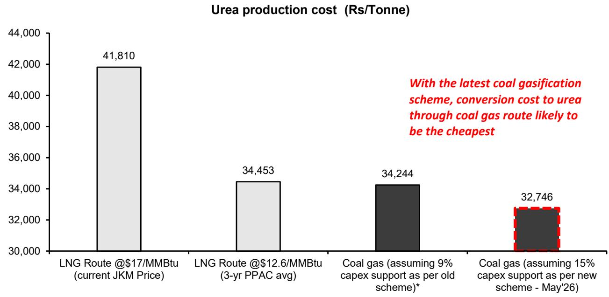

bar

Urea production cost (Rs/Tonne)
| Scenario | Urea production cost (Rs/Tonne) |
| :--- | :--- |
| LNG Route @$17/MMBtu (current JKM Price) | 41,810 |
| LNG Route @$12.6/MMBtu (3-yr PPAC avg) | 34,453 |
| Coal gas (assuming 9% capex support as per old scheme)* | 34,244 |
| Coal gas (assuming 15% capex support as per new scheme - May'26) | 32,746 |
With the latest coal gasification scheme, conversion cost to urea through coal gas route likely to be the cheapest

For old scheme- Assumed 9% capex support as ceiling of Rs.13.50 Bn was hit
Source: Petronac, PPAC, PIB, Bernstein estimates and analysis

EXHIBIT 18: Cost breakdown for Urea production - LNG vs. Coal 

<table><tr><td>Cost Component</td><td>LNG Route ($12.6/MMBtu)</td><td>Coal Gasification Route (Post-VGF Jan&#x27;24)</td><td>Notes</td></tr><tr><td>A. Feedstock</td><td>₹23,100 (68%)</td><td>₹8,500 (24%)</td><td>LNG: 17.6 MMBtu/MT × ₹1,315/MMBtu. Coal syngas: 17.6 MMBtu/MT × ₹484/MMBtu (all-in gate cost)</td></tr><tr><td>B. Annualised CAPEX</td><td>₹8,000 (23%)</td><td>₹21,200 (60%)</td><td>LNG: ₹6,500 Cr plant; Coal: ₹17,000 Cr plant. CRF @ 11% WACC, 20-yr tenor</td></tr><tr><td>C. O&amp;M</td><td>₹1,400 (4%)</td><td>₹3,800 (10%)</td><td>3.5% of CAPEX per annum ÷ 720,000 MT capacity of TFL plant; 80% capacity utilization</td></tr><tr><td>D. Utilities</td><td>₹1,800 (5%)</td><td>₹2,500 (6%)</td><td>Coal route requires Air Separation Unit (~200 MW) vs. simpler SMR for LNG</td></tr><tr><td>E. VGF Benefit</td><td>—</td><td>₹ -1,600</td><td>GoI Viability Gap Funding for eligible PSU JV only; ₹1,350 Cr × CRF ÷ 720,000 MT</td></tr><tr><td>Total Cost (₹/MT NH3)</td><td>₹ 34,300</td><td>₹ 34,400</td><td>(rounded off to the nearest &#x27;000)</td></tr></table>

All numbers are rounded-off to nearest '00s
Source: Ministry of Coal, Bernstein analysis & estimates

EXHIBIT 19: Breakeven for Urea - We see a breakeven at \~\$11.72 /MMBtu of gas, which has become lower than the 3-yr avg price with the recent capex sUBSidy   
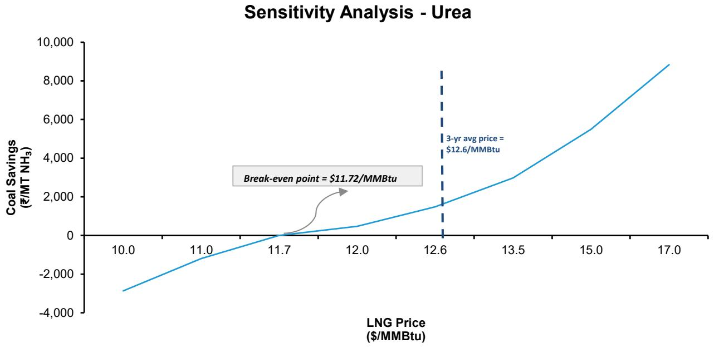

line

| LNG Price ($/MMBtu) | Coal Savings (₹/MT NH₃) |
| ------------------- | ------------------------ |
| 11.72               | $11.72                   |
| 12.6                | $12.6                    |

Source: Bernstein analysis and estimates

# THE COST STRUCTURE BREAKDOWN

Exhibit 20 and Exhibit 21 present the cost component breakdowns for LNG and coal routes respectively. LNG Route cost structure: 68% feedstock — exposed to LNG spot price and FX volatility. The remaining 32% (CAPEX 20%, O&M 6%, utilities 6%) is largely rupee-denominated and fixed. This means 63% of the cost is unpredictable, and structurally depreciating in rupee terms every year.

Coal Route cost structure: 20% feedstock, 59% CAPEX (front-loaded, fixed), 15% O&M, 6% utilities. VGF grant and DoF IRR guarantee exist specifically to address this CAPEX-heavy structure. Every year of rupee depreciation reduces the LNG route's feedstock cost advantage — which is why the economics are converging without any change in the coal route's absolute cost.

EXHIBIT 20: Cost Component Breakdown - LNG   
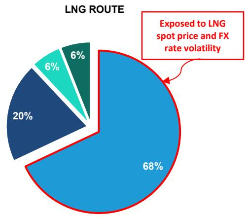

pie

LNG ROUTE
| Category | Value (%) |
|---|---|
| Exposed to LNG spot price and FX rate volatility | 68 |
| Other segments (unlabeled) | 20 |
| Other segments (unlabeled) | 6 |
| Other segments (unlabeled) | 6 |

text_image

A. Feedstock Cost
B. Annualized CAPEX
C. O&M
D. Utilities (power, water, chemicals)

Source: Bernstein analysis & estimates

EXHIBIT 21: Cost Component Breakdown - Coal   
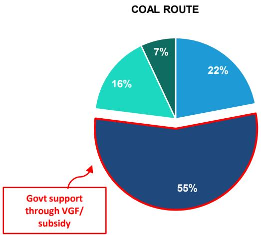

pie

COAL ROUTE
| Category | Percentage (%) |
| :--- | :--- |
| Segment 1 | 22 |
| Segment 2 | 7 |
| Segment 3 | 16 |
| Segment 4 | 55 |
Govt support through VGF/ sUBSidy

text_image

A. Feedstock Cost
B. Annualized CAPEX
C. O&M
D. Utilities (power, water, chemicals)

Source: Bernstein analysis & estimates

Below we have shown the layout of JSPL's Angul gasification plant for reference.

EXHIBIT 22: JSPL's plant in Angul, Odisha   
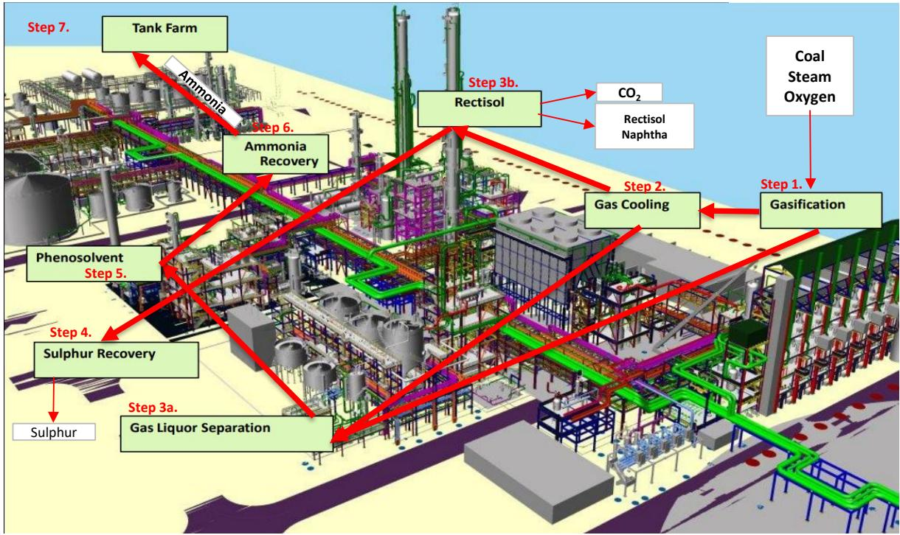

flowchart

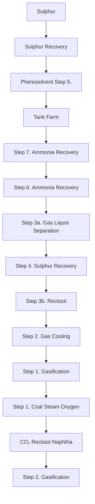

Source: JSPL archives, Bernstein analysis

# KEY RISKS

1. Absence of Long-Term Offtake Agreements Beyond TFL (where DoF is the de facto off-taker through sUBSidy price support), no formal long-term offtake contracts exist for coal gasification output from BCGCL, CGIL, or private projects. SNG from CGIL enters the GAIL grid on a tariff arrangement — but tariff revision risk after the initial period is unquantified. Ammonium nitrate from BCGCL has no guaranteed buyer. Government response in progress: The Ministry of Coal is developing a "Syngas Pricing Policy" that would mandate GAIL to offtake SNG at a formulaic price tied to imported LNG, providing implicit long-term offtake support. For fertiliser projects, DoF's existing Urea New Investment Policy (NIP) provides a production-linked sUBSidy that effectively backstops demand — but NIP coverage for coal gasification units requires explicit extension, currently under review.

2. Return Profile Uncertainty for Private Sector Projects The DoF 12% IRR guarantee applies only to TFL. BCGCL and CGIL have no equivalent government return backstop — their economics depend entirely on product prices (ammonium nitrate and SNG respectively) that are subject to market fluctuation. Government response in progress: The Ministry of Coal's proposed "Coal Gasification Development Fund" (budget allocation sought in FY2027 Union Budget) would provide a price support mechanism analogous to the CERC's pooled tariff for renewable energy — setting a minimum syngas purchase price that guarantees an 11–12% project IRR regardless of LNG market moves.

3. Technology Risk - Handling high ash Indian coal reduces the efficiency of the plant and leads to energy conversion losses as well as an accelerated wear and tear of the gasifiers. Government response in progress: MoC explicitly permits petcoke blending at regulated ROM coal prices. BHEL is indigenously developing fluidized bed gasifiers which will be able to handle high-ash, low-carbon coal. Research institutes like CSIR-CIMFR are also working to optimize high-ash coal utilization by Indian gasification plants.

4. Competition from renewable energy sources - Green ammonia is a cleaner optional with improving commercials, which could limit the share of coal gasification going forward if it becomes more attractive.

# 5. KEY PLAYERS

State owned companies dominate the market: Most of them playing dual roles. i) BHEL is - a) Leading the technology initiative to process Indian coal, b) Is also an equity holder in the BCGCL project. ii) Coal India is a) Fuel supplier, b) Equity shareholder in all 3 JVs - TFL, BCGCL and CGIL. iii) GAIL a) participates through TFL and CGIL equity, b) is also an infrastructure provider. Further, NTPC has a target to produce 5-10 MTPA of syngas by 2028-29, and L&T recently won an order to construct Coal-to-Ammonia Nitrate project in Odisha. Beyond them, among asset owners - JSPL (not covered) stands apart as the only company successfully operating its coal gasification plant at Angul. List of potential beneficiaries is given in Exhibit 23.

EXHIBIT 23: Key beneficiaries of India's coal gasification mission 

<table><tr><td>Company</td><td>Comments</td></tr><tr><td colspan="2">A — Coal / lignite feedstock + project developers</td></tr><tr><td>Coal India</td><td>Partner in multiple JVs for coal gasification projects (with GAIL, BHEL,BPCL, etc.)</td></tr><tr><td>NTPC</td><td>Target to produce 5-10 MTPA of syngas by 2028-29</td></tr><tr><td>NLC India</td><td>NLC India&#x27;s Rs 44Bn lignite-to-methanol project likely to be completed by Mar&#x27;27</td></tr><tr><td>GMDC</td><td>GMDC inks MoU with NTPC to explore coal, lignite gasification opportunities</td></tr><tr><td>Adani Enterprises</td><td>India&#x27;s largest private commercial coal miner</td></tr><tr><td colspan="2">B — Gasifier technology, equipment, R&amp;D &amp; EPC</td></tr><tr><td>BHEL</td><td>JV with Coal India for coal gasification project; Working on coal-to-methanol demo plants</td></tr><tr><td>Thermax</td><td>Operating coal-to-methanol pilot plant with IIT Delhi at Pune</td></tr><tr><td>L&amp;T</td><td>Recently won a large order BCGCL for a Coal-to-Ammonia-Nitrate project in Odisha</td></tr><tr><td>Engineers India</td><td>Signed MoU with NTPC in Oct 2025 to develop coal-to-SNG facility</td></tr><tr><td colspan="2">C — JV equity partners &amp; downstream producers (SNG, fertilizer, chemicals)</td></tr><tr><td>Gail</td><td>49% equity in CIL-GAIL JV in SNG plant, WB (project cost- Rs 131 Bn)</td></tr><tr><td>Rashtriya Chemicals</td><td>31.85% equity in Talcher Fertilizers which is building a coal gasification based 1.27 MTPA urea plant</td></tr><tr><td colspan="2">D — Private sector with operational gasification / announced projects</td></tr><tr><td>Jindal Steel &amp; Power</td><td>Operates India&#x27;s only coal-based syngas DRI plant at Angul, Odisha</td></tr></table>

We cover NTPC and L&T only   
Source: Company filings, Press articles, Bernstein analysis

# I. REQUIRED DISCLOSURES

References to "Bernstein" or the "Firm" in these disclosures relate to the following entities: Bernstein Institutional Services LLC (April 1, 2024 onwards), Bernstein & Co., LLC (pre April 1, 2024), Bernstein Autonomous LLP, BSG France S.A. (April 1, 2024 onwards), Bernstein (Hong Kong) Limited 盛博香港有限公司, Bernstein (Canada) Limited, Bernstein (India) Private Limited (SEBI registration no. INH000006378), Bernstein (Singapore) Private Limited, Bernstein Japan KK (サンフォード・C・バーンスタイン株式会社) and analysts employed by SG Africa Technologies & Services to produce Bernstein under a Global Services Agreement in place between Bernstein and SG.

Bernstein is part of a joint venture between SG (SG) and AllianceBernstein, L.P. (AB). Unless specifically noted otherwise, for purposes of these disclosures, references to Bernstein's “affiliates” relate to both SG and AB and their respective affiliates.

# VALUATION METHODOLOGY

# Larsen & Toubro Ltd

We set a target price of Rs 4,637 using a SOTP approach. We consider their sUBSidiaries like LTI Mindtree, L&T technology services and L&T finance holdings with adjustments (like holding company discount) to market cap and value non-services business using forward P/E ratio of 30x on our FY28 EPS estimates.

# NTPC Ltd

We value NTPC using DCF method to arrive at our INR430 price target. We forecast the financials till 2070 asset wise - assuming no further thermal/nuclear capacity addition. For renewables, we account for capacity addition till FY40, post which we separately value the renewable business assuming a $12\%$ market share for capacity additions till FY60. We have used a weighted average cost of capital (WACC) of $8.0\%$ . We also allocate a $30\%$ holdco discount to NTPC Green's valuation.

# Power Finance Corp Ltd

We value PFC using SOTP basis - a) PFC standalone: FY27 earnings, give a multiple of 7x to standalone EPS of PFC (Ex of REC dividend); b) REC target value with 25% holding company discount. Our target price is Rs. 460 which implies a P/B of 1.1x on FY26E book (ex of non-controlling interests)

# Rural Electrification Corporation Ltd

We value REC at 7x multiple to its FY27 earnings forecast. Our price target is Rs. 450 which implies a P/B of 1.3x on FY26E book.

# RISKS

# Larsen & Toubro Ltd

Downsides:

1) Prolongation of the M.East conflict   
2) Shift in existing government stance towards infrastructure investments   
3) Rise in commodity prices - steel, cement etc.   
4) Rising rates impacting capex cycle   
5) Challenges in executing projects in Middle-East due to local sourcing requirements or working capital stress   
6) Slowdown in Middle East capex

# NTPC Ltd

# Downside:

1. Power demand in India growing slower than our anticipation of 5-6% CAGR   
2. Rapid reduction in battery prices reducing the relevance of adding a lot thermal capacity   
3. Further disappointment in renewable capacity addition by its sUBSidiary   
4. Nuclear - No traction in nuclear project award

# Power Finance Corp Ltd

# Downside risks:

1. Rise in exposure to non-PPA private loans- Merchant renewables, pumped-storage or Green H2 without off-take guarantee. Rise in such exposures could lead to re-occurrence of stressed assets.   
2. DISCOM bail-outs: Historically bailouts have prevented NPAs but might result in rate reduction. Another round of bailout could lead to lower ROE for PFC and loan book shrinking   
3. Rise in private infra lending which is not their core expertise   
4. Competition from banks once their liquidity improves- could lead to lower spreads

# Rural Electrification Corporation Ltd

# Downside risks:

1. Rise in exposure to non-PPA private loans- Merchant renewables, pumped-storage or Green H2 without off-take guarantee. Rise in such exposures could lead to re-occurrence of stressed assets.   
2. DISCOM bail-outs: Historically bailouts have prevented NPAs but might result in rate reduction. Another round of bailout could lead to lower ROE for REC and loan book shrinking   
3. Rise in private infra lending which is not their core expertise   
4. Competition from banks once their liquidity improves- could lead to lower spreads

# RATINGS DEFINITIONS, BENCHMARKS AND DISTRIBUTION

# EQUITY RATINGS DEFINITIONS

# Bernstein brand

The Bernstein brand rates stocks based on forecasts of relative performance for the next 12 months versus the S&P 500 for stocks listed on the U.S. and Canadian exchanges, versus the Bloomberg Europe Developed Markets Large and Mid Cap Price Return Index EUR (EDME) for stocks listed on the European exchanges and emerging markets exchanges outside of the Asia Pacific region, versus the Bloomberg Japan Large and Mid Cap Price Return Index USD (JPL) for stocks listed on the Japanese exchanges, and versus the Bloomberg Asia ex-Japan Large and Mid Cap Price Return Index (ASIAX) for stocks listed on the Asian (ex-Japan) exchanges -unless otherwise specified.

The Bernstein brand has three categories of ratings:

- Outperform: Stock will outpace the market index by more than 15 pp   
• Market-Perform: Stock will perform in line with the market index to within +/-15 pp   
• Underperform: Stock will trail the performance of the market index by more than 15 pp

Coverage Suspended: Coverage of a company under the Bernstein brand has been suspended. Ratings and price targets are suspended temporarily, are no longer current, and should therefore not be relied upon.

Not Rated: A rating assigned when the stock cannot be accurately valued, or the performance of the company accurately predicted, at the present time. The covering analyst may continue to publish research reports on the company to update investors on events and developments.

Not Covered (NC) denotes companies that are not under coverage.

Bernstein brand stock ratings are based on a 12-month time horizon.

# Autonomous brand – common stocks

The Autonomous brand rates common stocks as indicated below. As our benchmarks we use the Bloomberg Europe 500 Banks And Financial Services Index (BEBANKS) and Bloomberg Europe Dev Mkt Financials Large and Mid Cap Price Ret Index EUR (EDMFI) index for developed European banks and Payments, the Bloomberg Europe 500 Insurance Index (BEINSUR) for European insurers, the S&P 500 and S&P Financials for US banks and Payments coverage, S5LIFE for US Insurance, the S&P Insurance Select Industry (SPSIINS) for US Non-Life Insurers coverage, and the Bloomberg Emerging Markets Financials Large, Mid and Small Cap Price Return Index (EMLSF) for emerging market banks and insurers and Payments. Ratings are stated relative to the sector (not the market).

The Autonomous brand has three categories of common stock ratings:

- Outperform (OP): Stock will outpace the relevant index by more than 10 pp   
- Neutral (N): Stock will perform in line with the market index to within +/-10 pp   
• Underperform (UP): Stock will trail the performance of the relevant index by more than 10 pp

Coverage Suspended: Coverage of a company under the Autonomous research brand has been suspended. Ratings and price targets are suspended temporarily, are no longer current, and should therefore not be relied upon.

Not Rated: A rating assigned when the stock cannot be accurately valued, or the performance of the company accurately predicted, at the present time. The covering analyst may continue to publish research reports on the company to update investors on events and developments.

Those denoted as ‘Feature’ (e.g., Feature Outperform FOP, Feature Under Outperform FUP) are our core ideas.

Not Covered (NC) denotes companies that are not under coverage.

Autonomous brand common stock ratings are based on a 12-month time horizon.

# Autonomous brand – preferred stocks

The Autonomous brand has three categories of preferred stock ratings:

- Outperform (OP): The total return of the preferred instrument is expected to outperform preferred securities of other issuers operating in similar sectors or rating categories over the next six months.   
- Neutral (N): The total return of the preferred instrument is expected to perform in line with preferred securities of other issuers operating in similar sectors or rating categories over the next six months.   
- Underperform (UP): The total return of the preferred instrument is expected to underperform preferred securities of other issuers operating in similar sectors or rating categories over the next six months.

Autonomous preferred stock ratings are based on a 6-month time horizon.

# AUTONOMOUS CREDIT RESEARCH

Where this report contains investment recommendations for credit instruments, as defined in article 3(1)(35) of the Market Abuse Regulation, the information below is presented to comply with its disclosure requirements.

The report may also include reference(s) to published opinions by other Autonomous or Bernstein analysts covering the equity securities of the issuer(s) referenced herein. Please note an investment recommendation for credit instruments published by the author(s) of this report may differ from the published view of the analyst covering equity securities for the issuer(s) contained in this report and vice versa.

# CREDIT RATINGS DEFINITIONS

The Autonomous brand has three categories of credit ratings:

- Credit Outperform (C-OP): The total return of the Reference Credit Instrument is expected to outperform the credit spread of bonds of other issuers operating in similar sectors or rating categories over the next six months.   
- Credit Neutral (C-N): The total return of the Reference Credit Instrument is expected to perform in line with the credit spread of bonds of other issuers operating in similar sectors or rating categories over the next six months.   
- Credit Underperform (C-UP): The total return of the Reference Credit Instrument is expected to underperform the credit spread of bonds of other issuers operating in similar sectors or rating categories over the next six months.

Autonomous credit ratings are based on a 6-month time horizon.

A list of all investment recommendations produced by the author(s) of this report alongside credit ratings history are available upon request.

It is at the sole discretion of the Firm as to when to initiate, update and cease research coverage. The Firm has established, maintains and relies on information barriers to control the flow of information contained in one or more areas (i.e. the private side) within the Firm, and into other areas, units, groups or affiliates (i.e. public side) of the Firm

DISTRIBUTION OF EQUITY RATINGS/INVESTMENT BANKING SERVICES 

<table><tr><td>Equity Rating</td><td>Market Abuse Regulation (MAR) and FINRA Rating Category</td><td>Global Rating Distribution</td><td>Investment Banking Relationships*</td></tr><tr><td>Outperform</td><td>BUY</td><td>51.1%</td><td>16.5%</td></tr><tr><td>Market-Perform (Bernstein Brand) Neutral (Autonomous Brand)</td><td>HOLD</td><td>36.3%</td><td>17.8%</td></tr><tr><td>Underperform</td><td>SELL</td><td>12.6%</td><td>14.9%</td></tr></table>

\* These figures represent the percentage of companies within each equity rating category for which affiliates of Bernstein have provided investment banking services within the previous 12 months.
As of March 31, 2026. All figures are updated quarterly.

# PRICE CHARTS / RATINGS AND PRICE TARGET HISTORY

Larsen & Toubro Ltd (LT.IN) Rating History for Bernstein as of 05/13/2026   
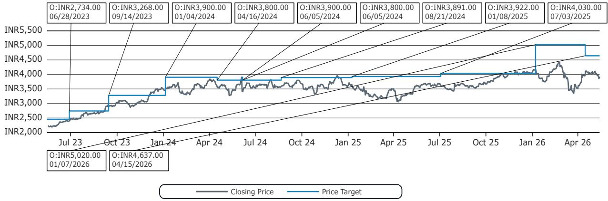

line

| Date       | Closing Price | Price Target |
| ---------- | ------------- | ------------ |
| 06/28/2023 | INR2,734.00   | -            |
| 09/14/2023 | INR3,268.00   | -            |
| 01/04/2024 | INR3,900.00   | -            |
| 04/16/2024 | INR3,800.00   | -            |
| 06/05/2024 | INR3,900.00   | -            |
| 06/05/2024 | INR3,800.00   | -            |
| 08/21/2024 | INR3,891.00   | -            |
| 01/08/2025 | INR3,922.00   | -            |
| 07/03/2025 | INR4,030.00   | -            |
| 01/07/2026 | INR5,020.00   | -            |
| 04/15/2026 | INR4,637.00   | -            |

Outperform (O); Market-Perform (M); Underperform (U); Coverage Suspended (CS); Not Covered (NC)

NTPC Ltd (NTPC.IN) Rating History for Bernstein as of 05/13/2026   
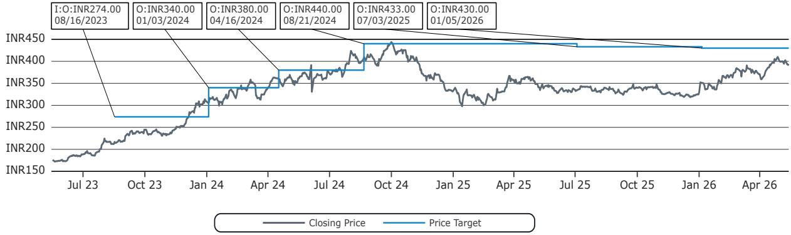

line

| Date       | Closing Price | Price Target |
| ---------- | ------------- | ------------ |
| 08/16/2023 | INR274.00     | INR274.00    |
| 01/03/2024 | INR340.00     | INR340.00    |
| 04/16/2024 | INR380.00     | INR380.00    |
| 08/21/2024 | INR440.00     | INR440.00    |
| 07/03/2025 | INR433.00     | INR433.00    |
| 01/05/2026 | INR430.00     | INR430.00    |

Outperform (O); Market-Perform (M); Underperform (U); Coverage Suspended (CS); Not Covered (NC)

Power Finance Corp Ltd (POWF.IN) Rating History for Bernstein as of 05/13/2026   
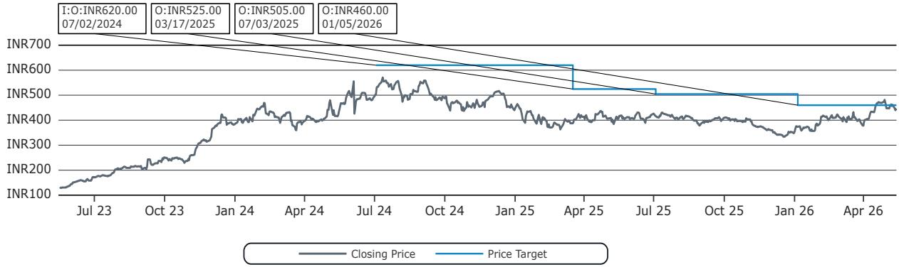

line

| Date       | Closing Price | Price Target |
| ---------- | ------------- | ------------ |
| 07/02/2024 | INR620.00     | INR620.00    |
| 03/17/2025 | INR525.00     | INR525.00    |
| 07/03/2025 | INR505.00     | INR505.00    |
| 01/05/2026 | INR460.00     | INR460.00    |

Outperform (O); Market-Perform (M); Underperform (U); Coverage Suspended (CS); Not Covered (NC)

Rural Electrification Corporation Ltd (RECL.IN) Rating History for Bernstein as of 05/13/2026   
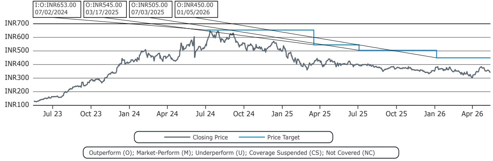

line

| Date       | Closing Price | Price Target |
| ---------- | ------------- | ------------ |
| 07/02/2024 | INR653.00     | INR653.00    |
| 03/17/2025 | INR545.00     | INR545.00    |
| 07/03/2025 | INR505.00     | INR505.00    |
| 01/05/2026 | INR450.00     | INR450.00    |

All price target and closing price data in the chart(s) above are denominated in the currency noted in the Ticker Table of this report.

# CONFLICTS OF INTEREST

Certain affiliates of Bernstein act as market maker or liquidity provider in the debt securities of: Power Finance Corp Ltd.

Uma Menon has a financial interest in the equity or debt securities of Power Finance Corp Ltd (POWF.IN).

# OTHER MATTERS

The legal entity(ies) employing the analyst(s) listed in this report, and their location, can be determined by the country code of their phone number, as follows:

+1 Bernstein Institutional Services LLC; New York, New York, USA   
+44 Bernstein Autonomous LLP; London UK   
+212 SG Africa Technologies & Services; Casablanca, Morocco   
+33 BSG France S.A.; Paris, France   
+34 BSG France S.A.; Madrid, Spain   
+41 Bernstein Autonomous LLP; Geneva, Switzerland   
+49 BSG France S.A.; Frankfurt, Germany   
+91 Bernstein (India) Private Limited; Mumbai, India   
+852 Bernstein (Hong Kong) Limited 盛博香港有限公司; Hong Kong, China   
+65 Bernstein (Singapore) Private Limited; Singapore   
+81 Bernstein Japan KK; Tokyo, Japan

Where this report has been prepared by research analyst(s) employed by a non-US affiliate, such analyst(s), is/are (unless otherwise expressly noted below) not registered as associated persons of Bernstein Institutional Services LLC or any other SEC-registered broker-dealer and are not licensed or qualified as research analysts with FINRA. Accordingly, such analyst(s) may not be subject to FINRA's restrictions regarding (among other things) communications by research analysts with a subject company, interactions between research analysts and investment banking personnel, participation by research analysts in solicitation and marketing activities relating to investment banking transactions, public appearances by research analysts, and trading securities held by a research analyst account.

Where this report has been prepared by research analyst(s) employed by SG Africa Technologies & Services (part of the SG group of companies), it has been prepared on behalf of a Bernstein company under a Global Services

Agreement in place between Bernstein and SG.

# CERTIFICATION

Each research analyst listed in this report, who is primarily responsible for the preparation of the content of this report, certifies that all of the views expressed in this publication accurately reflect that analyst's personal views about any and all of the subject securities or issuers and that no part of that analyst's compensation was, is, or will be, directly or indirectly, related to the specific recommendations or views in this publication.

# II. ADDITIONAL GLOBAL CONFLICT DISCLOSURES

It is at the sole discretion of the Firm as to when to initiate, update and cease research coverage. The Firm has established, maintains and relies on information barriers to control the flow of information contained in one or more areas (i.e., the private side) within the Firm, and into other areas, units, groups or affiliates (i.e., public side) of the Firm.

# III. OTHER IMPORTANT INFORMATION AND DISCLOSURES

Separate branding is maintained for “Bernstein” and “Autonomous” research products.

- Bernstein produces a number of different types of research products including, among others, fundamental analysis and quantitative analysis under both the “Autonomous” and “Bernstein” brands. Recommendations contained within one type of research product may differ from recommendations contained within other types of research products, whether as a result of differing time horizons, methodologies or otherwise. Furthermore, views or recommendations within a research product issued under one brand may differ from views or recommendations under the same type of research product issued under the other brand. The Research Ratings System for the two brands and other information related to those Rating Systems are included in the previous section.   
- Autonomous operates as a separate business unit within the following entities: Bernstein Institutional Services LLC, Bernstein Autonomous LLP, Bernstein (Hong Kong) Limited 盛博香港有限公司 and Bernstein (India) Private Limited. For information relating to “Autonomous” branded products (including certain Sales materials) please visit: www.autonomous.com. For information relating to Bernstein branded products please visit: www.Bernsteinresearch.com.

Analysts are compensated based on aggregate contributions to the research franchise as measured by account penetration, productivity and proactivity of investment ideas. No analysts are compensated based on performance in, or contributions to, generating investment banking revenues.

This report has been produced by an independent analyst as defined in Article 3 (1)(34)(i) of EU 596/2014 Market Abuse Regulation (“MAR”) and the same article of MAR as it forms part of United Kingdom domestic law by virtue of the European Union (Withdrawal) Act 2018.

To our readers in the United States: Bernstein Institutional Services LLC, a broker-dealer registered with the U.S. Securities and Exchange Commission (“SEC”) and a member of the U.S. Financial Industry Regulatory Authority, Inc. (“FINRA”) is distributing this publication in the United States and accepts responsibility for its contents. Where this material contains an analysis of debt product(s), such material is intended only for institutional investors and is not subject to the US independence and disclosure standards applicable to debt research prepared for retail investors.

Bernstein Institutional Services LLC may act as principal for its own account or as agent for another person (including an affiliate) in sales or purchases of any security which is a subject of this report. This report does not purport to meet the objectives or needs of any specific individuals, entities or accounts.

To our readers in Canada: If this publication pertains to a Canadian domiciled company, it is being distributed in Canada by Bernstein (Canada) Limited, which is licensed and regulated by the Canadian Investment Regulatory Organization. If the publication pertains to a non-Canadian domiciled company, it is being distributed by Bernstein Institutional Services LLC, which is licensed and regulated by both the SEC and FINRA, into Canada under the International Dealers Exemption.

This document may not be passed onto any person in Canada unless that person qualifies as "permitted client" as defined in Section 1.1 of NI 31-103.

To our readers in Brazil: This report has been prepared by Bernstein Institutional Services LLC, and Banco BTG Pactual S.A. ("BTG") is responsible for the distribution of this report in Brazil.

To readers in the United Kingdom: This publication has been issued or approved for issue in the United Kingdom by Bernstein Autonomous LLP, authorised and regulated by the Financial Conduct Authority and located at 60 London Wall, London EC2M 5SH, +44 (0)20-7170-5000. Registered in England & Wales No OC343985.

This document is for distribution only to persons who (i) have professional experience in matters relating to investments falling within Article 19(5) of the Financial Services and Markets Act 2000 (Financial Promotion) Order 2005 (as amended, the “Financial Promotion Order”), (ii) are persons falling within Article 49(2)(a) to (d) (“high net worth companies, unincorporated associations, etc.”) of the Financial Promotion Order, (iii) are outside the United Kingdom, or (iv) are persons to whom an invitation or inducement to engage in investment activity (within the meaning of section 21 of the FSMA) in connection with the issue or sale of any securities may otherwise lawfully be communicated or caused to be communicated (all such persons together being referred to as “relevant persons”). This document is directed only at relevant persons and must not be acted on or relied on by persons who are not relevant persons. Any investment or investment activity to which this document relates is available only to relevant persons and will be engaged in only with relevant persons.

To our readers in the member states of the EEA: This publication is being distributed by BSG France SA, which is authorised and regulated by the Autorité de Contrôle Prudentiel et de Résolution (ACPR) and Autorité des Marchés Financiers (AMF).

To our readers in Hong Kong: This publication is being distributed in Hong Kong by Bernstein (Hong Kong) Limited 盛博香港有限公司, which is licensed and regulated by the Hong Kong Securities and Futures Commission (Central Entity No. AXC846) to carry out Type 4 (Advising on Securities) regulated activities and subject to the licensing conditions mentioned in the SFC Public Register (https://www.sfc.hk/publicregWeb/corp/AXC846/details)). This publication is solely for professional investors, as defined in the Securities and Futures Ordinance (Cap. 571). The purpose of this report is solely to provide an analysis of the issuers referred to in this report and is not intended for any purpose contrary to the laws of Hong Kong.

To our readers in Singapore: This publication is being distributed in Singapore by Bernstein (Singapore) Private Limited, only to accredited investors or institutional investors, as defined in the Securities and Futures Act 2001 of Singapore ("SFA"). Recipients in Singapore should contact Bernstein (Singapore) Private Limited in respect of matters arising from, or in connection with, this publication. Bernstein (Singapore) Private Limited is regulated by the Monetary Authority of Singapore and licensed under the SFA as a capital markets services licence holder for dealing in capital markets products that are securities and collective investment schemes and an exempt financial adviser for advising on, issuing and promulgating analyses and reports on securities. Bernstein (Singapore) Private Limited is registered in Singapore with Company Registration No. 20213710W and located at One Raffles Quay, #27-11 South Tower, Singapore 048583, +65-6230-4612.

To our readers in the People's Republic of China: The securities referred to in this document are not being offered or sold and may not be offered or sold, directly or indirectly, in the People's Republic of China (for such purposes, not including the Hong Kong and Macau Special Administrative Regions or Taiwan, the "PRC") in contravention of any applicable laws of the PRC.

This document does not constitute an offer to sell or the solicitation of an offer to buy any securities in the PRC to any person to whom it is unlawful to make the offer or solicitation in the PRC.

We do not represent that this document may be lawfully distributed, or that any securities may be lawfully offered, in compliance with any applicable registration or other requirements in the PRC, or pursuant to an exemption available thereunder, or assume any responsibility for facilitating any such distribution or offering. In particular, no action has been taken by us which would permit a public offering of any securities or distribution of this document in the PRC. Accordingly, the securities are not being offered or sold within the PRC by means of this document or any other document. Neither this document nor any advertisement or other offering material may be distributed or published in the PRC, except under circumstances that will result in compliance with any applicable laws and regulations.

To our readers in Japan: This publication is being distributed in Japan by Bernstein Japan KK (サンフォード・C・バーンスタイン株式会社), which is registered in Japan as a Financial Instruments Business Operator with the Kanto Local Finance Bureau (registration number: The Director-General of Kanto Local Finance Bureau (FIBO) No.3387) and regulated by the Financial Services Agency. It is also a member of Japan Investment Advisers Association. This publication is solely for qualified institutional investors in Japan only, as defined in Article 2, paragraph (3), items (i) of the Financial Instruments and Exchange Act.

For the institutional client readers in Japan who have been granted access to the Bernstein website by Daiwa Group Inc. ("Daiwa"), your access to this document should not be construed as meaning that Bernstein is providing you with investment advice for any purposes. Whilst Bernstein has prepared this document, your relationship is, and will remain with, Daiwa, and Bernstein has neither any contractual relationship with you nor any obligations towards you.

To our readers in Australia: Bernstein (Hong Kong) Limited 盛博香港有限公司 is responsible for distributing research in Australia. It is regulated by the Securities and Exchange Commission under U.S. laws, by the Financial Conduct Authority under U.K. laws, which differs from Australian laws. Bernstein (Hong Kong) Limited 盛博香港有限公司 is exempt from the requirement to hold an Australian financial services license under the Corporations Act 2001 in respect of the provision of the

following financial services to wholesale clients:

• providing financial product advice;   
• dealing in a financial product;   
• making a market for a financial product; and   
• providing a custodial or depository service.

To our readers in India: This publication is being distributed in India by Bernstein (India) Private Limited (SCB India) which is licensed and regulated by Securities and Exchange Board of India ("SEBI") as a research analyst entity under the SEBI (Research Analyst) Regulations, 2014, having registration no. INH000006378 and as a stock broker having registration no. INZ000213537. SCB India is currently engaged in the business of providing research and stock broking services. Please refer to www.Bernsteinresearch.in for more information.

\- SCB India is a Private limited company incorporated under the Companies Act, 2013, on April 12, 2017 bearing corporate identification number U65999MH2017FTC293762, and registered office at Level 3A, 4th Floor, First International Financial Centre, Plot Nos C-54 and C-55, G Block, Near CBI Office, Bandra Kurla Complex, Bandra (East), Mumbai 400098, Maharashtra, India (Phone No: +91-22-68421401).

\- For details of Associates (i.e., affiliates/group companies) of SCB India, kindly email MUM-Bernstein-InCompliance@Bernsteinsg.com.

• SCB India does not have any disciplinary history as on the date of this report.

\- Except as noted above, SCB India and/or its Associates (i.e., affiliates/group companies), the Research Analysts authoring this report, and their relatives

• do not have any financial interest in the subject company   
• do not have actual/beneficial ownership of one percent or more in securities of the subject company;   
• is not engaged in any investment banking activities for Indian companies, as such;   
• have not managed or co-managed a public offering in the past twelve months for any Indian companies;   
- have not received any compensation for investment banking services or merchant banking services from the subject company in the past 12 months;   
• have not received compensation for brokerage services from the subject company in the past twelve months;   
- have not received any compensation or other benefits from the subject company or third party related to the specific recommendations or views in this report; and   
- do not currently, but may in the future, act as a market maker in the financial instruments of the companies covered in the report.   
- do not have any conflict of interest in the subject company as of the date of this report.

\- Except as noted above, the subject company has not been a client of SCB India during twelve months preceding the date of distribution of this research report. Neither SCB India nor its Associates (i.e., affiliates/group companies) have received compensation for products or services other than investment banking, merchant banking or brokerage services from the subject company in the past twelve months.

\- The principal research analyst(s) who prepared this report, members of the analysts' team, and members of their households are not an officer, director, employee or advisory board member of the companies covered in the report.

- Our Compliance officer / Grievance officer is Ms. Rupal Talati, who can be reached at +91-22-68421451, or MUM-Bernstein-InCompliance@Bernsteinsg.com / Scbin-investorgrievance@Bernsteinsg.com   
- The Research investor charter and Terms & Conditions of SCB India are available on its website and may be accessed at Bernstein (India) Private Limited (https://Bernsteinresearch.in/) for your reference.   
- Disclaimer: Registration granted by SEBI, and certification from NISM, is in no way a guarantee of performance of the intermediary or provide any assurance of returns to investors. Investments in securities market are subject to market risks. Read all the related documents carefully before investing.

To our readers in Switzerland: This document is provided in Switzerland by or through Bernstein Autonomous LLP, and is provided only to qualified investors as defined in article 10 of the Swiss Collective Investment Scheme Act (“CISA”) and related provisions of the Collective Investment Scheme Ordinance and in strict compliance with applicable Swiss law and regulations. The products mentioned in this document may not be suitable for all types of investors. This document is based on the Directives on the Independence of Financial Research issued by the Swiss Bankers Association (SBA) in January 2008.

To our readers in the Middle East: Bernstein Autonomous LLP, DIFC branch has its principal office at Gate Village 06, DIFC, Dubai, UAE. Bernstein Autonomous LLP, DIFC branch is regulated by the Dubai Financial Services Authority (DFSA) with the registration number CL10040 and is provisioned for Arranging Deals in Investments and Advising on Financial Products. All communications and services are directed at Professional Clients and Market Counterparties only (as defined in the DFSA rulebook). Persons other than Professional Clients and Market Counterparties, such as Retail Clients, are not the intended recipients of our communications or services.

# LEGAL

All research publications are disseminated to our clients through posting on the firm's password protected websites, Bernsteinresearch.com and autonomous.com. Certain, but not all, research publications are also made available to clients through third-party vendors or redistributed to clients through alternate electronic means as a convenience.

This publication has been published and distributed in accordance with the Firm's policy for management of conflicts of interest in investment research, a copy of which is available from Bernstein Institutional Services LLC, Director of Compliance, 245 Park Avenue, New York, NY 10167. Additional disclosures and information regarding Bernstein's business are available on our website www.Bernsteinresearch.com.

The securities described herein may not be eligible for sale in all jurisdictions or to certain categories of investors where that permission profile is not consistent with the licenses held by the entities noted herein. This document is for distribution only as may be permitted by law. This publication is not directed to, or intended for distribution to or use by, any person or entity who is a Citizen or resident of, or located in any locality, state, country or other jurisdiction where such distribution, publication, availability or use would be contrary to law or regulation or which would subject any of the entities referenced herein or any of their sUBSidiaries or affiliates to any registration or licensing requirement within such jurisdiction. This publication is based upon public sources we believe to be reliable, but no representation is made by us that the publication is accurate or complete. We do not undertake to advise you of any change in the reported information or in the opinions herein. This publication was prepared and issued by entity referred to herein for distribution to eligible counterparties or professional clients. This publication is not an offer to buy or sell any security, and it does not constitute investment, legal or tax advice. The investments referred to herein may not be suitable for you. Investors must make their own investment decisions in consultation with their professional advisors in light of their specific circumstances. The value of investments may fluctuate, and investments that are denominated in foreign currencies may fluctuate in value as a result of exposure to exchange rate movements. Information about past performance of an investment is not necessarily a guide to, indicator of, or assurance of, future performance.

This report is directed to and intended only for our clients who are “eligible counterparties”, “professional clients”, “institutional investors” and/or “professional investors” as defined by the aforementioned regulators, and must not be redistributed to retail clients as defined by the aforementioned regulators. Retail clients who receive this report should note that the services of the entities noted herein are not available to them and should not rely on the material herein to make an investment decision. The result of such act will not hold the entities noted herein liable for any loss thus incurred as the entities noted herein are not registered/authorised/licensed to deal with retail clients and will not enter into any contractual agreement/arrangement with retail clients. This report is provided subject to the terms and conditions of any agreement that the clients may have entered into with the entities noted herein. All research reports are disseminated on a simultaneous basis to eligible clients through electronic publication to our client portal.

The information in this report was prepared by Bernstein solely for the internal business use of our clients. Clients may store, display, analyze, reformat and print the information in this report for this limited use only. Clients may not copy, alter, create derivative works, resell, reverse engineer, commercially exploit, share or distribute any part of the information contained herein for any purpose without Bernstein's express written consent. These restrictions include extracting data or using the content to develop indices or other products. Further, you may not use this report, or any portion of this report, to train or finetune any third-party machine learning or artificial intelligence system, or as a prompt or input into any such system. You also may not, without Bernstein's express written consent, do any of the foregoing in connection with your own internal machine learning or artificial intelligence system.

Bernstein may use artificial intelligence tools in the preparation of its materials. Any such materials are reviewed by Bernstein's research analysts prior to publication.

This report has been prepared for information purposes only and is based on current public information that we consider reliable, but the entities noted herein do not warrant or represent (express or implied) as to the sources of information or data contained herein are accurate, complete, not misleading or as to its fitness for the purpose intended even though the entities noted herein rely on reputable or trustworthy data providers, it should not be relied upon as such. Opinions expressed are the author(s)' current opinions as of the date appearing on the material only and we do not undertake to advise you of any change in the reported information or in the opinions herein.

This publication was prepared and issued by the entity referred to herein for distribution to eligible counterparties or professional clients. The information in this report is intended for general circulation and does not constitute an offer to buy or sell any security, investment, legal or tax advice nor a personal recommendation, as defined by any of the aforementioned regulators. It does not take into account the particular investment objectives, financial situations, or needs of individual investors. The report has not been reviewed by any of the aforementioned regulators and does not represent any official recommendation from the aforementioned regulators. The investments referred to herein may not be suitable for you. Investors must make their own investment decisions in consultation with advice sought from a financial adviser regarding the suitability of the investment product, taking into account the specific investment objectives, financial situation or particular needs of any recipient of the recommendation, before the recipient makes a commitment to purchase the investment product.

The analysis contained herein is based on numerous assumptions. Different assumptions could result in materially different results. The information in this report does not constitute, or form part of, any offer to sell or issue, or any offer to purchase or sUBScribe for shares, or to induce engage in any other investment activity. The value of any securities or financial instruments mentioned in this report may fluctuate subject to market conditions. Information about past performance of an investment is not necessarily a guide to, indicative of, or assurance of future performance. Estimates of future performance mentioned by the research analyst in this report are based on assumptions that may not be realized due to unforeseen factors like market volatility/fluctuation. In relation to securities or financial instruments denominated in a foreign currency other than the clients' home currency, movements in exchange rates will have an effect on the value, either favorable or unfavorable. Before acting on any recommendations in this report, recipients should consider the appropriateness of investing in the subject securities or financial instruments mentioned in this report and, if necessary, seek for independent professional advice.

The securities described herein may not be eligible for sale in all jurisdictions or to certain categories of investors where that permission profile is not consistent with the licenses held by the entities noted herein. This document is for distribution only as may be permitted by law. It is not directed to, or intended for distribution to or use by, any person or entity who is a Citizen or resident of or located in any locality, state, country or other jurisdiction where such distribution, publication, availability or use would be contrary to law or regulation or would subject the entities noted herein to any regulation or licensing requirement within such jurisdiction.

Source: Bloomberg Index Services Limited. BLOOMBERG® is a trademark and service mark of Bloomberg Finance L.P. and its affiliates (collectively “Bloomberg”). Bloomberg or Bloomberg’s licensors own all proprietary rights in the Bloomberg Indices. Neither Bloomberg nor Bloomberg’s licensors approves or endorses this material, or guarantees the accuracy or completeness of any information herein, or makes any warranty, express or implied, as to the results to be obtained therefrom and, to the maximum extent allowed by law, neither shall have any liability or responsibility for injury or damages arising in connection therewith.

No part of this material may be reproduced, distributed or transmitted or otherwise made available without prior consent of the entities noted herein. Copyright Bernstein Institutional Services LLC Bernstein Autonomous LLP, BSG France S.A., Bernstein (Hong Kong) Limited 盛博香港有限公司, Bernstein (Canada) Limited, Bernstein (India) Private Limited (SEBI registration no. INH000006378), Bernstein (Singapore) Private Limited and Bernstein Japan KK (サンフォード・C・バーンスタイン株式会社). All rights reserved. The trademarks and service marks contained herein are the property of their respective owners. Any unauthorized use or disclosure is strictly prohibited. The entities noted herein may pursue legal action if the unauthorized use results in any defamation and/or reputational risk to the entities noted herein and research published under the Bernstein and Autonomous brands.