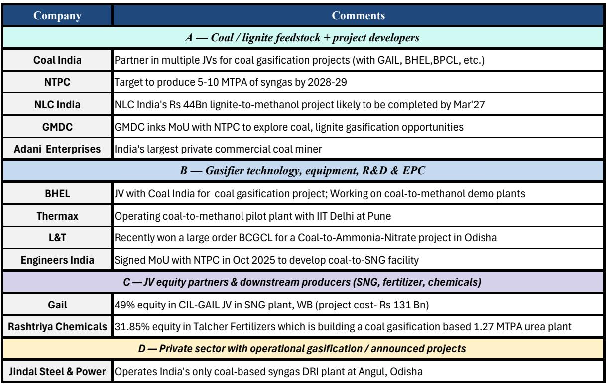
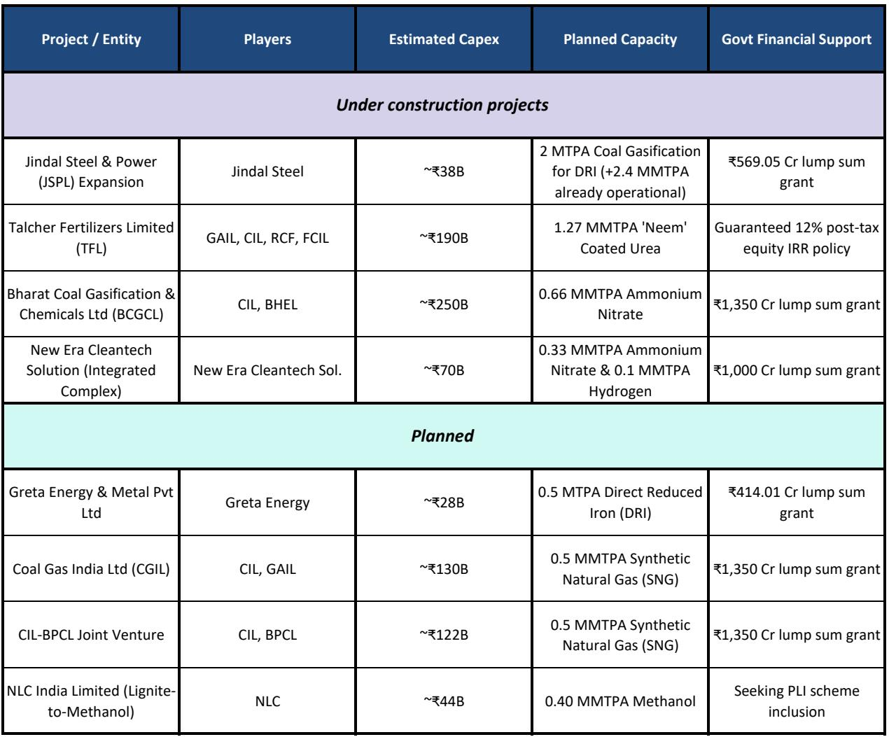

# Coal Gasification Is India’s Most Underappreciated Strategic Hedge Against Energy Insecurity

India faces a structural vulnerability that few investors have fully priced into their industrial and infrastructure theses: the country’s growing dependence on imported natural gas, methanol, and ammonia is a direct threat to its fiscal stability and energy sovereignty. The conventional narrative holds that India must transition to renewables and green hydrogen to solve this problem. That narrative is incomplete. Coal gasification—a technology that converts India’s abundant, low-grade coal into synthetic gas for fertilizers, chemicals, and fuels—offers a faster, more economically viable bridge solution that has been proven at scale in both South Africa and China. The question is not whether coal gasification makes strategic sense. It does. The question is whether the current constellation of policy support, capital sUBSidies, and geopolitical pressure will finally overcome the implementation barriers that have stalled this industry for decades.

The argument for coal gasification is not an argument against decarbonization. It is an argument for energy pragmatism. India holds roughly 10 percent of the world’s coal reserves, yet its coal gasification capacity stands at a negligible 2.4 million tonnes per year—compared to China’s 340 million tonnes. India imports 90 percent of its methanol, 100 percent of its ammonia, and roughly 20 percent of its urea. These imports are priced in dollars and linked to global LNG prices, which have proven violently volatile. The fertilizer sUBSidy bill alone has exceeded 2 trillion rupees in recent years. Every rupee spent on imported LNG for fertilizer production is a rupee that flows out of the Indian economy, exposed to currency depreciation and supply shocks that India cannot control. Coal gasification converts that open-ended, foreign-currency-denominated liability into a fixed, rupee-denominated cost.

This report examines why coal gasification is now a high-conviction strategic theme for India, what the global precedents reveal about the necessary conditions for success, where the commercial break-even math stands today, and which risks remain unresolved. The analysis draws on a detailed investment bank report that models plant economics, government sUBSidy structures, and the competitive dynamics between coal-based and green ammonia production. The implications for investors extend beyond energy stocks into industrials, engineering, and infrastructure finance.

## The Global Precedents Prove That Coal Gasification Works When Governments Accept Long Time Horizons

South Africa and China are not theoretical case studies. They are empirical proof that coal gasification can transform a country’s energy and fertilizer import dependence when the state is willing to absorb upfront losses in exchange for long-term strategic gains. South Africa built the world’s largest coal-to-chemicals complex under apartheid-era oil sanctions. The plant was economically sub-optimal when crude oil traded at three to five dollars per barrel. It became viable only in the 1990s when oil prices rose to twenty to thirty dollars per barrel. The critical enabling factor was not technology—it was state-backed long-term off-take agreements that insulated the project from commodity price volatility during its early years. Today, Sasol’s coal gasification provides roughly 29 percent of South Africa’s domestically refined liquid fuel, saving the country billions in foreign exchange annually.

China’s scale-up is even more instructive. Starting from a negligible base in the early 2000s, China expanded its coal gasification capacity to approximately 340 million tonnes per year through a deliberate state-led strategy. State-owned enterprises received preferentially priced captive coal allocations, state-bank debt at below-commercial rates, mandatory grid off-take for coal-derived synthetic natural gas, and tolerance for years of accounting losses absorbed by sovereign balance sheets. The payoff is now visible. Approximately 78 percent of China’s urea output comes from coal rather than natural gas. When the Iran conflict disrupted shipping through the Strait of Hormuz and sent international urea prices surging by roughly 70 percent, China maintained ample domestic stocks at roughly one-third of international benchmarks. China is now among the world’s largest fertilizer exporters, shipping more than 13 billion dollars worth last year.

The lesson for India is unambiguous. Coal gasification is not a technology problem. It is a policy commitment problem. India has been discussing coal gasification for decades. The difference now is that the geopolitical and fiscal pressure has reached a level where the cost of inaction exceeds the cost of implementation. The war-driven disruption to global energy and fertilizer markets has made the strategic case for coal gasification impossible to ignore. The question is whether India’s policy framework can replicate the sustained state intervention that made the South African and Chinese models work.

## The Fiscal Arithmetic of Fertilizer Imports Now Overwhelms the Incremental Cost of Coal Gasification

The most compelling near-term argument for coal gasification in India is not energy security in the abstract. It is the specific, quantifiable burden of the fertilizer sUBSidy on the government’s fiscal accounts. Fertilizers consume approximately 40 percent of India’s imported gas every year. The fertilizer sUBSidy peaked at 2.55 trillion rupees in fiscal 2023, representing roughly 6 percent of the entire net budget. This spike was driven by the LNG price surge following the Russia-Ukraine conflict, compounded by rupee depreciation. The sUBSidy burden is an open-ended, variable liability that moves with global gas prices and exchange rates—two variables over which India has no control.

Coal gasification converts this liability into a fixed cost. The report’s commercial modeling, based on announced capital expenditure for coal gasification plants in India, plant utilization of 80 percent, and an exchange rate of approximately 95 rupees per dollar, yields a break-even price for urea production via coal gasification of roughly 11.7 dollars per million British thermal units of LNG. For context, the current LNG price is approximately 17 dollars per million British thermal units, and the three-year average is 12.6 dollars. Coal gasification is already economically viable at current LNG prices, and the margin of safety widens with every upward move in global gas prices.

The government has recognized this arithmetic. In 2020, it announced a plan to expand coal gasification capacity to 100 million tonnes per year. SUBSequent policy measures included a viability gap funding package of 85 billion rupees, regulated coal pricing allocations, and guaranteed returns on equity for specific government plants. Most recently, the government announced a 375 billion rupee capital sUBSidy, effectively covering roughly 15 percent of the expected capital expenditure toward the target. This is not symbolic policy. It is a material financial commitment that shifts the risk-reward calculus for project developers.

The strategic implication for investors is that coal gasification is no longer a speculative long-duration option. It is a near-term industrial theme with measurable government backing and favorable commercial math. The question is which parts of the value chain will capture the value creation.

## The Engineering and Equipment Value Chain Is the Most Direct Beneficiary of the Capital Spending Cycle

The capital expenditure required to reach the government’s coal gasification target is sUBStantial. Eight projects worth approximately 880 billion rupees are already underway. The largest operational plant is owned by Jindal Steel and Power, and state-owned enterprises including Coal India, GAIL, and BHEL are involved in most projects as equity holders or equipment, fuel, and infrastructure providers. NTPC has announced a target to produce five to ten million tonnes per year of syngas by 2029. Larsen and Toubro has won the downstream construction package for one of the plants. Thermax is in discussions with Coal India and the Ministry of Coal to serve as an equipment provider for planned projects.

For investors, the engineering, procurement, and construction segment offers the most direct and least risky exposure to the coal gasification theme. Unlike asset owners who must manage operational risks, technology risks, and off-take uncertainty, equipment and construction contractors earn margins on project execution regardless of the ultimate commercial success of the plant. Larsen and Toubro, in particular, benefits from its position across multiple industrial infrastructure themes, and coal gasification adds an incremental growth vector to a business that is already benefiting from broader capital spending cycles in power, transport, and urban infrastructure.

The equipment opportunity is not limited to domestic players. The technology for gasifying high-ash Indian coal—which is more challenging than the coal used in China or South Africa—is still being developed indigenously by BHEL. If BHEL’s fluidized bed gasifier proves commercially viable, it could unlock a technology licensing and equipment supply opportunity that extends beyond India’s borders to other countries with similar coal quality. This is a high-risk, high-reward scenario that is not yet priced into current valuations, but it is a credible upside case worth monitoring.

## The Unresolved Question Is Whether Long-Term Off-Take Agreements Will Materialize

For all the policy progress, one critical risk remains unresolved. The report identifies the absence of long-term off-take agreements as the single biggest impediment to project financing for coal gasification plants. These plants require high upfront capital expenditure, and their economic viability depends on stable, predictable revenue streams over a 15- to 20-year horizon. Without guaranteed off-take, project developers face the risk that a sudden drop in global LNG prices could render their plants uneconomic, stranding billions of rupees in capital.

The South African and Chinese precedents both relied on state-guaranteed off-take to bridge this gap. South Africa imposed a strategic fuel fund levy on imported petroleum that sUBSidized domestic synfuels. China mandated grid off-take for coal-derived synthetic natural gas and allowed state-owned enterprises to absorb losses for years. India has not yet implemented a comparable demand-side mechanism. The capital sUBSidy announced by the government addresses the supply side by reducing upfront costs, but it does not eliminate the revenue risk.

This is the analytical question that the report raises but does not fully answer. Will the government move from supply-side sUBSidies to demand-side mandates? Could blending requirements for coal-derived methanol or urea be imposed on fertilizer distributors or fuel retailers? Would the government itself act as a long-term off-taker for strategic reserves? These questions are unresolved, and they will determine whether the coal gasification theme moves from policy aspiration to commercial reality. Investors should watch for any government announcement regarding off-take guarantees, blending mandates, or strategic reserve purchases as the single most important catalyst for the sector.

## A Decision Framework for Investors Evaluating Coal Gasification Exposure

The coal gasification theme can be analyzed through a structured decision framework that separates the opportunity into three layers: direct exposure, indirect exposure, and optionality.

Direct exposure comes from companies that will build, equip, or finance the plants. Engineering and construction firms benefit from the capital spending cycle regardless of plant operating performance. Equipment providers benefit from technology licensing and recurring maintenance revenue. Infrastructure finance institutions benefit from a new lending vertical that fits their long-term lending focus. This is the most measurable and least speculative layer of the theme.

Indirect exposure comes from asset owners who operate coal gasification plants and benefit from the margin between their production cost and the import parity price. This layer is more sensitive to LNG price movements, technology risk, and off-take risk. The commercial viability is favorable at current LNG prices, but investors must have a view on long-term gas prices and the government’s willingness to protect plant economics through demand-side policies.

Optionality comes from companies developing indigenous gasification technology for high-ash coal. If successful, these companies could capture value not only from the domestic market but also from technology licensing to other countries with similar coal quality. This is the highest-risk, highest-reward layer, and it is suitable only for investors with a long time horizon and a tolerance for binary outcomes.

The framework suggests that the most prudent way to gain exposure to the coal gasification theme today is through the direct layer—engineering, equipment, and infrastructure finance. These companies benefit from the capital spending cycle regardless of the commercial success of individual plants. As the policy framework matures and off-take mechanisms are clarified, investors can rotate into the indirect layer for higher potential returns.

## The Full Report Contains the Charts and Data That Make This Thesis Actionable

The analysis presented here is a synthesis of a detailed investment bank report that includes the specific commercial models, break-even calculations, and company-level exposure tables that investors need to make portfolio decisions. The report contains exhibits that map the coal gasification process, compare India’s import dependence to China’s, model the fertilizer sUBSidy trajectory, and identify the key players and their roles across the value chain. These charts are not decorative. They are the analytical foundation for the strategic argument.

Join the community to read the full report and review the original charts.

*This article is for learning and discussion only and does not constitute investment advice.*

Personal reading notes and learning share only. Not investment advice.

