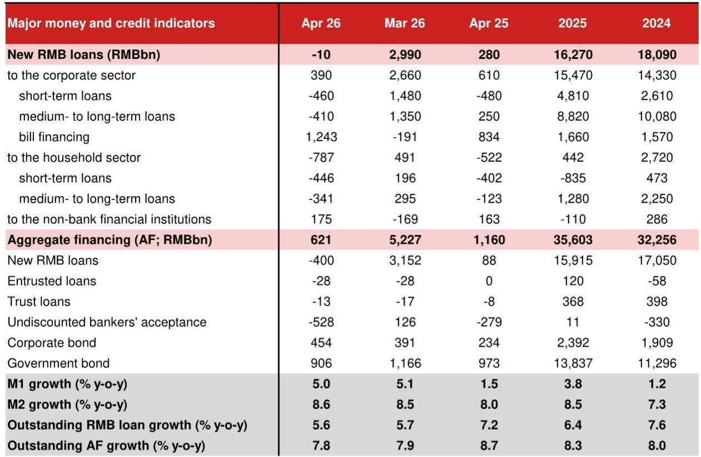
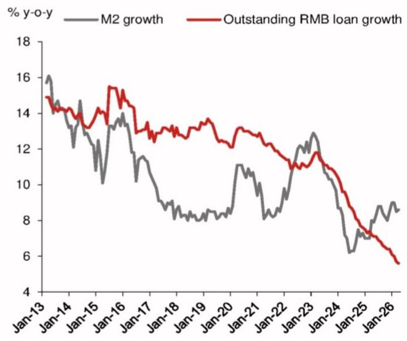
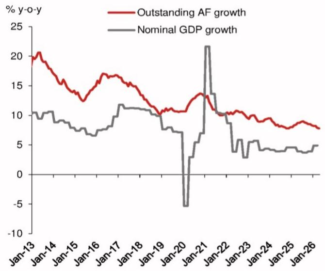

# 信用扩张的真正减速器不是需求，而是信用创造机制的切换

四月的金融数据发出了一个比表面读数更为深刻的信号。新增社融大幅低于市场预期，人民币贷款出现了自2025年7月以来的首次负增长。多数解读会将此归结为需求疲弱，但这份投行研报揭示了一个更值得关注的底层逻辑：信用扩张的引擎正在从银行信贷向债券市场和财政发力切换，而这一切换过程中的摩擦与扭曲，才是理解当前金融数据的关键。

这不是一次简单的周期性放缓。当新增人民币贷款创下历史同期最低纪录，而票据融资却同步创下新高时，我们看到的是一个正在发生的结构性转变——银行体系的信用创造功能正在被政策导向和微观主体的行为变化所重塑。对于产业决策者和投资者而言，理解这一转变的机制，远比纠结于单月数据的强弱更有价值。

## 1. 四月信贷数据的核心矛盾在于：贷款总量萎缩的背后，是信用创造的渠道在重新分配

四月新增社融6210亿元，仅为市场预期的一半。表面看，拖累项是人民币贷款和政府债券。但深入拆解后会发现，结构中的结构性变化比总量更值得关注。

人民币贷款在四月出现了罕见的负增长，新增为-100亿元。这是自2025年7月以来的首次。但同期企业债券融资净增4540亿元，较去年同期的2340亿元几乎翻倍。这一对比暗示了一个关键判断：企业的融资需求并未消失，而是在向成本更低、期限更灵活的债券市场转移。

贷款端的企业新增中长贷从2500亿元骤降至-4100亿元，而票据融资却飙升到创纪录的12430亿元。票据融资本质上是银行为了满足信贷考核指标的“填充物”，并非真实需求。剔除这一项，企业实际贷款需求可能比表面数据显示的更弱。

这里需要追问一个“所以呢”：如果企业融资正在从贷款向债券迁移，那么银行体系在信用创造中的角色就在被削弱。这对于依赖信贷脉冲进行资产定价的投资者而言，意味着传统的“社融-经济”映射关系可能需要重新校准。

## 2. 居民部门的信贷收缩并非短期现象，而是资产负债表修复的长期信号

居民贷款在四月净减少7870亿元，较去年同期的-5220亿元进一步扩大。其中，中长期贷款（主要是房贷）从-1230亿元下滑至-3410亿元，短期贷款（主要是消费贷）也从-4020亿元下滑至-4460亿元。

这组数据指向的不是一次性的季节性波动。从年初至今，居民贷款持续疲软。更值得注意的是，居民存款也在同步下降——四月新增居民存款为-1.9万亿元，较去年同期的-1.4万亿元进一步收缩。

研报提供了一个有价值的观察视角：存款从居民部门向非银行金融机构转移。随着大量居民定期存款在今年到期，而银行存款利率持续下行，居民正在将资金转向非银机构提供的理财产品。这意味着，居民并非在“储蓄”，而是在“重新配置”——从低收益的银行存款转向潜在收益更高的资管产品。

这个判断的含义是：居民部门的信用收缩不仅是“不敢借”，也是“不愿存”。前者是需求问题，后者则是利率传导机制在发挥作用。对于消费和地产相关的行业判断而言，居民资产负债表的修复可能比预期的更为漫长。

## 3. 政策利率和准备金率在2026年不会下调，这一判断改变了市场对宽松周期的预期

这份报告最引人注目的判断之一，是彻底删除了对2026年降准降息的预测。此前该机构还预期二季度有50bp降准、四季度有10bp降息。现在，这些预测全部归零。

理由有三。第一，四月政治局会议对货币政策的措辞没有显示出任何短期宽松的紧迫性。第二，全球能源冲击导致的输入性通胀正在显现——四月进口增速高达25.3%，半导体进口价格贡献显著。第三，央行在Q1货币政策报告中明确警告了输入性通胀压力。

这些因素叠加在一起，意味着央行的政策工具箱在今年可能保持静默。对于债券市场而言，这意味着利率下行的空间被显著压缩。对于权益市场而言，这意味着流动性驱动的估值扩张逻辑需要重新审视。

这里有一个尚未被充分讨论的二阶效应：如果政策利率不动，而银行间市场利率（DR007）已经低于政策利率（四月均值1.35%，低于7天逆回购利率1.40%），那么银行体系的净息差压力将进一步加大。这可能是未来银行股定价的一个隐含风险。

## 4. 政府债券发行的节奏变化，将是下半年信用扩张的核心变量

四月政府债券净融资9060亿元，略低于去年同期的9730亿元。这与市场对财政发力的预期形成反差。但研报判断，未来几个月政府债券发行将加速，以支撑仍然疲弱的固定资产投资。

这一判断的逻辑是：在信贷渠道受阻的情况下，财政发力将是维持信用扩张的主要手段。但这里有一个关键问题尚未被回答——政府债券发行的加速，能否有效对冲信贷收缩的拖累？

从历史数据看，政府债券融资对实体经济的传导效率低于银行贷款。如果财政资金主要流向基建和地方政府专项债项目，其对私人部门投资和消费的拉动作用将是间接且滞后的。这意味着，即使下半年社融总量因政府债券发行而企稳，其“含金量”可能低于市场预期。

对于投资者而言，需要关注的不是社融总量的高低，而是社融结构的变化——政府债券占比的上升，意味着信用扩张的质量在下降，对经济增长的边际拉动作用在减弱。

## 5. 报告尚未完全回答的关键问题：M2与M1的背离背后，资金在空转还是蓄力？

四月M2同比增速从8.5%微升至8.6%，而M1增速从5.1%微降至5.0%。M2-M1剪刀差略有扩大。表面看，这似乎指向资金从活期向定期转移，企业投资意愿不强。但深入思考，情况可能更为复杂。

M2的上升部分来自于非银行金融机构存款的大幅增加（四月新增2.5万亿元，去年同期为1.6万亿元）。这部分资金是否真正进入了实体经济，还是停留在金融体系内进行资产配置？如果是后者，那么M2的上升更多反映的是金融体系内部的流动性充裕，而非实体经济的信用扩张。

报告提到了居民存款向非银机构转移的趋势，但并未量化这一转移对M2和M1结构的影响。这里可能存在一个未被充分讨论的机制：当居民将存款转向理财产品时，这部分资金在统计上可能从居民存款变为非银存款，计入M2但不计入M1。如果这一规模足够大，那么M2-M1剪刀差的扩大可能更多反映的是资金在金融体系内部的重新配置，而非实体经济的需求疲弱。

这个问题的答案，对于判断当前流动性环境对资产价格的影响至关重要。如果资金确实在金融体系内空转，那么债券市场的配置压力将继续存在，利率可能维持低位。但如果资金最终会通过非银机构流入实体经济，那么利率的下行空间可能比市场预期的更小。

## 6. 投资者的观察框架：从“总量思维”转向“结构思维”

基于以上分析，对于希望从金融数据中提取有效信号的读者，这里提供一个三层次的观察框架。

第一层：关注信用创造的渠道切换。如果企业债券融资持续高于去年同期，而贷款增速继续下行，那么债券市场将成为企业融资的主要渠道。这意味着信用利差可能进一步收窄，而银行股的信贷增长预期需要下调。

第二层：关注居民资产负债表的修复速度。居民贷款和存款的同时收缩，暗示居民正在经历一个“去杠杆”和“再配置”的双重过程。如果这一趋势持续，消费和地产的复苏节奏将比市场预期的更慢。关注居民中长期贷款是否出现企稳信号，将是判断地产市场底部的先行指标。

第三层：关注通胀对政策空间的挤压。输入性通胀正在成为央行决策的一个新变量。如果四月通胀数据继续上行，市场对宽松政策的预期将进一步修正。这对于利率敏感型资产（如高估值成长股、长久期债券）的定价将构成压力。

这三个层次并非独立，而是相互关联的。信用渠道切换影响企业融资成本，居民资产负债表修复影响终端需求，通胀压力影响政策空间。三者合在一起，构成了一个比单月数据更为完整的宏观图景。

---

四月金融数据的真正意义，不在于它有多“差”，而在于它揭示了一个正在发生的结构性转变。信用创造的传统引擎正在减速，新引擎的启动尚需时间。在这个过程中，市场需要接受一个现实：我们熟悉的社融-经济映射关系，可能正在经历一次不可逆的重塑。

对于希望深入理解这一转变的读者，上述分析只是冰山一角。报告中的原始图表、更细致的部门拆分、以及分析师对下半年信用扩张路径的情景分析，都值得仔细研读。如果你对这些未解问题感兴趣——比如居民存款向非银转移的量化影响、政府债券发行加速的传导机制、以及输入性通胀对政策路径的潜在冲击——欢迎来微信群里继续讨论，我们会在那里分享完整的研报解读与原始数据图表。

Personal reading notes and learning share only. Not investment advice.

