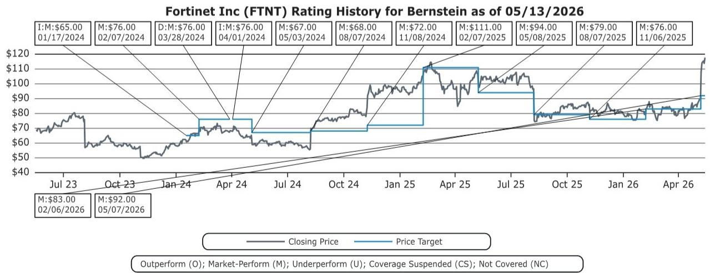
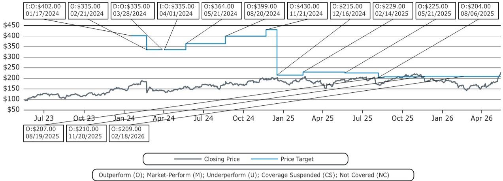
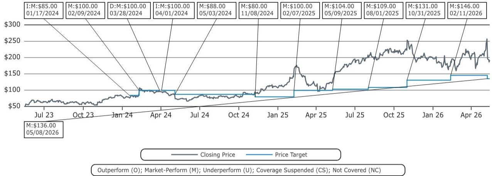

# 网络安全的下一个意外增量不在软件，而在物理世界的防火墙

Fortinet刚交出的Q1成绩单，让整个网络安全板块都松了一口气。营收超预期6.9%，这是自2021年疫情需求泡沫以来最大的一次正向偏离——而公司常规的beat区间通常在2%到3%之间。市场第一反应是“防火墙需求回暖了”，但这句判断只说对了一半。真正值得追问的是：这轮增长的驱动力是什么，以及它能否传导到其他网络安全厂商。

某外资投行在这份最新研报中给出了一个被市场低估的关键信号：Fortinet的超预期增长，核心驱动力并非企业IT预算的普遍扩张，而是来自一个长期被边缘化的细分领域——OT（运营技术）网络安全。中东地缘摩擦、针对医疗设备的国家级黑客攻击（Stryker事件）、欧洲新的OT监管法规，以及美国政府对企业OT基础设施的安全施压，正在共同制造一个非对称的需求脉冲。

这个判断的意义在于：如果市场只是简单地把Fortinet的beat解读为“安全支出在回暖”，那么它可能低估了结构性的变化，也高估了其他纯软件安全厂商的受益程度。真正的增量，集中在那些与物理世界直接连接的网络安全能力上。

## 1. OT安全不是新概念，但监管与地缘冲突正在把它变成强制预算

OT网络安全长期以来是网络安全领域最枯燥、最不被投资者关注的角落。它不涉及炫酷的AI检测模型，不产生高复购率的SaaS订阅，它的核心产品是防火墙——物理的、笨重的、部署在工厂车间和变电站里的硬件设备。

但枯燥不等于不重要。当医疗设备、电网控制系统、制造业生产线越来越多地接入网络，OT安全就从“最好有”变成了“必须做”。报告明确指出，欧洲已经通过法规强制要求OT网络安全合规，美国虽然监管力度相对温和，但Stryker事件后政府对企业OT基础设施的施压正在显著加强。

这意味着什么？这轮需求不是企业CIO主动选择的结果，而是外部压力驱动的被动支出。在这种场景下，预算的确定性和刚性远高于常规的IT安全采购。Fortinet的beat中，仅有约1%可以归因于硬件内存成本上涨的转嫁，剩余的超预期部分几乎全部来自OT防火墙的需求爆发。

对于投资者而言，关键问题不是“OT安全会不会增长”，而是“这个增量能持续多久”。报告隐含的假设是，这一需求脉冲可能持续数个季度，甚至延续到明年——因为企业和政府仍在评估自身暴露面，合规的推进速度不会一蹴而就。

## 2. 防火墙是直接受益者，但Palo Alto能分到多大一杯羹仍是未知数

如果OT安全的主要载体是防火墙，那么最直接的受益者自然是防火墙市场的领导者。根据Gartner的数据，Fortinet和Palo Alto Networks在OT网络安全领域市场份额相当，几乎并列第一。

因此，一个自然的推论是：Palo Alto的防火墙业务也可能在本季度获得类似的超额增长。报告估算，这种增量可能达到数千万美元的量级。但这里有一个关键的结构性差异需要留意：欧洲的OT监管力度远强于美国，而Fortinet在欧洲的收入占比是Palo Alto的两倍。换言之，Fortinet在监管驱动的市场中拥有更直接的地理位置优势。

Stryker事件虽然在美国引发了强烈的行业关注，但政府施压与法规强制之间的转化仍然存在不确定性。Palo Alto能否获得同等规模的OT增量，取决于美国的政策推进速度，以及其防火墙产品在OT场景中的部署渗透率。这个问题，只有即将到来的财报季才能给出初步答案。

但即便Palo Alto受益，这份增量对其整体收入结构的影响也需要审慎评估。Palo Alto的战略重心正在从硬件防火墙转向NGS ARR（下一代安全订阅收入），OT防火墙的硬件收入增长虽然有助于短期数字，但对其估值逻辑的贡献可能有限。

## 3. 端点安全厂商的OT故事更性感，但落地节奏仍需验证

防火墙不是OT安全的唯一战场。随着工业控制系统、监控摄像头、楼宇自动化系统等IoT/IIoT设备的大量部署，传统端点安全厂商也找到了切入OT的叙事路径。

SentinelOne是其中定位最清晰的玩家。其Singularity平台专门针对无法安装传统安全代理的非管理设备设计，覆盖工业控制系统等OT场景，并且支持分段网络环境下的安全部署。报告特别提到，SentinelOne在OT领域的布局包括广泛的OS支持和针对隔离网络的防护能力，这使其在制造业和能源行业拥有差异化优势。

CrowdStrike也在加速追赶。近期发布的OT/IoT能力公告，以及其与Dragos等专业OT安全厂商的历史合作关系，表明它正在系统性地补齐这块短板。

但这里有一个不易回答的问题：端点安全厂商的OT增量，是否会在财报中体现为可识别的收入脉冲？与防火墙的硬件交付不同，端点安全的OT收入更多来自软件订阅，其确认周期更长，且往往与现有客户群的交叉销售相关。换句话说，即使需求在增长，转化为可量化的季度beat可能需要更长时间。

报告的态度是谨慎的：分析师正在等待Palo Alto、SentinelOne、CrowdStrike和Zscaler的下一轮财报，以验证OT需求是否真的从防火墙扩展到了更广泛的网络安全品类。

## 4. SASE/SSE厂商的OT叙事更像补位，尚不足以构成独立驱动力

如果说防火墙和端点安全在OT领域有清晰的场景对应，那么SASE/SSE厂商的OT故事则显得更像“补位”而非“主攻”。

Zscaler在2024年收购了Airgap Technologies，目的是进入OT/IoT安全领域。其核心卖点是：用云原生架构替代物理防火墙，解决传统部署中的覆盖盲区和实施复杂性。Cloudflare也通过与Brixio等合作伙伴，在IT/OT融合安全方案中找到了自己的位置。

但报告坦率地指出，Cloudflare的OT相关业务在其Q1财报中并未被提及为增长驱动因素。这意味着，至少目前，SASE/SSE厂商在OT安全领域的收入贡献仍然微乎其微。

这里需要区分两种不同的增长逻辑：一种是OT安全需求直接拉动防火墙硬件销售，这是确定性最高的；另一种是OT安全推动企业重新评估网络架构，从而间接利好SASE/SSE的迁移，这是一个更长期、更间接的传导链条。对于投资者而言，前者可以在季度数据中看到，后者则更多是一个叙事层面的加分项。

## 5. 报告尚未完全回答的关键问题：这个增量是脉冲还是趋势？

这是整份报告最值得追问的问题，也是分析师没有给出明确答案的地方。

Fortinet的超预期可以部分归因于地缘冲突和政策推动的短期集中采购。但OT安全的根本驱动力——物理世界的数字化——是一个不可逆的结构性趋势。问题在于，当前的需求爆发在多大程度上是“补课式”的集中释放，又在多大程度上代表了长期稳态增长率的提升。

如果这是脉冲，那么Fortinet的beat可能在未来两个季度内回归常态，其他厂商的受益也将有限。如果这是趋势，那么整个网络安全板块的估值框架都需要重新校准——OT安全将从一个被忽视的子领域，升级为与云安全、数据安全并列的核心赛道。

报告没有给出明确的判断，但它提供了一个有价值的观察框架：关注接下来几个季度Palo Alto、SentinelOne、CrowdStrike和Zscaler的财报中，是否有任何一家出现类似Fortinet的超预期。如果只有Fortinet一家受益，说明增量集中在防火墙硬件；如果多家同时受益，则说明OT安全正在从硬件向平台化扩散。

对于产业决策者和投资者来说，这个问题的答案将决定未来12个月网络安全投资的配置方向。是继续重仓防火墙龙头，还是提前布局在OT端有产品布局的云原生安全厂商？这个判断的窗口期，就在接下来的财报季。

---

这份研报的原始内容还包含对五家公司的详细估值模型、风险因素以及评级体系，其中许多细节——比如Fortinet的DCF假设、Palo Alto的NGS ARR增长路径、SentinelOne在OT领域的细分收入拆解——都没有在本文中展开。这些内容对于理解各家公司的真实受益程度至关重要。

欢迎来星球微信群里继续讨论：哪些公司的估值已经price in了OT增量，哪些仍然被市场低估。我们会在社群中分享完整的研报原文、估值表格以及后续财报的实时跟踪分析。

Personal reading notes and learning share only. Not investment advice.

