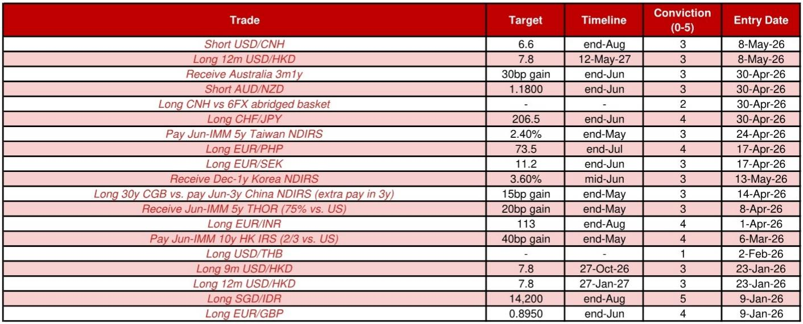
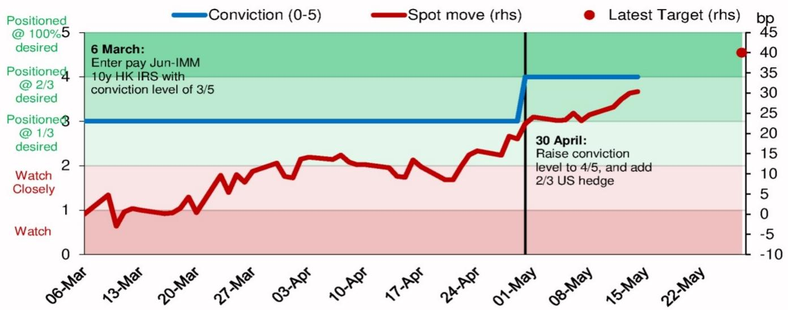

# Hong Kong Long-End Rates Are Poised to Reprice Higher as Structural Supply-Demand Imbalances Finally Shift

The most significant mispricing in Asian fixed income markets today is not in the front end, where rate expectations have been well telegraphed and priced. It sits in the long end of the Hong Kong dollar interest rate swap curve, where a persistent structural compression has created an opportunity that is now beginning to reverse. For months, bank treasury desks have been forced to receive long-tenor swaps simply to obtain duration exposure, compressing Hong Kong rates well below their historical relationship with US rates. That dynamic is changing. A pick-up in non-financial HKD bond supply, a recovering residential property market, and a wide spread versus US rates all point to the same conclusion: the long-end Hong Kong rate floor has been reached, and the next move is higher.

This is not a tactical view about a single data point or a central bank meeting. It is a structural argument about the rebalancing of supply and demand in a market that has been artificially pinned down by a lack of duration assets. The thesis is supported by three independent drivers, each of which reinforces the others. When supply increases, loan growth recovers, and valuation remains cheap relative to history, the probability of a sustained move upward in long-end rates becomes high.

The timing matters. Hong Kong's first quarter GDP growth surprised sharply to the upside at 5.9 percent year-on-year, well above consensus expectations. Residential property prices have rebounded to their highest levels since October 2023. These are not isolated data points. They represent a macro stabilization that has implications for loan demand, bank balance sheets, and ultimately the path of interest rates. The question is not whether long-end Hong Kong rates will rise, but how far and how fast.

Investors who have been positioned for lower or stable long-end Hong Kong rates need to reconsider that assumption. The structural forces that kept rates low are fading, and the new regime will require a different set of expectations.

## A Structural Shortage of Long-Duration HKD Assets Has Artificially Compressed Yields, and That Shortage Is Now Easing

The single most important driver of long-end Hong Kong rate outperformance over the past year has been a persistent shortage of long-duration HKD bonds. With subdued loan growth and limited corporate issuance beyond the five-year tenor, bank treasury desks have faced a structural problem: they need duration exposure to manage their asset-liability positions, but the market has not been supplying enough long-dated paper. The result has been a mechanical bid for long-tenor interest rate swaps, as banks have had to receive fixed rates to synthetically create the duration they cannot obtain in the cash bond market.

This dynamic has been powerful enough to push the 10-year Hong Kong-US swap spread to as wide as negative 88 basis points in March, far below its historical average. It is a textbook case of a market distortion created by supply-demand imbalance rather than by fundamental macro expectations.

That imbalance is now correcting. Since April, a number of major Hong Kong entities have come to market with bonds of ten years or longer. The Hong Kong Airport Authority, MTR Corporation, the West Kowloon Cultural District Authority, and the Hong Kong government itself have all issued long-dated HKD paper. This is not a one-off event. The Hong Kong government's Northern Metropolis project, which is expected to run through the mid-2030s, will require sustained financing. Regular issuance of long-dated bonds is likely to become a structural feature of the market going forward.

The implication is straightforward: as supply increases, the artificial compression in long-end rates will unwind. Bank treasuries will no longer need to rely exclusively on receiving swaps to obtain duration. The cash bond market will absorb some of that demand, and swap spreads will normalize. The question is whether the supply increase will be large enough and sustained enough to fully close the gap. Early evidence suggests it will be, but the pace of normalization will depend on how quickly additional issuance comes to market and whether it is concentrated in the long end.

## Macro Stabilization and Property Market Recovery Are the Catalysts for Loan Growth That Will Further Pressure Long-End Rates

The supply-side argument is powerful on its own, but it is reinforced by what is happening on the demand side of bank balance sheets. Hong Kong's loan-to-deposit ratio has been stuck near historic lows, with the latest March reading at 72.3 percent. This has been a second factor keeping long-end rates low, because weak loan demand means banks have had less need to compete for deposits or to hedge their interest rate exposure aggressively.

That is changing. Hong Kong's first quarter GDP growth of 5.9 percent year-on-year was well above expectations and represents a clear macro rebound. Residential property prices have recovered sharply, returning to levels not seen since late 2023. These two developments are connected. A stronger economy supports household income and confidence, which in turn supports mortgage demand. Higher property prices increase the collateral value of existing loans and encourage new borrowing.

The transmission mechanism from macro recovery to loan growth is not instantaneous. The loan-to-deposit ratio has not yet turned, and it may take several more months of sustained economic strength before banks report meaningful increases in lending. But the direction is clear. If the macro rebound continues, mortgage lending and overall loan growth will eventually pick up. When that happens, banks will need to manage their duration exposure differently. They will become less willing to receive long-end swaps, and the demand for long-duration assets will shift.

This is the second leg of the thesis. The supply side is already improving. The demand side is about to improve. Together, they create a powerful tailwind for higher long-end Hong Kong rates. The exact timing of the loan growth recovery is uncertain, but the direction is not.

## The Current Hong Kong-US Spread Remains Deeply Compressed Relative to History, Providing a Clear Valuation Anchor for the Trade

Even after the recent modest rebound from the March low, the 10-year Hong Kong-US swap spread remains at negative 73 basis points. This is well below the historical average and represents a valuation anomaly that is difficult to justify on fundamental grounds. The spread can be expected to narrow to at least negative 50 basis points if loan growth recovers, and potentially further if the supply-demand imbalance continues to correct.

The key question is whether the spread can widen from here if loan growth does not recover. The answer is probably not by much. If the loan-to-deposit ratio stays around current levels, the spread may oscillate around negative 80 basis points rather than collapsing further. This asymmetry is important. The downside risk to the spread is limited, while the upside potential is significant. This is exactly the kind of risk-reward profile that makes a pay-fixed position in long-end Hong Kong swaps attractive.

The front end of the Hong Kong curve has already been bid up, driven by a hot IPO pipeline, outright USD/HKD buying, and dividend payments by Chinese companies to H-share investors. Three-month HIBOR has moved higher since the start of April. But these front-end factors are well understood and largely priced in. The real opportunity, and the larger mispricing, remains in the long end.

The trade is to pay the 10-year Hong Kong IRS versus US rates, targeting a 40 basis point gain from entry. The conviction level is high, at 4 out of 5, reflecting the combination of improving supply dynamics, macro recovery, and cheap valuation. The timeline is through end-May, which is short enough to be actionable but long enough to allow the structural forces to play out.

## What the Report Does Not Fully Answer: The Interaction Between Global Rate Cycles and Local Supply Dynamics

For all its analytical rigor, the report leaves one important question unresolved. How will a potential shift in the global rate cycle interact with the local supply-demand dynamics in Hong Kong? The report focuses on Hong Kong-specific factors, but long-end Hong Kong rates do not exist in a vacuum. They are influenced by US Treasury yields, global risk appetite, and the broader Asian rate environment.

If US rates move significantly higher, the Hong Kong-US spread could remain wide even as Hong Kong rates rise in absolute terms. The trade is structured as a relative value trade against US rates, which hedges some of this global risk. But the dynamics of global rate repricing are not fully explored. What happens if the Federal Reserve pivots back to easing? Would that pull Hong Kong rates lower as well, or would local factors dominate?

Similarly, the report does not address the potential for a sharp slowdown in Hong Kong's macro recovery. The GDP surprise was large, but it could prove to be a one-off. If property prices stall or reverse, the loan growth catalyst would weaken. The report acknowledges this possibility by noting that the spread may not narrow much if the loan-to-deposit ratio stays low, but it does not fully explore the downside scenarios.

These are not criticisms of the analysis. They are the natural boundaries of any research report. The thesis is well-supported by the evidence presented, but investors should be aware that the interaction between global and local factors introduces an additional layer of uncertainty that the report does not fully resolve.

## A Decision Framework for Investors: How to Evaluate the Hong Kong Long-End Rate Trade

For investors considering this trade, a structured decision framework is useful. The first question is whether you agree with the supply-side thesis. If you believe that the recent pick-up in long-dated HKD bond issuance is a structural shift rather than a one-off event, then the case for higher long-end rates is strong. If you believe the issuance is temporary, the trade is less compelling.

The second question is about macro conviction. Do you expect Hong Kong's economic recovery to continue and to translate into loan growth? The evidence from GDP and property prices is positive, but leading indicators such as the loan-to-deposit ratio have not yet turned. Investors with a higher tolerance for uncertainty may be comfortable entering the trade now, ahead of confirmation. More conservative investors may prefer to wait for the loan data to improve before committing capital.

The third question is about relative value. The Hong Kong-US spread is cheap by historical standards, but cheap can become cheaper. The report argues that downside is limited, but investors should define their own stop-loss levels based on how much further compression they are willing to tolerate. A scenario in which the spread widens to negative 90 or 100 basis points is possible if loan growth remains weak and supply does not increase further.

The fourth question is about position sizing and conviction. The report assigns a conviction level of 4 out of 5, meaning the position is at two-thirds of the desired size. Investors should calibrate their own conviction based on their portfolio objectives and risk appetite. This is not a trade for the full position size, but for a meaningful allocation that reflects the favorable risk-reward profile.

Finally, investors should consider the timeline. The trade targets a 40 basis point gain by end-May, which is a relatively short horizon. If the catalyst does not materialize within that window, the position may need to be reassessed. Longer-term investors may choose to extend the timeline, but the report's framework is best suited for tactical implementation.

The full report contains additional data on conviction levels, entry dates, and performance tracking that can help investors refine their approach. The original charts provide visual context for the spread dynamics and the trade progression.

Join the community to read the full report and review the original charts.

*This article is for learning and discussion only and does not constitute investment advice.*

Personal reading notes and learning share only. Not investment advice.

