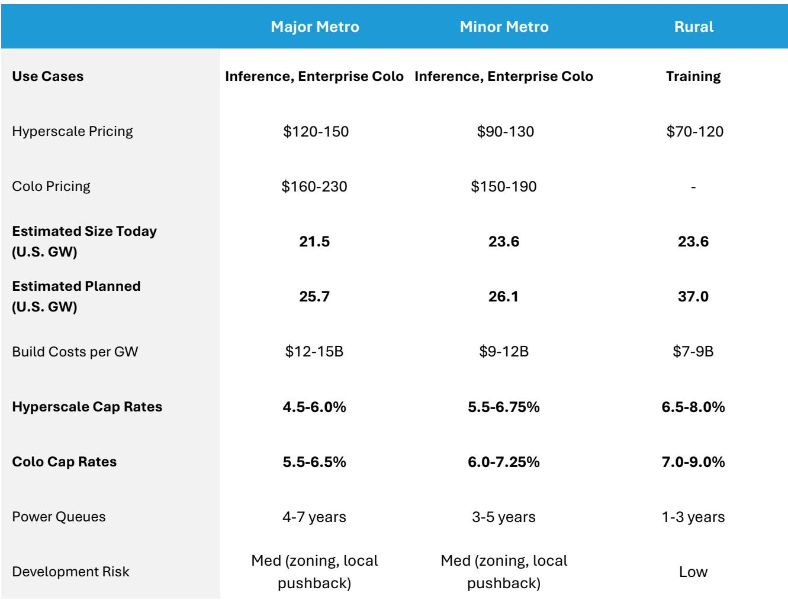

# Data Center Markets Are Not Created Equal: Why Location Strategy Determines Which Builders Will Win

The dominant narrative in data center investing today is one of insatiable demand and universal opportunity. Every week brings headlines about power constraints, permitting delays, and the insatiable appetite of hyperscale cloud providers for more compute capacity. The temptation is to treat the entire sector as a rising tide that lifts all boats. This is a strategic error.

The reality is far more nuanced. The data center market is not a single market. It is three distinct markets operating under fundamentally different economic and operational logics. The critical distinction lies not in the technology deployed inside the facilities, but in the geography of where those facilities sit. Location determines everything: power availability, build costs, pricing power, vacancy risk, and ultimately, the durability of returns.

A global investment bank report provides a rigorous framework for understanding these differences. The analysis segments the U.S. data center landscape into three archetypes—Major Metro, Minor Metro, and Rural markets—and then drills into the specific dynamics of Northern Virginia, Phoenix, and Atlanta. The findings are clear: the most valuable assets are concentrated in Major Metro markets, and the most sophisticated operators are those that have built their portfolios there. The gap between the best-positioned players and the rest of the field is widening, and it will only grow as the market matures.

This is not a moment for blanket enthusiasm. It is a moment for surgical selectivity. Investors who understand the hierarchy of market types will be able to separate the durable compounders from the speculative stories. Those who do not will find themselves holding capacity in markets where demand is uncertain, pricing is compressed, and exit options are limited.

## The Three Archetypes of Data Center Markets Are Defined by a Single Trade-Off: Latency Versus Power Versus Cost

Every data center location decision boils down to a trilemma. Users must balance three competing priorities: how close the facility needs to be to end users (latency), how much power is available and how quickly it can be delivered (power availability), and how much they are willing to pay (cost). Different workloads optimize for different corners of this triangle.

Major Metro markets—the top eight to ten urban hUBS in North America—are optimized for latency-sensitive applications. This includes AI inferencing, where milliseconds matter, and enterprise colocation, where businesses need to be physically close to network interconnection points. These markets are dense, expensive, and extraordinarily difficult to build in. Power queues stretch four to seven years. Build costs run $12 billion to $15 billion per gigawatt. Hyperscale pricing sits at $120 to $150 per kilowatt per month, with colocation pricing reaching $160 to $230. Cap rates are tight, between 4.5 and 6.5 percent.

The difficulty of building in Major Metros is precisely what makes existing capacity so valuable. Supply is constrained by zoning, local opposition, and utility timelines. New entrants face formidable barriers. The incumbents who already own land, permits, and power allocations in these markets possess an asset that cannot be easily replicated.

Minor Metro markets sit in the middle. These are smaller Cities or the outer edges of Major Metro regions. They offer marginally lower latency sensitivity and marginally higher price sensitivity. Build costs are lower—$9 billion to $12 billion per gigawatt—and power queues are shorter, at three to five years. Hyperscale pricing ranges from $90 to $130 per kilowatt per month. These markets have seen significant growth over the past five years, and that trend is likely to continue as overflow demand from Major Metros seeks available capacity.

Rural markets occupy the opposite end of the spectrum. They are optimized for large-scale AI training, which is latency-insensitive but power-hungry. Build costs are the lowest, at $7 billion to $9 billion per gigawatt. Power queues are the shortest, at one to three years. Hyperscale pricing is the cheapest, at $70 to $120 per kilowatt per month. But there is a catch: visibility to sustained demand is unclear. These markets attract speculative builds and less experienced developers. Cap rates are higher, ranging from 6.5 to 9 percent or more.

The pattern is unmistakable. As you move from Major Metro to Rural, you trade pricing power and demand certainty for lower costs and faster build times. The question is not which archetype is better in absolute terms. The question is which archetype aligns with the strategy and risk appetite of the operator—and, critically, which archetype offers the most durable competitive advantage.

## Northern Virginia, Phoenix, and Atlanta Reveal Three Distinct Approaches to Capturing the Data Center Opportunity

The report provides a detailed comparison of three top U.S. markets that illustrate the archetypes in practice: Northern Virginia, Phoenix, and Atlanta.

Northern Virginia is the crown jewel of the global data center industry. It has approximately 8 gigawatts of existing capacity, with another 5 gigawatts under construction. Power queues are reportedly in the seven-year range. Vacancy is below 1 percent. Pricing has only gone up over the past several years, currently around $217 per kilowatt per month. This is a market where demand consistently outstrips supply, where the best operators have deep relationships with utilities and local governments, and where new entrants face an almost insurmountable uphill climb.

Phoenix represents a different model. It is a power-advantaged growth market with relatively lower costs and more available land than Northern Virginia. Existing capacity is around 2.1 gigawatts, with significant planned expansion. Vacancy has declined sharply to around 1.3 percent. Pricing is competitive, but the market is still developing its ecosystem depth. The risk here is that the rapid buildout could overshoot demand if hyperscale commitments prove less durable than expected.

Atlanta sits in between. It is a rapidly scaling secondary hub that combines proximity to enterprise demand with improving power access. Existing capacity is approximately 2 gigawatts, with more than 3 gigawatts planned. Vacancy is around 2 percent, and pricing is roughly $175 per kilowatt per month. Atlanta is capturing spillover from constrained primary markets while maintaining a more balanced profile across pricing, growth, and development risk.

The report highlights that both Digital Realty and Equinix have been expanding their footprints in Atlanta, focusing on large hyperscale builds. This is a strategy that makes sense: Atlanta offers favorable market dynamics, and both companies are experienced builders with strong teams in Major Metros. The execution risk is relatively limited compared to building in a rural market with no track record of sustained demand.

The lesson is clear. The most valuable data center portfolios are those concentrated in Major Metro markets and the strongest secondary hUBS. These are the markets where barriers to entry are highest, where pricing power is greatest, and where demand visibility is clearest. The operators who have already established positions in these markets have a structural advantage that will be difficult for latecomers to overcome.

## The Report Leaves Critical Questions Unanswered About the Sustainability of Rural Builds and the Timing of Power Constraints

For all its rigor, the report does not fully resolve several important analytical questions. These are the gaps that investors should be thinking about most carefully.

First, the report does not provide a clear framework for assessing the durability of demand in Rural markets. The data shows that Rural markets have the largest planned capacity—37 gigawatts—compared to 25.7 gigawatts for Major Metros and 26.1 gigawatts for Minor Metros. But the report also notes that visibility to sustained demand in Rural markets is unclear. This is a significant caveat. If a sUBStantial portion of that 37 gigawatts is built speculatively and demand fails to materialize at the expected pace, the financial consequences could be severe. The report does not offer a methodology for stress-testing this scenario.

Second, the report does not fully address the second-order implications of power constraints in Major Metros. It notes that power queues in Northern Virginia are in the seven-year range and that NIMBYism is rising, particularly in Northern Virginia and Phoenix. But it does not explore what happens if these constraints become binding sooner than expected. If hyperscale customers cannot get power in the markets they prefer, they may be forced to accept higher-risk alternatives. This could compress pricing in Minor Metros and Rural markets, or it could drive a wave of consolidation as the largest operators acquire smaller players to gain access to their power allocations.

Third, the report does not quantify the risk that regulatory changes could alter the economics of any of these market types. Zoning policies, environmental regulations, and utility rate structures are all subject to change. A shift in any of these variables could have outsized effects on specific markets. The report acknowledges that development risk in Major Metros is "medium" due to zoning and local pushback, but it does not model the financial impact of a material regulatory headwind.

These are not criticisms of the report. They are the natural limits of any analysis that focuses on current data and observable trends. The value of a good framework is that it helps investors identify where uncertainty is highest and where additional diligence is most needed.

## A Decision Framework for Evaluating Data Center Investments Based on Market Type and Operator Quality

For investors seeking to apply the report's insights, a structured decision framework is essential. The following approach can help separate the opportunities from the traps.

Start with market type. Determine whether the asset or operator in question is concentrated in Major Metro, Minor Metro, or Rural markets. This single factor will tell you more about the risk-return profile than any other variable. Major Metro assets offer the highest pricing power and lowest vacancy risk, but they come with the longest lead times and highest build costs. Rural assets offer faster build times and lower costs, but they carry the highest demand uncertainty and widest cap rates.

Next, assess operator quality within the market type. Not all operators are equal. The report emphasizes that the two public data center companies, Digital Realty and Equinix, are overwhelmingly concentrated in Major and Minor Metros and are "among the most insulated from market noise." This is not an accident. These companies have spent decades building relationships with utilities, navigating zoning processes, and developing the operational expertise required to execute in complex markets. A less experienced developer attempting to build in a Major Metro faces a much higher risk of delays, cost overruns, and regulatory setbacks.

Third, evaluate the specific market dynamics within each archetype. Northern Virginia, Phoenix, and Atlanta are all Major or Minor Metros, but they have very different characteristics. Northern Virginia is a mature, supply-constrained market with premium pricing. Phoenix is a faster-growing, power-advantaged market with lower barriers to entry. Atlanta is a secondary hub that is still scaling. Each requires a different strategy and a different risk tolerance.

Fourth, stress-test the demand assumptions. The report's data on planned capacity is based on known open dates and announced builds. But not all planned capacity will be built. Some projects will be delayed, some will be canceled, and some will be absorbed more slowly than expected. Investors should ask: what happens to pricing and vacancy in this market if only 70 percent of planned capacity is delivered? What if it is 50 percent? The answers will reveal which markets have the most downside risk.

Finally, consider the exit options. Data center assets are not equally liquid across market types. Major Metro assets have a deep pool of potential buyers, including institutional investors, infrastructure funds, and the hyperscale operators themselves. Rural assets have a narrower buyer base and may be harder to sell in a downturn. The cap rate differential between Major Metro and Rural markets—nearly 200 basis points on the high end—reflects this liquidity premium.

## The Most Important Analytical Questions Remain Open, and the Full Report Contains the Charts That Bring the Data to Life

The data center industry is at an inflection point. Demand is surging, but supply is constrained in the most valuable markets. The operators that have already secured positions in Major Metros are well positioned to capture the lion's share of the value creation. The operators that are building in Rural markets face a more uncertain path.

But the report does not pretend to have all the answers. It leaves open several meaningful questions that deserve deeper exploration. How will the power constraints in Major Metros evolve over the next three to five years? Will regulatory changes shift the economics of any market type? How much of the Rural capacity pipeline will actually be built, and at what pricing? These are the questions that separate surface-level analysis from genuine strategic insight.

The full report contains the charts and data that make these dynamics visible. The exhibits on capacity growth, vacancy trends, and pricing across markets are essential for understanding the magnitude of the shifts underway. The comparison of the top ten providers shows which hyperscale operators are investing most aggressively and where they are placing their bets.

Join the community to read the full report and review the original charts.

*This article is for learning and discussion only and does not constitute investment advice.*

Personal reading notes and learning share only. Not investment advice.

