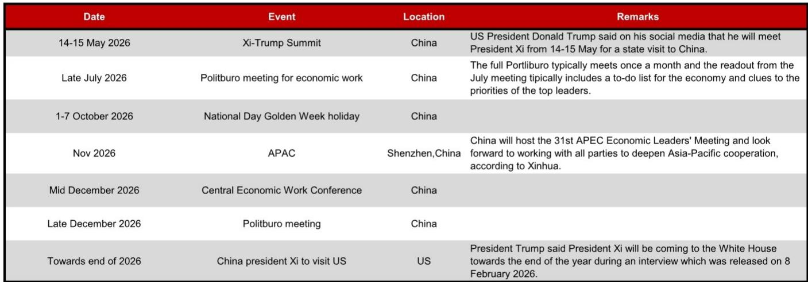
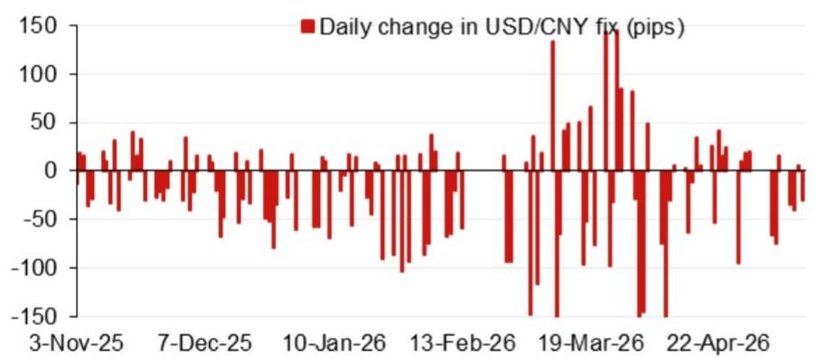

# 市场真正低估的不是汇率点位，而是定价机制的结构性切换

人民币中间价模型的最新投影指向一个值得深思的方向：模型预测值与实际定价之间的裂口正在扩大，但市场讨论大多停留在“会不会破7”这类表层问题。这份由某外资投行亚洲外汇策略团队发布的报告，真正值得关注的信号并非某个具体点位，而是中间价定价机制正在经历一次不易察觉但影响深远的切换——从被动反映市场波动，转向主动管理预期锚。

报告显示，截至2026年5月15日，其模型投影（不含逆周期因子）为6.7979，较前次6.8401下降422个基点，较前一日官方收盘价高出117个基点。加入逆周期因子后的投影为6.8217，较前次下降184个基点。这些数字本身并不惊人，真正值得拆解的是：模型误差为何持续偏离、逆周期因子为何在特定时点收窄、以及这些技术细节背后反映的政策意图重塑。

## 1. 模型误差的扩大不是精度问题，而是政策意图的信号

报告附带的模型误差图表揭示了一个被多数市场参与者忽略的事实：在过去一年多的时间里，模型误差并非随机波动，而是呈现出明显的方向性偏倚。2025年初，模型误差一度接近-1800个基点，意味着实际中间价远低于模型预测值；到2026年初，误差转为正值，实际中间价开始持续高于模型预测。

这种系统性偏倚无法用模型本身的统计缺陷来解释。任何成熟的中间价模型都会包含一篮子货币变动、隔夜美元走势等常规因子，误差的持续扩Daiwa方向转换，指向的是模型无法捕捉的政策行为——中间价设定正在越来越多地反映“预期管理”而非“市场均衡”。

这意味着，看中间价不能只看模型输出，更要看模型与实际定价之间的“政策溢价”。这个溢价的大小和方向，才是理解人民币汇率走向的关键变量。

## 2. 逆周期因子正在从“缓冲垫”变成“导航仪”

传统理解中，逆周期因子是央行在汇率大幅波动时使用的临时工具，类似于汽车上的缓冲装置。但报告提供的数据暗示，这一工具的使用方式正在发生质变。

模型投影加入逆周期因子后，从6.7979变为6.8217，调整幅度约238个基点。这个数字本身不大，但结合近期的使用频率和方向来看，逆周期因子已经不再只是“在极端情况下才启用”的应急手段。它正在成为日常定价的一部分，其功能从“对冲市场过度反应”转向“引导市场预期向政策目标收敛”。

尤其值得关注的是，在2026年3月19日，中间价单日调整幅度达到约150个基点，这是近期少有的显著变动。这一时点恰好处于中美高层会晤前夕。逆周期因子的使用节奏与重大事件日历高度吻合，说明它已经被纳入更宏观的政策协调工具箱。

对于投资者而言，这意味着不能再用“逆周期因子是否启用”这种二元框架来理解汇率政策。更准确的观察方式是：逆周期因子的使用方向和力度，实际上是一个高频的政策信号器，其重要性不亚于公开市场操作利率。

## 3. 真正驱动中间价变动的不是美元指数，而是事件日历

报告附带的日历显示，2026年密集分布着重大多边和双边政治事件：5月的中美领导人会晤、7月的政治局经济工作会议、11月的APEC会议、以及年底的中国领导人访美。这些事件的时间节点与中间价调整的节奏高度相关。

这引出一个被市场低估的判断：当前人民币中间价的定价逻辑，正在从“盯住一篮子货币”的规则导向，转向“服务于外交与经济议程”的相机抉择。这不是说央行放弃了规则，而是规则的内涵发生了变化——在新的框架下，汇率的“合意区间”是由外交日程、国内经济目标和金融市场稳定三重约束共同决定的。

例如，在重大峰会前保持汇率稳定，是国际外交的常见做法；而在国内重要经济会议前后，适度引导汇率以配合货币政策基调，也是合理选择。这意味着，预测中间价不能只看隔夜美元和美债收益率的变化，更要看未来两周到一个月内是否有重要政治事件。事件驱动的定价逻辑，正在取代数据驱动的定价逻辑。

## 4. 报告没有完全回答的关键问题：这个新框架的边界在哪里

这份报告最大的价值，不在于它给出了6.7979还是6.8217的预测，而在于它暴露了一个尚未被充分讨论的问题：如果中间价定价机制正在向“事件驱动+预期管理”切换，那么它的边界在哪里？

一个显而易见的问题是：这种切换是否可持续？如果市场持续偏离模型预测，最终会积累多大的套利压力？当前在岸与离岸价差、远期与即期价差尚未出现极端分化，但这并不意味着压力不存在。模型误差从负转正的过程，实际上就是政策主动引导与市场预期之间的“拔河”。

另一个未解问题是：当事件密集期过去，定价机制是否会回归模型主导？报告没有给出明确答案，但这恰恰是最值得持续跟踪的变量。如果政策溢价在事件结束后迅速消退，说明这只是一次战术性的管理；如果政策溢价持续存在甚至扩大，说明定价机制本身已经发生了结构性转变。

对于读者而言，理解这个问题比知道下一个中间价是多少更为重要。因为这决定了你用什么框架来观察汇率——是用技术分析看点位，还是用政策分析看信号。

## 5. 给你的观察框架：从盯点位转向盯“政策溢价”

基于以上分析，我们建议读者在关注人民币汇率时，建立一个三层观察框架，而不是只盯着6.8还是6.9。

第一层是模型基准层。理解一篮子货币变动和隔夜美元走势对中间价的理论影响。这部分信息透明、可量化，是判断政策溢价大小的基准线。

第二层是政策溢价层。关注实际中间价与模型预测之间的差值，以及逆周期因子的使用方向和力度。这个差值的大小和变化方向，是当前最值得跟踪的政策信号。

第三层是事件驱动层。将未来两周到一个月内的重大政治和经济事件纳入汇率分析框架。在事件密集期，政策溢价通常会扩大；在事件空窗期，模型基准的影响力会回升。

这三个层次不是独立的，而是相互影响的。当政策溢价持续扩大时，意味着事件驱动逻辑正在主导；当政策溢价收窄时，模型基准的影响力在回归。真正有价值的判断，不是预测某个具体点位，而是判断当前处于哪个逻辑主导的阶段。

这份报告没有给出这个问题的最终答案，但它提供了足够的数据和框架，让读者能够自己形成判断。如果你希望深入理解模型背后的数学细节、逆周期因子的历史使用模式、以及事件日历对汇率的具体影响路径，欢迎来我们的微信群里继续讨论。完整报告中的原始图表和附录提供了更丰富的数据维度，这些内容在这篇导读中无法完全展开。

Personal reading notes and learning share only. Not investment advice.

