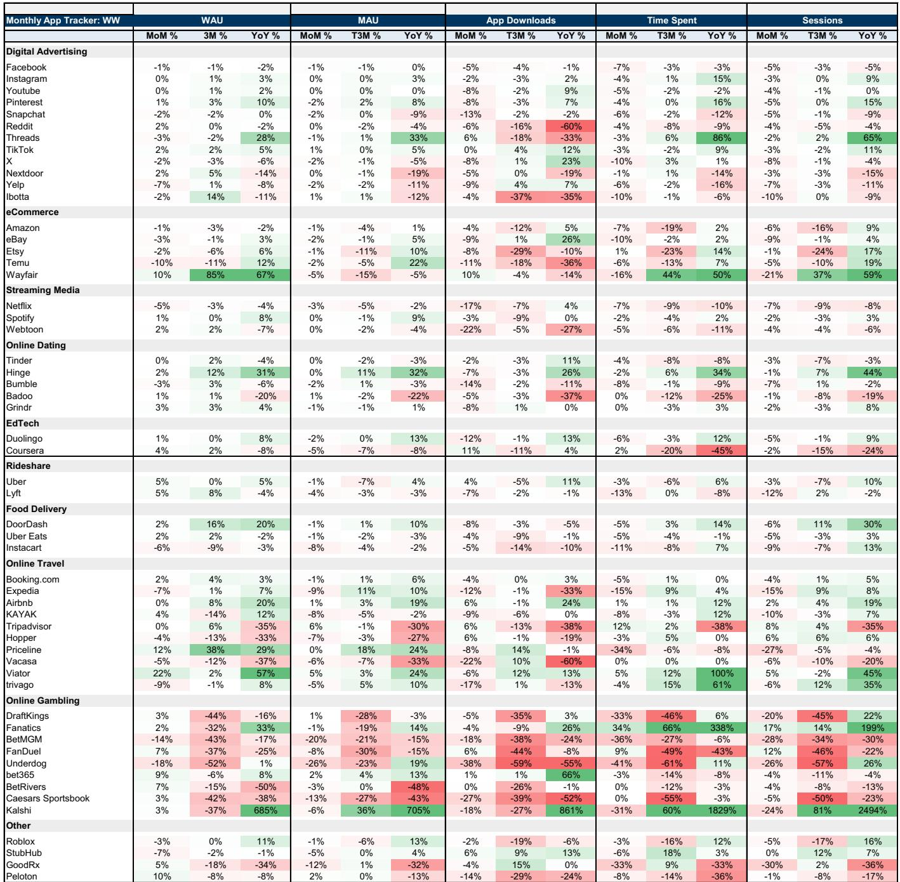
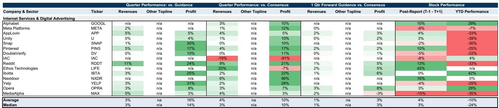

# The AI Infrastructure Bet Is No Longer About Capacity—It Is About the Speed of Revenue Conversion

The first quarter of 2026 revealed a critical inflection point for the largest technology platforms. After two years of relentless capital expenditure growth driven by artificial intelligence infrastructure, the investor conversation has shifted decisively away from whether spending is too high and toward whether the revenue from that spending can materialize fast enough to justify the scale of commitment. This is not a minor change in emphasis. It represents a fundamental repricing of risk across the entire internet and digital advertising ecosystem.

The evidence from the most recent earnings season is unambiguous. Companies that could articulate a visible pathway from capital deployed to revenue recognized were rewarded. Those that could not were penalized, often severely, regardless of the strength of their core business. The combined cloud backlog for Google Cloud and Amazon Web Services now stands at approximately $832 billion, up from $358 billion just six months ago. That staggering figure is the single most important data point in the sector today. It tells investors that demand for AI compute remains structurally undersupplied and that the imbalance between what enterprises want and what infrastructure can deliver will not reach equilibrium until at least the second half of 2027.

But backlog is not revenue. The central analytical question for the next twelve to eighteen months is how quickly that contracted demand converts into recognized income, and at what margin. The answer will determine which companies emerge from this investment cycle with enhanced competitive positions and which are left holding underutilized assets.

The stakes could not be higher. Year-to-date performance across the coverage universe has been predominantly negative, with median returns of negative 24 percent among digital advertising companies. This is not a reflection of weak underlying fundamentals. Digital consumer trends across commerce, online travel, mobility, and delivery were broadly positive. Digital advertising demand stabilized and, in many cases, exceeded expectations. The disconnect between operational performance and stock performance is driven entirely by the market's growing unease about the return profile of AI-related investments.

Three interconnected themes dominated investor debates during the earnings season, and each carries second-order implications that will shape portfolio construction for the remainder of 2026 and into 2027.

## The Revenue Backlog Is Massive, But the Clock Is Ticking on Conversion

The combined cloud backlog figure of $832 billion is more than double what it was just six months ago. This is not an accounting artifact. It reflects real contractual commitments from enterprises that are racing to secure access to GPU clusters, custom silicon capacity, and the associated platform services required to deploy AI workloads at scale. The rate of growth in this backlog suggests that the demand curve is still steepening, not flattening.

However, the market is now asking a more nuanced question: how much of this backlog will convert into revenue with the same margin profile as the companies' existing cloud businesses? The answer is not straightforward. The initial wave of AI workloads tends to be compute-intensive and margin-dilutive, particularly when delivered on rented third-party hardware. The margin expansion story depends on the ramp of custom silicon, the optimization of software stacks, and the migration of workloads from training to inference, which is typically more profitable.

Companies that provided clear visibility into this conversion trajectory were rewarded. Those that remained vague or pointed to multi-year time horizons saw their shares de-rate. This suggests that the market is no longer willing to give management teams the benefit of the doubt on AI spending. It wants evidence, not promises.

The second-order implication is that we are entering a phase where capital allocation discipline will become a differentiator. Companies that can manage the tension between investing aggressively to capture backlog and protecting near-term margins will command premium valuations. Those that cannot will face persistent multiple compression, even if their absolute revenue growth remains impressive.

## The Digital Consumer Is Strong, But the Macro Backdrop Is Fragile

The earnings season delivered broadly positive data on digital consumer behavior. E-commerce, online travel, food delivery, and mobility all showed healthy demand. The digital economy continues to capture an outsized share of consumer wallet, and the secular trends toward convenience, personalization, and on-demand services remain intact.

Yet there is a growing unease beneath the surface. The consumer landscape is increasingly bifurcated. Higher-income households are spending freely, while lower-income cohorts are showing signs of strain. Input costs for consumers remain elevated, and the lagged effects of prior inflation cycles are still working through household budgets. Several companies outside the coverage universe have flagged softening discretionary spending, and the risk is that digital platforms, which have been disproportionate beneficiaries of consumer spending shifts, may eventually face headwinds as well.

The critical question is whether the digital economy's structural advantages can insulate it from a broader consumer slowdown. The evidence from previous cycles suggests that digital platforms are not immune to macro weakness, but they tend to recover faster and gain share during downturns. The current environment is complicated by the fact that digital advertising budgets, particularly brand advertising, showed increased uncertainty in late Q1 and into Q2, driven by geopolitical volatility. Direct-response and performance-based advertising remained resilient, but the brand advertising pause could signal that corporate confidence is fraying.

For investors, the implication is clear: the bull case for digital consumer stocks now depends on the macro environment remaining stable. Any deterioration in consumer confidence or spending power will test the resilience of even the strongest platforms. The next four to six weeks of industry channel checks will be critical in determining whether current forecasts hold or need to be revised downward.

## Investment Cycles Without Clear Return Profiles Are Being Punished

The third theme is perhaps the most consequential for stock selection. Companies that announced new investment initiatives, platform changes, or strategic pivots without providing clear visibility into the expected return profile were penalized. This was particularly evident for companies that flagged 2026 as a year of emphasizing growth investments over margin optimization, or that cited changing compute costs as a reason for altered financial trajectories.

This dynamic is not limited to any single sUBSector. It affected social media platforms investing in AI features, delivery companies expanding into new verticals, and streaming services increasing content spend. The common thread is that the market has lost patience with open-ended investment stories. It wants to see a line from capital deployed to revenue generated to margin expansion.

The implication for portfolio construction is that companies with high visibility into their investment returns will outperform those with opaque strategies, even if the latter have more ambitious growth targets. This favors platforms that can demonstrate a direct link between AI spending and advertising revenue growth, or between infrastructure investment and cloud backlog conversion.

Notably, some companies have already begun to address this concern. Those that discussed revenue backlog, the protection of non-AI operating margins, and the rising margin profile of AI workloads were better received. This suggests that management teams that proactively provide the market with the tools to model investment returns will be rewarded with higher valuations.

## What the Report Does Not Fully Answer: The 2027 Capex Trajectory and Its Implications

The report provides extensive analysis of the current earnings season and the near-term outlook, but it leaves several critical questions unanswered. The most important of these is the trajectory of capital expenditure in 2027 and beyond.

Current estimates for 2027 capex across the three largest hyperscalers have already been revised upward from approximately $586 billion to roughly $700 billion following the Q1 earnings season. This is a dramatic increase, and it reflects both rising input costs and the accelerating pace of infrastructure buildout. However, the qualitative commentary from management teams about 2027 remains early and directional. No firm guidance has been provided, and the range of possible outcomes is exceptionally wide.

The report does not fully explore the implications of a scenario in which capex continues to grow at this pace while revenue conversion lags. If backlog growth slows or if enterprise AI adoption hits a temporary adoption plateau, the gap between investment and return could widen significantly. This would create a period of negative free cash flow for even the strongest platforms, and the market reaction to such a scenario would likely be severe.

Conversely, if revenue conversion accelerates and margins expand faster than expected, the current valuation discounts could prove to be significant buying opportunities. The report acknowledges this uncertainty but does not provide a framework for weighing the probabilities of these two outcomes.

A second unresolved question is the long-term impact of the agentic economy on consumer compute usage patterns. The report references a deep dive on the agentic economy and its potential to make consumer computing more diffuse, more token-dependent, and more compute-intensive. But the timeline for this transition remains highly uncertain. If agentic AI use cases take off faster than expected, the demand for compute could accelerate further, justifying even higher capex. If adoption is slower, the current infrastructure buildout could prove excessive.

These open questions are not weaknesses of the report. They are honest acknowledgments of the limits of current visibility. But they are precisely the questions that will drive stock performance in the second half of 2026 and into 2027.

## A Decision Framework for Investors Navigating the AI Investment Cycle

For investors trying to position portfolios in this environment, the following framework may be useful. It is derived from the patterns observed during the Q1 earnings season and is designed to help differentiate between companies that are likely to benefit from the current cycle and those that are at risk.

The first filter is revenue backlog visibility. Companies that can provide concrete, quantified data on contracted future revenue from AI-related services have a structural advantage. They allow investors to model the conversion timeline and to assess the margin trajectory with greater confidence. Companies that cannot provide this data are effectively asking the market to trust them, and trust is in short supply.

The second filter is the relationship between capex growth and free cash flow. Companies that can maintain or improve free cash flow generation while increasing investment are demonstrating capital efficiency. Those that see free cash flow deteriorate as capex rises are signaling that their investments are not yet yielding returns. The market is increasingly focused on this metric, and the divergence between GAAP operating income and free cash flow is becoming a source of concern.

The third filter is the platform's ability to offset AI-related cost increases through other efficiencies. Companies that can protect their non-AI operating margins while scaling AI investments are in a stronger position than those that are relying solely on AI revenue to cover the incremental costs. This is particularly relevant for companies with large, mature advertising businesses that can fund AI investments from existing cash flows.

The fourth filter is competitive positioning within the digital advertising market. The bifurcation between scaled platforms with AI-powered advertising solutions and smaller platforms without such capabilities is intensifying. Companies with scaled AI offerings are capturing market share even within categories where they already have majority share. Smaller platforms are facing headwinds, particularly those exposed to muted sectors like consumer packaged goods.

Applying this framework to the current coverage universe suggests that the strongest risk-reward profiles are found among companies that score highly on all four filters. These are the platforms that can demonstrate backlog conversion, maintain free cash flow, protect non-AI margins, and gain advertising market share. Companies that score poorly on one or more filters are likely to face continued valuation pressure, even if their core businesses remain healthy.

## The Unresolved Analytical Questions That Should Drive Your Next Move

The Q1 earnings season has clarified many things, but it has also raised new questions that will define the next phase of the AI investment cycle. The most pressing of these is whether the current pace of capex growth is sustainable without a corresponding acceleration in revenue growth. The report's data suggests that the answer depends on the speed of backlog conversion, which is inherently uncertain.

A second question is whether the digital consumer's resilience can withstand a broader economic slowdown. The data from the earnings season was positive, but the forward commentary from companies outside the coverage universe has been more cautious. The next round of industry channel checks will be critical in determining whether the digital economy's structural advantages can overcome macro headwinds.

A third question is how the agentic economy will reshape competitive dynamics. If agentic AI use cases become a major driver of compute demand, the current infrastructure investments will look prescient. If adoption is slower than expected, the overhang of underutilized capacity could weigh on returns for years.

These are not questions that can be answered with a single data point or a single earnings season. They require ongoing analysis, industry engagement, and a willingness to update views as new information emerges. The report provides an excellent foundation for this work, but it is not the final word.

Join the community to read the full report and review the original charts.

*This article is for learning and discussion only and does not constitute investment advice.*

Personal reading notes and learning share only. Not investment advice.

