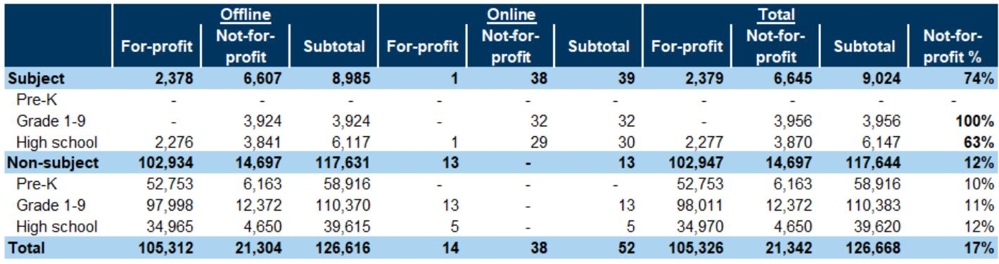

# 字节跳动正在重塑中国教育科技竞争格局，而非学科培训本身

过去两年，市场对中国教育科技行业的讨论始终围绕两个叙事：一是“双减”后的学科培训监管余波，二是AI大模型能否真正改变教育产品的商业逻辑。2026年4月的最新数据表明，这两个叙事都需要被重新审视。

某外资投行发布的4月中国教育行业追踪报告揭示了一个关键信号：字节跳动旗下的Doubao Study日活用户同比增长加速至128%，成为中国第六大AI原生应用；同时，TAL（好未来）的学而思网校MAU同比增长加速至22%，而学习平板ASP连续4个月环比回升。这些数据合在一起指向一个结论——市场真正低估的不是需求端的反弹，而是供给侧的再定价：AI能力正在重新定义教育产品的价值锚点，而率先完成这一转变的公司正在获得结构性溢价。

这份报告的核心价值不在于逐月跟踪GMV或MAU，而在于提供了一个观察框架：当AI教育应用的用户规模突破10%的K-12学生渗透率时，竞争维度将从“谁有更多线下网点”转向“谁能把AI能力转化为可持续的付费意愿”。

## 1. 字节跳动的AI教育产品正在从“流量实验”走向“商业验证”

Doubao Study在4月底的DAU达到330万，同比增长128%，增速较3月的112%进一步加速。更重要的是，它在字节跳动内部的AI产品矩阵中已经占据了明确位置：在DAU规模上仅次于Doubao主应用、DeepSeek、Qwen、腾讯元宝和AQ，位列第六。考虑到Doubao Study是一个垂直教育场景的产品，这一排名意味着字节跳动在AI教育领域的投入已经获得了显著的规模效应。

更值得关注的是海外市场。Gauth在4月推出两项新功能：Gauth Atlas（将知识点转化为动态视觉知识地图的交互工具）和AI Live Tutor（在东南亚市场推出的AI直播辅导）。这些功能推动Gauth的月度账单收入同比增长35%至约100万美元，过去12个月累计账单收入达到1290万美元。虽然绝对规模仍然较小，但Gauth的月度账单收入/平均DAU指标同比增长49%至0.35美元，显示其变现效率正在快速提升。

这里的关键洞察是：字节跳动在教育AI领域的策略并非简单的“流量变现”，而是通过产品功能迭代来提升用户付费意愿。Gauth Atlas和AI Live Tutor的推出，本质上是在解决AI教育产品最核心的痛点——如何让用户为AI辅导付费，而不是仅仅把它当作一个免费的搜题工具。如果这一模式被验证可行，它将直接影响市场对AI教育赛道的TAM（总可及市场）估值逻辑。

## 2. 学习平板市场的结构性分化揭示了一个正在形成的“高端化”趋势

4月主要品牌学习平板在主流电商平台的合计GMV同比下降2%，环比下降47%。表面上看，这是一个疲软的数据。但深入看品牌层面的表现，会发现完全不同的故事：猿辅导同比增长68%，TAL同比增长20%；而小度同比下降60%，步步高下降40%，作业帮下降24%，科大讯飞下降9%。

这种分化不是偶然的。TAL的学习平板ASP同比下降幅度收窄至6%，同时环比连续4个月回升至约4000元。TAL在3月推出的X5 Ultra型号定价5900元（国家补贴后4900元），这一高端型号的推出正在拉高整体ASP。换句话说，TAL正在通过产品高端化来对抗行业整体的价格压力。

这里的核心问题是：学习平板市场的竞争逻辑是否正在从“性价比”转向“功能溢价”？如果答案是肯定的，那么拥有AI内容生态和品牌溢价的玩家将获得结构性优势。报告没有完全展开的是，TAL的平板GMV增速（+20% yoy）与其MAU增速（+22% yoy）之间的相关性——这可能意味着用户增长正在直接转化为硬件销售，而不是简单的渠道铺货。

## 3. 线下牌照的持续收缩与线上用户增长形成“剪刀差”，头部玩家正在获得双重优势

4月非学科类校外培训牌照数量延续下降趋势。与此同时，好未来和TAL的线下学习中心在4月环比扩张了低个位数百分比。这组数据意味着：监管对线下培训的收紧并未停止，但头部公司仍然有空间增加网点——这只能说明它们正在从中小机构手中夺取市场份额。

线上数据同样支持这一判断。非学科类在线辅导平台的MAU同比增长加速至14%，而学科类非营利平台的MAU同比下降21%。TAL的学而思网校MAU同比增长22%，较2月的10%和3月的15%显著加速；好未来的MAU同比增长6%。这些数字表明，头部品牌正在同时从线上和线下两个渠道获取增量用户。

报告尚未完全回答的一个问题是：线下牌照的持续减少是否会成为行业集中度提升的加速器？如果监管环境不变，中小机构的退出将不可避免，而头部公司凭借品牌、资金和AI能力将获得更大的市场份额。但这里的关键变量是——AI教育应用是否会替代部分线下需求，从而改变整个行业的供需结构？

## 4. 海外留学市场的结构性放缓正在改变教育服务商的增长逻辑

澳大利亚和加拿大在2026年1-2月发放给中国学生的学生签证数量同比下降6%，其中澳大利亚下降5%，加拿大下降9%。这一数据延续了过去两年的趋势：主要英语留学目的国对中国学生的签证政策持续收紧。

对于以海外留学咨询为核心业务的教育服务商来说，这意味着TAM正在收缩。但报告没有展开的是，签证数量的下降是否会导致留学客单价上升（因为学生转向更贵但签证更容易的国家或项目），以及是否会有更多学生转向国内替代方案（如国际学校、中外合作办学项目）。这些二阶效应对于评估相关公司的估值至关重要。

## 5. 这份报告留下的最大悬念：AI教育的商业化拐点何时到来？

报告的数据质量很高，但它对AI教育商业化的判断仍然处于“跟踪”而非“结论”阶段。Gauth的月度账单收入达到100万美元，但相对于字节跳动整体营收而言仍然微不足道。Doubao Study的DAU增长很快，但它的变现模式是什么？是订阅费、广告还是硬件导流？报告没有给出明确的答案。

同样，TAL的学习平板ASP连续回升，但这究竟是产品高端化的结果，还是因为补贴到期后的自然价格回归？报告指出5月是TAL平板销售的最大季度，这意味着接下来的数据将决定季度增速能否持续。如果5月数据出现大幅波动，那么4月的ASP回升可能只是短期现象。

这些未解问题恰恰是理解中国AI教育行业未来走向的关键。AI教育产品的用户规模已经达到足够大的基数，但商业模式是否成立、用户付费意愿能否持续、竞争壁垒是否足够高——这些问题的答案将决定哪些公司能够从“流量玩家”进化为“利润机器”。

---

欢迎来星球微信群里继续讨论：AI教育产品的变现路径究竟应该怎么走？字节跳动的教育策略对TAL和好未来意味着什么？学习平板的高端化趋势能否持续？这些问题的答案可能就在完整报告的原始图表和详细数据中。

Personal reading notes and learning share only. Not investment advice.

