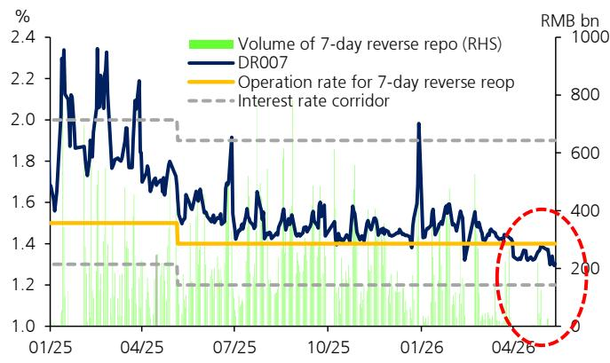

# China's Credit Contraction Is Not a Liquidity Problem—It Is a Demand Problem That Policy Alone Cannot Solve

The April 2026 credit data forces a fundamental reassessment of China's economic trajectory. New RMB loans turned negative for the first time in recent memory, contracting by RMB 10 billion against a consensus expectation of RMB 300 billion in new issuance. This is not a modest miss. It is a structural signal that China's private sector has withdrawn from the credit markets in a manner that conventional policy tools have failed to reverse. The total social financing print of RMB 625 billion, less than half the consensus estimate of RMB 1.25 trillion, confirms that the weakness is broad-based and deepening.

The narrative that China's economy is experiencing a temporary soft patch no longer holds. What we are witnessing is a demand-side credit collapse masked by ample interbank liquidity. The People's Bank of China has kept the banking system awash with cash—the 7-day repo rate has drifted to 1.3 percent, below the 1.4 percent policy operation rate, and the volume of daily reverse repo operations has fallen to negligible levels of RMB 0.5 to 1 billion. Yet this liquidity is not translating into credit creation. The transmission mechanism is broken, and the reasons are more structural than cyclical.

This article argues that China has entered a credit demand trap where policy accommodation primarily inflates interbank liquidity rather than stimulating real-economy borrowing. The implications for investors, corporate strategists, and policymakers are profound: the traditional playbook of rate cuts and reserve requirement reductions will not suffice. What is required is a fundamental shift in how credit demand is generated, which in turn demands answers to questions the current data does not yet provide.

## The Collapse in Private Sector Credit Demand Reflects a Deeper Structural Shift, Not Merely Cyclical Weakness

The headline numbers demand scrutiny. New RMB loans contracted by RMB 10 billion in April, a deterioration of RMB 290 billion year-on-year. But the composition reveals the true nature of the problem. Medium- and long-term household loans contracted by RMB 341 billion, a year-on-year decline of RMB 218 billion. Medium- and long-term corporate loans declined by RMB 410 billion, a year-on-year plunge of RMB 660 billion. These are not marginal adjustments. They represent a wholesale retreat from borrowing by the two largest engines of credit demand in the Chinese economy.

The household sector's retreat is particularly telling. Chinese households have historically been among the most leveraged in the world, with mortgage debt driving property-driven growth. The sustained contraction in household loans suggests that the property market downturn is not merely a price correction but a fundamental shift in household balance sheet behavior. Households are deleveraging, not re-leveraging. This is consistent with declining property transactions, falling home prices, and a pervasive shift in consumer confidence that no amount of mortgage rate cuts has been able to reverse.

Corporate behavior is equally concerning. The RMB 410 billion decline in medium- and long-term corporate loans suggests that businesses are not only postponing investment but actively repaying existing debt. This is the hallmark of a private sector that has lost faith in the return on investment. When companies prefer to reduce leverage rather than borrow at historically low interest rates, the problem is not the cost of capital—it is the absence of profitable investment opportunities. The local government financing vehicle debt swap may have contributed to the statistical decline in lending, but it cannot explain the magnitude of the corporate retreat.

The one bright spot in the data—bill financing rising by RMB 1.2 trillion, a year-on-year increase of RMB 409 billion—actually reinforces the bearish narrative. Bill financing is short-term, often policy-driven, and typically a last resort for banks to meet lending targets. Its surge indicates that banks are being pushed to extend credit but cannot find willing borrowers for meaningful investment projects. The rise in bill financing is a symptom of distress, not a sign of recovery.

## The Credit Impulse Has Turned Sharply Negative, Signaling That the Economy Is Losing Momentum from Credit Creation

The credit impulse—a measure of the change in new credit flows as a share of GDP—is one of the most reliable leading indicators for economic activity in China. In April, it turned more negative to minus 1.9 percent of GDP, compared to minus 0.4 percent in March. This is not a gradual deterioration. It is a sharp acceleration in the withdrawal of credit support from the economy.

To understand why this matters, consider the mechanism. China's economic model has historically relied on credit-intensive growth. Property development, infrastructure investment, and manufacturing expansion have all been funded through bank lending and shadow credit. When the credit impulse turns negative, it means that the flow of new credit is declining relative to the size of the economy. This has direct consequences for GDP growth, employment, and corporate earnings. The lag between a negative credit impulse and economic slowdown is typically three to six months. The April data suggests that the economic headwinds will intensify in the second half of 2026.

The sequential growth momentum of total social financing decelerated sharply to 4.3 percent month-on-month at a seasonally adjusted annualized rate, down from 12.3 percent in the prior month. This is a collapse in the pace of credit creation. On a three-month moving average basis, seasonally adjusted new credit flows softened to 23 percent of GDP, down from 25 percent in March. The trend is unambiguous: the engine of credit-driven growth is losing power.

The official year-on-year total social financing growth rate slowed by only 0.1 percentage point to 7.8 percent, which may give the impression of stability. This is misleading. The year-on-year comparison is distorted by base effects from a weak April 2025. The sequential data and the credit impulse provide a far more accurate picture of the current trajectory. The economy is not stabilizing. It is decelerating, and the deceleration is being driven by a collapse in credit demand that the year-on-year growth rate obscures.

## The PBC's Liquidity Withdrawal in April Reveals a Policy Dilemma: Too Much Liquidity, Too Little Demand

The People's Bank of China withdrew a net RMB 762 billion in liquidity in April through a combination of open market operations, medium-term lending facility, and pledged supplementary lending. This may seem counterintuitive given the weak credit data. Why would the central bank tighten liquidity when the economy is clearly struggling?

The answer lies in the distinction between liquidity and credit demand. Interbank liquidity has been exceptionally ample. The 7-day repo rate has been hovering around 1.3 percent, below the 1.4 percent policy operation rate, indicating that banks have more cash than they need. The volume of 7-day reverse repo operations has been extremely low, with the PBC reporting that it has fully met the demand from primary dealers. The problem is not that banks lack funds to lend. The problem is that they lack creditworthy borrowers who want to borrow.

The PBC's liquidity withdrawal is therefore not a tightening of policy but a technical adjustment. When banks do not need to borrow from the central bank because they are awash in deposits and cannot find lending opportunities, the central bank naturally drains excess liquidity to prevent rates from falling too far. The withdrawal is a symptom of the demand problem, not a cause of it.

The loose liquidity condition likely has two drivers. First, as noted in the report, soft credit demand means that banks are not deploying their deposits into loans, leaving them with excess reserves. Second, stronger foreign exchange conversion from exporters in light of RMB appreciation has added to domestic liquidity. The PBC's foreign exchange reserves have been on an upward trend over the past four months, reflecting capital inflows that further complicate the policy environment.

This creates a policy dilemma. The PBC has kept liquidity accommodative to boost money and credit growth, but the accommodation is not working. Financial regulators could use administrative measures to urge banks to increase lending, but this risks creating bad loans if the lending is not supported by genuine demand. The central bank is caught between the need to stimulate the economy and the reality that its tools are ineffective when the private sector refuses to borrow.

## The Report Raises Critical Questions That the Data Cannot Yet Answer

The April credit data is clear in its direction, but it leaves several open questions that are essential for understanding the outlook. These questions are not merely academic. They will determine whether the current weakness is a prelude to a deeper downturn or a temporary adjustment that policy can eventually address.

First, what is the role of local government financing vehicle debt swaps in depressing the loan data? The report notes that LGFV debt swaps may have continued to depress RMB lending, but the magnitude is unclear. If a significant portion of the loan contraction is due to accounting changes rather than genuine demand weakness, the outlook may be less dire than the headline numbers suggest. However, if the swaps are simply shifting debt from one balance sheet to another without generating new economic activity, the impact on growth is still negative.

Second, can administrative measures from financial regulators succeed where interest rate cuts have failed? The report suggests that regulators could use administrative measures to urge banks to increase lending. This has been tried before in China, with mixed results. The risk is that forced lending creates asset bubbles or non-performing loans that only defer the problem. The question is whether the political will exists to accept the short-term costs of a credit-led recovery versus the longer-term costs of financial instability.

Third, what is the trajectory of household deleveraging? The contraction in household loans is unprecedented in scale. If households continue to reduce debt, the property market will remain under pressure, and consumption will be constrained. But if household confidence stabilizes, the demand for mortgage and consumer credit could recover. The data does not tell us which scenario is more likely.

Fourth, how will the PBC respond if the credit impulse remains negative? The central bank has room to cut policy rates further and to reduce reserve requirements. But if the transmission mechanism remains broken, further accommodation will simply add to interbank liquidity without stimulating credit. The PBC may need to consider unconventional tools, including direct lending to the private sector or fiscal-monetary coordination. The report does not address these possibilities, but they are the logical next steps if current policies continue to fail.

## A Decision Framework for Investors and Strategists Navigating the Credit Demand Trap

For investors and corporate strategists, the April credit data requires a shift in analytical framework. The traditional approach of monitoring policy announcements and liquidity conditions is no longer sufficient. The key variable is no longer the supply of credit but the demand for it. This demands a different set of questions and indicators.

First, monitor household balance sheet behavior rather than property transaction volumes. The contraction in household loans suggests that the property market weakness is not just a supply-side issue but a demand-side balance sheet adjustment. Track household savings rates, consumer confidence indices, and mortgage repayment data. If households continue to deleverage, property-related sectors will remain under pressure regardless of policy easing.

Second, focus on corporate investment intentions rather than credit availability. The corporate loan contraction indicates that companies are not seeing attractive investment opportunities. Track capital expenditure plans, capacity utilization rates, and corporate cash holdings. If companies continue to hoard cash rather than invest, the industrial recovery will be delayed.

Third, analyze the composition of total social financing rather than the aggregate growth rate. The shift from long-term loans to short-term bill financing is a warning sign. If this trend continues, it suggests that credit is being used for liquidity management rather than investment. This is not supportive of sustainable growth.

Fourth, watch for signs of fiscal-monetary coordination. The current policy framework relies on monetary easing to stimulate credit demand, but this is failing. The next logical step is for fiscal policy to take a larger role, either through direct government spending or through guarantees that reduce the risk of private sector lending. If the government announces a significant fiscal expansion, it would signal a recognition that monetary policy alone cannot solve the demand problem.

Fifth, prepare for volatility in Chinese asset prices. The combination of weak credit demand, ample liquidity, and policy uncertainty creates a fragile environment. Interbank rates could spike if the PBC misjudges the timing of its liquidity operations. Bond yields could rise if the market begins to price in fiscal expansion. Equity markets could remain under pressure until there is clear evidence of a recovery in credit demand.

## The Unresolved Analytical Gap: The Data Does Not Tell Us Whether This Is a Cyclical Low or a Structural Break

The April credit data is unequivocally weak, but it does not answer the most important question: is this a cyclical trough from which recovery is possible, or a structural break that permanently alters China's growth model? The answer will determine investment strategies, corporate planning, and policy responses for the next several years.

The cyclical argument holds that China's economy has experienced similar credit slowdowns in the past, notably in 2015 and 2018, and has recovered each time through a combination of policy easing and administrative measures. According to this view, the current weakness is exacerbated by the property market downturn and trade uncertainty, but the underlying growth drivers remain intact. Once confidence returns, credit demand will rebound, and the economy will re-accelerate.

The structural argument is more concerning. It holds that China's credit-intensive growth model has reached its natural limits. The property sector is structurally overbuilt. Infrastructure investment has diminishing returns. The demographic dividend is exhausted. And the private sector is increasingly reluctant to borrow because the expected return on investment has fallen below the cost of capital. According to this view, the current credit weakness is not a temporary soft patch but a permanent downshift in the economy's credit intensity. Recovery will require not just policy easing but fundamental structural reform.

The April data provides evidence for both arguments, but it does not resolve the debate. The sharp contraction in loans could be a one-time adjustment as households and companies reassess their balance sheets. Alternatively, it could be the beginning of a prolonged period of credit restraint. The next several months of data will be critical. If credit demand recovers in May and June, the cyclical view will be validated. If it continues to weaken, the structural view will gain credibility.

Join the community to read the full report and review the original charts.

*This article is for learning and discussion only and does not constitute investment advice.*

Personal reading notes and learning share only. Not investment advice.

