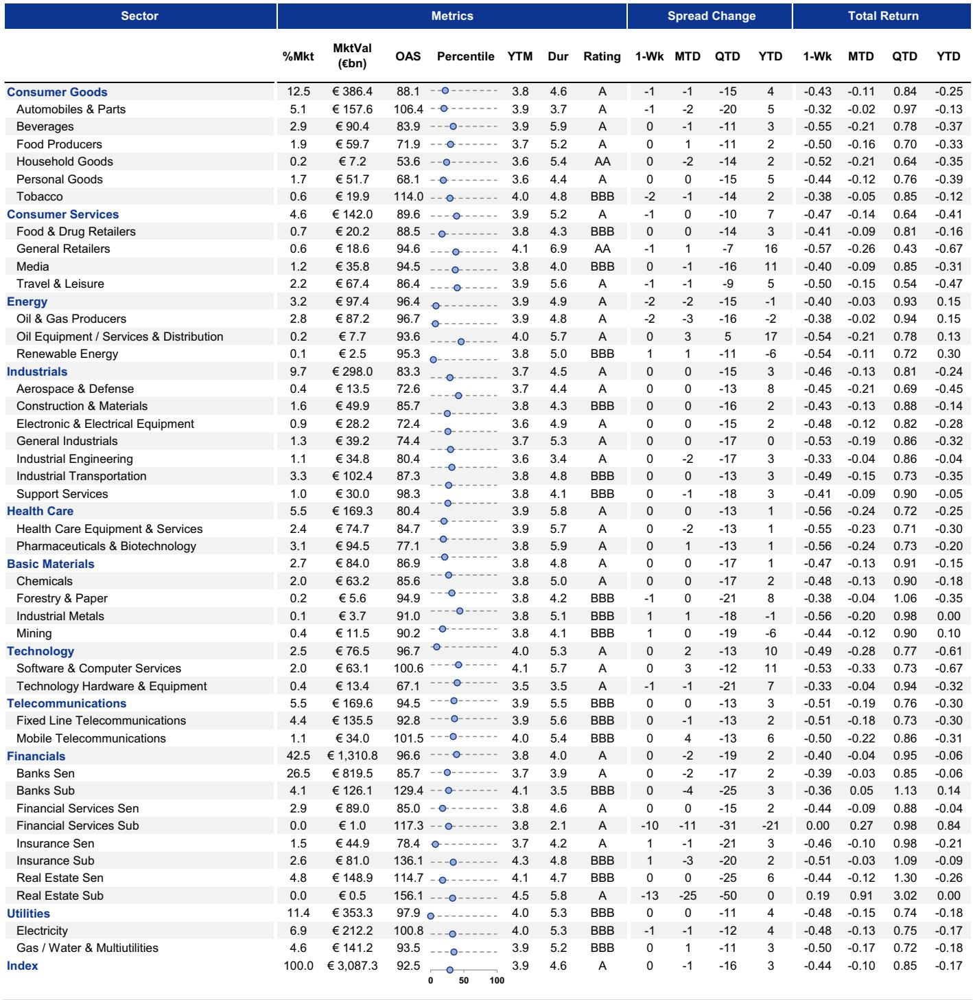
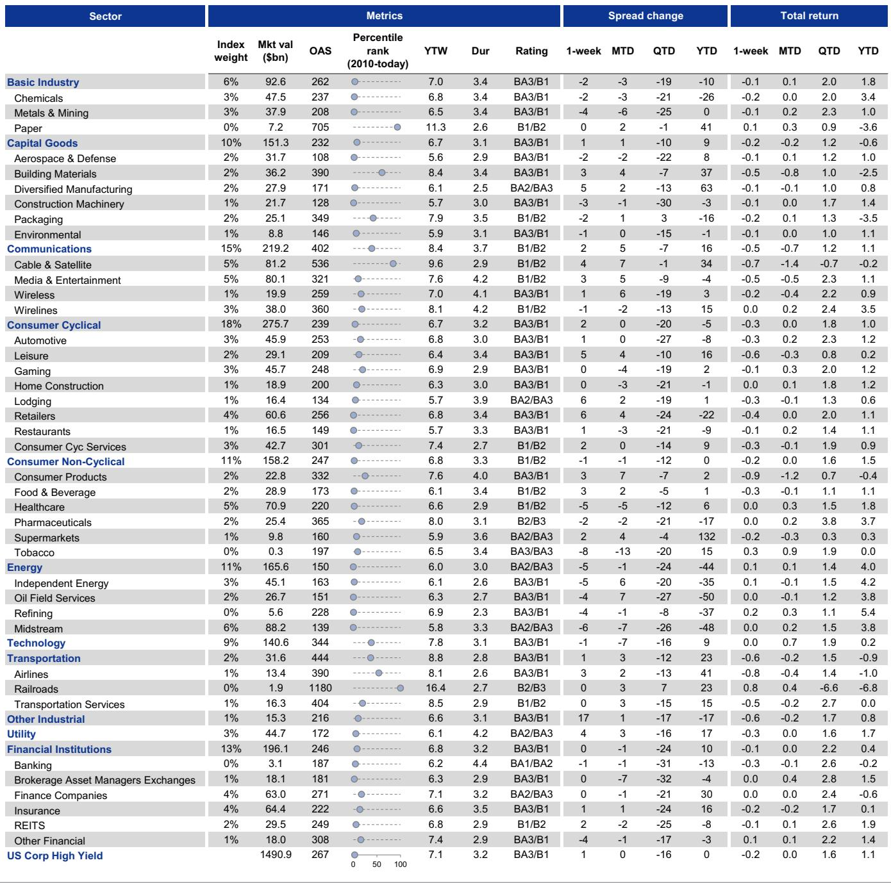

# The Default Cycle Has Peaked, But the Real Risk for Credit Investors Lies in the Structure of Defaults, Not Their Count

The aggregate default rate in leveraged finance has likely seen its high for this cycle. In the United States, the broadly syndicated loan market has already passed its peak, and high-yield bond defaults have been oscillating in a narrow, historically moderate range. For investors who have spent the last two years bracing for a wave of corporate distress, this is the headline they have been waiting for. But focusing on the absolute level of defaults alone is a strategic error. The market has shifted from a cycle defined by the *frequency* of defaults to one defined by their *nature*. The real risk to capital is no longer whether a company will default, but how it will default. The structural shift toward distressed exchanges, the rising phenomenon of repeat defaults, and the steady erosion of recovery rates are creating a far more complex and treacherous landscape than the aggregate default statistics suggest. The central argument of this analysis is that the peak in default *activity* is behind us, but the peak in default *complexity* and *loss severity* is very much still in front of us, particularly for investors who are not discriminating between the mechanisms of distress.

This cycle has not been a replay of 2008 or 2020. It has been a slow, grinding process of capital structure repair, driven by higher-for-longer interest rates and a selective economic slowdown. The result is a market where the tools of restructuring have become more sophisticated, more prevalent, and, paradoxically, more damaging to ultimate recovery outcomes. A global investment bank report on the state of play for leveraged finance defaults provides the data to build this case. The report’s core insight is that the composition of defaults matters more than the total count. The shift toward distressed exchanges, the prevalence of loan-only capital structures, and the sectoral dispersion of distress all point to a market where passive credit exposure is no longer a viable strategy. Active credit selection, informed by a deep understanding of restructuring mechanics, is now the prerequisite for preserving capital.

The following sections unpack the five key themes that define the current default environment. We will examine why the aggregate peak is likely behind us, why distressed exchanges are a double-edged sword, why recovery rates are structurally lower, which sectors are actually at risk, and what the forward-looking indicators suggest. Finally, we will identify the critical analytical gaps that the report leaves open and translate its findings into a decision framework for credit investors.

## The Aggregate Default Peak Is Likely Behind Us, But Only Because the Macro Backdrop Has Stabilized, Not Because Corporate Balance Sheets Are Healthy

The most important single data point from the report is the trajectory of the default rate. In the US, the 12-month trailing issuer-weighted default rate for leveraged loans peaked at 7.4% in late 2024 and has since fallen to 5.1%. US high-yield bond defaults have been range-bound between 3% and 4% for the past two years. These are not alarming numbers by historical standards. They sit near the median of the past two decades. The report’s conclusion that the peak is behind us is conditional on a critical assumption: that there is no sharp deterioration in the growth backdrop. This is a reasonable baseline, but it is not a guarantee. The report is essentially saying that if the economy continues on its current path of moderate growth, the default cycle has already expressed itself. The companies that were most vulnerable to the rate shock have already restructured or defaulted.

The strategic implication is that for US credit investors, the macro-driven, systemic default risk has diminished. The easy part of the credit cycle is over. The next phase will be micro-driven, idiosyncratic, and far more difficult to hedge with broad market exposure. The distinction between the US and Europe is crucial here. The report notes that European defaults are still trending higher, driven by a more challenging mix of growth, inflation, and monetary policy. This regional divergence means that a global credit portfolio cannot be managed with a single macro view. The US is in a stabilization phase, while Europe is still in a late-cycle deterioration phase. The key insight is not that defaults are low, but that the macro conditions that drove the last wave of defaults are no longer intensifying. The market is now transitioning from a rate-driven cycle to a fundamental, company-specific cycle.

## Distressed Exchanges Have Become the Dominant Restructuring Tool, But They Are Creating a Growing Population of Repeat Defaulters That Are Dragging Down Recovery Rates

The report’s most striking finding is the structural shift in the *method* of default. Distressed exchanges and pre-packaged Chapter 11 filings now account for 70-80% of all defaults, depending on the market. This is not a temporary anomaly. It is a permanent feature of the modern leveraged finance landscape. Distressed exchanges are attractive to sponsors and borrowers because they are faster, cheaper, and less disruptive than in-court restructurings. They allow companies to extend maturities, reduce coupon payments, or swap debt for equity without the stigma and legal costs of a formal bankruptcy. On the surface, this seems like a positive development. The report shows that initial recovery rates for distressed exchanges are significantly higher than for hard defaults. In 2025, US HY senior unsecured recovery rates for distressed exchanges averaged around 60%, compared to roughly 10% for hard defaults.

But this initial benefit masks a deeper problem. Distressed exchanges are often incomplete fixes. They provide just enough relief to keep the company alive, but not enough to put it on a sustainable path. The report’s data on repeat defaults is the most important analytical contribution here. Across both US and European markets, distressed exchanges lead to a repeat default roughly 50% of the time within three years. In-court restructurings, by contrast, rarely lead to a repeat default. The logic is clear: a formal bankruptcy process forces a more comprehensive balance sheet cleanup. A distressed exchange, driven by sponsor preference and creditor coordination challenges, often kicks the can down the road. The result is a growing population of zombie companies that default, restructure, and default again, each time with lower recovery values.

The strategic implication for investors is profound. If you are a holder of a bond or loan that undergoes a distressed exchange, you cannot assume that the restructuring is the end of the story. It is often just the beginning of a multi-year process of value erosion. The report’s data suggests that each successive restructuring systematically erodes recovery outcomes. This means that the expected recovery value of a distressed exchange is not the headline 60% figure, but a probability-weighted average that accounts for the high likelihood of a second or third restructuring. For credit investors, this argues for a more aggressive stance on exiting positions before a distressed exchange, rather than holding through it in the hope of a clean recovery.

## Recovery Rates Are Structurally Lower, Driven by the Rise of Loan-Only Capital Structures and the Repeat Default Feedback Loop

The aggregate decline in recovery rates is not a cyclical phenomenon. It is a structural shift in the credit market. The report tracks the 12-month trailing recovery rate for US senior unsecured bonds and first-lien loans over the past 20 years and finds a clear downward trend. Two structural factors explain this. First, the proliferation of loan-only capital structures. Over 70% of loans are now issued by companies that have no high-yield bonds outstanding, up from just 45% in the past. In a mixed capital structure, the high-yield bond provided a subordination cushion that protected loan recovery values. Without that cushion, first-lien loans are more exposed to total enterprise value declines. Second, the repeat default phenomenon. Each time a company defaults and restructures, the capital structure becomes more complex, the creditor base becomes more fragmented, and the remaining asset base is further depleted. The feedback loop is self-reinforcing.

The strategic implication is that the traditional recovery assumptions embedded in many credit models are outdated. The assumption that a first-lien loan will recover 70-80% of par in a default is no longer reliable. The report’s data shows that recovery rates are trending lower and are increasingly dependent on the specific capital structure and restructuring path. For investors, this means that the risk-reward calculus for leveraged loans has fundamentally changed. The incremental yield pickup from owning a loan versus a bond may not compensate for the structural decline in recovery rates. This is particularly important for investors who rely on historical recovery data for their portfolio construction and risk management. The past is no longer a reliable guide to the future.

## The Sector Composition of Distress Is Shifting Away from the Narrative of Software Disruption and Toward Capital-Intensive and Consumer-Facing Businesses

The prevailing market narrative has focused on the potential disruption of software and technology companies, driven by the rise of artificial intelligence and changing spending patterns. The report’s data challenges this narrative head-on. The sector composition of defaults still skews heavily toward capital-intensive industries and consumer-facing businesses. This is consistent with the macro backdrop of higher interest rates and persistent inflation. Capital-intensive businesses, such as industrials, chemicals, and metals, are more sensitive to borrowing costs and input price volatility. Consumer-facing businesses, particularly those in the lower and middle market, are being squeezed by the cumulative impact of inflation on household budgets.

The strategic implication is that credit investors should be wary of following the herd on sector rotation. The most obvious distress risk, software, is not the one materializing. The risk is in the sectors that are less exCiting but more exposed to the real economy. This argues for a bottom-up, fundamental approach to sector allocation, rather than relying on top-down thematic narratives. The report’s data also suggests that the European default picture is more heavily influenced by the commodity market disruptions, which have disproportionately affected energy-intensive and materials sectors. A global credit investor needs to have a differentiated view of sector risk by region.

## The Forward-Looking Indicators Point to a Stable Near-Term Default Outlook for the US, But a Modest Increase for Europe, With the Loan Market More Vulnerable Than High-Yield Bonds

The report’s view on the outlook is nuanced and conditional. In the US, none of the metrics the authors monitor signal a near-term uptick in expected defaults. This is consistent with the view that the peak is behind us. In Europe, the report envisions a modest increase in defaults through year-end, driven by the more challenging growth, inflation, and monetary policy mix. The key statement is that defaults are expected to remain below the local peak. This is a cautious stabilization view, not a bullish forecast. The report also makes a critical distinction between asset classes: the loan market is more vulnerable than high-yield bonds. This is because loans are floating-rate instruments and have been more directly impacted by the rate hiking cycle. Additionally, the loan market has a higher proportion of loan-only capital structures, which, as discussed, are more vulnerable to recovery erosion.

The strategic implication is that investors should be underweight leveraged loans relative to high-yield bonds in both the US and Europe, particularly in the European market where the default outlook is still deteriorating. The report’s forward-looking indicators are not pointing to a crisis, but they are pointing to a continued divergence between asset classes and regions. The most important question for investors is not whether the default rate will rise or fall, but whether they are positioned in the right asset class and region to withstand the next phase of the cycle.

## What the Report Does Not Fully Answer: The Interaction Between Private Credit and the Syndicated Market, and the Liquidity Implications of Repeat Defaults

The report is comprehensive in its analysis of the syndicated credit market, but it leaves several critical questions unanswered. First, what is the interaction between the private credit market and the syndicated market in terms of default dynamics? Private credit has grown enormously in recent years, and many of the companies that have undergone distressed exchanges in the syndicated market may have also taken on private credit. How do the terms and covenants of private credit affect the likelihood and outcome of a distressed exchange? Second, what are the liquidity implications of the repeat default phenomenon? If a growing number of companies are in a state of perpetual restructuring, the secondary market for their bonds and loans becomes increasingly illiquid. This could create a feedback loop where illiquidity depresses prices, which in turn triggers further covenant breaches and defaults. The report does not provide a framework for assessing this liquidity risk. Third, the report focuses on issuer-weighted default rates, but it does not analyze the dollar-weighted default rate. If the companies that are defaulting are smaller in size, the dollar-weighted default rate may be much lower than the issuer-weighted rate. Conversely, if a large issuer defaults, the dollar-weighted rate could spike. Investors need to understand the size distribution of the default risk, not just the count.

## A Decision Framework for Credit Investors: How to Navigate the New Default Landscape

Based on the report’s findings, we can construct a three-step decision framework for credit investors. Step one: assess the restructuring mechanism, not just the default risk. When evaluating a credit, the key question is not whether it will default, but how it will default. If the likely path is a distressed exchange, the expected recovery is lower and the risk of a repeat default is higher. This argues for a higher spread premium on credits with loan-only capital structures and weak sponsor support. Step two: stress-test recovery assumptions. Do not rely on historical recovery averages. Build a probability-weighted recovery model that accounts for the likelihood of a repeat default. For a company with a loan-only capital structure and a history of prior restructuring, the expected recovery on a first-lien loan may be 40-50%, not 70-80%. Step three: prioritize sector and regional differentiation. The US is in a stabilization phase; Europe is still deteriorating. Within each region, avoid the narrative-driven sectors and focus on the data. Capital-intensive and consumer-facing sectors are where the distress is actually occurring. Software and technology, despite the headlines, are not the primary source of default risk. This framework is not a guarantee of performance, but it provides a structured way to think about the new default landscape.

## Join the Community to Read the Full Report and Review the Original Charts

The analysis presented here is based on a deep reading of a single report, but the data and charts that underpin these conclusions are essential for any serious credit investor. The original report contains detailed exhibits on default rates, distressed exchange shares, repeat default frequencies, and recovery rate trends across multiple markets and time periods. These charts are not just visual aids; they are the raw material for building your own analytical models. To fully understand the dynamics of the repeat default phenomenon, the erosion of recovery rates, and the sectoral dispersion of distress, you need to see the data for yourself. The report also includes forward-looking indicators that are updated on a regular basis. Joining the community gives you access to the full report and the original charts, allowing you to conduct your own analysis and draw your own conclusions. The credit market is entering a phase where active, data-driven decision-making is the only path to consistent returns. The full report is the starting point for that journey.

*This article is for learning and discussion only and does not constitute investment advice.*

Personal reading notes and learning share only. Not investment advice.

