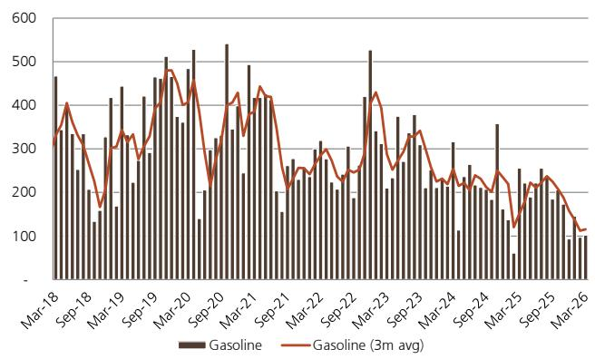

# 全球炼化产能正在经历一场未被充分定价的结构性断裂

四月的中国原油进口数据令人警觉。同比下降20%，至3847万吨，创下2022年7月以来的最低水平。但真正值得关注的不是这个数字本身，而是它背后正在发生的一个更深层变化：全球炼化产能正在经历一场远超过往任何一次地缘冲突的物理性破坏，而市场对这一冲击的定价仍停留在“短期扰动”的框架里。

某外资投行最新发布的月度石油报告中，一个关键判断值得反复推敲：中东地区的炼化产能受损规模，已经远超2025年秋季俄罗斯炼厂无人机袭击高峰期的受影响量。后者当时被市场视为重大事件，而前者——规模数倍于彼——却尚未被充分消化。

这份报告的核心信号可以概括为一句话：全球成品油供给侧的收缩不是暂时的，而是结构性的；中国作为全球最大的成品油潜在出口国，其出口政策的任何微调，都将成为重塑全球炼化利润分配的关键变量。

## 1. 中东炼化产能的受损规模远超市场认知，且修复周期可能以年为单位

报告引用的数据显示，海湾合作委员会（GCC）区域受袭击影响而停产的炼化产能超过350万桶/日，其中超过200万桶/日可能已遭受实质性损坏，需要某种形式的修复才能重启。作为参照，2025年秋季俄罗斯炼厂遭受无人机袭击的高峰期，受影响产能不足100万桶/日。

这意味着什么？当前中东炼化产能的受损规模，是俄罗斯此前“重大事件”的三倍以上。而GCC炼厂的平均开工率，报告估计可能仅维持在50%左右。

更关键的是，报告提出了一个被许多分析忽略的连锁反应：原油供给的短缺，最终会转化为成品油供给的短缺。某外资投行估算，即使以最大速度释放战略石油储备，中东地区成品油出口的净缺口仍将达到约350万桶/日。而如果考虑实际释放节奏可能慢于理论假设，这一缺口可能更大。

这里需要追问一个“所以呢”：全球炼化产能的物理性损失，意味着成品油供给曲线的永久性左移。市场习惯于将油价波动归因于需求变化或地缘溢价，但这一次，供给侧的物理约束可能比需求端的变化更具持久性。

## 2. 中国炼厂的低开工率不是需求问题，而是政策与成本的双重挤压

报告显示，4月中国主要炼厂开工率降至70.8%，远低于2025年80%的平均水平。乍看之下，这似乎是需求疲弱的证据。但如果深入拆解，会发现三个层次的原因：

第一层，原油采购成本急剧上升。中东地缘风险推高了原油官方售价及运费、保险费，而国内成品油需求疲弱，导致炼厂无法向下游传导成本压力。

第二层，成品油出口受限。为确保国内能源供应，中国在3月暂停了成品油出口。这直接导致国内汽油和柴油库存高企，进一步压制了炼厂开工意愿。

第三层，也是报告尚未完全展开但值得关注的一点：山东独立炼厂开工率仅55.2%，与主营炼厂形成巨大反差。这意味着，在成本压力和政策限制下，国内炼化行业的产能出清正在加速。

所以，中国市场真正的问题不是“需求不够”，而是“出口阀门被关、成本压力上升、低效产能被迫退出”三者叠加。这组变量的任何一个发生变化，都会对全球成品油贸易流产生重大影响。

## 3. 成品油出口政策的微调，可能是全球炼化利润分配的最大变量

报告透露了一个值得高度关注的信号：根据路透报道，中国已批准5月向非香港地区出口50万吨成品油，较4月翻倍，约为冲突前水平的30%。

这是一个试探性的放松，但它的含义远不止于此。中国是全球最大的炼化产能国之一，其成品油出口量的任何变化，都会直接冲击亚太乃至全球的成品油供需平衡。

报告中的图表清晰展示了中国汽油和柴油净出口的长期下降趋势。但关键在于，如果国内库存压力持续攀升，政策制定者将面临一个两难选择：要么继续压制出口，忍受库存高企和炼厂亏损；要么逐步放开出口，让国内过剩产能去填补全球供给缺口。

后一种情景一旦发生，中国成品油出口将从“政策限制”转向“主动释放”，这将直接改变全球炼化利润的分配格局。报告对此着墨不多，但这是最值得推演的逻辑链条。

## 4. 全球炼化利润的“剪刀差”已经出现，但可持续性存疑

报告提供了两组令人印象深刻的数据：一是中国国内炼化利润在2026年预计将大幅攀升至约3200元/吨，远高于2025年的约1400元/吨；二是欧洲炼化利润同样在2026年显著高于历史均值。

这组数据的背后逻辑是：全球炼化产能受损，成品油供给收缩，炼化利润中枢上移。但这里有一个关键问题尚未回答——利润的可持续性取决于两个条件：一是受损产能能否在合理时间内修复，二是中国出口是否会被放开。

报告没有给出明确答案，但我们可以从数据中推导：如果GCC炼厂产能的修复需要以年为单位，而中国出口又受到政策约束，那么全球炼化利润的高位运行将不是短期现象，而是结构性的再定价。

但反之，如果中东局势缓和、产能快速修复，叠加中国出口放开，炼化利润将面临快速回落的风险。这就是当前市场分歧的核心所在。

## 5. 报告尚未完全回答的关键问题：中国原油库存的“缓冲垫”究竟有多厚？

报告提到，中国原油库存自3月以来保持相对稳定，约13亿桶，相当于76天的原油需求和超过100天的原油进口量。同时，汽油和柴油库存仍处高位。

这组数据看似提供了安全边际，但存在一个未解问题：库存的构成是什么？战略储备、商业储备、在途库存的比例如何？不同性质的库存，释放的灵活性和政策成本完全不同。

报告引用的图表显示，中国原油库存近年来整体保持平稳，但月度变化波动较大。4月库存变化与全球石油市场平衡出现背离，这本身就暗示了库存管理背后的政策意图可能比市场理解的更为复杂。

如果中国选择释放战略储备来平抑国内成品油价格，那么库存的安全边际将被压缩；如果选择维持库存水平而放开出口，则意味着对全球成品油供给的直接补充。这两种路径对炼化利润和油价的影响截然不同。报告没有给出倾向性判断，但这恰恰是读者最需要进一步讨论的议题。

## 6. 给决策者的观察框架：三个变量决定未来六个月的炼化利润走向

基于报告的推导，我们整理出一个简化的分析框架，帮助读者持续跟踪这一主题：

第一，中东炼化产能的修复进度。报告中的数据截止于4月，但后续的修复情况将直接决定全球成品油供给的紧张程度。建议关注GCC各国炼厂的官方重启时间表，以及实际产能恢复率是否达到预期。

第二，中国成品油出口政策的月度变化。5月的50万吨出口批准是一个信号，但更关键的是，这一趋势是否持续。如果6月出口配额继续增加，将意味着政策转向的确认。

第三，国内炼厂开工率与库存的联动关系。如果开工率持续低于75%，而库存仍在累积，政策放松出口的压力将不断增大。反之，如果开工率回升，则说明国内需求正在吸收过剩产能。

这三个变量中，任何一个发生方向性变化，都值得重新评估全球炼化利润的定价中枢。而当前市场对这一框架的关注度，显然不够。

---

以上是这份报告中最值得关注的几个判断。但正如我们讨论的，还有几个关键问题尚未得到充分回答：受损产能的真实修复周期有多长？中国库存释放的政策成本如何量化？全球炼化利润的高位能否持续到2027年？

这些问题，也恰恰是我们在社群中持续讨论的焦点。如果你希望看到完整的报告原文、原始图表数据，以及我们基于这些数据做的进一步推演，欢迎来知识星球的微信群里继续交流。那里有更深入的拆解，也有来自不同产业背景读者的交叉验证。

Personal reading notes and learning share only. Not investment advice.

