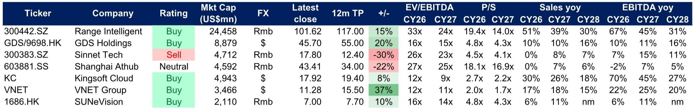
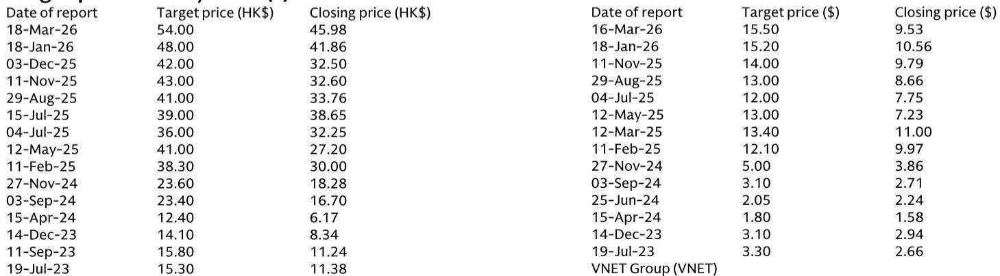
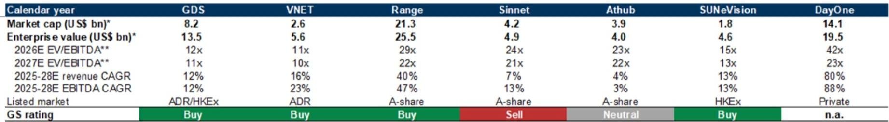

# China's Data Center Build-Out Is Entering a New Phase That Demands Selective Positioning, Not Broad Exposure

The narrative around China's AI infrastructure has shifted decisively from speculation to capital allocation. Over the next three years, China's five largest hyperscalers—ByteDance, Alibaba, Tencent, Baidu, and Kingsoft—are expected to deploy more than $250 billion in cumulative capital expenditures through 2028. That figure, drawn from a global investment bank report, represents a near-tripling of the spending trajectory that defined the 2022-2024 period. The scale is not the only story. What matters more is how this capital is being channeled and which data center operators are positioned to absorb it.

The conventional wisdom holds that rising AI demand lifts all data center boats. The data suggest otherwise. The report's analysis of China's data center operators reveals a market that is fragmenting along several axes: density of infrastructure, geographic location, business model evolution, and the ability to secure both power and financing. A simple bet on the sector is unlikely to outperform a carefully constructed selection of operators that match the specific demands of AI workloads.

The critical insight from the underlying research is that China's data center demand is projected to grow at a 20% compound annual rate from 2025 through 2028, pushing total demand from roughly 16 gigawatts to 27 gigawatts. Yet the live capacity of the sector is also expanding rapidly, and the utilization rate—currently around 41%—is expected to improve only modestly to 45% by 2028. This is not a market of uniform scarcity. It is a market where the right capacity in the right location at the right density commands a premium, while legacy capacity faces persistent pricing pressure.

For serious investors, the question is no longer whether AI infrastructure spending in China will grow. It is which operators will capture the most value from that growth, and which business models will prove sustainable as the technology cycle matures.

## The Shift to Higher-Density Infrastructure Is Reshaping Competitive Advantage Among Operators

The report makes clear that not all data center capacity is created equal. The AI workloads that are driving the current wave of demand require far higher power density per cabinet than traditional cloud or enterprise workloads. This is not a marginal difference. It fundamentally changes the economics of data center construction and operation.

Operators with live capacity that can be retrofitted or expanded to support higher-density configurations have a structural advantage. Those with older, lower-density assets face the risk of obsolescence or costly retrofits. The report's comparative analysis of China's major operators shows a clear divergence. Range Intelligent and GDS Holdings lead in both total capacity and pipeline capacity, with Range commanding 6.2 gigawatts of total capacity (live plus under construction and reserve) and GDS at 5.4 gigawatts. By contrast, Athub, rated Neutral, has only 0.4 gigawatts live and no pipeline capacity at all.

The strategic implication is straightforward: the race is for density and scale simultaneously. Operators that can deliver high-density capacity at scale, particularly in the western hUBS where power costs are lower and government incentives are stronger, are likely to see utilization rates and pricing that outperform the industry average. The report's utilization rate projections, which show only a gradual improvement from 41% to 45% by 2028, suggest that the aggregate figures mask significant dispersion. The best-positioned operators could run at much higher utilization, while weaker operators may struggle to fill cabinets.

## GPUaaS Is Redefining the Revenue Model, but the Economics Depend on Sustained Pricing Power

One of the most consequential developments in the report is the emergence of GPU-as-a-Service as a new business model for data center operators. Traditionally, data center operators derived revenue from colocation—renting space, power, and cooling. GPUaaS adds a layer of compute provisioning, where the operator owns the GPUs and charges for compute time.

The report's unit economics analysis is striking. For a typical GPUaaS deployment, revenue of 100 units breaks down as follows: power costs of 10, labor and maintenance of 3, colocation costs of 7, yielding EBITDA of 80. After depreciation of 72, EBIT stands at 8. This is a high-margin, capital-intensive business. The 80% EBITDA margin is attractive, but the thin EBIT margin means that any compression in pricing or decline in utilization can quickly erode profitability.

The report notes that GPUaaS pricing in the US has risen more than 30% year-to-date, from around $1.73 per hour in December 2025 to $2.35 per hour in March 2026. In China, H100 and H200 rental contract prices have also risen sharply, with H200 prices moving from 63 to 83 renminbi per hour between February and April 2026. This pricing environment is favorable for operators that have already deployed GPU capacity. The question is whether it is sustainable.

The risk is twofold. First, as more capacity comes online, pricing could normalize or decline. The report's US pricing chart shows a decline from $2.80 per hour in early 2024 to $1.70 by late 2025, before the recent uptick. Second, the availability of advanced GPUs in China remains constrained by export controls. Operators that cannot secure sufficient supply of high-end chips may find themselves unable to meet demand, while those with robust supply chains could capture outsized share.

For investors, the key metric to watch is not just GPUaaS revenue growth but the trajectory of pricing and utilization. If both hold, the economics are compelling. If pricing reverts to the trend of 2024-2025, the EBIT margins could turn negative for operators that paid peak prices for GPUs.

## Western China HUBS Offer a Cost Advantage That Is Underappreciated in Current Valuations

The report's geographic analysis reveals a structural shift in where new data center capacity is being built. China's "East-West Computing" policy has created 10 computing clusters, with the majority of intelligent computing power already concentrated in eight of them. These western hUBS—Inner Mongolia, Ningxia, Gansu, Guizhou—offer electricity prices as low as 0.35 renminbi per kilowatt-hour, compared to 0.40-0.50 in the eastern hUBS.

The cost advantage is significant. Power is typically the largest operating expense for a data center after depreciation. A 30% reduction in power costs can meaningfully improve EBITDA margins, particularly for high-density deployments that consume more power per cabinet. The report shows that the western clusters already account for 79% of China's intelligent computing power, and 70% of new computing power supply between 2021 and 2025 has been located there.

Yet the market may not be fully pricing in the implications. Operators with large pipelines in western hUBS, such as Range Intelligent with 2.5 gigawatts under construction or reserve in the Beijing-Tianjin-Hebei corridor and additional capacity in Gansu and other western regions, are building capacity that benefits from both lower power costs and proximity to major demand centers via low-latency fiber links.

The tension is between latency and cost. Western hUBS have higher latency to the eastern demand centers—Beijing, Shanghai, the Greater Bay Area—but for AI training workloads, latency is less critical than for real-time inference. As AI workloads shift from training to inference, the geographic calculus may change. Operators with diversified geographic exposure across both eastern and western hUBS are better positioned for both phases of the AI cycle.

## The Report Leaves Unanswered Questions About Financing, Utilization Trajectories, and Export Control Risk

No research report can answer every question, and the most valuable ones identify the open questions that will determine outcomes. This report leaves several that merit careful consideration.

First, the financing question. Data center construction is capital-intensive, and the report projects that China's hyperscalers will spend $254 billion on capex by 2028. For independent data center operators, financing this expansion requires access to debt and equity markets at favorable terms. Range Intelligent, with its A-share listing, has access to China's domestic capital markets. GDS has ADR and Hong Kong listings. But smaller operators may face constraints. The report's leverage scorecard shows significant dispersion, with Athub rated best on current leverage but worst on capacity growth. The trade-off between financial discipline and growth is acute.

Second, the utilization trajectory. The report projects China's data center utilization rate improving from 41% to 45% by 2028. This is a modest improvement, and it implies that a significant portion of new capacity may remain underutilized for some time. Which operators will bear the brunt of low utilization? The report's market share projections suggest that GDS, VNET, and Range will gain share, while Sinnet and Athub will lose share. But these projections depend on assumptions about order wins, customer relationships, and execution that are inherently uncertain.

Third, the export control risk. The report acknowledges that chip availability is a key risk for multiple operators. The US export controls on advanced semiconductors to China have created a bifurcated market: operators with access to high-end GPUs can offer GPUaaS at premium prices; those without may be limited to lower-margin colocation services. The direction of US policy is unpredictable, and any tightening could reshape the competitive landscape overnight.

## A Decision Framework for Positioning in China's Data Center Market

For investors seeking to build a position in this sector, the report provides the raw material for a structured decision framework. The framework should address four questions:

First, which operators have the capacity pipeline to meet the demand growth? The report's capacity data is clear: Range and GDS lead, followed by VNET. Operators with limited or no pipeline, such as Athub, are effectively betting that their existing capacity will appreciate in value, which is a less certain proposition.

Second, which operators have the business model to capture the highest-margin revenue? GPUaaS offers higher EBITDA margins than traditional colocation, but it also carries more capital intensity and pricing risk. Operators with a mix of colocation and GPUaaS, such as Range, may offer a better risk-reward profile than pure-play colocation operators.

Third, which operators have the geographic exposure to benefit from the shift to western hUBS? The report's cluster analysis suggests that operators with capacity in western hUBS have a structural cost advantage. Range's exposure to Beijing-Tianjin-Hebei and Gansu, along with its 2.5 gigawatt pipeline in the BTH corridor, positions it well.

Fourth, which operators have the financing capacity to execute their plans? The report's leverage and financing scores suggest that Range and GDS are better positioned than some peers. But the financing environment in China is dynamic, and changes in credit availability or equity market conditions could alter the outlook.

Applying this framework, the report's Buy ratings on Range, GDS, VNET, and Kingsoft Cloud appear consistent with the data, while the Sell rating on Sinnet and Neutral rating on Athub reflect the challenges facing operators with limited growth pipelines and business model exposure.

## The Critical Unresolved Analytical Question That Should Drive Further Investigation

The most important question the report raises but does not fully resolve is how the transition from AI training to AI inference will affect the demand for data center capacity. Training workloads require massive, dense compute clusters with high power consumption and relatively low latency sensitivity. Inference workloads require distributed, low-latency infrastructure closer to end users.

If the AI market in China follows the trajectory of the US, the inference phase could drive a second wave of demand that benefits different types of operators. Operators with capacity in eastern hUBS, close to population centers, could see a surge in demand for inference-optimized data centers. Operators with capacity concentrated in western hUBS could face a demand cliff as training demand plateaus.

The report does not model this transition explicitly. Investors who want to understand the full opportunity set should investigate which operators are building capacity for inference workloads, which have partnerships with AI application companies, and which are developing the software and networking capabilities to support distributed inference at scale.

Join the community to read the full report and review the original charts.

*This article is for learning and discussion only and does not constitute investment advice.*

Personal reading notes and learning share only. Not investment advice.

