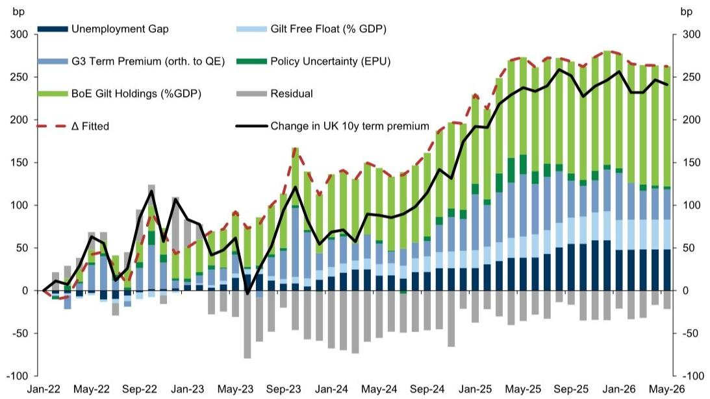

# 英国国债的困境并非孤例：全球长端利率的重新定价才是真正的故事

30年期英国国债收益率在本周突破5.8%，上一次触及这一水平还要追溯到1998年。对于关注全球固定收益市场的投资者而言，这个数字本身已经足够具有冲击力。但当下的关键问题不是“英国国债为什么跌”，而是“这种下跌究竟反映的是英国的特有问题，还是全球债券市场正在经历的结构性重估”。

某外资投行近期发布的一份深度研报，提供了一个值得认真审视的分析框架。核心判断是：英国国债的超额表现不佳，确实源于其自身宏观基本面的脆弱性——低增长、高通胀、最高的政策不确定性——但近几个月的收益率上行，更多是英国央行政策路径重新定价的结果，而非风险溢价的独立攀升。换言之，市场正在用更理性的方式重新评估所有发达市场的长端利率，英国只是这个全球叙事中最脆弱的环节。

---

## 1. 英国国债的“三重溢价”并非偶然，而是宏观脆弱性的直接映射

要理解英国国债为何在发达市场中表现最差，首先需要拆解其收益率构成中的三个层次。

第一层是通胀溢价。自2022年以来，英国经历了G4国家中最高的通胀水平，且通胀的持续性远超其他经济体。这不仅源于能源价格冲击，更与英国经济结构中的高通胀指数化程度有关——工资和价格体系中嵌入的自动调整机制，使得通胀一旦启动就难以迅速回落。

第二层是增长不确定性溢价。研报中引用的宏观不确定性调查数据显示，英国的预测分歧度在所有主要经济体中是最高的。这意味着市场参与者不仅对未来的增长路径没有共识，而且这种分歧本身就在推高长期债券的风险溢价。当债券的避险功能被高通胀削弱时，投资者要求更高的补偿是合理的。

第三层是政策反应函数不确定性溢价。一个值得注意的观察是：英国央行议息日的前端利率波动幅度，显著高于美联储、欧央行和日本央行。这意味着市场不仅对英国的经济前景没有把握，对央行会如何应对也没有把握。这种“双重不确定性”直接体现在期限溢价的定价中。

这三个溢价叠加，构成了英国国债相对于其他G4国家债券的“超额惩罚”。但关键在于，这种惩罚并非没有道理——它是英国经济现实在资产定价中的诚实反映。

## 2. 全球长端利率的同步重估才是更大的背景，英国并非孤例

如果将视线从英国移开，会发现一个更值得警惕的趋势：所有主要发达市场的长期国债收益率都在经历一轮显著的上行。30年期日本国债收益率处于数十年高位，30年期德国国债收益率达到欧债危机后最高水平，30年期美国国债收益率也接近本轮周期高点。

这意味着英国国债的表现不佳，有一部分是全球性因素驱动的。研报中提供了一个有说服力的证据：如果观察互换利差和10s30s曲线形态等相对定价指标，英国国债在最近几个季度实际上有所改善。换句话说，当全球长端利率都在上涨时，英国国债的相对恶化程度并没有表面上看起来那么严重。

这引出一个重要的分析结论：当前英国国债收益率的高企，并非单纯由英国自身的风险溢价上升驱动，而更多是“全球长端利率重估”在英国的映射。这个重估的背后，是后疫情时代通胀风险的系统性上升、央行资产负债表收缩带来的流动性变化，以及财政扩张导致的债券供给激增。

## 3. 供需结构的根本性变化：从养老金到央行的需求侧坍塌

研报中一个被低估的洞察是英国国债市场供需结构的根本性变化。2022年的英国养老金危机不仅是一次流动性事件，更是一个结构性拐点。

数据显示，英国养老金基金持有的国债比例从2019年的超过32%持续下降，而英国央行从2021年开始的量化紧缩意味着它从最大的国债买家变成了卖家。这两个趋势叠加，导致可自由流通的国债比例大幅上升——而且这种上升在久期加权基础上更为显著。这意味着市场上的“长钱”减少了，取而代之的是对价格更敏感的短期交易型资金。

这种需求侧的结构性变化，对国债定价产生了深远影响。当市场上的买家更多是追求流动性和交易利润的机构，而非持有到期的长期配置者时，债券价格对供给预期和宏观消息的敏感度都会上升。这也是为什么近期关于财政扩张的讨论会如此迅速地传导到国债收益率上——市场知道，真正愿意接盘的“稳定需求”已经大幅萎缩。

## 4. 量化模型揭示的真相：量化紧缩和全球因素解释了大部分期限溢价上升

研报中构建了一个期限溢价分解模型，将英国10年期国债的期限溢价拆解为五个驱动因素：失业率缺口、全球（G3）期限溢价、国债自由流通比例、政策不确定性、以及英国央行的国债持有量。

模型结果显示，英国央行量化紧缩导致的国债持有量下降，以及全球期限溢价的上升，是解释英国期限溢价高企的两个最主要因素。政策不确定性的贡献在2022年曾经显著，但近期已经减弱。失业率缺口的贡献则相对有限。

这个分解有两个重要含义。第一，它意味着英国国债的困境并非无解——量化紧缩终将放缓，全球通胀压力也会逐步消退。第二，它意味着单纯押注英国风险溢价回归历史均值，可能是一个错误的方向。因为当前的高水平中，有很大一部分是由全球性因素和央行政策行为驱动的，而这些因素短期内不会逆转。

## 5. 报告尚未完全回答的关键问题：财政压力与供给预期的二阶效应

研报中提出了一个重要但尚未充分展开的论点：关于未来债券供给的预期变化，可能是英国国债收益率预测的上行风险来源。具体而言，如果市场开始预期财政赤字将持续扩大——例如因为国防开支增加或财政规则调整——那么即使实际供给尚未增加，预期的变化本身就会推高期限溢价。

研报给出了一个量化估计：中期赤字每扩大1个百分点，可能导致英国国债收益率上升30至40个基点。这是一个值得关注的数字，因为它揭示了一个潜在的反馈循环——高利率导致财政压力加大，财政压力加大导致市场预期更宽松的财政政策，市场预期又反过来推高利率。

这个反馈循环的强度，取决于市场对英国财政纪律的信心。而当前的政治不确定性，恰恰在削弱这种信心。这个问题在研报中被提及但没有深入展开，可能正是需要进一步讨论的关键变量。

## 6. 投资者的观察框架：从“是否超卖”转向“什么因素会逆转”

对于关注英国国债市场的投资者而言，与其纠结于当前收益率是否“超卖”，不如建立一个更系统的观察框架，关注以下几个关键变量的边际变化。

第一是英国央行的量化紧缩节奏。研报的模型清楚地显示，央行资产负债表收缩是期限溢价上升的主要驱动力之一。因此，任何关于量化紧缩节奏放缓的信号，都可能成为收益率下行的催化剂。

第二是财政政策的可信度。市场对英国财政纪律的信心，是决定“财政溢价”大小的关键。如果新政府能够提出一个市场认可的财政整固计划，那么供给预期的上行风险就会缓解。

第三是相对价值指标。研报指出，互换利差和曲线形态等相对定价指标已经在改善。这意味着如果全球长端利率不再继续上行，英国国债的相对价值可能已经具备吸引力。但前提是英国自身的宏观不确定性开始下降。

第四是通胀预期的稳定性。英国的高通胀指数化程度意味着，一旦通胀预期变得不稳定，央行就需要更长时间维持高利率，这将对长端收益率形成持续压力。因此，观察通胀预期的锚定程度，比观察单月通胀数据更为重要。

---

以上分析基于投行研报的核心逻辑展开，但报告本身包含更多关于特定风险情景的量化分析、不同久期债券的相对价值比较，以及基于不同宏观假设的收益率路径推演。这些内容因篇幅限制未能在此展开。

欢迎有兴趣深入讨论的读者来星球微信群里继续交流。我们可以在群里进一步探讨：英国国债的供需结构变化是否会蔓延到其他市场？如果全球长端利率继续上行，哪些资产类别会首当其冲？以及，在当前收益率水平下，是否有值得关注的战术性交易机会？

Personal reading notes and learning share only. Not investment advice.

