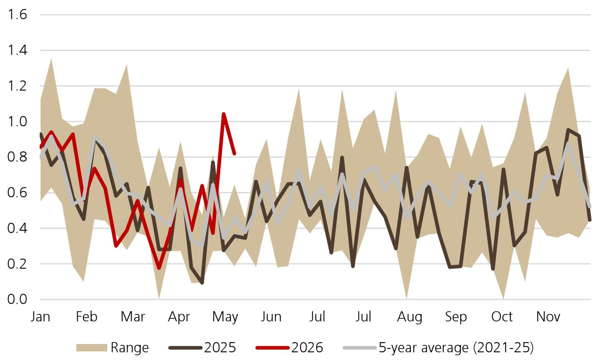

# Europe’s Gas Storage Rebuild Is Falling Behind Schedule, and the Market Has Not Yet Priced the Full Risk

The global natural gas market is entering a critical inflection point that most observers are underestimating. European storage injections are running below the seasonal norm, LNG arrivals are declining year-on-year, and the price curve remains stubbornly prompt-led, signaling that the market sees no surplus to carry into next winter. As of mid-May, EU gas storage stood at only 36% full, compared to 43% a year ago and 48% for the five-year average. At the current injection pace of 1.5 bcm per week, storage would reach only about 86% full by October, but the report’s base case forecasts a more realistic 80% as the market tightens further. This is not a comfortable buffer.

The problem is structural, not seasonal. The prompt-led TTF curve, with the seasonal spread hovering flat to slightly negative, actively disincentivizes storage injections. When the forward curve offers no contango, there is no economic return for storing gas for winter. Meanwhile, LNG cargoes that have recently exited the Gulf of Mexico are insufficient to ease the balance, and the JKM-TTF spread persists at $1-2 per mmBtu, keeping Asia competitive for marginal US cargoes. Europe cannot simply outbid its way to security.

The strategic question for energy investors, corporate buyers, and policymakers is whether the current market calm is a prelude to a sharper repricing or whether additional supply will materialize in time. The evidence suggests the former. This article argues that the gas market is in the early stages of a tightening cycle that will require higher prices to balance, and that the risks are asymmetrically skewed to the upside for the summer and early winter.

## European Storage Is Falling Behind the Required Trajectory, and the Curve Is Not Helping

The data is unambiguous. EU net injections over the past week were 1.5 bcm, below last year’s 1.8 bcm and the seasonal norm of 2.0 bcm. LNG arrivals were down 6% week-on-week and 11% year-on-year. The injection rate required to reach a comfortable storage level by November is higher than what the market is currently delivering.

The problem is not a lack of will. It is a lack of economic incentive. The TTF curve is prompt-led, meaning that near-term prices are higher than forward prices. For storage operators, this eliminates the arbitrage that normally drives summer injections. Why pay today’s price to store gas for winter if winter prices are not materially higher? The seasonal spread is hovering between flat and negative by up to -1.5 euros per MWh. In a rational market, this spread should be positive to encourage storage. Its absence is a signal that the market expects either demand destruction or a supply surge that has not yet arrived.

The implication is that storage will likely end the summer lower than current consensus forecasts. The report estimates that at the current injection rate, EU storage would reach about 86% full by October. But this is an optimistic scenario. The base case forecast of 80% is more realistic, and even that may prove optimistic if LNG arrivals continue to disappoint. For context, the five-year average for end-of-summer storage is around 90%. A 10-percentage-point deficit represents roughly 10 bcm of missing gas, a volume that would need to be compensated by either higher imports or lower consumption.

## LNG Flows Are Shifting Away from Europe, and Asia Is Winning the Marginal Cargo Battle

The global LNG market is not a monolith. Regional competition for cargoes is intensifying, and Europe is losing its edge. US LNG exports to Asia decreased by 21% in the most recent week, but they remain more than 60% above last year’s level on a four-week basis. The share of US exports to Asia has increased by over 10 percentage points to reach 33%, compared to pre-conflict periods. Europe still dominates at nearly 60%, but the trend is moving against it.

The JKM-TTF spread is the key metric to watch. At $1-2 per mmBtu, it is wide enough to make Asia the preferred destination for marginal US cargoes. Asian buyers are willing to pay a premium, and they have the demand profile to absorb volumes that would otherwise flow to Europe. This is not a temporary phenomenon. Asian LNG imports fell by 5% week-on-week and were 1% lower than a year ago, but arrivals over the past four weeks were down 9% year-on-year. The decline is more about timing than structural weakness. When Asian demand recovers, as it typically does during summer heat waves, competition for cargoes will intensify.

Europe’s vulnerability is compounded by the diminishing relief from Chinese LNG resales. In March, there were 10 resale cargoes from Chinese buyers, providing a welcome buffer to the European market. In April, that number collapsed to just one. Activity remains subdued in May. The Chinese resale mechanism, which had been a de facto safety valve for global LNG markets, is no longer functioning at scale. Meanwhile, China is poised to resume direct imports of US LNG, with three cargoes expected to arrive between mid and late June. This could signal an improvement in energy relations between the two countries, but it also means that Chinese demand is returning to the market directly, reducing the likelihood of resales.

## The US Market Is Well-Supplied, but That Does Not Solve Europe’s Problem

US natural gas storage is in a different position. The EIA reported an injection of 85 Bcf for the week ending May 8, in line with consensus. Inventories stood at 2,290 Bcf, with storage utilization at 54% versus the five-year average of 50%. The US is not facing a storage crisis. But the US market and the global LNG market are not perfectly coupled.

The issue is export capacity and destination flexibility. US LNG export facilities are running at high utilization, but the marginal cargo is increasingly going to Asia, not Europe. The US is not a swing supplier that can instantly redirect volumes to Europe when needed. The contractual and logistical realities of LNG shipping mean that cargoes are committed weeks in advance. The recent exit of several LNG tankers from the Gulf of Mexico is a positive signal, but the additional volumes remain insufficient to ease the European balance.

Japan’s utility gas stocks, as reported by METI, stand at 2.9 bcm as of May 10, broadly in line with the seasonal norm. This suggests that Asian buyers are not yet under acute stress, but it also means they have the capacity to absorb more cargoes if prices become attractive. Europe cannot rely on a demand collapse in Asia to free up supply.

## The Report Leaves Critical Questions Unanswered, and the Upside Risk to Prices Is Not Fully Captured

No single report can answer every question, and this one is no exception. There are several analytical gaps that readers should consider carefully.

First, the report does not fully address the impact of potential Russian pipeline gas disruptions. Russian piped gas flows to Europe have stabilized at low levels, but the risk of a complete cutoff remains. The report’s base case assumes 6 bcm of Russian piped gas through the winter, but political developments could reduce that to zero. A complete cutoff would require an additional 6 bcm of LNG imports or demand destruction, equivalent to roughly 6% of winter demand.

Second, the report does not model a severe winter scenario. The storage forecasts assume normal weather. A cold winter in Europe or Asia would dramatically increase heating demand and draw down storage faster than anticipated. The report’s end-winter storage estimate of 28 bcm is based on a normal weather assumption. A cold winter could push that number below 20 bcm, which would be a crisis.

Third, the report does not fully explore the second-order effects of a prompt-led curve on financial hedging and corporate behavior. If the curve remains backwardated, utilities and industrial users will be reluctant to lock in winter prices at current levels. This could lead to a scramble for physical supply as winter approaches, driving spot prices sharply higher. The market is pricing a smooth transition. History suggests it is wrong.

Fourth, the impact of Chinese LNG demand recovery is underappreciated. The report notes the resumption of US LNG imports to China and the decline in resales, but it does not quantify the potential demand increase. If Chinese GDP growth accelerates or if heat waves drive power demand, Chinese LNG imports could rise by 10-15% year-on-year, tightening the global balance significantly.

## A Decision Framework for Energy Buyers and Investors: Three Scenarios and Their Implications

For readers who need to act on this analysis, a structured decision framework is more useful than a forecast. The following three scenarios capture the plausible range of outcomes, each with distinct implications for strategy.

Scenario one is the base case: storage reaches 80% full by October, winter weather is normal, and LNG supply grows modestly. In this scenario, TTF prices remain in the 45-55 euro per MWh range through the summer, with a modest premium for winter. The risk is manageable, but there is no margin for error. Buyers should lock in winter coverage early, as any supply disruption will cause a sharp spike.

Scenario two is the tight case: storage reaches only 75% full by October due to lower LNG arrivals and higher Asian demand. Winter weather is normal. In this scenario, TTF prices rise to 60-70 euros per MWh by late summer, and winter prices command a significant premium. Storage operators would need to bid aggressively for injection gas, creating a feedback loop that pushes prices higher. Buyers should secure term contracts now and consider hedging with options rather than forwards, as the curve may not reflect the true risk.

Scenario three is the crisis case: storage reaches 70% full or lower, and winter weather is cold. This is a tail risk, but it is not negligible. In this scenario, TTF prices could exceed 100 euros per MWh, and governments may need to intervene with demand reduction measures. Industrial users should prepare contingency plans for curtailment, and investors should overweight gas-exposed equities and underweight energy-intensive sectors.

The report’s base case is scenario one, but the data supports a higher probability for scenario two. The prompt-led curve, declining LNG arrivals, and diminishing Chinese resales all point to a market that is tighter than the consensus expects. The prudent strategy is to hedge as if scenario two is the base case and scenario three is a real possibility.

## The Market Is Not Pricing the Full Tightening Risk, and the Full Report Reveals the Gaps

The most important insight from this analysis is that the market is complacent. The TTF curve is not pricing a storage deficit. The JKM-TTF spread is not pricing a competition for cargoes. The injection rate is not pricing the need to reach 90% storage by October. The data is telling a different story.

The full report, with its detailed charts on storage utilization, injection rates, LNG cargo tracking, and country-level storage levels, provides the granularity needed to make informed decisions. The charts on European gas storage utilization by country reveal wide dispersion. Italy is at 53.5% full, Spain at 66.2%, but the Netherlands is at only 11.8%. Germany, the largest market, is at 28.1%. These differences matter for regional pricing and infrastructure utilization.

The report also includes a detailed gas balance for winter 2025/2026 and summer 2026, showing that end-storage for March 2026 is estimated at only 28 bcm, compared to 85 bcm at the start of the winter. This is a thin buffer. Any demand or supply shock will be amplified.

For investors and corporate buyers who need to understand the full picture, the original charts and data are essential. The weekly injection rate chart, the LNG cargo tracker, and the country-level storage table all provide actionable intelligence that is not available in summary form.

Join the community to read the full report and review the original charts.

*This article is for learning and discussion only and does not constitute investment advice.*

Personal reading notes and learning share only. Not investment advice.

