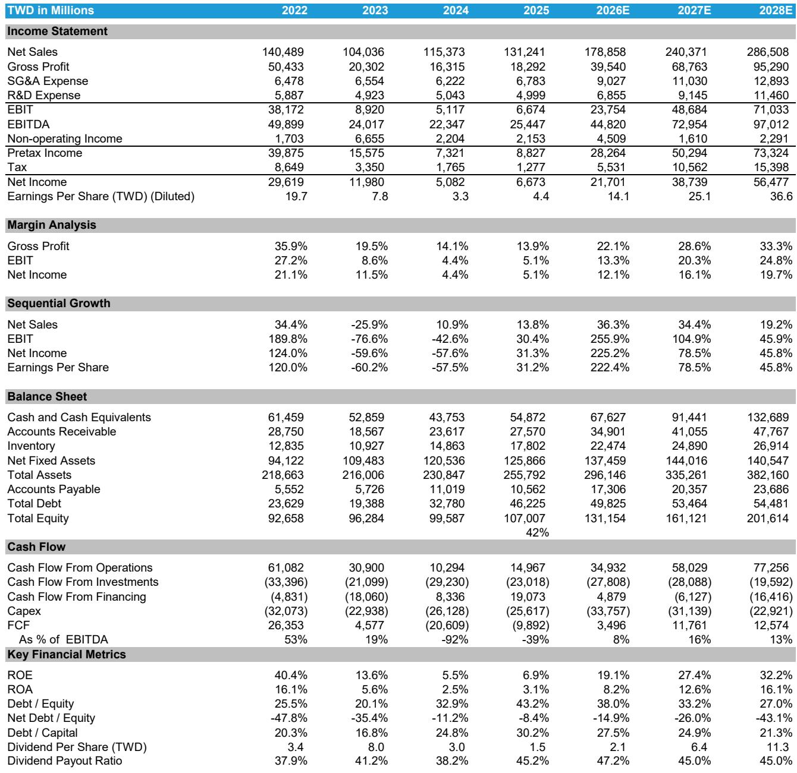
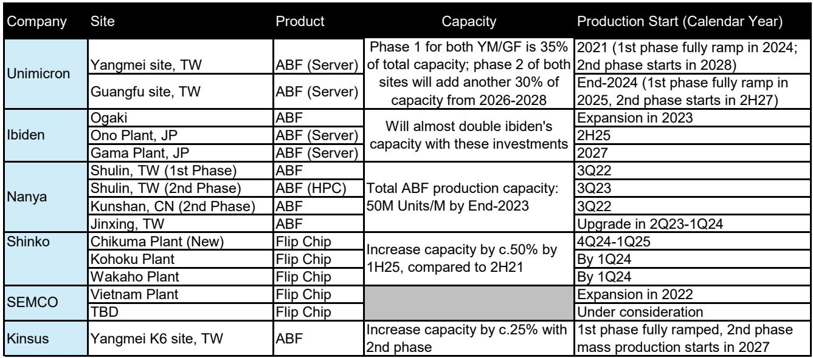

# The PCB Supply Chain Is Entering a Structural Upcycle, Not Just a Cyclical Bounce

The printed circuit board and sUBStrate market has been dismissed by many investors as a low-growth, commoditized corner of the electronics supply chain. That assumption is now breaking. In the first quarter of 2026, the sampled AI PCB companies delivered revenue growth of 38% year-over-year and 8% quarter-over-quarter. This is not a recovery from a trough. It is the acceleration of a structural shift driven by the physical infrastructure demands of artificial intelligence.

What makes this cycle different from the 2021-2022 semiconductor shortage is the nature of the demand driver. The previous cycle was driven by pandemic-era pull-ins and inventory hoarding across consumer electronics. Today, the demand is coming from AI server shipments, data center buildouts, and the networking hardware required to connect them. These are multi-year capital deployment cycles with visibility extending into 2028 and beyond. The PCB industry is not merely benefiting from AI. It is becoming a bottleneck that AI scaling must pass through.

The market has already repriced several names sharply higher year-to-date. But the deeper question for investors is whether the margin expansion and revenue compounding that consensus is modeling will actually materialize, or whether the supply response will erode pricing power faster than expected. The answer depends on raw material dynamics, capacity addition timelines, and the evolving role of ABF sUBStrates in next-generation AI accelerators.

This article is based on a detailed Bernstein report covering the 1Q26 PCB market update and Unimicron model revision. It does not summarize every data point. Instead, it extracts the strategic logic and leaves several open questions that only a full reading of the original research can resolve.

## ABF SUBStrate Revenue Has Already Surpassed Its 2022 Peak, and the Growth Is Shifting from Volume to Price

The most important single data point in the report is that ABF sUBStrate revenue growth accelerated to 40% year-over-year in the first quarter of 2026 and is about to surpass the previous peak set in the fourth quarter of 2022. This is significant because the 2022 peak was driven by a broad-based shortage of sUBStrates for CPUs and GPUs during the pandemic era. That cycle ended in a sharp correction when demand normalized and inventory was destocked.

This time, the composition of growth is different. In 2022, volume was the primary driver. Capacity was tight, but pricing was still largely negotiated on annual contracts. In 2026, volume is still strong, but pricing is becoming an explicit driver. The report estimates that Unimicron's ABF sUBStrate average selling prices increased 5% quarter-over-quarter in the first quarter of 2026 and are expected to accelerate to 7-10% quarter-over-quarter through the rest of the year. The catalyst is a roughly 30% raw material cost hike starting in the second quarter, combined with a richer mix of high-end ABF products.

This is not simply cost pass-through. It reflects a market where customers are willing to pay more for guaranteed supply of advanced sUBStrates. The pricing power is shifting from the chip designers to the sUBStrate manufacturers, at least temporarily. The question is whether this pricing environment can persist once new capacity comes online in 2027 and 2028. The report suggests it can, because the demand visibility is improving for the next two years and the capacity additions are still insufficient to meet the full scope of AI-related demand.

## Raw Material Tightness Is the Structural Constraint That Will Define Margin Trajectories Through 2027

The report identifies a cascade of raw material constraints that are tightening across the PCB supply chain. T-glass, copper-clad laminate, copper foil, and now ABF film are all experiencing price increases or supply limitations. The report notes that some CPUs are adopting T-glass from second-source suppliers, but it assumes limited adoption of tier-2 GPU and ASIC suppliers by the end of 2026. This is a critical distinction.

If the second-source qualification process for T-glass is slower than expected, or if the quality requirements for AI accelerators prevent rapid sUBStitution, then the pricing power of incumbent suppliers will remain elevated. The report does not fully resolve this question. It flags the development but does not model a scenario where tier-2 suppliers break through faster than expected. That is one of the open analytical questions that readers of the full report should examine closely.

For investors, the implication is that gross margin expansion is not automatic. The companies that have secured long-term raw material supply agreements or have integrated upstream will have a structural advantage. The report shows that consensus expects most AI PCB companies to see sequential gross margin growth through 2026 and 2027. But the dispersion is wide. Unimicron, for example, is expected to see gross margins rise from roughly 14% in 2024 to nearly 30% by 2027. Victory Giant is expected to exceed 40% gross margins. These are not cyclical peaks. They would represent new structural levels if sustained.

## The Capacity Expansion Cycle Is Aggressive but Geographically Fragmented, Creating Winners and Losers

The report documents a sharp increase in capital expenditure across the PCB and sUBStrate supply chain. Unimicron has guided for NT$34 billion in capex in 2026, up 33% year-over-year. Kinsus is guiding for 31% and 25% year-over-year growth in capex in 2026 and 2027 respectively. Gold Circuit has guided for more than NT$17 billion in capex in 2026, more than double the prior year. Chinese MLPCB and HDI companies like Victory Giant, WUS, and Delton are scaling advanced production in China while simultaneously accelerating overseas capacity in Southeast Asia.

This geographic diversification is not just a risk management exercise. It is a strategic response to the fact that the customer base is global and increasingly concerned about supply chain concentration. The report does not specify which geographies are most attractive for new capacity, but the pattern is clear: the industry is moving from a Taiwan-centric and Japan-centric model to a multi-region footprint. This will create complexity in execution and likely lead to delays in some projects.

The key strategic question is whether the capacity additions will overshoot demand by 2028. The report's revenue growth forecasts for the sector are extremely high. Victory Giant is expected to grow revenue 82% in 2026 and another 64% in 2027. WUS Group is expected to grow 45% and 40% in the same years. These are not normal growth rates for a mature industry. If even half of these forecasts materialize, the capacity additions will be absorbed. But if AI demand growth decelerates or if a new sUBStrate technology emerges that reduces the need for current ABF capacity, the margin expansion could reverse quickly.

## What the Report Does Not Fully Answer: The Pricing Elasticity of AI Customers and the Second-Source Qualification Timeline

Every investment report has boundaries, and the most useful ones are explicit about what they do not know. This report leaves two important questions open.

First, the pricing elasticity of AI customers is untested at these levels. The report assumes that ABF sUBStrate ASPs can accelerate to 7-10% quarter-over-quarter through 2026. That would imply cumulative price increases of 30-40% over the year. While raw material cost hikes provide a justification, it is not clear how much of this is sustainable versus opportunistic. If customers begin to push back or if alternative packaging technologies gain traction, the pricing trajectory could flatten.

Second, the timeline for second-source qualification of T-glass and other critical raw materials is uncertain. The report assumes limited GPU and ASIC adoption of tier-2 suppliers by the end of 2026. But if the qualification process accelerates, the tightness in the supply chain could ease faster than expected, reducing pricing power for incumbent suppliers. Conversely, if qualification is slower, the current tightness could extend into 2028.

These are not weaknesses in the analysis. They are genuine uncertainties that investors must weigh. The full report likely contains sensitivity analysis or scenario modeling that addresses these points. Readers who want to make informed decisions should review that material directly.

## A Decision Framework for Investors in the PCB and SUBStrate Supply Chain

For investors evaluating exposure to this theme, the report suggests a framework based on three dimensions: AI revenue exposure, margin recovery trajectory, and raw material sourcing security.

First, AI revenue exposure is the primary differentiator. The report provides a clear ranking of companies by their AI mix in PCB business. Gold Circuit leads at 70%, followed by Ibiden at 69%, Victory Giant at 52%, and WUS Group at 52%. Unimicron sits at 43%. The companies with lower AI exposure, such as Kinsus and Nan Ya PCB, are still benefiting from the spillover effect of surging CPU demand, but their growth trajectories are less directly tied to AI accelerator volumes.

Second, margin recovery trajectory matters because the market is already pricing in significant improvement. The report shows that Bloomberg consensus expects most companies to see sequential gross margin growth through 2027. But the base levels vary dramatically. Nan Ya PCB went from a gross margin of 1% in 2024 to an expected 19.4% in 2026. Unimicron is expected to rise from 14% to 22.5% in the same period. The companies that are starting from a deeper trough have more upside if the recovery materializes, but also more risk if it does not.

Third, raw material sourcing security is the least visible but potentially most important factor. Companies that have locked in long-term agreements for T-glass, CCL, and ABF film will have a cost advantage. Companies that are exposed to spot price fluctuations will see margin volatility. The report does not provide a detailed sourcing analysis for each company, but it flags the issue clearly. Investors should seek additional disclosure on this point from company management or from the full report.

## The Unresolved Analytical Tension: Shortage Pricing versus Long-Term Contracts

The most interesting tension in the report is between the narrative of a shortage-driven pricing environment and the reality that most PCB and sUBStrate transactions are governed by long-term contracts. The report notes that long-term pricing agreements are taking effect, which should provide revenue visibility. But it also describes a market where spot prices are rising rapidly and raw material cost hikes are being passed through.

How these two dynamics reconcile is not fully explained. If long-term contracts lock in prices for extended periods, then the benefit of rising spot prices may be delayed or diluted. If contracts are being renegotiated quarterly, then the pricing acceleration will flow through to revenue faster. The report implies that the latter is happening for high-end ABF sUBStrates, but it does not specify the contract structures for the broader PCB market.

This is a classic tension in the semiconductor supply chain. During periods of structural shortage, contract terms become more favorable to suppliers. During periods of oversupply, the reverse happens. The current environment is clearly supplier-friendly, but the duration of that advantage depends on how quickly new capacity comes online and how aggressively customers push for alternative sourcing.

## Join the Community to Read the Full Report and Review the Original Charts

The analysis above is based on a detailed Bernstein report covering the 1Q26 PCB market update, Unimicron model revisions, and the broader competitive dynamics across the ABF sUBStrate and PCB supply chain. The full report contains revenue and margin forecasts for eleven major companies, capital expenditure plans through 2027, and a proprietary framework for evaluating AI exposure across different sUBStrate and PCB categories. It also includes the specific price target changes for Unimicron and Ibiden, along with the valuation methodology used.

For investors who want to understand the precise assumptions behind the earnings forecasts, the sensitivity of margin expansion to raw material costs, and the timeline for capacity additions at individual companies, the original charts and model details are essential. The report also contains a ticker table with current ratings, price targets, and performance data that was not included in this article.

Join the community to read the full report and review the original charts.

*This article is for learning and discussion only and does not constitute investment advice.*

Personal reading notes and learning share only. Not investment advice.

