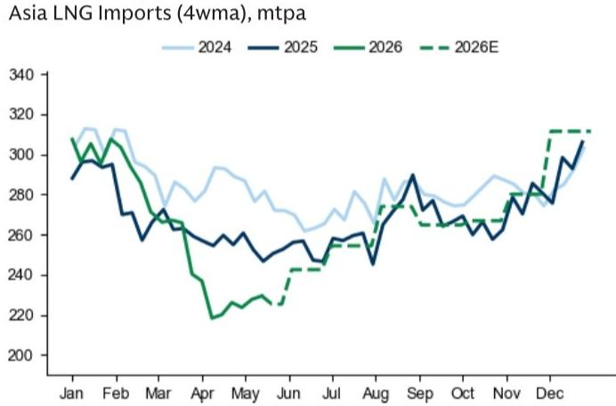

# 亚洲LNG需求正在苏醒，欧洲TTF的上行风险被市场低估

过去几个月，一个被广泛接受的叙事是：亚洲LNG进口疲软为欧洲争取了时间，中国、韩国和日本的需求低迷释放了大量LNG货物流向欧洲，从而压制了TTF价格的风险溢价。这个逻辑在三四月份是成立的，但最新数据正在发出不同的信号。

某外资投行大宗商品研究团队在最新发布的天然气研究报告中指出，亚洲LNG需求已经出现明确的复苏迹象。5月的前两周数据显示，亚洲LNG进口的四周移动平均线已经显著高于该行此前的5月预期。这一变化虽然尚未引起市场广泛讨论，但正在从根本上改变全球LNG市场的供需平衡，并对欧洲天然气定价产生深远影响。

如果霍尔木兹海峡的航运中断持续至7月下旬（该行基准假设为6月下旬恢复正常），那么3季度和4季度的TTF价格可能分别从该行当前预测的44欧元/兆瓦时和40欧元/兆瓦时，上行至65欧元/兆瓦时和53欧元/兆瓦时。这不是一个极端的看涨情景，而是基于亚洲需求回归这一正在发生的现实推演出的合理结果。

市场真正低估的不是供应侧的地缘政治风险，而是需求侧的结构性回归正在重新定价全球LNG的流向和欧洲的议价能力。

## 1. 中国LNG进口的反弹不是边际波动，而是夏季补库周期的启动

中国LNG进口数据是这份报告中最值得关注的信号。根据该行的测算，中国LNG进口的四周移动平均线已经达到48百万吨/年，远高于3月份的36百万吨/年均值。更重要的是，这一数字已经显著高于该行对5月全月225百万吨/年的预期——实际数据比预期高出约4百万吨/年。

这不是一次性的数据扰动。该行预计，随着夏季制冷需求上升和储气库补库需求增加，中国LNG进口将在3季度进一步攀升至67百万吨/年。这意味着中国正在为下一个冬季做准备，其储气库库存水平需要达到略高于去年同期的水平。

对于全球LNG市场而言，中国的需求回归意味着原本流向欧洲的“过剩”LNG将面临分流。如果中国在夏季积极采购，欧洲将不得不在现货市场上支付更高的溢价来吸引货物。这正是该行上调TTF风险预测的核心逻辑之一。

## 2. 韩国需求同样在从淡季低谷回升，规模虽小但方向一致

韩国的LNG进口模式与中国类似，虽然规模较小，但趋势方向一致。数据显示，韩国LNG进口的四周移动平均线为42百万吨/年，高于4月的39百万吨/年均值和该行对5月40百万吨/年的预期。

韩国的需求回升具有典型的季节性特征：4月至5月是过渡季节，制冷需求尚未完全启动，而供暖需求已经消退。随着夏季到来，韩国的电力制冷需求将推动LNG进口进一步上升。该行的判断是，韩国正在从“肩部季节”向夏季过渡，这一过程将自然推高进口量。

这里需要关注的是，韩国和中国同时启动补库，意味着亚洲对LNG的“买方力量”在二季度末至三季度将显著增强。全球LNG市场的买方集中度正在从“欧洲单一买家”向“亚洲-欧洲双买家”切换，这对定价权的分配具有结构性含义。

## 3. JKM相对于TTF的溢价正在扩大，这是亚洲需求回归的直接价格信号

报告中最具说服力的价格信号来自JKM（日本-韩国-马来西亚现货价格）与TTF之间的价差变化。5月，JKM相对于TTF的溢价为1.87美元/百万英热，高于4月的1.59美元/百万英热。更重要的是，当考虑LNG航运成本变化后，这一溢价扩大仍然成立。

这意味着什么？亚洲买家正在愿意支付比欧洲买家更高的价格来获取LNG货物。在航运成本基本稳定的情况下，JKM溢价的扩大只能解释为亚洲需求相对于欧洲需求的边际走强。这一信号与进口量的上升相互印证，构成了一个完整的“量价齐升”的亚洲需求复苏图景。

对于欧洲买家而言，这意味着他们不再能够以较低的溢价从亚洲“抢走”LNG货物。如果亚洲需求继续走强，欧洲将面临要么接受更高的TTF价格，要么面临供应紧张的局面。这正是该行认为TTF上行风险被低估的核心原因。

## 4. 日本需求暂时疲软，但这是短期现象而非趋势逆转

在亚洲三大LNG进口国中，日本是唯一出现需求疲软的国家。日本LNG进口的四周移动平均线为44百万吨/年，低于该行对5月48百万吨/年的预期。这一数据可能让一些市场参与者认为亚洲需求复苏并不稳固，但该行的分析表明，这更像是一个短期扰动。

该行指出，日本进口疲软由四个因素叠加导致：4月天气偏暖、煤炭利用率上升、化工企业因原料供应减少而降低开工率、以及LNG库存充裕允许暂时去库存。这些因素中的大部分是季节性或一次性的，而非结构性变化。

更重要的是，随着夏季制冷需求季节性上升，日本将需要增加燃气发电和LNG库存建设。该行预计，日本LNG进口的下行空间有限，因为冬季前的储气库补库需求将限制进口的进一步下降。如果这一判断成立，那么亚洲三大买家将在三季度同时进入补库周期，这对全球LNG市场的影响将是叠加而非抵消的。

## 5. 报告尚未完全回答的关键问题：霍尔木兹中断情景下的二阶效应

这份报告的核心上行风险情景依赖于一个关键假设：霍尔木兹海峡的航运中断将持续至7月下旬。该行的基准假设是6月下旬恢复正常，但如果中断延迟，TTF价格将面临显著上行。

这里有一个报告没有完全展开的问题：霍尔木兹中断对亚洲LNG进口的影响是否存在二阶效应？如果中东地区的LNG出口因霍尔木兹中断而受阻，亚洲买家是否会更加积极地采购大西洋盆地的LNG，从而进一步推高JKM溢价和全球LNG价格？该行在报告中提到了霍尔木兹中断对TTF的影响，但没有详细拆解这一中断对亚洲买家采购行为的具体影响。

另一个报告尚未充分讨论的问题是：如果亚洲需求回归与霍尔木兹中断同时发生，欧洲的储气库补库节奏是否会受到影响？欧洲的储气库库存水平是当前TTF定价的关键变量。如果亚洲买家在夏季积极采购，欧洲可能无法在冬季前将储气库填充至目标水平，这将为下一个冬季的TTF价格埋下更大的上行风险。

## 6. 投资者的观察框架：如何判断亚洲需求回归是否可持续

基于这份报告的分析框架，我们认为投资者可以从以下三个维度持续跟踪亚洲需求回归的可持续性：

第一，关注中国和韩国的周度LNG进口数据与季节性预期的偏离。如果进口量持续高于该行的5月预期，那么亚洲需求回归的判断将得到进一步验证。反之，如果进口量在6月出现回落，则需要重新评估这一趋势的强度。

第二，关注JKM-TTF价差与航运成本的相对变化。如果JKM溢价持续扩大且超出航运成本的变化范围，说明亚洲买家的需求强度在边际上超越欧洲。这是判断全球LNG定价权转移的最直接价格信号。

第三，关注日本LNG库存和电力需求数据。日本是亚洲LNG定价的边际买家之一，其库存水平和电力需求变化对JKM定价有重要影响。如果日本在6月至7月启动加速补库，将意味着亚洲三大买家的需求共振正在形成。

这三个维度共同构成了一个“量-价-库存”的完整观察框架，可以帮助投资者在数据层面验证或证伪亚洲需求回归这一核心判断。

---

上述分析只是这份研究报告核心逻辑的一部分。报告还包含了详细的图表数据、情景分析框架以及不同中断时长下的TTF价格路径测算。这些内容对于深入理解全球LNG市场的定价机制和风险分布具有重要价值，但由于篇幅限制，我们无法在此一一展开。

如果你希望进一步探讨霍尔木兹中断对亚洲买家采购行为的具体影响，或者想了解该行对欧洲储气库补库节奏的详细测算，欢迎来星球微信群里继续讨论。我们会在群内分享完整的报告解读和原始图表，并就报告中尚未完全回答的关键问题与大家交流。

Personal reading notes and learning share only. Not investment advice.

