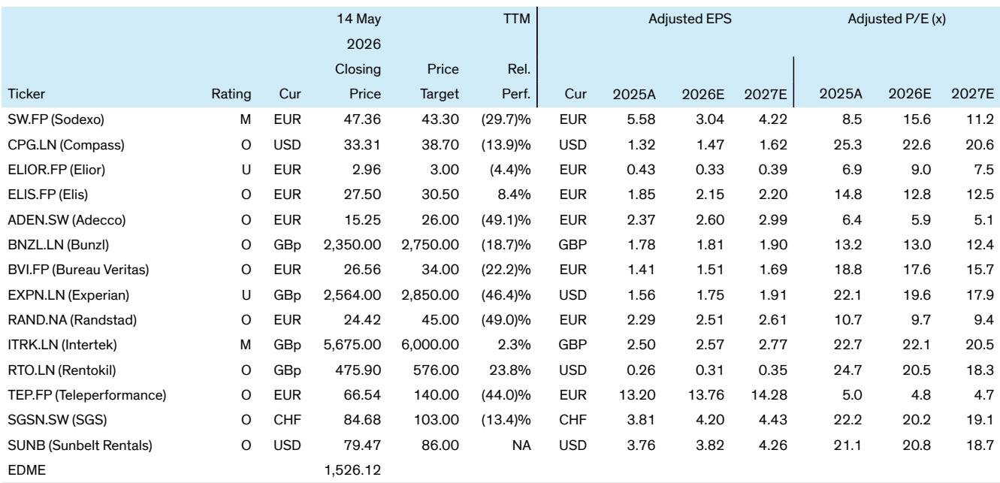
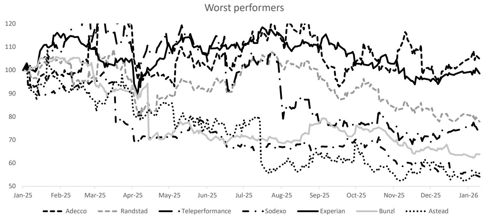

# AI Will Not Destroy European Business Services — It Will Reshape the Competitive Order

The dominant market narrative around artificial intelligence in European business services has become one of fear: white-collar job destruction, structurally lower barriers to entry, and permanent margin compression for incumbents. This narrative is understandable but incomplete. It conflates disruption with destruction, and it underestimates the capacity of established firms to turn a productivity shock into a competitive advantage.

A careful reading of the evidence — historical precedent, current data from staffing firms, and the nature of work across catering, inspection, and business process outsourcing — suggests a different conclusion. AI will indeed change the shape of markets, alter pricing dynamics, and shift the mix of revenue streams. But for most incumbents in business services, the outcome will be reallocation, not elimination. The real strategic question is not whether AI will hurt these sectors, but which companies are positioned to capture the productivity dividend and which will be left defending shrinking margins.

The market has already begun to price in a pessimistic scenario. Since early 2025, shares of Teleperformance have fallen roughly 25 percent, while Adecco and Experian have each declined around 20 percent. Even accounting for company-specific headwinds, the sector-wide sell-off reflects a growing conviction that AI will permanently impair the earnings power of business services firms. That conviction deserves scrutiny. The available data and historical patterns point toward a more nuanced outcome — one in which the winners and losers diverge sharply, and in which the most aggressive sell-offs may themselves create opportunity.

## The Historical Record Argues Against Simple Job Destruction — But This Time Has Caveats

Every major technological shock of the past century — electrification, the adoption of information technology, the rise of the internet — was accompanied by widespread predictions of mass unemployment. In each case, the outcome was not collapse but reallocation. Employment levels rose over the long term, even as specific roles were automated away. A global staffing firm's internal analysis shows that in the United States, the correlation between labor productivity growth and employment growth has been approximately 80 percent on an annual basis and 100 percent over ten-year periods. Germany shows a similar pattern.

This is the most important single data point for investors trying to assess the AI risk to business services. It suggests that productivity-enhancing technologies do not reduce aggregate labor demand; they shift it. The jobs that disappear are replaced by new ones, often in adjacent or entirely new categories. The same staffing firm reports that 60 to 70 percent of the positions it fills today did not exist when the company was founded 65 years ago. That is not a story of stagnation. It is a story of continuous structural adaptation.

But there are reasons to be cautious about extrapolating this pattern too directly. Generative AI is different from prior technologies in at least two ways. First, its impact is concentrated on cognitive tasks — the core domain of white-collar work — rather than on manual or routine physical labor. This means the disruption will hit corporate back offices, customer service centers, and data management functions, which are precisely the areas where many business services firms generate revenue. Second, the speed of adoption may be faster than previous transitions, compressing the adjustment period and increasing the risk of short-term dislocations.

The McKinsey midpoint scenario projects that roughly 30 percent of current work hours in Europe and the United States could be automated by 2030. That is a large number. But it is not the same as a 30 percent reduction in headcount. Automation of hours does not translate one-for-one into job losses, because firms can redeploy freed-up labor into higher-value tasks, because demand growth can absorb displaced workers, and because the implementation of AI itself creates new roles. A Gartner estimate cited in the analysis suggests that automation software could generate half a billion jobs globally by 2033. That estimate may be optimistic, but the direction is clear.

The implication for investors is that the binary "AI kills jobs" framework is too simplistic. The real question is about the pace and distribution of reallocation — and about which companies are best placed to manage that transition.

## The Impact Across Business Services Is Highly Uneven — And That Creates a Divergence Opportunity

The business services sector is not a monolith. It includes temporary staffing firms, catering operators, inspection and certification companies, data and credit reporting agencies, and business process outsourcers. Each of these sub-sectors faces a different AI exposure profile, and within each, individual companies have different degrees of vulnerability.

The highest-risk group includes firms whose revenue is tied to tasks that are directly automatable: customer service call centers, data entry and processing, and routine clerical work. Teleperformance and Experian fall into this category. For Teleperformance, the concern is that AI-powered chatbots and voice agents will reduce the need for human customer service representatives, compressing volumes and pricing. For Experian, the risk is that AI will lower barriers to entry in data aggregation and credit scoring, making it harder to sustain premium pricing and organic growth.

The analysis takes a contrarian view on both names. For Experian, the report argues that AI is a contributory factor to below-consensus medium-term organic growth estimates — not because demand will collapse, but because the total addressable market will become more contested. For Teleperformance, the report similarly sees lower organic growth relative to consensus expectations, as higher automated volumes lead to lower unit pricing. These are not catastrophic scenarios. They are margin-compression scenarios. The stocks have already priced in a great deal of bad news, but the analysis suggests that the fundamental headwinds may persist longer than the market expects.

At the other end of the spectrum are companies whose business models are anchored in physical, on-site work that is difficult to automate. Catering operators like Compass and Sodexo employ hundreds of thousands of workers in kitchens, canteens, and service roles. While AI can optimize supply chains, reduce food waste, and automate back-office functions, it cannot replace a chef preparing a meal or a server cleaning a table. The analysis estimates that the maximum negative impact of AI on catering revenue is around 1 to 2 percent, partially offset by cost efficiencies. That is a disruption, not a crisis.

Similarly, inspection and certification companies like Bureau Veritas, SGS, and Intertek rely on physical inspections of assets, facilities, and supply chains. AI can enhance these processes — improving data analysis, enabling remote inspections, and increasing accuracy — but it does not eliminate the need for human judgment and physical presence. The report categorizes these companies as having limited to modest AI impact, with the potential for operational efficiencies and new market creation.

The staffing firms — Adecco and Randstad — occupy an intermediate position. Their blue-collar temporary placement businesses are relatively insulated, because the demand for physical labor is not easily automated. But their white-collar and clerical placement businesses face direct headwinds. The analysis suggests that the incumbents are well-positioned to use AI to improve their own efficiency — matching candidates to roles faster, reducing administrative costs, and enhancing the quality of placements. The key variable is the mix of revenue between blue-collar and white-collar placements. Firms with greater blue-collar exposure are better protected.

This uneven impact profile creates a clear divergence opportunity. The market has been selling the entire sector, but the fundamental reality is far more differentiated. Companies with physical, on-site, or relationship-intensive business models are unlikely to see the kind of structural impairment that the sell-off implies. Companies with high exposure to automatable cognitive tasks face real headwinds, but even there, the magnitude of the impact is a matter of degree, not a binary outcome.

## What the Report Does Not Fully Answer: The Pace of Adoption and the Shape of New Markets

The analysis is rigorous on the direction of travel but necessarily uncertain on the timing. The McKinsey scenarios span a wide range, from a "late" scenario in which only 5 percent of hours are automated by 2030 to an "early" scenario in which the figure reaches 60 percent. That range reflects genuine uncertainty about technical feasibility, regulatory constraints, and organizational adoption. The actual outcome will depend on factors that are difficult to model: how quickly companies invest in AI tools, how willing workers are to retrain, and how governments respond to labor market disruption.

There is also a deeper question about the nature of the new jobs that AI will create. The report lists potential roles — AI system developers, migration specialists, retraining coordinators — but it does not quantify how many of these jobs will be created within the business services sector itself versus in technology companies or other industries. If most of the new jobs are in software and AI infrastructure, the staffing and outsourcing firms may see limited benefit. If the new jobs are in areas like compliance, risk management, and customized service delivery — areas where business services firms have existing relationships and expertise — the opportunity could be sUBStantial.

Investors should watch for early signals: hiring trends at large staffing firms, capital expenditure plans at business services companies, and the emergence of new service lines tied to AI implementation and governance. The companies that can articulate a credible strategy for capturing the upside of AI — not just defending against the downside — will deserve a premium valuation.

## A Decision Framework for Investors: Three Questions to Separate Winners from Losers

For investors trying to navigate this landscape, three questions can help distinguish the companies that will thrive from those that will struggle.

First, how much of the company's revenue depends on tasks that are directly automatable? This is the most important screening question. A company like Compass, where the core service is physical food preparation and delivery, has a natural moat. A company like Teleperformance, where the core service is handling customer calls, has a much thinner moat. Investors should quantify the share of revenue that comes from roles that a large language model could plausibly replace or sUBStantially augment within three to five years.

Second, does the company have a credible path to using AI to improve its own efficiency and margins? The report's analysis of staffing firms is instructive here. The incumbents have scale, data, and client relationships that new entrants cannot easily replicate. If they can use AI to reduce their own cost to serve — faster candidate matching, lower administrative overhead, better retention analytics — they can offset pricing pressure from automated alternatives. The same logic applies to catering companies, which can use AI to optimize menus, reduce waste, and streamline supply chains. The companies that treat AI as an operational tool rather than an existential threat will perform better.

Third, is the company's competitive advantage based on scale and relationships, or on pure execution of automatable tasks? This is the strategic core of the analysis. Business services firms have historically built moats through geographic scale, client relationships, regulatory expertise, and the ability to manage complex labor-intensive operations. AI does not automatically erode these moats. A large catering company with contracts at hundreds of corporate campuses and hospitals has a relationship-based advantage that a chatbot cannot replicate. A staffing firm with deep local market knowledge and a database of millions of workers has a data advantage that is itself a form of AI fuel. The companies that own the relationships and the data will be better positioned than those that simply execute commoditized tasks.

## The Full Report Contains the Charts and Data That Support This Framework

The original analysis includes detailed exhibits on stock performance, automation scenarios, and company-level impact assessments that are essential for making informed investment decisions. The charts show the magnitude of the recent sell-off, the range of possible automation outcomes, and the specific vulnerabilities and opportunities for each company in the coverage universe.

Investors who want to move beyond the narrative and into the numbers will find the full report valuable. The data on employment correlations, task automation potential, and company-specific growth estimates provide the analytical foundation for the framework described here.

Join the community to read the full report and review the original charts.

*This article is for learning and discussion only and does not constitute investment advice.*

Personal reading notes and learning share only. Not investment advice.

