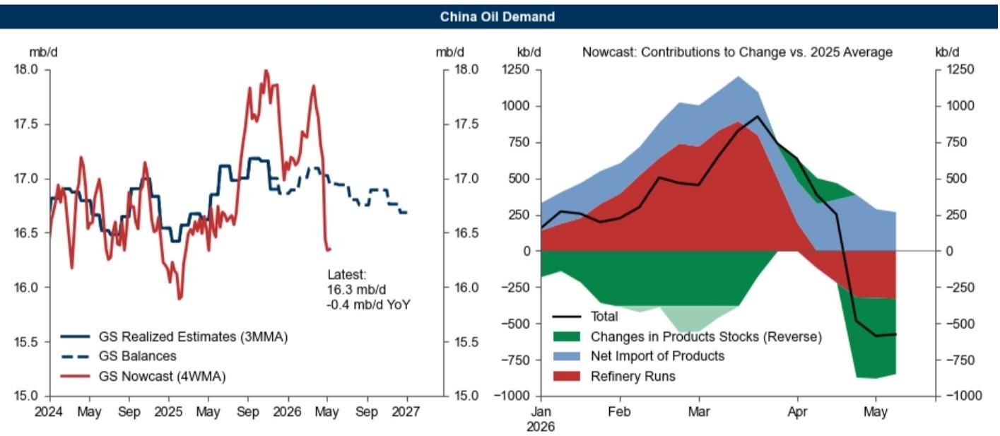

# 美国汽油市场正在成为全球石油供给紧张的“价格锚点”

全球石油市场的叙事正在发生一次微妙的转移。过去数周，市场的目光几乎全部聚焦于霍尔木兹海峡的流量、中东的地缘政治博弈以及IEA每个月对供需平衡表的修正。这些无疑是重要的。但这份最新发布的研报提示了一个值得产业链决策者认真对待的信号：**真正的边际定价权，正在从原油端向成品油端，尤其是美国汽油市场转移。**

这并不是一个全新的判断，但报告提供了几个此前未被充分量化的证据链。美国汽油库存以每日70万桶的速度快速去化，目前已比历史季节性中位数低5%。与此同时，美国汽油批发价格比亚洲和欧洲高出约15%，折合每桶21美元。这不是一个正常的区域价差。它意味着美国市场正在通过价格机制，从全球“抢”汽油。

更值得关注的是，这种紧张并非由单一因素驱动。出口激增、国内需求坚韧、以及炼厂在利润驱动下将生产重心转向柴油和航煤，这三股力量同时作用。报告没有明说，但隐含的判断是：如果这种价差持续，美国汽油零售价格距离历史最高点仅差0.5美元/加仑，那么政策干预的概率正在上升——无论是出口限制还是其他形式的行政手段。

对于关注大宗商品定价、全球炼化利润以及地缘风险传导的读者而言，这份报告的价值不在于它预测了油价会涨到多少，而在于它提供了一个更精细的观测框架：**当原油供给冲击的“第一层”效应被市场充分定价后，“第二层”效应——成品油区域价差、炼厂生产决策、以及政策反应函数——正在成为决定下一阶段价格路径的关键变量。**

以下是我们从这份报告中提炼出的五个核心洞察，以及一个报告尚未完全回答的关键问题。

## 1. 美国汽油库存的快速去化，正在制造一个“硬约束”

报告中最具冲击力的数据点来自Exhibit 1：自4月1日以来，美国汽油库存以每日70万桶的速度快速下降，目前已低于历史季节性中位数5%。这不是一个正常的季节性波动。在即将进入夏季出行高峰的背景下，这个库存水平意味着美国市场几乎没有缓冲空间。

更关键的是驱动库存下降的三重因素，它们不是临时性的。第一，美国汽油净出口同比增加了34万桶/日。这反映的是全球炼化产能的区域错配——其他地区的炼厂无法有效生产足够的汽油，美国成为了边际供应者。第二，国内汽油需求仅比去年同期低20万桶/日，显示出惊人的韧性。在油价高企的背景下，需求没有出现预期中的大幅萎缩。第三，炼厂正在主动将生产向利润更高的柴油和航煤倾斜。

这三个因素叠加，意味着即便原油供给端的问题得到缓解，美国汽油市场的紧张状态也不会立即消失。炼厂的利润导向决策具有惯性，而出口需求的结构性变化可能需要更长时间才能逆转。对于投资者而言，这意味着美国汽油裂解价差可能在更长时间内维持高位，这对于持有炼厂头寸或关注能源板块的读者是一个需要持续跟踪的信号。

## 2. 区域价差正在成为比绝对价格更灵敏的指标

报告特别指出，美国汽油批发价格比亚洲和欧洲高出约15%，折合每桶21美元。这个价差的绝对值已经足够引起注意，但更有意义的是它的信息含量。

在正常的全球石油市场中，区域价差通常由运费和品质差异决定，波动幅度有限。但当价差扩大到这种程度时，它揭示的是更深层的结构性问题：美国的汽油供给体系正在承受压力，而亚洲和欧洲的汽油市场相对宽松。这种不均衡的状态，通过价差信号，正在引导全球的贸易流——理论上，套利者应该将欧洲和亚洲的汽油运往美国，直到价差收窄。

但报告没有完全展开的一个问题是：为什么套利没有充分发生？可能的解释包括：美国东海岸的进口基础设施瓶颈、船运运力紧张、或者欧洲和亚洲自身的供需状况并不像看起来那么宽松。无论原因是什么，这个价差本身就是一个需要密切关注的领先指标。如果它继续扩大，意味着美国市场的紧张程度在加剧；如果它快速收窄，则可能意味着套利正在起作用，或者美国需求出现了意外下滑。

## 3. 全球供需缺口没有想象中那么大的“好消息”，恰恰是最大的风险

报告指出，IEA最新估计的4月份全球石油供需缺口为530万桶/日，低于此前市场预期的更高数字。原因包括IEA对需求的下调幅度更大，以及对中东供给的估计高于其他来源。

表面上看，这是一个“好消息”——缺口没有预期的大，意味着价格上行压力可能小于此前担忧。但报告的深层逻辑恰恰相反：**这个“好消息”本身，可能正是市场最大的风险。**

原因在于，如果市场参与者因为缺口数据低于预期而放松警惕，可能会低估供给中断持续更长时间所带来的累积效应。530万桶/日的缺口，即使比预期小，仍然是一个巨大的数字。而且，这个数字是基于IEA对中东供给的乐观估计——报告明确提到，IEA估计海湾国家4月原油供应为1500万桶/日，比该投行自己的平衡表估计高出400万桶/日。如果IEA的估计被证明过于乐观，那么实际缺口可能比现在看到的更大。

这里有一个重要的“所以呢”：在供给冲击的初期，市场往往对“坏消息”反应过度，然后对“不那么坏的消息”反应不足。但真正的风险不在于某个月的缺口是530万桶还是800万桶，而在于供给中断的持续时间。如果霍尔木兹海峡的流量在5月、6月仍然维持低位，那么累积的库存消耗将迫使价格重新定价。

## 4. 战略石油储备的释放结构，暗示了成品油比原油更脆弱

报告提供了一个值得深入挖掘的细节：自3月11日以来，IEA国家释放的9000万桶战略石油储备中，有8200万桶是原油，仅有800万桶是成品油。这个比例（91%原油 vs 9%成品油）揭示了一个容易被忽视的事实：战略储备的设计初衷是应对原油供给中断，而不是成品油供给紧张。

这意味着，如果成品油市场（尤其是汽油）出现局部短缺，政府可动用的政策工具比原油市场更有限。释放战略原油储备可以增加炼厂的原料供应，但这需要时间转化为成品油，而且转化效率取决于炼厂的运行状况。如果炼厂本身已经满负荷运转，或者正在优先生产利润更高的产品，那么战略原油的释放对汽油价格的抑制作用将是间接且滞后的。

对于读者而言，这个信息意味着：**在评估政策干预对市场的潜在影响时，需要区分“原油端”和“成品油端”。** 战略储备对原油价格的影响可能更直接，但对汽油价格的影响则需要更长的时间传导。如果美国汽油零售价格进一步上涨，政策制定者可能会面临比预期更少的有效选项。

## 5. 报告尚未完全回答的关键问题：美国出口限制的概率究竟有多高

报告在开头部分提到：“虽然这不是我们的基准情形，但随着美国零售汽油价格上涨，美国石油出口限制的概率正在上升。”这是一个非常谨慎的表述，但也是一个非常重要的判断。

问题在于，报告没有对“概率上升”进行量化，也没有深入分析触发出口限制的具体条件。零售汽油价格需要涨到什么水平？持续多长时间？政治压力如何转化为行政行动？这些问题在报告中留下了伏笔。

从逻辑上推导，出口限制的讨论可能围绕两个维度展开。第一是价格阈值：如果美国零售汽油价格突破历史高点并持续，公众和政治压力将急剧上升。第二是区域分化：如果美国汽油批发价格与全球其他地区的价差进一步扩大，意味着美国消费者正在为全球供给紧张支付溢价，这会引发“为什么美国要补贴世界”的叙事。

报告没有给出答案，因为这确实是一个高度不确定的问题，取决于政治决策而非市场规律。但对于任何关注能源市场的读者来说，这是一个需要持续跟踪的变量。出口限制一旦实施，将从根本上改变全球成品油贸易流，并对美国炼厂利润产生深远影响。

---

这份报告的价值在于，它没有停留在对原油供给冲击的宏观描述，而是深入到成品油市场的微观结构，揭示了几个正在形成的“第二层”效应。美国汽油市场的紧张、区域价差的异常、以及战略储备释放的结构性局限，这些信号合在一起指向一个判断：**全球石油市场的下一个定价锚点，可能不是布伦特原油期货，而是美国汽油的零售价格。**

当然，报告中也留下了几个尚未完全解答的问题。比如，IEA对中东供给的乐观估计是否可靠？美国汽油出口激增背后的买家是谁，这种需求是否可持续？以及，如果美国真的实施出口限制，全球成品油市场将如何重新平衡？这些问题值得在完整报告中进一步探讨。

欢迎来我们的星球和微信群继续讨论。我们会在群内分享这份报告的原始图表，并围绕出口限制的概率、区域价差的交易含义以及炼厂利润的可持续性等话题，与读者进行更深入的交流。

Personal reading notes and learning share only. Not investment advice.

