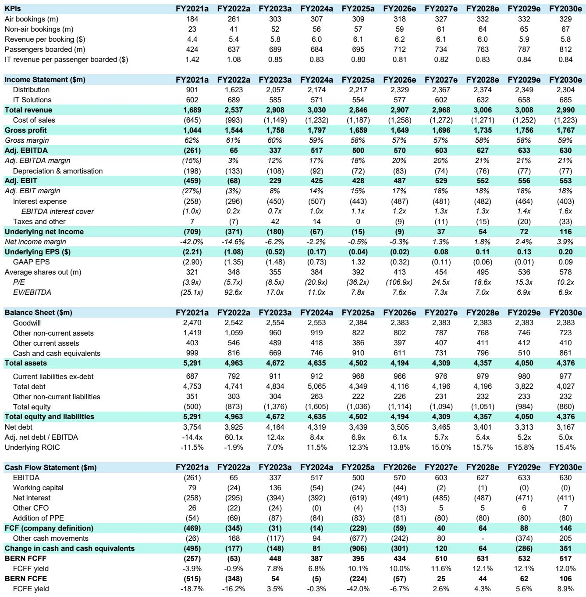

# 航空技术股真正的风险不在中东，而在即将到来的运力削减

全球航空技术板块正在经历一场罕见的背离。一方面，Amadeus和Sabre刚刚交出了稳健的一季报，营收和指引都经受住了地缘冲突的冲击；另一方面，投资者对近端交易量的担忧却比以往任何时候都更强烈。某外资投行的最新研报指出，市场真正需要审视的并非中东冲突对订票量的直接冲击，而是航空公司正在酝酿的、可能持续到冬季的运力削减。这份报告的核心判断是：航空技术股的盈利与航空公司的利益正在发生结构性分化——前者依赖交易量，后者依赖票价与运力的组合，而当前高企的燃油成本正在迫使航空公司做出不利于技术供应商的选择。

## 1. 一季度业绩的韧性掩盖了更深层的运力风险

Amadeus和Sabre的一季报表现都超出了市场对“中东冲突冲击”的担忧。Amadeus凭借其广泛的IT产品组合——包括向上销售、Nevio平台收入、专业服务和重新预订服务——成功抵消了中东地区订票量下滑的影响。Sabre虽然直接暴露于冲突的区域更少，但也实现了两年多来最强的订票增长，增幅达到6%。

然而，这份研报特别提醒投资者注意一个关键矛盾：两家公司都维持了全年指引。Amadeus预期全年交易量增长约3%，Sabre虽然小幅下调了预期，但EBITDA指引保持不变。在分析师看来，这个“维持”本身就蕴含着风险——因为航空公司正在削减运力，而技术供应商的预测似乎尚未充分反映这一趋势。

这里的核心洞察是：航空技术股的盈利模型是“每笔交易收费”，而航空公司的盈利模型是“票价乘以载客率”。当燃油成本飙升约70%而航空公司缺乏定价权时，唯一可靠的应对方式就是削减运力。这种削减对于技术供应商而言，是纯粹的量价齐跌——没有票价上涨来对冲。

## 2. 航空公司正在削减运力，但真正的考验在冬季

研报详细梳理了主要航空公司的运力调整计划。美联航削减了5%的运力直至9月，达美航空在二季度削减了3.5%，汉莎航空、IAG和法荷航分别削减了1%到4%不等。这些削减看似温和，但结合当前全球运力数据来看，信号更为严峻：二季度全球座位容量同比仅增长0.4%，三季度为3.9%。这与冲突前的预期相比，二季度出现了中个位数的缺口，三季度也有低个位数的不足。

但真正值得关注的不是夏季，而是冬季。报告指出，冬季的季节性边际贡献率更低，燃油对冲保护更少，航空公司对运力的调整空间更大。如果燃油价格持续高企，目前已经宣布的削减“将远远不够”。分析师甚至给出了一个量化判断：如果当前条件持续，额外的5%至10%的运力削减是“合理的”。

这一判断对航空技术股的估值框架至关重要。因为技术供应商的固定成本较高，交易量的边际下降会直接压缩利润率。市场目前对Amadeus和Sabre的估值，隐含了全年约3%的交易量增长，而这一假设正在变得脆弱。

## 3. Amadeus与Sabre的估值分化背后是资产负债表的质量差异

研报对两家公司给出了截然不同的评级：Amadeus为Outperform，目标价75欧元；Sabre为Market-Perform，目标价1.75美元。这个判断并非基于短期交易量展望，而是基于资产负债表的韧性和业务组合的质量。

Amadeus超过60%的EBITDA来自航空IT和酒店业务，且这一比例仍在上升。其分销业务（传统GDS）虽然增长放缓，但现金流稳定。更重要的是，Amadeus的资产负债表健康，分析师预计在2027至2030年间，即使维持当前估值倍数，其年化总回报率也可达约18%——来自10%的净利润增长、4%的股息率和4%的回购。

Sabre的情况则截然不同。其约80%的收入仍来自增长放缓的GDS分销业务，IT解决方案业务高度依赖少数大客户（美国航空约占35%的交易量）。最核心的问题是高杠杆：分析师预计其净债务/EBITDA比率在2027年前都将维持在5倍以上。这意味着一旦航空业进入下行周期，Sabre几乎没有财务缓冲空间。

这一对比揭示了一个容易被忽视的投资框架：在行业面临结构性压力时，资产负债表的质量比短期盈利增长更重要。Amadeus的低杠杆和多元化收入使其有能力在运力削减环境中维持投资和回购，而Sabre则只能被动等待行业回暖。

## 4. 报告尚未完全回答的关键问题：运力削减的传导机制有多快

这份研报给出了非常清晰的供给端分析，但有一个关键问题尚未完全展开：航空公司的运力削减决策到技术供应商的收入确认之间，存在怎样的传导时滞和弹性？

报告提到，航空公司约60%至80%的成本是可变的，这意味着它们可以相对快速地调整运力。但技术供应商的收入确认机制更为复杂。例如，Amadeus的航空IT收入中很大一部分来自长期合同，这些合同通常包含最低交易量保证或固定费用。这意味着短期运力削减可能不会立即反映在收入中，但会通过“重新谈判”或“合同到期不续”的方式在更长时间内体现。

另一个未解的问题是：区域分化如何影响整体风险。Amadeus在中东的敞口约为高个位数，而Sabre高度集中于北美。如果中东冲突持续，Amadeus的直接暴露可能继续拖累；但如果北美经济放缓导致国内需求下降，Sabre的风险敞口反而更大。报告没有给出一个加权后的“最差情景”模拟，这可能是投资者在做决策前需要自行推演的。

## 5. 一个更值得投资者关注的观察框架：从“交易量”转向“合同质量”

传统的航空技术股分析框架聚焦于交易量增长、市场份额和行业周期。但这份研报暗示了一个更重要的观察维度：合同质量。

具体而言，投资者应该关注三个指标：第一，技术供应商与航空公司签订的合同中，有多少包含最低交易量保证或收入下限条款；第二，合同的平均剩余期限，以及是否存在“运力削减触发重新定价”的条款；第三，新签合同中，定价模式是否从“按交易收费”转向“按价值收费”（例如基于乘客收入或节省成本的佣金模式）。

Amadeus的Nevio平台可能是一个关键变量。研报提到，Nevio有望带来新的合同赢单，尤其是在与英国航空、法荷航和汉莎集团宣布合作之后。如果Nevio的定价模式能够更好地与航空公司的盈利挂钩（而非仅仅与交易量挂钩），那么Amadeus将拥有更强的抗周期能力。但报告并未深入拆解Nevio的具体定价结构，这仍然是需要投资者自行验证的假设。

对于Sabre而言，投资者需要关注的则是客户集中度风险。美国航空约占其IT解决方案业务交易量的35%，如果该客户在运力削减中进一步压缩成本或转向自研技术，Sabre将面临收入与利润的双重压力。

---

这些未解问题——运力削减的传导时滞、区域风险权重、以及合同质量对收入韧性的真实影响——正是深度阅读完整研报才能获得答案的关键。欢迎来星球微信群里继续讨论，我们将结合原始图表和更多同行案例，拆解这些二阶影响如何重塑航空技术股的估值逻辑。

Personal reading notes and learning share only. Not investment advice.

