US EQUITY VIEWS

# The rise and reach of retail trading in US equities

Retail trading activity has inflected higher alongside the recent equity market rally. GS trading desk estimates show that retail trading volumes have risen by $28\%$ since mid-April and a basket of retail favorite stocks (GSXURFAV) has rallied by $29\%$ over the same period. The recent replacement of pattern day trader rules with less stringent margin requirements increases the likelihood that retail trading activity will rise further.   
We estimate retail traders hold \$12 trillion of equity assets in self-directed brokerage accounts, amounting to approximately 10% of total US corporate equity market value. Retail traders are a sUBSet of US households, which directly and indirectly own the majority of the \$111 trillion US corporate equity market.   
Retail trading activity has recently accounted for roughly $20\%$ of total US equity trading volumes. This is up from $15\%$ a decade ago but below the peak of $24\%$ in 2021. Specialized market makers known as wholesalers execute the majority of retail order flow. As a result, institutional investors typically interact with only a fraction of retail trading activity.   
Retail trading activity has increased during recent equity market drawdowns. Retail volumes in index-linked ETFs rose during the equity market selloffs in 2020, 2022, and 2025. During the most recent selloff, volumes remained light but increased as the market rebounded. In addition to market-wide selloffs, retail trading activity has tended to increase in individual stocks with sharp declines.   
Retail investors employ both margin and leveraged ETFs to boost their equity market exposures. Retail margin debt across select brokers currently equates to 1.8% of customer assets, similar to the previous high reached in 2021. The retail share of trading volumes in leveraged S&P 500 and Nasdaq-100 ETFs has been roughly double the share in unleveraged ETFs tracking the same indices.   
Retail trading activity has recently tilted towards stocks with small market caps, volatile returns, and high valuations. Retail also tends to trade more actively in stocks with high short interest. The retail share of trading volumes in Russell 3000 stocks with the highest short interest was higher in 2025 than in 2021.   
■ Stocks with elevated retail trading activity generally carry elevated

# Daniel Chavez

+1(212)357-7657

daniel.chavez@gs.com

GS & Co. LLC

# Ben Snider

+1(212)357-1744 | ben.snider@gs.com

GS & Co. LLC

# Ryan Hammond

+1(212)902-5625

ryan.hammond@gs.com

GS & Co. LLC

# Jenny Ma

+1(212)357-5775 | jenny.ma@gs.com

GS & Co. LLC

# Kartik Jayachandran

+1(212)855-7744

kartik.jayachandran@gs.com

GS & Co. LLC

# Christophe Sung

+1(212)902-3841

christophe.sung@gs.com

GS & Co. LLC

valuations and exhibit above-average volatility, even controlling for fundamentals like sales growth. Stocks with elevated retail trading activity have also exhibited greater underperformance following earnings misses, suggesting that elevated retail participation may affect how stock prices move to reflect fundamental information.

# Retail traders in the equity ownership landscape

Following a decline in early 2026, retail trading activity has inflected higher alongside the recent equity market rally. GS Global Banking & Markets estimates of retail trading volumes show a $28\%$ increase in retail trading activity since mid-April. Mirroring this increase, a basket of stocks popular with retail traders (GSXURFAV) has rallied by $29\%$ over the same period. See Exhibit 25 for the current constituents of GSXURFAV with the largest recent retail share of trading volumes. The recent replacement of pattern day trader rules with less stringent margin requirements increases the likelihood that retail trading activity will rise further.

Exhibit 1: Retail favorite stocks have rallied alongside a rebound in retail trading activity   
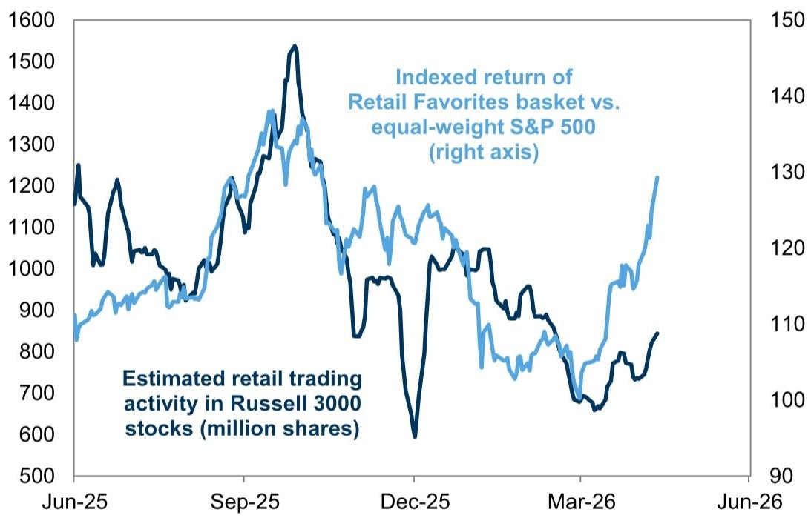

line

| Date   | Indexed return of Retail Favorites basket vs. equal-weight S&P 500 (right axis) | Estimated retail trading activity in Russell 3000 stocks (million shares) |
|--------|----------------------------------------------------------------------------------|--------------------------------------------------------------------|
| Jun-25 | ~1250                                                                            | ~1150                                                              |
| Sep-25 | ~1350                                                                            | ~1200                                                              |
| Dec-25 | ~600                                                                             | ~900                                                               |
| Mar-26 | ~100                                                                             | ~700                                                               |
| Jun-26 | ~1300                                                                            | ~850                                                               |

GSXURFAV basket developed by GS Global Banking & Markets. Retail trading activity reflects GS Global Banking & Markets' estimates of total shares executed on behalf of retail investors.

Source: GS Global Investment Research, GS FICC and Equities

Retail traders are a sUBSet of US households, which are the largest owner of the US equity market. We define retail investors as individuals making self-directed trading decisions in brokerage accounts. The Fed's latest Financial Accounts of the United States data (Z.1) show that US households are the largest owner of corporate equities. Of the \$111 trillion value of corporate equity assets, 40% is directly held by households. Including indirect ownership via retirement accounts, mutual funds, and ETFs, households own the majority of the US corporate equity market.

Exhibit 2: Ownership of the US equity market   
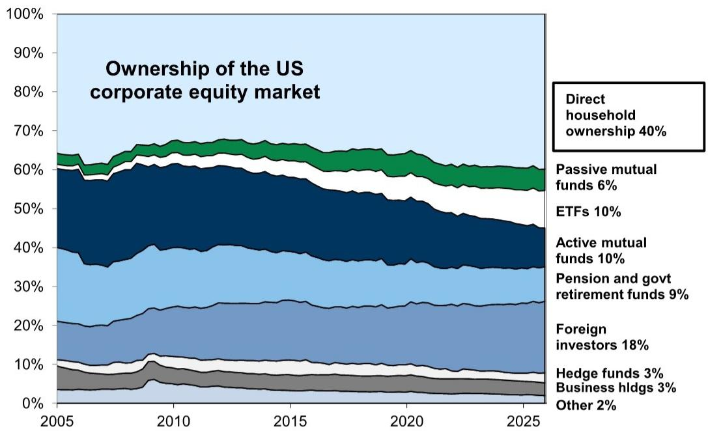

area_stacked

Ownership of the US corporate equity market
| Year | Direct household ownership (%) |
|---|---|
| 2005 | 40 |
| 2010 | 65 |
| 2015 | 63 |
| 2020 | 60 |
| 2025 | 58 |

| Ownership Type | Percentage (%) |
| :--- | :--- |
| Passive mutual funds | 6 |
| ETFs | 10 |
| Active mutual funds | 10 |
| Pension and govt retirement funds | 9 |
| Foreign investors | 18 |
| Hedge funds | 3 |
| Business hldgs | 3 |
| Other | 2 |

Source: Federal Reserve, GS Global Investment Research

# Household equity ownership is concentrated at the top of the wealth distribution.

The top 10% of households own 87% of total household equity assets while the bottom 50% of households own just 1% of the total.

However, households in the bottom half of the wealth distribution have historically made larger adjustments to their equity portfolios from quarter to quarter. Across the average quarter since 1990, flows into and out of equities from the bottom $50\%$ of households amounted to $3\%$ of their assets, nearly three times the average for the top $10\%$ of households.

Exhibit 3: Equity ownership share by wealth percentile   
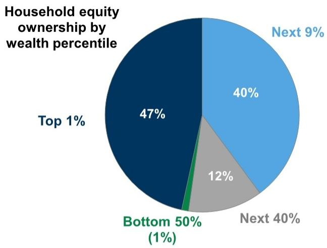

pie

Household equity ownership by wealth percentile
| Wealth Percentile | Percentage (%) |
| :--- | :--- |
| Top 1% | 47 |
| Next 9% | 40 |
| Next 40% | 12 |
| Bottom 50% (1%) | (1) |

The “Household” sector described in the DFAs includes private funds such as hedge funds. We reduce the value of the “Top 1%” category’s assets by the Federal Reserve’s estimate of hedge fund corporate equity assets.

Exhibit 4: Variation in household equity flows by wealth percentile quarterly since 1990   
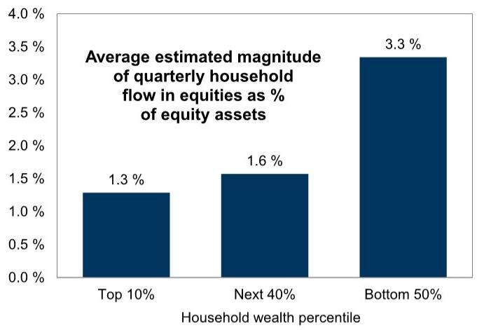

bar

Average estimated magnitude of quarterly household flow in equities as % of equity assets
| Household wealth percentile | Average estimated magnitude of quarterly household flow in equities as % of equity assets |
| :--- | :--- |
| Top 10% | 1.3 |
| Next 40% | 1.6 |
| Bottom 50% | 3.3 |

Source: Federal Reserve, GS Global Investment Research   
Source: Federal Reserve, GS Global Investment Research

We estimate that equity assets in self-directed brokerage accounts total \$12 trillion, or 18% of US household directly- and indirectly-owned equity assets. This equates to approximately 10% of total US corporate equity market value. The remaining share represents household equity assets held outside self-directed brokerage accounts, including the value of equity assets held in retirement accounts and equity ownership stakes in private companies, for example.

Exhibit 5: We estimate 18% of households' equity assets are held in self-directed brokerage accounts   
Estimated household ownership of equity assets (\$ trillions)   
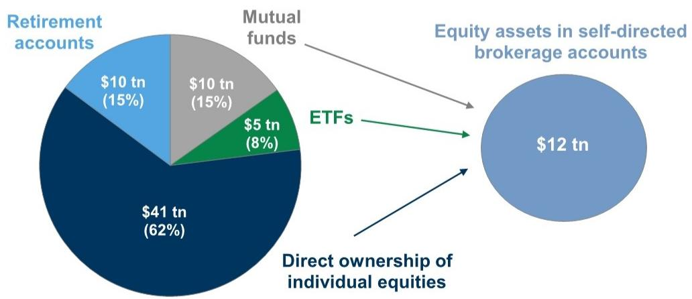

pie

| Category | Value ($tn) | Percentage (%) |
|---|---|---|
| Retirement accounts | 10 | 15 |
| Mutual funds | 10 | 15 |
| ETFs | 5 | 8 |
| Equity assets in self-directed brokerage accounts | 12 | - |
| Direct ownership of individual equities | 41 | 62 |

Includes ownership of foreign equities. Estimated equity assets in self-directed brokerage account reflects both direct equity ownership and ownership of equities through mutual fund and ETF shares. See appendix for estimation methodology.   
Source: Federal Reserve, GS Global Investment Research

Although retail trading assets represent roughly $10\%$ of US corporate equity assets, retail trading activity has recently accounted for roughly $20\%$ of total US equity trading volumes. According to Bloomberg estimates, retail traders accounted for $19\%$ of US equity trading volumes on average over the last 4 quarters, below a peak of $24\%$ in 2021 and up from $15\%$ a decade ago. As of Q1 2026 retail traders accounted for $17\%$ of US equity trading volumes. Nevertheless, retail's $17\%$ share of trading volume is smaller than the $34\%$ attributable to institutional investors in aggregate. FINRA estimates show that retail accounts for a smaller $11\%$ of trading volumes.

Exhibit 6: Retail share of trading activity has risen in past decade Latest estimate as of Q1 2026   
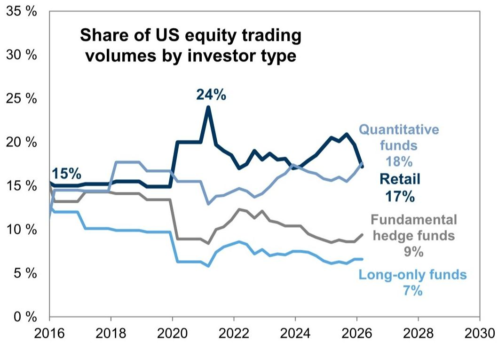

line

| Year | Quantitative funds | Retail | Fundamental hedge funds | Long-only funds |
|------|---------------------|--------|--------------------------|-----------------|
| 2016 | 15%                 | 15%    | 15%                      | 12%             |
| 2018 | 15%                 | 15%    | 15%                      | 10%             |
| 2020 | 15%                 | 15%    | 15%                      | 9%              |
| 2022 | 24%                 | 15%    | 12%                      | 8%              |
| 2024 | 18%                 | 15%    | 10%                      | 7%              |
| 2026 | 18%                 | 15%    | 9%                       | 7%              |
| 2028 | 18%                 | 15%    | 9%                       | 7%              |
| 2030 | 18%                 | 15%    | 9%                       | 7%              |

Remaining share of trading activity is attributable to banks and market makers.   
Source: Bloomberg, GS Global Investment Research

However, institutional investors typically interact directly with only a small portion of retail order flow. Retail brokers route over $87\%$ of order flow to specialized market makers known as wholesalers. A recent analysis from Schwarz et al. (2025) suggests that wholesalers execute $84\%$ of retail orders against their own inventories, a practice known as internalization. Retail orders that are not internalized are routed to another market maker, to dark pools, or to traditional exchanges. As a result, investors are able to access directly only a small share of retail trading activity.

Retail trading volumes are more likely to reach exchanges in volatile markets or when retail order flow becomes large and correlated, however. A 2021 SEC report noted that an increase in on-exchange volumes during volatility spikes may partly reflect wholesalers seeking to avoid internalizing retail orders as hedging becomes more difficult. Furthermore, large and imbalanced retail order flow makes it challenging for wholesalers to keep bid-ask spreads tighter than on-exchange spreads.

Retail trader assets are currently concentrated among a handful of large brokers.

Retail self-directed assets at Charles Schwab, Fidelity, and Vanguard account for roughly 80% of total retail self-directed assets, while Robinhood accounts for just 2%. In 2025, aggregated daily average trades were highest at Charles Schwab, totaling 8 million daily average trades. Daily average trades per account were highest at Interactive Brokers, whose accounts exhibited roughly 4 times the activity of remaining brokers with available data.

Exhibit 7: Retail investor assets are spread across multiple brokers 

<table><tr><td>Broker</td><td>Retail self-directed assets (trillions)</td><td>Share of retail self-directed assets</td></tr><tr><td>Charles Schwab</td><td>$6.6</td><td>38 %</td></tr><tr><td>Fidelity</td><td>4.4</td><td>25</td></tr><tr><td>Vanguard</td><td>2.8</td><td>16</td></tr><tr><td>MS / E*Trade</td><td>1.6</td><td>9</td></tr><tr><td>Wirehouses ex MS</td><td>0.9</td><td>5</td></tr><tr><td>Interactive Brokers</td><td>0.3</td><td>2</td></tr><tr><td>Robinhood</td><td>0.3</td><td>2</td></tr><tr><td>Other</td><td>0.5</td><td>3</td></tr><tr><td>Total</td><td>$17.5</td><td>100 %</td></tr></table>

Source: Cerulli Associates, Company data, GS Global Investment Research

Exhibit 8: Trading activity across select retail brokers   
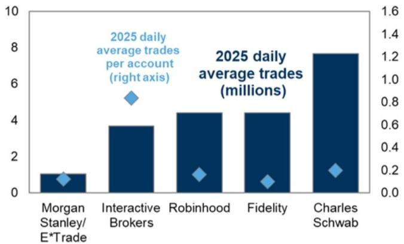

bar

| Category             | Value |
| -------------------- | ----- |
| MS/E*Trade | 1.0   |
| Interactive Brokers  | 3.8   |
| Robinhood            | 4.5   |
| Fidelity             | 4.5   |
| Charles Schwab       | 7.8   |

Number of 2025 retail accounts at Fidelity is estimated based on number of retail accounts in 2024, 2025 growth in total customer accounts, and proportion of retail accounts to total customer accounts from 2021-2024.   
Source: Data compiled by GS Global Investment Research

# Characteristics of retail trading activity

To analyze retail trading activity we utilize stock-level estimates of retail trading volumes from GS Global Banking & Markets. These estimates largely rely on identifying retail trades in Trade Reporting Facility (TRF) data using an identification method from Boehmer et al. (2021). This approach has become common in academic literature studying retail trading activity $^{1}$ . Academic research has also shown that estimates of retail trading activity using this methodology are likely conservative, particularly for stocks that trade with wide bid-ask spreads $^{2}$ .

# Margin debt and leverage

Margin debt has recently surged to new highs. Margin debt across all FINRA member firms rose to \$1.3 trillion this year, or 52% of gross customer balances. This share is the highest level on record and 6 pp above the previous highest reading in 1998.

Exhibit 9: Margin debt remains near record highs   
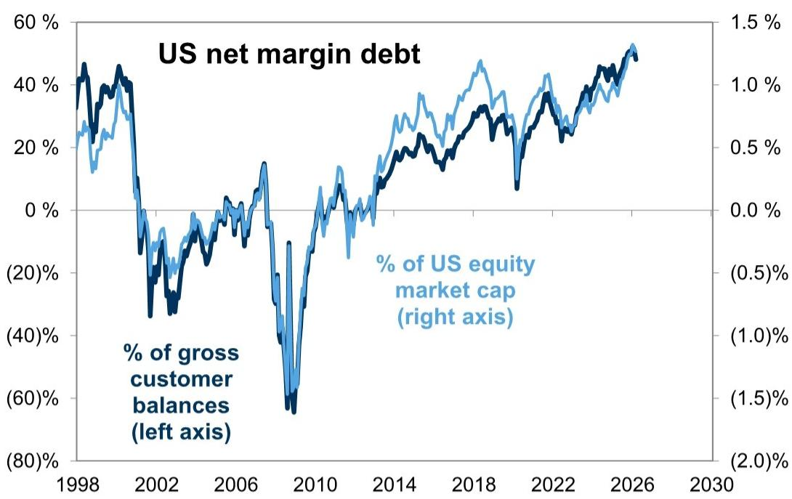

line

| Year | % of US equity market cap (right axis) | % of gross customer balances (left axis) |
|------|------------------------------------------|-------------------------------------------|
| 1998 | ~40%                                     | ~45%                                      |
| 2002 | ~-20%                                    | ~-30%                                     |
| 2006 | ~0%                                      | ~0%                                       |
| 2010 | ~-60%                                    | ~-70%                                     |
| 2014 | ~20%                                     | ~15%                                      |
| 2018 | ~45%                                     | ~35%                                      |
| 2022 | ~35%                                     | ~30%                                      |
| 2026 | ~50%                                     | ~45%                                      |

Source: FINRA, GS Global Investment Research

Margin balances have also increased sharply at several retail brokers. Margin balances at Interactive Brokers, Robinhood, and Charles Schwab registered \$230 billion at the end of March, equating to 1.8% of customer assets. This share is now slightly above the previous record from 2021 but has not meaningfully surpassed that high, in contrast with FINRA data.

Much of the rise in total margin debt over the past decade has likely been driven by institutional investors. FINRA's margin statistics show a \$737 billion increase in margin debt over the past decade vs. a \$189 billion increase in margin balances at Interactive Brokers, Robinhood, and Charles Schwab in aggregate. Furthermore, a recent FINRA survey shows that the proportion of retail investors who own margin accounts and who make margin purchases has declined since 2015.

Exhibit 10: Margin balances at several retail brokers have surged   
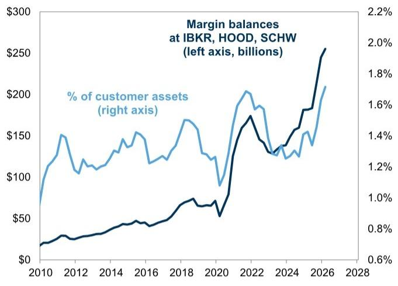

line

| Year | % of customer assets (right axis) | Margin balances (left axis, billions) |
|------|------------------------------------|----------------------------------------|
| 2010 | ~$20                               | ~1.0%                                  |
| 2012 | ~$30                               | ~1.2%                                  |
| 2014 | ~$40                               | ~1.4%                                  |
| 2016 | ~$50                               | ~1.6%                                  |
| 2018 | ~$70                               | ~1.8%                                  |
| 2020 | ~$50                               | ~1.0%                                  |
| 2022 | ~$170                              | ~1.6%                                  |
| 2024 | ~$130                              | ~1.4%                                  |
| 2026 | ~$210                              | ~2.0%                                  |
| 2028 | ~$250                              | ~2.2%                                  |

Source: GS Global Investment Research

Exhibit 11: FINRA survey of retail investors suggests margin usage has become less prevalent   
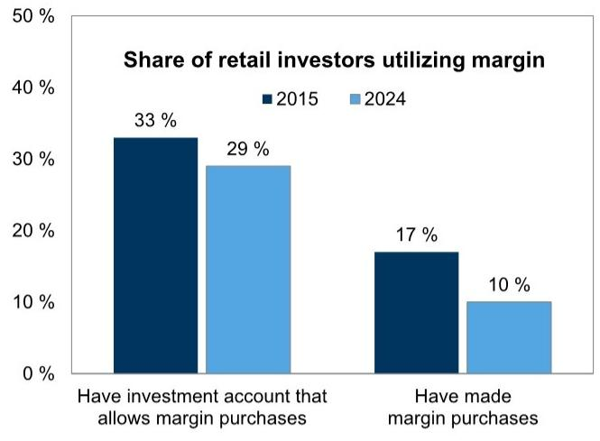

bar

Share of retail investors utilizing margin
| Category | 2015 (%) | 2024 (%) |
|---|---|---|
| Have investment account that allows margin purchases | 33 | 29 |
| Have made margin purchases | 17 | 10 |

Source: FINRA, GS Global Investment Research

In addition to margin, retail traders amplify returns via leveraged ETFs. Since 2021, the retail share of trading volumes in leveraged index ETFs has been roughly double the share in ETFs tracking the same indices without leverage.

Exhibit 12: Retail trading activity has been higher in leveraged US equity index ETFs   
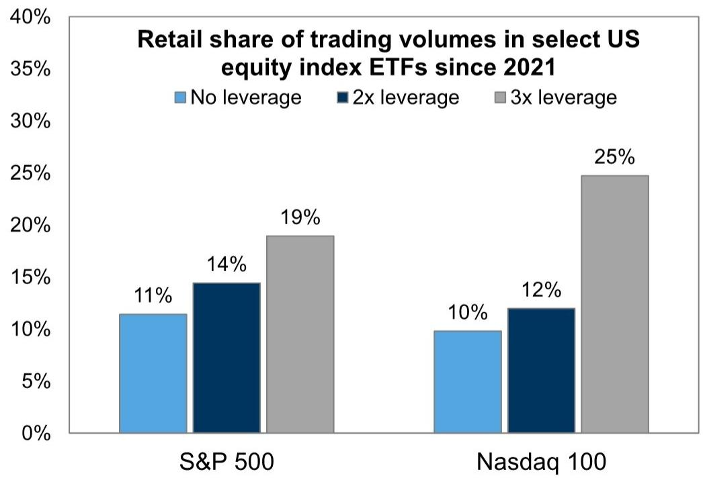

bar

Retail share of trading volumes in select US equity index ETFs since 2021
| Exchange | No leverage (%) | 2x leverage (%) | 3x leverage (%) |
| :--- | :--- | :--- | :--- |
| S&P 500 | 11 | 14 | 19 |
| Nasdaq 100 | 10 | 12 | 25 |

ETFs included in analysis are the largest ETFs by AUM tracking the S&P 500 or Nasdaq 100 in their respective leverage category. VOO, SSO, SPXL, QQQ, QLD, TQQQ.   
Source: GS Global Investment Research

# Leveraged ETF AUM has grown from \$16 billion to \$140 billion over the past decade.

Today, leveraged ETF AUM accounts for market exposure of roughly \$370 billion.

Despite the growth in assets, these funds still represent less than $1\%$ of total US equity

mutual fund and ETF AUM.

Exhibit 13: Leveraged US equity ETF AUM has grown by more than \$100 billion during the past decade   
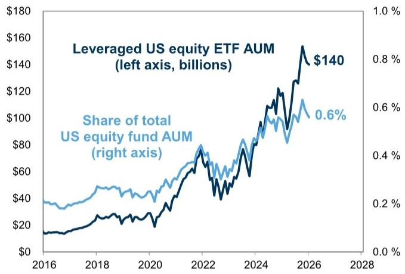

line

| Year | Leveraged US equity ETF AUM (left axis, billions) | Share of total US equity fund AUM (right axis) |
|------|--------------------------------------------------|-----------------------------------------------|
| 2016 | $15                                              | 0.1                                           |
| 2018 | $30                                              | 0.3                                           |
| 2020 | $40                                              | 0.4                                           |
| 2022 | $70                                              | 0.5                                           |
| 2024 | $100                                             | 0.6                                           |
| 2026 | $140                                             | 0.6                                           |

Source: EPFR, GS Global Investment Research

Exhibit 14: Market exposure of leveraged US equity ETF assets   
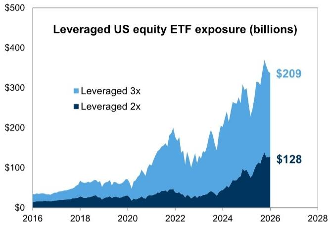

area

| Year | Leveraged 3x | Leveraged 2x |
|------|--------------|--------------|
| 2026 | $209         | $128         |

Source: EPFR, GS Global Investment Research

Sectors, factor, and size tilts

Across sectors, retail trading volumes have been the highest share of trading volumes within Consumer Discretionary and Technology. Within sectors, retail trading activity this year has tilted toward more volatile stocks and stocks with higher valuations.

Exhibit 15: Retail trading activity is more prevalent in the Consumer Discretionary and Info Tech sectors

Market cap weighted average based on data across Russell 3000 stocks since 2021

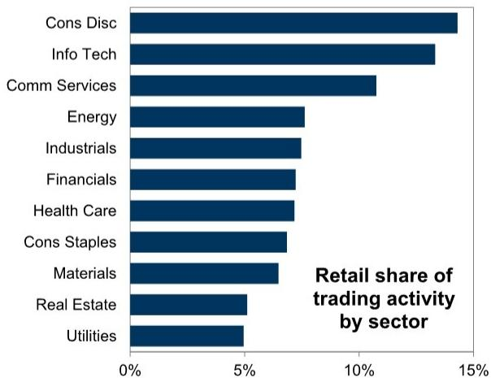

bar

Retail share of trading activity by sector
| Sector | Retail share (%) |
|---|---|
| Cons Disc | 14.5 |
| Info Tech | 13.2 |
| Comm Services | 10.8 |
| Energy | 7.6 |
| Industrials | 7.5 |
| Financials | 7.4 |
| Health Care | 7.3 |
| Cons Staples | 6.9 |
| Materials | 6.5 |
| Real Estate | 5.1 |
| Utilities | 5.0 |

Source: GS Global Investment Research   
Average in long leg minus average in short leg. Based on retail activity data across S&P 500 stocks YTD

Exhibit 16: Retail trading activity is tilted towards more volatile and higher valuation stocks

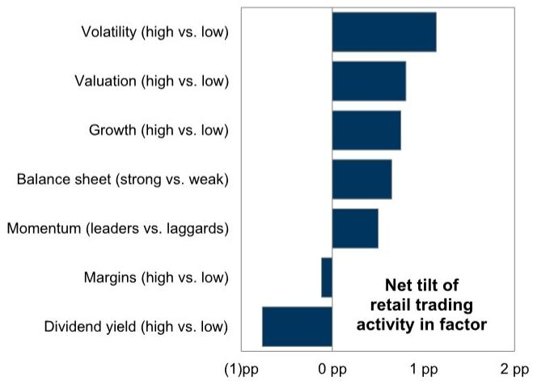

bar

Net tilt of retail trading activity in factor
| Factor | Net tilt (pp) |
|---|---|
| Volatility (high vs. low) | 1.2 |
| Valuation (high vs. low) | 0.9 |
| Growth (high vs. low) | 0.85 |
| Balance sheet (strong vs. weak) | 0.75 |
| Momentum (leaders vs. laggards) | 0.6 |
| Margins (high vs. low) | 0.1 |
| Dividend yield (high vs. low) | -0.3 |

Source: GS Global Investment Research

Retail trading activity is highest in stocks with the smallest market caps. Year to date, retail has accounted for 9% of trading volumes on average across stocks in the bottom quintile of Russell 3000 market cap, which includes companies with market caps ranging from \$16 million to \$500 million. Among stocks with market-caps greater than \$1 billion, however, retail trading activity is tilted slightly towards mega-caps. Retail has accounted for 8% of trading volumes on average in stocks with market caps greater than

\$100 billion year to date.

Exhibit 17: Retail's share of trading activity varies by market cap Based on retail activity data across Russell 3000 stocks YTD   
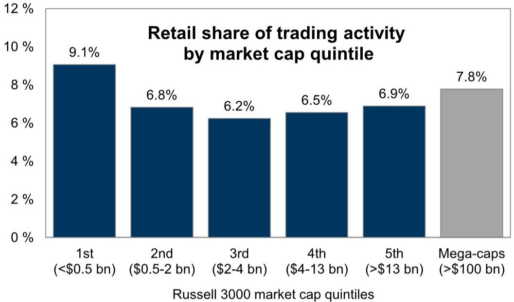

bar

Retail share of trading activity by market cap quintile
| Market Cap Quintile | Retail Share (%) |
| :--- | :--- |
| 1st (<$0.5 bn) | 9.1 |
| 2nd ($0.5-2 bn) | 6.8 |
| 3rd ($2-4 bn) | 6.2 |
| 4th ($4-13 bn) | 6.5 |
| 5th (>$13 bn) | 6.9 |
| Mega-caps (>$100 bn) | 7.8 |

Source: GS Global Investment Research

# Short interest

Retail traders are generally more active in stocks with high levels of short interest. In 2025, retail trading activity accounted for $13\%$ of volumes for the top $5\%$ of stocks based on short interest. This marks an increase from $9\%$ in 2019 and $11\%$ in 2021.

Exhibit 18: Retail trading activity is more pronounced in stocks with high short interest Russell 3000 stocks   
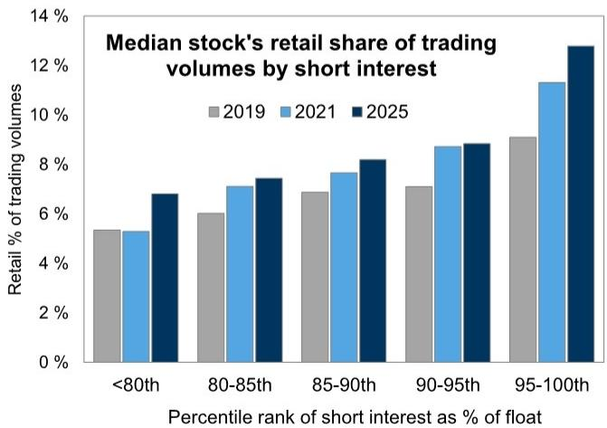

bar

Median stock's retail share of trading volumes by short interest
| Percentile rank of short interest as % of float | 2019 (%) | 2021 (%) | 2025 (%) |
|---|---|---|---|
| <80th | 5.3 | 5.3 | 6.8 |
| 80-85th | 6.0 | 7.1 | 7.4 |
| 85-90th | 6.9 | 7.7 | 8.2 |
| 90-95th | 7.1 | 8.7 | 8.8 |
| 95-100th | 9.1 | 11.3 | 12.8 |

Short interest based on average short interest across year.   
Source: GS Global Investment Research

# Equity market drawdowns

Retail trading activity in index-linked US equity ETFs has increased during each of the largest recent equity market selloffs. Retail trading volumes in the largest US equity ETFs (SPY, VOO, IVV) increased markedly during S&P 500 drawdowns in 2020, 2022, and 2025. While trading volumes across all investor types tend to rise during drawdowns, the retail share of trading in these ETFs also increased in 2020 and 2022. In contrast, during the 2025 selloff, retail trading volumes in the largest index ETFs increased sharply in absolute terms but declined as a share of total trading volumes. During the S&P 500 drawdown in March 2026, retail trading volumes in index ETFs rose only modestly in absolute terms and again declined as a share of total trading volumes.

Exhibit 19: Retail trading activity in index products rises around selloffs   
Retail shares traded series reflects 21-day moving average   
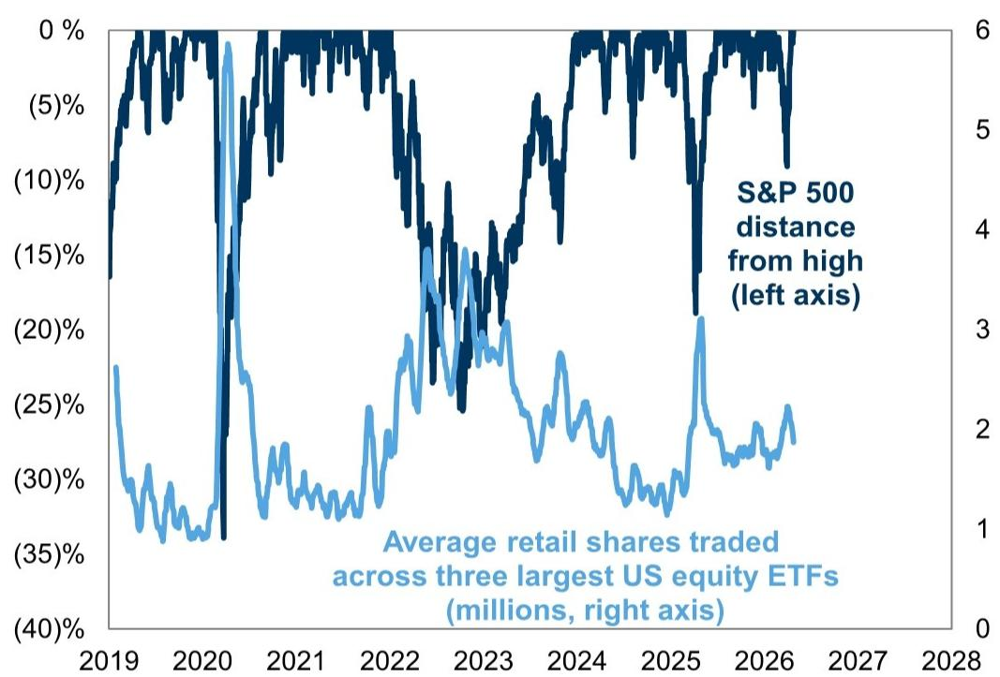

line

| Year | S&P 500 distance from high (left axis) | Average retail shares traded across three largest US equity ETFs (millions, right axis) |
|------|------------------------------------------|----------------------------------------------------------------------------------|
| 2019 | ~0%                                      | ~-25%                                                                            |
| 2020 | ~-15%                                    | ~-35%                                                                            |
| 2021 | ~-10%                                    | ~-30%                                                                            |
| 2022 | ~-15%                                    | ~-25%                                                                            |
| 2023 | ~-20%                                    | ~-20%                                                                            |
| 2024 | ~-15%                                    | ~-15%                                                                            |
| 2025 | ~-10%                                    | ~-10%                                                                            |
| 2026 | ~-5%                                     | ~-5%                                                                             |
| 2027 | ~0%                                      | ~0%                                                                              |
| 2028 | ~0%                                      | ~0%                                                                              |

ETFs include VOO, IVV, SPY   
Source: GS Global Investment Research

Within the market, retail trading activity has also tended to increase in stocks with sharp single-day declines. Stocks with larger declines have generally experienced larger increases in retail activity, and the elevated activity has generally persisted during the few days sUBSequent to the selloff.

Exhibit 20: Share of retail trading activity also rises following stock selloffs, particularly following larger selloffs   
Based on sample of 1-day selloffs of at least $5\%$ across S&P 500 stocks since 2021   
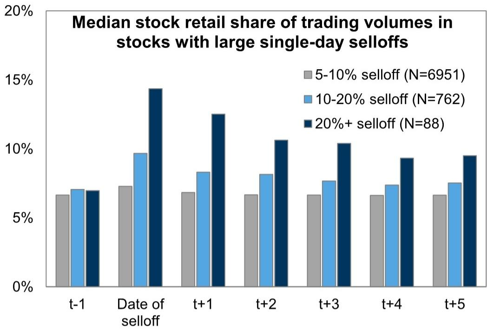

bar

Median stock retail share of trading volumes in stocks with large single-day selloffs
| Category | 5-10% selloff (N=6951) (%) | 10-20% selloff (N=762) (%) | 20%+ selloff (N=88) (%) |
| :--- | :--- | :--- | :--- |
| t-1 | 6.7 | 7.0 | 6.9 |
| Date of selloff | 7.3 | 9.7 | 14.4 |
| t+1 | 6.8 | 8.3 | 12.5 |
| t+2 | 6.7 | 8.1 | 10.6 |
| t+3 | 6.6 | 7.6 | 10.3 |
| t+4 | 6.6 | 7.3 | 9.3 |
| t+5 | 6.6 | 7.4 | 9.5 |

Source: GS Global Investment Research

# How retail trading interacts with markets

Stocks with above-average retail trading activity generally have above-average valuations, controlling for fundamental factors. A cross-sectional regression of EV/sales multiples across Russell 3000 stocks indicates that fundamental variables such as sales growth and profitability are the primary drivers of stock valuations today. Nevertheless, even after controlling for these characteristics, a one standard deviation increase in retail trading activity corresponds with a 0.16 standard deviation increase in a stock's forward EV/sales multiple (roughly half a turn). Causality is difficult to prove through this analytical framework, however. Retail investors are generally more active in high valuation stocks (Exhibit 16), and the relationship between retail trading and valuation multiples may reflect a preference for stocks with valuations that are driven by a variable absent from our model.

Exhibit 21: Growth and profitability are stronger drivers of valuation than retail trading activity

Standardized coefficients based on results of cross-sectional regression. All variables significant at 1% level.

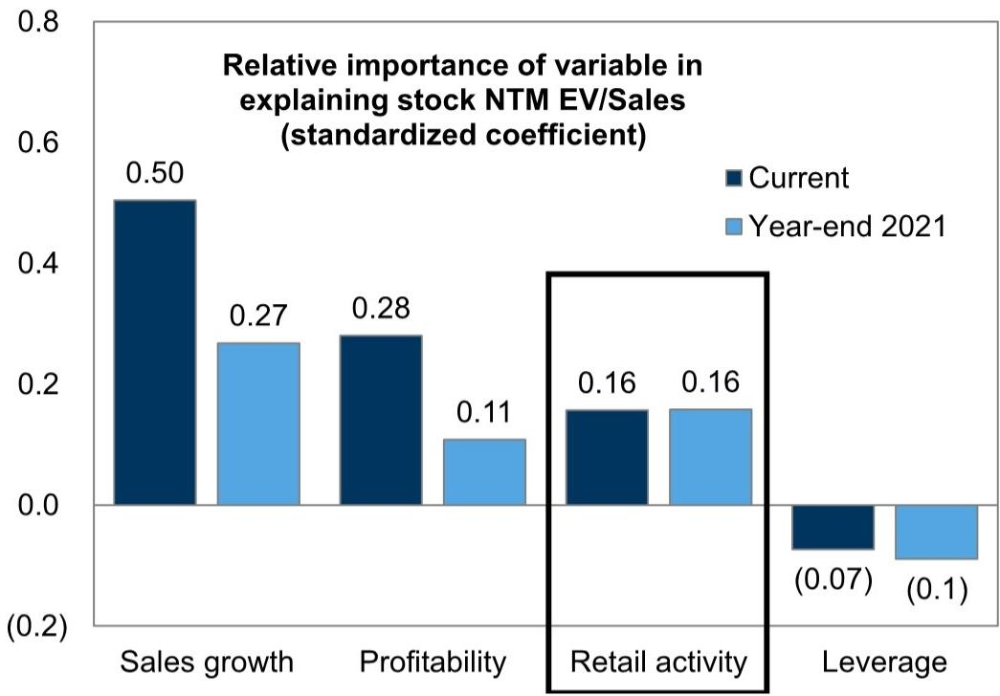

bar

Relative importance of variable in explaining stock NTM EV/Sales (standardized coefficient)
| Variable | Current | Year-end 2021 |
| :--- | :--- | :--- |
| Sales growth | 0.50 | 0.27 |
| Profitability | 0.28 | 0.11 |
| Retail activity | 0.16 | 0.16 |
| Leverage | -0.07 | -0.1 |

Regression based on universe of Russell 3000 stocks with market caps greater than \$2 billion, excluding Biotech, Financials, Real Estate, and Utilities. Sales growth based on 1-year forward consensus estimates; profitability based on 1-year forward consensus estimates of EBITDA margins Retail activity based on retail share of trading volumes in 2021 and 2026 YTD; leverage is measured by Assets/Equity ratio.   
Source: GS Global Investment Research

Similarly, higher retail activity in stocks has been associated with greater volatility, even after taking into account fundamental variability. One potential explanation for this relationship is that higher retail trading activity is a driver of stock volatility, although Exhibit 16 shows that retail traders are generally more active in volatile stocks. To control for fundamental sources of realized volatility, we include measures of a stock's historical variation in EBITDA growth, as well as earnings revisions.

Exhibit 22: Stocks with high volatility tend to have higher retail trading activity   
Based on universe of Russell 3000 stocks   
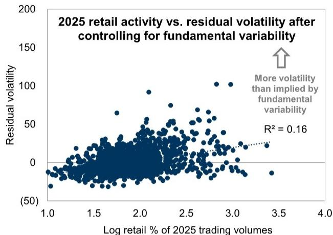

scatter

| Log retail % of 2025 trading volumes | Residual volatility |
| ------------------------------------ | ------------------- |
| 1.0                                  | -50                 |
| 1.5                                  | 0                   |
| 2.0                                  | 50                  |
| 2.5                                  | 100                 |
| 3.0                                  | 150                 |
| 3.5                                  | 200                 |
| 4.0                                  | 100                 |

Residuals based on regression of stock 2025 volatility on consensus revisions to 2025 EPS estimates during 2025 and the standard deviation of 5-year trailing EBITDA growth.

Exhibit 23: Significant relationship between retail trading activity and stock volatility 

<table><tr><td colspan="3">Dependent variable: 2025 annualized stock volatility</td></tr><tr><td>Variable</td><td>Beta</td><td>T-stat</td></tr><tr><td>Log retail % of 2025 trading volumes</td><td>18.40</td><td>18.1**</td></tr><tr><td>Revision to 2025 EPS</td><td>0.03</td><td>2.5*</td></tr><tr><td>Log trailing 5-year EBITDA variability</td><td>4.01</td><td>14.5**</td></tr><tr><td>Observations</td><td>1763</td><td></td></tr><tr><td>R^2</td><td>0.28</td><td></td></tr></table>

\* and \*\* denote significance at 5% and 1% levels. Starting universe of Russell 3000 stocks, stocks without full data for all variables are excluded from sample.   
Source: GS Global Investment Research   
Source: GS Global Investment Research

Stocks with high levels of retail trading activity have exhibited greater underperformance than stocks with lower levels of retail trading activity following negative earnings surprises. These results suggest that high levels of retail trading activity may impact how stocks react to new fundamental information. Our analysis captures the post-earnings performance of S&P 500 stocks across a sample of earnings surprises since 2021. Other research $^{3}$ has found retail trading activity can lead to higher stock volatility, valuations, and returns.

Exhibit 24: Stocks with higher retail trading activity trade differently around earnings surprises   
S&P 500 stocks' earnings results since 2021   
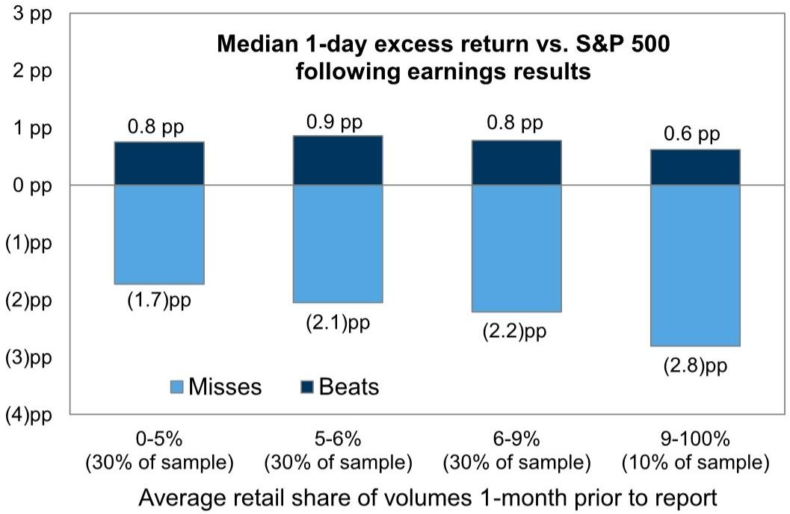

bar_stacked

Median 1-day excess return vs. S&P 500 following earnings results
| Average retail share of volumes 1-month prior to report | Misses (pp) | Beats (pp) |
| :--- | :--- | :--- |
| 0-5% (30% of sample) | -1.7 | 0.8 |
| 5-6% (30% of sample) | -2.1 | 0.9 |
| 6-9% (30% of sample) | -2.2 | 0.8 |
| 9-100% (10% of sample) | -2.8 | 0.6 |

Earnings beats and misses are defined as earnings results that are above or below consensus expectations by at least one standard deviation of estimates.

Source: GS Global Investment Research

Exhibit 25: Top 25 constituents of GSXURFAV based on retail share of trading volumes YTD 

<table><tr><td>Ticker</td><td>Name</td><td>Sector</td><td>Mkt cap ($ billion)</td><td>YTD return</td><td>12m return</td><td>Retail % of volumes YTD</td><td>2027 sales growth</td><td>NTM EV/ sales</td></tr><tr><td>AAL</td><td>American Airlines Group Inc.</td><td>Industrials</td><td>8</td><td>(17)%</td><td>13%</td><td>27%</td><td>4%</td><td>0.6 x</td></tr><tr><td>NU</td><td>Nu Holdings Ltd.</td><td>Financials</td><td>73</td><td>(21)</td><td>11</td><td>21</td><td>21</td><td>4.1</td></tr><tr><td>SOFI</td><td>SoFi Technologies Inc</td><td>Financials</td><td>25</td><td>(39)</td><td>21</td><td>20</td><td>22</td><td>4.0</td></tr><tr><td>TSLA</td><td>Tesla, Inc.</td><td>Consumer Discretionary</td><td>1,473</td><td>(4)</td><td>28</td><td>18</td><td>15</td><td>13.9</td></tr><tr><td>APLD</td><td>Applied Digital Corporation</td><td>Information Technology</td><td>9</td><td>79</td><td>497</td><td>18</td><td>109</td><td>20.6</td></tr><tr><td>SNDK</td><td>Sandisk Corporation</td><td>Information Technology</td><td>135</td><td>512</td><td>3795</td><td>17</td><td>41</td><td>5.9</td></tr><tr><td>HIMS</td><td>Hims &amp; Hers Health, Inc.</td><td>Health Care</td><td>7</td><td>(23)</td><td>(54)</td><td>17</td><td>20</td><td>2.0</td></tr><tr><td>INTC</td><td>Intel Corporation</td><td>Information Technology</td><td>330</td><td>227</td><td>502</td><td>16</td><td>11</td><td>10.6</td></tr><tr><td>PLTR</td><td>Palantir Technologies Inc.</td><td>Information Technology</td><td>349</td><td>(23)</td><td>10</td><td>16</td><td>44</td><td>38.6</td></tr><tr><td>MU</td><td>Micron Technology, Inc.</td><td>Information Technology</td><td>506</td><td>169</td><td>723</td><td>16</td><td>33</td><td>5.7</td></tr><tr><td>AMD</td><td>Advanced Micro Devices, Inc.</td><td>Information Technology</td><td>448</td><td>109</td><td>306</td><td>16</td><td>52</td><td>12.5</td></tr><tr><td>RKLB</td><td>Rocket Lab Corporation</td><td>Industrials</td><td>52</td><td>69</td><td>362</td><td>15</td><td>39</td><td>67.8</td></tr><tr><td>F</td><td>Ford Motor Company</td><td>Consumer Discretionary</td><td>51</td><td>(6)</td><td>21</td><td>15</td><td>(1)</td><td>0.9</td></tr><tr><td>NVDA</td><td>NVIDIA Corporation</td><td>Information Technology</td><td>4,910</td><td>18</td><td>68</td><td>15</td><td>34</td><td>13.3</td></tr><tr><td>HOOD</td><td>Robinhood Markets, Inc.</td><td>Financials</td><td>82</td><td>(31)</td><td>24</td><td>15</td><td>23</td><td>15.6</td></tr><tr><td>PFE</td><td>Pfizer Inc.</td><td>Health Care</td><td>157</td><td>7</td><td>19</td><td>14</td><td>(4)</td><td>3.3</td></tr><tr><td>ASTS</td><td>AST SpaceMobile, Inc.</td><td>Communication Services</td><td>24</td><td>0</td><td>203</td><td>13</td><td>344</td><td>57.2</td></tr><tr><td>SMCI</td><td>Super Micro Computer, Inc.</td><td>Information Technology</td><td>17</td><td>12</td><td>(18)</td><td>13</td><td>22</td><td>0.6</td></tr><tr><td>MSTR</td><td>Strategy Inc</td><td>Information Technology</td><td>59</td><td>21</td><td>(50)</td><td>13</td><td>2</td><td>152.0</td></tr><tr><td>COIN</td><td>Coinbase Global, Inc.</td><td>Financials</td><td>56</td><td>(8)</td><td>(21)</td><td>13</td><td>24</td><td>7.8</td></tr><tr><td>AAOI</td><td>Applied Optoelectronics, Inc.</td><td>Information Technology</td><td>12</td><td>440</td><td>953</td><td>12</td><td>169</td><td>8.4</td></tr><tr><td>APP</td><td>AppLovin Corp.</td><td>Information Technology</td><td>166</td><td>(27)</td><td>38</td><td>12</td><td>30</td><td>18.4</td></tr><tr><td>BE</td><td>Bloom Energy Corporation</td><td>Industrials</td><td>62</td><td>223</td><td>1341</td><td>12</td><td>70</td><td>19.6</td></tr><tr><td>WDC</td><td>Western Digital Corporation</td><td>Information Technology</td><td>127</td><td>184</td><td>878</td><td>11</td><td>31</td><td>11.1</td></tr><tr><td>ORCL</td><td>Oracle Corporation</td><td>Information Technology</td><td>511</td><td>(4)</td><td>21</td><td>11</td><td>41</td><td>7.7</td></tr></table>

Basket developed by GBM   
Source: GS Global Investment Research, GS FICC and Equities

Exhibit 26: Estimation methodology of household ownership of equities 

<table><tr><td>Household ownership category</td><td>Estimation methodology</td></tr><tr><td>ETFs</td><td>We start with the value of corporate equity assets held by ETFs from the Federal Reserve&#x27;s latest Z.1 data release. Because ETFs can be held by other investor types besides households we estimate the share of ETFs&#x27; corporate equity assets held by households. We estimate this share by calculating the split between institutional (13F filers) and non-institutional ownership of the 100 largest US equity ETFs by AUM and assume the share of assets not held by institutions corresponds to households.</td></tr><tr><td>Retirement accounts</td><td>We utilize the value of corporate equity assets held by private and public pension funds from the Federal Reserve&#x27;s latest Z.1 data.</td></tr><tr><td>Mutual funds</td><td>We start with the value of corporate equity assets held by Mutual Funds from the Federal Reserve&#x27;s latest Z.1 data release. We estimate the share of these assets that are owned by households by dividing the value of mutual fund shares on household balance sheets by total mutual fund assets. Both of these figures are obtained from the Federal Reserve&#x27;s Z.1 data release.</td></tr><tr><td>Direct ownership of individual equities</td><td>We start with the value of corporate equity assets held by Households from the Federal Reserve&#x27;s latest Z.1 data. Because this figure includes the value of closed-end fund and ETF shares we subtract the value of closed-end funds&#x27; corporate equity holdings taken from the Z.1 release and subtract the value of household&#x27;s equity ownership via ETFs utilizing our estimate described above.</td></tr><tr><td>Equity assets in self-directed brokerage accounts</td><td>We start with the value of retail self-directed assets based on data from Cerulli Associates and estimates from GS Research. We then assume that 70% of these assets are allocated to equities. This assumption is supported by data from ICI and EBRI which shows the average allocation of 401(k) plan assets to equities was 70% in 2022. We would expect self-directed brokerage accounts to exhibit a more risk-on asset allocation relative to 401(k) plan allocations so we view our estimate as conservative.</td></tr></table>

Source: GS Global Investment Research

# Disclosure Appendix

# Reg AC

We, Daniel Chavez, Ben Snider, Ryan Hammond, Jenny Ma, Kartik Jayachandran and Christophe Sung, hereby certify that all of the views expressed in this report accurately reflect our personal views, which have not been influenced by considerations of the firm's business or client relationships.

Unless otherwise stated, the individuals listed on the cover page of this report are analysts in GS' Global Investment Research division.

Contributing Authors: Daniel Chavez GS & Co. LLC, Ben Snider GS & Co. LLC, Ryan Hammond GS & Co. LLC, Jenny Ma GS & Co. LLC, Kartik Jayachandran GS & Co. LLC, Christophe Sung GS & Co. LLC.

Unless otherwise stated, the individuals listed in the Contributing Authors disclosure of this report are analysts in GS' Global Investment Research division.

# Disclosures

# Basket disclosure

The ability to trade the basket(s) in this report will depend upon market conditions, including liquidity and borrow constraints at the time of trade.

# Marquee disclosure

Marquee is a product of GS FICC and Equities. Any Marquee content linked in this report is not necessarily representative of GS Research views. If you need access to Marquee, please contact your GS salesperson or email the Marquee team at gs-marquee-sales@gs.com.

# Regulatory disclosures

# Disclosures required by United States laws and regulations

See company-specific regulatory disclosures above for any of the following disclosures required as to companies referred to in this report: manager or co-manager in a pending transaction; $1\%$ or other ownership; compensation for certain services; types of client relationships; managed/co-managed public offerings in prior periods; directorships; for equity securities, market making and/or specialist role. GS trades or may trade as a principal in debt securities (or in related derivatives) of issuers discussed in this report.

The following are additional required disclosures: Ownership and material conflicts of interest: GS policy prohibits its analysts, professionals reporting to analysts and members of their households from owning securities of any company in the analyst's area of coverage. Analyst compensation: Analysts are paid in part based on the profitability of GS, which includes investment banking revenues. Analyst as officer or director: GS policy generally prohibits its analysts, persons reporting to analysts or members of their households from serving as an officer, director or advisor of any company in the analyst's area of coverage. Non-U.S. Analysts: Non-U.S. analysts may not be associated persons of GS & Co. LLC and therefore may not be subject to FINRA Rule 2241 or FINRA Rule 2242 restrictions on communications with a subject company, public appearances and trading in securities covered by the analysts.

# Additional disclosures required under the laws and regulations of jurisdictions other than the United States

The following disclosures are those required by the jurisdiction indicated, except to the extent already made above pursuant to United States laws and regulations. Australia: GS Australia Pty Ltd and its affiliates are not authorised deposit-taking institutions (as that term is defined in the Banking Act 1959 (Cth)) in Australia and do not provide banking services, nor carry on a banking business, in Australia. This research, and any access to it, is intended only for “wholesale clients” within the meaning of the Australian Corporations Act, unless otherwise agreed by GS. In producing research reports, members of Global Investment Research of GS Australia may attend site visits and other meetings hosted by the companies and other entities which are the subject of its research reports. In some instances the costs of such site visits or meetings may be met in part or in whole by the issuers concerned if GS Australia considers it is appropriate and reasonable in the specific circumstances relating to the site visit or meeting. To the extent that the contents of this document contains any financial product advice, it is general advice only and has been prepared by GS without taking into account a client’s objectives, financial situation or needs. A client should, before acting on any such advice, consider the appropriateness of the advice having regard to the client’s own objectives, financial situation and needs. A copy of certain GS Australia and New Zealand disclosure of interests and a copy of GS’ Australian Sell-Side Research Independence Policy Statement are available at: https://www.goldmansachs.com/disclosures/australia-new-zealand/index.html. Brazil: Disclosure information in relation to CVM Resolution n. 20 is available at https://www.gs.com/worldwide/brazil/area/gir/index.html. Where applicable, the Brazil-registered analyst primarily responsible for the content of this research report, as defined in Article 20 of CVM Resolution n. 20, is the first author named at the beginning of this report, unless indicated otherwise at the end of the text. Canada: This information is being provided to you for information purposes only and is not, and under no circumstances should be construed as, an advertisement, offering or solicitation by GS & Co. LLC for purchasers of securities in Canada to trade in any Canadian security. GS & Co. LLC is not registered as a dealer in any jurisdiction in Canada under applicable Canadian securities laws and generally is not permitted to trade in Canadian securities and may be prohibited from selling certain securities and products in certain jurisdictions in Canada. If you wish to trade in any Canadian securities or other products in Canada please contact GS Canada Inc., an affiliate of The GS Group Inc., or another registered Canadian dealer. Hong Kong: Further information on the securities of covered companies referred to in this research may be obtained on request from GS (Asia) L.L.C. India: Further information on the subject company or companies referred to in this research may be obtained from GS (India) Securities Private Limited, Research Analyst – SEBI Registration Number INH000001493, 10th Floor, Ascent-Worli, Sudam Kalu Ahire Marg, Worli, Mumbai-400 025, India, Corporate Identity Number U74140MH2006FTC160634, Phone +91 22 6616 9000, Fax +91 22 6616 9001. GS may beneficially own 1% or more of the securities (as such term is defined in clause 2 (h) the Indian Securities Contracts (Regulation) Act, 1956) of the subject company or companies referred to in this research report. Investment in securities market are subject to market risks. Read all the related documents carefully before investing. Registration granted by SEBI and certification from NISM in no way guarantee performance of the intermediary or provide any assurance of returns to investors. GS (India) Securities Private Limited compliance officer and investor grievance contact details can be found at: https://www.goldmansachs.com/worldwide/india/documents/Grievance-Redressal-and-Escalation-Matrix.pdf, and a copy of the annual audit compliance report can be found at this link: https://publishing.gs.com/content/site/india-annual-compliance-report.html. Japan: See below. Korea: This research, and any access to it, is intended only for “professional investors” within the meaning of the Financial Services and Capital Markets Act, unless otherwise agreed by GS. Further information on the subject company or companies referred to in this research may be obtained from GS (Asia) L.L.C., Seoul Branch. New Zealand: GS New Zealand Limited and its affiliates are neither “registered banks” nor “deposit takers” (as defined in the Reserve Bank of New Zealand Act 1989) in New Zealand. This research, and any access to it, is intended for “wholesale clients” (as defined in the Financial Advisers Act 2008) unless otherwise agreed by GS. A copy of certain GS Australia and New Zealand disclosure of interests is available at: https://www.goldmansachs.com/disclosures/australia-new-zealand/index.html. Russia: Research reports distributed in the Russian Federation are not advertising as defined in the Russian legislation, but are information and analysis not having product promotion as their main purpose and do not provide appraisal within the meaning of the Russian legislation on appraisal activity. Research reports do not constitute a personalized investment recommendation as defined in Russian laws and regulations, are not addressed to a specific client, and are prepared without analyzing the financial circumstances, investment profiles or risk profiles of clients. GS assumes no responsibility for any investment decisions that may be taken by a client or any other person based on this research report. Singapore: GS (Singapore) Pte. (Company Number: 198602165W), which is regulated by the Monetary Authority of Singapore, accepts legal responsibility for this research, and should be contacted with respect to any matters arising from, or in connection with, this research. Taiwan: This material is for reference only and must not be reprinted without permission. Investors should carefully consider their own investment risk. Investment results are the responsibility of the individual investor. United Kingdom: Persons who would be categorized as retail clients in the United Kingdom, as such term is defined in the rules of the Financial Conduct Authority, should read this research in conjunction with prior GS on the covered companies referred to herein and should refer to the risk warnings that have been sent to them by GS International. A copy of these risks warnings, and a glossary of certain financial terms used in this report, are available from GS International on request.

European Union and United Kingdom: Disclosure information in relation to Article 6 (2) of the European Commission Delegated Regulation (EU) (2016/958) supplementing Regulation (EU) No 596/2014 of the European Parliament and of the Council (including as that Delegated Regulation is implemented into United Kingdom domestic law and regulation following the United Kingdom's departure from the European Union and the European Economic Area) with regard to regulatory technical standards for the technical arrangements for objective presentation of investment recommendations or other information recommending or suggesting an investment strategy and for disclosure of particular interests or indications of conflicts of interest is available at https://www.gs.com/disclosures/europeanpolicy.html which states the European Policy for Managing Conflicts of Interest in Connection with Investment Research.

Japan: GS Japan Co., Ltd. is a Financial Instrument Dealer registered with the Kanto Financial Bureau under registration number Kinsho 69, and a member of Japan Securities Dealers Association, Financial Futures Association of Japan Type II Financial Instruments Firms Association, and Investment Management Association of Japan. Sales and purchase of equities are subject to commission pre-determined with clients plus consumption tax. See company-specific disclosures as to any applicable disclosures required by Japanese stock exchanges, the Japanese Securities Dealers Association or the Japanese Securities Finance Company.

# Global product; distributing entities

GS Global Investment Research produces and distributes research products for clients of GS on a global basis. Analysts based in GS offices around the world produce research on industries and companies, and research on macroeconomics, currencies, commodities and portfolio strategy. This research is disseminated in Australia by GS Australia Pty Ltd (ABN 21 006 797 897); in Brazil by GS do Brasil Corretora de Títulos e Valores Mobiliários S.A.; Public Communication Channel GS Brazil: 0800 727 5764 and / or contatogoldmanbrasil@gs.com. Available Weekdays (except holidays), from 9am to 6pm. Canal de Comunicação com o Público GS Brasil: 0800 727 5764 e/ou contatogoldmanbrasil@gs.com. Horário de funcionamento: segunda-feira à sexta-feira (exceto feriados), das 9h às 18h; in Canada by GS & Co. LLC; in Hong Kong by GS (Asia) L.L.C.; in India by GS (India) Securities Private Ltd.; in Japan by GS Japan Co., Ltd.; in the Republic of Korea by GS (Asia) L.L.C., Seoul Branch; in New Zealand by GS New Zealand Limited; in Russia by OOO GS; in Singapore by GS (Singapore) Pte. (Company Number: 198602165W); and in the United States of America by GS & Co. LLC. GS International has approved this research in connection with its distribution in the United Kingdom.

GS International (“GSI”), authorised by the Prudential Regulation Authority (“PRA”) and regulated by the Financial Conduct Authority (“FCA”) and the PRA, has approved this research in connection with its distribution in the United Kingdom.

European Economic Area: GS Bank Europe SE (“GSBE”) is a credit institution incorporated in Germany and, within the Single Supervisory Mechanism, subject to direct prudential supervision by the European Central Bank and in other respects supervised by German Federal Financial Supervisory Authority (Bundesanstalt für Finanzdienstleistungsaufsicht, BaFin) and Deutsche Bundesbank and disseminates research within the European Economic Area.

# General disclosures

This research is for our clients only. Other than disclosures relating to GS, this research is based on current public information that we consider reliable, but we do not represent it is accurate or complete, and it should not be relied on as such. The information, opinions, estimates and forecasts contained herein are as of the date hereof and are subject to change without prior notification. We seek to update our research as appropriate, but various regulations may prevent us from doing so. Other than certain industry reports published on a periodic basis, the large majority of reports are published at irregular intervals as appropriate in the analyst's judgment.

GS conducts a global full-service, integrated investment banking, investment management, and brokerage business. We have investment banking and other business relationships with a sUBStantial percentage of the companies covered by Global Investment Research. GS & Co. LLC, the United States broker dealer, is a member of SIPC (https://www.sipc.org).

Our salespeople, traders, and other professionals may provide oral or written market commentary or trading strategies to our clients and principal trading desks that reflect opinions that are contrary to the opinions expressed in this research. Our asset management area, principal trading desks and investing businesses may make investment decisions that are inconsistent with the recommendations or views expressed in this research.

We and our affiliates, officers, directors, and employees will from time to time have long or short positions in, act as principal in, and buy or sell, the securities or derivatives, if any, referred to in this research, unless otherwise prohibited by regulation or GS policy.

The views attributed to third party presenters at GS arranged conferences, including individuals from other parts of GS, do not necessarily reflect those of Global Investment Research and are not an official view of GS.

Any third party referenced herein, including any salespeople, traders and other professionals or members of their household, may have positions in the products mentioned that are inconsistent with the views expressed by analysts named in this report.

This research is focused on investment themes across markets, industries and sectors. It does not attempt to distinguish between the prospects or performance of, or provide analysis of, individual companies within any industry or sector we describe.

Any trading recommendation in this research relating to an equity or credit security or securities within an industry or sector is reflective of the investment theme being discussed and is not a recommendation of any such security in isolation.

This research is not an offer to sell or the solicitation of an offer to buy any security in any jurisdiction where such an offer or solicitation would be illegal. It does not constitute a personal recommendation or take into account the particular investment objectives, financial situations, or needs of individual clients. Clients should consider whether any advice or recommendation in this research is suitable for their particular circumstances and, if appropriate, seek professional advice, including tax advice. The price and value of investments referred to in this research and the income from them may fluctuate. Past performance is not a guide to future performance, future returns are not guaranteed, and a loss of original capital may occur. Fluctuations in exchange rates could have adverse effects on the value or price of, or income derived from, certain investments.

Certain transactions, including those involving futures, options, and other derivatives, give rise to sUBStantial risk and are not suitable for all investors. Investors should review current options and futures disclosure documents which are available from GS sales representatives or at https://www.theocc.com/about/publications/character-risks.jsp and https://www.goldmansachs.com/disclosures/cftc\_fcm\_disclosures. Transaction costs may be significant in option strategies calling for multiple purchase and sales of options such as spreads. Supporting documentation will be supplied upon request.

Differing Levels of Service provided by Global Investment Research: The level and types of services provided to you by GS Global Investment Research may vary as compared to that provided to internal and other external clients of GS, depending on various factors including your individual preferences as to the frequency and manner of receiving communication, your risk profile and investment focus and perspective (e.g., marketwide, sector specific, long term, short term), the size and scope of your overall client relationship with GS, and legal and regulatory constraints. As an example, certain clients may request to receive notifications when research on specific securities is published, and certain clients may request that specific data underlying analysts' fundamental analysis available on our internal client websites be delivered to them electronically through data feeds or otherwise. No change to an analyst's fundamental research views (e.g., ratings, price targets, or material changes to earnings estimates for equity securities), will be communicated to any client prior to inclusion of such information in a research report broadly disseminated through electronic publication to our internal client websites or through other means, as necessary, to all clients who are entitled to receive such reports.

All research reports are disseminated and available to all clients simultaneously through electronic publication to our internal client websites. Not all research content is redistributed to our clients or available to third-party aggregators, nor is GS responsible for the redistribution of our research by third party aggregators. For research, models or other data related to one or more securities, markets or asset classes (including related services) that may be available to you, please contact your GS representative or go to https://research.gs.com.

Disclosure information is also available at https://www.gs.com/research/hedge.html or from Research Compliance, 200 West Street, New York, NY 10282.

# © 2026 GS.

You are permitted to store, display, analyze, modify, reformat, and print the information made available to you via this service only for your own use. You may not resell or reverse engineer this information to calculate or develop any index for disclosure and/or marketing or create any other derivative works or commercial product(s), data or offering(s) without the express written consent of GS. You are not permitted to publish, transmit, or otherwise reproduce this information, in whole or in part, in any format to any third party without the express written consent of GS. This foregoing restriction includes, without limitation, using, extracting, downloading or retrieving this information, in whole or in part, to train or finetune a machine learning or artificial intelligence system, or to provide or reproduce this information, in whole or in part, as a prompt or input to any such system.