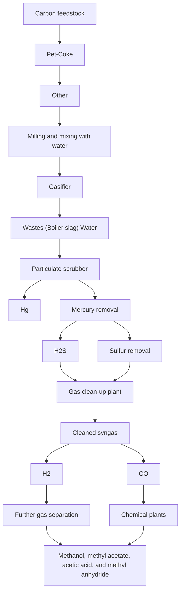
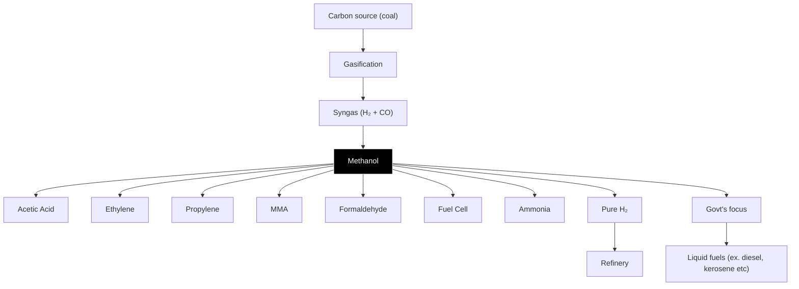

你是财经类 AI Podcast 制作人，擅长把研报内容改写成中文、英文两条独立的访谈式播客脚本。

【目标】
- 基于下面研报解析内容，写两份 podcast 脚本：一份中文，一份英文。
- 每份目标时长约 5 分钟。
- 两份都要是“访谈聊天式”，不是单人念稿。
- 听感：像一位主持人和一位研究员围绕报告做深度但自然的讨论。
- 不要使用 emoji。
- 不要把全文讲完，要留下 1-2 个“完整报告里会继续展开”的悬念。

【输出格式必须严格遵守】
- 中文部分只能使用 `ZH_A:` 和 `ZH_B:` 开头。
- 英文部分只能使用 `EN_A:` 和 `EN_B:` 开头。
- 每一句独立成行。
- 不要输出 Markdown 标题。
- 不要输出舞台说明、音效说明或括号注释。
- 先输出完整中文脚本，再输出完整英文脚本。

【角色设定】
- A 是主持人：负责提问、转场、替听众追问“所以这意味着什么”。
- B 是研究员：负责解释报告逻辑、给出结构化判断和保留悬念。
- 两个角色必须频繁轮换，避免一个人连续说超过 3 句。
- 每句要适合 TTS 朗读：短句、自然、不要太书面。

【中文脚本结构】
1. 开场：A 用一个问题引出报告价值，B 给出主判断。
2. 第一部分：这份报告真正要回答的问题是什么。
3. 第二部分：2-3 个关键洞察，每个洞察都要有“这意味着什么”。
4. 第三部分：哪些问题仍然没有完全展开，为什么值得继续读完整报告。
5. 结尾：自然引导听众加入社群/阅读完整报告，不要硬广。

【英文脚本结构】
- 英文不是中文逐句翻译，而是面向英文听众重新组织。
- 保留同样的主线和洞察，但表达更口语、更 podcast。
- Use natural conversational English.
- Avoid long sentences and avoid reading like a research memo.

【内容边界】
- 可以基于研报内容做适度发散，但必须是从原文逻辑推出的判断。
- 不要编造具体数据、公司动作或引用。
- 对不确定内容要用“这里仍需要继续验证”或 “the report does not fully answer this yet” 表达。
- 默认避免出现具体投行品牌名，比如“GS”“GS”，统一写作“投行研报”或 “a global investment bank report”。

【研报解析内容】
"""
# India Industrials and Infrastructure

# India Energy Security - #1 Coal Gasification: The color of energy doesn't matter anymore...

  
Nikhil Nigania

+91 226 842 1414

nikhil.nigania@Bernsteinsg.com

  
Aman Jain

+91 226 842 1486

aman.jain@Bernsteinsg.com

  
Uma Menon

+91 226 842 1490

uma.menon@Bernsteinsg.com

In this report, we dive deeper into one of the 5 key themes we highlighted due to the M.East crisis - Coal Gasification. On paper it looks the easiest answer to solve part of India's big gas import bill, but despite a long history of discussions it has never really taken-off. Now given the push of the war we see high chances of on ground progress with policy support-on supply side (e.g. capital support announced yesterday), and possibly even on demand side (long term off-take agreements, blending requirements).

a) What is coal gasification and learning from global examples: Coal gasification turns solid coal into synthetic gas (syngas - Hydrogen and CO) by subjecting coal to high temperatures and pressures in the presence of steam. This syngas can be used further downstream to make urea, methanol etc. South Africa- Sasol (not covered) built the world's largest coal-to-chemicals complex in 1980 using high-ash coal given oil embargoes on the country. China with a similar resource mix as India has scaled coal gasification from almost nothing to \~340 MTPA through policy support, and today gets \~85% of its ammonia and \~75% of its methanol from coal.

b) Strategic imperative for India: India has \~401 Bn tonne of coal resources (one of the largest globally), and reserves not very far from China- but while China mines \~4.5 BnTPA, India does just 1 BnTPA. India has just \~2 MTPA of coal gasification capacity. Hence, with India's import dependence of 90% for methanol, 100% for ammonia, and 20% for Urea - maximizing coal gasification will drive-a) Energy security, b) Limits Forex outflow, c) Fertilizer sUBSidy of \~ Rs 1 Trn given by govt. stays within the country.

c) Govt. support: In 2020, govt announced a plan to take coal gasification to 100 MTPA. SUBSequently, a) VGF of Rs 85 Bn was announced, b) Regulated coal pricing allocated, c), Guaranteed ROE for specific govt. plants. Yesterday govt. further announced Rs 375 Bn capital sUBSidy - effectively 15% of capex expected to be mobilized towards the target.

d) Commercials & Risks: Considering the announced capex of coal gasification plants in India (+ latest capex support), plant utilization of 80%, and forex at \~ 95 INR/USD, we get a break-even for making Urea via coal gasification at \$11.7/MMBtu of LNG JKM price, vs \~ \$17/MMBTU currently and 3-year avg. LNG price of \$12.6/MMBTU- refer Exhibit 17, Exhibit 19. Key risks: a) The biggest is the absence of a long term off-take agreement - given high upfront capex, b) High Ash Indian Coal- makes it challenging to gasify, on which BHEL(not covered) is working, c) Competition from green NH3, whose economics are getting better with time.

e) Key players (Exhibit 23): The only big operational plant is owned by Jindal Steel & Power and 8 projects worth \~₹880 Bn are underway. Coal India, GAIL and BHEL are involved in most projects as equity holders or as equipment/fuel/ infra providers. NTPC targets to produce 5-10 MTPA of syngas by 2029 and L&T won the downstream construction package for one of the plants. Thermax is in discussion with CIL & MoC, to be made an equipment provider for the planned projects. Please note we cover only L&T and NTPC.

Bernstein TICKER TABLE 

<table><tr><td rowspan="2" colspan="3"></td><td rowspan="2" colspan="2">13 May2026</td><td rowspan="2" colspan="2">TTMRel.</td><td rowspan="2" colspan="4">Reported EPS</td><td rowspan="2" colspan="3">Reported P/E (x)</td></tr><tr></tr><tr><td>Ticker</td><td>Rating</td><td>Cur</td><td>Closing Price</td><td>Price Target</td><td>Perf.</td><td>Cur</td><td>2025A</td><td>2026E</td><td>2027E</td><td>2025A</td><td>2026E</td><td>2027E</td><td></td></tr><tr><td>LT.IN (L&amp;T)</td><td>O</td><td>INR</td><td>3,915.80</td><td>4,637.00</td><td>(32.6)%</td><td>INR</td><td>109.00</td><td>123.00</td><td>155.00</td><td>22.8</td><td>20.1</td><td>16.7</td><td></td></tr><tr><td>NTPC.IN (NTPC Ltd)</td><td>O</td><td>INR</td><td>390.45</td><td>430.00</td><td>(26.9)%</td><td>INR</td><td>24.70</td><td>25.64</td><td>27.02</td><td>15.8</td><td>15.2</td><td>14.5</td><td></td></tr><tr><td>POWF.IN (Power Finance)</td><td>O</td><td>INR</td><td>446.00</td><td>460.00</td><td>(32.2)%</td><td>INR</td><td>69.67</td><td>86.54</td><td>88.18</td><td>6.4</td><td>5.2</td><td>5.1</td><td></td></tr><tr><td>RECL.IN (REC)</td><td>O</td><td>INR</td><td>346.55</td><td>450.00</td><td>(53.2)%</td><td>INR</td><td>60.32</td><td>65.52</td><td>67.62</td><td>5.7</td><td>5.3</td><td>5.1</td><td></td></tr><tr><td>ASIAX</td><td></td><td></td><td>1,965.26</td><td></td><td></td><td></td><td></td><td></td><td></td><td></td><td></td><td></td><td></td></tr></table>

O - Outperform, M - Market-Perform, U - Underperform, NR - Not Rated, CS - Coverage Suspended   
LT.IN valuation is EV/EBITDA (x);   
Source: Bloomberg, Bernstein estimates and analysis.

# INVESTMENT IMPLICATIONS

Within our coverage, we think L&T is the beneficiary of a push for coal gasification on equipment side. Other than L&T, PFC-REC could see a new lending opportunity as it fits with their long term infra lending focus. On asset owners, NTPC's plan to leverage its coal resources for gasification could get accelerated with latest capital support announcement.

# DETAILS

# 1. COAL GASIFICATION & LEARNINGS FROM OTHER MARKETS:

# WHAT IS COAL GASIFICATION?

Gasification is a thermochemical process that subjects solid coal to high temperatures and pressures in the presence of steam and a controlled, limited amount of oxygen. Instead of simply burning the coal, this process breaks it down at a molecular level to produce synthesis gas or “syngas”- a versatile gaseous mixture consisting primarily of carbon monoxide and hydrogen. This syngas acts as a foundational chemical building block that can be directly synthesized into high-value industrial products, including ammonia, urea, methanol or used as a clean reducing agent in steel production.

A single coal feed produces methanol, acetic acid, hydrogen, and power simultaneously. Unlike an LNG terminal locked into natural gas, a gasification complex can pivot between products as commodity economics shift. NITI Aayog's Methanol Economy program— highlights that the syngas producing ammonia can produce methanol for potential petrol blending.

There are majorly 3 types of gasification technologies (or gasifiers):

1. Entrained Flow Gasifier (Used by China)   
2. Fixed Bed Gasifier (Used by South Africa)   
3. Fluidized Bed Gasifier (Most suitable for low-grade & high-ash coal found in India) - BHEL (not covered) is currently developing this indigenously.

EXHIBIT 1: Coal Gasification Process   

flowchart

Source: University of Kentucky

EXHIBIT 2: Coal gasification - Downstream use cases   

flowchart

Source: CIL, Bernstein analysis

# SOUTH AFRICA: SASOL – THE ORIGINAL COAL GASIFICATION CASE STUDY

Sasol's first gasification plant was built in the 1950s under apartheid oil sanctions. Sasol aggressively expanded during the '80s, was sustained by state ownership, a Strategic Fuel Fund levy on imported petroleum that sUBSidized domestic synfuels, and govt-guaranteed long-term off-take contracts insulating project economics from price volatility. When built, coal gasification was economically sub-optimal as crude oil was available at \$3–5/barrel. By the 1990s as oil price shot up to \$20–30/barrel, coal gasification became viable. Sasol now licenses its technology globally.

EXHIBIT 3: South Africa's coal consumption history for gasification   
Coal Used For Gasification in SA (in MTPA)   

line

| Year | Coal (MTPA) |
|------|-------------|
| 1955 | ~1          |
| 1960 | ~2          |
| 1975 | ~3          |
| 1980 | ~8          |
| 1985 | ~23         |
| 1990 | ~24         |
| 1995 | ~28         |
| 2000 | ~33         |
| 2005 | ~30         |
| 2010 | ~28         |
| 2015 | ~26         |
| 2020 | ~23         |
| 2025 | ~18         |

Source: Sasol reports, Bernstein analysis

South Africa strengthened its energy security by pioneering commercial scale coal gasification. By converting low-grade coal into syngas, the country produces methane-rich gas (MRG) and provides roughly 29% of its locally refined liquid fuel requirements (ex. diesel, kerosene etc.). The coal-to-liquids sUBStitution saves the nation billions in forex annually and actively insulates its industrial economy from the extreme price volatility and supply shocks of global LNG and crude oil markets.

S. Africa has proven the use of high-ash coal, leading the way for India to build on it further (SA 25%, India 35%). JSPL has proven at Angul, Odisha. BHEL's indigenous BCGCL effort follows Sasol's playbook.

EXHIBIT 4: Liquid Fuel Production Mix in South Africa   
South Africa's Liquid Fuel Supply, FY23   

pie

| Category | Percentage (%) |
| :--- | :--- |
| Imports | 37 |
| Coal Gasification | 29 |
| Crude Oil Refining | 34 |

Source: NETL, Sasol reports, Bernstein analysis

# CHINA - REDUCING IMPORT DEPENDENCE

South Africa & China mastered coal gasification with the same playbook: sustained state interventions bridging the gap between high upfront capital costs and long-term import-sUBStitution payoff. China's 2000s-2010s scale-up went further: state-owned enterprises (or SOEs) (Shenhua, Sinopec etc.) deployed coal-to-chemical plants using preferentially-priced captive coal allocations, state-bank debt at well below commercial rates, mandatory grid off-take of coal-derived synthetic natural gas, and tolerance for years of accounting losses absorbed by SOE balance sheets.

Today, about $78 \%$ of China’s urea output comes from coal rather than natural gas. This coal gasification production model gives China access to abundant, domestically sourced energy, reducing exposure to volatile international gas prices and supply disruptions. Due to the Iran war, which has disrupted shipping through the Strait of Hormuz, the urea prices outside China surged by about $70 \%$ . In contrast, China maintained ample stocks, keeping domestic prices roughly a third of international benchmarks, all thanks to its large-scale coal-based production of urea. Today, China is among the largest exporters of fertilizers - shipping more than \$13 billion worth last year.

EXHIBIT 5: China: Coal gasification evolution history (approx. figures)   
Coal feedstock for gasification (MMTPA)   

bar

| Year | Coal feedstock for gasification (MMTPA) |
| :--- | :--- |
| Pre-2000 | 50 |
| 2010 | 100 |
| 2015 | 180 |
| 2017 | 230 |
| 2018 | 260 |
| 2022 | 300 |
| 2023 | 330 |
| 2024 | 340 |

Source: CREA, IER, Bernstein analysis

EXHIBIT 6: Split of Methanol Consumption in China, FY24   
Methanol Consumption in China   

pie

| Category | Percentage (%) |
| :--- | :--- |
| Coal Gasification | 75 |
| Coke Oven Gas | 13 |
| Natural Gas | 11 |
| Coal Gasification | 1 |

Source: US EIA, Bernstein analysis

# 2. COAL GASIFICATION IN INDIA

# WHY DOES INDIA NEED COAL GASIFICATION - THE BIG LNG BILL AND FERTILIZER SUBSIDIES...

The IEA projects India's total LNG import bill to grow at a 26.2% CAGR to ₹2.85 Trillion by FY2028F (Exhibit 8), driven by three forces: (i) absolute volume growth as industrial gas demand expands with GDP, (ii) structural FX depreciation at \~3.3%/yr. Exhibit 7 illustrates the combined impact of LNG price volatility and FX depreciation on India's annual import bill. India's LNG bill in FY2023 hit ₹1.45 Trillion.

EXHIBIT 7: India LNG import bill compounded by commodity price x Forex   
LNG Spot Price & FX Rate History   

line

| Date   | USD/MMBtu | FX Rate (₹/$) |
|--------|-----------|---------------|
| Jan-15 | ~15.00    | ~65.00        |
| Jan-16 | ~8.00     | ~70.00        |
| Jan-17 | ~7.00     | ~75.00        |
| Jan-18 | ~10.00    | ~80.00        |
| Jan-19 | ~12.00    | ~85.00        |
| Jan-20 | ~5.00     | ~90.00        |
| Jan-21 | ~20.00    | ~95.00        |
| Jan-22 | ~35.00    | ~95.00        |
| Jan-23 | ~55.00    | ~95.00        |
| Jan-24 | ~15.00    | ~95.00        |
| Jan-25 | ~12.00    | ~95.00        |
| Jan-26 | ~20.00    | ~95.00        |

Source: Platts JKM, RBI, Bernstein Analysis

EXHIBIT 8: IEA forecasts this import bill to continue to rise sharply   
LNG Import Bill & Volume   

bar_line

| Fiscal Year | Total LNG Import Bill (₹ Trillion) | LNG Imports (MMT) |
| :--- | :--- | :--- |
| FY21 | 0.7 | 24.5 |
| FY22 | 1.1 | 23.0 |
| FY23 | 1.45 | 20.0 |
| FY24 | 1.2 | 26.0 |
| FY25 | 1.35 | 28.0 |
| FY26 | 1.8 | 30.0 |
| FY27F | 2.4 | 35.0 |
| FY28F | 2.9 | 38.0 |

Source: PPAC, IEA, Bernstein Analysis

Fertilizer support bill: Exhibit 9 shows India's gas consumption by sector from FY2021–22 through FY2025–26. Fertilizers consume \~40% of India's imported gas every year. It is the government's highest-priority target for coal gasification sUBStitution.

The fertilizer sUBSidy burden (Exhibit 10) for the Indian govt peaked at ₹2.5 trillion in FY2023 — \~6% of the entire net budget — created by the LNG price spike due to the Russia-Ukraine war along with Rupee depreciation in FY23. Coal gasification could convert this open-ended, LNG-contingent liability into a fixed, rupee-denominated cost — independent of global gas prices.

EXHIBIT 9: 40% of gas usage in India is in Fertilizer industry   
Gas Consumption Sectors FY26 (in MMSCM)   

pie

| Category | Value | Percentage (%) |
|---|---|---|
| Fertilizers | 18,410 | 41 |
| Chemicals | 3,750 | 8 |
| Power | 7,449 | 17 |
| City Gas Distribution | 15,074 | 34 |

Source: Niti Aayog, Bernstein Analysis

EXHIBIT 10: There is a big fertilizer sUBSidy burden on the govt. which is primarily supporting LNG / Ammonia imports   

bar_line

Fertilizer SUBSidy Burden (in Rs Trillion)
| Period | Fertilizer Expenditure (in Rs Trillion) | Fertilizer Expenditure wrt Net Budget (%) |
| :--- | :--- | :--- |
| 2020-21 | 1.3 | 3.8 |
| 2021-22 | 1.55 | 4.0 |
| 2022-23 | 2.55 | 6.0 |
| 2023-24 | 1.95 | 4.5 |
| 2024-25 | 1.92 | 3.7 |
| 2025-26 | 1.88 | 3.7 |
| 2026-27BE | 1.72 | 3.3 |
Russia-Ukraine Commodity Shock

Source: India Budget report, Sansad report, PIB, Bernstein analysis

China despite having low oil-gas reserves has successfully reduced import dependence for Methanol and fertilizers with support of coal gasification. India, with a similar resource mix, has not capitalized on its potential yet.

EXHIBIT 11: China has managed to reduce this import dependency with coal gasification, now India needs to step up   
India-China Import Dependency (in %) Comparison, FY26   

bar

| Category | Country | Percentage (%) |
| :--- | :--- | :--- |
| Methanol | China | 14 |
| Methanol | India | 89 |
| Fertilizer | China | 0 |
| Fertilizer | India | 20 |
China -> net exporter of fertilizers

Source: Ministry of Chemicals & Fertilizers, Bernstein analysis

# UNTAPPED COAL RESOURCES

India's structural gap between its coal reserves & utilization: India has 400 billion tonnes of coal reserves — the fifth-largest in the world — yet currently has coal gasification capacity of just \~ 2.4 million tonnes per year, almost entirely at JSPL's Angul plant.

EXHIBIT 12: India share of global natural resources - Needs to make the most of its large reserves   
Natural resources reserves in India (as % of global reserves)   

bar

| Category | Value (%) |
|---|---|
| Thorium | ~13 |
| Biogas potential | ~10-12 |
| Coal | ~10 |
| Hydro power | ~3 |
| Non-arable land (proxy for solar energy potential) | 2-3 |
| Uranium | 1-2 |
| Wind | ~0.5 |
| Natural gas | 0.6 |
| Crude oil | <0.5 |
| Lithium | 0 |
| Nickel | 0 |
| Cobalt | 0 |

Source: Govt. data, press articles, Bernstein analysis

EXHIBIT 13: Coal consuming sectors in India   
 as to the sources of information or data contained herein are accurate, complete, not misleading or as to its fitness for the purpose intended even though the entities noted herein rely on reputable or trustworthy data providers, it should not be relied upon as such. Opinions expressed are the author(s)' current opinions as of the date appearing on the material only and we do not undertake to advise you of any change in the reported information or in the opinions herein.

This publication was prepared and issued by the entity referred to herein for distribution to eligible counterparties or professional clients. The information in this report is intended for general circulation and does not constitute an offer to buy or sell any security, investment, legal or tax advice nor a personal recommendation, as defined by any of the aforementioned regulators. It does not take into account the particular investment objectives, financial situations, or needs of individual investors. The report has not been reviewed by any of the aforementioned regulators and does not represent any official recommendation from the aforementioned regulators. The investments referred to herein may not be suitable for you. Investors must make their own investment decisions in consultation with advice sought from a financial adviser regarding the suitability of the investment product, taking into account the specific investment objectives, financial situation or particular needs of any recipient of the recommendation, before the recipient makes a commitment to purchase the investment product.

The analysis contained herein is based on numerous assumptions. Different assumptions could result in materially different results. The information in this report does not constitute, or form part of, any offer to sell or issue, or any offer to purchase or sUBScribe for shares, or to induce engage in any other investment activity. The value of any securities or financial instruments mentioned in this report may fluctuate subject to market conditions. Information about past performance of an investment is not necessarily a guide to, indicative of, or assurance of future performance. Estimates of future performance mentioned by the research analyst in this report are based on assumptions that may not be realized due to unforeseen factors like market volatility/fluctuation. In relation to securities or financial instruments denominated in a foreign currency other than the clients' home currency, movements in exchange rates will have an effect on the value, either favorable or unfavorable. Before acting on any recommendations in this report, recipients should consider the appropriateness of investing in the subject securities or financial instruments mentioned in this report and, if necessary, seek for independent professional advice.

The securities described herein may not be eligible for sale in all jurisdictions or to certain categories of investors where that permission profile is not consistent with the licenses held by the entities noted herein. This document is for distribution only as may be permitted by law. It is not directed to, or intended for distribution to or use by, any person or entity who is a Citizen or resident of or located in any locality, state, country or other jurisdiction where such distribution, publication, availability or use would be contrary to law or regulation or would subject the entities noted herein to any regulation or licensing requirement within such jurisdiction.

Source: Bloomberg Index Services Limited. BLOOMBERG® is a trademark and service mark of Bloomberg Finance L.P. and its affiliates (collectively “Bloomberg”). Bloomberg or Bloomberg’s licensors own all proprietary rights in the Bloomberg Indices. Neither Bloomberg nor Bloomberg’s licensors approves or endorses this material, or guarantees the accuracy or completeness of any information herein, or makes any warranty, express or implied, as to the results to be obtained therefrom and, to the maximum extent allowed by law, neither shall have any liability or responsibility for injury or damages arising in connection therewith.

No part of this material may be reproduced, distributed or transmitted or otherwise made available without prior consent of the entities noted herein. Copyright Bernstein Institutional Services LLC Bernstein Autonomous LLP, BSG France S.A., Bernstein (Hong Kong) Limited 盛博香港有限公司, Bernstein (Canada) Limited, Bernstein (India) Private Limited (SEBI registration no. INH000006378), Bernstein (Singapore) Private Limited and Bernstein Japan KK (サンフォード・C・バーンスタイン株式会社). All rights reserved. The trademarks and service marks contained herein are the property of their respective owners. Any unauthorized use or disclosure is strictly prohibited. The entities noted herein may pursue legal action if the unauthorized use results in any defamation and/or reputational risk to the entities noted herein and research published under the Bernstein and Autonomous brands.
"""
