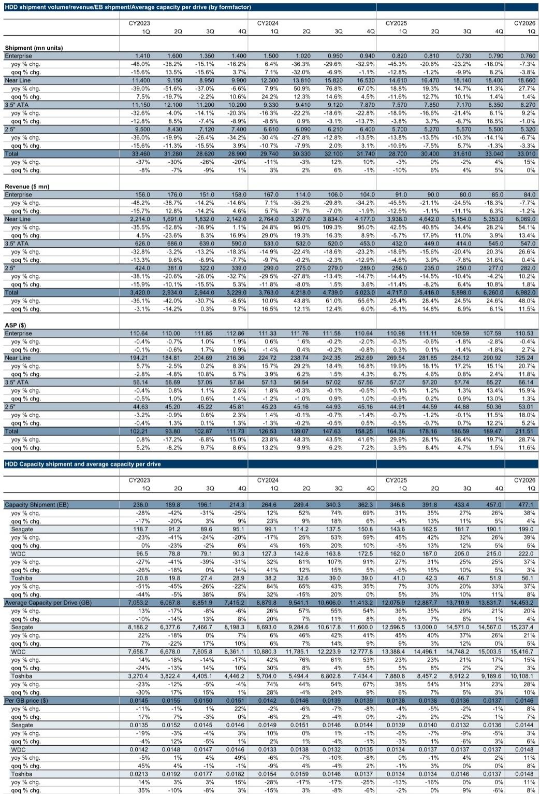
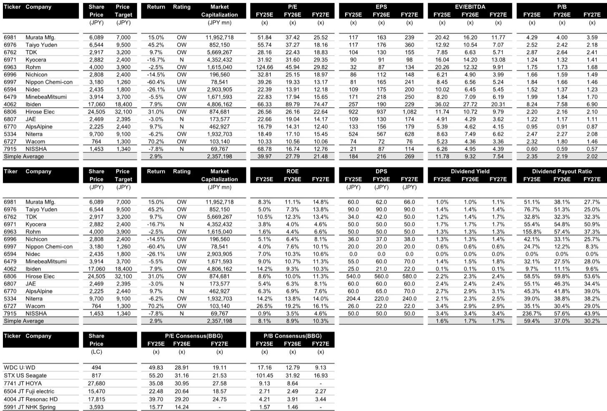

# The HDD Component Supply Chain Is Restructuring, and TDK Is the Clearest Beneficiary of the Shift

The hard disk drive industry is not in decline. It is undergoing a structural transformation that is creating a concentrated opportunity for a small number of component suppliers. The first quarter of 2026 provides the clearest evidence yet that this thesis is playing out. Nearline HDD shipments grew 28% year over year, total shipped capacity surged 38%, and the cost advantage of HDDs over NAND flash for mass data storage has widened to a post-2020 record. These are not cyclical noise. They are the signals of a secular demand wave driven by the insatiable need for data center storage capacity.

Yet the most important story lies beneath the headline shipment numbers. It is unfolding in the component supply chain, where the dynamics of capacity discipline, technology transition, and market share shifts are creating a strategic inflection point. The data from the first quarter reveals that captive HDD head manufacturers are exercising restraint in adding capacity and are simultaneously diverting existing production lines toward HAMR (heat-assisted magnetic recording) products. This dual move is opening a window for independent suppliers, and TDK stands at the center of this opportunity.

The argument is not merely that HDD demand is growing. It is that the structure of the component supply chain is changing in a way that rewards suppliers who are not captive to the major HDD manufacturers. The first quarter data shows the beginning of this shift. TDK's HGA (head gimbal assembly) shipments have started to reach captive manufacturers for the first time. The volumes are small, but the direction is unmistakable. The question for investors is whether this is the start of a multi-year trend or a temporary fill-in.

This article unpacks the first quarter data, interprets what it means for the competitive dynamics of the HDD component market, and identifies the strategic decisions that will determine which suppliers capture the most value over the next two to three years.

## Nearline HDD Shipments Are Driving a Structural Expansion in Both Volume and Value, Not a Cyclical Recovery

The first quarter of 2026 is often a seasonally soft period for HDD shipments. The data defies that pattern. Total HDD shipment volume reached 33.0 million units, flat quarter over quarter but up 15% year over year. The more important metric is the mix shift. Nearline HDDs accounted for 18.7 million units, a 28% year-over-year increase. These are the drives that go into data centers, not consumer PCs. They carry higher average selling prices and higher margins.

The value of HDD shipments tells a sharper story. Total shipment value reached $6,982 million, up 48% year over year and 12% quarter over quarter. Nearline HDDs alone accounted for $6,069 million of that total, a 54% year-over-year increase. The average unit price across all HDDs rose to $211.50, a 29% increase. For nearline drives, the average price reached $325.20, up 21% year over year. This is not a volume-only story. Value is growing faster than units, which is the hallmark of a market where customers are willing to pay for higher capacity and better technology.

The capacity data reinforces this point. Total shipped capacity was 477 exabytes, up 38% year over year. The average capacity per drive rose to 14.5 terabytes, a 20% increase. This means that even if unit volumes were to plateau, the total addressable market in terms of storage capacity would continue to expand. The unit price per gigabyte fell to 1.46 cents, but the more significant number is the cost gap between NAND flash and nearline HDDs. That gap widened to 12.7 times in the first quarter, compared to 5.2 times in the first quarter of 2025 and 6.6 times in the fourth quarter of 2025. This is a new post-2020 peak.

The implication is clear. For hyperscale data center operators, the economic argument for using HDDs for bulk storage has never been stronger. The cost advantage over flash is widening, not narrowing. This is not a temporary divergence. It reflects the fundamental physics of magnetic recording versus semiconductor memory, and it suggests that nearline HDD demand will remain robust even as flash prices fluctuate.

## Captive Manufacturers Are Deliberately Constraining HDD Head Supply, Creating a Window for Independent Suppliers

The most strategically significant finding in the first quarter data is not about HDD shipments. It is about the behavior of the captive HDD head manufacturers. These are the companies that produce heads primarily for their own internal HDD production. The data shows that they are exercising restraint in adding production capacity. More importantly, they are shifting existing capacity from conventional products to HAMR technology.

This is a rational decision, but it creates an opening. HAMR is the next-generation recording technology that allows higher areal density. It requires different head designs and manufacturing processes. The transition to HAMR is capital-intensive and requires significant retooling. Captive manufacturers are prioritizing this transition, which means they are allocating less capacity to current-generation products.

The result is a supply gap that independent suppliers can fill. TDK's HGA shipment volume in the first quarter was 52.8 million units, up 10% year over year. Its market share was 13.1%, down from 14.5% in the first quarter of 2025 but up from 12.8% in the fourth quarter of 2025. The sequential increase is the more telling data point. It suggests that TDK is gaining share as captive manufacturers pull back.

The most important development is that TDK's supply to the two captive manufacturers started in the first quarter of 2026. The volumes are small, according to the TSR data, but the fact that it has begun at all is a structural change. Historically, captive manufacturers sourced heads primarily from their own internal production. If TDK can establish itself as a reliable external supplier, the addressable market for its HGA business could expand significantly.

The heads-per-drive metric provides additional context. The average head count per HDD rose to 12.2 in the first quarter, up from 11.5 a year earlier. For nearline drives, the count was 19.4 heads per drive, essentially flat year over year. The increase in head count per drive is driven by the move to higher-capacity drives that require more heads to read and write data across more platters. This is a volume driver for head suppliers that is independent of unit shipment growth. Even if HDD unit volumes were to grow slowly, the number of heads per drive is increasing, which supports demand for head components.

## The Spindle Motor Market Is Stable, but the Real Competition Is in Technology Transition, Not Volume

The HDD spindle motor market presents a different picture. Shipment volume in the first quarter was 34.0 million units, up 11% year over year but down 1% quarter over quarter. The market is dominated by two players: Nidec with a 60% share and MinebeaMitsumi with 40%. The spindle ratio, which measures the number of spindle motors per HDD, was 1.02, down from 1.07 a year earlier and 1.04 in the fourth quarter of 2025.

The spindle motor market is mature and consolidated. The growth driver here is not market share shifts but the overall volume of HDD production and the transition to higher-capacity drives that may require different motor specifications. The first quarter data suggests that the market is stable, with no significant competitive disruption.

The strategic focus for investors in this segment should not be on volume growth. It should be on the technology requirements of next-generation drives. HAMR drives, for example, may require motors that can operate at different speeds or with different thermal characteristics. The companies that can adapt their motor designs to the new technology requirements will be better positioned than those that simply compete on volume and cost.

This is a second-order implication that the report data does not fully address. The spindle motor market has been a duopoly for years, and the technology transition to HAMR could either reinforce that duopoly or create an opening for new entrants if the incumbents are slow to adapt. The current data does not provide a clear answer, but it is a question that investors should monitor.

## What the Report Does Not Fully Answer: The Pace of HAMR Adoption and Its Impact on Head Supplier Margins

The report provides detailed data on current shipment trends, but it leaves several important questions unresolved. The most critical is the pace of HAMR adoption. The data shows that captive manufacturers are shifting capacity to HAMR, but it does not specify what percentage of total head production is now HAMR-based or how quickly that percentage will increase over the next two to three years.

This matters because HAMR heads are more complex to manufacture and likely carry higher margins. If HAMR adoption accelerates, independent suppliers like TDK could benefit from both volume growth and margin expansion. If adoption is slower than expected, the capacity shift by captive manufacturers could create a temporary oversupply of conventional heads, putting pressure on pricing.

A second unresolved question is the sustainability of TDK's market share gains. The first quarter data shows that TDK began supplying captive manufacturers, but the volumes are small. It is not yet clear whether this is a one-time fill-in order or the beginning of a long-term sourcing relationship. The answer depends on whether the captive manufacturers view TDK as a strategic partner or a temporary buffer while they retool their own production lines.

A third question relates to the cost gap between HDDs and NAND flash. The gap widened significantly in the first quarter, but this was partly driven by NAND flash pricing dynamics. If flash prices decline in future quarters, the cost advantage of HDDs could narrow. The report data shows the current gap but does not model how it might evolve under different flash pricing scenarios.

These are not weaknesses in the report. They are analytical frontiers that the data opens up. For investors, the key is to recognize that the current data supports a positive thesis for HDD component suppliers, but the magnitude and duration of the opportunity depend on variables that are still uncertain.

## A Decision Framework for Evaluating HDD Component Suppliers

For investors looking to act on this analysis, the following framework can help assess which suppliers are best positioned. The framework focuses on three dimensions: market share trajectory, technology readiness, and customer diversification.

First, evaluate market share trajectory. The key question is whether a supplier is gaining or losing share in its primary component market. TDK's sequential market share increase in HGA from 12.8% to 13.1% is a positive signal. The more important indicator will be whether this trend continues in the coming quarters. Investors should track quarterly market share data and look for sustained improvement rather than one-quarter fluctuations.

Second, assess technology readiness. The transition to HAMR is the most important technology shift in the HDD industry in a decade. Suppliers that have invested in HAMR-compatible manufacturing processes will be better positioned than those that have not. The report data indicates that TDK is already supplying captive manufacturers, which suggests that its technology is qualified. The question is how much of its production capacity is HAMR-ready and how quickly it can scale.

Third, consider customer diversification. Suppliers that rely on a single customer are vulnerable to demand shocks and pricing pressure. TDK's traditional customer base has been independent HDD manufacturers. The expansion into captive manufacturers diversifies its revenue base and reduces its dependence on any single customer. The first quarter data shows that this diversification has begun, but the scale is still small.

Applying this framework to the spindle motor market yields a different picture. Nidec and MinebeaMitsumi dominate the market, and their market shares are stable. The technology transition to HAMR may require new motor designs, but the competitive dynamics are unlikely to change dramatically. The opportunity in spindle motors is more about steady volume growth than market share gains.

The framework also highlights a risk. If HAMR adoption is slower than expected, the captive manufacturers' capacity shift could leave them with excess production capacity for conventional heads. They might then redirect that capacity back to the external market, putting pressure on independent suppliers like TDK. This is a scenario that investors should monitor but that the current data does not support.

## Join the Community to Read the Full Report and Review the Original Charts

The first quarter 2026 data provides a rare moment of clarity in a complex industry. The nearline HDD demand story is robust, the component supply chain is restructuring, and the technology transition to HAMR is creating both opportunities and risks. But the data only tells part of the story. The full report includes detailed charts on shipment trends, market share evolution, and valuation comparisons that are essential for making informed investment decisions.

The questions that remain unanswered are not gaps in the analysis. They are the strategic questions that every serious investor needs to grapple with. How fast will HAMR adoption proceed? Will TDK's market share gains accelerate or plateau? What happens to the cost gap between HDDs and flash if NAND prices decline? These are the questions that the full report helps investors frame, even if it does not provide definitive answers.

Join the community to read the full report and review the original charts.

*This article is for learning and discussion only and does not constitute investment advice.*

Personal reading notes and learning share only. Not investment advice.

