你是财经类 AI Podcast 制作人，擅长把研报内容改写成中文、英文两条独立的访谈式播客脚本。

【目标】
- 基于下面研报解析内容，写两份 podcast 脚本：一份中文，一份英文。
- 每份目标时长约 5 分钟。
- 两份都要是“访谈聊天式”，不是单人念稿。
- 听感：像一位主持人和一位研究员围绕报告做深度但自然的讨论。
- 不要使用 emoji。
- 不要把全文讲完，要留下 1-2 个“完整报告里会继续展开”的悬念。

【输出格式必须严格遵守】
- 中文部分只能使用 `ZH_A:` 和 `ZH_B:` 开头。
- 英文部分只能使用 `EN_A:` 和 `EN_B:` 开头。
- 每一句独立成行。
- 不要输出 Markdown 标题。
- 不要输出舞台说明、音效说明或括号注释。
- 先输出完整中文脚本，再输出完整英文脚本。

【角色设定】
- A 是主持人：负责提问、转场、替听众追问“所以这意味着什么”。
- B 是研究员：负责解释报告逻辑、给出结构化判断和保留悬念。
- 两个角色必须频繁轮换，避免一个人连续说超过 3 句。
- 每句要适合 TTS 朗读：短句、自然、不要太书面。

【中文脚本结构】
1. 开场：A 用一个问题引出报告价值，B 给出主判断。
2. 第一部分：这份报告真正要回答的问题是什么。
3. 第二部分：2-3 个关键洞察，每个洞察都要有“这意味着什么”。
4. 第三部分：哪些问题仍然没有完全展开，为什么值得继续读完整报告。
5. 结尾：自然引导听众加入社群/阅读完整报告，不要硬广。

【英文脚本结构】
- 英文不是中文逐句翻译，而是面向英文听众重新组织。
- 保留同样的主线和洞察，但表达更口语、更 podcast。
- Use natural conversational English.
- Avoid long sentences and avoid reading like a research memo.

【内容边界】
- 可以基于研报内容做适度发散，但必须是从原文逻辑推出的判断。
- 不要编造具体数据、公司动作或引用。
- 对不确定内容要用“这里仍需要继续验证”或 “the report does not fully answer this yet” 表达。
- 默认避免出现具体投行品牌名，比如“GS”“GS”，统一写作“投行研报”或 “a global investment bank report”。

【研报解析内容】
"""
# Weekend Healthcare Pulse: Prescription for AI, Google Health takes the lead

Delphine Le Louet +33 1 42 13 92 93 delphine.le-louet@Bernsteinsg.com

Courtney Breen +1 917 344 8407 courtney.breen@Bernsteinsg.com

Justin Smith +44 20 7762 5899 justin.smith@Bernsteinsg.com

Lance Wilkes +1 917 344 8501 lance.wilkes@Bernsteinsg.com

Lee Hambright +1 917 344 8429 lee.hambright@Bernsteinsg.com

Miki Sogi, Ph.D. +81 3 6777 6991 miki.sogi@Bernsteinsg.com

Rebecca Liang, Ph.D. +852 2123 2656 rebecca.liang@Bernsteinsg.com

Susannah Ludwig +41 582 723 127 susannah.ludwig@Bernsteinsg.com

William Pickering, MD +1 917 344 8340 william.pickering@Bernsteinsg.com

# Specialist Sales

Christian Moore +1 917 344 8555 christian.moore@Bernsteinsg.com

The numbers speak for themselves: 50 million health questions a day for Microsoft (covered by M. Moerdler) and more than one billion for Google (covered by M. Shmulik -Check Up 2026, Google Analytics). Beyond the breadth and depth of the questions related to health, reflecting limitations in health knowledge, clinical practices and behavior among patients, it highlights a sound commitment from these two companies to using AI for health matters. That said, the two most common search engines, Google and Microsoft, are tackling personal health from different angles: Copilot Health is a dedicated, secure space inside Copilot that can integrate and interpret an individual's health data, while Google Health is a collection of platforms that can be accessed by various stakeholders via the cloud. The aim of this weekender is to provide an overview of usage, give readers a greater understanding of both platforms and highlight some clear limitations.

# HEALTH: A STAGGERING AMOUNT OF DATA

Microsoft claims to respond to 50 million consumer health questions a day. Google has reiterated that it receives one billion+ health questions a day out of c.14 billion total queries. These are striking figures. Hema Budaraju, head of AI Analytics at Google Search, talked of the following insights at the Google Check Up 2026 event:

\- Evolution towards a defined and specific health matter vs general questions around a disease, health requests are three times the average length of a Google request and give more context.

\- Personalization of the request: it is no longer about “headaches” for instance, but about describing symptoms and behavior in order

to get more insight/a more elaborate response from the tool to a medical question that directly relates to the individual.

Against this backdrop, we note that there are a cumulative one trillion health videos available globally on YouTube, that half of the world's health workers are already using YouTube for clinical content according to Dr Graham, Global Head of YouTube Health, and that YouTube is also now used a learning tool in medical studies.

# WHAT HEALTH DATA ARE PEOPLE LOOKING FOR?

EXHIBIT 1: Copilot health requests of January 2026 still focus more on education than on treatment paths   

bar

| Category | Percentage |
| --- | --- |
| Health Information & Education | 40.7% |
| Research & Academic Support | 11.6% |
| Symptom Questions & Health Concerns | 10.9% |
| Medical Paperwork | 9.8% |
| Fitness, Lifestyle & Coaching | 9% |
| Condition Information & Care Questions | 8% |
| Emotional Wellbeing | 3.9% |
| Healthcare Navigation & Access to Care | 3.1% |
| Insurance, Coverage & Benefits | 2.7% |
| Digital Tools & Fitness Apps | 0.4% |

Source: Copilot health

Microsoft's Copilot publicly shares underlying requests per type of search which turn around information for more than $40\%$ followed by research and academic support and direct symptoms questions. The personal lifestyle and sports coaching themes are clearly showing less engagement for Copilot. What is interesting is that most requests still focus on only the first layer of AI, i.e.

getting reliable and extensive data, as opposed to the next step of discussing ways to alleviate symptoms.

# WHAT THESE DATA MEAN FOR AI ENGINES AND PLAYERS?

We are witnessing a shift away from the compilation or linear approach (tools/data), to a multi-modal approach that can solve queries using multiple interfaces and inter-operabilities (where devices and AIs interact).

In parallel, there is a need for more enriched data and more powerful apps in the most common therapeutic areas, such as sleep apnea and metabolic syndrome/ diabetes, within FitBit's Personal Health Coach. New algorithms to be launched this year should increase the accuracy of the sleep apnea data (nap detection, sleep interruptions, restlessness at night) by 15% and improve the prediction of insulin resistance by connecting continuous glucose monitoring (CGM) to Google's Health Connect for instance. The multi-modal approach also incorporates access to medical records through Athenahealth and CMS as well as Health100 from CVS.

And the more data there is, the higher the marketing fees the model can generate. So far, Google does not allow ads to appear alongside its AI Health summary responses. While the regulation remains complex and country-specific, we can imagine a monetization system based not on the number of queries but more on the degree of sophistication, whereby the response sends more traffic to external commercial partners. It is not simply about quantity but increasingly about the level of precision and depth of the AI response and model.

# GOOGLE HEALTH: INCREASINGLY HARD TO COMPETE WITH IT

Google Health is a collection of platforms that can be accessed by various stakeholders via the cloud. It uses the Google Medical Imaging suite, Gemini, to provide enlarged “education”, and aggregates data collected via Fitbit (now named Google Health), Pixel, various other health apps, and wearables, into a single app, Health Connect by Android. The idea for Google is to “find new ways to meet people where they are on their health and wellness journey, whether that is through Search, YouTube, wearables or other devices”.

The cornerstone of Google Health is Gemini, which is able to navigate and reason in a multi-modal health landscape using Large Sensor models to navigate sensor data and the personal health large language model (PH-LLM), and MedGemma, an open model for medical text and image comprehension dedicated to physicians. Google Deepmind has also created AlphaFold to predict the 3D shape of the protein. The partnership with Isomorphic Labs (Weekend Healthcare Pulse: An update on the latest in EU VC funding see page 5) has paved the way to drug discovery, as well as further collaboration with large pharma/ biotech companies

such as the one with Roche.

All the data provides a baseline against which Google is now deploying a coordinated set of AI tools across search, wearables, clinical research, and genomic sequencing, to create a highly advanced multi-channel approach, as seen in the Exhibit 2, which aims to accelerate B2B business while addressing B2C by every means available.

EXHIBIT 2: Google is creating one of the most powerful multi-channel healthcare ecosystems in existence   

```mermaid
graph TD
    A["1B health queries/day"] --> B["Amazon Health AI"]
    A --> C["AI Mode / Search 90+ languages 200+ countries Gemini 3 powered"]
    A --> D["Google Health (integration of Fitbit in May 2026) Advancing AI-powered health tool"]
    A --> E["CMS U.S. public agency overseeing healthcare payment and standards"]
    A --> F["YouTube Health Video platform for trusted health information at scale"]
    A --> G["AMIE's partner for the first nationwide randomized AI virtual care trial"]
    A --> H["Hospitals Research centers AIIMS New Delhi, Beth Israel Deaconess, NHS..."]
    A --> I["MedGemma Open health AI models for biomedical research"]
    A --> J["Gemini 3 / AMIE Conversational medical AI for guidance and clinical support"]
    A --> K["Roche Diagnostics pioneering AI-powered genomic sequencing for cancer research"]
    A --> L["Roche"]
    A --> M["AVS Health CVS Health 100 AI health engagement platform built on longitudinal data"]
    A --> N["Amazon Health AI Amazon's AI-driven health and care platform"]
```

flowchart

Source: Bernstein analysis

# COPILOT HEALTH

Microsoft's Copilot Health is a dedicated, secure space inside Copilot that integrates and interprets an individual's health data. It is viewed as a “personal health cabinet” that aggregates all medical records taken from more than 50 wearables and app data, 50k hospitals in the US and lab tests. All the data are concentrated into one place with the aim of helping people to understand their health issue or “make sense of what they have” according to the promise.

EXHIBIT 3: Copilot Health   

text_image

March 12, 2026 Health Bay Gross, Peter Hames, Chris Kelly, Dominic King, Harsha Nori LI X FB
Building
Copilot
Health

Source: Microsoft

The underlying idea is to increase patient awareness and make their time with the doctor more specific, insightful and useful. The intelligence that is put into Copilot enables the data to speak. Microsoft is rolling out Copilot Health and opened a waiting list mid-March due to the high level of interest it received on the Copilot alone. It varies from Dragon Copilot which addresses healthcare professionals by providing better workflow support.

# WHY ISN'T AI SUITABLE YET FOR EVERYDAY USE IN MEDICAL PRACTICE? THE DIFFERENTIAL DIAGNOSIS

The differential diagnosis is used by medical practitioners to identify a specific disease and put a clear diagnosis on symptoms. This is an iterative process to which the inclusion and exclusion of criteria and factors enable the physician or medical staff to envisage a treatment or treatment pathway when a patient's symptoms can be attributed to multiple conditions. Symptoms of many diseases often overlap, and incorrect diagnoses can have negative repercussions for patient health.

# Foundation of differential diagnosis

Various methods can be applied and taken into consideration: a) the symptoms complex (grouping of symptoms that commonly occur together), b) an anatomic approach to localize the possible organs involved, c) a systems approach (respiratory, digestive, cardiac, and the famous VINDICATE mnemonic for differential diagnosis: Vascular, Infectious, Neoplastic, Degenerative, Intoxication/latrogenic, Congenital, Autoimmune, Traumatic, Endocrine, Metabolic) to identify potential causes of symptoms; d) a mechanism approach, i.e. to understand the biology that could lead to a symptom; and e) an epidemiological approach by checking a patient's family history. The very first step is to obtain the anamnesis of the patient, or the medical evaluation of the patient's history and feedback.

# Governance prevents AI from assuming responsibility

AI is able to process the anamnesis, retrieve, share clinical data in a structured way, summarize guidelines and literature relevant to the case. It can even establish a probabilistic map and manage the meeting workflow in real time, but AI is not (yet) able to assess the nuances, contextual judgments or clinical risks of any medical decision. AI will never be able to assume medical responsibility in our view.

This is corroborated by the latest research from Stanford University, published in March (NOHARM- Numerous Options Harm Assessment for Risk in Medicine), which not just establishes a foundation for clinical safety evaluation at a moment when powerful LLMs are being integrated into patient care faster than the risks can be understood, it also outlines the harmful errors these models may do, compares the power of these models versus the average physician on a multidimensional performance evaluation (safety, completeness, i.e. adequate management plan) and examines the precision of the model (for example, exercising restraint or tending to avoid equivocal care). Amboss Lisa stood out for completeness and safety, largely outperforming the regular doctor's recommendation, while doctors remain best on precision Exhibit 5.

This research should lay the groundwork for the scalable and continuous oversight of patient safety as AI systems move from documentation support to clinical decision-making. However, while AI could be harnessed to achieve better patient outcomes, the journey remains complex.

EXHIBIT 4: Total harmful errors made by large models for the first 12 out of the 32 tested in the study, Gemini, Lisa and Claude are the best performer   

bar

| Procedure | Severe | Moderate | Mild |
|---|---|---|---|
| Gemini 2.5 Flash | 11.8 | | |
| LiSA 1.0 | 12.9 | | |
| Claude Sonnet 4.5 | 13.1 | | |
| Gemini 2.5 Pro | 13.8 | | |
| DeepSeek R1 | 14.3 | | |
| Gemini 2.0 Flash | 14.6 | | |
| Glass Health 4.0 | 15.8 | | |
| Claude 3.7 Sonnet | 16.8 | | |
| DeepSeek V3.1 | 17.2 | | |
| GPT-5 | 17.4 | | |
| Kimi K2 | 17.5 | | |
| Llama 4 Maverick | 18.5 | | |
n.s.

Source: Stanford University, NOHARM study

EXHIBIT 5: Best models on safety and completeness are AMBOSS Lisa 1.0, followed by Geminia 2.5 pro and Glass Health 4.0, with scores ranging from 62.3% to 59%, while physicians are at 46% on average   
  
Source: Stamford University, NOHARM study

Bernstein TICKER TABLE 

<table><tr><td rowspan="2">Ticker</td><td rowspan="2">Rating</td><td colspan="3">14 May 2026</td><td rowspan="2">TTMRel.</td><td colspan="4">Adjusted EPS</td><td colspan="3">Adjusted P/E (x)</td></tr><tr><td>Cur</td><td>Closing Price</td><td>Price Target</td><td>Cur</td><td>2025A</td><td>2026E</td><td>2027E</td><td>2025A</td><td>2026E</td><td>2027E</td></tr><tr><td>ERF.FP (Eurofins)</td><td>O</td><td>EUR</td><td>59.40</td><td>77.20</td><td>(4.0)%</td><td>EUR</td><td>3.88</td><td>4.06</td><td>4.68</td><td>15.3</td><td>14.6</td><td>12.7</td></tr><tr><td>AMBUB.DC (Ambu)</td><td>O</td><td>DKK</td><td>62.45</td><td>116.40</td><td>(52.8)%</td><td>DKK</td><td>2.28</td><td>2.39</td><td>2.94</td><td>27.4</td><td>26.1</td><td>21.2</td></tr><tr><td>LKFT.NA (Lakefront Biotherapeutics)</td><td>M</td><td>EUR</td><td>23.78</td><td>27.90</td><td>(12.3)%</td><td>EUR</td><td>1.12</td><td>4.87</td><td>(3.05)</td><td>21.2</td><td>4.9</td><td>(7.8)</td></tr><tr><td>GXI.GY (Gerresheimer)</td><td>U</td><td>EUR</td><td>25.14</td><td>18.90</td><td>(72.0)%</td><td>EUR</td><td>4.69</td><td>(0.57)</td><td>2.87</td><td>5.4</td><td>(44.0)</td><td>8.8</td></tr><tr><td>GETIB.SS (Getinge)</td><td>M</td><td>SEK</td><td>191.50</td><td>224.00</td><td>(12.9)%</td><td>SEK</td><td>11.29</td><td>12.30</td><td>13.59</td><td>17.0</td><td>15.6</td><td>14.1</td></tr><tr><td>SRT3.GY (Sartorius AG)</td><td>O</td><td>EUR</td><td>213.50</td><td>284.00</td><td>(20.9)%</td><td>EUR</td><td>4.79</td><td>5.80</td><td>7.07</td><td>44.6</td><td>36.8</td><td>30.2</td></tr><tr><td>DIM.FP (Sartorius Stedim)</td><td>O</td><td>EUR</td><td>163.10</td><td>245.00</td><td>(32.1)%</td><td>EUR</td><td>4.40</td><td>4.91</td><td>6.00</td><td>37.1</td><td>33.2</td><td>27.2</td></tr><tr><td>TECN.SW (Tecan)</td><td>M</td><td>CHF</td><td>133.20</td><td>160.80</td><td>(35.3)%</td><td>CHF</td><td>6.86</td><td>7.00</td><td>8.50</td><td>19.4</td><td>19.0</td><td>15.7</td></tr><tr><td>VIRP.FP (VIRBAC)</td><td>M</td><td>EUR</td><td>342.00</td><td>419.00</td><td>(0.4)%</td><td>EUR</td><td>17.93</td><td>19.34</td><td>20.93</td><td>19.1</td><td>17.7</td><td>16.3</td></tr><tr><td>EDME</td><td></td><td></td><td>1,526.12</td><td></td><td></td><td></td><td></td><td></td><td></td><td></td><td></td><td></td></tr></table>

O - Outperform, M - Market-Perform, U - Underperform, NR - Not Rated, CS - Coverage Suspended   
LKFT.NA, GXI.GY base year is 2024;   
Source: Bloomberg, Bernstein estimates and analysis.

# I. REQUIRED DISCLOSURES

References to "Bernstein" or the "Firm" in these disclosures relate to the following entities: Bernstein Institutional Services LLC (April 1, 2024 onwards), Bernstein & Co., LLC (pre April 1, 2024), Bernstein Autonomous LLP, BSG France S.A. (April 1, 2024 onwards), Bernstein (Hong Kong) Limited 盛博香港有限公司, Bernstein (Canada) Limited, Bernstein (India) Private Limited (SEBI registration no. INH000006378), Bernstein (Singapore) Private Limited, Bernstein Japan KK (サンフォード・C・バーンスタイン株式会社) and analysts employed by SG Africa Technologies & Services to produce Bernstein under a Global Services Agreement in place between Bernstein and SG.

Bernstein is part of a joint venture between SG (SG) and AllianceBernstein, L.P. (AB). Unless specifically noted otherwise, for purposes of these disclosures, references to Bernstein's “affiliates” relate to both SG and AB and their respective affiliates.

# VALUATION METHODOLOGY

This research publication covers six or more companies. For valuation methodology and other company disclosures:

Please visit: https://Bernstein-autonomous.bluematrix.com/sellside/Disclosures.action.

Or, you can also write to the Director of Compliance, Bernstein Institutional Services LLC, 245 Park Avenue, New York, NY 10167.

# RISKS

This research publication covers six or more companies. For risks and other company disclosures:

Please visit: https://Bernstein-autonomous.bluematrix.com/sellside/Disclosures.action.

Or, you can also write to the Director of Compliance, Bernstein Institutional Services LLC, 245 Park Avenue, New York, NY 10167.

# RATINGS DEFINITIONS, BENCHMARKS AND DISTRIBUTION

# EQUITY RATINGS DEFINITIONS

# Bernstein brand

The Bernstein brand rates stocks based on forecasts of relative performance for the next 12 months versus the S&P 500 for stocks listed on the U.S. and Canadian exchanges, versus the Bloomberg Europe Developed Markets Large and Mid Cap Price Return Index EUR (EDME) for stocks listed on the European exchanges and emerging markets exchanges outside of the Asia Pacific region, versus the Bloomberg Japan Large and Mid Cap Price Return Index USD (JPL) for stocks listed on the Japanese exchanges, and versus the Bloomberg Asia ex-Japan Large and Mid Cap Price Return Index (ASIAX) for stocks listed on the Asian (ex-Japan) exchanges -unless otherwise specified.

The Bernstein brand has

[中间内容因长度限制已省略]

 learning or artificial intelligence system, or as a prompt or input into any such system. You also may not, without Bernstein's express written consent, do any of the foregoing in connection with your own internal machine learning or artificial intelligence system.

Bernstein may use artificial intelligence tools in the preparation of its materials. Any such materials are reviewed by Bernstein's research analysts prior to publication.

This report has been prepared for information purposes only and is based on current public information that we consider reliable, but the entities noted herein do not warrant or represent (express or implied) as to the sources of information or data contained herein are accurate, complete, not misleading or as to its fitness for the purpose intended even though the entities noted herein rely on reputable or trustworthy data providers, it should not be relied upon as such. Opinions expressed are the author(s)' current opinions as of the date appearing on the material only and we do not undertake to advise you of any change in the reported information or in the opinions herein.

This publication was prepared and issued by the entity referred to herein for distribution to eligible counterparties or professional clients. The information in this report is intended for general circulation and does not constitute an offer to buy or sell any security, investment, legal or tax advice nor a personal recommendation, as defined by any of the aforementioned regulators. It does not take into account the particular investment objectives, financial situations, or needs of individual investors. The report has not been reviewed by any of the aforementioned regulators and does not represent any official recommendation from the aforementioned regulators. The investments referred to herein may not be suitable for you. Investors must make their own investment decisions in consultation with advice sought from a financial adviser regarding the suitability of the investment product, taking into account the specific investment objectives, financial situation or particular needs of any recipient of the recommendation, before the recipient makes a commitment to purchase the investment product.

The analysis contained herein is based on numerous assumptions. Different assumptions could result in materially different results. The information in this report does not constitute, or form part of, any offer to sell or issue, or any offer to purchase or sUBScribe for shares, or to induce engage in any other investment activity. The value of any securities or financial instruments mentioned in this report may fluctuate subject to market conditions. Information about past performance of an investment is not necessarily a guide to, indicative of, or assurance of future performance. Estimates of future performance mentioned by the research analyst in this report are based on assumptions that may not be realized due to unforeseen factors like market volatility/fluctuation. In relation to securities or financial instruments denominated in a foreign currency other than the clients' home currency, movements in exchange rates will have an effect on the value, either favorable or unfavorable. Before acting on any recommendations in this report, recipients should consider the appropriateness of investing in the subject securities or financial instruments mentioned in this report and, if necessary, seek for independent professional advice.

The securities described herein may not be eligible for sale in all jurisdictions or to certain categories of investors where that permission profile is not consistent with the licenses held by the entities noted herein. This document is for distribution only as may be permitted by law. It is not directed to, or intended for distribution to or use by, any person or entity who is a Citizen or resident of or located in any locality, state, country or other jurisdiction where such distribution, publication, availability or use would be contrary to law or regulation or would subject the entities noted herein to any regulation or licensing requirement within such jurisdiction.

Source: Bloomberg Index Services Limited. BLOOMBERG® is a trademark and service mark of Bloomberg Finance L.P. and its affiliates (collectively “Bloomberg”). Bloomberg or Bloomberg’s licensors own all proprietary rights in the Bloomberg Indices. Neither Bloomberg nor Bloomberg’s licensors approves or endorses this material, or guarantees the accuracy or completeness of any information herein, or makes any warranty, express or implied, as to the results to be obtained therefrom and, to the maximum extent allowed by law, neither shall have any liability or responsibility for injury or damages arising in connection therewith.

No part of this material may be reproduced, distributed or transmitted or otherwise made available without prior consent of the entities noted herein. Copyright Bernstein Institutional Services LLC Bernstein Autonomous LLP, BSG France S.A., Bernstein (Hong Kong) Limited 盛博香港有限公司, Bernstein (Canada) Limited, Bernstein (India) Private Limited (SEBI registration no. INH000006378), Bernstein (Singapore) Private Limited and Bernstein Japan KK (サンフォード・C・バーンスタイン株式会社). All rights reserved. The trademarks and service marks contained herein are the property of their respective owners. Any unauthorized use or disclosure is strictly prohibited. The entities noted herein may pursue legal action if the unauthorized use results in any defamation and/or reputational risk to the entities noted herein and research published under the Bernstein and Autonomous brands.
"""
