# Global Power Equipment

Turbine Trends Tracker: Highest 1Q Orders on Record; US Market Continues to Dominate

This quarterly product is meant to provide investors with a holistic overview of all things gas turbines, including the latest global order data, our estimates of OEM capacity expansion plans, pricing trends, and aggregated installation forecasts. We rate GEV, AGX, ENR GR, BKR & CAT as Overweight.

- 1Q Global orders up 39% Y/Y. 1Q26 global gas turbine orders were \~29GW, a 39% increase y/y compared to \~21GW in 1Q25 and almost double the \~15GW of 1Q24 orders. The 1Q26 orders represent the largest seasonal 1Q orders on record and the 4 $^{th}$ largest of any quarter on record. Sequentially, orders were down \~14% from the 34GW of orders in 4Q25, which we view as a function of seasonality and timing. North America remains the dominant market with \~18.3GW of orders (\~17.2GW in the US). The next largest countries in 1Q were Oman (\~2.0GW) and UAE (\~1.5GW), both of which went 100% to Siemens Energy during the quarter. Advanced class turbines (H/J-class) represented \~12.4 GW of global orders in 1Q26.   
- Big-3 OEMs Represent \~77% of 1Q Orders. ENR saw 10.7GW of orders, GEV saw 9.2GW of orders, MHI saw 2.7GW of orders, BKR saw 1.1GW of orders, and CAT's sUBSidiary, Solar, saw 555MW of orders. Since 2023, GEV has led the market with 32% share of orders, compared to 29% and 25% for ENR and MHI, respectively. In that 3-year time period, GEV represents \~45% of the North American market. ENR represents \~51% and 42% of the Middle East and Europe, respectively. MHI represents \~50% of Asia.   
- JPM Capacity Forecasts Indicate \~85GW of Global OEM Capacity by 2028. In the note below, we estimate annual capacity for each of the big-three OEMs through 2028 and arrive at global gas turbine capacity of \~85GW by 2028 (in simple cycle terms). We note potential upside from further announcements.   
- Channel Checks Indicate CCGT Project Costs Beginning to Push Towards \$3,000 per kW. Our proprietary North American gas gen pricing tracker finds that median CCGT capex costs for 2030 CODs have risen by \~200% compared to 2025. For simple cycle plants, 2028 COD costs are up \~50% for simple cycle plants compared to 2025 (CCGTs are up \~63% in the same time period). Per our channel checks, we note CCGT project costs for CODs in the early-2030s are now pushing closer to \$2,800-3,000/kW and some conversations suggest total costs above \$3,000/kW, depending on the region.   
- Doosan Books Record 3.8GW of Orders in 1Q. Notably, Doosan booked a record 3.8GW of orders during the quarter, including a 2.7GW data center order in the US, which is expected to ship in 2029 and reach operation in 2030. This is the largest quarterly order volume on record for the company and only the third gas turbine order in history from the US market. Prior to this quarter, the company had been awarded a cumulative 5.2GW since its first award in 2020, including \~3GW in 2025.   
• Baker Hughes Books 1.1GW Data Center Order with Quanta Services.

Clean Energy, Power Infrastructure, and Sustainable Investing

Mark Strouse, CFA AC

(1-212) 622-8244

mark.w.strouse@JPM.com

JPM Securities LLC

Michael G Fairbanks AC

(1-212) 622-4908

michael.fairbanks@jpmchase.com

JPM Securities LLC

European Capital Goods

Phil Buller AC

(44-20) 3493-9403

phil.buller@JPM.com

JPM Securities plc

Akash Gupta

(44-20) 7742-7978

akash.z.gupta@JPM.com

JPM Securities plc

Machinery, Engineering & Construction

Tami Zakaria, CFA AC

(1-212) 622-9888

tami.zakaria@jpmchase.com

JPM Securities LLC

Oil & Gas Exploration & Production

Arun Jayaram

(1-212) 622-8541

arun.jayaram@jpmchase.com

JPM Securities LLC

Order data referenced is in simple cycle terms (i.e. does not include capacity from steam turbines or HRSGs)

Contents 

<table><tr><td>Global Gas Turbine Awards</td><td>3</td></tr><tr><td>JPM Global Gas Turbine Capacity Estimates</td><td>9</td></tr><tr><td>JPM Gas Generation Pricing Tracker</td><td>10</td></tr><tr><td>Aggregated Gas Generation Build Forecasts</td><td>12</td></tr><tr><td>Stock Performance Comparison</td><td>14</td></tr></table>

One item of note was a 1.1GW data center order for 60 units of Baker Hughes' Nova LT small industrial turbines. The named customer and EPC for this order is Quanta Services (PWR). Targeted shipment date is 2027 and the targeted operation date is 2029. Location details were not specified.

\- Gas Turbine Stocks Have Significantly Outperformed YTD. A basket of gas turbine-related stocks has increased 62% YTD, on average, significantly outperforming the S&P 500 (+9%). The biggest outperformer was Argan Inc (+125%), while the worst performer was Mitsubishi Heavy Industries (+15%).

# Global Gas Turbine Awards

Figure 1: Quarterly Gas Turbine Awards   
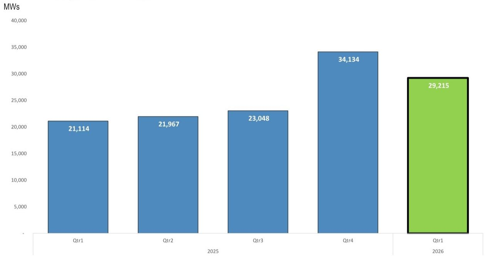

bar

| Quarter | MWs |
|---|---|
| Qtr1 | 21,114 |
| Qtr2 | 21,967 |
| Qtr3 | 23,048 |
| Qtr4 | 34,134 |
| Qtr1 2026 | 29,215 |

Source: McCoy Power, JPM

Figure 2: Gas Turbine Awards by OEM   
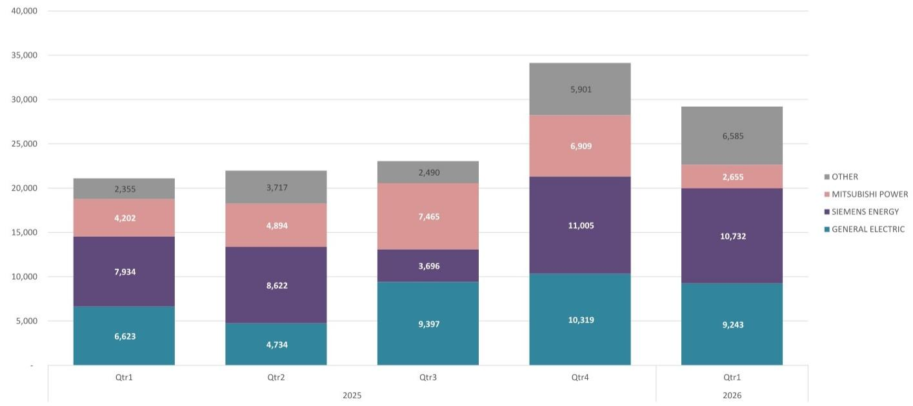

bar_stacked

| Year | Quarter | GENERAL ELECTRIC | SIEMENS ENERGY | MITSUBISHI POWER | OTHER |
|---|---|---|---|---|---|
| 2025 | Qtr1 | 6,623 | 7,934 | 4,202 | 2,355 |
| 2025 | Qtr2 | 4,734 | 8,622 | 4,894 | 3,717 |
| 2025 | Qtr3 | 9,397 | 3,696 | 7,465 | 2,490 |
| 2025 | Qtr4 | 10,319 | 11,005 | 6,909 | 5,901 |
| 2026 | Qtr1 | 9,243 | 10,732 | 2,655 | 6,585 |
The chart displays stacked bars representing quarterly revenue for each company category. The values are estimated based on the total revenue per quarter.

Source: McCoy Power, JPM

Figure 3: Select OEM Global Awards   
MWs 

<table><tr><td></td><td>1Q24</td><td>2Q24</td><td>3Q24</td><td>4Q24</td><td>1Q25</td><td>2Q25</td><td>3Q25</td><td>4Q25</td><td>1Q26</td></tr><tr><td>GENERAL ELECTRIC</td><td>5,427</td><td>4,925</td><td>5,211</td><td>6,144</td><td>6,623</td><td>4,734</td><td>9,397</td><td>10,319</td><td>9242.9</td></tr><tr><td>% change y/y</td><td>49%</td><td>100%</td><td>57%</td><td>172%</td><td>22%</td><td>-4%</td><td>80%</td><td>68%</td><td>40%</td></tr><tr><td>SIEMENS ENERGY</td><td>3,346</td><td>5,562</td><td>2,218</td><td>2,356</td><td>7,934</td><td>8,622</td><td>3,696</td><td>11,005</td><td>10732</td></tr><tr><td>% change y/y</td><td>-35%</td><td>1122%</td><td>3%</td><td>-27%</td><td>137%</td><td>55%</td><td>67%</td><td>367%</td><td>35%</td></tr><tr><td>MITSUBISHI POWER</td><td>5,169</td><td>2,562</td><td>3,805</td><td>4,239</td><td>4,202</td><td>4,894</td><td>7,465</td><td>6,909</td><td>2655</td></tr><tr><td>% change y/y</td><td>19%</td><td>-44%</td><td>52%</td><td>5%</td><td>-19%</td><td>91%</td><td>96%</td><td>63%</td><td>-37%</td></tr><tr><td>BAKER HUGHES</td><td>39</td><td>598</td><td>47</td><td>61</td><td>582</td><td>1,208</td><td>858</td><td>714</td><td>1134</td></tr><tr><td>% change y/y</td><td>-73%</td><td>553%</td><td>166%</td><td>-42%</td><td>1391%</td><td>102%</td><td>1744%</td><td>1070%</td><td>95%</td></tr><tr><td>SOLAR (CATERPILLAR)</td><td>4</td><td>66</td><td>193</td><td>77</td><td>187</td><td>34</td><td>505</td><td>492</td><td>554.9</td></tr><tr><td>% change y/y</td><td>-94%</td><td>-70%</td><td>553%</td><td>1570%</td><td>4832%</td><td>-48%</td><td>161%</td><td>540%</td><td>196%</td></tr><tr><td>OTHER</td><td>1,009</td><td>1,567</td><td>1,023</td><td>1,737</td><td>1,517</td><td>2,476</td><td>1,128</td><td>4,696</td><td>4,896</td></tr><tr><td>% change y/y</td><td>-57%</td><td>13%</td><td>18%</td><td>678%</td><td>50%</td><td>58%</td><td>10%</td><td>170%</td><td>223%</td></tr><tr><td>TOTAL</td><td>14,994</td><td>15,280</td><td>12,497</td><td>14,614</td><td>21,045</td><td>21,967</td><td>23,048</td><td>34,134</td><td>29,215</td></tr><tr><td>% change y/y</td><td>-4.9%</td><td>66.9%</td><td>40.5%</td><td>48.7%</td><td>40.4%</td><td>43.8%</td><td>84.4%</td><td>133.6%</td><td>38.8%</td></tr><tr><td>% change q/q</td><td>52.6%</td><td>1.9%</td><td>-18.2%</td><td>16.9%</td><td>44.0%</td><td>4.4%</td><td>4.9%</td><td>48.1%</td><td>-14.4%</td></tr></table>

Source: McCoy Power, JPM

Figure 4: Awards by Region   
MWs   
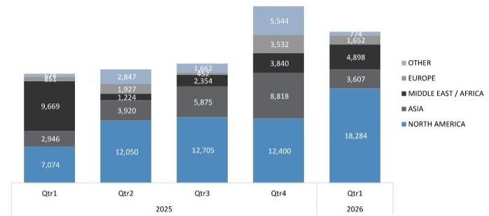  
Source: McCoy Power, JPM

Figure 6: Awards by Unit Size   
MWs   
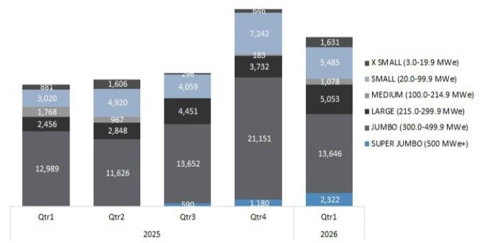

bar_stacked

| Year | Quarter | X SMALL (3.0-19.9 MWe) | SMALL (20.0-99.9 MWe) | MEDIUM (100.0-214.9 MWe) | LARGE (215.0-299.9 MWe) | JUMBO (300.0-499.9 MWe) | SUPER JUMBO (500 MWe+) |
|---|---|---|---|---|---|---|---|
| 2025 | Qtr1 | 12,989 | 3,020 | 1,768 | 2,456 | 881 | |
| 2025 | Qtr2 | 11,626 | 4,920 | 967 | 2,848 | 1,606 | |
| 2025 | Qtr3 | 13,652 | 4,059 | 4,451 | 2,98 | 398 | |
| 2025 | Qtr4 | 21,151 | 7,242 | 3,732 | 183 | 656 | |
| 2026 | Qtr1 | 13,646 | 5,485 | 1,078 | 5,053 | 1,631 | 2,322 |
The chart displays a stacked bar chart with each segment representing the total market size for that year. The data is presented in a table format with years as rows and segments labeled by capacity ranges.

Source: McCoy Power, JPM

Figure 8: Awards by Expected Operation Date   
MWs   
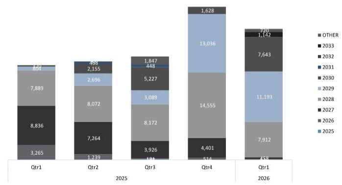  
Source: McCoy Power, JPM

Figure 5: Awards by Select Countries   
MWs   
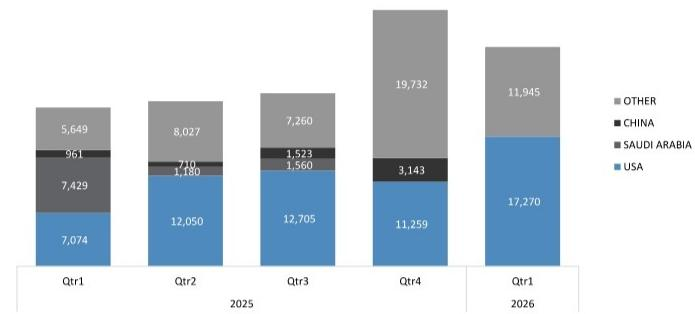

bar_stacked

| Year | Quarter | USA | Saudi Arabia | China | OTHER |
|---|---|---|---|---|---|
| 2025 | Qtr1 | 7,074 | 7,429 | 961 | 5,649 |
| 2025 | Qtr2 | 12,050 | 1,180 | 710 | 8,027 |
| 2025 | Qtr3 | 12,705 | 1,560 | 1,523 | 7,260 |
| 2025 | Qtr4 | 11,259 | 3,143 | | 19,732 |
| 2026 | Qtr1 | 17,270 | | | 11,945 |
The chart displays a stacked bar chart with each bar segmented by country/region (USA, Saudi Arabia, China, Other). The data is presented in a table format with years as rows and countries as columns. The values for each segment are explicitly labeled on the bars.

Source: McCoy Power, JPM

Figure 7: Awards by Turbine Class   
MWs   
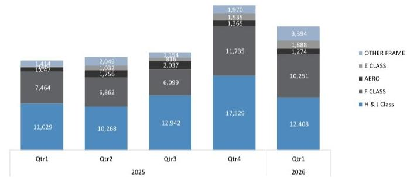

bar_stacked

| Year | Quarter | H & J Class | F CLASS | AERO | E CLASS | OTHER FRAME |
|---|---|---|---|---|---|---|
| 2025 | Qtr1 | 11,029 | 7,464 | 1,047 | 1,414 | 1,414 |
| 2025 | Qtr2 | 10,268 | 6,862 | 1,756 | 2,049 | 2,049 |
| 2025 | Qtr3 | 12,942 | 6,099 | 2,037 | 1,154 | 1,154 |
| 2025 | Qtr4 | 17,529 | 11,735 | 1,365 | 1,970 | 1,970 |
| 2026 | Qtr1 | 12,408 | 10,251 | 1,274 | 3,394 | 3,394 |
Qtr1 (E) = Other Frame; Qtr1 (E) = E CLASS; Qtr1 (E) = AERO; Qtr1 (E) = F CLASS; Qtr1 (E) = H & J Class; Qtr1 (E) = OTHER FRAME; Qtr1 (E) = E CLASS; Qtr1 (E) = AERO; Qtr1 (E) = F CLASS; Qtr1 (E) = H & J Class; Qtr1 (E) = OTHER FRAME; Qtr1 (E) = E CLASS; Qtr1 (E) = AERO; Qtr1 (E) = F CLASS; Qtr1 (E) = H & J Class; Qtr1 (AERO) = Other Frame; Qtr1 (AERO) = E CLASS; Qtr1 (AERO) = AERO; Qtr1 (AERO) = F CLASS; Qtr1 (AERO) = H & J Class; Qtr1 (AERO) = OTHER FRAME; Qtr1 (AERO) = E CLASS; Qtr1 (AERO) = AERO; Qtr1 (AERO) = F CLASS; Qtr1 (AERO) = H & J Class; Qtr1 (AERO) = OTHER FRAME; Qtr1 (AERO) = E CLASS; Qtr1 (AERO) = AERO; Qtr1 (AERO) = F CLASS; Qtr1 (AERO) = Other FRAME; Qtr1 (AERO) = E CLASS; Qtr1 (AERO) = AERO; Qtr1 (AERO) = F CLASS; Qtr1 (AERO) = H & J Class; Qtr1 (AERO) = OTHER FRAME; Qtr1 (AERO) = E CLASS; Qtr1 (AERO) = AERO; Qtr1 (AERO) = F CLASS; Qtr1 (AERO) < OTR Frame; Qtr1 (AERO) < E CLASS; Qtr1 (AERO) < AERO; Qtr1 (AERO) < F CLASS; Qtr1 (AERO) < H & J Class; Qtr1 (AERO) < OTHER FRAME; Qtr1 (AERO) < E CLASS; Qtr1 (AERO) < AERO; Qtr1 (AERO) < F CLASS; Qtr1 (AERO) < H & J Class; Qtr1 (AERO) < OTHER FRAME; Qtr1 (AERO) < E CLASS; Qtr1 (AERO) < AERO; Qtr1 (AERO) < F CLASS; Qtr1 (AERO) < OTR FRAME; Qtr1 (AERO) < E CLASS; Qtr1 (AERO) < AERO; Qtr1 (AERO) < F CLASS; Qtr1 (AERO) < H & J Class; Qtr1 (AERO) < OTHER FRAME; Qtr1 (AERO) < E CLASS; Qtr1 (AERO) < AERO; Qtr1 (AERO) < F CLASS; Qtr1 (AERO) { OTHER FRAME} ; Qtr1 (AERO) { E CLASS} ; Qtr1 (AERO) { AERO} ; Qtr1 (AERO) { F CLASS} ; Qtr1 (AERO) { H & J Class} ; Qtr1 (AERO) { OTHER FRAME} ; Qtr1 (AERO) { E CLASS} ; Qtr1 (AERO) { AERO} ; Qtr1 (AERO) { F CLASS} ; Qtr1 (AERO) { H & J Class} ;

Source: McCoy Power, JPM

Figure 9: Awards by Expected Shipment Date   
MWs   
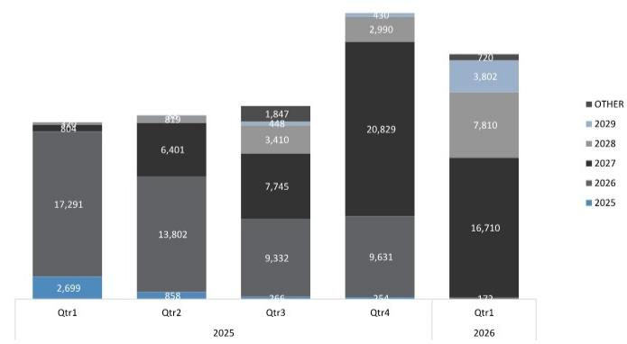  
Source: McCoy Power, JPM

Figure 10: Awards since 1980   
MWs   
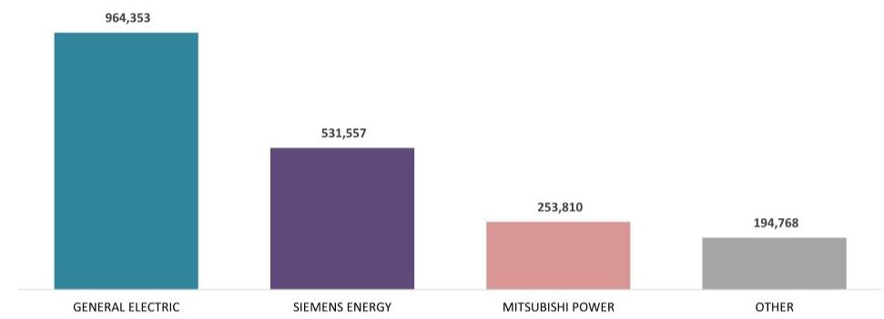

bar

| Company | Value |
| :--- | :--- |
| GENERAL ELECTRIC | 964,353 |
| SIEMENS ENERGY | 531,557 |
| MITSUBISHI POWER | 253,810 |
| OTHER | 194,768 |

Source: McCoy Power, JPM

Figure 11: Award Market Share Since 2023   
% of total awards since 2023   
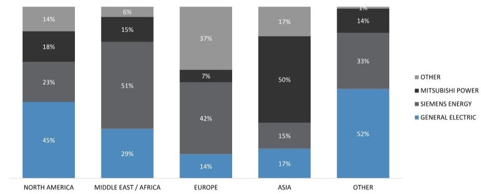

bar_stacked

| Region | GENERAL ELECTRIC (%) | SIEMENS ENERGY (%) | MITSUBISHI POWER (%) | OTHER (%) |
| :--- | :--- | :--- | :--- | :--- |
| NORTH AMERICA | 45 | 23 | 18 | 14 |
| MIDDLE EAST / AFRICA | 29 | 51 | 15 | 6 |
| EUROPE | 14 | 42 | 7 | 37 |
| ASIA | 17 | 15 | 50 | 17 |
| OTHER | 52 | 33 | 14 | 1 |

Source: McCoy Power, JPM

Figure 12: Award Market Share Since 2015   
% of total awards since 2015   
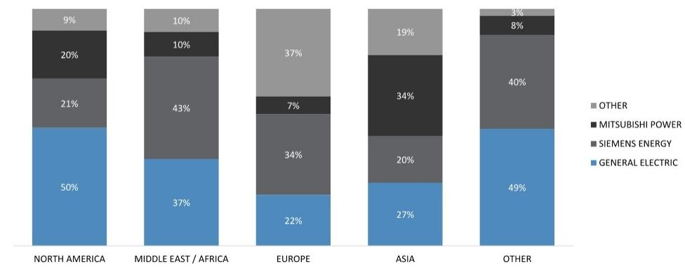

bar_stacked

| Region | GENERAL ELECTRIC (%) | SIEMENS ENERGY (%) | MITSUBISHI POWER (%) | OTHER (%) |
| :--- | :--- | :--- | :--- | :--- |
| NORTH AMERICA | 50 | 21 | 20 | 9 |
| MIDDLE EAST / AFRICA | 37 | 43 | 10 | 10 |
| EUROPE | 22 | 34 | 7 | 37 |
| ASIA | 27 | 20 | 34 | 19 |
| OTHER | 49 | 40 | 8 | 3 |

Source: McCoy Power, JPM

Figure 13: Global Gas Turbine Awards by Region   
  
\*2026 only includes 1Q Awards   
Source: McCoy Power, JPM

Figure 14: Global Gas Turbine Awards by OEM   
  
\*2026 only includes 1Q Awards   
Source: McCoy Power, JPM

Figure 15: Expected Shipment Date by OEM   
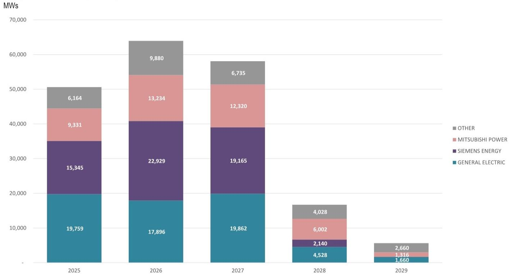

bar_stacked

| Year | GENERAL ELECTRIC | SIEMENS ENERGY | MITSUBISHI POWER | OTHER |
|---|---|---|---|---|
| 2025 | 19,759 | 15,345 | 9,331 | 6,164 |
| 2026 | 17,896 | 22,929 | 13,234 | 9,880 |
| 2027 | 19,862 | 19,165 | 12,320 | 6,735 |
| 2028 | 4,528 | 2,140 | 6,002 | 4,028 |
| 2029 | 1,660 | 1,316 | 1,316 | 2,660 |

Source: McCoy Power, JPM

# JPM Global Gas Turbine Capacity Estimates

- GE Vernova: GEV initially announced a capacity expansion in September 2024 to reach 70-80 heavy duty units by 2H26, representing \~20GW of capacity. In addition, the company announced an additional \~4GW of capacity expansion at its December 2025 investor event, bringing heavy duty capacity to \~24GW by 2028 and total capacity to \~26GW (including aeros). The company has repeatedly mentioned efficiency gains driving incremental output at its factories, which could drive upside to our estimates.   
- Siemens Energy: ENR initially announced a capacity expansion in November 2024 to upgrade production capacity for large gas turbines by $30\%$ . At the company's November 2025 CMD, it announced $\sim 17\mathrm{GW}$ in FY24 expanding to $\sim 22\mathrm{GW}$ in FY25-27 and $>30\mathrm{GW}$ in FY28-30. We note the company's announcement was in combined-cycle terms, which includes power generation capacity from steam turbines and HRSGs. We make assumptions in the estimates below to arrive at a simple-cycle capacity.   
- Mitsubishi Heavy: MHI initially announced a planned capacity expansion in May 2024 of \~30% by YE26. In September 2025, the CEO made public comments about potentially increasing manufacturing throughput by \~100%. On the 4Q26 earnings call, the CEO said the company had line of sight into increasing capacity beyond the 30% target. In the estimates below, we take the average order volume from FY22-24 and assume a gradual \~50% capacity increase by 2028.   
- Other: We use the McCoy survey data to help inform our 2024-2026 capacity estimates and assume an annual \~1GW of capacity expansion through 2028.

Figure 16: JPM Global Gas Turbine Capacity Estimates
MWs (Simple-Cycle Terms)   
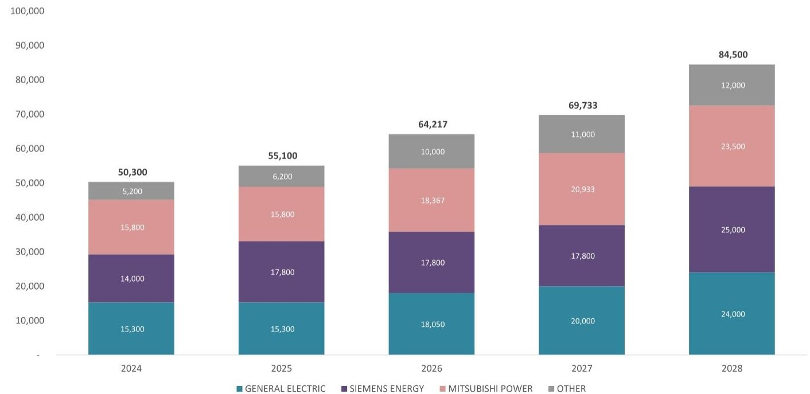  
Source: JPM

# JPM Gas Generation Pricing Tracker

# Gas Generation Plant Costs Continue to Rise

The pricing tracker below compiles data from 78 publicly announced natural gas projects in North America where cost info was available. Disclosures vary on specifics and sometimes include other costs, though we attempt to adjust where necessary. Generally speaking, publicly announced costs for natural gas plants can vary widely based on a number of different factors. Importantly, the dates shown in the chart below are completion dates, NOT delivery dates. Construction timelines can vary significantly by project, but we generally believe it is reasonable to assume $\sim 6 - 9$ months from delivery date of a turbine to completion date for CCGT projects. The data behind the charts below is available to clients upon request.

Our pricing tracker finds that median CCGT capex costs for 2031 CODs have risen by $\sim 200\%$ compared to 2025 CODs. For simple cycle plants, we note that 2028 COD costs are up $\sim 50\%$ for simple cycle plants compared to 2025 CODs (CCGTs are up $\sim 63\%$ comparatively in the same time period).

Figure 17: NAM CCGT Project Costs by Completion Date   
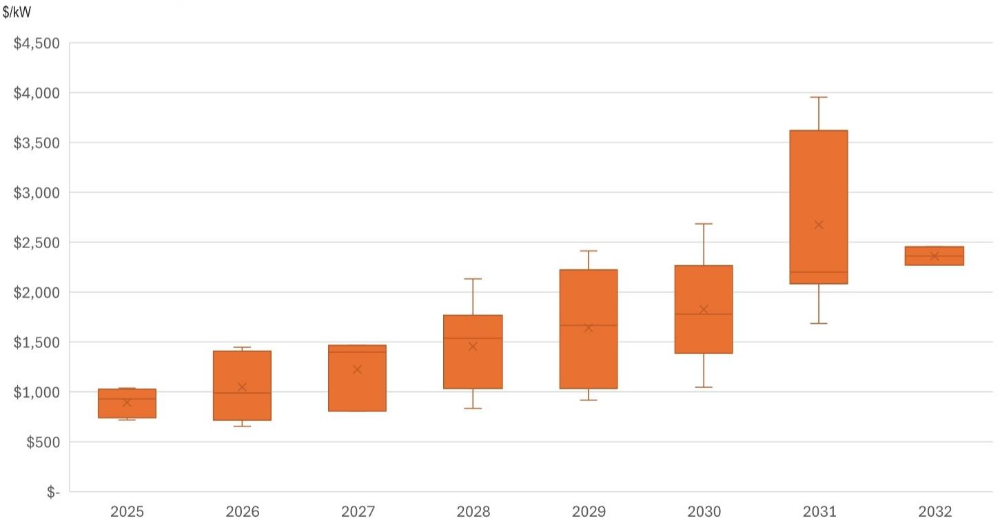

boxplot

| Year | Lower Bound ($/kW) | Median ($/kW) | Upper Bound ($/kW) |
|------|---------------------|---------------|---------------------|
| 2025 | ~700                | ~900          | ~1000               |
| 2026 | ~700                | ~1000         | ~1400               |
| 2027 | ~800                | ~1200         | ~1450               |
| 2028 | ~900                | ~1500         | ~1750               |
| 2029 | ~1000               | ~1650         | ~2200               |
| 2030 | ~1350               | ~1800         | ~2300               |
| 2031 | ~2100               | ~2700         | ~3600               |
| 2032 | ~2350               | ~2400         | ~2450               |

Source: JPM, Press Releases, Utility Filings

Figure 18: NAM Simple Cycle Costs by Completion Date   
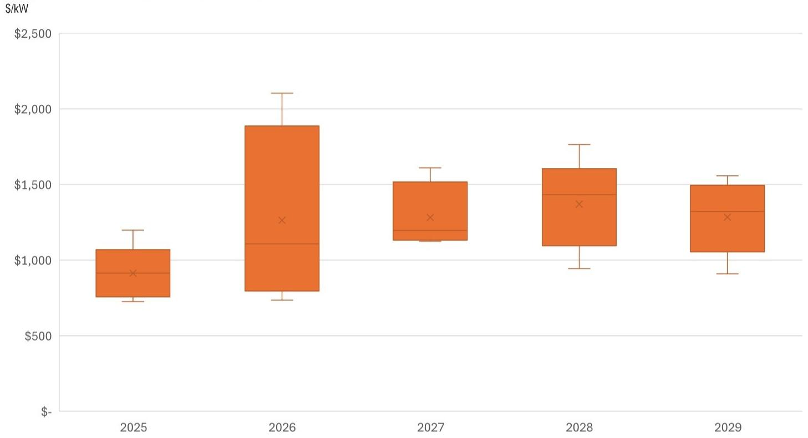

boxplot

| Year | Lower Bound ($/kW) | Median ($/kW) | Upper Bound ($/kW) |
|------|---------------------|---------------|---------------------|
| 2025 | ~750                | ~950          | ~1150               |
| 2026 | ~800                | ~1100         | ~1900               |
| 2027 | ~1150               | ~1200         | ~1550               |
| 2028 | ~1100               | ~1450         | ~1600               |
| 2029 | ~1050               | ~1350         | ~1500               |

Source: JPM, Press Releases, Utility Filings

# Aggregated Gas Generation Build Forecasts

# Wide Range of US Gas-Fired Addition Forecasts

We note a wide range of opinions across third-party forecasters for US natural gas-fired generation additions through the end of the decade. The expectations from EIA and Nextera Energy are in a similar ballpark, with a forecasted \~85-90GW of net gas-fired capacity additions through 2030 (in CCGT terms). BNEF's forecast is much lower, with \~46GW of net additions through 2030. We note that BNEF assumes a much higher penetration rate of renewables and peakers. The McCoy data shown below does not represent a forecast but rather represents firm awarded capacity by expected COD date. Over time, we would expect these orders to fill out closer to third-party forecasters' estimates (OEMs are currently filling order slots for 2028-2030). We note that we have modified the McCoy data and NEE forecasts below to include non-gas turbine generation capacity from CCGT plants (steam, heat recovery). We use a factor of 1.5 to convert simple cycle capacity to CCGT capacity. The data behind the chart below is available to clients upon request

Figure 19: Annual US Gas-Fired Capacity Additions   
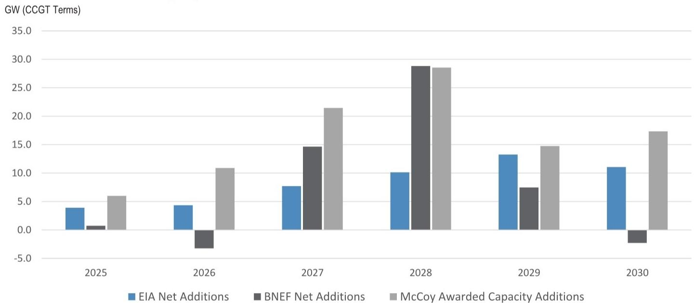

bar

GW (CCGT Terms)
| Year | EIA Net Additions (GW) | BNEF Net Additions (GW) | McCoy Awarded Capacity Additions (GW) |
| :--- | :--- | :--- | :--- |
| 2025 | 4.0 | 0.6 | 6.0 |
| 2026 | 4.4 | -3.0 | 11.0 |
| 2027 | 7.8 | 14.7 | 21.5 |
| 2028 | 10.2 | 29.0 | 28.7 |
| 2029 | 13.4 | 7.5 | 14.9 |
| 2030 | 11.1 | -1.8 | 17.4 |

NEE and McCoy data is JPMe adjusted to include full CCGT capacity  
Source: JPM, Bloomberg Finance L.P., Energy Information Agency, NextEra Energy Presentation Materials, McCoy Power

Figure 20: Annual US Gas-Fired Capacity Additions   
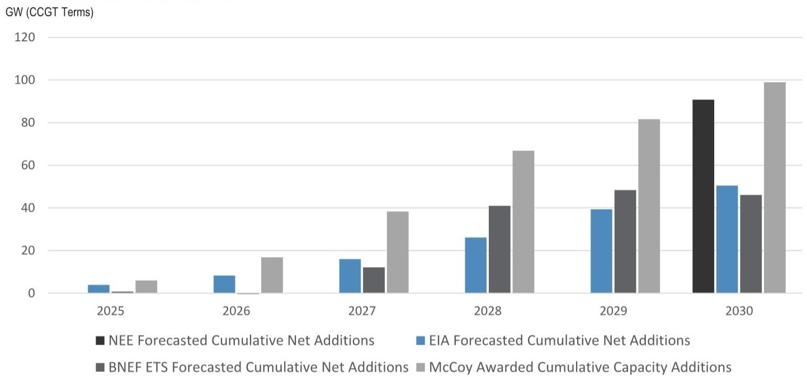

bar

GW (CCGT Terms)
| Year | NEE Forecasted Cumulative Net Additions | EIA Forecasted Cumulative Net Additions | BNEF ETS Forecasted Cumulative Net Additions | McCoy Awarded Cumulative Capacity Additions |
| :--- | :--- | :--- | :--- | :--- |
| 2025 | 0 | 4 | 1 | 6 |
| 2026 | 0 | 8 | 0 | 17 |
| 2027 | 0 | 16 | 12 | 38 |
| 2028 | 0 | 26 | 41 | 67 |
| 2029 | 0 | 39 | 48 | 81 |
| 2030 | 91 | 50 | 46 | 99 |

NEE and McCoy data is JPMe adjusted to include full CCGT capacity   
Source: JPM, Bloomberg Finance L.P., Energy Information Agency, NextEra Energy Presentation Materials, McCoy Power

# Stock Performance Comparison

Figure 21: Gas-Turbine Related Stock Performance   
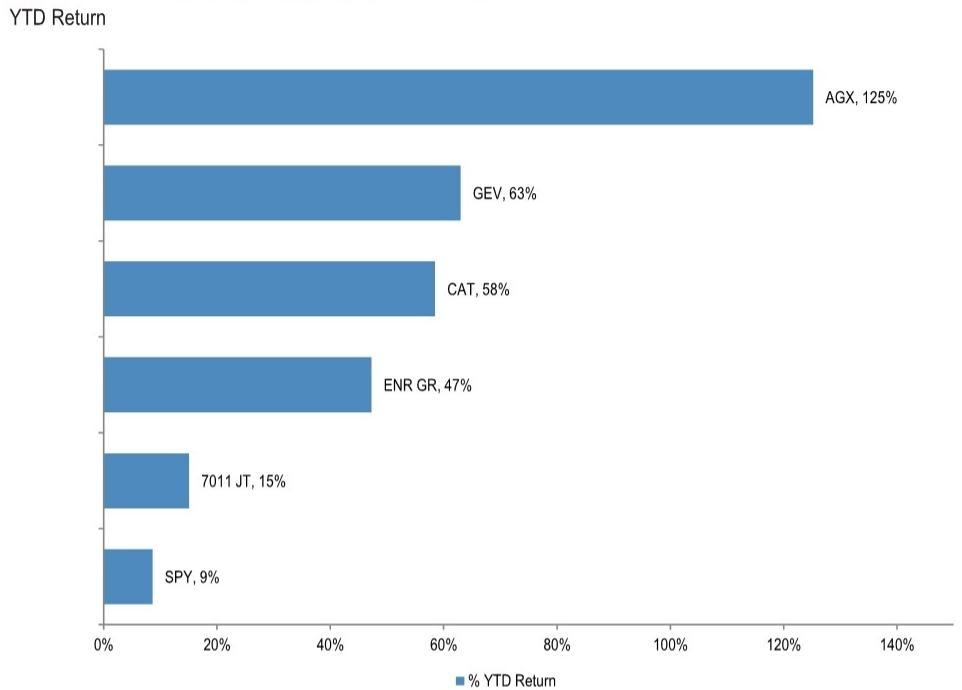

bar

YTD Return
| Company | % YTD Return (%) |
| :--- | :--- |
| AGX | 125 |
| GEV | 63 |
| CAT | 58 |
| ENR GR | 47 |
| 7011 JT | 15 |
| SPY | 9 |

Source: Bloomberg Finance L.P.

Companies Discussed in This Report (all prices in this report as of market close on 13 May 2026, unless otherwise indicated) Argan(AGX/\$719.92/OW), Baker Hughes(BKR/\$65.41/OW), Caterpillar Inc.(CAT/\$902.30/OW), GE Vernova(GEV/\$1,062.57/OW), Siemens Energy(ENR1n.DE/€177.64/OW)

Analyst Certification: The Research Analyst(s) denoted by an “AC” on the cover of this report certifies (or, where multiple Research Analysts are primarily responsible for this report, the Research Analyst denoted by an “AC” on the cover or within the document individually certifies, with respect to each security or issuer that the Research Analyst covers in this research) that: (1) all of the views expressed in this report accurately reflect the Research Analyst’s personal views about any and all of the subject securities or issuers; and (2) no part of any of the Research Analyst's compensation was, is, or will be directly or indirectly related to the specific recommendations or views expressed by the Research Analyst(s) in this report. For all Korea-based Research Analysts listed on the front cover, if applicable, they also certify, as per KOFIA requirements, that the Research Analyst’s analysis was made in good faith and that the views reflect the Research Analyst’s own opinion, without undue influence or intervention.

All authors named within this report are Research Analysts who produce independent research unless otherwise specified. In Europe, Sector Specialists (Sales and Trading) may be shown on this report as contacts but are not authors of the report or part of the Research Department.

# Important Disclosures

• Market Maker: JPM Securities LLC makes a market in the securities of GE Vernova or related entities.   
- Market Maker/ Liquidity Provider: JPM is a market maker and/or liquidity provider in the financial instruments of/related to Argan, Baker Hughes, Caterpillar Inc., GE Vernova, Siemens Energy or related entities.   
- Manager or Co-manager: JPM acted as manager or co-manager in a public offering of securities or financial instruments (as such term is defined in Directive 2014/65/EU) of/for Baker Hughes, Caterpillar Inc., GE Vernova or related entities within the past 12 months.   
- Beneficial Ownership (1% or more): JPM beneficially owns 1% or more of a class of common equity securities of Caterpillar Inc. or related entities.   
- Client: JPM currently has, or had within the past 12 months, the following entity(ies) as clients: Argan, Baker Hughes, Caterpillar Inc., GE Vernova, Siemens Energy or related entities.   
- Client/Investment Banking: JPM currently has, or had within the past 12 months, the following entity(ies) as investment banking clients: Baker Hughes, Caterpillar Inc., GE Vernova or related entities.   
- Client/Non-Investment Banking, Securities-Related: JPM currently has, or had within the past 12 months, the following entity(ies) as clients, and the services provided were non-investment-banking, securities-related: Baker Hughes, Caterpillar Inc., GE Vernova, Siemens Energy or related entities.   
- Client/Non-Securities-Related: JPM currently has, or had within the past 12 months, the following entity(ies) as clients, and the services provided were non-securities-related: Baker Hughes, Caterpillar Inc., GE Vernova, Siemens Energy or related entities.   
- Investment Banking Compensation Received: JPM has received in the past 12 months compensation for investment banking services from Baker Hughes, Caterpillar Inc., GE Vernova or related entities.   
- Potential Investment Banking Compensation: JPM expects to receive, or intends to seek, compensation for investment banking services in the next three months from Argan, Baker Hughes, Caterpillar Inc., GE Vernova, Siemens Energy or related entities.   
• Non-Investment Banking Compensation Received: JPM has received compensation in the past 12 months for products or services other than investment banking from Baker Hughes, Caterpillar Inc., GE Vernova, Siemens Energy or related entities.   
- Debt Position: JPM may hold a position in the debt securities of Argan, Baker Hughes, Caterpillar Inc., GE Vernova, Siemens Energy or related entities, if any.

Company-Specific Disclosures: JPM does and seeks to do business with companies covered in its research reports. As a result, investors should be aware that the firm may have a conflict of interest that could affect the objectivity of this report. Investors should consider this report as only a single factor in making their investment decision. Important disclosures, including price charts and credit opinion history tables (if applicable), are available for compendium reports and all JPM-covered companies, and certain non-covered companies, by visiting https://www.jpmm.com/research/disclosures, calling 1-800-477-0406, or e-mailing research.disclosure.inquiries@JPM.com with your request.

Argan (AGX, AGX US) Price Chart   
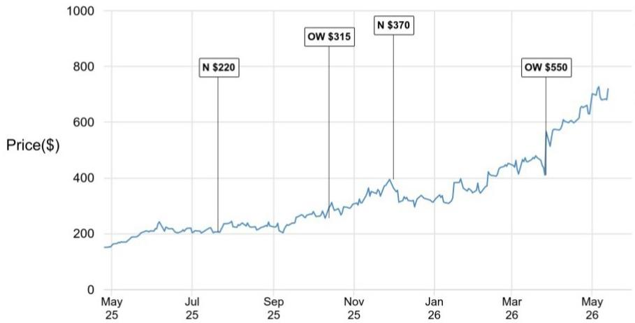

line

| Date       | Price($) |
| ---------- | -------- |
| Jul 25     | 220      |
| Nov 25     | 315      |
| Jan 26     | 370      |
| Mar 26     | 550      |

<table><tr><td>Date</td><td>Rating</td><td>Price ($)</td><td>Price Target ($)</td></tr><tr><td>21-Jul-25</td><td>N</td><td>206.63</td><td>220</td></tr><tr><td>13-Oct-25</td><td>OW</td><td>256.15</td><td>315</td></tr><tr><td>01-Dec-25</td><td>N</td><td>395.20</td><td>370</td></tr><tr><td>27-Mar-26</td><td>OW</td><td>410.85</td><td>550</td></tr></table>

Source: Bloomberg Finance L.P. and JPM; price data adjusted for stock splits and dividends. Initiated coverage Jul 21, 2025. All share prices are as of market close on the previous business day.

Baker Hughes (BKR, BKR US) Price Chart   
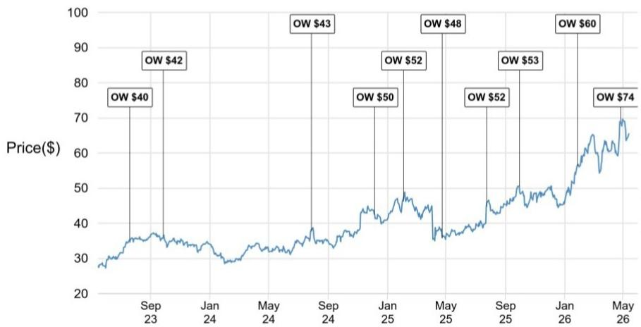

line

| Date       | Price($) |
| ---------- | -------- |
| Sep 23     | 40       |
| Jan 24     | 42       |
| May 24     | 43       |
| Jan 25     | 50       |
| May 25     | 52       |
| Sep 25     | 53       |
| Jan 26     | 60       |
| May 26     | 74       |

<table><tr><td>Date</td><td>Rating</td><td>Price ($)</td><td>Price Target ($)</td></tr><tr><td>20-Jul-23</td><td>OW</td><td>35.20</td><td>40</td></tr><tr><td>28-Sep-23</td><td>OW</td><td>36.25</td><td>42</td></tr><tr><td>29-Jul-24</td><td>OW</td><td>37.65</td><td>43</td></tr><tr><td>06-Dec-24</td><td>OW</td><td>42.51</td><td>50</td></tr><tr><td>03-Feb-25</td><td>OW</td><td>46.18</td><td>52</td></tr><tr><td>24-Apr-25</td><td>OW</td><td>35.89</td><td>48</td></tr><tr><td>24-Jul-25</td><td>OW</td><td>44.68</td><td>52</td></tr><tr><td>30-Sep-25</td><td>OW</td><td>50.55</td><td>53</td></tr><tr><td>27-Jan-26</td><td>OW</td><td>56.29</td><td>60</td></tr><tr><td>27-Apr-26</td><td>OW</td><td>68.94</td><td>74</td></tr></table>

Source: Bloomberg Finance L.P. and JPM; price data adjusted for stock splits and dividends. Initiated coverage Apr 11, 2001. All share prices are as of market close on the previous business day.

Caterpillar Inc. (CAT, CAT US) Price Chart   
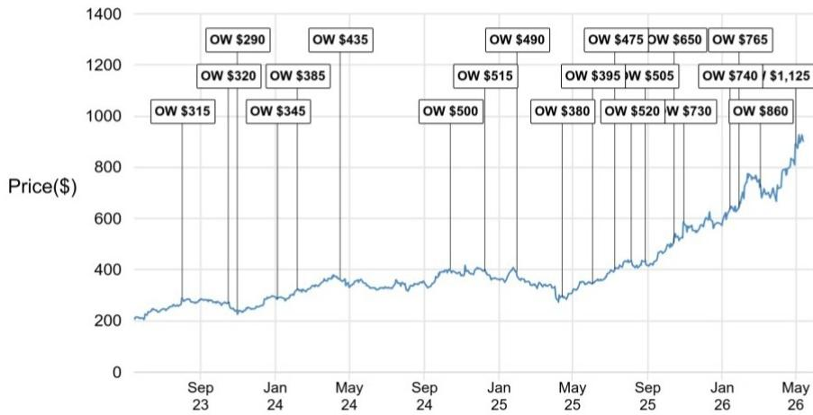

line

| Date  | Price($) |
|-------|----------|
| Sep 23 | 315      |
| Jan 24 | 320      |
| May 24 | 345      |
| Sep 24 | 500      |
| Jan 25 | 515      |
| May 25 | 380      |
| Sep 25 | 520      |
| Jan 26 | 730      |
| May 26 | 860      |

Source: Bloomberg Finance L.P. and JPM; price data adjusted for stock splits and dividends. Initiated coverage May 01, 1999. All share prices are as of market close on the previous business day.

<table><tr><td>Date</td><td>Rating</td><td>Price ($)</td><td>Price Target ($)</td></tr><tr><td>02-Aug-23</td><td>OW</td><td>288.65</td><td>315</td></tr><tr><td>16-Oct-23</td><td>OW</td><td>267.94</td><td>320</td></tr><tr><td>31-Oct-23</td><td>OW</td><td>242.16</td><td>290</td></tr><tr><td>05-Jan-24</td><td>OW</td><td>286.10</td><td>345</td></tr><tr><td>06-Feb-24</td><td>OW</td><td>321.40</td><td>385</td></tr><tr><td>16-Apr-24</td><td>OW</td><td>363.91</td><td>435</td></tr><tr><td>14-Oct-24</td><td>OW</td><td>402.02</td><td>500</td></tr><tr><td>09-Dec-24</td><td>OW</td><td>395.03</td><td>515</td></tr><tr><td>30-Jan-25</td><td>OW</td><td>393.23</td><td>490</td></tr><tr><td>14-Apr-25</td><td>OW</td><td>293.45</td><td>380</td></tr><tr><td>03-Jun-25</td><td>OW</td><td>344.67</td><td>395</td></tr><tr><td>10-Jul-25</td><td>OW</td><td>402.18</td><td>475</td></tr><tr><td>06-Aug-25</td><td>OW</td><td>434.23</td><td>520</td></tr><tr><td>29-Aug-25</td><td>OW</td><td>434.91</td><td>505</td></tr><tr><td>14-Oct-25</td><td>OW</td><td>504.76</td><td>650</td></tr><tr><td>30-Oct-25</td><td>OW</td><td>585.49</td><td>730</td></tr><tr><td>14-Jan-26</td><td>OW</td><td>636.53</td><td>740</td></tr><tr><td>29-Jan-26</td><td>OW</td><td>643.28</td><td>765</td></tr><tr><td>04-Mar-26</td><td>OW</td><td>722.18</td><td>860</td></tr><tr><td>01-May-26</td><td>OW</td><td>890.11</td><td>1,125</td></tr></table>

GE Vernova (GEV, GEV US) Price Chart   
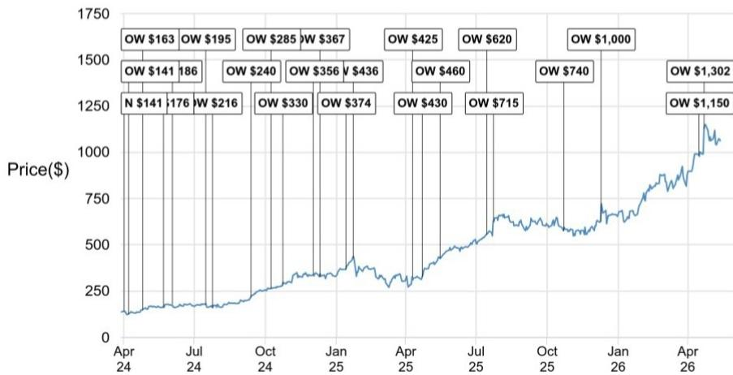

line

| Date  | Price($) |
|-------|----------|
| Apr 24 | 141      |
| Jul 24 | 176      |
| Oct 24 | 216      |
| Jan 25 | 330      |
| Apr 25 | 430      |
| Jul 25 | 460      |
| Oct 25 | 715      |
| Jan 26 | 740      |
| Apr 26 | 1,150    |
| Apr 26 | 1,302    |
| Apr 26 | 1,000    |
| Apr 26 | 1,367    |
| Apr 26 | 1,63     |
| Apr 26 | 186      |
| Apr 26 | 240      |
| Apr 26 | 285      |
| Apr 26 | 356      |
| Apr 26 | 436      |
| Apr 26 | 425      |
| Apr 26 | 620      |

Source: Bloomberg Finance L.P. and JPM; price data adjusted for stock splits and dividends. Initiated coverage Apr 02, 2024. All share prices are as of market close on the previous business day.

<table><tr><td>Date</td><td>Rating</td><td>Price ($)</td><td>Price Target ($)</td></tr><tr><td>02-Apr-24</td><td>N</td><td>142.02</td><td>141</td></tr><tr><td>08-Apr-24</td><td>OW</td><td>122.70</td><td>141</td></tr><tr><td>26-Apr-24</td><td>OW</td><td>148.31</td><td>163</td></tr><tr><td>23-May-24</td><td>OW</td><td>163.85</td><td>176</td></tr><tr><td>03-Jun-24</td><td>OW</td><td>175.90</td><td>186</td></tr><tr><td>16-Jul-24</td><td>OW</td><td>177.44</td><td>195</td></tr><tr><td>25-Jul-24</td><td>OW</td><td>162.90</td><td>216</td></tr><tr><td>13-Sep-24</td><td>OW</td><td>215.27</td><td>240</td></tr><tr><td>09-Oct-24</td><td>OW</td><td>264.27</td><td>285</td></tr><tr><td>24-Oct-24</td><td>OW</td><td>279.88</td><td>330</td></tr><tr><td>03-Dec-24</td><td>OW</td><td>337.54</td><td>356</td></tr><tr><td>11-Dec-24</td><td>OW</td><td>327.39</td><td>367</td></tr><tr><td>14-Jan-25</td><td>OW</td><td>366.81</td><td>374</td></tr><tr><td>23-Jan-25</td><td>OW</td><td>427.10</td><td>436</td></tr><tr><td>10-Apr-25</td><td>OW</td><td>326.81</td><td>425</td></tr><tr><td>23-Apr-25</td><td>OW</td><td>326.07</td><td>430</td></tr><tr><td>16-May-25</td><td>OW</td><td>426.97</td><td>460</td></tr><tr><td>15-Jul-25</td><td>OW</td><td>555.04</td><td>620</td></tr><tr><td>24-Jul-25</td><td>OW</td><td>629.03</td><td>715</td></tr><tr><td>23-Oct-25</td><td>OW</td><td>576.00</td><td>740</td></tr><tr><td>10-Dec-25</td><td>OW</td><td>625.30</td><td>1,000</td></tr><tr><td>16-Apr-26</td><td>OW</td><td>985.92</td><td>1,150</td></tr><tr><td>23-Apr-26</td><td>OW</td><td>1127.56</td><td>1,302</td></tr></table>

Siemens Energy (ENR1n.DE, ENR GR) Price Chart   
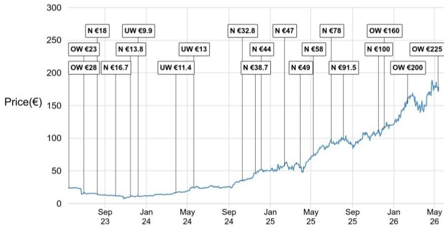

line

| Date  | Label | Price(€) |
|-------|-------|----------|
| Sep 23 | OW    | 28       |
| Sep 23 | N     | 18       |
| Jan 24 | UW    | 9.9      |
| Jan 24 | N     | 13.8     |
| May 24 | UW    | 11.4     |
| May 24 | UW    | 13       |
| Sep 24 | N     | 32.8     |
| Sep 24 | N     | 44       |
| Jan 25 | N     | 38.7     |
| Jan 25 | N     | 47       |
| May 25 | N     | 49       |
| May 25 | N     | 58       |
| Sep 25 | N     | 78       |
| Sep 25 | N     | 91.5     |
| Jan 26 | OW    | 100      |
| Jan 26 | OW    | 160      |
| Jan 26 | OW    | 200      |
| May 26 | OW    | 225      |

Source: Bloomberg Finance L.P. and JPM; price data adjusted for stock splits and dividends. Initiated coverage Sep 29, 2020. All share prices are as of market close on the previous business day.

<table><tr><td>Date</td><td>Rating</td><td>Price (€)</td><td>Price Target (€)</td></tr><tr><td>17-May-23</td><td>OW</td><td>23.51</td><td>28</td></tr><tr><td>30-Jun-23</td><td>OW</td><td>15.66</td><td>23</td></tr><tr><td>09-Aug-23</td><td>N</td><td>14.42</td><td>18</td></tr><tr><td>02-Oct-23</td><td>N</td><td>12.34</td><td>16.7</td></tr><tr><td>16-Nov-23</td><td>N</td><td>11.10</td><td>13.8</td></tr><tr><td>08-Dec-23</td><td>UW</td><td>11.61</td><td>9.9</td></tr><tr><td>28-Mar-24</td><td>UW</td><td>16.40</td><td>11.4</td></tr><tr><td>20-May-24</td><td>UW</td><td>25.03</td><td>13</td></tr><tr><td>11-Oct-24</td><td>N</td><td>34.64</td><td>32.8</td></tr><tr><td>18-Nov-24</td><td>N</td><td>46.77</td><td>38.7</td></tr><tr><td>06-Dec-24</td><td>N</td><td>52.80</td><td>44</td></tr><tr><td>12-Feb-25</td><td>N</td><td>57.18</td><td>47</td></tr><tr><td>31-Mar-25</td><td>N</td><td>55.02</td><td>49</td></tr><tr><td>09-May-25</td><td>N</td><td>73.76</td><td>58</td></tr><tr><td>01-Jul-25</td><td>N</td><td>98.06</td><td>78</td></tr><tr><td>06-Aug-25</td><td>N</td><td>98.54</td><td>91.5</td></tr><tr><td>17-Nov-25</td><td>N</td><td>110.35</td><td>100</td></tr><tr><td>04-Dec-25</td><td>OW</td><td>115.05</td><td>160</td></tr><tr><td>11-Feb-26</td><td>OW</td><td>153.00</td><td>200</td></tr><tr><td>13-May-26</td><td>OW</td><td>171.80</td><td>225</td></tr></table>

The chart(s) show JPM's continuing coverage of the stocks; the current analysts may or may not have covered it over the entire period. JPM ratings or designations: OW = Overweight, N = Neutral, UW = Underweight, NR = Not Rated

# Explanation of Equity Research Ratings, Designations and Analyst(s) Coverage Universe:

JPM uses the following rating system: Overweight (over the duration of the price target indicated in this report, we expect this stock will outperform the average total return of the stocks in the Research Analyst's, or the Research Analyst's team's, coverage universe); Neutral (over the duration of the price target indicated in this report, we expect this stock will perform in line with the average total return of the stocks in the Research Analyst's, or the Research Analyst's team's, coverage universe); and Underweight (over the duration of the price target indicated in this report, we expect this stock will underperform the average total return of the stocks in the Research Analyst's, or the Research Analyst's team's, coverage universe. NR is Not Rated. In this case, JPM has removed the rating and, if applicable, the price target, for this stock because of either a lack of a sufficient fundamental basis or for legal, regulatory or policy reasons. The previous rating and, if applicable, the price target, no longer should be relied upon. An NR designation is not a recommendation or a rating. Some stocks under coverage have a rating but no price target; in these cases, we expect the stock will outperform/perform in line/underperform the average total return of the stocks in the Research Analyst's, or the Research Analyst's team's, coverage universe of the relevant duration of the region. In our Asia (ex-Australia and ex-India) and U.K. small- and mid-cap Equity Research, each stock's expected total return is compared to the expected total return of a benchmark country market index, not to those Research Analysts' coverage universe. If it does not appear in the Important Disclosures section of this report, the certifying Research Analyst's coverage universe can be found on JPM's Research website, https://www.JPMmarkets.com.

Coverage Universe: Strouse, Mark W: Array Technologies (ARRY), Bloom Energy (BE), Brookfield Renewable Corp (BEPC), Brookfield Renewable Partners (BEP), Canadian Solar (CSIQ), Centuri (CTRI), EVgo (EVGO), Enlight Renewable Energy (ENLT), Enphase Energy (ENPH), Eos Energy (EOSE), First Solar, Inc (FSLR), Fluence Energy (FLNC), FuelCell Energy (FCEL), GE Vernova (GEV), Generac (GNRC), HA Sustainable Infrastructure Capital Inc (HASI), Itron (ITRI), MasTec (MTZ), Nextpower (NXT), Ormat Technologies (ORA), Primoris (PRIM), Quanta Services (PWR), SOLV Energy (MWH), Shoals (SHLS), SolarEdge Technologies (SEDG), Sunrun Inc. (RUN)Fairbanks, Michael G: Argan (AGX), Badger Meter (BMI), Xylem (XYL)Buller, Phil : ABB (ABBN.S), Assa Abloy (ASSAb.ST), Atlas Copco (ATCOa.ST), Kone (KNEBV.HE), Legrand (LEGD.PA), Schindler (SCHP.S), Schneider Electric (SCHN.PA), Siemens (SIEGn.F), Siemens Energy (ENR1n.DE)Zakaria, Tami : AGCO Corp. (AGCO), Allison Transmission Holdings (ALSN), Atmus Filtration Technologies (ATMU), CNH Industrial (CNH), Casella Waste Systems (CWST), Caterpillar Inc. (CAT), Cummins Inc (CMI), Deere & Co. (DE), ESAB Corp. (ESAB), GFL Environmental (GFL), Herc Holdings, Inc. (HRI), Illinois Tool Works (ITW), Kennametal Inc. (KMT), Middleby Corp (MIDD), Onterris (ONT), Oshkosh Corp. (OSK), PACCAR Inc. (PCAR), Republic Services (RSG), Sunbelt Rentals (SUNB), Terex Corp (TEX), Trimble Inc (TRMB), United Rentals, Inc. (URI), Waste Connections (WCN), Waste Management (WM), Westinghouse Air Brake Technologies (WAB)

# JPM Equity Research Ratings Distribution, as of April 04, 2026

<table><tr><td></td><td>Overweight (buy)</td><td>Neutral (hold)</td><td>Underweight (sell)</td></tr><tr><td>JPM Global Equity Research Coverage*</td><td>51%</td><td>37%</td><td>12%</td></tr><tr><td>IB clients**</td><td>83%</td><td>79%</td><td>74%</td></tr><tr><td>JPMS Equity Research Coverage*</td><td>49%</td><td>39%</td><td>13%</td></tr><tr><td>IB clients**</td><td>94%</td><td>93%</td><td>85%</td></tr></table>

\*Please note that the percentages may not add to 100% because of rounding.

\*\*Percentage of subject companies within each of the "buy," "hold" and "sell" categories for which JPM has provided investment banking services within the previous 12 months.

For purposes of FINRA ratings distribution rules only, our Overweight rating falls into a buy rating category; our Neutral rating falls into a hold rating category; and our Underweight rating falls into a sell rating category. Please note that stocks with an NR designation are not included in the table above. This information is current as of the end of the most recent calendar quarter.

Equity Valuation and Risks: For valuation methodology and risks associated with covered companies or price targets for covered companies, please see the most recent company-specific research report at http://www.JPMmarkets.com, contact the primary analyst or your JPM representative, or email research.disclosure.inquiries@JPM.com. For material information about the proprietary models used, please see the Summary of Financials in company-specific research reports and the Company Tearsheets, which are available to download on the company pages of our client website, http://www.JPMmarkets.com. This report also sets out within it the material underlying assumptions used.

# History of Investment Recommendations:

A history of JPM investment recommendations disseminated during the preceding 12 months can be accessed on the Research & Commentary page of http://www.JPMmarkets.com where you can also search by analyst name, sector or financial instrument.

Analysts' Compensation: The research analysts responsible for the preparation of this report receive compensation based upon various factors, including the quality and accuracy of research, client feedback, competitive factors, and overall firm revenues.

Registration of non-US Analysts: Unless otherwise noted, the non-US analysts listed on the front of this report are employees of non-US affiliates of JPM Securities LLC, may not be registered as research analysts under FINRA rules, may not be associated persons of JPM Securities LLC, and may not be subject to FINRA Rule 2241 or 2242 restrictions on communications with covered companies, public appearances, and trading securities held by a research analyst account.

# Other Disclosures

JPM is a marketing name for investment banking businesses of JPM Chase & Co. and its sUBSidiaries and affiliates worldwide.

UK MIFID FICC research unbundling exemption: UK clients should refer to UK MIFID Research Unbundling exemption for details of JPM's implementation of the FICC research exemption and guidance on relevant FICC research categorisation.

All research material made available to clients are simultaneously available on our client website, JPM Markets, unless specifically permitted by relevant laws. Not all research content is redistributed, e-mailed or made available to third-party aggregators. For all research material available on a particular stock, please contact your sales representative.

Any long form nomenclature for references to China; Hong Kong; Taiwan; and Macau within this research material are Mainland China; Hong Kong SAR (China); Taiwan (China); and Macau SAR (China).

JPM may, from time to time, write on issuers or securities targeted by economic or financial sanctions imposed or administered by the governmental authorities of the U.S., EU, UK or other relevant jurisdictions (Sanctioned Securities). Nothing in this report is intended to be read or construed as encouraging, facilitating, promoting or otherwise approving investment or dealing in such Sanctioned Securities. Clients should be aware of their own legal and compliance obligations when making investment decisions.

Any digital or crypto assets discussed in this research report are subject to a rapidly changing regulatory landscape. For relevant regulatory advisories on crypto assets, including bitcoin and ether, please see https://www.JPM.com/disclosures/cryptoasset-disclosure.

The author(s) of this research report may not be licensed to carry on regulated activities in your jurisdiction and, if not licensed, do not hold themselves out as being able to do so.

Exchange-Traded Funds (ETFs): JPM Securities LLC (“JPMS”) acts as authorized participant for sUBStantially all U.S.-listed ETFs. To the extent that any ETFs are mentioned in this report, JPMS may earn commissions and transaction-based compensation in connection with the distribution of those ETF shares and may earn fees for performing other trade-related services, such as securities lending to short sellers of the ETF shares. JPMS may also perform services for the ETFs themselves, including acting as a broker or dealer to the ETFs. In addition, affiliates of JPMS may perform services for the ETFs, including trust, custodial, administration, lending, index calculation and/or maintenance and other services.

Options and Futures related research: If the information contained herein regards options- or futures-related research, such information is available only to persons who have received the proper options or futures risk disclosure documents. Please contact your JPM Representative or visit https://www.theocc.com/components/docs/riskstoc.pdf for a copy of the Option Clearing Corporation's Characteristics and Risks of Standardized Options or https://www.finra.org/sites/default/files/2020-08/Security\_Futures\_Risk\_Disclosure\_Statement\_2020.pdf for a copy of the Security Futures Risk Disclosure Statement.

Changes to Interbank Offered Rates (IBORs) and other benchmark rates: Certain interest rate benchmarks are, or may in the future become, subject to ongoing international, national and other regulatory guidance, reform and proposals for reform. For more information, please consult: https://www.JPM.com/global/disclosures/interbank\_offered\_rates

Private Bank Clients: Where you are receiving research as a client of the private banking businesses offered by JPM Chase & Co. and its sUBSidiaries (“JPM Private Bank”), research is provided to you by JPM Private Bank and not by any other division of JPM, including, but not limited to, the JPM Corporate and Investment Bank and its Global Research division.

Legal entity responsible for the production and distribution of research: The legal entity identified below the name of the Reg AC Research Analyst who authored this material is the legal entity responsible for the production of this research. Where multiple Reg AC Research Analysts authored this material with different legal entities identified below their names, these legal entities are jointly responsible for the production of this research. Where more than one legal entity is listed under an analyst's name, the first legal entity is responsible for the production unless stated otherwise. Research Analysts from various JPM affiliates may have contributed to the production of this material but may not be licensed to carry out regulated activities in your jurisdiction (and do not hold themselves out as being able to do so). Unless otherwise stated below in the legal entity disclosures, this material has been distributed by the legal entity responsible for production, or where more than one legal entity is listed under the analyst's name, the first legal entity will be responsible for distribution. If you have any queries, please contact the relevant Research Analyst in your jurisdiction or the entity in your jurisdiction that has distributed this research material.

# Legal Entities Disclosures and Country-/Region-Specific Disclosures:

Argentina: JPM Chase Bank N.A Sucursal Buenos Aires is regulated by Banco Central de la República Argentina ("BCRA"- Central Bank of Argentina) and Comisión Nacional de Valores ("CNV"- Argentinian Securities Commission - ALYC y AN Integral N°51).

Australia: JPM Securities Australia Limited (“JPMSAL”) (ABN 61 003 245 234/AFS Licence No: 238066) is regulated by the Australian Securities and Investments Commission and is a Market Participant of ASX Limited, a Clearing and Settlement Participant of ASX Clear Pty Limited and a Clearing Participant of ASX Clear (Futures) Pty Limited. This material is issued and distributed in Australia by or on behalf of JPMSAL only to "wholesale clients" (as defined in section 761G of the Corporations Act 2001). A list of all financial products covered can be found by visiting https://www.jpmm.com/research/disclosures. JPM seeks to cover companies of relevance to the domestic and international investor base across all Global Industry Classification Standard (GICS) sectors, as well as across a range of market capitalisation sizes. If applicable, in the course of conducting public side due diligence on the subject company(ies), the Research Analyst team may at times perform such diligence through corporate engagements such as site visits, discussions with company representatives, management presentations, etc. Research issued by JPMSAL has been prepared in accordance with JPM Australia’s Research Independence Policy which can be found at the following link: JPM Australia - Research Independence Policy.

Brazil: Banco JPM S.A. is regulated by the Comissao de Valores Mobiliarios (CVM) and by the Central Bank of Brazil. Ombudsman JPM: 0800-7700847 / 0800-7700810 (For Hearing Impaired) / ouvidoria.jp.morgan@jpmchase.com.

Canada: JPM Securities Canada Inc. is a registered investment dealer, regulated by the Canadian Investment Regulatory Organization and the Ontario Securities Commission and is the participating member on Canadian exchanges. This material is distributed in Canada by or on behalf of JPM Securities Canada Inc.

Chile: Inversiones JPM Limitada is an unregulated entity incorporated in Chile.

China: JPM Securities (China) Company Limited has been approved by CSRC to conduct the securities investment consultancy business.

Colombia: Banco JPM Colombia S.A. is supervised by the Superintendencia Financiera de Colombia (SFC).

Dubai International Financial Centre (DIFC): JPM Chase Bank, N.A., Dubai Branch is regulated by the Dubai Financial Services Authority (DFSA) and its registered address is Dubai International Financial Centre - The Gate, West Wing, Level 3 and 9 PO Box 506551, Dubai, UAE. This material has been distributed by JPM Chase Bank, N.A., Dubai Branch to persons regarded as professional clients or market counterparties as defined under the DFSA rules.

European Economic Area (EEA): Unless specified to the contrary, research is distributed in the EEA by JPM SE (“JPM SE”), which is authorised as a credit institution by the Federal Financial Supervisory Authority (Bundesanstalt für Finanzdienstleistungsaufsicht, BaFin) and jointly supervised by the BaFin, the German Central Bank (Deutsche Bundesbank) and the European Central Bank (ECB). JPM SE is a company headquartered in Frankfurt with registered address at TaunusTurm, Taunustor 1, Frankfurt am Main, 60310, Germany. The material has been distributed in the EEA to persons regarded as professional investors (or equivalent) pursuant to Art. 4 para. 1 no. 10 and Annex II of MiFID II and its respective implementation in their home jurisdictions (“EEA professional investors”). This material must not be acted on or relied on by persons who are not EEA professional investors. Any investment or investment activity to which this material relates is only available to EEA relevant persons and will be engaged in only with EEA relevant persons.

Hong Kong: JPM Securities (Asia Pacific) Limited (CE number AAJ321) is regulated by the Hong Kong Monetary Authority and the Securities and Futures Commission in Hong Kong, and JPM Broking (Hong Kong) Limited (CE number AAB027) is regulated by the Securities and Futures Commission in Hong Kong. JPM Chase Bank, N.A., Hong Kong Branch (CE Number AAL996) is regulated by the Hong Kong Monetary Authority and the Securities and Futures Commission, is organized under the laws of the United States with limited liability. Where the distribution of this material is a regulated activity in Hong Kong, the material is distributed in Hong Kong by or through JPM Securities (Asia Pacific) Limited and/or JPM Broking (Hong Kong) Limited.

India: JPM India Private Limited (Corporate Identity Number - U67120MH1992FTC068724), having its registered office at JPM Tower, Off. C.S.T. Road, Kalina, Santacruz - East, Mumbai – 400098, is registered with the Securities and Exchange Board of India (SEBI) as a ‘Research Analyst’ having registration number INH000001873. JPM India Private Limited is also registered with SEBI as a member of the National Stock Exchange of India Limited and the Bombay Stock Exchange Limited (SEBI Registration Number – INZ000239730) and as a Merchant Banker (SEBI Registration Number - MB/INM000002970). Telephone: 91-22-6157 3000, Facsimile: 91-22-6157 3990 and Website: http://www.jpmipl.com. JPM Chase Bank, N.A. - Mumbai Branch is licensed by the Reserve Bank of India (RBI) (Licence No. 53/Licence No. BY.4/94; SEBI - IN/CUS/014/ CDSL : IN-DP-CDSL-444-2008/ IN-DP-NSDL-285-2008/ INBI00000984/ INE231311239) as a Scheduled Commercial Bank in India, which is its primary license allowing it to carry on Banking business in India and other activities, which a Bank branch in India are permitted to undertake. For non-local research material, this material is not distributed in India by JPM India Private Limited. Compliance Officer: Prasanna Bandal; prasanna.bandal@jpmchase.com; +912261575159. Grievance Officer: Ramprasadh K, jpmipl.research.feedback@JPM.com; +912261573000. Registration granted by SEBI and certification from NISM in no way guarantee performance of the intermediary or provide any assurance of returns to investors. Please visit Terms and Conditions and Most Important Terms and Conditions (MITC). The annual Compliance audit report is available at http://www.jpmipl.com/#research.

Indonesia: PT JPM Sekuritas Indonesia is a member of the Indonesia Stock Exchange and is registered and supervised by the Otoritas Jasa Keuangan (OJK).

Korea: JPM Securities (Far East) Limited, Seoul Branch, is a member of the Korea Exchange (KRX). JPM Chase Bank, N.A., Seoul Branch, is licensed as a branch office of foreign bank (JPM Chase Bank, N.A.) in Korea. Both entities are regulated by the Financial Services Commission (FSC) and the Financial Supervisory Service (FSS). For non-macro research material, the material is distributed in Korea by or through JPM Securities (Far East) Limited, Seoul Branch.

Japan: JPM Securities Japan Co., Ltd. and JPM Chase Bank, N.A., Tokyo Branch are regulated by the Financial Services Agency in Japan.

Malaysia: This material is issued and distributed in Malaysia by JPM Securities (Malaysia) Sdn Bhd (18146-X), which is a Participating Organization of Bursa Malaysia Berhad and holds a Capital Markets Services License issued by the Securities Commission in Malaysia.

Mexico: JPM Casa de Bolsa, S.A. de C.V. and JPM Grupo Financiero are members of the Mexican Stock Exchange and are authorized to act as a broker dealer by the National Banking and Securities Exchange Commission.

New Zealand: This material is issued and distributed by JPMSAL in New Zealand only to "wholesale clients" (as defined in the Financial Markets Conduct Act 2013). JPMSAL is registered as a Financial Service Provider under the Financial Service providers (Registration and Dispute Resolution) Act of 2008.

Philippines: JPM Securities Philippines Inc. is a Trading Participant of the Philippine Stock Exchange and a member of the Securities Clearing Corporation of the Philippines and the Securities Investor Protection Fund. It is regulated by the Securities and Exchange Commission.

Singapore: This material is issued and distributed in Singapore by or through JPM Securities Singapore Private Limited (JPMSS) [MDDI (P) 057/08/2025 and Co. Reg. No.: 199405335R], which is a member of the Singapore Exchange Securities Trading Limited, and/or JPM Chase Bank, N.A., Singapore branch (JPMCB Singapore), both of which are regulated by the Monetary Authority of Singapore. This material is issued and distributed in Singapore only to accredited investors, expert investors and institutional investors, as defined in Section 4A of the Securities and Futures Act, Cap. 289 (SFA). This material is not intended to be issued or distributed to any retail investors or any other investors that do not fall into the classes of “accredited investors,” “expert investors” or “institutional investors,” as defined under Section 4A of the SFA. Recipients of this material in Singapore are to contact JPMSS or JPMCB Singapore in respect of any matters arising from, or in connection with, the material.

South Africa: JPM Equities South Africa Proprietary Limited and JPM Chase Bank, N.A., Johannesburg Branch are members of the Johannesburg Securities Exchange and are regulated by the Financial Services Conduct Authority (FSCA).

Taiwan: JPM Securities (Taiwan) Limited is a participant of the Taiwan Stock Exchange (company-type) and regulated by the Taiwan Securities and Futures Bureau. Material relating to equity securities is issued and distributed in Taiwan by JPM Securities (Taiwan) Limited, subject to the license scope and the applicable laws and the regulations in Taiwan. To the extent that JPM Securities (Taiwan) Limited produces research materials on securities not listed on the Taiwan Stock Exchange or Taipei Exchange (“Non-Taiwan Listed Securities”), these materials shall not constitute securities recommendations for the purpose of applicable Taiwan regulations, and, for the avoidance of doubt, JPM Securities (Taiwan) Limited does not act as broker for Non-Taiwan Listed Securities. According to Paragraph 2, Article 7-1 of Operational Regulations Governing Securities Firms Recommending Trades in Securities to Customers (as amended or supplemented) and/or other applicable laws or regulations, please note that the recipient of this material is not permitted to engage in any activities in connection with the material that may give rise to conflicts of interests, unless otherwise disclosed in the “Important

Disclosures" in this material.

Thailand: This material is issued and distributed in Thailand by JPM Securities (Thailand) Ltd., which is a member of the Stock Exchange of Thailand and is regulated by the Ministry of Finance and the Securities and Exchange Commission, and its registered address is 3rd Floor, 20 North Sathorn Road, Silom, Bangrak, Bangkok 10500.

UK: Research is produced in the UK by JPM Securities plc (“JPMS plc”) which is a member of the London Stock Exchange and is authorised by the Prudential Regulation Authority and regulated by the Financial Conduct Authority and the Prudential Regulation Authority or JPM Markets Limited (“JPMML Ltd”) which is authorised and regulated by the Financial Conduct Authority. Unless specified to the contrary, this material is distributed in the UK by JPMS plc and is directed in the UK only to: (a) persons having professional experience in matters relating to investments falling within article 19(5) of the Financial Services and Markets Act 2000 (Financial Promotion) (Order) 2005 (“the FPO”); (b) persons outlined in article 49 of the FPO (high net worth companies, unincorporated associations or partnerships, the trustees of high value trusts, etc.); or (c) any persons to whom this communication may otherwise lawfully be made; all such persons being referred to as "UK relevant persons". This material must not be acted on or relied on by persons who are not UK relevant persons. Any investment or investment activity to which this material relates is only available to UK relevant persons and will be engaged in only with UK relevant persons. A description of JPM EMEA’s policy for prevention and avoidance of conflicts of interest related to the production of Research can be found at the following link: JPM EMEA - Research Independence Policy.

U.S.: JPM Securities LLC (“JPMS”) is a member of the NYSE, FINRA, SIPC, and the NFA. JPM Chase Bank, N.A. is a member of the FDIC. Material published by non-U.S. affiliates is distributed in the U.S. by JPMS who accepts responsibility for its content.

General: Additional information is available upon request. The information in this material has been obtained from sources believed to be reliable. While all reasonable care has been taken to ensure that the facts stated in this material are accurate and that the forecasts, opinions and expectations contained herein are fair and reasonable, JPM Chase & Co. or its affiliates and/or sUBSidiaries (collectively JPM) make no representations or warranties whatsoever to the completeness or accuracy of the material provided, except with respect to any disclosures relative to JPM and the Research Analyst's involvement with the issuer that is the subject of the material. Accordingly, no reliance should be placed on the accuracy, fairness or completeness of the information contained in this material. There may be certain discrepancies with data and/or limited content in this material as a result of calculations, adjustments, translations to different languages, and/or local regulatory restrictions, as applicable. These discrepancies should not impact the overall investment analysis, views and/or recommendations of the subject company(ies) that may be discussed in the material. Artificial intelligence tools may have been used in the preparation of this material, including assisting in data analysis, pattern recognition, and content drafting for research material. JPM accepts no liability whatsoever for any loss arising from any use of this material or its contents, and neither JPM nor any of its respective directors, officers or employees, shall be in any way responsible for the contents hereof, apart from the liabilities and responsibilities that may be imposed on them by the relevant regulatory authority in the jurisdiction in question, or the regulatory regime thereunder. Opinions, forecasts or projections contained in this material represent JPM's current opinions or judgment as of the date of the material only and are therefore subject to change without notice. Periodic updates may be provided on companies/industries based on company-specific developments or announcements, market conditions or any other publicly available information. There can be no assurance that future results or events will be consistent with any such opinions, forecasts or projections, which represent only one possible outcome. Furthermore, such opinions, forecasts or projections are subject to certain risks, uncertainties and assumptions that have not been verified, and future actual results or events could differ materially. The value of, or income from, any investments referred to in this material may fluctuate and/or be affected by changes in exchange rates. All pricing is indicative as of the close of market for the securities discussed, unless otherwise stated. Past performance is not indicative of future results. Accordingly, investors may receive back less than originally invested. This material is not intended as an offer or solicitation for the purchase or sale of any financial instrument. The opinions and recommendations herein do not take into account individual client circumstances, objectives, or needs and are not intended as recommendations of particular securities, financial instruments or strategies to particular clients. This material may include views on structured securities, options, futures and other derivatives. These are complex instruments, may involve a high degree of risk and may be appropriate investments only for sophisticated investors who are capable of understanding and assuming the risks involved. The recipients of this material must make their own independent decisions regarding any securities or financial instruments mentioned herein and should seek advice from such independent financial, legal, tax or other adviser as they deem necessary. JPM may trade as a principal on the basis of the Research Analysts' views and research, and it may also engage in transactions for its own account or for its clients' accounts in a manner inconsistent with the views taken in this material, and JPM is under no obligation to ensure that such other communication is brought to the attention of any recipient of this material. Others within JPM, including Strategists, Sales staff and other Research Analysts, may take views that are inconsistent with those taken in this material. Employees of JPM not involved in the preparation of this material may have investments in the securities (or derivatives of such securities) mentioned in this material and may trade them in ways different from those discussed in this material. This material is not an advertisement for or marketing of any issuer, its products or services, or its securities in any jurisdiction.

Confidentiality and Security Notice: This transmission may contain information that is privileged, confidential, legally privileged, and/or exempt from disclosure under applicable law. If you are not the intended recipient, you are hereby notified that any disclosure, copying, distribution, or use of the information contained herein (including any reliance thereon) is STRICTLY PROHIBITED. Although this transmission and any attachments are believed to be free of any virus or other defect that might affect any computer system into which it is received and opened, it is the responsibility of the recipient to ensure that it is virus free and no responsibility is accepted by JPM Chase & Co., its sUBSidiaries and affiliates, as applicable, for any loss or damage arising in any way from its use. If you received this transmission in error, please immediately contact the sender and destroy the material in its entirety, whether in electronic or hard copy format. This message is subject to electronic monitoring: https://www.JPM.com/disclosures/email

MSCI: Certain information herein (“Information”) is reproduced by permission of MSCI Inc., its affiliates and information providers (“MSCI”) ©2026. No reproduction or dissemination of the Information is permitted without an appropriate license. MSCI MAKES NO EXPRESS OR IMPLIED WARRANTIES (INCLUDING MERCHANTABILITY OR FITNESS) AS TO THE INFORMATION AND DISCLAIMS ALL LIABILITY TO THE EXTENT PERMITTED BY LAW. No Information constitutes investment advice, except for any applicable Information from MSCI ESG. Subject also to msci.com/disclaimer

Sustainalytics: Certain information, data, analyses and opinions contained herein are reproduced by permission of Sustainalytics and: (1) includes the proprietary information of Sustainalytics; (2) may not be copied or redistributed except as specifically authorized; (3) do not constitute investment advice nor an endorsement of any product or project; (4) are provided solely for informational purposes; and (5) are not warranted to be complete, accurate or timely. Sustainalytics is not responsible for any trading decisions, damages or other losses related to it or its use. The use of the data is subject to conditions available at https://www.sustainalytics.com/legal-disclaimers. ©2026 Sustainalytics. All Rights Reserved.

"Other Disclosures" last revised April 04, 2026.

Copyright 2026 JPM Chase & Co. All rights reserved. This material or any portion hereof may not be reprinted, sold or redistributed without the written consent of JPM. It is strictly prohibited to use or share without prior written consent from JPM any research material received from JPM or an authorized third-party (“JPM Data”) in any third-party artificial intelligence (“AI”) systems or models when such JPM Data is accessible by a third-party.

Completed 13 May 2026 11:37 PM EDT

Disseminated 14 May 2026 12:15 AM EDT