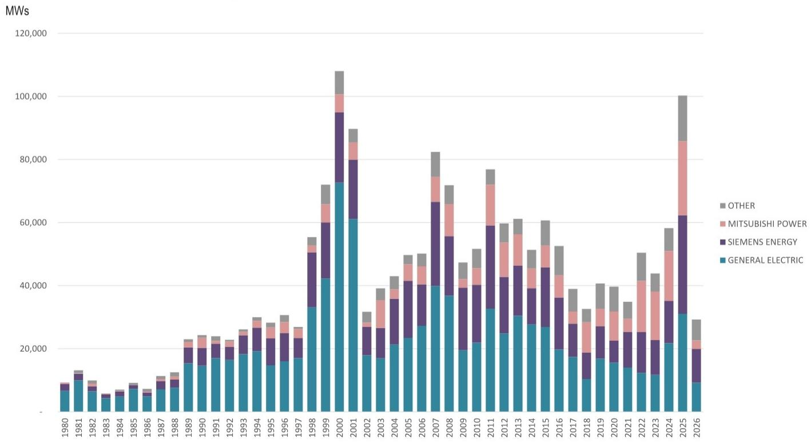

# 全球燃气轮机订单创纪录，但市场真正低估的不是需求，而是供给侧的再定价

2026年第一季度，全球燃气轮机订单达到约29GW，同比增长39%，创下历史同期最高纪录，也是历史第四高的单季度水平。这份来自某外资投行的最新研报揭示了一个核心事实：需求侧的数据已经足够亮眼，但真正值得投资者深入拆解的结构性变化，发生在供给侧。

市场对燃气轮机板块的关注，大多停留在AI数据中心带来的电力需求增长叙事上。但研报中一个容易被忽略的信号是：项目成本正在以远超预期的速度攀升。北美地区联合循环燃气轮机（CCGT）项目的单位造价中位数，从2025年完工的约900美元/kW，已经跃升至2031年完工项目的约2800-3000美元/kW，涨幅接近200%。这一数据比需求增长本身，更能定义未来几年的竞争格局。

## 1. 一季度订单的结构性亮点在于“超级订单”的涌现，而非总量本身

29GW的季度订单量确实创下纪录，但更值得关注的是订单结构的质变。从区域分布看，北美市场以约18.3GW的订单量继续主导全球，其中美国本土就贡献了约17.2GW。这一数据不仅延续了北美在过去三年中作为全球最大燃气轮机市场的地位，更表明AI数据中心的电力需求正在从“预期”加速转化为“实际订单”。

从订单规模来看，500MW以上的“超级订单”在一季度首次出现，达到2.3GW。这类订单的出现，意味着终端客户不再是传统的公用事业公司，而是拥有更强资本实力和更紧迫时间表的科技公司及其EPC伙伴。一个典型案例是韩国斗山重工在一季度录得创纪录的3.8GW订单，其中包含一个2.7GW的美国数据中心订单——这不仅是该公司历史上最大的单笔订单，也是美国市场历史上仅有的第三个燃气轮机订单。这个订单计划2029年出货、2030年投产，时间跨度之长本身就说明了供应链的紧张程度。

对于投资者而言，这意味着燃气轮机市场的增长叙事已经从“周期复苏”切换为“结构性扩张”。订单的体量和客户类型都在发生质变，传统的周期性框架已经不足以解释当前的市场动态。

## 2. 三大OEM的产能扩张计划正在改写竞争格局，但执行风险不可忽视

截至一季度，GE Vernova、西门子能源和三菱重工这三大OEM合计占据了约77%的订单份额。但真正决定未来竞争格局的，不是当前的市场份额，而是各家企业的产能扩张节奏。

研报给出的产能预估显示，到2028年全球OEM总产能将达到约85GW（以简单循环口径计算）。其中，GE Vernova计划到2028年将重型燃气轮机产能提升至约24GW，加上航改型机组后总产能约26GW；西门子能源的目标更为激进，计划从FY24的约17GW（联合循环口径）扩张至FY28-30的超过30GW；三菱重工则在已有的30%扩产目标基础上，CEO在2025年9月公开表示可能将制造吞吐量再提升约100%。

但这里存在一个关键的不确定性：产能扩张的节奏能否匹配订单的交货时间表。从图15的预期出货数据来看，三大OEM在2026-2027年的出货量已经基本排满，而2028年之后的订单交付压力正在快速积累。斗山重工那个2.7GW的订单要到2029年才出货，这本身就说明头部OEM的产能已经无法满足更早的交货需求。

对于投资者而言，这意味着OEM的议价能力正在发生根本性转变。当产能成为稀缺资源时，拥有更强扩产能力和更短交货周期的企业，将获得超越市场份额本身的定价权。

## 3. 项目成本飙升正在重塑整个产业链的价值分配，但研报尚未充分展开二阶效应

研报的北美天然气发电定价追踪器提供了可能是整份报告中最具洞察力的数据。CCGT项目的单位造价中位数，从2025年完工的约900美元/kW，已经攀升至2031年完工的约2800-3000美元/kW。简单循环机组的成本涨幅虽然相对温和，但2028年完工项目相比2025年也上涨了约50%。

这个数据意味着什么？首先，它表明供应链的紧张程度已经传导至终端项目成本。其次，也是更重要的，成本上升正在改变不同技术路线之间的相对竞争力。当CCGT项目的单位造价从900美元/kW升至3000美元/kW时，可再生能源+储能的成本竞争力相对提升，这可能会倒逼一些原本计划采用燃气轮机的项目转向其他方案。

但报告并未深入分析这个二阶效应。如果项目成本继续攀升，是否会导致部分订单被取消或延迟？这是投资者需要持续跟踪的关键变量。另一个未充分展开的问题是：成本上升的利润分配机制。在供应链紧张的背景下，OEM、EPC承包商和最终用户之间，谁将承担更多的成本压力？从当前的数据看，OEM似乎正在通过提价转移成本，但这一趋势能否持续，取决于2027-2028年新增产能的释放节奏。

## 4. 北美市场的“数据中心溢价”正在创造全新的竞争维度

北美市场在一季度占据了全球订单的约63%，这一比例在过去三年中持续上升。背后的驱动力毫无疑问是AI数据中心的电力需求。但研报揭示了一个更有趣的现象：数据中心的订单正在改变OEM的竞争策略。

以贝克休斯为例，该公司在一季度获得了来自Quanta Services的1.1GW订单，涉及60台Nova LT小型工业燃气轮机。这个订单的出货时间是2027年，投产时间是2029年。值得注意的是，贝克休斯在2025年全年也仅有约3.4GW的订单，而一个季度就拿到了1.1GW的数据中心订单。这说明数据中心客户正在成为小型工业燃气轮机市场的重要增量来源。

对于GE Vernova和西门子能源这样的头部OEM来说，数据中心订单同样在改变它们的订单结构。但一个尚未被充分讨论的问题是：数据中心对电力供应的可靠性要求极高，这意味着它们可能愿意为更短的交付周期和更高的服务质量支付溢价。这种“数据中心溢价”正在创造一个新的竞争维度——谁能更快地交付，谁就能获得更高的定价。

## 5. 一个尚未完全回答的关键问题：产能扩张的“天花板”在哪里？

研报给出了到2028年约85GW的全球产能预估，但同时也指出“存在进一步公告带来的上行空间”。这里需要追问的是：产能扩张的物理极限在哪里？燃气轮机的制造涉及复杂的供应链，包括高温合金、精密铸造、控制系统等关键零部件的供应。这些上游环节的产能扩张速度，可能远慢于OEM的组装产能扩张。

另一个限制因素是人才。燃气轮机的设计、制造和维护需要高度专业化的工程团队，而这类人才的培养周期往往需要5-10年。当整个行业都在快速扩张时，人才短缺可能会成为比产能更硬的约束。

研报中提到了GE Vernova“反复提及工厂效率提升带来增量产出”，这暗示着现有产能的利用率仍有提升空间。但这种提升是有限度的，当达到物理极限后，新增产能只能依赖新工厂的建设。而新建工厂的投资周期通常需要2-3年，这意味着2027-2028年的产能释放节奏，可能比市场预期的更为缓慢。

## 6. 投资者的观察框架：从“订单增速”转向“定价能力”

基于以上分析，对于关注燃气轮机产业链的投资者而言，传统的跟踪指标——订单增速、市场份额——已经不足以判断投资机会的优劣。更重要的观察框架应该围绕“定价能力”展开。

第一，关注各OEM的订单平均售价趋势。如果订单量增长的同时，售价也在提升，说明OEM正在将成本压力转嫁给客户，这是定价能力强的表现。反之，如果售价停滞或下降，则可能意味着竞争加剧侵蚀利润空间。

第二，跟踪项目成本与OEM售价之间的剪刀差。当前项目成本涨幅远超OEM的售价涨幅，这意味着EPC承包商和最终用户正在承担更多的成本压力。如果这种趋势持续，可能会抑制终端需求，进而反噬OEM的订单增长。

第三，关注产能扩张的执行进度。GE Vernova和西门子能源的扩产计划都已经公布，但实际执行中可能面临供应链瓶颈和人才短缺。任何产能扩张延迟的信号，都可能成为推动OEM股价进一步上涨的催化剂。

第四，留意非传统玩家的进入。斗山重工在美国市场的突破，以及贝克休斯在数据中心领域的斩获，都表明竞争格局正在发生变化。如果更多新玩家进入市场，可能会打破当前三大OEM的寡头格局，影响定价能力。

---

这份研报提供了大量值得深入拆解的数据和判断，但受限于篇幅，我们只能围绕“供给侧再定价”这一个核心逻辑展开。关于各OEM的具体产能扩张路径、区域市场的差异化分析、以及项目成本上涨对终端需求的潜在抑制效应，这些内容在完整报告中都有更详细的图表和讨论。欢迎来星球微信群里继续讨论这些未解问题，我们会在群内分享完整的研报原文和原始数据图表，并定期组织专题讨论。

Personal reading notes and learning share only. Not investment advice.

