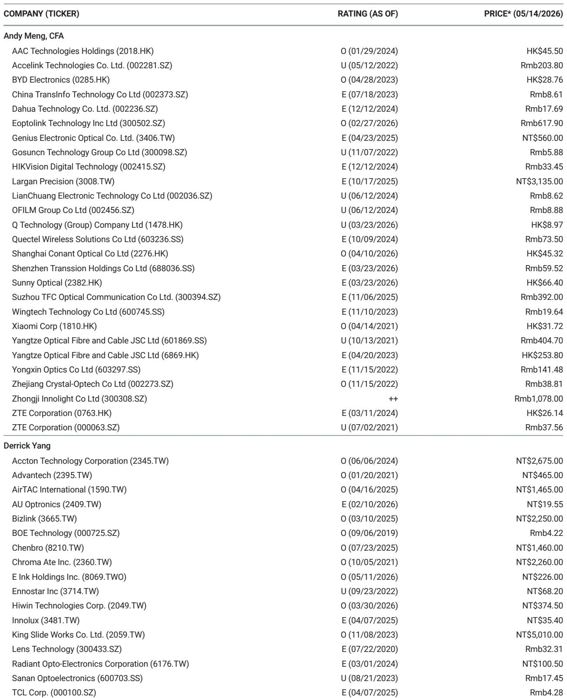

# 光模块市场真正被低估的不是需求增速，而是供给短缺的结构性溢价

当一家上游激光器公司说“未来两年内就会被订满到2028年”，市场通常的反应是去算还能增长多少倍。但这份最新研报揭示了一个更关键的信号：需求侧的超预期已经是共识，真正被定价不足的，是供给端持续短缺带来的议价权转移和行业格局重塑。

某外资投行在2026年4-5月密集上调了全球AI光模块出货预测，核心变化并非需求逻辑本身——AI数据中心建设、资本开支高增长这些驱动因素此前已被充分讨论——而是需求可见度在近几个月发生了质的飞跃。从Lumentum CEO的表态到Coherent、AOI、Fabrinet等多家公司的订单与产能更新，供应链传递出的信息高度一致：不是需求好不好，而是能不能造得出来。

该投行将2026年AI光模块出货预测从5300万只上调至7300万只，2027年从7100万只上调至1.41亿只，2028年从8000万只上调至1.5亿只。最剧烈的修正集中在2027-2028年的1.6T产品上，上调幅度超过200%。这意味着行业总市场规模将从2025年的180亿美元增长至2028年的约1020亿美元，三年翻四倍以上。

但比数字本身更值得追问的是：这种增长在产业链上如何分配？谁在真正受益？哪些风险被低估了？

## 1. 行业龙头的“售罄声明”暴露了比需求更紧的供给瓶颈

Lumentum CEO在2026年4月的原话值得逐字解读：“美国超大规模云厂商的资本开支数字巨大且看不到尽头。我们越来越跟不上需求。两个季度之内，我们就会把整个2028年的产能全部订满。”这家公司同时给出了一个惊人的长期指引：到2030年，InP光学通道需求量（包括EML、CW、UHP激光器）的年复合增长率约为85%。

这不是孤例。Coherent表示未来两年要将InP产能扩大100%以上，Sumitomo和Broadcom也宣布了大规模扩产计划。但问题是，即使所有厂商都在扩产，供给缺口依然巨大。Lumentum自己的产能模型显示，2026年其InP产能约为需求的一半，2027年缺口进一步扩大，直到2029年才能勉强接近平衡。

这意味着什么？光模块行业正在经历一个罕见的“卖方市场”阶段。通常，科技硬件产业链上拥有议价权的是下游云厂商，但当前上游激光器和光芯片的产能瓶颈如此之深，以至于供应商开始获得定价权。Lumentum在财报中已经展示了这种议价能力向利润率的传导。这是一个结构性变化，不是周期性的。

对于投资者而言，需要重新评估的不仅是光模块出货量，更是单位利润率的走向。当供给成为瓶颈时，拥有垂直整合能力和先进制程的供应商将获得超额利润，而纯粹组装型厂商可能面临成本挤压。

## 2. 1.6T的加速渗透正在重塑产品组合的价值结构

研报中最显著的上调发生在1.6T产品上。2027年1.6T出货预测从2400万只上调至7900万只，2028年从2700万只上调至8700万只，增幅均超过200%。相比之下，800G的上调幅度在20-30%之间。

这组数字背后是一个重要的产业判断：1.6T的渗透速度可能比市场此前预期的快得多。该投行预测，到2027年，1.6T出货量将超过800G，成为AI数据中心内部连接的主力产品。

为什么1.6T的加速如此重要？因为每一代产品的升级都伴随着ASP（平均销售价格）的大幅提升。1.6T光模块的单价通常是800G的2-3倍，且由于技术门槛更高，竞争格局更优，利润率也更丰厚。对于Eoptolink、Accelink等中国厂商而言，1.6T的放量意味着收入结构从“量增价稳”转向“量价齐升”。

但这里有一个尚未被充分讨论的问题：1.6T的技术路线尚未完全收敛。EML、硅光、薄膜铌酸锂等多种方案并存，不同客户的选择可能导致供应链格局的快速变化。谁能在1.6T时代占据主流生态位，将决定下一轮竞争的胜负。

## 3. 硅光技术的份额跃升可能比市场预期的更快

研报引用LightCounting的数据显示，硅光技术在光模块市场中的份额已从2018年的10%上升至2024年的33%，预计2026年将首次成为主导技术。研报团队认为，这既是硅光技术性能提升的结果，也是EML供应短缺的副产品——当传统方案供不应求时，客户更愿意尝试替代方案。

这一判断的产业含义值得深挖。硅光技术的加速渗透意味着传统InP方案的产能瓶颈正在倒逼技术路线切换，而这种切换一旦形成规模效应，可能不可逆。对于拥有硅光能力的厂商（如Intel、Cisco以及部分中国初创公司），这是一个弯道超车的机会。而对于依赖EML的传统供应商，如果扩产节奏跟不上需求增长，市场份额可能被侵蚀。

然而，硅光技术本身也面临挑战：良率、耦合效率、成本结构仍需持续优化。研报没有详细展开的是，硅光在不同速率等级（800G vs 1.6T vs 3.2T）中的渗透率差异可能很大，且不同客户的技术偏好也不一致。这个变量将直接影响各厂商的竞争格局。

## 4. 共封装光学（CPO）的冲击被高估了，至少在2028年之前

市场对CPO技术的关注度很高，部分投资者担心CPO会颠覆现有可插拔光模块的产业逻辑。但研报给出的判断相对冷静：CPO的规模化影响要到2028年之后才会显现。

该投行维持了此前对CPO的预测框架：基准情形下，CPO交换机出货量从2025年的4712台增长至2028年的约10.4万台；乐观情形下也仅为25万台。考虑到同期传统可插拔光模块的出货量将达到数亿只，CPO在2028年之前的渗透率仍然较低。

值得注意的是，英伟达在2026年5月对康宁的大额投资被市场解读为CPO加速的信号，但研报指出，这笔投资的大部分产能释放要等到2028年之后。换句话说，未来两三年内，可插拔光模块仍然是AI数据中心互联的主流方案，相关厂商的景气周期远未结束。

但这里有一个需要持续跟踪的变量：如果CPO的降本速度超出预期，或者3.2T时代的技术路线发生根本性变化，现有可插拔厂商的估值逻辑可能需要重估。研报没有完全回答的问题是：当CPO真正起量时，哪些现有厂商有能力转型，哪些会被颠覆？

## 5. 组件短缺是最大的上行风险，也是最大的下行风险

研报明确指出了当前产业链的核心矛盾：不是需求，而是供给。Fabrinet在财报电话会上的表述很有代表性：“如果没有供应限制，数据中心业务收入本可以创下新纪录。供应短缺涉及多个领域——激光器、存储芯片、特定ASIC，不是单一组件的问题。”

这种多组件同时短缺的状况在半导体行业历史上并不常见。通常，短缺集中在某个环节，但当前AI光模块面临的是激光器（EML/CW）、DSP芯片、高速存储等多个环节的同步紧张。这意味着即使某个环节的产能瓶颈被突破，整体供给恢复的速度也会受到木桶效应制约。

对于投资者而言，这意味着两个方向的投资机会：一是直接受益于涨价的稀缺产能持有者（如Lumentum、Coherent），二是能够通过技术差异化绕过供给瓶颈的厂商（如硅光方案提供商）。同时，这也意味着如果某个关键组件的扩产进度低于预期，整个行业的出货量可能低于当前乐观预测。

研报对比LightCounting的预测显示，该投行对2026年800G+1.6T出货量增速的预测超过200%，远高于LightCounting的65%。这种分歧本身就说明，市场对供给端恢复速度的假设存在巨大不确定性。这是当前最大的未解问题。

## 6. 重新理解这个产业的观察框架：从“量价模型”转向“稀缺性定价”

基于以上分析，我们认为投资者需要调整分析AI光模块产业的框架。传统的“量价模型”关注的是出货量增长和单价下降的平衡，但在当前阶段，这个框架已经不足以刻画产业的真实动态。

更有效的框架应该是“稀缺性定价模型”：核心变量不再是市场规模，而是供给缺口的大小和持续时间。当供给缺口持续扩大时，供应商获得定价权，利润率上升；当供给缺口开始收窄时，竞争加剧，利润率承压。因此，判断产业拐点的关键不是需求增速何时放缓，而是产能扩张何时追上需求。

从这个框架出发，以下几个信号值得持续跟踪：Lumentum、Coherent等厂商的产能扩张进度是否如期；EML和CW激光器的交货周期是否开始缩短；Fabrinet等代工厂的组件短缺描述是否出现缓解迹象。如果这些信号在未来两三个季度内发生方向性变化，当前的高增长预期可能需要重新校准。

---

这份研报最令人印象深刻的部分不是那些大幅上调的数字，而是隐藏在数字背后的产业逻辑转变：AI光模块行业正在从一个“跟随需求增长”的行业，转变为一个“供给决定天花板”的行业。这种转变意味着，谁拥有产能、谁掌握稀缺工艺、谁能率先突破瓶颈，谁就能获得超额回报。

但研报也留下了一些悬而未决的问题：硅光技术的渗透速度是否会因为EML短缺而进一步加速？CPO的拐点究竟何时到来？组件短缺何时会开始缓解？这些问题的答案，需要持续跟踪产业链动态才能逐步清晰。

欢迎来星球微信群继续讨论这些未解问题，我们会持续追踪Lumentum、Coherent、Eoptolink等关键公司的产能动态和技术路线变化，并在第一时间分享对产业格局的更新判断。

Personal reading notes and learning share only. Not investment advice.

