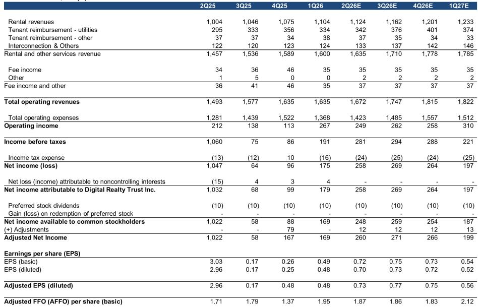
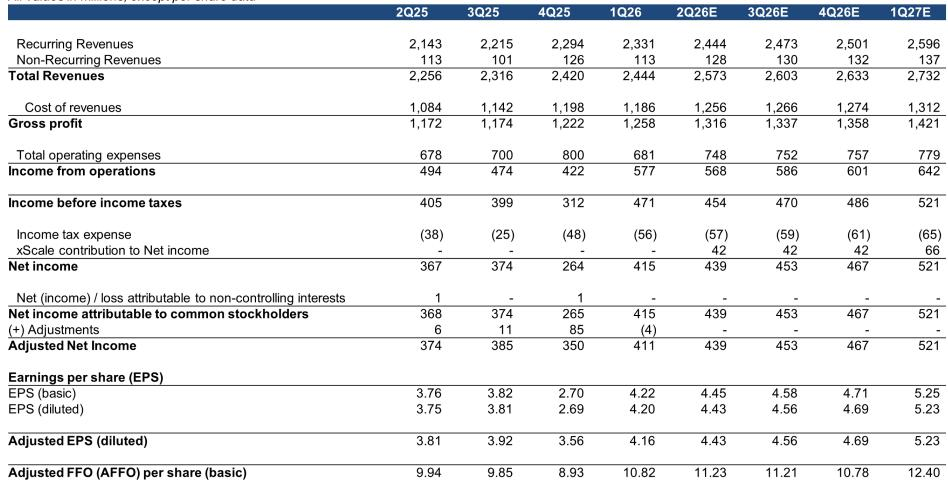

# 数据中心投资的地域分化：真正稀缺的不是容量，而是核心城市可建土地

当市场还在争论AI算力需求是否见顶时，一份某外资投行的最新研报揭示了另一个被低估的关键变量：数据中心市场的结构性分化正在重塑整个行业的竞争格局。这份研报的核心判断并非需求端的增长，而是供给端的地域质量差异——在Major Metro市场，现有容量和在建设施的价值正在被重新定价，这种定价权将集中在少数能够穿越长周期、应对复杂审批环境的头部运营商手中。

市场目前对数据中心股票的讨论大多停留在“AI驱动需求增长”这一单一叙事上，但真正值得投资者关注的，是不同地域市场之间日益扩大的结构性鸿沟。研报通过对比美国三大典型市场——北弗吉尼亚（NoVA）、凤凰城（Phoenix）和亚特兰大——清晰地展示了这一分化：NoVA的电力排队时间已长达7年，而凤凰城仅需3-5年；NoVA的建造单价高达每GW 12-15亿美元，而亚特兰大仅为9-12亿美元。这些差异并非简单的成本问题，而是决定了哪些公司能在未来3-5年持续交付、哪些公司可能被供应链瓶颈拖累。

## 1. 市场分层正在从“位置选择”演变为“准入门槛”

研报将美国数据中心市场划分为三个清晰的层次：Major Metro（核心都市区）、Minor Metro（次要都市区）和Rural（乡村市场）。这种分类并非简单的地理划分，而是基于三个核心变量的权衡：延迟敏感性、电力可用性和成本。

Major Metro市场（如NoVA、硅谷、达拉斯）是延迟敏感型推理任务和企业托管的首选地，其定价最高（超大规模客户每千瓦/月120-150美元，托管客户160-230美元），但同时也面临最长的电力排队时间（4-7年）和最高的建造成本（每GW 12-15亿美元）。这些市场的资本化率最低（超大规模4.5-6.0%，托管5.5-6.5%），反映出市场对其稳定现金流的认可。

Rural市场则完全相反：专注于大规模AI训练任务，电力可用时间仅需1-3年，建造成本仅为每GW 7-9亿美元，但定价也最低（70-120美元/千瓦/月），且缺乏托管业务。Minor Metro市场则处于中间地带，成为溢出需求的缓冲区。

这一分层的深层含义在于：Major Metro市场已经形成了实质性的“准入门槛”——不是资金门槛，而是时间门槛和监管门槛。对于新进入者而言，即便有充足的资本，也需要面对长达数年的电力审批和社区反对风险。这种结构性的稀缺性，使得现有玩家手中已获批准的土地和在建项目价值持续上升。

## 2. 北弗吉尼亚的定价权来自“不可复制性”

NoVA是美国最大的数据中心市场，现有容量约8GW，在建约5GW，电力排队时间已延长至7年。研报数据显示，NoVA的定价在过去几年持续上涨，目前已达到约217美元/千瓦/月，而空置率稳定在1%以下。这种定价能力并非来自需求的突然爆发，而是供给端结构性约束的结果。

NoVA的不可复制性体现在几个维度：首先，它是全球互联网交换的核心节点，拥有最密集的网络互连生态；其次，其电力基础设施和土地资源在经历了20多年的发展后，已形成了复杂的利益格局和社区关系；最后，当地政府对企业投资的审批流程日益严格，Digital Gateway项目（QTS和Compass）的最新进展就反映了这种监管不确定性。

对于Digital Realty（DLR）和Equinix（EQIX）而言，它们在NoVA的既有资产组合构成了最深的“护城河”。研报指出，这两家公司的资产主要集中在Major和Minor Metro市场，是“最不受市场噪音影响”的玩家。这意味着，当新进入者还在为电力审批和社区反对焦头烂额时，DLR和EQIX已经在利用其现有容量和已获批项目获取溢价。

## 3. 亚特兰大正在成为“下一个NoVA”的候选者

研报特别关注了DLR和EQIX在亚特兰大周边的超大规模数据中心建设项目。亚特兰大目前拥有约2GW容量，在建约3GW，定价为175美元/千瓦/月，空置率约2%。从增长轨迹看，亚特兰大在2024年下半年实现了706MW的净吸收量，远超同期NoVA的452MW和凤凰城的246MW。

亚特兰大的优势在于其“中间位置”：它既有Major Metro市场的网络密度和企业客户基础，又避免了NoVA那样的极端电力约束和社区反对。研报认为，DLR和EQIX在亚特兰大的战略布局是“明智的”——市场动态有利，两家公司都是经验丰富的建造者，拥有强大且成熟的团队，执行风险相对有限。

但这里有一个尚未完全回答的问题：亚特兰大能否真正复制NoVA的网络效应？NoVA的定价溢价很大程度上来自其作为互联网交换核心的地位，而亚特兰大目前更多是作为“溢出接收者”存在。如果亚特兰大无法在互连生态上达到NoVA的水平，其定价天花板可能会低于市场预期。

## 4. 超大规模客户的结构性权力正在改变市场游戏规则

研报提供的数据显示，在Top 8市场中，最大的现有供应商是亚马逊（2,792MW运营容量）、Meta（2,491MW）和谷歌（2,087MW），但未来扩张计划最激进的是微软（6,088MW未来容量）和亚马逊（5,047MW）。这些超大规模客户的扩张计划正在重塑市场的供需结构。

一个值得注意的趋势是：未来设施的平均规模正在急剧扩大。Top 8市场现有设施平均为27MW，而计划建设的设施平均达到112MW，是现有规模的4倍以上。这意味着，未来的数据中心市场将更加“机构化”——单个设施的资本密集度更高，对电力、土地和审批的要求更严格，这天然有利于资本雄厚、经验丰富的头部运营商。

但超大规模客户的议价能力也在增强。当微软和亚马逊各自规划5-6GW的新增容量时，它们对建造商的选择将更加挑剔，同时也会利用自身的规模优势压低价格。研报没有完全展开的风险在于：如果超大规模客户开始自建数据中心（如一些科技巨头已经在做的），传统REITs的中间人角色可能会被削弱。

## 5. 报告尚未完全回答的关键问题：NIMBYism和电力成本上升的连锁反应

研报提到，Major Metro市场的NIMBYism（“别在我后院”运动）正在加剧，特别是在NoVA和凤凰城，部分原因是电力成本上升。这是一个重要的“新兴风险”，但报告没有深入分析其可能的二阶影响。

电力成本上升可能从两个方向改变市场格局：一是进一步推高Major Metro市场的建造成本和运营成本，压缩现有玩家的利润率；二是加速需求向Minor Metro和Rural市场的迁移，改变整个市场的地域分布。如果后者成为主导趋势，那么目前集中在Major Metro的DLR和EQIX可能需要重新评估其资产组合的长期价值。

另一个未完全回答的问题是：Minor Metro市场的增长是否可持续？研报指出，Minor Metro市场在过去5年经历了显著增长，但这些市场的需求基础更多是“溢出需求”，而非原生需求。如果Major Metro市场的电力约束在未来3-5年内得到缓解（例如通过新的输电线路或核电重启），Minor Metro市场可能会面临需求收缩的风险。

## 6. 投资者需要建立的新观察框架：从“容量增长”转向“地域质量溢价”

基于以上分析，投资者在评估数据中心公司时，不应再简单比较“总容量”或“在建项目”，而应建立一套更精细的地域质量评估框架：

第一，关注公司在Major Metro市场的“已获批土地储备”和“在建项目进展”，而非仅仅是“计划容量”。在电力排队时间长达7年的市场，已获批的土地和在建项目才是真正的稀缺资源。

第二，评估公司在不同市场之间的“溢出策略”。DLR和EQIX在亚特兰大的布局值得关注，但投资者需要判断这种策略是“防御性溢出”（应对NoVA的产能瓶颈）还是“进攻性扩张”（发现新的定价洼地）。

第三，警惕超大规模客户“自建”趋势对传统REITs的长期威胁。如果微软和亚马逊继续扩大自建比例，那么依赖托管业务的Equinix可能面临更大的结构性挑战，而专注于批发租赁的Digital Realty则相对安全。

第四，关注电力成本和社区反对情绪的变化。这不仅是运营成本问题，更是影响未来项目审批进度的关键变量。在NoVA，社区反对已经导致部分项目延期，这种风险在凤凰城和亚特兰大也在上升。

---

这份研报通过扎实的数据和清晰的市场分层，揭示了数据中心投资中一个被忽视的关键维度：真正稀缺的不是市场需求，而是核心城市中可建设、可通电、可运营的土地。DLR和EQIX之所以被看好，不是因为它们拥有最多的容量，而是因为它们拥有最优质的地域资产组合。

但正如我们所讨论的，这份研报也留下了一些值得继续深挖的问题：Minor Metro市场的增长能否持续？超大规模客户的自建趋势是否会改变行业结构？电力成本上升会如何重塑市场格局？这些问题并非研报的缺陷，而是深度研究必然留下的思考空间。

如果你对这些未解问题感兴趣，欢迎来星球微信群里继续讨论。我们会围绕这些话题做进一步的拆解和推演，结合更多一手数据和分析框架，帮助大家建立更完整的投资判断。

Personal reading notes and learning share only. Not investment advice.

