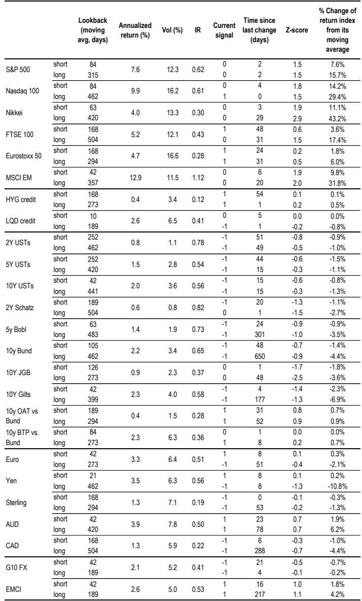
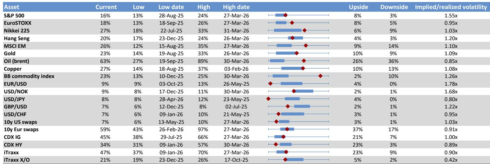

# 4100亿美元被动买入不是风险，而是市场正在为AI巨头的上市重新定价流动性

市场对三大AI独角兽IPO的讨论，大多集中在估值、估值倍数和创始人的财富效应上。但真正值得关注的，不是它们能融多少钱，而是它们上市后，将如何重塑全球股票市场的供需结构、指数权重以及被动资金的配置路径。

某外资投行最新发布的Flows & Liquidity报告，给出了一个关键的定量判断：一旦锁定期结束，这三大AI公司进入指数，将带来总计约4100亿美元的被动买入需求。这个数字本身并不令人惊讶，真正值得追问的是：这4100亿美元从哪里来？谁会为这些买单？以及，它对现有市场结构意味着什么？

这份报告的价值不在于预测股价，而在于提供了一个分析框架——当市场迎来历史上规模最大的IPO集群时，资金流动的逻辑将如何被重写。

## 1. 锁定期后的自由流通股跳升，本质是指数编制商的机械重分类，而非内幕抛售

市场上有一个普遍的担忧：IPO锁定期一过，大量内部人持股解禁，会引发抛售潮，压制股价。这份报告通过对2010年以来十大IPO（包括Meta、Uber、Rivian、Airbnb、Snowflake等）的历史数据回测，给出了一个反直觉的结论。

数据显示，锁定期结束后，自由流通股比例确实会出现一个明显的跳升——从上市初期的平均45%左右，在锁定期结束后的几个月内迅速升至75%以上。但报告指出，这个跳升“并不是内部人或其他股东抛售的结果”，而是一个“机械性”的指数重分类效应。

原因在于，一旦锁定期结束，那些持股比例低于10%的非战略投资者、以及未被归类为内部人的员工持股，无论他们是否真的卖出，都会被指数编制商计入自由流通股。这本质上是一个“标签”的变化，而不是真实的供给冲击。

这个判断对投资者的含义是：不要因为看到锁定期后自由流通股比例大幅上升，就认为市场将面临巨大的抛压。真正需要关注的，是内部人持股的真实变化趋势——而历史数据显示，内部人持股在IPO后一年内的下降幅度相当温和，平均仅从6.9%降至5.3%左右。

但这并不等于说完全没有供给压力。报告特别指出，三大AI公司的资本结构存在显著异质性——从历史案例来看，自由流通股比例可以从10%到90%不等。这意味着，我们无法简单套用历史均值来预测这三家公司的具体表现。这里仍需验证的，是它们各自的锁定期安排、战略投资者结构以及创始人持股意愿。

## 2. 4100亿美元被动买入的实际消化路径，取决于公司回购和非战略投资者的配合

报告的核心测算基于一个关键假设：三大AI公司上市时的总市值约为3.5万亿美元。如果上市初期自由流通股比例仅为4%，那么初始纳入指数将带来约400亿美元的被动再平衡需求。而锁定期结束后，假设自由流通股比例升至30%-50%区间的中位数40%，将再产生370亿美元的额外需求，累计达到4100亿美元。

这个数字听起来惊人，但报告指出，这4100亿美元并非凭空产生的“增量资金”，而是可以通过两种方式被消化：一是公司自身释放此前回购的股份，二是非战略投资者将股份卖给被动基金。

这里的关键洞察是：被动基金的买入行为，本质上是“需求跟随供给”的。当指数将新公司纳入时，被动基金必须按权重买入，但卖出的对手方可以是公司自己（通过回购注销再释放库存股），也可以是那些在锁定期前就通过结构化要约或二级市场交易获得股份的非战略投资者。

报告还提到，这些非战略投资者在上市前可能已经通过“结构化要约收购”或“二级市场交易”出售了部分股份，尽管这些二级市场的容量可能有限。而公司本身也可能在上市前回购部分股份，以便在锁定期后释放这些持股来满足被动需求。

这意味着，4100亿美元并不是一个需要市场额外“掏钱”的增量资金，而是一个被预先安排好的资金流转路径。真正的问题在于：这个流转路径是否顺畅？如果公司自身回购不足，或者非战略投资者不愿意在锁定期后卖出，那么被动基金的买入就可能面临供给不足的局面，从而推高股价。

## 3. 指数再平衡的真正输家不是Mag7，而是那些被替换的公司

市场通常认为，三大AI公司纳入指数，最大的受害者是Mag7——因为它们的权重会被稀释。但报告给出了一个更微妙的判断：这种权重稀释“不一定导致被动基金实际卖出Mag7股票”。

逻辑在于，过去几年被动股票基金一直呈现稳定且强劲的资金净流入。如果这种趋势持续，那么被动基金可以用新增流入的资金来配置新纳入的公司，而不需要卖出现有持仓。换句话说，只要资金流入足够大，权重稀释只是一个数学上的调整，而不是一个交易行为上的抛售。

真正需要关注的，是那些被替换出指数的公司。任何指数纳入新公司，都必须有相应的公司被剔除。这些被剔除的公司将面临被动基金的“真实卖出”——因为指数基金必须卖出它们才能腾出资金买入新公司。而这些被剔除的公司，往往不是Mag7那样的超级大盘股，而是市值较小、流动性较差的股票。

对投资者而言，这意味着：与其担忧Mag7的下跌，不如去研究哪些公司可能被替换出主要指数。这些“被牺牲”的股票，可能会在指数调整前后经历一次非基本面驱动的抛售，从而创造短期交易机会或风险。

## 4. 历史经验显示，纳斯达克的自由流通股比例将在短期内再次下降，但长期趋势是趋同于标普500

报告提供了另一组有趣的历史数据：纳斯达克综合指数的自由流通股比例，从2020年到2021年曾出现显著下降——从91.5%降至约91.8%的区间内波动，但实际在2020-2021年期间，由于科技IPO和SPAC热潮，大量新上市公司带着高比例的创始人持股和PE/VC持股进入市场，导致整体自由流通股比例下降。

从2022年到2024年，这一趋势逆转——锁定期到期、创始人向机构投资者出售股份、战略投资者持股被重新分类或出售，加上IPO活动枯竭，使得自由流通股比例回升。

报告预测，三大AI公司以“加速时间表”纳入指数，可能会再次导致指数层面的自由流通股比例下降——因为这些新公司进入指数时的自由流通股比例，将远低于当前指数的平均水平。

但长期来看，纳斯达克自由流通股比例一直在向标普500靠拢。这反映了一个结构性的趋势：随着科技行业逐渐成熟、机构化程度提高，以及标普500本身越来越“科技化”，两个指数的自由流通股结构正在趋同。

这个趋势对投资者的含义是：短期内的自由流通股比例下降可能带来流动性压力和波动率上升，但长期来看，这是一个正常的“成熟化”过程。真正需要关注的是，这三大AI公司的加入，是否会加速或改变这一趋同路径。

## 5. 报告尚未完全回答的关键问题：4100亿美元假设中的自由流通股比例和锁定期安排，仍存在重大不确定性

尽管报告的分析框架极具参考价值，但我们必须承认，其中存在几个关键假设尚未得到验证。

第一，自由流通股比例的假设。报告假设锁定期后自由流通股比例升至30%-50%，取中位数40%。但历史数据显示，不同公司的自由流通股比例差异极大——从Meta的95%到Lyft的10%不等。三大AI公司的资本结构、创始人持股意愿以及战略投资者安排，将决定它们最终落在哪个区间。如果实际比例低于30%，那么4100亿美元的被动需求可能被高估；如果高于50%，则可能被低估。

第二，锁定期安排。报告假设锁定期为6个月，但实际中，不同公司的锁定期安排可能不同，甚至可能存在“阶梯式”解锁。如果解锁时间被拉长，那么被动需求的释放也将被拉长，从而改变市场节奏。

第三，被动基金资金流入的持续性。报告的核心假设之一是“过去几年被动股票基金的强劲和稳定流入将继续”。但在当前利率环境、地缘政治风险以及市场估值偏高的背景下，这一假设能否成立，仍需要持续观察。如果被动基金流入放缓甚至逆转，那么指数再平衡就可能演变为真实的抛售压力。

这些不确定性，正是我们需要在完整报告中进一步拆解的地方。报告本身提供了丰富的图表数据和历史对比，但二阶效应——比如对衍生品市场、对冲基金仓位以及跨资产流动的影响——并未充分展开。

---

对于这些尚未完全回答的问题——自由流通股比例的真实分布、锁定期安排的多样性、以及被动资金流入的可持续性——我们已经在星球微信群里展开了深度讨论。如果你对如何从这些不确定性中构建投资框架感兴趣，欢迎来群里继续交流。我们会持续跟踪三大AI公司的IPO进展，并在关键节点更新我们的判断。

Personal reading notes and learning share only. Not investment advice.

