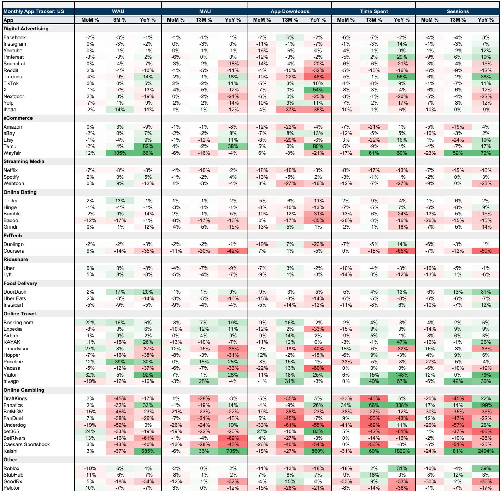

# AI Infrastructure Spending Is Creating a Valuation Paradox That Only Revenue Conversion Can Resolve

The first-quarter earnings season for major internet platforms has delivered a clear and uncomfortable message: the market is simultaneously rewarding massive capital expenditure while punishing any uncertainty about the return on that spending. This tension is not a temporary anomaly but a structural shift in how investors must evaluate technology companies going forward. The combined cloud backlog for Google Cloud and Amazon Web Services has surged to approximately $832 billion, up from $358 billion just six months ago, yet the very companies reporting this demand explosion are seeing their stocks trade with heightened volatility and, in many cases, negative year-to-date performance. The disconnect between what the data says about future revenue and what the market prices today has rarely been wider.

The core issue is not whether AI will generate returns. The evidence that it will is overwhelming. The backlog numbers alone demonstrate that enterprises are committing to cloud and AI infrastructure at an unprecedented pace. The problem is timing, visibility, and the growing gap between GAAP operating income margins and free cash flow. When hyperscalers report strong revenue beats but simultaneously raise their 2027 capital expenditure estimates from roughly $586 billion to approximately $700 billion, investors face a mathematical puzzle: how much of today's spending will translate into tomorrow's free cash flow, and when will that translation occur?

What makes this earnings season particularly significant is that the market has begun to differentiate sharply between companies that can articulate a clear pathway from capex to returns and those that cannot. Google and Amazon, which provided specific commentary on backlog conversion and custom silicon margins, saw their stocks perform relatively well. Meta, which remains more open-ended about the return profile of its AI investments, has become the most debated large-cap name in the coverage universe. This divergence is not about which company has the better technology. It is about which management team has earned the market's trust on capital allocation.

The digital consumer side of the equation presents a different but equally important challenge. Consumer-facing platforms generally reported positive trends across commerce, travel, mobility, and delivery. Yet the market is already discounting these results, fearing that the bifurcated consumer landscape—where digital platforms have been disproportionate beneficiaries—may not sustain as we move deeper into 2026. The question is not whether the consumer is strong today, but whether the consensus view of consumer strength has already been priced in, leaving only downside surprises as the next catalyst.

## The $700 Billion Question Is Not About the Size of Capex but About the Slope of Revenue Recognition

The most striking data point from this earnings season is the sheer acceleration in committed backlog. Six months ago, the combined cloud backlog for Google Cloud and AWS stood at $358 billion. Today it is $832 billion. That is not incremental growth; it is a step-function change that signals a fundamental imbalance between AI demand and available compute supply. Based on industry work, this imbalance is unlikely to reach any sort of equilibrium until well into the second half of 2027 at the earliest.

The strategic implication is straightforward but often misunderstood. The backlog is not a cost; it is a forward revenue indicator. Every dollar in that backlog represents a contractual commitment from an enterprise customer to consume cloud and AI services. The challenge is that converting backlog into recognized revenue requires bringing compute capacity online, which in turn requires the very capital expenditure that investors are currently penalizing. The market is treating capex as a drag on returns when it should be treating it as a prerequisite for revenue growth.

This creates a natural tension in how investors should evaluate the hyperscalers. On one hand, the backlog data argues for higher revenue estimates and higher valuations. On the other hand, the rising capex trajectory argues for lower free cash flow in the near term. The resolution of this tension depends entirely on the rate at which backlog converts to revenue relative to the rate at which capex converts to depreciation. Companies that can demonstrate faster revenue conversion relative to depreciation growth will be rewarded. Those that cannot will continue to face valuation compression.

The practical question for investors is whether the current market pricing already reflects this tension or whether further de-rating is likely. Given that the coverage universe has already de-rated year-to-date, it is plausible that some of the uncertainty is priced in. Historical patterns suggest that positive estimate revisions in forward operating income, whether driven by cost efficiencies or moderating investments, typically signal increased investor confidence and lead to both estimate revisions and higher valuation multiples. The key is identifying which companies are closest to that inflection point.

## Digital Consumer Strength Is Real, but the Market Is Already Looking Past It to a Potential Slowdown

Consumer-facing internet platforms reported a broadly positive earnings season. Digital commerce, online travel, mobility, and delivery all showed healthy demand trends. User growth and engagement remain robust, supported by short-form video, connected television, and AI-driven features such as chatbots and assistants. Yet the market's reaction has been muted, and in some cases negative, because the forward-looking debate has already shifted from current performance to potential deterioration.

The concern centers on the bifurcated consumer landscape. Digital platforms have been disproportionate beneficiaries of consumer spending, partly because of structural shifts in behavior and partly because of relative value propositions. However, if consumer wallet input costs remain elevated, the question is whether this digital advantage can persist. Companies outside the internet coverage universe have begun to flag more mixed consumer discretionary behavior, and the risk is that forward commentary from digital platforms may eventually prove disappointing.

What makes this debate analytically difficult is that there is no clear data point yet to justify a forecast change. Industry channel checks for the current quarter are still in early stages, and the information available does not yet support altering existing estimates. This creates a classic asymmetry: the market is pricing in a potential downside that has not yet materialized, which means that if consumer trends remain stable, there could be upside surprises. Conversely, if the slowdown does materialize, the stocks have already de-rated partially in anticipation.

The strategic takeaway is that investors should focus on platforms with structural competitive advantages that would persist even in a weaker consumer environment. Companies with strong sUBScription revenue, high switching costs, or dominant positions in essential services are better positioned to weather a downturn than those reliant on discretionary advertising or transactional revenue. The current market pricing does not fully differentiate between these categories, creating potential opportunities for selective positioning.

## The Return Profile Debate Is Driving a Wedge Between Companies That Can Articulate a Path and Those That Cannot

A recurring theme across this earnings season was the market's reaction to companies that flagged 2026 as a year of growth investments over margin optimization, cited changing compute costs due to the rise of the token economy, or outlined platform changes such as age verification initiatives. These announcements were met with skepticism because they introduced uncertainty into financial trajectories that had previously been predictable.

The market's response to Meta is the clearest example. Meta has become the most debated stock in the coverage universe, with investor conversations focused almost entirely on the scaling of capital needs against AI ambitions. The core business—the Family of Apps anchored around social connectivity, media engagement, and advertising—continues to show strong growth. Yet the stock has underperformed because the market cannot see a clear pathway from Reality Labs and AI infrastructure investments to returns.

This dynamic is not unique to Meta. Any company that asks investors to accept near-term margin compression in exchange for long-term strategic positioning faces the same challenge. The market is demanding visibility, and companies that cannot provide it are being penalized regardless of the quality of their underlying business.

The counterargument is that this skepticism creates opportunity. Historical patterns show that periods of significant investment, when the return profile is unclear, are often the best times to build positions. The key is identifying which investments are truly strategic and which are speculative. Investments in cloud infrastructure, custom silicon, and AI-driven advertising platforms have clear precedents for generating returns. Investments in unproven hardware or speculative consumer AI applications carry more risk.

## The Report Does Not Fully Answer How the Market Will Price the Trade-Off Between Backlog Growth and Free Cash Flow Compression

One of the most important analytical gaps in the current debate is the absence of a clear framework for valuing companies that are simultaneously experiencing record backlog growth and record capex. The traditional valuation metrics—price-to-earnings, enterprise value-to-EBITDA, price-to-free cash flow—all break down when applied to companies in the middle of a massive infrastructure buildout.

The report provides the raw data: backlog at $832 billion, capex estimates raised to approximately $700 billion for 2027, and a clear statement that the demand-supply imbalance will persist until at least the second half of 2027. What it does not provide is a model for how to weight these competing forces. Should investors value backlog at the same multiple as recognized revenue? Should capex be treated as an investment with a defined return horizon or as a drag on current returns? The answer is not obvious, and different analysts will reach different conclusions.

This ambiguity is likely to persist for at least the next several quarters. The market will need to see actual revenue conversion from the backlog before it can confidently re-rate these stocks. Until then, volatility will remain elevated, and the debate will continue to be driven by incremental data points rather than a settled consensus.

## A Decision Framework for Navigating the AI Infrastructure Investment Cycle

For investors trying to position themselves in this environment, a structured decision framework is essential. The following questions can help differentiate between companies that are likely to emerge stronger from the current investment cycle and those that may face persistent headwinds.

First, assess the visibility of revenue conversion. Companies that can demonstrate a clear pipeline from backlog to recognized revenue, with specific timelines and margin expectations, are better positioned than those that offer only qualitative commentary. Google and Amazon have provided this visibility through their cloud segments. Meta has not, which explains its relative underperformance.

Second, evaluate the relationship between capex and competitive advantage. Investments that create proprietary assets—custom silicon, unique data sets, or exclusive distribution channels—are more valuable than investments in commoditized infrastructure. The market has rewarded Google's custom silicon efforts and Amazon's AWS platform services precisely because these investments create durable competitive advantages.

Third, consider the offset mechanisms. Companies that can offset higher capex through operating efficiencies, such as automation or economies of scale, are more likely to maintain margin stability. The report notes that companies able to discuss the relative protection of non-AI inputs on operating margins were better received by the market.

Fourth, analyze the competitive dynamics of the end market. Platforms with dominant market share in growing categories, such as digital advertising or cloud computing, have more pricing power and are better able to absorb investment costs. Smaller or sub-scaled platforms face greater risk if the investment cycle extends longer than expected.

Finally, monitor the signal of estimate revisions. Historical evidence suggests that positive revisions to forward operating income, whether from cost efficiencies or moderating investments, typically lead to increased investor confidence and higher valuations. The companies closest to this inflection point are likely to offer the best risk-reward profiles.

## The Full Report Contains the Data and Charts That Make These Debates Actionable

The analysis above draws on the key themes and data points from the first-quarter earnings review, but the full report contains the specific charts, company-level breakdowns, and detailed financial models that allow investors to translate these insights into portfolio decisions. The exhibit on digital advertising performance, the breakdown of capex estimates by company, and the comparative analysis of backlog conversion rates are essential tools for anyone trying to navigate this environment.

The report also includes proprietary industry work on the agentic economy, autonomous vehicles, and the evolving local commerce landscape that provides context for the longer-term investment thesis. These are not abstract concepts; they are the structural trends that will determine which companies compound and which companies get disrupted.

Join the community to read the full report and review the original charts.

*This article is for learning and discussion only and does not constitute investment advice.*

Personal reading notes and learning share only. Not investment advice.

