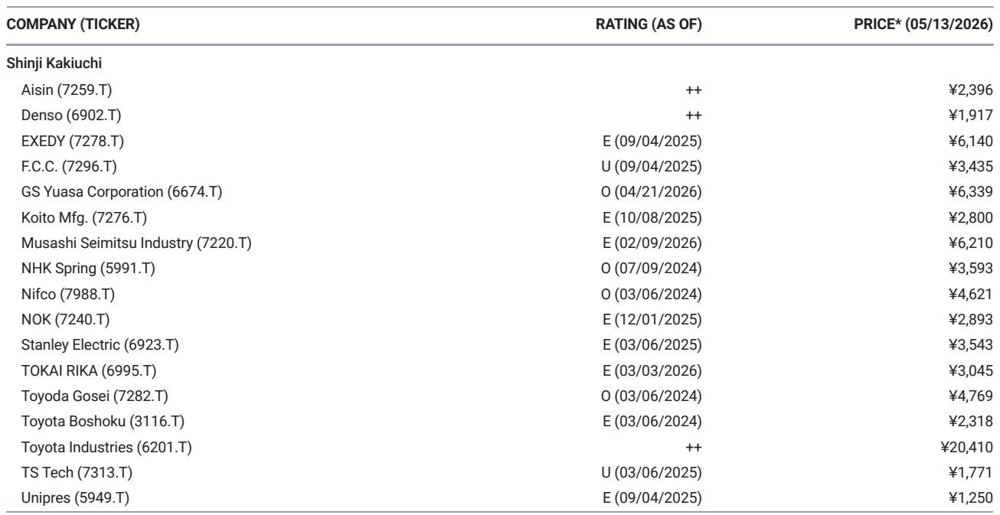

# Japanese Auto Parts Suppliers Face a Structural Revenue Squeeze in China, Not Just a Cyclical Dip

The April 2026 sales figures from Japanese OEMs in China are not merely a bad month. They represent a confirmation that the structural decline of the Japanese automotive franchise in the world's largest vehicle market is accelerating, and that the downstream consequences for the Japanese auto parts supply chain are more profound than a simple volume adjustment. Toyota's 25% year-on-year drop, Honda's 48% plunge, and Nissan's 31% collapse in April are not outliers; they are the logical endpoint of a multi-year erosion of market share that has now reached a critical velocity. For the auto parts industry, the implication is clear: the era of relying on Japanese OEM production volumes in China as a stable revenue base is over. The strategic question is no longer whether the downturn will continue, but how deep the structural damage runs and what levers remain for suppliers to defend their profitability.

The narrative that this is simply a cyclical downturn in Chinese domestic demand is incomplete and potentially dangerous for investors. While it is true that the overall Chinese vehicle market has softened, the magnitude of the decline for Japanese brands far exceeds the market average. This is a share loss problem, not just a volume problem. Japanese OEMs are being outcompeted on two fronts simultaneously: by the rapid advancement of domestic Chinese EV and PHEV manufacturers who offer superior technology at competitive prices, and by the acceleration of the Chinese consumer preference shift away from legacy joint venture brands. The data from January to April 2026, showing Toyota down 10%, Honda down 28%, and Nissan down only 3.3% on a cumulative basis, masks the severity of the April collapse and suggests that the second quarter will be materially worse for the entire supply chain.

For the auto parts suppliers that have built significant manufacturing capacity in China to serve these OEMs, the implications are twofold. First, near-term production volumes will be lower than guided, forcing a reassessment of fixed cost absorption and capacity utilization. Second, and more critically, the strategic rationale for maintaining large-scale China operations dedicated to Japanese OEMs is being undermined. The suppliers that will navigate this period most effectively are those that treat the current situation not as a temporary headwind to be waited out, but as a catalyst for a fundamental restructuring of their China strategy.

## The April Sales Collapse Confirms That the Downtrend Is Structural, Not Seasonal

The most important takeaway from the April data is the confirmation of a pattern that has been building for over two years. The monthly sales trajectory for the three major Japanese OEMs in China shows a clear and persistent downward trend that began to steepen in late 2025 and has now accelerated dramatically. The 48% year-on-year decline for Honda is particularly striking, as it represents a near-halving of monthly sales volume. Nissan's 31% drop is equally concerning, given that the company had already been struggling with a much smaller base. Even Toyota, which had managed to hold up relatively better than its peers through 2024 and early 2025, has now joined the downward spiral with a 25% decline.

What makes this structural rather than cyclical is the nature of the competitive dynamics. The Chinese market is not simply contracting; it is being reshaped by domestic champions like BYD, Geely, and a host of new energy vehicle startups that are capturing the imagination of Chinese consumers. These companies are not only winning in the EV segment but are also eroding the traditional internal combustion engine market through aggressive pricing and feature-rich offerings. Japanese OEMs, which have been slower to transition to EVs and have relied heavily on hybrid technology and brand loyalty, are losing ground on both fronts. The April data suggests that the rate of share loss is accelerating, which implies that the volume assumptions baked into the full-year guidance of parts suppliers may be too optimistic.

The implication for investors is that any earnings model for Japanese auto parts companies that assumes a stabilization or modest recovery in Chinese production volumes is likely to be proven wrong. The decline is feeding on itself: as sales fall, dealer margins compress, brand perception weakens, and the ability to invest in new models or marketing diminishes. This is a vicious cycle, not a mean-reverting process.

## Supplier Guidance for Fiscal 2027 Already Looks Optimistic Against the April Data

A critical analytical exercise is to compare the April sales reality with the production assumptions that major auto parts companies have embedded in their fiscal year 2027 guidance. The report highlights two specific examples: Koito Manufacturing assumes Japanese OEM China output will decline by only 4% year-on-year, and Toyota Boshoku assumes China seat production will fall by 8%. Against the backdrop of April sales declining by 25% to 48%, these guidance assumptions appear dangerously optimistic.

The disconnect arises because guidance is typically set based on a combination of OEM production plans, contractually committed volumes, and management's view of the market trajectory. However, the speed of the deterioration in April suggests that the OEMs themselves may be revising their production schedules downward faster than the parts suppliers can adjust their forecasts. If the April trend persists, the full-year decline in Japanese OEM China production could easily exceed 15% to 20%, which would be two to five times worse than the assumptions used by Koito and Toyota Boshoku.

The "so what" for the auto parts sector is that revenue guidance for the China segment is likely to be missed, and the magnitude of the miss could be significant. For companies with high fixed costs and dedicated China plants, this translates directly into margin compression. The ability to flex capacity, reduce labor costs, or shift production to other customers will determine the degree of earnings downside. Suppliers that have already been rationalizing their China operations are better positioned, but the April data suggests that the pace of rationalization may need to accelerate.

## The Export Diversification Narrative Offers No Near-Term Relief for Japanese Parts Suppliers

One of the arguments that has been used to temper bearish views on Japanese auto parts companies is that while domestic demand in China is weak, the volume of vehicles exported from China is increasing. The logic is that Chinese-made vehicles, including those from joint ventures, are being shipped to other markets, which could support parts demand. The report explicitly states that while exports are increasing, there is no impact on Japanese companies at this stage. This is a crucial clarification.

The reason is structural. The vehicles being exported from China are predominantly from domestic Chinese brands or from global OEMs that have established China as an export hub for their own models. Japanese OEMs have not, to any meaningful degree, used their China joint ventures as export platforms for vehicles sold in other regions. Therefore, the growth in Chinese vehicle exports does not translate into incremental demand for Japanese auto parts suppliers. Their production volumes are tied almost exclusively to the domestic sales of Japanese-branded vehicles in China, which are falling.

Furthermore, even if Japanese OEMs were to shift toward exporting from China, the parts supply chain would likely need to be reconfigured. Local Chinese suppliers would be the natural beneficiaries of any such shift, as they are already embedded in the domestic supply chains and offer cost advantages. Japanese parts suppliers would face the same competitive pressures in an export scenario as they do in the domestic market. The export narrative, therefore, is not a safety valve for the Japanese auto parts industry. It is a distraction from the core problem: the Japanese OEM franchise in China is shrinking, and the parts suppliers are directly exposed.

## The Unresolved Question: Can Japanese Parts Suppliers Win Business from Chinese OEMs to Offset the Loss?

The report identifies the key structural challenges for Japanese auto parts companies: responding to price competition from local Chinese parts suppliers and improving development speed. These are not new challenges, but the April sales data makes them more urgent. The critical question that the report does not fully answer is whether Japanese parts suppliers can successfully pivot to become suppliers to Chinese OEMs, thereby diversifying their customer base and offsetting the decline in business from Japanese OEMs.

This is a difficult strategic pivot for several reasons. First, Japanese parts suppliers have historically been tightly integrated with their keiretsu relationships, with long-term contracts and deep engineering collaboration. Chinese OEMs, by contrast, demand faster development cycles, lower prices, and greater willingness to share intellectual property. The cultural and operational mismatch is significant. Second, Chinese OEMs are increasingly developing their own in-house capabilities for key components, particularly in the EV powertrain and battery systems, which reduces the addressable market for external suppliers. Third, the price competition from local Chinese parts suppliers is intense, and Japanese suppliers often struggle to match the cost structures of their Chinese competitors while maintaining their quality and reliability standards.

The report leaves open the question of whether any Japanese auto parts company has successfully made this transition at scale. The evidence so far suggests that progress has been limited. For investors, this is the most important analytical question to monitor. If a major Japanese parts supplier can demonstrate that it is winning meaningful business from a top-tier Chinese OEM, it would signal a potential path to recovery. Without such evidence, the China operations of Japanese parts suppliers should be viewed as a declining asset that requires ongoing restructuring rather than a source of growth.

## A Decision Framework for Investors: Three Levers to Evaluate in a Declining China Market

Given the structural nature of the decline, investors need a clear framework to differentiate among Japanese auto parts companies. The following three levers provide a basis for evaluation:

**Lever One: China Revenue Exposure and Customer Concentration.** The first step is to quantify how much of a company's revenue and profit is derived from Japanese OEM production in China. Companies with high exposure and limited customer diversification face the greatest downside risk. However, exposure alone is not the full story. The ability to shift production to other regions or to serve non-Japanese customers in China is a critical mitigating factor. Investors should look for companies that have already begun to diversify their China customer base, even if the scale is small.

**Lever Two: Fixed Cost Structure and Rationalization Flexibility.** The second lever is the company's ability to reduce costs in China without destroying long-term value. This includes the ability to reduce headcount, sublease or repurpose factory space, and renegotiate supply contracts. Companies that have already taken proactive steps to rationalize their China operations, such as closing underutilized plants or consolidating production, are better positioned than those that are waiting for volumes to recover. The guidance from Koito and Toyota Boshoku suggests that many companies are still assuming a relatively mild decline, which implies that they may not have aggressive rationalization plans in place.

**Lever Three: Technology Differentiation and EV Relevance.** The third lever is the extent to which a company's products are relevant to the EV platforms being developed by Chinese OEMs. Components that are unique to internal combustion engine vehicles, such as fuel systems, exhaust systems, and certain transmission components, face structural obsolescence. Conversely, components that are platform-agnostic or critical to EVs, such as thermal management systems, sensors, and lightweight materials, offer a potential path to new business. The challenge is that even for these components, Japanese suppliers face intense competition from local Chinese firms that are often faster and cheaper.

Using this framework, investors can categorize auto parts companies into three groups: those with high exposure, high fixed costs, and low EV relevance (highest risk); those with moderate exposure and some ability to adapt (medium risk); and those with low exposure or a clear path to winning Chinese OEM business (lower risk). The April sales data suggests that the majority of Japanese auto parts companies fall into the first two categories.

Join the community to read the full report and review the original charts.

*This article is for learning and discussion only and does not constitute investment advice.*

Personal reading notes and learning share only. Not investment advice.

