# Japan banking sector monthly: May 2026

EQUITY: JAPAN BANKS

# Bank stocks seesawing on speculation about BOJ monetary policy

Bank stocks underperformed the TOPIX by 1.7ppt over the past month

# Investment perspective

Bank stocks recovered somewhat from the second half of March through mid-April as equity markets priced in a temporary easing of the situation in the Middle East and expectations were rekindled for a BOJ rate hike in April. However, bank stocks fell through late April even as AI-related stocks rose globally, as expectations for a rate hike at the April monetary policy meeting receded from mid-month following comments by Minister of Finance Satsuki Katayama on 15 April that the BOJ would take a wait-and-see stance in view of the negative impact of the situation in the Middle East, and a report in the Nikkei on 21 April that the BOJ was increasingly likely to leave its policy rate unchanged at 0.75% at its monetary policy meeting on 27–28 April. Bank stocks then outperformed the TOPIX through mid-May, partly because of reports that three policy board members had opposed leaving the policy rate unchanged at the monetary policy meeting and because of somewhat hawkish wording in the Outlook Report. JGB yields have been on an essentially constant upward trajectory over the past month, but bank stocks seesawed on expectations for BOJ rate hikes and underperformed the TOPIX by 1.7ppt over the past month.

# 26/3 results announcements (still in progress): Lending market in Japan

Our first impression of the 26/3 results at major and regional banks released thus far (through 13 May) is that they have been slightly stronger than we had expected. Many banks made progress in improving the health of their balance sheets (including unrealized gains on securities) in 26/3 despite rising interest rates. At the same time, we also see widening disparities among banks in terms of securities portfolio management skills. Our first impression is that guidance for 27/3 is more bullish than in the past in terms of both profit growth and divergence from market consensus forecasts. Loan–deposit operations in Japan have also been performing better than expected. These businesses have been supported not only by an improvement in loan–deposit spreads but also by strong growth in loans outstanding in Japan, particularly in the corporate sector (Figure 10, Figure 14). In structural terms, capex-related lending has been firm. We attribute this to several factors, including solid capex at large companies backed by favorable economic sentiment, DX- and GX-related investment, geopolitical factors (supply chain shifts), borrowings for improvement in corporate value (including LBOs, MBOs, and M&A), and investment in measures to cope with labor shortages. Many bank executives appear to expect these structural funding needs to remain in place for the time being. Recently this has also been compounded by cyclical factors. As during previous periods of financial market turmoil (such as the global financial crisis and the COVID-19 pandemic), more companies have been building up their liquidity on hand (working capital borrowings) in response to the situation in the Middle East, and it looks as though their usage of commitment lines has also risen both in terms of value and of usage rates (Figure 37).

# Research Analysts

Japan banks

Ken Takamiya - NSC

ken.takamiya@NOM.com

+81 3 6703 1140

# Bank sector stock valuations, share prices, performance indicators, and CDS spreads

Fig. 1: Valuations   
2026/5/13 

<table><tr><td rowspan="2">Code</td><td rowspan="2">Company</td><td rowspan="2">Rating</td><td rowspan="2">Share price26/5/13(¥)</td><td rowspan="2">Market cap(¥bn)</td><td colspan="3">Fair value</td><td rowspan="2">Dividendyield25/3 (%)</td><td rowspan="2">DPS25/3 (¥)</td><td colspan="2">P/E</td><td>P/B</td><td colspan="2">ROE</td></tr><tr><td>Target price(¥)</td><td>DCF(¥)</td><td>Relative P/E(¥)</td><td>26/3E(x)</td><td>27/3E(x)</td><td>25/3(x)</td><td>26/3E(%)</td><td>27/3E(%)</td></tr><tr><td>8306</td><td>Mitsubishi UFJ Financial Group</td><td>Buy</td><td>2,926.5</td><td>34,730.9</td><td>3,100</td><td>3,159</td><td>2,948</td><td>2.19</td><td>64.0</td><td>15.7</td><td>12.6</td><td>1.64</td><td>10.2</td><td>11.9</td></tr><tr><td>8308</td><td>Resona Holdings</td><td>Neutral</td><td>2,061.5</td><td>4,756.2</td><td>1,650</td><td>1,819</td><td>1,511</td><td>1.21</td><td>25.0</td><td>19.5</td><td>18.0</td><td>1.73</td><td>8.6</td><td>8.8</td></tr><tr><td>8309</td><td>Sumitomo Mitsui Trust Group</td><td>Buy</td><td>5,660</td><td>3,955.3</td><td>5,700</td><td>6,634</td><td>4,840</td><td>2.74</td><td>155.0</td><td>13.9</td><td>12.3</td><td>1.30</td><td>9.1</td><td>9.7</td></tr><tr><td>8316</td><td>Sumitomo Mitsui Financial Group</td><td>Buy</td><td>5,852</td><td>22,398.5</td><td>6,500</td><td>6,645</td><td>6,425</td><td>2.08</td><td>122.0</td><td>14.2</td><td>11.6</td><td>1.54</td><td>10.6</td><td>12.1</td></tr><tr><td>8411</td><td>Mizuho Financial Group</td><td>Buy</td><td>7,050</td><td>17,222.0</td><td>7,200</td><td>7,252</td><td>7,048</td><td>1.99</td><td>140.0</td><td>15.0</td><td>12.4</td><td>1.69</td><td>10.9</td><td>12.2</td></tr><tr><td>7182</td><td>Japan Post Bank</td><td>Neutral</td><td>2,849.0</td><td>10,187.7</td><td>2,850</td><td>N/A</td><td>N/A</td><td>2.04</td><td>58.0</td><td>20.4</td><td>13.9</td><td>1.13</td><td>5.5</td><td>7.8</td></tr></table>

Note: (1) Estimates are by NOM. (2) P/B ratios are based on common stock, while P/E ratios are based on EPS diluted for private-sector held preferred shares. (3) ROE includes preferred shares, etc
Source: Company data, NOM estimates

Fig. 2: Bank share price performance   
2026/5/13 

<table><tr><td rowspan="2">Code</td><td rowspan="2">Company</td><td colspan="4">Absolute return</td><td colspan="4">Excess return (vs TOPIX)</td><td colspan="4">Excess return (vs TOPIX banks)</td></tr><tr><td>1M</td><td>3M</td><td>6M</td><td>12M</td><td>1M</td><td>3M</td><td>6M</td><td>12M</td><td>1M</td><td>3M</td><td>6M</td><td>12M</td></tr><tr><td>8306</td><td>Mitsubishi UFJ Financial Group</td><td>2.3%</td><td>-2.5%</td><td>19.4%</td><td>53.4%</td><td>-3.0%</td><td>-5.2%</td><td>3.5%</td><td>12.0%</td><td>-1.2%</td><td>1.0%</td><td>-11.6%</td><td>-15.2%</td></tr><tr><td>8316</td><td>Sumitomo Mitsui Financial Group</td><td>4.9%</td><td>-3.5%</td><td>35.1%</td><td>64.5%</td><td>-0.3%</td><td>-6.1%</td><td>19.2%</td><td>23.1%</td><td>1.4%</td><td>0.1%</td><td>4.0%</td><td>-4.1%</td></tr><tr><td>8411</td><td>Mizuho Financial Group</td><td>4.7%</td><td>-8.2%</td><td>32.7%</td><td>86.3%</td><td>-0.6%</td><td>-10.9%</td><td>16.8%</td><td>44.9%</td><td>1.1%</td><td>-4.6%</td><td>1.6%</td><td>17.7%</td></tr><tr><td>8304</td><td>Aozora Bank</td><td>-2.1%</td><td>-6.0%</td><td>16.0%</td><td>33.2%</td><td>-7.4%</td><td>-8.7%</td><td>0.1%</td><td>-8.2%</td><td>-5.7%</td><td>-2.4%</td><td>-15.1%</td><td>-35.4%</td></tr><tr><td>8308</td><td>Resona Holdings</td><td>9.6%</td><td>-3.8%</td><td>30.8%</td><td>72.9%</td><td>4.3%</td><td>-6.4%</td><td>14.9%</td><td>31.5%</td><td>6.0%</td><td>-0.2%</td><td>-0.3%</td><td>4.3%</td></tr><tr><td>8309</td><td>Sumitomo Mitsui Trust Group</td><td>5.9%</td><td>-1.4%</td><td>28.6%</td><td>57.0%</td><td>0.6%</td><td>-4.0%</td><td>12.7%</td><td>15.7%</td><td>2.3%</td><td>2.2%</td><td>-2.5%</td><td>-11.6%</td></tr><tr><td>7182</td><td>Japan Post Bank</td><td>4.5%</td><td>-7.9%</td><td>60.7%</td><td>89.8%</td><td>-0.8%</td><td>-10.6%</td><td>44.8%</td><td>48.4%</td><td>0.9%</td><td>-4.3%</td><td>29.6%</td><td>21.2%</td></tr><tr><td>7186</td><td>Yokohama Financial Group</td><td>5.5%</td><td>-3.7%</td><td>39.9%</td><td>71.3%</td><td>0.3%</td><td>-6.4%</td><td>24.0%</td><td>29.9%</td><td>2.0%</td><td>-0.2%</td><td>8.8%</td><td>2.7%</td></tr><tr><td>8331</td><td>Chiba Bank</td><td>2.7%</td><td>-5.2%</td><td>46.8%</td><td>74.0%</td><td>-2.6%</td><td>-7.9%</td><td>30.9%</td><td>32.6%</td><td>-0.9%</td><td>-1.6%</td><td>15.7%</td><td>5.4%</td></tr><tr><td>5831</td><td>Shizuoka Financial Group</td><td>1.7%</td><td>-5.0%</td><td>35.6%</td><td>83.2%</td><td>-3.6%</td><td>-7.7%</td><td>19.7%</td><td>41.9%</td><td>-1.9%</td><td>-1.4%</td><td>4.5%</td><td>14.6%</td></tr><tr><td>8354</td><td>Fukuoka Financial Group</td><td>2.9%</td><td>-5.6%</td><td>49.4%</td><td>66.2%</td><td>-2.4%</td><td>-8.2%</td><td>33.5%</td><td>24.9%</td><td>-0.7%</td><td>-2.0%</td><td>18.3%</td><td>-2.4%</td></tr><tr><td></td><td>TOPIX bank</td><td>3.6%</td><td>-3.6%</td><td>31.1%</td><td>68.6%</td><td>-1.7%</td><td>-6.2%</td><td>15.2%</td><td>27.2%</td><td>-</td><td>-</td><td>-</td><td>-</td></tr><tr><td></td><td>TOPIX</td><td>5.3%</td><td>2.6%</td><td>15.9%</td><td>41.4%</td><td>-</td><td>-</td><td>-</td><td>-</td><td>-</td><td>-</td><td>-</td><td>-</td></tr></table>

bar_stacked

| Category | Outperforming TOPIX by 15% or more | Underperforming TOPIX by 15% or more |
| -------- | --------------------------------- | ----------------------------------- |
| Outperforming TOPIX | 15% | 15% |
| Underperforming TOPIX | 15% | 15% |
| Outperforming TOPIX banks | 10% | 10% |
| Underperforming TOPIX banks | 10% | 10% |

Source: NOM, based on company data

Fig. 3: Share price performance relative to TOPIX   
2026/5/13   
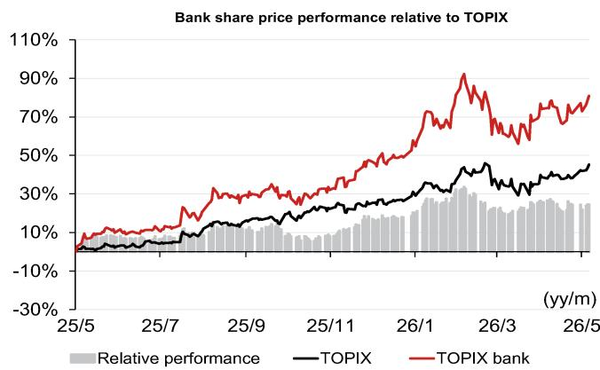

line

| Date   | TOPIX | TOPIX bank |
|--------|-------|------------|
| 25/5   | -5%   | -5%        |
| 25/7   | -10%  | -10%       |
| 25/9   | -5%   | -5%        |
| 25/11  | 10%   | 10%        |
| 26/1   | 20%   | 30%        |
| 26/3   | 30%   | 70%        |
| 26/5   | 40%   | 80%        |

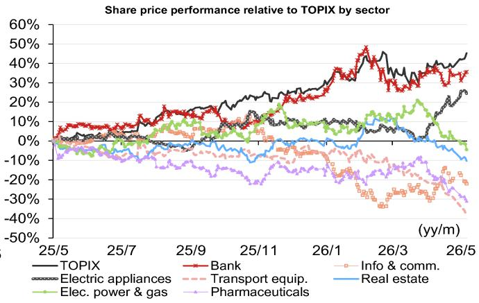

line

| Date   | TOPIX | Bank | Electric appliances | Transport equip. | Real estate | Elec. power & gas | Pharmaceuticals |
|--------|-------|------|---------------------|------------------|-------------|-------------------|-----------------|
| 25/5   | ~0%   | ~0%  | ~0%                 | ~0%              | ~0%         | ~0%               | ~0%             |
| 25/7   | ~10%  | ~10% | ~0%                 | ~0%              | ~0%         | ~0%               | ~0%             |
| 25/9   | ~15%  | ~15% | ~0%                 | ~0%              | ~0%         | ~0%               | ~0%             |
| 25/11  | ~20%  | ~20% | ~0%                 | ~0%              | ~0%         | ~0%               | ~0%             |
| 26/1   | ~30%  | ~30% | ~0%                 | ~0%              | ~0%         | ~0%               | ~0%             |
| 26/3   | ~40%  | ~45% | ~0%                 | ~-10%            | ~-5%        | ~10%              | ~-10%           |
| 26/5   | ~45%  | ~35% | ~0%                 | ~-30%            | ~-10%       | ~-5%              | ~-30%           |

Source: NOM, based on company data

Fig. 4: Investment stance on Japanese financial stocks   
QUICK survey   
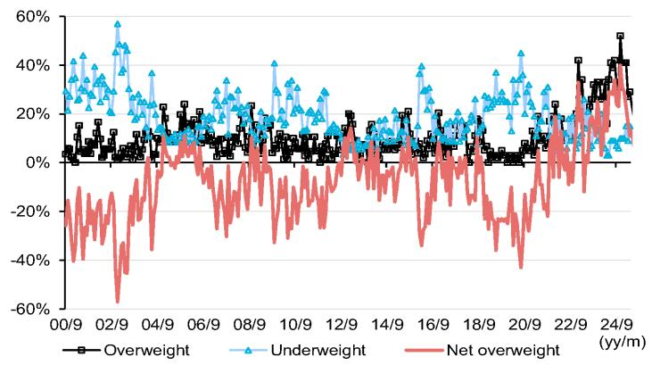

line

| Date   | Overweight | Underweight | Net overweight |
|--------|------------|-------------|----------------|
| 00/9   | ~0%        | ~30%        | ~-20%          |
| 02/9   | ~10%       | ~50%        | ~-50%          |
| 04/9   | ~15%       | ~35%        | ~-10%          |
| 06/9   | ~20%       | ~30%        | ~-15%          |
| 08/9   | ~15%       | ~40%        | ~-20%          |
| 10/9   | ~10%       | ~35%        | ~-15%          |
| 12/9   | ~15%       | ~30%        | ~-10%          |
| 14/9   | ~20%       | ~35%        | ~-15%          |
| 16/9   | ~15%       | ~40%        | ~-20%          |
| 18/9   | ~10%       | ~35%        | ~-15%          |
| 20/9   | ~15%       | ~40%        | ~-10%          |
| 22/9   | ~20%       | ~35%        | ~-15%          |
| 24/9   | ~30%       | ~40%        | ~-20%          |

Source: NOM, based on QUICK data

Fig. 5: Japanese, US, and European bank stocks   
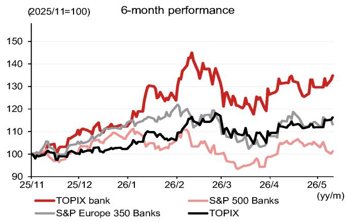

line

| Date   | TOPIX bank | S&P 500 Banks | S&P Europe 350 Banks | TOPIX |
|--------|-----------|---------------|----------------------|-------|
| 25/11  | 100       | 100           | 100                  | 100   |
| 25/12  | 105       | 102           | 103                  | 101   |
| 26/1   | 110       | 108           | 107                  | 104   |
| 26/2   | 130       | 115           | 120                  | 110   |
| 26/3   | 145       | 105           | 118                  | 115   |
| 26/4   | 130       | 100           | 115                  | 112   |
| 26/5   | 135       | 102           | 118                  | 114   |

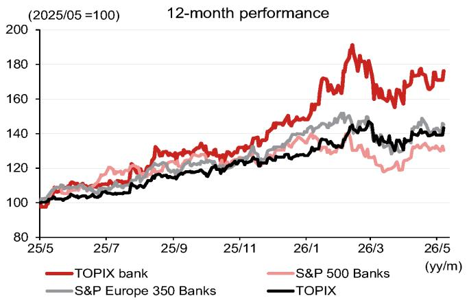

line

| Date   | TOPIX bank | S&P 500 Banks | S&P Europe 350 Banks | TOPIX |
|--------|-----------|---------------|----------------------|-------|
| 25/5   | 100       | 100           | 100                  | 100   |
| 25/7   | 110       | 115           | 110                  | 105   |
| 25/9   | 125       | 120           | 115                  | 110   |
| 25/11  | 135       | 125           | 120                  | 115   |
| 26/1   | 150       | 135           | 130                  | 125   |
| 26/3   | 180       | 140           | 145                  | 140   |
| 26/5   | 170       | 135           | 140                  | 145   |

Source: NOM, based on Bloomberg data

Fig. 6: Japanese, US, and European CDS index spreads   
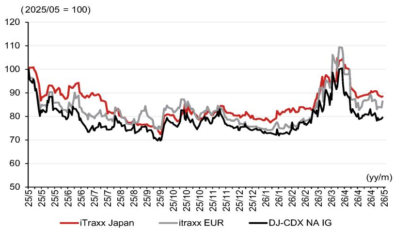

line

| Date   | iTraxx Japan | itraxx EUR | DJ-CDX NA IG |
|--------|--------------|----------|--------------|
| 25/5   | 100          | 100      | 100          |
| 25/5   | 95           | 95       | 95           |
| 25/6   | 90           | 85       | 80           |
| 25/7   | 85           | 80       | 75           |
| 25/8   | 80           | 75       | 70           |
| 25/9   | 75           | 70       | 65           |
| 25/10  | 80           | 75       | 70           |
| 25/11  | 85           | 80       | 75           |
| 25/12  | 80           | 75       | 70           |
| 26/1   | 75           | 70       | 65           |
| 26/2   | 80           | 75       | 70           |
| 26/3   | 90           | 85       | 80           |
| 26/4   | 100          | 110      | 100          |
| 26/5   | 90           | 85       | 80           |

Source: NOM, based on Bloomberg data

# Major bank and major regional bank share price performance

Fig. 7: Relative performance vs bank sector
2026/5/13   
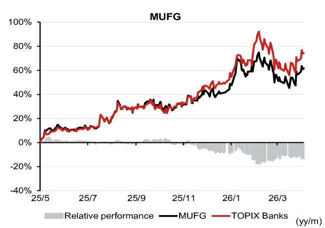

line

| Date   | MUFG  | TOPIX Banks | Relative performance |
|--------|-------|-------------|----------------------|
| 25/5   | ~10%  | ~10%        | ~0%                  |
| 25/7   | ~15%  | ~15%        | ~0%                  |
| 25/9   | ~30%  | ~30%        | ~0%                  |
| 25/11  | ~40%  | ~40%        | ~0%                  |
| 26/1   | ~60%  | ~60%        | ~0%                  |
| 26/3   | ~50%  | ~70%        | ~-10%                |

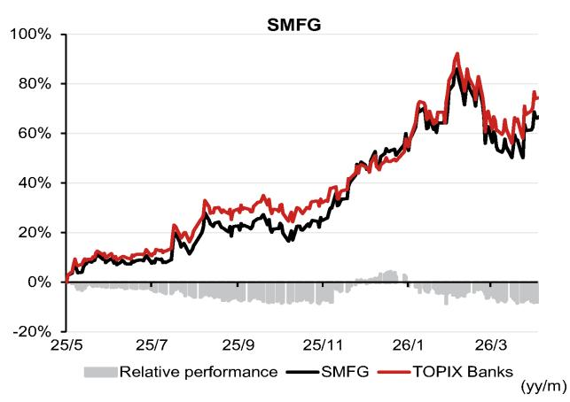

line

| Date   | SMFG  | TOPIX Banks | Relative performance |
|--------|-------|-------------|----------------------|
| 25/5   | ~0%   | ~0%         | ~0%                  |
| 25/7   | ~10%  | ~15%        | ~0%                  |
| 25/9   | ~20%  | ~30%        | ~0%                  |
| 25/11  | ~40%  | ~50%        | ~0%                  |
| 26/1   | ~60%  | ~70%        | ~0%                  |
| 26/3   | ~70%  | ~80%        | ~0%                  |

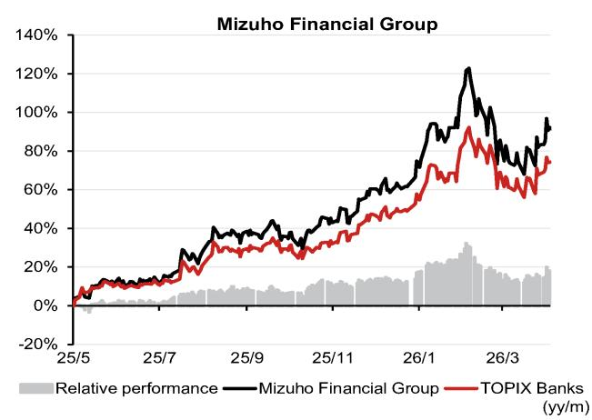

line

| Date   | Mizuho Financial Group | TOPIX Banks (yy/m) |
|--------|------------------------|--------------------|
| 25/5   | ~0%                    | ~0%                |
| 25/7   | ~20%                   | ~15%               |
| 25/9   | ~40%                   | ~30%               |
| 25/11  | ~60%                   | ~45%               |
| 26/1   | ~80%                   | ~60%               |
| 26/3   | ~100%                  | ~70%               |

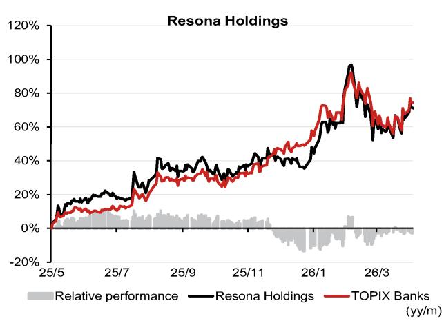

line

| Date   | Resona Holdings | TOPIX Banks | Relative performance |
|--------|-----------------|-------------|----------------------|
| 25/5   | ~10%            | ~10%        | ~0%                  |
| 25/7   | ~30%            | ~20%        | ~5%                  |
| 25/9   | ~40%            | ~30%        | ~10%                 |
| 25/11  | ~50%            | ~40%        | ~5%                  |
| 26/1   | ~60%            | ~50%        | ~0%                  |
| 26/3   | ~80%            | ~70%        | ~0%                  |

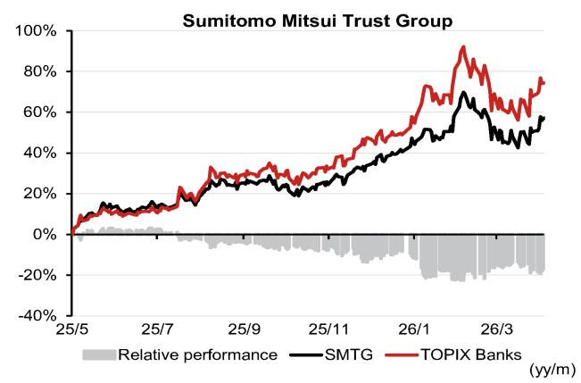

line

| Date   | SMTG  | TOPIX Banks |
|--------|-------|-------------|
| 25/5   | ~0%   | ~0%         |
| 25/7   | ~10%  | ~15%        |
| 25/9   | ~20%  | ~30%        |
| 25/11  | ~30%  | ~40%        |
| 26/1   | ~50%  | ~60%        |
| 26/3   | ~60%  | ~80%        |

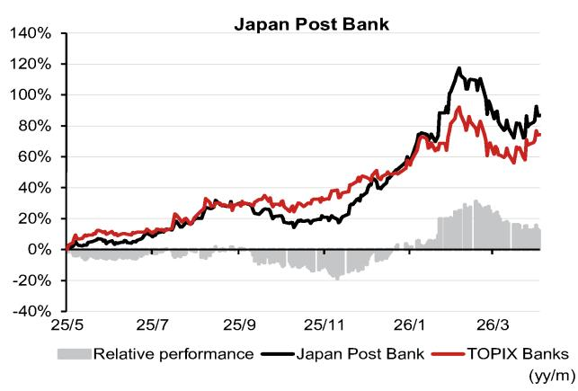

line

| Date   | Japan Post Bank | TOPIX Banks |
|--------|-----------------|-------------|
| 25/5   | ~0%             | ~0%         |
| 25/7   | ~10%            | ~15%        |
| 25/9   | ~20%            | ~30%        |
| 25/11  | ~30%            | ~40%        |
| 26/1   | ~60%            | ~70%        |
| 26/3   | ~90%            | ~80%        |

Source: NOM, based on company data

Fig. 8: Relative performance vs bank sector (regional banks)
2026/5/13   
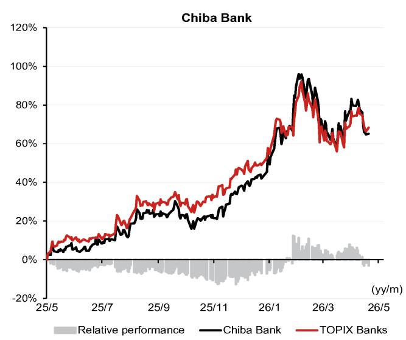

line

| Date   | Chiba Bank | TOPIX Banks |
|--------|------------|-------------|
| 25/5   | ~0%        | ~0%         |
| 25/7   | ~10%       | ~10%        |
| 25/9   | ~20%       | ~25%        |
| 25/11  | ~30%       | ~35%        |
| 26/1   | ~50%       | ~60%        |
| 26/3   | ~80%       | ~75%        |
| 26/5   | ~65%       | ~60%        |

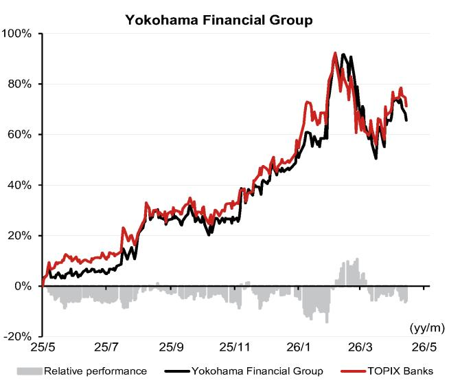

line

| Date   | Yokohama Financial Group | TOPIX Banks |
|--------|--------------------------|-------------|
| 25/5   | ~0%                      | ~0%         |
| 25/7   | ~10%                     | ~15%        |
| 25/9   | ~25%                     | ~30%        |
| 25/11  | ~40%                     | ~45%        |
| 26/1   | ~60%                     | ~70%        |
| 26/3   | ~80%                     | ~90%        |
| 26/5   | ~70%                     | ~75%        |

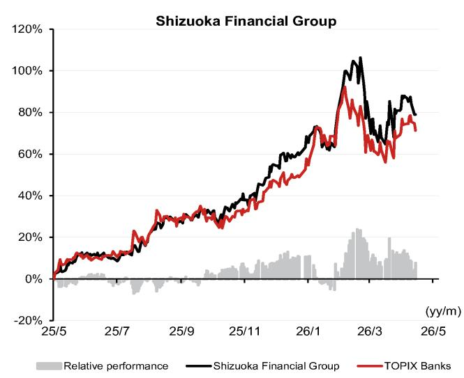

line

| Date   | Shizuoka Financial Group | TOPIX Banks |
|--------|--------------------------|-------------|
| 25/5   | ~0%                      | ~0%         |
| 25/7   | ~10%                     | ~10%        |
| 25/9   | ~30%                     | ~30%        |
| 25/11  | ~40%                     | ~40%        |
| 26/1   | ~60%                     | ~60%        |
| 26/3   | ~100%                    | ~80%        |
| 26/5   | ~80%                     | ~70%        |

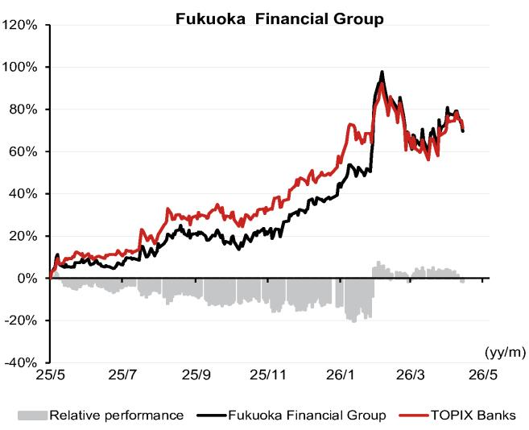

line

| Date   | Fukuoka Financial Group | TOPIX Banks |
|--------|--------------------------|-------------|
| 25/5   | ~0%                      | ~0%         |
| 25/7   | ~10%                     | ~15%        |
| 25/9   | ~20%                     | ~30%        |
| 25/11  | ~30%                     | ~40%        |
| 26/1   | ~50%                     | ~60%        |
| 26/3   | ~80%                     | ~90%        |
| 26/5   | ~70%                     | ~75%        |

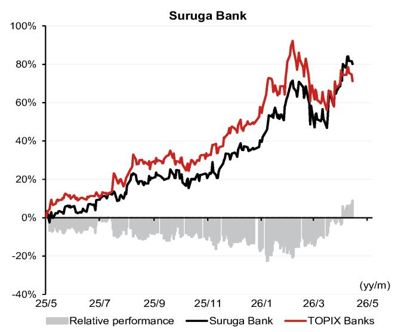

line

| Date   | Suruga Bank | TOPIX Banks |
|--------|-------------|-------------|
| 25/5   | ~0%         | ~0%         |
| 25/7   | ~10%        | ~15%        |
| 25/9   | ~20%        | ~30%        |
| 25/11  | ~30%        | ~40%        |
| 26/1   | ~50%        | ~60%        |
| 26/3   | ~70%        | ~80%        |
| 26/5   | ~80%        | ~75%        |

Source: NOM, based on company data

Fig. 9: Growth in loans outstanding at city banks (y-y)   
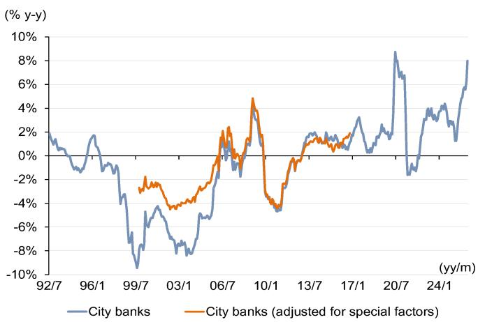

line

| Date   | City banks | City banks (adjusted for special factors) |
|--------|------------|------------------------------------------|
| 92/7   | ~1.5%      | ~1.5%                                    |
| 96/1   | ~-1%       | ~-1%                                     |
| 99/7   | ~-9%       | ~-3%                                     |
| 03/1   | ~-7%       | ~-4%                                     |
| 06/7   | ~-2%       | ~2%                                      |
| 10/1   | ~4%        | ~5%                                      |
| 13/7   | ~2%        | ~1%                                      |
| 17/1   | ~3%        | ~1%                                      |
| 20/7   | ~9%        | ~8%                                      |
| 24/1   | ~8%        | ~6%                                      |

Note: "Adjusted for special factors" figures run through April 2013.   
Source: NOM, based on BOJ data

Fig. 10: Growth in lending by bank type - (1)   
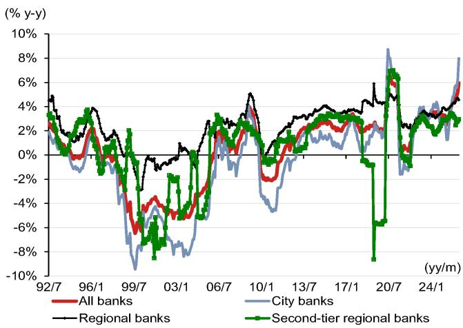

line

| Date   | All banks | City banks | Regional banks | Second-tier regional banks |
|--------|-----------|------------|----------------|----------------------------|
| 92/7   | ~3%       | ~5%        | ~4%            | ~4%                        |
| 96/1   | ~2%       | ~3%        | ~4%            | ~3%                        |
| 99/7   | ~-5%      | ~-8%       | ~-2%           | ~-6%                       |
| 03/1   | ~-3%      | ~-5%       | ~0%            | ~-4%                       |
| 06/7   | ~2%       | ~3%        | ~5%            | ~3%                        |
| 10/1   | ~-2%      | ~-4%       | ~3%            | ~2%                        |
| 13/7   | ~2%       | ~3%        | ~4%            | ~3%                        |
| 17/1   | ~3%       | ~4%        | ~5%            | ~4%                        |
| 20/7   | ~6%       | ~9%        | ~7%            | ~7%                        |
| 24/1   | ~5%       | ~8%        | ~6%            | ~5%                        |

Source: NOM, based on BOJ data

Fig. 11: Growth in real deposits and CDs by bank type   
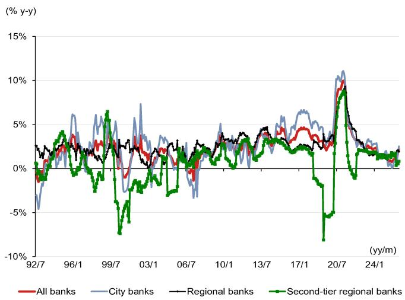

line

| Year/m | All banks | City banks | Regional banks | Second-tier regional banks |
|-------|-----------|------------|----------------|----------------------------|
| 92/7  | -2%       | -5%        | 3%             | -1%                        |
| 96/1  | 3%        | 6%         | 2%             | 4%                         |
| 99/7  | 2%        | 7%         | 3%             | 6%                         |
| 03/1  | 1%        | 3%         | 2%             | -8%                        |
| 06/7  | -1%       | -3%        | 1%             | -2%                        |
| 10/1  | 2%        | 4%         | 3%             | 2%                         |
| 13/7  | 3%        | 5%         | 4%             | 3%                         |
| 17/1  | 4%        | 6%         | 5%             | 4%                         |
| 20/7  | 10%       | 11%        | 9%             | -8%                        |
| 24/1  | 2%        | 2%         | 1%             | 1%                         |

Source: NOM, based on BOJ data

Fig. 12: Growth in lending by bank type - (2)   
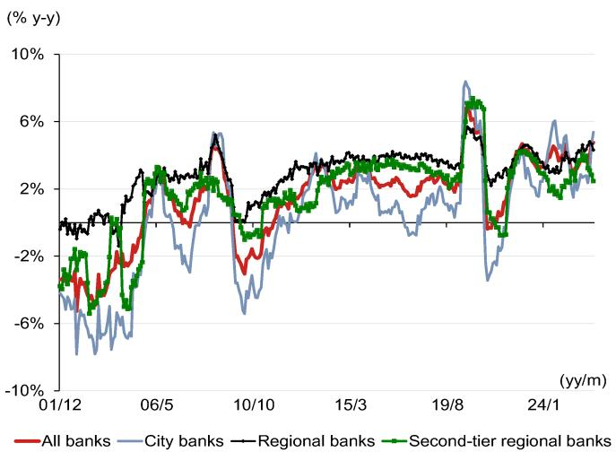

line

| Date   | All banks | City banks | Regional banks | Second-tier regional banks |
|--------|-----------|------------|----------------|----------------------------|
| 01/12  | -3.5%     | -6.0%      | -2.0%          | -4.0%                      |
| 06/5   | -2.0%     | -7.0%      | 2.5%           | 2.0%                       |
| 10/10  | -1.5%     | -5.5%      | 3.0%           | 1.5%                       |
| 15/3   | 2.0%      | -1.0%      | 3.5%           | 2.5%                       |
| 19/8   | 3.0%      | 9.0%       | 4.0%           | 6.0%                       |
| 24/1   | 4.0%      | 6.0%       | 5.0%           | 3.0%                       |

Note: Data up to November 2002 calculated from y-y figures. Differences with BOJ data are that figures (1) do not include trust accounts, (2) include lending to financial institutions, and (3) include lending to the central government. In our view, Japanese Bankers Association (JBA) statistics indicate fairly accurately changes in lending on bank balance sheets, while BOJ statistics reflect actual changes in the private-sector lending market more closely. (4) With the launch of Kiraboshi Bank, from May 2018 onward y-y comparisons have been adjusted to subtract out the former ShinGinko Tokyo from "all banks", the former Yachiyo Bank and the former ShinGinko Tokyo from "regional banks", and the former Yachiyo Bank from "second-tier regional banks". Source: NOM, based on JBA data

# Loans and discounts outstanding by sector (BOJ statistics)

Fig. 13: Lending by borrower type   
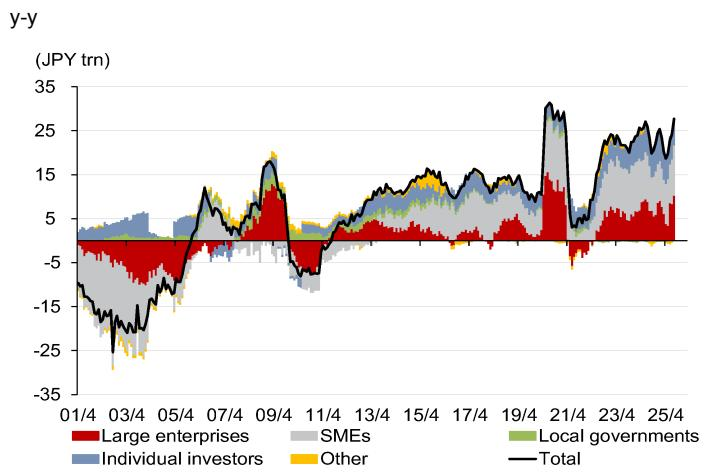

line

| Date   | Large enterprises | SMEs | Local governments | Individual investors | Other | Total |
|--------|-------------------|------|------------------|----------------------|-------|-------|
| 01/4   | -5                | -10  | -5               | -5                   | -5    | -10   |
| 03/4   | -5                | -15  | -5               | -5                   | -5    | -15   |
| 05/4   | -5                | -10  | -5               | -5                   | -5    | -10   |
| 07/4   | -5                | -5   | -5               | -5                   | -5    | -5    |
| 09/4   | -5                | 0    | 0                | 0                    | 0     | 0     |
| 11/4   | -5                | 0    | 0                | 0                    | 0     | 0     |
| 13/4   | -5                | 0    | 0                | 0                    | 0     | 0     |
| 15/4   | -5                | 0    | 0                | 0                    | 0     | 0     |
| 17/4   | -5                | 0    | 0                | 0                    | 0     | 0     |
| 19/4   | -5                | 0    | 0                | 0                    | 0     | 0     |
| 21/4   | -5                | 0    | 0                | 0                    | 0     | 0     |
| 23/4   | -5                | 0    | 0                | 0                    | 0     | 0     |
| 25/4   | -5                | 0    | 0                | 0                    | 0     | 0     |

Source: NOM, based on BOJ data

Fig. 14: Change in loans outstanding by purpose of funds   
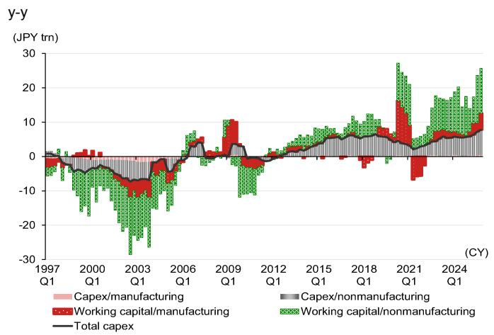

line

| Year | Capex/manufacturing | Capex/nonmanufacturing | Working capital/manufacturing | Working capital/nonmanufacturing | Total capex |
|------|----------------------|------------------------|----------------------------------|----------------------------------|-------------|
| 1997 | -                    | -                      | -                                | -                                | -           |
| 2000 | -                    | -                      | -                                | -                                | -           |
| 2003 | -                    | -                      | -                                | -                                | -           |
| 2006 | -                    | -                      | -                                | -                                | -           |
| 2009 | -                    | -                      | -                                | -                                | -           |
| 2012 | -                    | -                      | -                                | -                                | -           |
| 2015 | -                    | -                      | -                                | -                                | -           |
| 2018 | -                    | -                      | -                                | -                                | -           |
| 2021 | -                    | -                      | -                                | -                                | -           |
| 2024 | -                    | -                      | -                                | -                                | -           |

Source: NOM, based on BOJ data

Fig. 15: Loans outstanding to corporations   
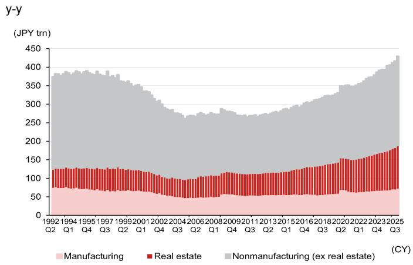

bar_stacked

| Year | Manufacturing (JPY tm) | Real estate (JPY tm) | Nonmanufacturing (ex real estate) (JPY tm) |
|---|---|---|---|
| 1992 Q2 | 80 | 120 | 270 |
| 1994 Q1 | 85 | 125 | 265 |
| 1995 Q4 | 80 | 125 | 270 |
| 1997 Q3 | 75 | 125 | 275 |
| 1999 Q2 | 70 | 125 | 270 |
| 2001 Q1 | 65 | 120 | 260 |
| 2002 Q4 | 60 | 110 | 250 |
| 2004 Q3 | 55 | 100 | 240 |
| 2006 Q2 | 50 | 95 | 245 |
| 2008 Q1 | 55 | 100 | 250 |
| 2008 Q4 | 60 | 105 | 255 |
| 2011 Q3 | 65 | 110 | 260 |
| 2013 Q2 | 70 | 115 | 265 |
| 2013 Q1 | 75 | 120 | 270 |
| 2015 Q4 | 80 | 125 | 275 |
| 2016 Q3 | 85 | 130 | 280 |
| 2018 Q2 | 90 | 135 | 285 |
| 2018 Q1 | 95 | 140 | 290 |
| 2020 Q4 | 100 | 145 | 295 |
| 2022 Q3 | 105 | 150 | 300 |
| 2023 Q2 | 110 | 155 | 305 |
| 2023 Q1 | 115 | 160 | 310 |
| 2023 Q4 | 120 | 165 | 315 |
| 2024 Q3 | 125 | 170 | 320 |
| 2024 Q2 | 130 | 175 | 325 |
| 2024 Q1 | 135 | 180 | 330 |
| 2024 Q4 | 140 | 185 | 335 |
| 2025 Q3 | 145 | 190 | 340 |
(Note: The data for 'Nonmanufacturing (ex real estate)' is not explicitly labeled in the chart, so it's included in the legend). The actual data for 'Real estate' is not explicitly labeled in the chart but referenced in the legend as 'Nonmanufacturing (ex real estate)'.)

Source: NOM, based on BOJ data

Fig. 16: Change in loans outstanding to corporations   
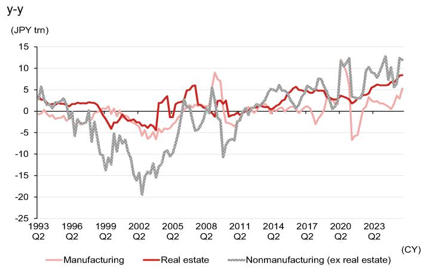

line

| Year | Manufacturing | Real estate | Nonmanufacturing (ex real estate) |
|------|---------------|-------------|----------------------------------|
| 1993 | -1.5          | 3.0         | 4.0                              |
| 1996 | -2.0          | 2.5         | 3.5                              |
| 1999 | -3.0          | 1.5         | 2.0                              |
| 2002 | -4.0          | -1.0        | -15.0                            |
| 2005 | -5.0          | 3.0         | -10.0                            |
| 2008 | -6.0          | 6.0         | -5.0                             |
| 2011 | -7.0          | -1.0        | -10.0                            |
| 2014 | -8.0          | 2.0         | 3.0                              |
| 2017 | -9.0          | 4.0         | 5.0                              |
| 2020 | -10.0         | 3.0         | 12.0                             |
| 2023 | -11.0         | 8.0         | 13.0                             |

Source: NOM, based on BOJ data

Fig. 17: Loans outstanding at overseas branches   
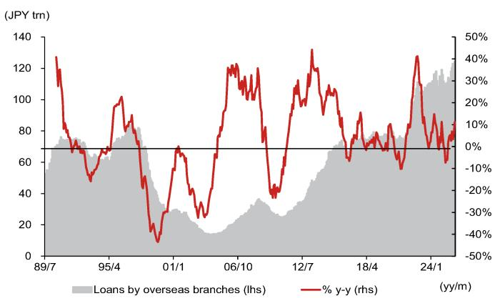

line

| Date   | Loans by overseas branches (lhs) | % y-y (rhs) |
|--------|----------------------------------|-------------|
| 89/7   | ~70                              | ~130        |
| 95/4   | ~60                              | ~100        |
| 01/1   | ~20                              | ~70         |
| 06/10  | ~30                              | ~120        |
| 12/7   | ~40                              | ~130        |
| 18/4   | ~60                              | ~80         |
| 24/1   | ~80                              | ~120        |

Source: NOM, based on BOJ data

Fig. 18: Loans outstanding by interest rate   
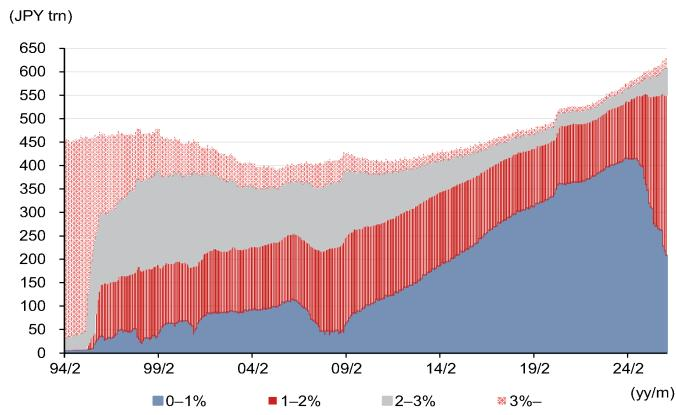  
Source: NOM, based on BOJ data

Fig. 19: City banks: average contracted interest rates on short-term loans   
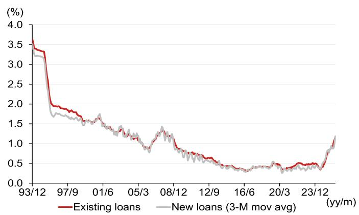

line

| Date   | Existing loans | New loans (3-M mov avg) |
|--------|----------------|--------------------------|
| 93/12  | 3.6            | 3.4                      |
| 97/9   | 1.8            | 1.7                      |
| 01/6   | 1.5            | 1.6                      |
| 05/3   | 1.2            | 1.1                      |
| 08/12  | 0.8            | 0.9                      |
| 12/9   | 0.6            | 0.5                      |
| 16/6   | 0.4            | 0.3                      |
| 20/3   | 0.5            | 0.4                      |
| 23/12  | 0.6            | 0.5                      |

Source: NOM, based on BOJ data

Fig. 20: City banks: average contracted interest rates on long-term loans   
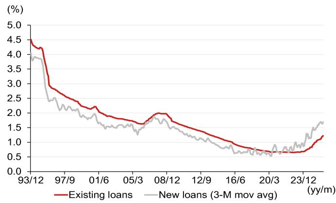

line

| Date   | Existing loans | New loans (3-M mov avg) |
|--------|----------------|--------------------------|
| 93/12  | 4.5            | 4.0                      |
| 97/9   | 2.8            | 2.5                      |
| 01/6   | 2.2            | 2.0                      |
| 05/3   | 1.8            | 1.5                      |
| 08/12  | 2.0            | 1.8                      |
| 12/9   | 1.5            | 1.2                      |
| 16/6   | 1.0            | 0.8                      |
| 20/3   | 0.7            | 0.6                      |
| 23/12  | 1.2            | 1.7                      |

Source: NOM, based on BOJ data

Fig. 21: Average contracted interest rates on loans by type of bank   
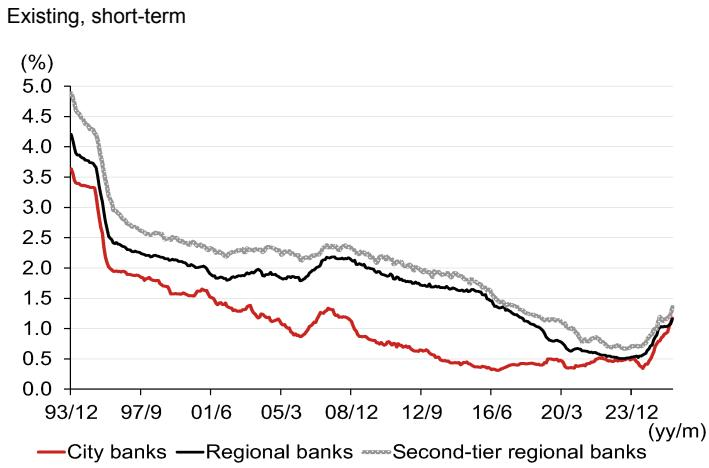

line

| Date   | City banks | Regional banks | Second-tier regional banks |
|--------|------------|----------------|----------------------------|
| 9/3/12 | 3.5%       | 4.0%           | 5.0%                       |
| 9/7/9  | 2.0%       | 2.5%           | 3.0%                       |
| 01/6   | 1.5%       | 2.0%           | 2.5%                       |
| 05/3   | 1.0%       | 1.8%           | 2.2%                       |
| 08/12  | 1.3%       | 2.2%           | 2.5%                       |
| 12/9   | 0.8%       | 1.8%           | 2.0%                       |
| 16/6   | 0.5%       | 1.5%           | 1.8%                       |
| 20/3   | 0.4%       | 1.0%           | 1.2%                       |
| 23/12  | 0.5%       | 0.8%           | 1.0%                       |

Source: NOM, based on BOJ data

Fig. 22: Average contracted interest rates on loans by type of bank   
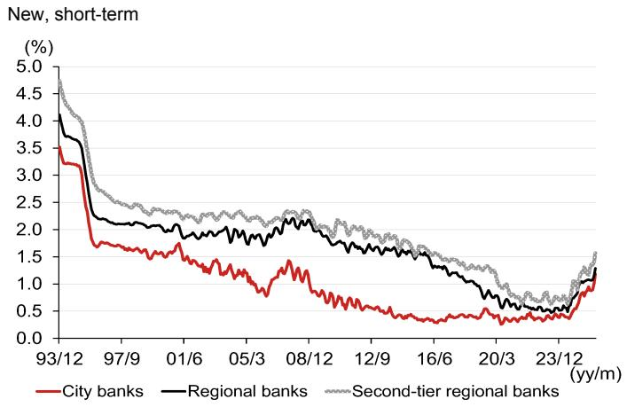

line

| (yy/m) | City banks | Regional banks | Second-tier regional banks |
| ------ | ---------- | -------------- | -------------------------- |
| 93/12  | 3.5        | 4.0            | 4.8                        |
| 97/9   | 1.8        | 2.2            | 2.5                        |
| 01/6   | 1.5        | 2.0            | 2.3                        |
| 05/3   | 1.2        | 1.9            | 2.2                        |
| 08/12  | 1.4        | 2.1            | 2.4                        |
| 12/9   | 0.8        | 1.8            | 2.1                        |
| 16/6   | 0.5        | 1.5            | 1.9                        |
| 20/3   | 0.3        | 1.0            | 1.5                        |
| 23/12  | 0.5        | 0.8            | 1.2                        |
| 26/12  | 1.0        | 1.2            | 1.5                        |

Source: NOM, based on BOJ data

Fig. 23: Average contracted interest rates on loans by type of bank   
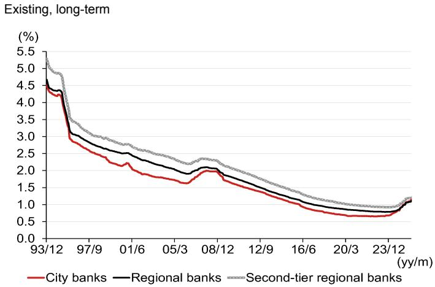

line

| (yy/m) | City banks | Regional banks | Second-tier regional banks |
| ------ | ---------- | -------------- | -------------------------- |
| 93/12  | 4.5        | 4.7            | 5.2                        |
| 97/9   | 3.0        | 3.2            | 3.5                        |
| 01/6   | 2.2        | 2.4            | 2.6                        |
| 05/3   | 1.8        | 2.0            | 2.2                        |
| 08/12  | 2.0        | 2.1            | 2.3                        |
| 12/9   | 1.5        | 1.6            | 1.8                        |
| 16/6   | 1.0        | 1.1            | 1.3                        |
| 20/3   | 0.7        | 0.8            | 1.0                        |
| 23/12  | 0.6        | 0.7            | 0.9                        |

Source: NOM, based on BOJ data

Fig. 24: Short- and long-term prime lending rates and home loan interest rates   
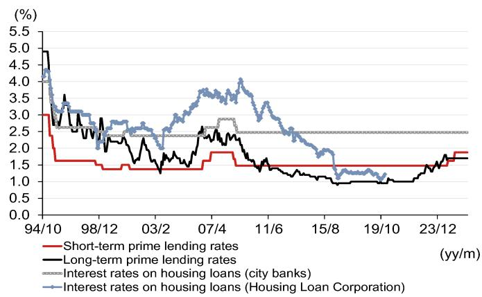

line

| Date   | Short-term prime lending rates | Long-term prime lending rates | Interest rates on housing loans (city banks) | Interest rates on housing loans (Housing Loan Corporation) |
|--------|----------------------------------|-------------------------------|-----------------------------------------------|-------------------------------------------------------------|
| 94/10  | 3.0                              | 5.0                           | 4.0                                           | 4.5                                                         |
| 98/12  | 1.5                              | 2.5                           | 2.5                                           | 3.0                                                         |
| 03/2   | 1.5                              | 2.0                           | 2.5                                           | 2.5                                                         |
| 07/4   | 1.5                              | 2.5                           | 2.5                                           | 3.5                                                         |
| 11/6   | 1.5                              | 2.0                           | 2.5                                           | 3.0                                                         |
| 15/8   | 1.5                              | 1.0                           | 2.5                                           | 1.5                                                         |
| 19/10  | 1.5                              | 1.0                           | 2.5                                           | 1.0                                                         |
| 23/12  | 1.5                              | 1.5                           | 2.5                                           | 1.5                                                         |

Note: City bank home loan interest rate based on new variable rates. Disclosure of data on home loan rates by the Housing Loan Corporation runs through February 2020.   
Source: NOM, based on BOJ data

Fig. 25: Lending by prefecture   
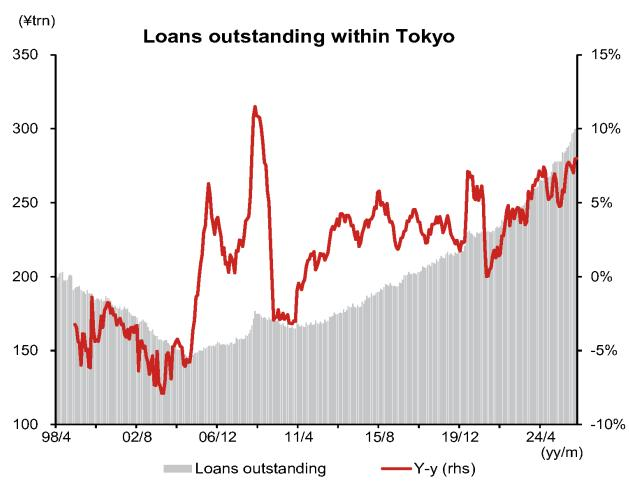

line

| Date   | Loans outstanding (¥trn) | Y-y (rhs) |
|--------|--------------------------|---------|
| 98/4   | ~200                     | ~-5%    |
| 02/8   | ~150                     | ~-5%    |
| 06/12  | ~170                     | ~-5%    |
| 11/4   | ~180                     | ~-5%    |
| 15/8   | ~200                     | ~-5%    |
| 19/12  | ~220                     | ~-5%    |
| 24/4   | ~280                     | ~-5%    |

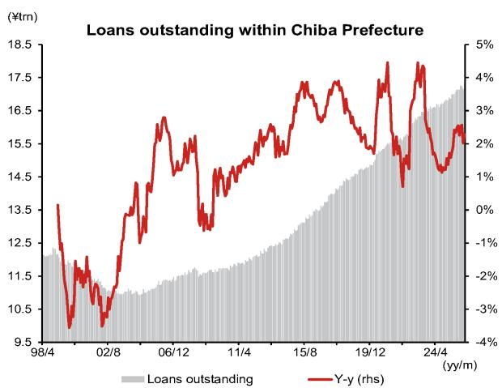

line

| Date   | Loans outstanding (¥trn) | Y-y (%) |
|--------|--------------------------|---------|
| 98/4   | 12.5                     | -       |
| 02/8   | 10.5                     | -3.5    |
| 06/12  | 11.5                     | 0.0     |
| 11/4   | 12.5                     | 1.5     |
| 15/8   | 13.5                     | 3.0     |
| 19/12  | 14.5                     | 4.0     |
| 24/4   | 16.0                     | 3.5     |

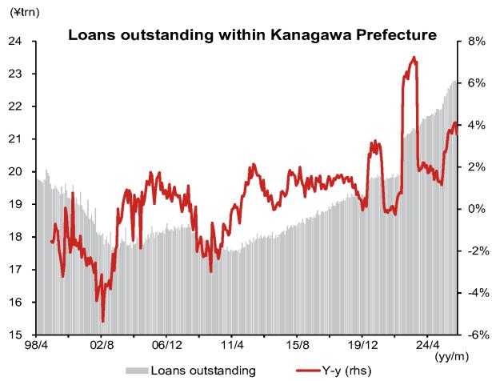

line

| Date   | Loans outstanding (¥trn) | Y-y (%) |
|--------|--------------------------|---------|
| 98/4   | ~19.5                    | ~0%     |
| 02/8   | ~17.5                    | ~-6%    |
| 06/12  | ~18.5                    | ~2%     |
| 11/4   | ~18.0                    | ~0%     |
| 15/8   | ~19.0                    | ~2%     |
| 19/12  | ~20.0                    | ~4%     |
| 24/4   | ~23.0                    | ~6%     |

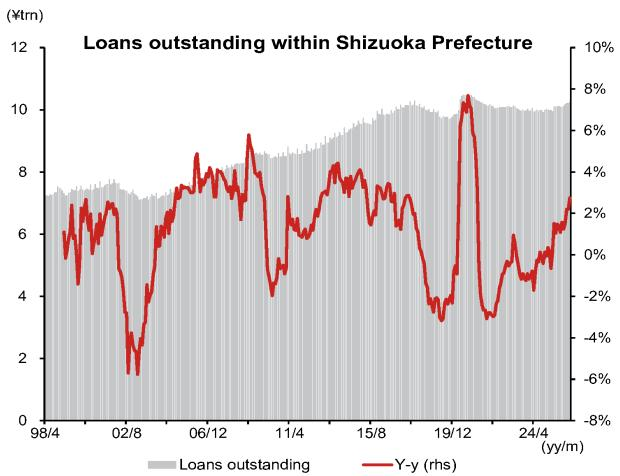

line

| Date   | Loans outstanding (¥trn) | Y-y (%) |
|--------|--------------------------|---------|
| 98/4   | ~7.5                     | ~2.5    |
| 02/8   | ~7.0                     | ~-6.0   |
| 06/12  | ~7.5                     | ~4.0    |
| 11/4   | ~8.0                     | ~-2.0   |
| 15/8   | ~9.0                     | ~6.0    |
| 19/12  | ~10.0                    | ~8.0    |
| 24/4   | ~10.0                    | ~2.0    |

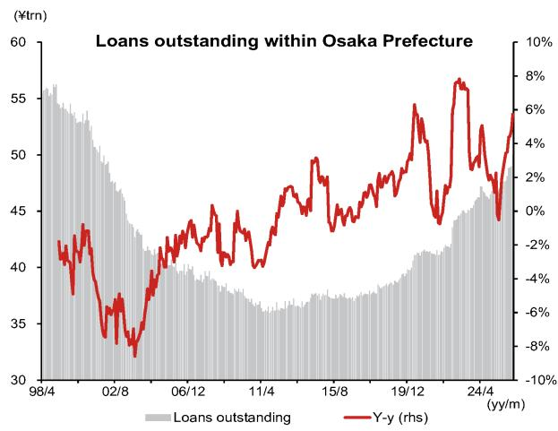

line

| Date   | Loans outstanding (¥trn) | Y-y (%) |
|--------|--------------------------|---------|
| 98/4   | 56                       | 0       |
| 02/8   | 45                       | -6      |
| 06/12  | 38                       | -2      |
| 11/4   | 37                       | 0       |
| 15/8   | 38                       | 2       |
| 19/12  | 42                       | 4       |
| 24/4   | 45                       | 6       |

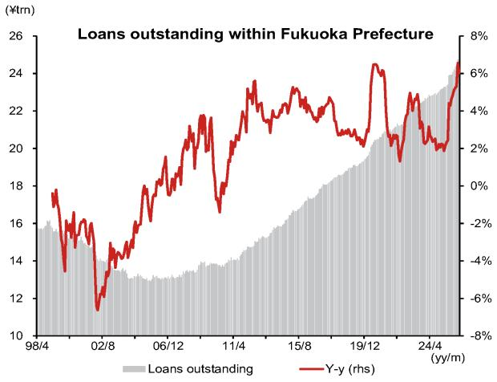

line

| Year/Period | Loans outstanding (¥trn) | Y-y (%) |
| ----------- | ------------------------ | ------- |
| 98/4        | ~16                      | ~6      |
| 02/8        | ~13                      | ~-6     |
| 06/12       | ~14                      | ~0      |
| 11/4        | ~15                      | ~4      |
| 15/8        | ~17                      | ~2      |
| 19/12       | ~20                      | ~6      |
| 24/4        | ~24                      | ~6      |

Source: NOM, based on BOJ data

# Senior Loan Officer Opinion Survey on Bank Lending Practices at Large Japanese Banks (BOJ statistics)

Fig. 26: Spreads of loan rates over bank cost of funds DI   
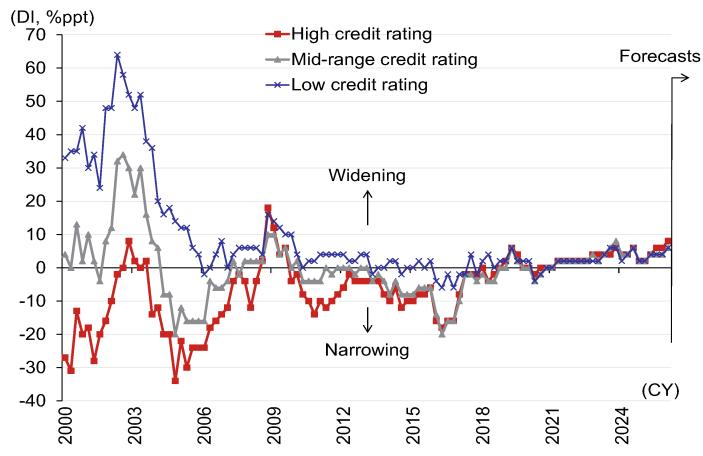

line

| Year | High credit rating | Mid-range credit rating | Low credit rating |
|------|---------------------|--------------------------|-------------------|
| 2000 | -30                 | 10                       | 35                |
| 2003 | 10                  | 35                       | 65                |
| 2006 | -20                 | -10                      | 10                |
| 2009 | 15                  | 5                        | 15                |
| 2012 | -5                  | 0                        | 5                 |
| 2015 | -10                 | -5                       | 0                 |
| 2018 | -5                  | -10                      | 5                 |
| 2021 | 0                   | 0                        | 0                 |
| 2024 | 5                   | 5                        | 5                 |

Source: NOM, based on BOJ data

Fig. 27: Demand for loans from borrowers DI—by borrower type   
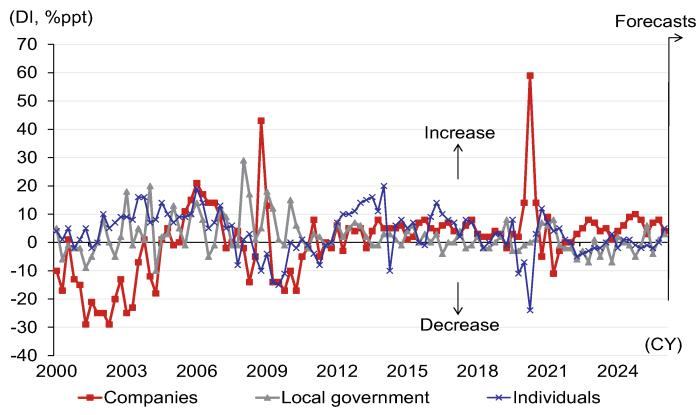

line

| Year | Companies | Local government | Individuals |
|------|-----------|------------------|-------------|
| 2000 | -10       | 5                | 5           |
| 2003 | -25       | 15               | 10          |
| 2006 | 20        | 10               | 15          |
| 2009 | 45        | 30               | -15         |
| 2012 | 5         | 15               | 10          |
| 2015 | 5         | 5                | 20          |
| 2018 | 5         | 5                | 10          |
| 2021 | 60        | 5                | -25         |
| 2024 | 10        | 5                | 5           |

Source: NOM, based on BOJ data

Fig. 28: Demand for loans from companies DI—by company size   
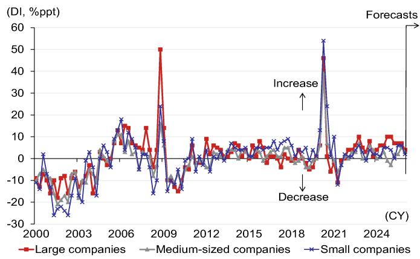

line

| Year | Large companies | Medium-sized companies | Small companies |
|------|-----------------|-------------------------|-----------------|
| 2000 | -10             | -15                     | -5              |
| 2003 | -5              | -10                     | -15             |
| 2006 | 15              | 10                      | 15              |
| 2009 | 50              | 10                      | 25              |
| 2012 | 10              | 5                       | 10              |
| 2015 | 5               | 0                       | 5               |
| 2018 | 0               | -5                      | 0               |
| 2021 | 45              | 5                       | 55              |
| 2024 | 10              | 5                       | 5               |

Source: NOM, based on BOJ data

Fig. 29: Demand for loans from households DI—by loan type   
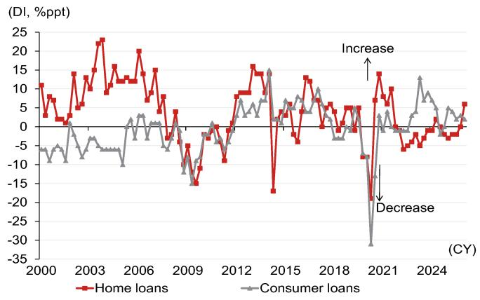

line

| Year | Home loans | Consumer loans |
|------|------------|----------------|
| 2000 | 10         | -5             |
| 2003 | 25         | -5             |
| 2006 | 20         | -5             |
| 2009 | -15        | -10            |
| 2012 | 15         | 5              |
| 2015 | -15        | 5              |
| 2018 | 5          | -5             |
| 2021 | 15         | -30            |
| 2024 | 5          | 15             |

Source: NOM, based on BOJ data

Fig. 30: Demand for loans forecast DI   
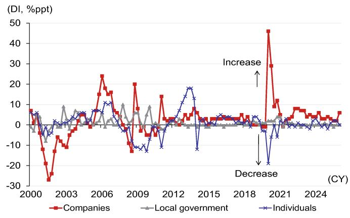

line

| Year | Companies | Local government | Individuals |
|------|-----------|------------------|-------------|
| 2000 | 5         | 0                | 5           |
| 2001 | -25       | -5               | 0           |
| 2002 | -10       | 0                | 5           |
| 2003 | -5        | 5                | 0           |
| 2004 | 0         | 0                | 5           |
| 2005 | 15        | 5                | 10          |
| 2006 | 25        | 0                | 15          |
| 2007 | 15        | 5                | 10          |
| 2008 | 5         | 0                | 5           |
| 2009 | -15       | -5               | -10         |
| 2010 | -10       | 0                | -15         |
| 2011 | -5        | 5                | -10         |
| 2012 | 15        | 0                | 15          |
| 2013 | 5         | 0                | 20          |
| 2014 | 10        | 0                | -15         |
| 2015 | 5         | 0                | 5           |
| 2016 | 5         | 0                | 5           |
| 2017 | 5         | 0                | 5           |
| 2018 | 5         | 0                | 5           |
| 2019 | 5         | 0                | -20         |
| 2020 | 45        | 0                | -15         |
| 2021 | 30        | 0                | -5          |
| 2022 | 10        | 0                | 5           |
| 2023 | 5         | 0                | 5           |
| 2024 | 5         | 0                | 5           |
| CY    | ~5        | ~0               | ~5          |

Source: NOM, based on BOJ data

Fig. 31: Credit standards for approving applications for loans DI—by companies and households   
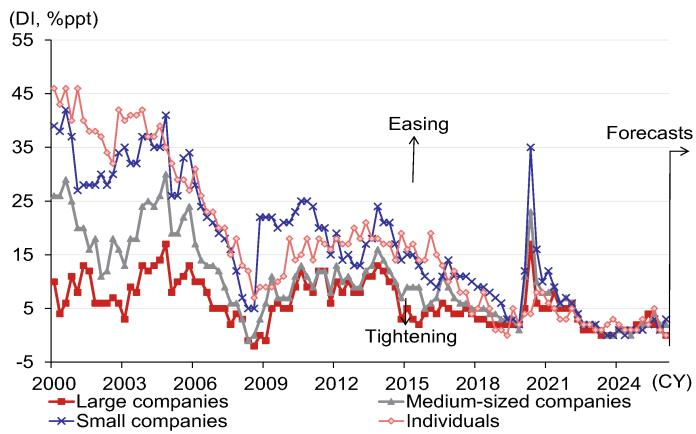

line

| Year | Large companies | Medium-sized companies | Small companies | Individuals |
|------|-----------------|-------------------------|-----------------|-------------|
| 2000 | 10              | 25                      | 35              | 45          |
| 2003 | 5               | 15                      | 30              | 35          |
| 2006 | 15              | 20                      | 35              | 30          |
| 2009 | -5              | 5                       | 20              | 15          |
| 2012 | 10              | 15                      | 25              | 20          |
| 2015 | 5               | 10                      | 15              | 10          |
| 2018 | 0               | 5                       | 10              | 5           |
| 2021 | 5               | 0                       | 35              | 15          |
| 2024 (CY) | 0         | 0                   | 0               | 0           |

Source: NOM, based on BOJ data

# Investment trust balance, loans syndicated, commitment lines

Fig. 32: Investment trust asset balance   
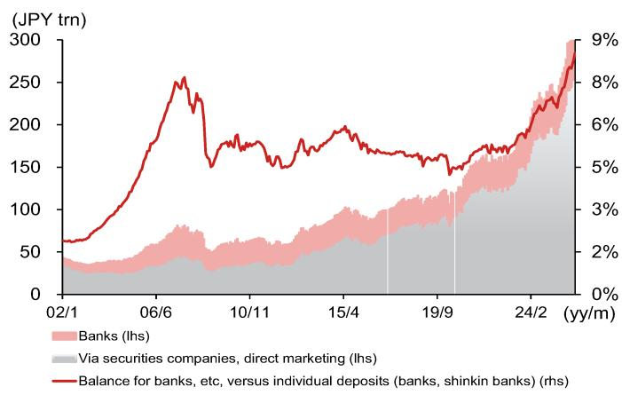

line

| Date   | Balance for banks, etc., versus individual deposits (banks, shinkin banks) (rhs) |
|--------|--------------------------------------------------------------------------|
| 02/1   | ~50                                                                      |
| 06/6   | ~250                                                                     |
| 10/11  | ~180                                                                     |
| 15/4   | ~200                                                                     |
| 19/9   | ~150                                                                     |
| 24/2   | ~280                                                                     |

Note: “Banks” excludes the value of investment trusts sold by Japan Post as a public entity through April 2008.   
Source: NOM, based on the Investment Trusts Association and BOJ data

Fig. 33: Sales of publicly offered contractual-type investment trusts   
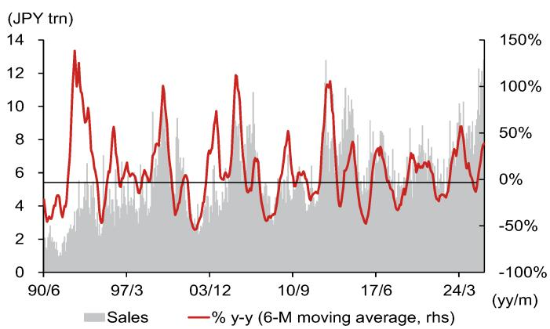

line

| Date   | Sales (JPY trn) | % y-y (6-M moving average, rhs) |
|--------|-----------------|----------------------------------|
| 90/6   | ~3              | ~-50%                            |
| 97/3   | ~8              | ~0%                              |
| 03/12  | ~12             | ~50%                             |
| 10/9   | ~6              | ~0%                              |
| 17/6   | ~8              | ~50%                             |
| 24/3   | ~10             | ~0%                              |

Source: NOM, based on The Investment Trusts Association data

Fig. 34: Loans syndicated   
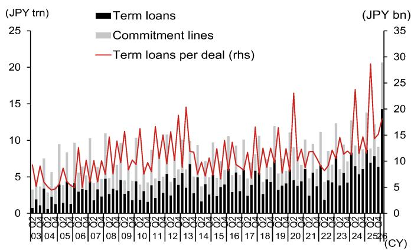

bar_line

| Year | Term loans (JPY trn) | Commitment lines (JPY bn) | Term loans per deal (JPY bn) |
|------|----------------------|----------------------------|------------------------------|
| 03   | ~1                   | ~7                         | ~5                           |
| 04   | ~2                   | ~8                         | ~6                           |
| 05   | ~3                   | ~9                         | ~7                           |
| 06   | ~4                   | ~10                        | ~8                           |
| 07   | ~5                   | ~11                        | ~9                           |
| 08   | ~6                   | ~12                        | ~10                          |
| 09   | ~7                   | ~13                        | ~11                          |
| 10   | ~8                   | ~14                        | ~12                          |
| 11   | ~9                   | ~15                        | ~13                          |
| 12   | ~10                  | ~16                        | ~14                          |
| 13   | ~11                  | ~17                        | ~15                          |
| 14   | ~12                  | ~18                        | ~16                          |
| 15   | ~13                  | ~19                        | ~17                          |
| 16   | ~14                  | ~20                        | ~18                          |
| 17   | ~15                  | ~21                        | ~19                          |
| 18   | ~16                  | ~22                        | ~20                          |
| 19   | ~17                  | ~23                        | ~21                          |
| 20   | ~18                  | ~24                        | ~22                          |
| 21   | ~19                  | ~25                        | ~23                          |
| 22   | ~20                  | ~26                        | ~24                          |
| 23   | ~21                  | ~27                        | ~25                          |
| 24   | ~22                  | ~28                        | ~26                          |
| 25   | ~23                  | ~29                        | ~27                          |
| 26   | ~24                  | ~30                        | ~28                          |

Source: NOM, based on JBA data

Fig. 35: Term-end balance of loans syndicated   
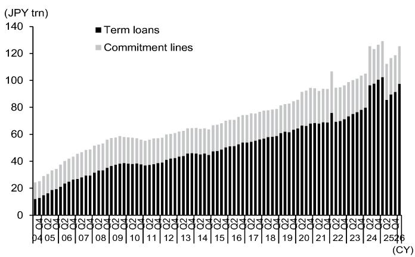

bar_stacked

| Year | Term loans (JPY trn) | Commitment lines (JPY trn) |
| :--- | :--- | :--- |
| 04 | 10 | 25 |
| 05 | 15 | 30 |
| 06 | 20 | 35 |
| 07 | 25 | 40 |
| 08 | 30 | 45 |
| 09 | 35 | 50 |
| 10 | 38 | 55 |
| 11 | 40 | 60 |
| 12 | 42 | 65 |
| 13 | 45 | 70 |
| 14 | 48 | 75 |
| 15 | 50 | 80 |
| 16 | 52 | 85 |
| 17 | 55 | 90 |
| 18 | 58 | 95 |
| 19 | 60 | 100 |
| 20 | 62 | 105 |
| 21 | 65 | 110 |
| 22 | 70 | 115 |
| 23 | 75 | 120 |
| 24 | 80 | 125 |
| 25 | 85 | 130 |
| 26 | 90 | 135 |
(CY) (after label '24')

Source: NOM, based on JBA data

Fig. 36: Loans transferred   
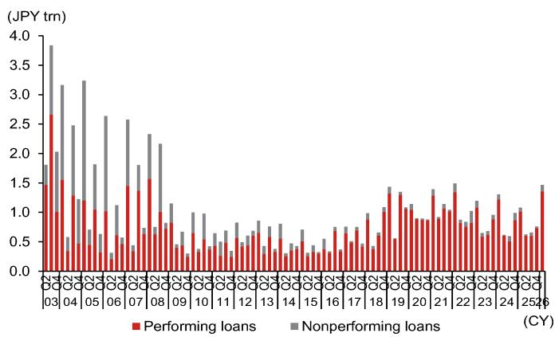

bar

| Year | Performing loans (JPY trn) | Nonperforming loans (JPY trn) |
|------|-----------------------------|-------------------------------|
| 03   | 2.7                         | 1.9                           |
| 04   | 1.5                         | 3.2                           |
| 05   | 1.2                         | 3.3                           |
| 06   | 1.0                         | 2.6                           |
| 07   | 1.4                         | 1.8                           |
| 08   | 1.6                         | 2.2                           |
| 09   | 0.5                         | 1.1                           |
| 10   | 0.4                         | 1.0                           |
| 11   | 0.5                         | 0.7                           |
| 12   | 0.6                         | 0.8                           |
| 13   | 0.5                         | 0.7                           |
| 14   | 0.4                         | 0.6                           |
| 15   | 0.5                         | 0.5                           |
| 16   | 0.6                         | 0.4                           |
| 17   | 0.7                         | 0.3                           |
| 18   | 0.8                         | 0.2                           |
| 19   | 1.3                         | 0.1                           |
| 20   | 1.1                         | 0.1                           |
| 21   | 1.4                         | 0.1                           |
| 22   | 1.0                         | 0.1                           |
| 23   | 0.9                         | 0.1                           |
| 24   | 1.3                         | 0.1                           |
| 25   | 1.5                         | 0.1                           |
| 26   | 1.4                         | 0.1                           |

Source: NOM, based on JBA data

Fig. 37: Commitment line data   
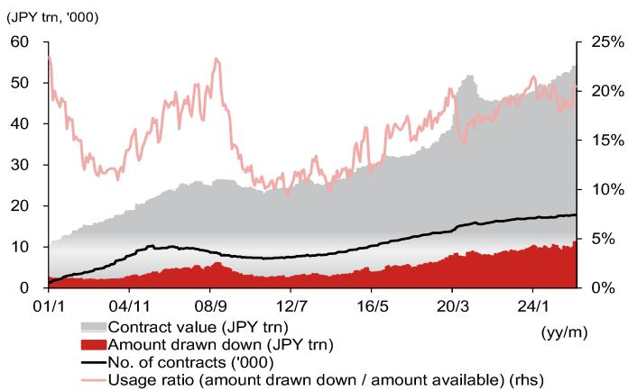

line

| Date   | Contract value (JPY trn) | Amount drawn down (JPY trn) | No. of contracts ('000) | Usage ratio (amount drawn down / amount available) (rhs) |
|--------|--------------------------|------------------------------|--------------------------|-------------------------------------------------------------|
| 01/1   | ~10                      | ~1                           | ~1                       | ~25%                                                        |
| 04/11  | ~15                      | ~2                           | ~3                       | ~20%                                                        |
| 08/9   | ~20                      | ~3                           | ~5                       | ~15%                                                        |
| 12/7   | ~25                      | ~4                           | ~6                       | ~10%                                                        |
| 16/5   | ~30                      | ~5                           | ~7                       | ~15%                                                        |
| 20/3   | ~35                      | ~6                           | ~8                       | ~20%                                                        |
| 24/1   | ~40                      | ~7                           | ~9                       | ~25%                                                        |

Source: NOM, based on BOJ data

# Corporate bankruptcies, interest rates, share prices, macro indicators

Fig. 38: Corporate bankruptcies   
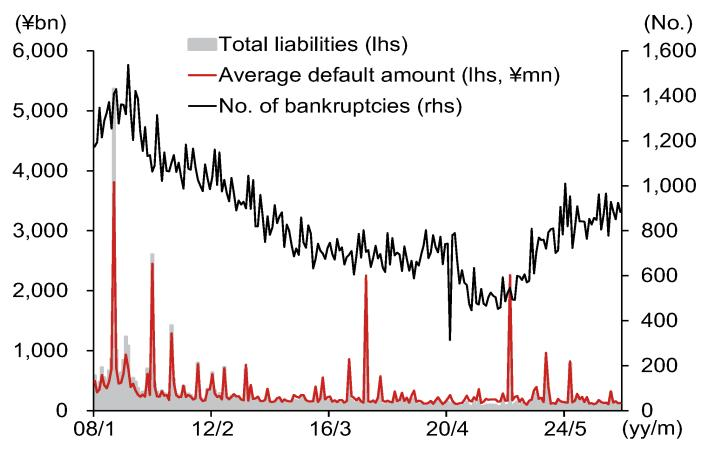

line

| Date   | Total liabilities (lhs) | Average default amount (lhs, ¥mn) | No. of bankruptcies (rhs) |
|--------|------------------------|-----------------------------------|---------------------------|
| 08/1   | ~1,000                 | ~3,800                            | ~1,600                    |
| 12/2   | ~500                   | ~1,500                            | ~1,000                    |
| 16/3   | ~300                   | ~2,200                            | ~800                      |
| 20/4   | ~200                   | ~2,000                            | ~600                      |
| 24/5   | ~100                   | ~1,500                            | ~900                      |

Source: NOM, based on Tokyo Shoko Research data

Fig. 39: Share prices   
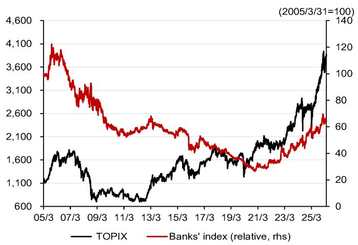

line

| Date   | TOPIX | Banks' index (relative, rhs) |
|--------|-------|------------------------------|
| 05/3   | 1,100 | 140                          |
| 07/3   | 1,600 | 120                          |
| 09/3   | 1,000 | 80                           |
| 11/3   | 800   | 60                           |
| 13/3   | 1,000 | 40                           |
| 15/3   | 1,600 | 20                           |
| 17/3   | 2,100 | 10                           |
| 19/3   | 2,600 | 40                           |
| 21/3   | 3,100 | 60                           |
| 23/3   | 3,600 | 80                           |
| 25/3   | 4,600 | 120                          |

Source: NOM, based on company data

Fig. 40: Yen interest rates   
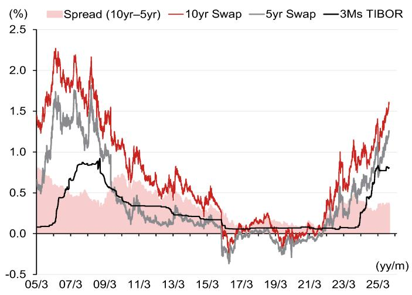

line

| Date   | Spread (10yr-5yr) | 10yr Swap | 5yr Swap | 3Ms TIBOR |
|--------|-------------------|-----------|----------|-----------|
| 05/3   | ~0.6              | ~1.8      | ~1.0     | ~0.0      |
| 07/3   | ~0.4              | ~2.2      | ~1.6     | ~0.8      |
| 09/3   | ~0.3              | ~1.5      | ~1.2     | ~0.6      |
| 11/3   | ~0.2              | ~1.0      | ~0.8     | ~0.4      |
| 13/3   | ~0.1              | ~0.8      | ~0.6     | ~0.3      |
| 15/3   | ~0.0              | ~0.6      | ~0.4     | ~0.2      |
| 17/3   | ~-0.1             | ~0.4      | ~0.2     | ~0.1      |
| 19/3   | ~-0.2             | ~0.2      | ~0.1     | ~0.0      |
| 21/3   | ~-0.1             | ~0.1      | ~0.0     | ~0.0      |
| 23/3   | ~0.1              | ~0.8      | ~0.6     | ~0.4      |
| 25/3   | ~0.4              | ~1.6      | ~1.2     | ~0.8      |

Source: NOM, based on company data

Fig. 41: Bond transactions at city banks   
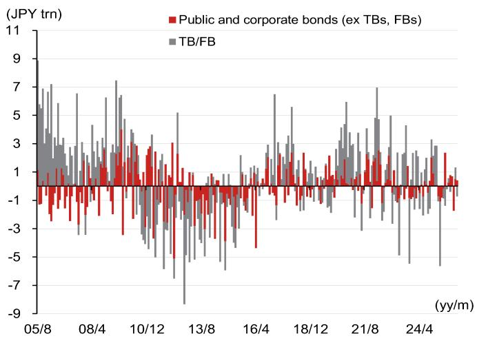

bar_line

| Date   | Public and corporate bonds (ex TBs, FBs) | TB/FB |
|--------|------------------------------------------|-------|
| 05/8   | ~1                                       | ~7    |
| 08/4   | ~3                                       | ~6    |
| 10/12  | ~2                                       | ~5    |
| 13/8   | ~-1                                      | ~-9   |
| 16/4   | ~-3                                      | ~7    |
| 18/12  | ~2                                       | ~5    |
| 21/8   | ~3                                       | ~7    |
| 24/4   | ~2                                       | ~3    |

Source: NOM, based on Japan Securities Dealers Association (JSDA) data

Fig. 42: Bank shareholding purchases   
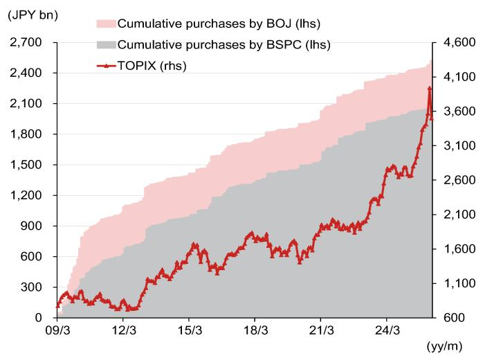

line

| Date   | Cumulative purchases by BOJ (lhs) | Cumulative purchases by BSPC (lhs) | TOPIX (rhs) |
|--------|-----------------------------------|------------------------------------|-------------|
| 09/3   | ~1,000                            | ~500                               | ~100        |
| 12/3   | ~1,200                            | ~700                               | ~150        |
| 15/3   | ~1,400                            | ~900                               | ~200        |
| 18/3   | ~1,600                            | ~1,100                             | ~250        |
| 21/3   | ~1,800                            | ~1,300                             | ~3,00       |
| 24/3   | ~2,000                            | ~1,500                             | ~4,00       |
| 27/3   | ~2,200                            | ~1,700                             | ~4,600      |

Note: BOJ purchases finished at end-April 2010.   
Source: NOM, based on Banks Shareholdings Purchase Corp and BOJ data

Fig. 43: Growth in nominal GDP   
Seasonally adjusted, annualized   
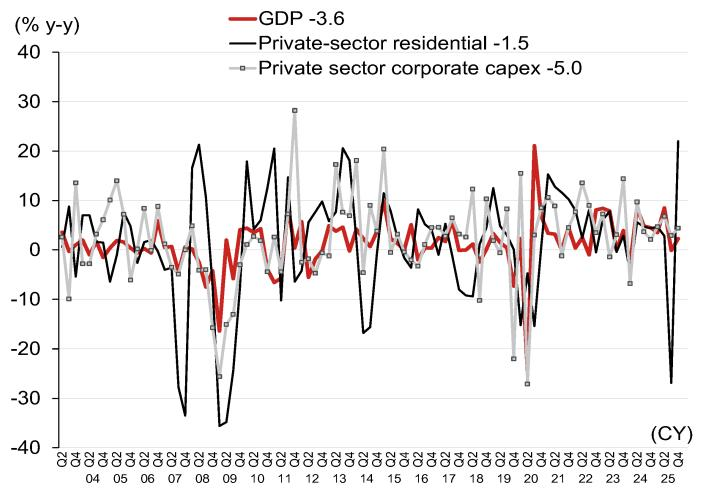

line

| Quarter | GDP   | Private-sector residential | Private sector corporate capex |
|---------|-------|----------------------------|--------------------------------|
| Q2 2024 | -3.6  | -1.5                       | -5.0                           |

Source: Cabinet Office, NOM

Fig. 44: Growth in CPI and domestic corporate goods price index   
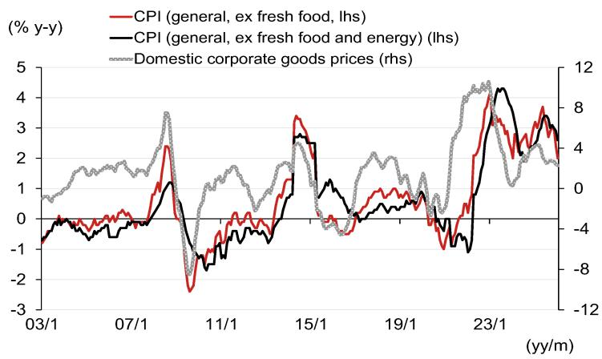

line

| Date   | CPI (general, ex fresh food, lhs) | CPI (general, ex fresh food and energy) (lhs) | Domestic corporate goods prices (rhs) |
|--------|------------------------------------|-----------------------------------------------|---------------------------------------|
| 03/1   | -1.0                               | -1.0                                          | 0.5                                   |
| 07/1   | 2.5                                | 1.5                                           | 3.5                                   |
| 11/1   | -2.0                               | -1.5                                          | -1.0                                  |
| 15/1   | 3.5                                | 2.5                                           | 2.0                                   |
| 19/1   | 0.5                                | 0.0                                           | 1.0                                   |
| 23/1   | 4.0                                | 4.5                                           | 12.0                                  |

Note: For readings for January 2020 onward, year used for weighting calculations updated from 2018 to 2019 in accordance with update to weights for Japan's corporate goods price index using chain-weighted index formula.   
Source: NOM, based on Ministry of Internal Affairs and Communications and BOJ data

# Appendix A-1

This report has been produced by NOM Securities Co., Ltd. (NSC), Japan.

See Disclaimers for NOM Group entity details.

# Analyst Certification

I, Ken Takamiya, hereby certify (1) that the views expressed in this Research report accurately reflect my personal views about any or all of the subject securities or issuers referred to in this Research report, (2) no part of my compensation was, is or will be directly or indirectly related to the specific recommendations or views expressed in this Research report and (3) no part of my compensation is tied to any specific investment banking transactions performed by NOM Securities International, Inc., NOM International plc or any other NOM Group company.

# Important Disclosures

The lists of issuers that are affiliates or sUBSidiaries of NOM Holdings Inc., the parent company of NOM Securities Co., Ltd., issuers that have officers who concurrently serve as officers of NOM Securities Co., Ltd., issuers in which the NOM Group holds 1% or more of any class of common equity securities and issuers for which NOM Securities Co., Ltd. has lead managed a public offering of equity or equity linked securities in the past 12 months are available at https://www.NOMholdings.com/report/. Please contact the Research Production Operation Dept. of NOM Securities Co., Ltd. for additional information.

# Online availability of research and conflict-of-interest disclosures

NOM Group research is available on www.NOMnow.com/research, Bloomberg, Capital IQ, Factset, LSEG.

Important disclosures may be read at http://go.NOMnow.com/research/m/Disclosures or requested from NOM Securities International, Inc. If you have any difficulties with the website, please email qrpsupport@NOM.com for help.

The analysts responsible for preparing this report have received compensation based upon various factors including the firm's total revenues, a portion of which is generated by Investment Banking activities. Unless otherwise noted, the non-US analysts listed at the front of this report are not registered/qualified as research analysts under FINRA rules, may not be associated persons of NSI, and may not be subject to FINRA Rule 2241 restrictions on communications with covered companies, public appearances, and trading securities held by a research analyst account.

NOM Global Financial Products Inc. (NGFP) NOM Derivative Products Inc. (NDP) and NOM International plc. (NIplc) are registered with the Commodities Futures Trading Commission and the National Futures Association (NFA) as swap dealers. NGFP, NDPI, and NIplc are generally engaged in the trading of swaps and other derivative products, any of which may be the subject of this report.

# Distribution of ratings (NOM Group)

The distribution of all ratings published by NOM Group Global Equity Research is as follows:

57% have been assigned a Buy rating which, for purposes of mandatory disclosures, are classified as a Buy rating; 34% of companies with this rating are investment banking clients of the NOM Group\*. 0% of companies (which are admitted to trading on a regulated market in the EEA) with this rating were supplied material services\*\* by the NOM Group.

41% have been assigned a Neutral rating which, for purposes of mandatory disclosures, is classified as a Hold rating; 57% of companies with this rating are investment banking clients of the NOM Group\*. 0% of companies (which are admitted to trading on a regulated market in the EEA) with this rating were supplied material services by the NOM Group

2% have been assigned a Reduce rating which, for purposes of mandatory disclosures, are classified as a Sell rating; 0% of companies with this rating are investment banking clients of the NOM Group\*. 0% of companies (which are admitted to trading on a regulated market in the EEA) with this rating were supplied material services by the NOM Group.

As at 31 March 2026.

\*The NOM Group as defined in the Disclaimer section at the end of this report.

\*\* As defined by the EU Market Abuse Regulation

# Definition of NOM Group's equity research rating system and sectors

The rating system is a relative system, indicating expected performance against a specific benchmark identified for each individual stock, subject to limited management discretion. An analyst's target price is an assessment of the current intrinsic fair value of the stock based on an appropriate valuation methodology determined by the analyst. Valuation methodologies include, but are not limited to, discounted cash flow analysis, expected return on equity and multiple analysis. Analysts may also indicate expected absolute upside/downside relative to the stated target price, defined as (target price - current price)/current price.

# STOCKS

A rating of 'Buy', indicates that the analyst expects the stock to outperform the Benchmark over the next 12 months. A rating of 'Neutral', indicates that the analyst expects the stock to perform in line with the Benchmark over the next 12 months. A rating of 'Reduce', indicates that the analyst expects the stock to underperform the Benchmark over the next 12 months. A rating of 'Suspended', indicates that the rating, target price and estimates have been suspended temporarily to comply with applicable regulations and/or firm policies. Securities and/or companies that are labelled as 'Not rated' or shown as 'No rating' are not in regular research coverage. Investors should not expect continuing or additional information from NOM relating to such securities and/or companies. Benchmarks are as follows: United States/Europe/Asia ex-Japan: please see valuation methodologies for explanations of relevant benchmarks for stocks, which can be accessed at:

http://go.NOMnow.com/research/m/Disclosures; Global Emerging Markets (ex-Asia): MSCI Emerging Markets ex-Asia, unless otherwise stated in the valuation methodology; Japan: Russell/NOM Large Cap.

# SECTORS

A 'Bullish' stance, indicates that the analyst expects the sector to outperform the Benchmark during the next 12 months. A 'Neutral' stance, indicates that the analyst expects the sector to perform in line with the Benchmark during the next 12 months. A 'Bearish' stance, indicates that the analyst expects the sector to underperform the Benchmark during the next 12 months. Sectors that are labelled as 'Not rated' or shown as 'N/A' are not assigned ratings. Benchmarks are as follows: United States: S&P 500; Europe: Dow Jones STOXX 600; Global Emerging Markets (ex-Asia): MSCI Emerging Markets ex-Asia. Japan/Asia ex-Japan: Sector ratings are not assigned.

# Target Price

A Target Price, if discussed, indicates the analyst's forecast for the share price with a 12-month time horizon, reflecting in part the analyst's estimates for the company's earnings. The achievement of any target price may be impeded by general market and macroeconomic trends, and by other risks related to the company or the market, and may not occur if the company's earnings differ from estimates.

# Disclaimers

This publication contains material that has been prepared by the NOM Group entity identified on page 1 and, if applicable, with the contributions of one or more NOM Group entities whose employees and their respective affiliations are specified on page 1 or identified elsewhere in this publication. The term "NOM Group" used herein refers to NOM Holdings, Inc. and its affiliates and sUBSidiaries including: (a) NOM Securities Co., Ltd. ('NSC') Tokyo, Japan, (b) NOM Financial Products Europe GmbH ('NFPE'), Germany, (c) NOM International plc ('NIplc'), UK, (d) NOM Securities International, Inc. ('NSI'), New York, US, (e) NOM International (Hong Kong) Ltd. ('NIHK'), Hong Kong, (f) NOM Financial Investment (Korea) Co., Ltd. ('NFIK'), Korea (Information on NOM analysts registered with the Korea Financial Investment Association ('KOFIA') can be found on the KOFIA Intranet at http://dis.kofia.or.kr, (g) NOM Singapore Ltd. ('NSL'), Singapore (Registration number 197201440E, regulated by the Monetary Authority of Singapore) (h) NOM Australia Ltd. ('NAL'), Australia (ABN 48 003 032 513), regulated by the Australian Securities and Investment Commission ('ASIC') and holder of an Australian financial services licence number 246412, (i) NOM Securities Malaysia Sdn. Bhd. ('NSM'), Malaysia, (j) NIHK, Taipei Branch ('NITB'), Taiwan, (k) NOM Financial Advisory and Securities (India) Private Limited ('NFASL'), Mumbai, India (Registered Address: Ceejay House, Level 11, Plot F, Shivsagar Estate, Dr. Annie Besant Road, Worli, Mumbai- 400 018, India; Tel: 91 22 4037 4037, Fax: 91 22 4037 4111; CIN No: U74140MH2007PTC169116, SEBI Registration No. for Stock Broking activities : INZ000255633; SEBI Registration No. for Merchant Banking : INM000011419; SEBI Registration No. for Research: INH000001014 - Compliance Officer: Ms. Pratiksha Tondwalkar, 91 22 40374904, grievance email: investorgrievancesra@NOM.com Webpage:\_LINK

For reports with respect to Indian public companies or authored by India-based NFASL research analysts: (i) Investment in securities markets is subject to market risks. Read all the related documents carefully before investing. (ii) Registration granted by SEBI, and certification from NISM in no way guarantee performance of the intermediary or provide any assurance of returns to investors. (iii) NFASL terms and conditions for availing research services is disclosed on NFASL webpage.

(I) NOM Fiduciary Research & Consulting Co., Ltd. ('NFRC') Tokyo, Japan. (m) NOM Orient International Securities Co., Ltd ("NOI"), is a majority owned joint venture amongst NOM Group, Orient International (Holding) Co., Ltd, and Shanghai Huangpu Investment Holding (Group) Co., Ltd. In accordance with the laws of the People's Republic of China ("PRC", excluding Hong Kong, Macau and Taiwan, for the purpose of this document), NOI is licensed in the PRC to provide securities research and investment recommendations and it operates independently from the other members of the NOM Group; in particular, NOI's interests in PRC securities are not disclosed to, or aggregated with the holdings of, any other NOM Group entities and the interests in PRC securities of other NOM Group entities are not disclosed to, or aggregated with the holdings of, NOI. An individual name printed next to NOI on the front page of a research report indicates that individual is employed by NOI to provide research assistance to NIHK under a research partnership agreement. 'NSFSPL' next to an employee's name on the front page of a research report indicates that the individual is employed by NOM Structured Finance Services Private Limited to provide assistance to certain NOM entities under inter-company agreements. 'Verdhana' next to an individual's name on the front page of a research report indicates that the individual is employed by PT Verdhana Sekuritas Indonesia ('Verdhana') to provide research assistance to NIHK under a research partnership agreement and neither Verdhana nor such individual is licensed outside of Indonesia.

THIS MATERIAL IS: (I) FOR YOUR PRIVATE INFORMATION, AND WE ARE NOT SOLICitiNG ANY ACTION BASED UPON IT; (II) NOT TO BE CONSTRUED AS AN OFFER TO SELL OR A SOLICITATION OF AN OFFER TO BUY ANY SECURITIES IN ANY JURISDICTION WHERE SUCH OFFER OR SOLICITATION WOULD BE ILLEGAL; AND (III) OTHER THAN DISCLOSURES RELATING TO THE NOM GROUP, BASED UPON INFORMATION FROM SOURCES THAT WE CONSIDER RELIABLE, BUT HAS NOT BEEN INDEPENDENTLY VERIFIED BY NOM GROUP.

Other than disclosures relating to the NOM Group, the NOM Group does not warrant, represent or undertake, express or implied, that the document is fair, accurate, complete, correct, reliable or fit for any particular purpose or merchantable, and to the maximum extent permissible by law and/or regulation, does not accept liability (in negligence or otherwise, and in whole or in part) for any act (or decision not to act) resulting from use of this document and related data. To the maximum extent permissible by law and/or regulation, all warranties and other assurances by the NOM Group are hereby excluded and the NOM Group shall have no liability (in negligence or otherwise, and in whole or in part) for any loss howsoever arising from the use, misuse, or distribution of this material or the information contained in this material or otherwise arising in connection therewith.

Opinions or estimates expressed are current opinions as of the original publication date appearing on this material and the information, including the opinions and estimates contained herein, are subject to change without notice. The NOM Group, however, expressly disclaims any obligation, and therefore is under no duty, to update or revise this document. Any comments or statements made herein are those of the author(s) and may differ from views held by other parties within NOM Group. Clients should consider whether any advice or recommendation in this report is suitable for their particular circumstances and, if appropriate, seek professional advice, including tax advice. The NOM Group does not provide tax advice.

The NOM Group, and/or its officers, directors, employees and affiliates, may, to the extent permitted by applicable law and/or regulation, deal as principal, agent, or otherwise, or have long or short positions in, or buy or sell, the securities, commodities or instruments, or options or other derivative instruments based thereon, of issuers or securities mentioned herein. The NOM Group companies may also act as market maker or liquidity provider (within the meaning of applicable regulations in the UK) in the financial instruments of the issuer. Where the activity of market maker is carried out in accordance with the definition given to it by specific laws and regulations of the US or other jurisdictions, this will be separately disclosed within the specific issuer disclosures.

This document may contain information obtained from third parties, including, but not limited to, ratings from credit ratings agencies such as Standard & Poor's. The NOM Group hereby expressly disclaims all representations, warranties or undertakings of originality, fairness, accuracy, completeness, correctness, merchantability or fitness for a particular purpose with respect to any of the information obtained from third parties contained in this material or otherwise arising in connection therewith, and shall not be liable (in negligence or otherwise, and in whole or in part) for any direct, indirect, incidental, exemplary, compensatory, punitive, special or consequential damages, costs, expenses, legal fees, or losses (including lost income or profits and opportunity costs) in connection with any use or misuse of any of the information obtained from third parties contained in this material or otherwise arising in connection therewith. Reproduction and distribution of third-party content in any form is prohibited except with the prior written permission of the related third-party. Third-party content providers do not, express or implied, guarantee the fairness, accuracy, completeness, correctness, timeliness or availability of any information, including ratings, and are not in any way responsible for any errors or omissions (negligent or otherwise), regardless of the cause, or for the results obtained from the use or misuse of such content. Third-party content providers give no express or implied warranties, including, but not limited to, any warranties of merchantability or fitness for a particular purpose or use. Third-party content providers shall not be liable (in negligence or otherwise, and in whole or in part) for any direct, indirect, incidental, exemplary, compensatory, punitive, special or consequential damages, costs, expenses, legal fees, or losses (including lost income or profits and opportunity costs) in connection with any use or misuse of their content, including ratings. Credit ratings are statements of opinions and are not statements of fact or recommendations to purchase hold or sell securities. They do not address the suitability of securities or the suitability of securities for investment purposes, and should not be relied on as investment advice. Any MSCI sourced information in this document is the exclusive property of MSCI Inc. ('MSCI'). Without prior written permission of MSCI, this information and any other MSCI intellectual property may not be duplicated, reproduced, re-disseminated, redistributed or used, in whole or in part, for any purpose whatsoever, including creating any financial products and any indices. This information is provided on an "as is" basis. The user assumes the entire risk of any use made of this information. MSCI, its affiliates and any third party involved in, or related to, computing or compiling the information hereby expressly disclaim all representations, warranties or undertakings of originality, fairness, accuracy, completeness, correctness, merchantability or fitness for a particular purpose with respect to any of this material or the information contained in this material or otherwise arising in connection therewith. Without limiting any of the foregoing, in no event shall MSCI, any of its affiliates or any third party involved in, or related to, computing or compiling the information have any liability (in negligence or otherwise, and in whole or in part) for any damages of any kind. MSCI and the MSCI indexes are services marks of MSCI and its affiliates.

The intellectual property rights and any other rights, in Russell/NOM Japan Equity Index belong to NOM Fiduciary Research & Consulting Co., Ltd. ("NFRC") and FTSE Russell ("Russell"). NFRC and Russell do not guarantee fairness, accuracy, completeness, correctness, reliability, usefulness, marketability, merchantability or fitness of the Index, and do not account for business activities or services that any index user and/or its affiliates undertakes with the use of the Index.

Investors should consider this document as only a single factor in making their investment decision and, as such, the report should not be viewed as identifying or suggesting all risks, direct or indirect, that may be associated with any investment decision. NOM Group produces a number of different types of research product including, among others, fundamental analysis and quantitative analysis; recommendations contained in one type of research product may differ from recommendations contained in other types of research product, whether as a result of differing time horizons, methodologies or otherwise. The NOM Group publishes research product in a number of different ways including the posting of product on the NOM Group portals and/or distribution directly to clients. Different groups of clients may receive different products and services from the research department depending on their individual requirements.

Figures presented herein may refer to past performance or simulations based on past performance which are not reliable indicators of future or likely performance. Where the information contains an expectation, projection or indication of future performance and business prospects, such forecasts may not be a reliable indicator of future or likely performance. Moreover, simulations are based on models and simplifying assumptions which may oversimplify and not reflect the future distribution of returns. Any figure, strategy or index created and published for illustrative purposes within this document is not intended for “use” as a “benchmark” as defined by the European Benchmark Regulation. Certain securities are subject to fluctuations in exchange rates that could have an adverse effect on the value or price of, or income derived from, the investment.

With respect to Fixed Income Research: Recommendations fall into two categories: tactical, which typically last up to three months; or strategic, which typically last from 6-12 months. However, trade recommendations may be reviewed at any time as circumstances change. 'Stop loss' levels for trades are also provided; which, if hit, closes the trade recommendation automatically. Prices and yields shown in recommendations are taken at the time of submission for publication and are based on either indicative Bloomberg, LSEG or NOM prices and yields at that time. The prices and yields shown are not necessarily those at which the trade recommendation can be implemented.

The securities described herein may not have been registered under the US Securities Act of 1933 (the '1933 Act'), and, in such case, may not be offered or sold in the US or to US persons unless they have been registered under the 1933 Act, or except in compliance with an exemption from the registration requirements of the 1933 Act. Unless governing law permits otherwise, any transaction should be executed via a NOM entity in your home jurisdiction.

This document has been approved for distribution in the UK as investment research by NIplc. NIplc is authorised by the Prudential Regulation Authority and regulated by the Financial Conduct Authority and the Prudential Regulation Authority. NIplc is a member of the London Stock Exchange. This document does not constitute a personal recommendation within the meaning of applicable regulations in the UK, or take into account the particular investment objectives, financial situations, or needs of individual investors. This document is intended only for investors who are 'eligible counterparties' or 'professional clients' for the purposes of applicable regulations in the UK, and may not, therefore, be redistributed to persons who are 'retail clients' for such purposes.

This document has been approved for distribution in the European Economic Area as investment research by NOM Financial Products Europe GmbH (“NFPE”). NFPE is a company organized as a limited liability company under German law registered in the Commercial Register of the Court of Frankfurt/Main under HRB 110223. NFPE is authorized and regulated by the German Federal Financial Supervisory Authority (BaFin).

This document has been approved by NIHK, which is regulated by the Hong Kong Securities and Futures Commission, for distribution in Hong Kong by NIHK. This document is intended only for investors who are 'professional investors' for the purposes of applicable regulations in Hong Kong and may not, therefore, be redistributed to persons who are not 'professional investors' for such purposes.

This document has been approved for distribution in Australia by NAL, which is authorized and regulated in Australia by the ASIC.

This document has also been approved for distribution in Malaysia by NSM.

In Singapore, this document has been distributed by NSL, an exempt financial adviser as defined under the Financial Advisers Act (Chapter 110), among other things, and regulated by the Monetary Authority of Singapore. NSL may distribute this document produced by its foreign affiliates pursuant to an arrangement under Regulation 32C of the Financial Advisers Regulations. This document is intended for accredited, expert or institutional investors as defined by the Securities and Futures Act (Chapter 289). Where the recipient of this document is not an accredited, expert or institutional investor, NSL accepts legal responsibility for the contents of this document in respect of such recipient only to the extent required by law. Recipients of this document in Singapore should contact NSL in respect of matters arising from, or in connection with, this document. THIS DOCUMENT IS INTENDED FOR GENERAL CIRCULATION. IT DOES NOT TAKE INTO ACCOUNT THE SPECIFIC INVESTMENT OBJECTIVES, FINANCIAL SITUATION OR PARTICULAR NEEDS OF ANY PARTICULAR PERSON. RECIPIENTS SHOULD TAKE INTO ACCOUNT THEIR SPECIFIC INVESTMENT OBJECTIVES, FINANCIAL SITUATION OR PARTICULAR NEEDS BEFORE MAKING A COMMITMENT TO PURCHASE ANY SECURITIES, INCLUDING SEEKING ADVICE FROM AN INDEPENDENT FINANCIAL ADVISER REGARDING THE SUITABILITY OF THE INVESTMENT, UNDER A SEPARATE ENGAGEMENT, AS THE RECIPIENT DEEMS FIT. Unless prohibited by the provisions of Regulation S of the 1933 Act, this material is distributed in the US, by NSI, a US-registered broker-dealer, which accepts responsibility for its contents in accordance with the provisions of Rule 15a-6, under the US Securities Exchange Act of 1934. The entity that prepared this document permits its separately operated affiliates within the NOM Group to make copies of such documents available to their clients.

This document has not been approved for distribution to persons other than ‘Authorised Persons’, ‘Exempt Persons’ or ‘Institutions’ (as defined by the Capital Markets Authority) in the Kingdom of Saudi Arabia (‘Saudi Arabia’) or a ‘Market Counterparty’ or a ‘Professional Client’ (as defined by the Dubai Financial Services Authority) in the United Arab Emirates (‘UAE’) or a ‘Market Counterparty’ or a ‘Business Customer’ (as defined by the Qatar Financial Centre Regulatory Authority) in the State of Qatar (‘Qatar’) by NOM Saudi Arabia, NIplc or any other member of the NOM Group, as the case may be. Neither this document nor any copy thereof may be taken or transmitted or distributed, directly or indirectly, by any person other than those authorised to do so into Saudi Arabia or in the UAE or in Qatar or to any person other than ‘Authorised Persons’, ‘Exempt Persons’ or ‘Institutions’ located in Saudi Arabia or a ‘Market Counterparty’ or a ‘Professional Client’ in the UAE or a ‘Market Counterparty’ or a ‘Business Customer’ in Qatar. Any failure to comply with these restrictions may constitute a violation of the laws of the UAE or Saudi Arabia or Qatar.

For report with reference of TAIWAN public companies or authored by Taiwan based research analyst:

THIS DOCUMENT IS SOLELY FOR REFERENCE ONLY. You should independently evaluate the investment risks and are solely responsible for your investment decisions. NO PORTION OF THE REPORT MAY BE REPRODUCED OR QUOTED BY THE PRESS OR ANY OTHER PERSON WITHOUT WRITTEN AUTHORIZATION FROM NOM GROUP. Pursuant to Operational Regulations Governing Securities Firms Recommending Trades in Securities to Customers and/or other applicable laws or regulations in Taiwan, you are prohibited to provide the reports to others (including but not limited to related parties, affiliated companies and any other third parties) or engage in any activities in connection with the reports which may involve conflicts of interests. INFORMATION ON SECURITIES / INSTRUMENTS NOT EXECUTABLE BY NOM INTERNATIONAL (HONG KONG) LTD., TAIPEI BRANCH IS FOR INFORMATIONAL PURPOSES ONLY AND IS NOT BE CONSTRUED AS A RECOMMENDATION OR A SOLICITATION TO TRADE IN SUCH SECURITIES / INSTRUMENTS.

This material may not be distributed in Indonesia or passed on within the territory of the Republic of Indonesia or to persons who are Indonesian Citizens (wherever they are domiciled or located) or entities of or residents in Indonesia in a manner which constitutes a public offering under the laws of the Republic of Indonesia. The securities mentioned in this document may not be offered or sold in Indonesia or to persons who are Citizens of Indonesia (wherever they are domiciled or located) or entities of or residents in Indonesia in a manner which constitutes a public offering under the laws of the Republic of Indonesia.

An individual name printed next to NOI on the front page of a research report indicates that this document is a translation of a research report issued by NOI in the PRC. In all other cases, this document is prepared by NOM Group or its sUBSidiary or affiliate (collectively, “Offshore Issuers”) that is not licensed in the PRC to provide securities research. This research report is not approved or intended to be circulated in the PRC. The A-share related analysis (if any) is not produced for any persons located or incorporated in the PRC. The recipients should not rely on any information contained in this research report in making investment decisions and Offshore Issuers take no responsibility in this regard. NO PART OF THIS MATERIAL MAY BE (I) COPIED, PHOTOCOPIED, REPRODUCED OR DUPLICATED IN ANY FORM, BY ANY MEANS; OR (II) REDISSEMINATED, REPUBLISHED OR REDISTRIBUTED WITHOUT THE PRIOR WRITTEN CONSENT OF A MEMBER OF THE NOM GROUP. If this document has been distributed by electronic transmission, such as e-mail, then such transmission cannot be

guaranteed to be secure or error-free as information could be intercepted, corrupted, lost, destroyed, arrive late or incomplete, or contain viruses. The sender therefore does not accept liability (in negligence or otherwise, and in whole or in part) for any errors or omissions in the contents of this document, which may arise as a result of electronic transmission. If verification is required, please request a hard-copy version.

# Disclaimers required in Japan

Credit ratings in the text that are marked with an asterisk (\*) are issued by a rating agency not registered under Japan's Financial Instruments and Exchange Act (“Unregistered Ratings”). For details on Unregistered Ratings, please contact the Research Production Operation Dept. of NOM Securities Co., Ltd.

Investors in the financial products offered by NOM Securities may incur fees and commissions specific to those products (for example, transactions involving Japanese equities are subject to a sales commission (all figures on a tax-inclusive basis) of up to 1.43% of the transaction amount or a commission of ¥2,860 for transactions of ¥200,000 or less, while transactions involving investment trusts are subject to various fees, such as commissions at the time of purchase and asset management fees, such as commissions at the time of purchase and asset management fees (trust fees), specific to each investment trust).

In addition, all products carry the risk of losses owing to price fluctuations or other factors. Fees and risks vary by product. Please thoroughly read the written materials provided, such as documents delivered before making a contract, listed securities documents, or prospectuses. Transactions involving Japanese equities (including Japanese REITs, Japanese ETFs, and Japanese ETNs, Japanese Infrastructure Funds) are subject to a sales commission of up to 1.43% (tax included) of the transaction amount (or a commission of ¥2,860 (tax included) for transactions of ¥200,000 or less). When Japanese equities are purchased via OTC transactions (including offerings), only the purchase price shall be paid, with no sales commission charged. However, NOM Securities may charge a separate fee for OTC transactions, as agreed with the customer. Japanese equities carry the risk of losses owing to price fluctuations. Japanese REITs carry the risk of losses owing to fluctuations in price and/or earnings of underlying real estate. Japanese ETFs and ETNs carry the risk of losses owing to fluctuations in the underlying indexes or other benchmarks. Japanese Infrastructure Funds carry out the risk of losses owing to fluctuations in price and/or earnings of underlying infrastructures.

Transactions involving foreign equities are subject to a domestic sales commission of up to 1.045% (tax included) of the transaction amount (which equals the local transaction amount plus local fees and taxes in the case of a purchase or the local transaction amount minus local fees and taxes in the case of a sale) (for transaction amounts of ¥750,000 and below, maximum domestic sales commission is ¥7,810 (tax included)). Local fees and taxes in foreign financial instruments markets vary by country/territory. When foreign equities are purchased via OTC transactions (including offerings), only the purchase price shall be paid, with no sales commission charged. However, NOM Securities may charge a separate fee for OTC transactions, as agreed with the customer. Foreign equities carry the risk of losses owing to factors such as price fluctuations and foreign exchange rate fluctuations.

Margin transactions are subject to a sales commission of up to 1.43% (tax included) of the transaction amount (or a commission of ¥2,860 (tax included) for transactions of ¥200,000 or less), as well as management fees and rights handling fees. In addition, long margin transactions are subject to interest on the purchase amount, while short margin transactions are subject to fees for the lending of the shares borrowed. A margin equal to at least 30% of the transaction amount (at least 33% for online transactions) and at least ¥300,000 is required. With margin transactions, an amount up to roughly 3.3x the margin (roughly 3x for online transactions) may be traded. Margin transactions therefore carry the risk of losses in excess of the margin owing to share price fluctuations. For details, please thoroughly read the written materials provided, such as listed securities documents or documents delivered before making a contract.

Transactions involving convertible bonds are subject to a sales commission of up to 1.10% (tax included) of the transaction amount (or a commission of ¥4,400 (tax included) if this would be less than ¥4,400). When convertible bonds are purchased via OTC transactions (including offerings), only the purchase price shall be paid, with no sales commission charged. However, NOM Securities may charge a separate fee for OTC transactions, as agreed with the customer. Convertible bonds carry the risk of losses owing to factors such as interest rate fluctuations and price fluctuations in the underlying stock. In addition, convertible bonds denominated in foreign currencies also carry the risk of losses owing to factors such as foreign exchange rate fluctuations.

When bonds are purchased via public offerings, secondary distributions, or other OTC transactions with NOM Securities, only the purchase price shall be paid, with no sales commission charged. Bonds carry the risk of losses, as prices fluctuate in line with changes in market interest rates. Bond prices may also fall below the invested principal as a result of such factors as changes in the management and financial circumstances of the issuer, or changes in third-party valuations of the bond in question. In addition, foreign currency-denominated bonds also carry the risk of losses owing to factors such as foreign exchange rate fluctuations.

When Japanese government bonds (JGBs) for individual investors are purchased via public offerings, only the purchase price shall be paid, with no sales commission charged. As a rule, JGBs for individual investors may not be sold in the first 12 months after issuance. When JGBs for individual investors are sold before maturity, an amount calculated via the following formula will be subtracted from the par value of the bond plus accrued interest: (1) for 10-year variable rate bonds, an amount equal to the two preceding coupon payments (before tax) x 0.79685 will be used, (2) for 5-year and 3-year fixed rate bonds, an amount equal to the two preceding coupon payments (before tax) x 0.79685 will be used. When inflation-indexed JGBs are purchased via public offerings, secondary distributions (uridashi deals), or other OTC transactions with NOM Securities, only the purchase price shall be paid, with no sales commission charged. Inflation-indexed JGBs carry the risk of losses, as prices fluctuate in line with changes in market interest rates and fluctuations in the nationwide consumer price index. The notional principal of inflation-indexed JGBs changes in line with the rate of change in nationwide CPI inflation from the time of its issuance. The amount of the coupon payment is calculated by multiplying the coupon rate by the notional principal at the time of payment. The maturity value is the amount of the notional principal when the issue becomes due. For JI17 and sUBSequent issues, the maturity value shall not undercut the face amount. Purchases of investment trusts (and sales of some investment trusts) are subject to a purchase or sales fee of up to 5.5% (tax included) of the transaction amount. Also, a direct cost that may be incurred when selling investment trusts is a fee of up to 2.0% of the unit price at the time of redemption. Indirect costs that may be incurred during the course of holding investment trusts include, for domestic investment trusts, an asset management fee (trust fee) of up to 5.5% (tax included/annualized basis) of the net assets in trust, as well as fees based on investment

performance. Other indirect costs may also be incurred. For foreign investment trusts, indirect fees may be incurred during the course of holding such as investment company compensation.

Investment trusts invest mainly in securities such as Japanese and foreign equities and bonds, whose prices fluctuate. Investment trust unit prices fluctuate owing to price fluctuations in the underlying assets and to foreign exchange rate fluctuations. As such, investment trusts carry the risk of losses. Fees and risks vary by investment trust. Maximum applicable fees are subject to change; please thoroughly read the written materials provided, such as prospectuses or documents delivered before making a contract.

In interest rate swap transactions and USD/JPY basis swap transactions (“interest rate swap transactions, etc.”), only the agreed transaction payments shall be made on the settlement dates. Some interest rate swap transactions, etc. may require pledging of margin collateral. In some of these cases, transaction payments may exceed the amount of collateral. There shall be no advance notification of required collateral value or collateral ratios as they vary depending on the transaction. Interest rate swap transactions, etc. carry the risk of losses owing to fluctuations in market prices in the interest rate, currency and other markets, as well as reference indices. Losses incurred as such may exceed the value of margin collateral, in which case margin calls may be triggered. In the event that both parties agree to enter a replacement (or termination) transaction, the interest rates received (paid) under the new arrangement may differ from those in the original arrangement, even if terms other than the interest rates are identical to those in the original transaction. Risks vary by transaction. Please thoroughly read the written materials provided, such as documents delivered before making a contract and disclosure statements.

In OTC transactions of credit default swaps (CDS), no sales commission will be charged. When entering into CDS transactions, the protection buyer will be required to pledge or entrust an agreed amount of margin collateral. In some of these cases, the transaction payments may exceed the amount of margin collateral. There shall be no advance notification of required collateral value or collateral ratios as they vary depending on the financial position of the protection buyer. CDS transactions carry the risk of losses owing to changes in the credit position of some or all of the referenced entities, and/or fluctuations of the interest rate market. The amount the protection buyer receives in the event that the CDS is triggered by a credit event may undercut the total amount of premiums that he/she has paid in the course of the transaction. Similarly, the amount the protection seller pays in the event of a credit event may exceed the total amount of premiums that he/she has received in the transaction. All other conditions being equal, the amount of premiums that the protection buyer pays and that received by the protection seller shall differ. In principle, CDS transactions will be limited to financial instruments business operators and qualified institutional investors. Transfers of equities to another securities company via the Japan Securities Depository Center are subject to a transfer fee of up to ¥11,000 (tax included) per issue transferred depending on volume. No account fee will be charged for marketable securities or monies deposited.

# NOM Securities Co., Ltd.

Financial instruments firm registered with the Kanto Local Finance Bureau (registration No. 142)

Member associations: Japan Securities Dealers Association; Investment Management Association of Japan; The Financial Futures Association of Japan; Type II Financial Instruments Firms Association; and Japan Security Token Offering Association.

The NOM Group manages conflicts with respect to the production of research through its compliance policies and procedures (including, but not limited to, Conflicts of Interest, Chinese Wall and Confidentiality policies) as well as through the maintenance of Chinese Walls and employee training.

Additional information regarding the methodologies or models used in the production of any investment recommendations contained within this document is available upon request by contacting the Research Analysts of NOM listed on the front page. Disclosures information is available upon request and disclosure information is available at the NOM Disclosure web page:

http://go.NOMnow.com/research/m/Disclosures

Copyright © 2026 NOM Securities Co., Ltd., Japan. All rights reserved.