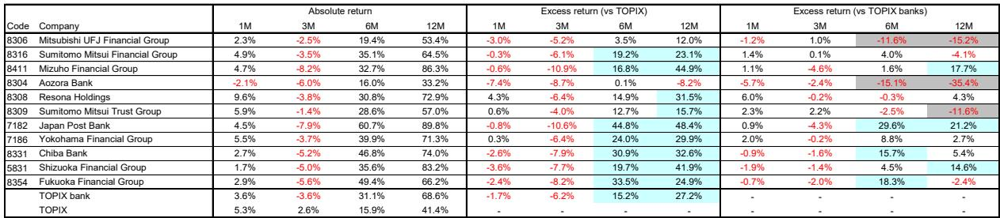
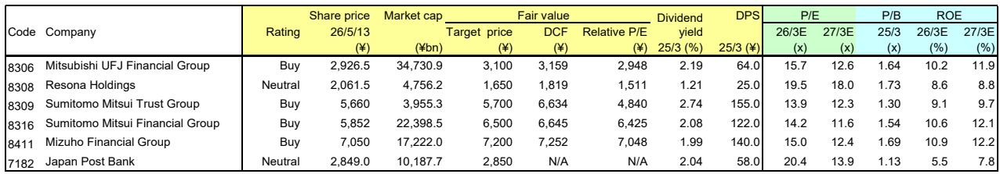

# Japanese Banks Are Entering a Structural Lending Boom That Markets Have Not Yet Priced

The conventional narrative that Japanese bank stocks are merely a play on Bank of Japan rate hikes is becoming dangerously incomplete. Over the past month, bank stocks have seesawed wildly, underperforming the TOPIX by 1.7 percentage points, as traders oscillated between hopes for tightening and disappointment when those hopes faded. But beneath this noise, a far more consequential story is unfolding. The early results from the 26/3 fiscal year announcements, still in progress through mid-May, reveal something that the market's fixation on monetary policy is missing: Japanese banks are experiencing a genuine structural expansion in their core lending business, driven by forces that have little to do with the policy rate.

This is not a cyclical recovery that will reverse when the next BOJ decision disappoints. The data from major and regional banks show that loan-deposit operations are performing better than expected, supported not only by improving spreads but by robust growth in loan volumes, particularly in corporate lending. The drivers are multiple and durable: capital expenditure linked to digital transformation and green transformation, supply chain shifts driven by geopolitical realignment, borrowing for corporate value improvement through LBOs and M&A, and investments to address structural labor shortages. These are not the kind of demand that vanishes when a central bank holds rates steady.

The investment community has been slow to adjust. The QUICK survey of institutional positioning in Japanese financial stocks shows that net overweight has remained modest despite a 12-month absolute return of 68.6% for the TOPIX bank index. This suggests skepticism that the earnings improvement is sustainable. But the pattern emerging from the results announcements argues the opposite: guidance for 27/3 is more bullish than in past years, both in terms of profit growth and in terms of divergence from consensus forecasts. The market may be systematically underestimating the durability of the current cycle.

This article argues that investors need to reframe their approach to Japanese banks. The old model, which treated bank stocks as leveraged proxies for the yield curve, is no longer adequate. The new reality demands a framework that separates the cyclical noise of BOJ speculation from the structural transformation of Japan's corporate lending market. The banks that understand this distinction will outperform; those that do not will be whipsawed by every policy rumor.

## The Market Is Mistaking a Structural Shift for a Monetary Policy Proxy

The past month's price action in Japanese bank stocks is a textbook case of the market looking at the wrong variable. Bank stocks fell through late April as expectations for a BOJ rate hike receded, following comments from the Minister of Finance and a Nikkei report suggesting the policy rate would remain unchanged at 0.75%. Then bank stocks outperformed through mid-May after reports emerged that three policy board members had opposed the hold decision and the Outlook Report carried hawkish language. The seesaw pattern is clear: the market is treating bank stocks as a derivative of central bank communication.

But this framing misses the point. Japanese government bond yields have been on an essentially constant upward trajectory over the past month, yet bank stocks underperformed the broad market. If the old interest rate sensitivity model were correct, rising yields should have been unequivocally positive. The fact that they were not tells us that the market is pricing in something more complex than simple duration exposure.

What the results announcements reveal is that the real story is in loan volumes, not just spreads. The improvement in loan-deposit operations is being driven by strong growth in loans outstanding, particularly in the corporate sector. This is not a narrow phenomenon. The report identifies multiple structural drivers: capex linked to DX and GX investment, supply chain reconfiguration due to geopolitical factors, borrowings for corporate value improvement including LBOs and MBOs, and investment to cope with labor shortages. Many bank executives expect these structural funding needs to remain in place for the foreseeable future.

The so-what here is critical. If the market continues to price Japanese banks based on rate hike expectations, it will miss the earnings momentum coming from volume growth that is largely independent of the policy rate. The banks that benefit most from this structural lending demand may not be the same ones that benefit most from a steepening yield curve. Investors need to recalibrate their valuation models accordingly.

## The 26/3 Results Reveal a Widening Capability Gap in Portfolio Management

One of the most important findings from the early results cycle is the widening disparity among banks in securities portfolio management skills. This is not a trivial detail. In an environment where interest rates are rising and the BOJ is gradually normalizing policy, the ability to manage a securities portfolio actively has become a source of competitive differentiation.

The report notes that many banks made progress in improving the health of their balance sheets, including unrealized gains on securities, despite rising rates. But this progress is not uniform. Some banks have clearly demonstrated superior execution in navigating the transition from yield curve control to a more market-driven rate environment. Others are lagging.

This disparity has direct implications for relative performance. In the 12-month excess return data versus TOPIX banks, the dispersion is striking. Mizuho Financial Group has outperformed the sector by 17.7 percentage points, while Aozora Bank has underperformed by 35.4 percentage points. Japan Post Bank has outperformed by 21.2 percentage points. These are not random outcomes. They reflect fundamental differences in business model, portfolio management capability, and exposure to the structural lending trends.

For investors, this means that a passive approach to the Japanese bank sector is increasingly inadequate. The sector is no longer a homogeneous group that moves in lockstep with the yield curve. Stock selection based on portfolio management quality, lending franchise strength, and balance sheet health is becoming the dominant driver of returns.

## Cyclical and Structural Forces Are Converging to Create a Multi-Year Lending Cycle

The report identifies an important development that deserves more attention than it has received: the compounding of structural lending demand with cyclical factors. During previous periods of financial market turmoil, such as the global financial crisis and the COVID-19 pandemic, companies built up liquidity on hand through working capital borrowings. The same pattern is now emerging in response to the situation in the Middle East.

The data show that usage of commitment lines has increased both in terms of value and usage rates. This is a cyclical overlay on top of what is already a structurally robust lending environment. The combination is powerful. Companies are borrowing for long-term investment in transformation and productivity, and simultaneously drawing on credit lines for precautionary liquidity.

This dual dynamic has important implications for earnings sustainability. The cyclical component may moderate if geopolitical tensions ease, but the structural drivers are likely to persist. The report notes that many bank executives expect the structural funding needs to remain in place for the time being. If they are correct, the current lending cycle has a longer runway than the market is pricing.

The risk is that the market will treat any normalization of geopolitical tensions as a negative for bank stocks, failing to distinguish between the cyclical and structural components of loan growth. Investors who can make this distinction will have a significant advantage.

## What the Report Does Not Fully Answer: How Persistent Is the Volume Growth, and Which Banks Are Best Positioned?

The report provides a compelling case for the structural nature of current lending demand, but it leaves several important questions unanswered. First, how persistent are the structural drivers? Digital transformation and green transformation investment cycles typically last several years, but they are not infinite. Supply chain shifts can accelerate or decelerate based on policy changes. The report does not provide a framework for stress-testing these drivers under different macroeconomic scenarios.

Second, the report identifies widening disparities in portfolio management skills but does not fully specify which banks are best positioned to benefit from the structural lending trends. The valuation data shows that some banks trade at P/B ratios above 1.6x while others trade below 1.2x. The ROE projections for 27/3 range from 7.8% to 12.2%. These differences are meaningful, but the report does not provide a systematic framework for linking portfolio management capability to future earnings power.

Third, the interaction between rising rates and loan volumes is not fully explored. If the BOJ does eventually raise rates more aggressively, what happens to loan demand? Higher rates could dampen corporate borrowing, particularly for leveraged transactions like LBOs and MBOs. The report does not model this trade-off explicitly.

These open questions suggest that the sector still offers meaningful analytical opportunities for investors who can develop a more granular understanding of the drivers of bank-level performance.

## A Decision Framework for Navigating Japanese Bank Stocks

For investors looking to act on the insights in this report, a structured decision framework is essential. The key is to separate the signal from the noise by focusing on three dimensions.

First, assess lending franchise quality. Not all loan growth is created equal. Banks with strong relationships in the corporate sector, particularly with companies undertaking DX, GX, and supply chain reconfiguration, are likely to see more durable volume growth. The report notes that capex-related lending has been particularly firm, and that this is backed by favorable economic sentiment. Banks with exposure to large corporate borrowers may benefit disproportionately.

Second, evaluate portfolio management capability. The widening disparity in securities portfolio management skills is a clear signal that some banks are better equipped to navigate the transition to a higher rate environment. Look for banks that have demonstrated the ability to protect unrealized gains and manage duration risk effectively.

Third, consider the balance between cyclical and structural exposure. Banks with higher exposure to precautionary borrowing driven by geopolitical uncertainty may see more volatility in loan growth as the geopolitical situation evolves. Banks with higher exposure to structural investment-driven borrowing may offer more predictable earnings trajectories.

The valuation data in the report provides a starting point. The major banks trade on 27/3 P/E multiples ranging from 11.6x to 18.0x, and P/B ratios from 1.13x to 1.73x. ROE projections for 27/3 range from 7.8% to 12.2%. The dispersion suggests that the market is already discriminating among banks, but the question is whether the discrimination is based on the right criteria. The framework above offers a way to test whether current valuations are justified.

## The Full Report Contains the Data to Test These Hypotheses

The analysis presented here is based on the early results from the 26/3 announcements and the broader trends identified in the report. But the full report contains the detailed charts and data that allow investors to test these hypotheses for themselves. The figures on loan growth by sector, commitment line usage rates, and relative performance by bank provide the raw material for a more rigorous analysis.

The report also includes the specific valuations, target prices, and DCF estimates that underpin the analyst's recommendations. For investors who want to move beyond the high-level narrative and build their own models, this data is indispensable.

Join the community to read the full report and review the original charts.

*This article is for learning and discussion only and does not constitute investment advice.*

Personal reading notes and learning share only. Not investment advice.

