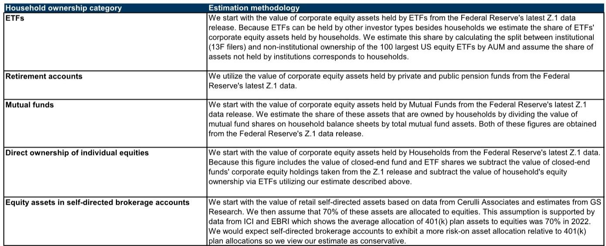
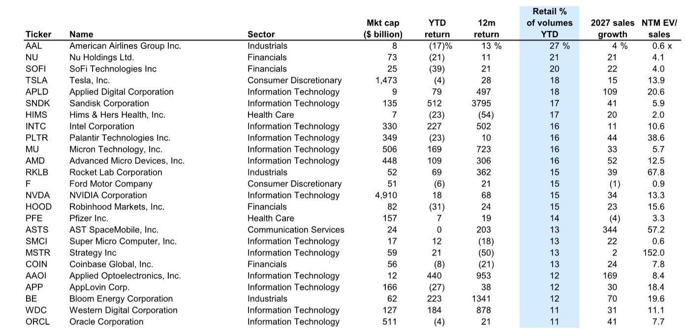

# Retail Trading Is No Longer a Sideshow: It Is Reshaping Market Structure, Valuation Dynamics, and Institutional Risk

The US equity market has crossed a structural threshold that most institutional investors have yet to fully price in. Retail traders now hold approximately $12 trillion of equity assets in self-directed brokerage accounts, representing roughly 10% of total US corporate equity market value. More importantly, retail trading activity has recently accounted for roughly 20% of total US equity trading volumes, up from 15% a decade ago. This is not a temporary pandemic-era phenomenon that has reverted. It is a permanent shift in market microstructure.

Since mid-April of this year, retail trading volumes have risen by 28%, and a basket of retail favorite stocks has rallied by 29% over the same period. The recent replacement of pattern day trader rules with less stringent margin requirements increases the likelihood that retail trading activity will rise further. For portfolio managers, risk officers, and strategists, the question is no longer whether retail matters. The question is whether their models, risk frameworks, and execution strategies have properly accounted for a market where one-fifth of all trading volume originates from self-directed individuals, not institutions.

The conventional view that retail traders are noise traders who cancel out over time is increasingly untenable. Retail order flow is not randomly distributed across the market. It is concentrated in specific stocks with specific characteristics: small market caps, volatile returns, high valuations, and elevated short interest. And because the vast majority of retail orders are internalized by wholesalers rather than executed on exchanges, institutional investors may be interacting with only a fraction of retail activity during normal market conditions. But during periods of market stress, when retail order flow becomes large and correlated, it can reach exchanges directly and amplify dislocations.

This article synthesizes the findings of a major investment bank research report on the rise and reach of retail trading. It does not merely summarize the data. It interprets what the patterns mean for market structure, valuation discipline, and institutional strategy. It also identifies several unresolved questions that the report leaves open, which should compel serious investors to read the full document.

## The Structural Shift in Retail Trading Is Underappreciated Because It Is Hidden Inside Internalization

The most important insight from the report is not the headline statistic about retail's 20% share of trading volumes. It is the fact that institutional investors typically interact directly with only a small fraction of that activity. Retail brokers route over 87% of order flow to specialized market makers known as wholesalers. A recent academic analysis cited in the report suggests that wholesalers execute 84% of retail orders against their own inventories, a practice known as internalization. Retail orders that are not internalized are routed to another market maker, to dark pools, or to traditional exchanges.

This means that the retail footprint in the visible exchange-traded market is significantly smaller than its true economic weight. For most of the trading day, institutional investors are trading against other institutions and market makers, while retail flow is absorbed off-exchange. This creates a dangerous asymmetry. During normal conditions, retail presence is invisible, leading institutions to underestimate its influence on price dynamics. During volatile conditions, when wholesalers become unwilling or unable to internalize large, correlated retail order flow, those orders spill onto exchanges suddenly. The 2021 SEC report noted that an increase in on-exchange volumes during volatility spikes may partly reflect wholesalers seeking to avoid internalizing retail orders as hedging becomes more difficult.

The strategic implication is clear. Institutional investors who assume that retail can be ignored because it is not visible in their limit order books are making a mistake. Retail is a latent factor in market liquidity and price discovery that becomes active precisely when conditions are most stressful. The report's data on retail trading activity during equity market drawdowns supports this view: retail volumes in index-linked ETFs rose during the selloffs in 2020, 2022, and 2025. During the most recent selloff, volumes remained light but increased as the market rebounded. Retail traders tend to lean against the wind during declines, but they also amplify momentum during recoveries.

## Retail Traders Are Not a Monolith, and the Concentration of Assets Matters More Than the Number of Accounts

A superficial reading of the report might lead to the conclusion that retail trading is a broad-based phenomenon driven by young, app-based traders. The data tells a more nuanced and strategically important story. Equity ownership among US households is heavily concentrated at the top of the wealth distribution. The top 10% of households own 87% of total household equity assets, while the bottom 50% own just 1%. However, households in the bottom half of the wealth distribution have historically made much larger adjustments to their equity portfolios from quarter to quarter. Across the average quarter since 1990, flows into and out of equities from the bottom 50% of households amounted to 3% of their assets, nearly three times the average for the top 10%.

This means that the retail trading activity driving volume statistics is disproportionately coming from households with smaller portfolios but higher turnover rates. These traders are more likely to be driven by sentiment, momentum, and news flow than by fundamental valuation analysis. They are also more likely to use margin and leveraged products to amplify their exposures. The report shows that retail margin debt across select brokers currently equates to 1.8% of customer assets, similar to the previous high reached in 2021. The retail share of trading volumes in leveraged S&P 500 and Nasdaq-100 ETFs has been roughly double the share in unleveraged ETFs tracking the same indices.

The asset concentration among brokers is equally important. Retail self-directed assets at Charles Schwab, Fidelity, and Vanguard account for roughly 80% of total retail self-directed assets, while Robinhood accounts for just 2%. This concentration has implications for how retail flow behaves during stress events. If one of these large brokers experiences a platform issue, a margin call wave, or a shift in policy, the impact on retail trading activity could be sudden and severe. The report does not explore this scenario, but it is a logical second-order implication that risk managers should consider.

## The Stocks Retail Traders Favor Share Specific Risk Characteristics That Institutional Portfolios May Be Underweight

The report identifies a clear set of stock-level characteristics associated with elevated retail trading activity. Retail tends to tilt towards stocks with small market caps, volatile returns, high valuations, and high short interest. The retail share of trading volumes in Russell 3000 stocks with the highest short interest was higher in 2025 than in 2021. This is not a random assortment of preferences. It is a coherent trading style that systematically favors lottery-like payoffs and high optionality.

The strategic consequence for institutional investors is that retail activity is not evenly distributed across the market. It is concentrated in segments of the equity universe that many institutional portfolios are structurally underweight due to mandates, liquidity constraints, or risk limits. This creates a potential blind spot. If retail traders are a dominant source of price formation in small-cap, high-volatility, high-valuation stocks, then institutional investors who ignore these segments may be missing important signals about market sentiment and risk appetite.

Even more concerning is the report's finding that stocks with elevated retail trading activity generally carry elevated valuations and exhibit above-average volatility, even controlling for fundamentals like sales growth. This suggests that retail participation is not just correlated with certain stock characteristics but may be causally inflating valuations beyond what fundamentals justify. The report also finds that stocks with elevated retail trading activity have exhibited greater underperformance following earnings misses. This implies that retail-driven price discovery is less efficient at incorporating fundamental information, and that the sUBSequent correction can be sharper when reality diverges from sentiment.

For institutional investors who hold these stocks, the implication is that they face asymmetric downside risk. When retail sentiment turns, the exit liquidity may be worse than models predict, because the same traders who drove the stock up may all try to leave simultaneously. The internalization mechanism that hides retail flow during normal times may exacerbate the rush for the exits during stress.

## The Report Leaves Open a Critical Question: How Much of the Recent Margin Debt Surge Is Retail, and What Happens When It Unwinds?

The report provides extensive data on margin debt but acknowledges a crucial ambiguity. Margin debt across all FINRA member firms rose to $1.3 trillion this year, or 52% of gross customer balances, the highest level on record. However, margin balances at Interactive Brokers, Robinhood, and Charles Schwab registered $230 billion at the end of March, equating to 1.8% of customer assets. The report notes that much of the rise in total margin debt over the past decade has likely been driven by institutional investors, not retail. FINRA's margin statistics show a $737 billion increase in margin debt over the past decade versus a $189 billion increase in margin balances at the three major retail brokers.

This distinction matters enormously for risk assessment. If the record-high margin debt is primarily institutional, then a margin-driven deleveraging event would manifest differently than if it were primarily retail. Institutional margin calls tend to be more orderly, more diversified across asset classes, and more likely to be anticipated by risk systems. Retail margin calls, by contrast, can be sudden, correlated, and concentrated in the same stocks that retail traders favor.

The report does not fully resolve this question. It provides data that retail margin as a share of customer assets is similar to the 2021 peak but has not meaningfully surpassed it, while FINRA data shows a record. The gap between these two data series is a critical analytical question that the report surfaces but does not definitively answer. For investors, this means that the margin risk in the system is real, but its composition and potential trigger points remain uncertain. A full reading of the report, including its appendix on estimation methodology, is necessary to form a view on this question.

## A Decision Framework for Institutional Investors: Three Questions to Ask About Retail Exposure

The report provides extensive data but does not offer a prescriptive framework for how institutional investors should respond. Based on the patterns identified, we propose three questions that every portfolio manager and risk officer should ask.

First, what is your indirect exposure to retail-favored stocks? Even if your mandate prevents you from owning small-cap, high-volatility names, your portfolio may have exposure through ETFs, index funds, or factor strategies that overweight these characteristics. The report shows that retail trading activity is concentrated in stocks with high short interest and high valuations. If your portfolio has a value tilt or a quality tilt, you may be underweight these names. But if you run a passive or momentum strategy, your exposure may be higher than you realize.

Second, how would your execution strategy perform if retail flow spilled onto exchanges during a volatility event? The internalization mechanism means that during normal times, retail flow is invisible. During stress events, it becomes visible and potentially destabilizing. If your execution algorithm assumes a certain level of liquidity based on recent history, it may be overestimating available liquidity during the moments when it matters most. Stress-testing execution models against a scenario where retail flow suddenly appears on exchange is a prudent step that few institutions appear to have taken.

Third, do your risk models account for the possibility that retail-driven valuations may correct more sharply than fundamental-driven valuations? The report's finding that stocks with elevated retail trading activity underperform more following earnings misses suggests that retail-influenced prices contain a sentiment premium that can evaporate quickly. If your risk model treats all drawdowns as mean-reverting, it may underestimate the tail risk in stocks with high retail ownership. Incorporating a retail activity factor into stress scenarios could improve risk calibration.

## The Full Report Contains Data and Charts That Cannot Be Replicated Here, and the Unresolved Questions Deserve Closer Study

This article has interpreted the key strategic implications of the research report, but it cannot sUBStitute for reading the original document. The report contains detailed exhibits on the composition of the retail favorite stocks basket, the evolution of retail trading activity over multiple market cycles, the distribution of retail assets across brokers, and the relationship between retail activity and stock-level valuation and volatility. These charts are essential for forming an independent judgment about the trends described here.

The report also raises several questions that merit further investigation. How will the replacement of pattern day trader rules with less stringent margin requirements affect retail activity in the next downturn? Will the concentration of retail assets among three large brokers create systemic risk if one of them experiences operational disruption? Can the relationship between retail trading activity and post-earnings drift be exploited as a trading signal, or is it already priced in? These are not questions the report answers definitively, which is precisely why serious investors should read it in full.

Join the community to read the full report and review the original charts.

*This article is for learning and discussion only and does not constitute investment advice.*

Personal reading notes and learning share only. Not investment advice.

