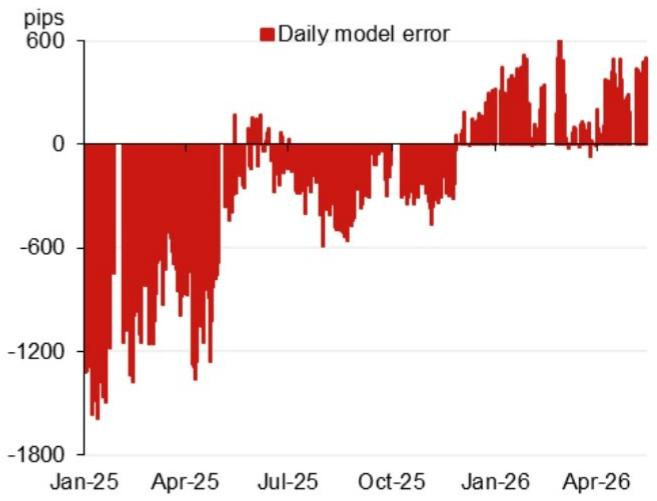

# The PBOC's Fix Model Is Signaling a Strategic Shift, Not Just a Tactical Adjustment

The People's Bank of China's daily USD/CNY fix is the single most important signal for global currency markets, and the latest model projection reveals something far more consequential than a routine adjustment. The model projects a fix of 6.7979, a full 422 pips lower than the previous projection, with the counter-cyclical factor adjustment bringing the figure to 6.8217. This is not a marginal tweak. It is a deliberate signal that the PBOC is recalibrating its currency management framework in anticipation of a fundamentally different geopolitical and economic landscape. The question for every investor with exposure to Chinese assets is not whether the renminbi will move, but how fast and how far the authorities will allow it to go.

The timing is everything. This projection arrives just before the Xi-Trump summit scheduled for 14-15 May 2026, a meeting that will set the tone for trade negotiations, tariff policy, and the broader strategic competition between the world's two largest economies. A 422-pip shift in the fix model projection is the PBOC's way of preparing the ground, signaling flexibility without committing to a specific outcome. Investors who treat this as a purely technical adjustment miss the strategic logic embedded in the numbers.

The model's components tell a clear story. The top four weighted contributions to the projected change come from the euro, the Japanese yen, the British pound, and the Australian dollar. This is not random. The PBOC's fix is increasingly responsive to a basket of currencies that reflects China's diversified trade relationships, not just the dollar. The euro contributes 39 pips, the yen 15 pips, the pound 14 pips, and the Australian dollar 13 pips. The message is that the renminbi's reference rate is being managed with an eye toward maintaining competitiveness across multiple trading partner currencies, not just the dollar. This is a hedge against any single bilateral exchange rate becoming a flashpoint in trade negotiations.

What makes this moment particularly significant is the history of model errors. The chart of daily model errors shows a pattern of large negative errors in January and April 2025, meaning the actual fix was sUBStantially weaker than the model projected. By July 2025, errors were near zero. By early 2026, errors turned positive, meaning the actual fix was stronger than the model projected. This swing from negative to positive errors indicates that the PBOC has been gradually reducing its resistance to renminbi strength. The current projection accelerates that trend. The authorities are signaling that they are comfortable with a stronger currency, provided it happens on their terms and at their pace.

The daily change in the USD/CNY fix reinforces this interpretation. From November 2025 through February 2026, the fix was essentially flat, with daily changes near zero. Then in March 2026, a 150-pip move appeared, breaking the pattern of stability. In April 2026, another significant move appeared. The PBOC is shifting from a regime of deliberate stability to one of managed adjustment. The question is whether this adjustment will be gradual or whether a more dramatic move is being prepared for the second half of 2026.

## The Counter-Cyclical Factor Is the PBOC's Most Important Policy Tool, and Its Current Reading Reveals a Deliberate Choice

The counter-cyclical factor is the mechanism the PBOC uses to smooth volatility and signal its policy intentions. When the factor is large and positive, the central bank is leaning against renminbi depreciation. When it is small or negative, the bank is allowing market forces more room to operate. The current model projection with the counter-cyclical factor is 6.8217, which is 184 pips lower than the previous fix. This means the counter-cyclical factor is being used not to resist appreciation, but to moderate the speed of the move. The PBOC is not fighting the market. It is managing the pace.

This is a critical distinction. In past periods of renminbi weakness, the counter-cyclical factor was deployed aggressively to prevent a disorderly depreciation. Now, with the model projecting a stronger fix and the factor set to moderate rather than reverse the move, the PBOC is signaling that it sees a stronger renminbi as consistent with its policy objectives. The choice to use the factor to slow appreciation, rather than to prevent it, indicates that the authorities have concluded that a stronger currency is not a threat to export competitiveness, at least not in the current environment.

The strategic rationale is clear. A stronger renminbi reduces the cost of imported energy and raw materials, which helps contain inflationary pressures. It also supports the internationalization of the currency by making it more attractive as a reserve asset. And in the context of trade negotiations, a stronger renminbi can be offered as a concession, demonstrating that China is willing to allow market forces to play a greater role in exchange rate determination. The PBOC is positioning itself to negotiate from a position of strength, not weakness.

## The Geopolitical Calendar Creates a Series of Decision Points That Will Test the PBOC's Commitment to This New Trajectory

The calendar of events for 2026 is not a passive list of dates. It is a sequence of pressure points that will force the PBOC to choose between maintaining the current trajectory and reverting to a more defensive posture. The Xi-Trump summit in May is the first test. If the summit produces a trade agreement or a meaningful de-escalation, the case for a stronger renminbi strengthens. If the summit ends in acrimony, the PBOC may pause or reverse the appreciation to cushion the economic impact.

The Politburo meeting for economic work in late July is the second test. This meeting will set the policy priorities for the second half of the year, including the stance on monetary policy, fiscal stimulus, and exchange rate management. A stronger renminbi is easier to justify if domestic demand is robust and exports are holding up. If the economic data weakens, the Politburo may prioritize export competitiveness over currency internationalization.

The APEC meeting in Shenzhen in November and President Xi's visit to the United States toward the end of 2026 are the final tests. These high-profile events create a powerful incentive for the PBOC to maintain stability and avoid any perception of currency manipulation. But they also create opportunities for further adjustment if the political conditions are favorable. The PBOC will want to avoid large moves immediately before or during these events, which means any significant adjustment is more likely to occur in the summer or early autumn.

The Central Economic Work Conference in mid-December and the Politburo meeting in late December will then set the stage for 2027. By that point, the cumulative effect of the year's adjustments will be clear, and the PBOC will have to decide whether to continue the trend or consolidate. Investors should watch the July Politburo meeting as the most likely inflection point. If the readout emphasizes currency flexibility and market-determined pricing, the trajectory toward a stronger renminbi is locked in. If the readout emphasizes stability and risk prevention, the adjustment may be nearing its end.

## The Model's Limitations Create Meaningful Uncertainty That No Investor Should Ignore

The model is a powerful analytical tool, but it has three important limitations that the report does not fully address. First, the model relies on a set of weighted inputs that are themselves subject to revision. The weights attached to the euro, yen, pound, and Australian dollar are not fixed. The PBOC can adjust them at any time, and it does not announce these adjustments in advance. A change in the basket weights would alter the model's projections in ways that are difficult to anticipate.

Second, the model does not incorporate the impact of capital flows. The PBOC's fix is only one part of the exchange rate management system. Capital account policies, including controls on outflows and measures to attract inflows, have a direct impact on the spot rate and the effectiveness of the fix. The model assumes that the fix will guide the spot rate, but if capital flows are large enough, the spot rate can diverge from the fix for extended periods. This is exactly what happened during the 2015-2016 depreciation cycle, when the fix was consistently stronger than the spot rate.

Third, the model does not account for the political economy of the fix. The PBOC operates within a broader policy framework that includes the State Council, the Communist Party leadership, and the Ministry of Commerce. The decision to adjust the fix is not purely technical. It is a political decision that involves trade-offs between different policy objectives. The model can tell you what the fix should be based on a set of inputs. It cannot tell you what the fix will be once political considerations are factored in.

These limitations are not reasons to dismiss the model. They are reasons to use it as one input among many, and to recognize that the model's projections are conditional on a set of assumptions that may not hold. The most important assumption is that the PBOC will continue to prioritize market-based pricing within a managed framework. If the political calculus shifts, the model's projections will shift with it.

## A Decision Framework for Investors: Three Scenarios and the Signals That Differentiate Them

The report provides the raw data for a decision framework, but it does not synthesize that data into actionable scenarios. Here is a framework that translates the model's projections into strategic choices.

Scenario One: Managed Appreciation. In this scenario, the PBOC continues to use the fix to guide the renminbi gradually stronger, with the counter-cyclical factor moderating the pace. The signal to watch is the size of the counter-cyclical factor. If it remains positive but declining, the PBOC is comfortable with the speed of appreciation. The trade implications are that USD/CNY will move toward 6.70 by the end of 2026, with the renminbi appreciating against both the dollar and the trade-weighted basket. Investors should reduce dollar exposure and increase exposure to renminbi-denominated assets, particularly bonds, which will benefit from both currency appreciation and potential capital inflows.

Scenario Two: Stabilization. In this scenario, the PBOC allows the fix to move to a new level and then holds it steady. The signal to watch is the daily change in the fix. If the daily change returns to near zero for an extended period after the current adjustment, the PBOC has found its new equilibrium. The trade implications are that USD/CNY will trade in a range around 6.80, with limited further appreciation. Investors should focus on carry and yield rather than directional currency trades. The opportunity is in relative value between onshore and offshore renminbi markets.

Scenario Three: Reversal. In this scenario, the PBOC responds to deteriorating economic data or geopolitical shocks by allowing the renminbi to weaken. The signal to watch is the model error. If the actual fix consistently comes in weaker than the model projection, the PBOC is leaning against appreciation. The trade implications are that USD/CNY will move back toward 7.00 or higher. Investors should hedge renminbi exposure and focus on exporters that benefit from a weaker currency.

The framework is not predictive. It is conditional. The value lies in identifying the signals that differentiate the scenarios and positioning accordingly. The PBOC's own model provides the baseline. The investor's job is to monitor the divergence between the model and the actual fix, and to interpret that divergence as a signal of policy intent.

## The Report Answers One Question and Raises Three More That Demand Further Analysis

The report answers the question of where the fix should be based on current inputs. The model is transparent, reproducible, and well-calibrated. But it leaves three questions unanswered, and these questions are where the real analytical work begins.

First, what is the PBOC's target level for USD/CNY? The model projects a fix, but it does not reveal the central bank's ultimate objective. Is 6.80 the destination, or is it a waypoint on a journey to 6.50 or lower? The answer depends on the PBOC's assessment of the fundamental equilibrium exchange rate, which is not disclosed in the report. Investors must infer the target from the pattern of adjustments and the accompanying policy statements.

Second, how will the PBOC respond if capital flows accelerate? The model assumes that the fix will guide the spot rate, but if capital inflows surge in response to the stronger fix, the PBOC may face a choice between allowing the spot rate to overshoot or intervening to absorb the inflows. The history of PBOC intervention suggests that the central bank prefers to build reserves during periods of inflow, but the current reserve level and the policy priority on currency internationalization may change the calculus.

Third, what is the relationship between the fix and the trade talks? The report's calendar of events includes the Xi-Trump summit, but it does not model the impact of trade negotiations on the fix. The PBOC is not a passive actor in these negotiations. It uses the fix as a bargaining chip and a signaling device. The question is whether the fix will be used as a carrot or a stick, and how the market should interpret the signals.

These questions are not criticisms of the report. They are the natural consequence of any model that abstracts from political and strategic considerations. The report provides the technical foundation. The investor must supply the strategic interpretation.

The full report contains the original charts and the detailed methodology that underlies the model projections. Understanding the inputs, the weights, and the error history is essential for anyone who wants to use the model as a forecasting tool rather than a black box. The charts on the top four weighted contributions, the model errors, and the daily change in the fix are not decorative. They are the raw material for scenario analysis and risk management.

Join the community to read the full report and review the original charts.

*This article is for learning and discussion only and does not constitute investment advice.*

Personal reading notes and learning share only. Not investment advice.

