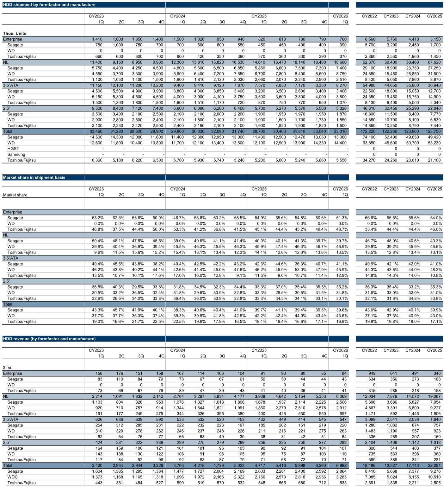

# HDD产业正在经历的不是周期复苏，而是存储架构的重新定价

2026年第一季度HDD出货数据已经发布。从表面看，这是一个平淡的季度：出货量环比持平。但深入拆解后，一组数字值得每一个关注存储产业链的决策者停下来思考。

出货容量同比增长38%，近线（NL）HDD出货量同比增长28%，HDD磁头出货量同比上升22%。这些数字指向同一个方向：HDD产业正在经历的，不是简单的库存回补或季节性反弹，而是AI时代数据存储架构对机械硬盘的重新定价。这份来自某外资投行的最新研报，揭示了三个尚未被市场充分消化的结构性变化。

第一，NAND Flash与NL HDD之间的每GB成本差距，在2026年第一季度已经扩大到12.7倍，创下2020年以来的新高。而在一年前，这个数字还只有5.2倍。这意味着，在超大容量存储场景下，HDD的经济性优势正在急剧扩大，而非缩小。

第二，磁头供应链正在发生一场静默的权力转移。自产厂商（captive manufacturers）不仅克制增产，还在将现有产能向HAMR（热辅助磁记录）产品转移。这为独立供应商打开了市场份额上升的窗口。报告明确指出，TDK是这一趋势下的首选标的。

第三，平均每台HDD搭载的磁头数量持续攀升，从2025年一季度的11.5个上升到2026年一季度的12.2个，NL HDD更是达到19.4个。这不是一个技术细节，它意味着每出货一台硬盘，磁头供应商获得的单位价值正在系统性增长。

以下是对这份研报核心洞察的展开。

## 1. NAND与HDD的成本差距大幅走阔，重新定义了存储分层经济

2026年第一季度，NL HDD的每GB成本约为0.013美元，而NAND Flash的每GB成本约为0.165美元。两者之间的成本倍率从2025年一季度的5.2倍、2025年四季度的6.6倍，跃升至12.7倍。

这个数字之所以重要，不是因为NAND变贵了，而是因为HDD在大容量场景下的成本优势被市场低估了。过去几年，市场的主流叙事是SSD不断降价，最终将侵蚀HDD的领地。但现实是，在近线存储——也就是数据中心冷数据、温数据的主要存储场景——HDD的单位成本优势不仅没有缩小，反而在AI带来的数据洪流中加速放大。

原因并不复杂。AI训练和推理产生的海量数据，大部分并不需要极低的访问延迟。对于这些数据，存储成本是核心约束。当NAND与HDD的成本差距从5倍扩大到12倍时，数据中心运营者在架构决策上几乎没有悬念：他们会把更多数据放在HDD上，同时用更少的SSD做缓存层。

这意味着，NL HDD的市场规模扩张，不是周期性的，而是结构性的。报告数据也印证了这一点：1Q 2026 NL HDD出货金额达到60.69亿美元，同比增长54%，环比增长13%。这个增速远超整体HDD市场。

## 2. 磁头供应链的产能克制，正在重塑独立供应商的竞争格局

HDD磁头是整条产业链中技术壁垒最高、集中度也最高的环节。报告数据显示，2026年第一季度HDD磁头（HGA）出货量为4.02亿个，同比增长22%。但比总量更值得关注的，是供给侧的动态。

自产厂商——即同时生产HDD和磁头的垂直整合企业——正在主动克制产能扩张。报告指出，它们在增产方面表现得相当谨慎，同时将现有产能向HAMR产品转移。这意味着，对于传统的PMR（垂直磁记录）磁头，自产厂商的供给弹性正在下降。

这为独立磁头供应商创造了结构性机会。TDK是本报告覆盖的首选标的，其HGA出货量在1Q 2026达到5280万个，同比增长10%，市场份额为13.1%。虽然份额相比去年同期的14.5%有所下降，但报告特别指出，TSR数据显示TDK已经开始向两家自产厂商供货——尽管目前量还很小。

这个信号的意义在于：如果TDK能够成为自产厂商的合格供应商，它面对的市场空间将从独立市场扩展到整个磁头需求池。而当前自产厂商的产能转移策略，恰恰为这一渗透提供了窗口。

## 3. 磁头用量持续攀升，单机价值量正在系统性增长

一个容易被忽视的技术趋势是：每台HDD搭载的磁头数量正在持续增加。2026年第一季度，整体HDD的磁头/硬盘比为12.2，高于去年同期的11.5；NL HDD的比值为19.4，虽然略低于去年同期的19.7，但整体趋势清晰。

这意味着什么？对于磁头供应商而言，HDD出货量的增长只是需求的第一层驱动。更深一层的驱动来自每台硬盘的磁头用量增长。当HDD从18TB向24TB、30TB演进时，实现更高面密度需要更多的磁头和磁臂并行读写。即便HDD出货量持平，磁头的总需求量也会因为单机用量增加而增长。

报告数据也验证了这一点：1Q 2026 HDD出货量同比增长15%，但磁头出货量同比增长22%。两者之间的增速差，就是单机磁头用量提升带来的增量。

对于投资者而言，这意味着HDD磁头需求的beta可能被系统性低估。当市场只盯着HDD出货量时，磁头供应商实际面对的是一个增速更高的需求曲线。

## 4. 报告尚未完全回答的关键问题：HAMR量产节奏的不确定性

报告中反复提及HAMR（热辅助磁记录）技术，并将其作为自产厂商转移产能的核心原因。但一个尚未被充分回答的问题是：HAMR的大规模量产时间表究竟是什么？

目前，HAMR技术被视为HDD行业突破30TB容量壁垒的关键路径。但这项技术的商业化进程一直面临挑战——包括磁头寿命、激光器可靠性、良率爬坡等。报告虽然指出自产厂商正在向HAMR转移产能，但并未给出明确的时间节点或良率数据。

这里存在一个双向风险。如果HAMR量产顺利，它将进一步拉大HDD与NAND在超大容量场景下的成本差距，巩固HDD在近线存储中的地位。但如果HAMR量产持续延迟，HDD的面密度提升可能放缓，从而给SSD在中等容量场景的渗透创造时间窗口。

对于TDK等独立供应商而言，HAMR也是一个双刃剑。一方面，HAMR磁头的技术门槛更高，单价可能更高；另一方面，如果自产厂商在HAMR上取得成功，它们可能重新加强自供比例，压缩独立供应商的份额空间。这个动态关系，报告没有展开，但值得持续跟踪。

## 5. 一个值得建立的观察框架：从三个维度跟踪HDD产业链信号

基于报告数据，投资者可以建立一个三层观察框架，用于跟踪这一产业链的边际变化。

第一层：成本差距。NAND与NL HDD的每GB成本倍率是衡量存储架构经济性的核心指标。当前12.7倍的水平为HDD提供了极强的需求支撑。如果这个数字在未来几个季度出现趋势性下降，需要重新评估HDD的竞争壁垒。

第二层：磁头供需缺口。磁头出货量增速与HDD出货量增速的差值，可以视为磁头单机用量变化的代理变量。同时需要跟踪TDK等独立供应商的份额变化，以及自产厂商的外购比例是否在提升。

第三层：HAMR商业化进度。这是对上述两层框架的修正因子。如果HAMR量产加速，HDD的面密度提升将快于预期，进一步巩固成本优势；反之，则可能为SSD创造机会窗口。关注的重点不是技术本身，而是产能转移的实际节奏和良率数据。

这三个维度合在一起，构成了对HDD产业链定价逻辑的完整判断框架。当前的信号指向一个方向：市场可能低估了HDD在AI数据存储架构中的结构性价值，也低估了磁头供应链权力转移带来的投资机会。

---

这份研报中还有大量关于具体公司估值、HDD主轴电机市场份额、以及不同技术路线竞争格局的详细数据，由于篇幅限制无法一一展开。比如，Nidec在HDD主轴电机市场仍占据60%的份额，但MinebeaMitsumi的份额变化趋势同样值得关注；又如，报告对各家电子元器件公司的目标价和评级逻辑，背后涉及对终端需求、汇率、产能利用率等多重变量的假设。

这些细节，恰恰是判断当前价格是否合理的关键。如果你对这些未解问题感兴趣——比如HAMR量产的真实时间表、TDK份额变化的边际信号、或者不同假设下NL HDD需求弹性的敏感性分析——欢迎来星球微信群里继续讨论。我们会定期分享对这些核心变量的跟踪更新，以及完整研报原文和原始数据图表。

Personal reading notes and learning share only. Not investment advice.

