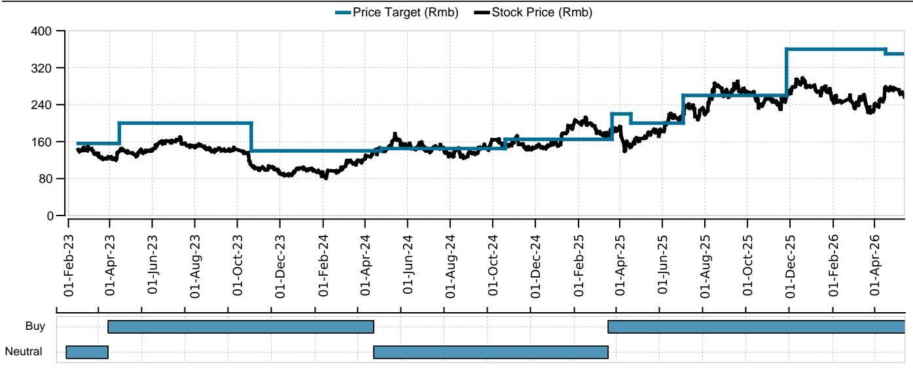
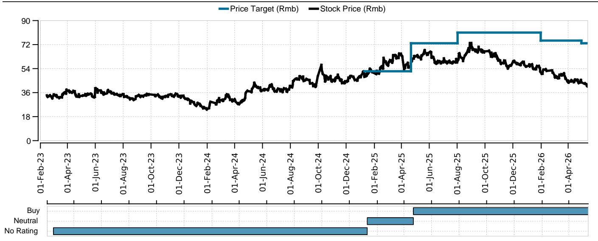
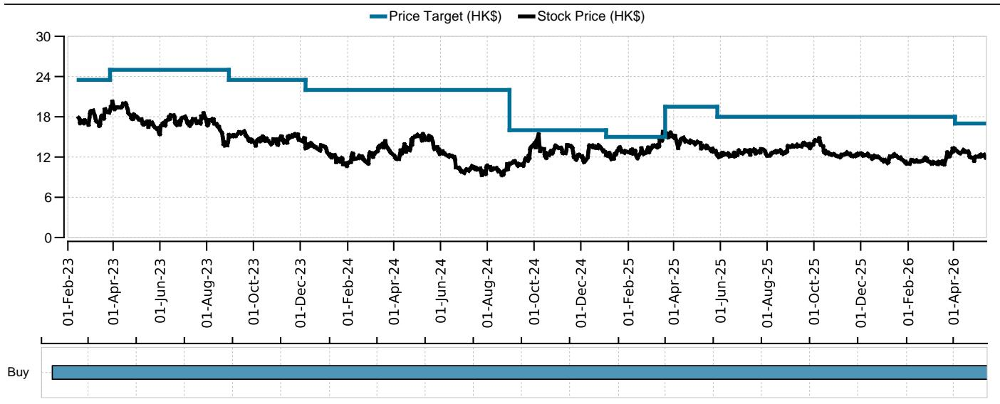

# China’s Two-Wheeler Sector Is Not Just Recovering—It Is Restructuring, and Investors Who Wait for Clearer Signals Will Miss the Entry Point

The narrative around China’s two-wheeler sector has shifted from a question of whether demand will return to a more strategic question: which companies have built the structural advantages to emerge stronger from the current cycle. After a sharp 20% volume decline in the first quarter of 2026, the industry has stabilized in the second quarter with flat volumes—a signal that the trough has passed. But this is not merely a cyclical rebound. Beneath the surface, three structural forces are redefining competitive dynamics: pricing power is being restored, product mix is upgrading toward higher value segments, and export markets are opening new growth frontiers that were not available in previous cycles. A global investment bank report based on recent company calls makes a compelling case that the sector is investable again, but the opportunity is concentrated in a narrow set of companies that have executed on these three dimensions.

The temptation will be to wait for more data—another quarter of volume confirmation, clearer tariff outcomes, or a more stable macro environment. That wait could be costly. The report identifies that investor positioning is light, and the companies with the strongest fundamentals—Ninebot, Yadea, CFMoto, and Loncin—are already demonstrating the kind of pricing discipline and product innovation that historically precedes sustained outperformance. The question is not whether the sector will recover, but whether investors will recognize the restructuring before the market prices it in.

## Demand Stabilization in Q2 2026 Marks the End of the Downcycle, Not the Beginning of a Slow Recovery

The most immediate signal from the report is that the industry has stopped falling. After a 20% year-on-year decline in Q1 2026, volumes flattened in Q2. This is not a minor data point; it is a structural turning point. The decline in Q1 was driven by demand pull-forward from previous periods, as well as regulatory uncertainty around new national standards that caused consumers and dealers to pause. What the Q2 data shows is that the pause is ending. Yadea’s wholesale volumes have already returned to an upward trend in April, even though retail volumes remain flat year on year. This gap between wholesale and retail is typical of a restocking cycle—dealers are replenishing inventory in anticipation of demand recovery, which itself is a leading indicator.

The implication for investors is that the volume risk that dominated the first quarter is receding. The companies themselves expect flat to slightly positive demand in the second half of 2026, which, when combined with the Q1 trough, points to a full-year outcome that is far less damaging than the worst-case scenarios priced into the sector at the start of the year. Ninebot expects a record-high peak season in Q3, which is a statement of confidence that should not be dismissed as mere management optimism. The company has direct visibility into its own order pipeline and distribution network, and its guidance for 5.5 million electric two-wheeler units in 2026 implies 30% year-on-year growth—a target that would be impossible without genuine demand recovery.

## Pricing Power Has Returned to the Industry, and That Changes the Earnings Math Dramatically

Perhaps the most underappreciated development in the sector is that original equipment manufacturers are raising prices. Yadea implemented a 3-5% price increase in April, passing on higher costs for plastics, copper, and rare earth materials. Ninebot raised prices by up to 100 renminbi per unit in late April. This is happening without triggering a large-scale price war, which is the single most important indicator of rational competitive behavior.

In previous downcycles, the reflex of Chinese two-wheeler manufacturers was to cut prices to defend market share, compressing margins across the industry. This time is different. The combination of industry consolidation—small and medium players exiting—and the cost discipline of the leading companies has created an environment where price increases are being accepted by the market. Yadea’s guidance for flat gross margins in 2026, despite input cost inflation, is actually a positive signal: it means the company can fully pass through cost increases without sacrificing profitability. Ninebot’s slightly lower full-year margin guidance for its electric two-wheeler business is similarly a story of a first-half trough and second-half improvement, not a structural deterioration.

The strategic implication is clear: the industry has moved from volume-driven competition to value-driven competition. Companies are now competing on product features, battery technology, and brand positioning rather than on price alone. This is a far healthier dynamic for long-term investors, because it means that earnings growth can come from both volume recovery and margin expansion, rather than from volume alone.

## The Export Story Is Real and Is Being Underestimated by the Market

The report highlights that high oil and gas prices are driving strong export sales, with Ninebot’s electric scooter sales in Europe and Yadea’s electric two-wheeler sales in ASEAN beating estimates. This is not a temporary tailwind. The structural shift toward electric mobility in Southeast Asia, driven by fuel costs and government incentives, is creating a demand pool that Chinese manufacturers are uniquely positioned to serve.

Yadea’s export guidance of 500,000 units in 2026, up from 310,000 in 2025, implies 61% growth. The company sees upside risk to this guidance if oil prices remain elevated. Ninebot is conducting a thorough assessment of the Vietnam market, where the transition from internal combustion engine two-wheelers to electric two-wheelers is accelerating. The company believes it can replicate its success in China’s electric two-wheeler market in Vietnam, which would open a growth avenue that is entirely independent of domestic demand cycles.

The export opportunity also reduces the correlation between these companies and China’s domestic macro environment. Investors who are concerned about China’s consumer spending slowdown should recognize that the two-wheeler sector is increasingly a global growth story, not just a domestic recovery story. CFMoto’s off-road vehicle sales in the United States are robust, with the U10 Pro model already exceeding 10,000 units in Q1, suggesting annual sales of more than 40,000 units. Even the tariff and currency headwinds that CFMoto faces are manageable: the company is keeping US prices unchanged, and its European margins are actually higher than US margins due to the tariff differential.

## Technology Innovation Is Creating a New Competitive Moat, Especially in Batteries

The report identifies a technology development that could reshape competitive dynamics: Yadea’s adoption of sodium batteries in two-wheelers. The company expects to ship 1 million sodium battery units in 2026, representing 6-7% penetration of its total two-wheeler sales. Sodium batteries have a cost advantage over lithium batteries when lithium carbonate prices are above 150,000 renminbi per ton, which they currently are.

This is strategically important for two reasons. First, it reduces Yadea’s exposure to lithium price volatility, which has been a major source of cost uncertainty for the entire electric two-wheeler industry. Second, it creates a product differentiation that competitors will find difficult to replicate quickly. Yadea’s sodium battery leadership could become a structural competitive advantage, particularly if lithium prices remain elevated.

Ninebot is pursuing a different but equally important innovation path. The company is leveraging intelligent electric vehicle integration and expects a significant leap in product competitiveness in 2027. It has also purchased a motorcycle company in China, extending its capabilities into motorcycle design and manufacturing. This suggests that the competitive landscape is not static; the leaders are investing in capabilities that will widen the gap with smaller players.

The report does not fully answer the question of how quickly sodium battery technology will be adopted across the industry, or whether Ninebot’s 2027 product leap will materialize as expected. These are open questions that require monitoring. But the direction of travel is clear: technology is becoming a differentiating factor, and companies that invest in R&D and battery innovation will be rewarded with higher margins and market share.

## The Report Leaves Several Critical Questions Unanswered, and That Is Where the Real Analytical Work Begins

Any honest assessment of the sector must acknowledge what the report does not fully resolve. First, the impact of the new national standards on consumer behavior remains uncertain. The standards could shift transport preference back to buses and subways from electric two-wheelers, which would be a structural headwind for the entire industry. Yadea’s mention of a pilot program in Wuxi that allows e-mopeds with special plates for delivery riders is a positive signal, but it is only one city, and the regulatory landscape across China is fragmented.

Second, the tariff situation for CFMoto and other exporters is unresolved. US tariffs on off-road vehicles are a real headwind, and the company’s ability to maintain prices depends on demand remaining strong. If the US economy slows, CFMoto’s export margins could come under pressure. The report notes that US inventory covers 4-5 months, which provides a buffer, but it is not a permanent solution.

Third, the competitive response from smaller players has not been fully tested. If the price increases by Yadea and Ninebot attract new entrants or trigger aggressive discounting from struggling competitors, the pricing discipline that is currently supporting margins could break down. The report acknowledges that the industry landscape could deteriorate on fierce price competition, which is a downside risk that cannot be dismissed.

These unanswered questions are not reasons to avoid the sector. They are reasons to be selective and to focus on companies with the strongest competitive positions, the most diversified revenue bases, and the most credible management teams.

## A Decision Framework for Investors: Three Questions to Determine Which Companies Will Win

The report provides enough information to construct a decision framework for investors evaluating the two-wheeler sector. The framework has three dimensions, and a company must score well on at least two to be a compelling investment.

The first dimension is pricing power. Can the company raise prices without losing market share? Yadea and Ninebot both pass this test, as evidenced by their recent price increases. CFMoto passes on the off-road vehicle side, where demand is robust, but faces more competition in domestic motorcycles. Loncin’s position is less clear, as the company is undergoing an asset swap with Zongshen that creates uncertainty.

The second dimension is export diversification. Does the company have meaningful revenue exposure outside China that is growing faster than domestic demand? Yadea, Ninebot, and CFMoto all pass this test. The report shows that export growth is beating expectations for all three, and the structural drivers—high oil prices, ASEAN electrification, and US demand for off-road vehicles—appear sustainable.

The third dimension is technology differentiation. Does the company have a product or technology advantage that competitors cannot easily replicate? Yadea’s sodium battery leadership and Ninebot’s intelligent integration capabilities give them an edge. CFMoto’s off-road vehicle product lineup is also differentiated, but the technology moat is narrower.

Applying this framework, Ninebot and Yadea emerge as the strongest candidates. They score well on all three dimensions. CFMoto is a solid investment but carries more near-term risk from tariffs and currency. Loncin and Zongshen are more complex stories that require deeper analysis of the asset swap and the general motor business.

## The Real Opportunity Is in Recognizing That the Sector Has Crossed an Inflection Point

The temptation in a sector that has just stabilized is to wait for more evidence. Another quarter of volume data. Confirmation that price increases are holding. Clarity on tariffs. But the report suggests that the key evidence is already visible. Volumes have stopped falling. Prices are going up. Exports are accelerating. Technology is advancing. The companies with the strongest fundamentals are gaining share and investing for the future.

Waiting for perfect information means paying higher prices. The market will not wait for every uncertainty to be resolved before repricing these stocks. The report explicitly notes that investor holdings are limited, which means that when the re-rating comes, it could be rapid and significant.

The sector is not just recovering. It is restructuring. And the window for getting positioned before the restructuring is fully recognized is narrowing.

*This article is for learning and discussion only and does not constitute investment advice.*

Personal reading notes and learning share only. Not investment advice.

