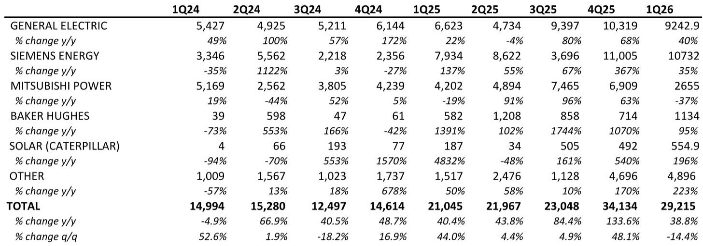
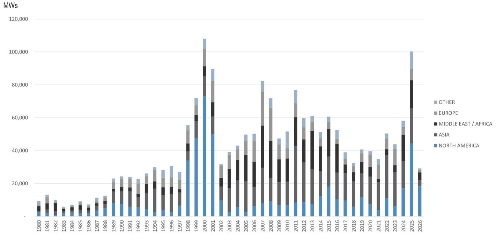

# The Gas Turbine Boom Is Not a Cycle — It Is a Structural Re-Rating of Power Infrastructure

The first quarter of 2026 recorded approximately 29 gigawatts of global gas turbine orders, a 39 percent increase year-over-year and the highest first-quarter total on record. This is the fourth largest quarterly order volume in history. The market is not experiencing a temporary upswing driven by a single catalyst. It is undergoing a structural transformation in which gas-fired power generation has become the essential bridge for AI-driven data center demand, grid reliability concerns, and the limitations of renewable intermittency. Investors who treat this as another capex cycle risk missing the most consequential re-rating of power equipment since the shale gas revolution.

Three forces are converging simultaneously. First, the insatiable electricity demand from hyperscale data centers is forcing utilities and technology companies to secure firm, dispatchable power on timelines that solar and wind cannot meet. Second, the retirement of coal-fired capacity in North America and Europe is accelerating, creating a void that only gas can fill at scale in the near term. Third, the supply chain for gas turbines is structurally constrained, with the Big Three OEMs — GE Vernova, Siemens Energy, and Mitsubishi Heavy Industries — already operating at or near capacity limits. The result is a pricing environment where combined-cycle gas turbine project costs are pushing toward $3,000 per kilowatt for early-2030s completion dates, roughly triple the median cost for projects completing in 2025.

This article interprets the data from a recent global investment bank report to explain why the current order momentum is sustainable, where the bottlenecks are most acute, and what strategic questions remain unanswered for investors.

## North America Has Become the Global Anchor of Gas Turbine Demand, and That Concentration Creates Both Opportunity and Risk

The first-quarter data makes one fact unmistakable: North America is the dominant market for gas turbines, and the United States is the engine. Of the 29.2 GW ordered globally in 1Q26, approximately 18.3 GW went to North America, with 17.2 GW allocated to the U.S. alone. That single country accounted for nearly 60 percent of global orders. The next largest national markets — Oman at 2.0 GW and the UAE at 1.5 GW — are orders of magnitude smaller.

This concentration is not a one-quarter anomaly. Since 2023, GE Vernova has captured 45 percent of the North American market. The region has become the proving ground for the largest, most advanced turbines, with H- and J-class units representing 12.4 GW of global orders in 1Q26 alone. These are the high-efficiency, high-output machines that data center operators and utilities demand for large-scale projects.

The strategic implication is clear: any investor assessing the gas turbine thesis must first understand the U.S. power market. The country's grid interconnection queues, state-level renewable portfolio standards, and the pace of data center construction will determine the trajectory of global OEM backlogs. However, this concentration also introduces a risk that is not yet fully priced into the equity market. If U.S. electricity demand growth slows — due to a recession, a slowdown in AI investment, or regulatory changes that favor other generation sources — the global order book would face a material headwind. The rest of the world, outside of select Middle Eastern markets, has not yet demonstrated the same urgency or scale.

## The Big Three OEMs Are Running Out of Capacity, and the Pricing Power Is Shifting to Suppliers

The report estimates that global OEM capacity will reach approximately 85 GW by 2028, measured in simple-cycle terms. That sounds like a large number, but it must be placed in context. In 1Q26 alone, orders totaled 29 GW. If quarterly orders remain at even 25 GW, annual demand would run at 100 GW, exceeding estimated 2028 capacity by nearly 20 percent. The math is simple: either order volumes must moderate, or prices must rise further to ration demand.

The Big Three are responding with capacity expansions, but these are multi-year programs. GE Vernova has announced plans to reach approximately 26 GW of total capacity by 2028, up from its current heavy-duty capacity of roughly 20 GW. Siemens Energy is targeting greater than 30 GW in combined-cycle terms by fiscal 2028-2030. Mitsubishi Heavy Industries has signaled a potential 50 percent capacity increase by 2028, with the CEO noting line of sight beyond the initial 30 percent target.

Yet even these expansions may prove insufficient. The report notes that channel checks indicate combined-cycle project costs for early-2030s completion dates are pushing toward $2,800 to $3,000 per kilowatt, with some conversations suggesting totals above $3,000 per kilowatt. For context, median CCGT costs for 2025 completion dates were roughly $900 per kilowatt. That is a tripling of costs in less than a decade.

The so-what for investors is that the pricing power in the gas turbine value chain is shifting from project developers to OEMs and their component suppliers. Companies that can deliver turbines in 2028 or 2029 are commanding premiums that were unimaginable three years ago. The open question is whether the OEMs can convert this pricing power into margin expansion, or whether cost inflation in raw materials, labor, and supply chain logistics will absorb the gains.

## The Data Center Thesis Is Real, and It Is Reshaping the Order Book in Ways That Go Beyond Traditional Utility Demand

One of the most telling data points in the report is the record 3.8 GW order booked by Doosan in the first quarter. This included a 2.7 GW data center order in the United States, expected to ship in 2029 and reach operation in 2030. This is the largest quarterly order volume on record for Doosan, and it is only the third gas turbine order the company has ever received from the U.S. market.

Equally significant is Baker Hughes' 1.1 GW data center order for 60 units of its Nova LT small industrial turbines, with Quanta Services named as the customer and EPC contractor. The targeted shipment date is 2027, with operation expected in 2029.

These orders reveal a pattern that the market is still digesting: data center developers are not waiting for utilities to build new capacity. They are contracting directly with OEMs and EPC firms to secure gas turbine capacity years in advance. This is a fundamental shift from the traditional utility procurement model, and it has two important implications.

First, it compresses the timeline between order and operation. The Doosan order targets a 2030 commercial operation date, which implies a roughly four-year construction window. That is aggressive for a large-scale gas plant, but it reflects the urgency of AI-driven demand. Second, it creates a new class of customer — the hyperscaler — that has different credit profiles, different contract structures, and different tolerance for delay than traditional utilities. The report does not address whether these contracts include penalty clauses for late delivery, or whether the OEMs are assuming construction risk. These are material questions for investors tracking project execution.

## What the Report Does Not Fully Answer: The Second-Order Effects of OEM Capacity Constraints on the Broader Power Supply Chain

The report provides detailed estimates of OEM capacity through 2028, but it leaves several important analytical gaps. First, the capacity estimates are in simple-cycle terms, but the actual output of a gas turbine plant depends on whether it is configured as simple cycle, combined cycle, or combined heat and power. A combined-cycle plant can generate roughly 50 percent more electricity from the same gas turbine by capturing waste heat. The report acknowledges this distinction but does not provide a clear conversion methodology for its capacity forecasts.

Second, the report does not address the availability of balance-of-plant components — steam turbines, heat recovery steam generators, transformers, switchgear, and cooling systems. These components are also subject to long lead times and supply constraints. If a developer can secure a gas turbine but cannot procure a steam turbine or a main power transformer, the project will be delayed regardless of OEM capacity.

Third, the report does not model the impact of labor constraints. Building a gas-fired power plant requires skilled welders, pipefitters, electricians, and engineers. The U.S. construction labor market is already tight, and the pipeline of new power plant projects is growing faster than the workforce. Labor costs could rise faster than equipment costs, further inflating project economics.

These are not criticisms of the report. They are natural limitations of any analysis that focuses on OEM-level data. For investors, the implication is that the bull case for gas turbine stocks may be understated if supply constraints extend beyond the turbine itself. Conversely, the risk is that project delays become more frequent as the broader supply chain struggles to keep pace.

## A Decision Framework for Investors: How to Position Across the Gas Turbine Value Chain

Given the structural demand backdrop and the capacity constraints, investors need a framework that goes beyond simply buying the Big Three OEMs. The following three-part framework is designed to help readers evaluate opportunities across the value chain.

**First, assess which OEMs have the most credible capacity expansion plans and the strongest pricing power.** GE Vernova's track record in North America and its early capacity announcements give it a first-mover advantage. Siemens Energy's dominance in the Middle East and Europe provides geographic diversification. Mitsubishi Heavy Industries' leadership in Asia offers a different risk-return profile. The key metric to track is not just order volume but the average selling price per megawatt and the implied margin trajectory.

**Second, evaluate the "picks and shovels" suppliers that benefit from increased turbine production without taking direct construction risk.** These include manufacturers of advanced alloys, turbine blades, combustion systems, and control software. The report does not cover these companies, but the logic is straightforward: if OEMs are expanding capacity by 30 to 50 percent, their suppliers must expand in lockstep. The leverage in these supplier relationships often favors the supplier, because switching costs are high and qualification cycles are long.

**Third, monitor the EPC and services ecosystem.** Companies like Quanta Services, which is named as the customer for the Baker Hughes order, are positioned to benefit from the construction boom. However, the risk is that fixed-price EPC contracts become loss leaders if costs escalate faster than expected. The report's pricing tracker suggests that cost escalation is accelerating, which could squeeze EPC margins before they recover.

This framework is not exhaustive, but it provides a starting point for investors who want to move beyond the headline order numbers and build a differentiated thesis.

## The Unresolved Analytical Questions That Make the Full Report Essential Reading

The data presented in this article is drawn from a detailed quarterly report that includes charts on awards by region, awards by OEM, awards by turbine class, expected shipment dates, and historical comparisons going back to 1980. The report also contains the proprietary pricing tracker with project-level cost data for 78 publicly announced natural gas projects in North America.

Several questions emerge from the data that the article format cannot fully address. How do the capacity estimates change if we assume higher utilization rates at existing factories rather than greenfield expansion? What is the implied order book for 2027 and 2028 based on current shipment schedules? Which OEM has the most exposure to the data center vertical, and how does that change the risk profile compared to traditional utility orders?

These are the kinds of questions that a thoughtful investor needs to answer before making a commitment. The full report provides the underlying charts and data that enable that analysis.

Join the community to read the full report and review the original charts.

*This article is for learning and discussion only and does not constitute investment advice.*

Personal reading notes and learning share only. Not investment advice.

