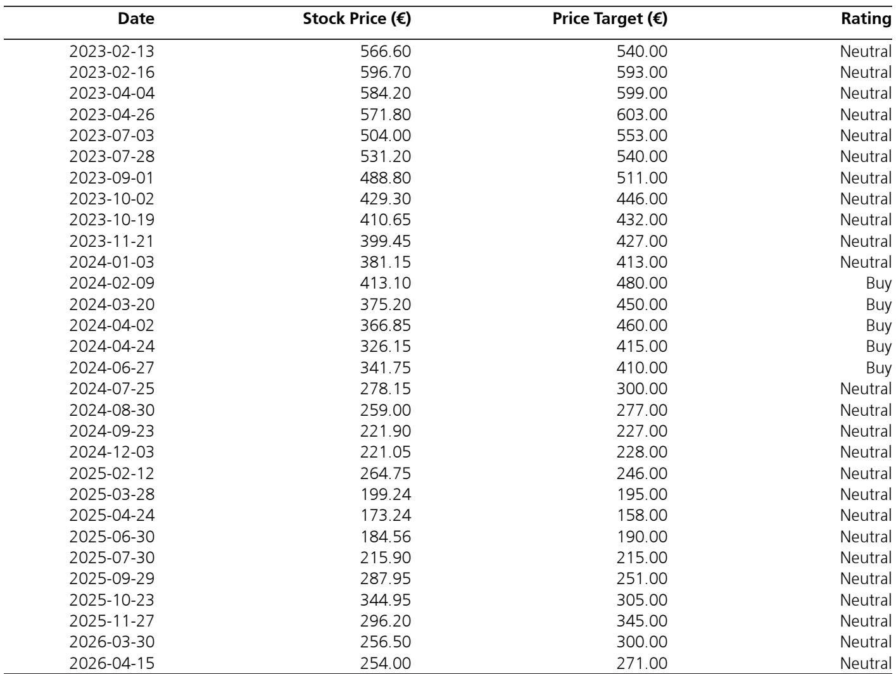
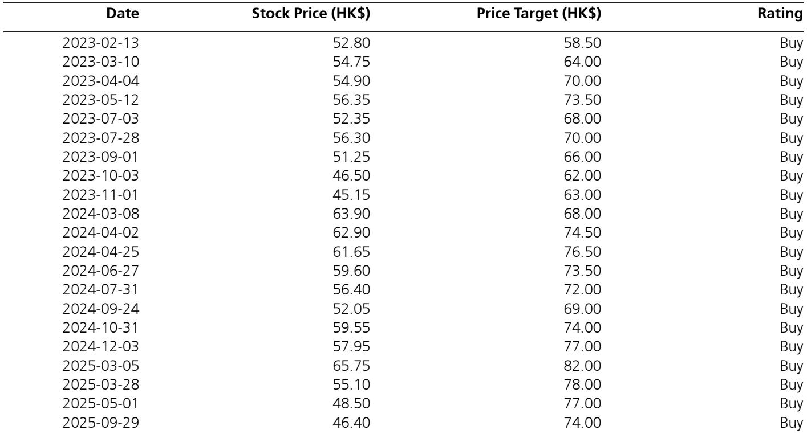

# The Luxury Correction is Not a Demand Crisis—It Is a Brand Strategy Reckoning

The European luxury sector is not in decline. It is in a selective reset. After years of democratisation that pulled aspirational consumers into the orbit of high-end brands, the market is now undergoing a correction that separates durable value from speculative froth. The core insight from a recent expert call with a founder of a global luxury resale and archival fashion platform is that the current slowdown is concentrated among trend-sensitive buyers, while the high-end client base remains deeply engaged. This is not a cyclical downturn; it is a structural rebalancing that rewards brands able to "scale back" strategically and reinvest in the fundamentals of craftsmanship, rarity, and client relationships.

The implications for investors are significant. The era of easy growth through broad-based price increases and volume expansion is over. What comes next is a more nuanced landscape where brand equity, creative direction, and relationship-driven distribution become the primary determinants of performance. The resale market, far from being a threat, is emerging as a core component of the luxury ecosystem, enabling circular consumption and supporting primary market dynamics. Understanding this shift is essential for anyone positioning in luxury equities today.

Why now matters. The post-pandemic luxury boom created distortions across the value chain. Speculative buying, limited-edition hype, and inflated secondary market multiples masked underlying weaknesses in brand positioning. As these distortions normalise, the market is sending clear signals about which brands have genuine staying power and which were beneficiaries of a rising tide. The data from the secondary market provides a real-time, unfiltered view of brand health that primary market sales figures alone cannot capture.

This article synthesises the key findings from that expert discussion and extends them into a strategic framework for investors. It does not simply summarise the report. It makes an argument about what the luxury correction means for brand strategy, category dynamics, and portfolio construction.

## The Polarisation of Luxury is Not a Forecast—It Is Already Reflected in Secondary Market Pricing

The most important observation from the expert call is that the luxury market is bifurcating along lines that are already visible in resale pricing. This is not a prediction. It is a present-tense reality. On one side, iconic items from heritage brands maintain resilient pricing. On the other, trend-driven and limited-edition pieces have seen secondary multiples normalise materially from their pandemic peaks. The gap between these two segments is widening, and it tells a clear story about what consumers value now.

The expert noted that pricing for core models at Hermès remains structurally strong, but the normalisation of limited-edition bags is striking. Resale premiums that once reached 2 to 2.5 times retail value have settled to 1 to 1.5 times. This is not a collapse. It is a recalibration. The speculative, status-driven buyers who entered the market during the pandemic are exiting, leaving behind a core of VIP clients who prioritise rarity and craftsmanship over conspicuous display. The "bread and butter" Kelly and Birkin bags still command premiums, but the demand is increasingly concentrated among clients seeking less recognisable pieces.

This pattern extends across the sector. At Chanel, renewed interest in leather goods following Matthieu Blazy's creative debut has boosted secondary demand. At Louis Vuitton, classic vintage monograms continue to perform well. But at Dior, secondhand demand is more selective, focused on iconic eras such as Galliano's tenure. At Gucci, the brand remains volatile and exposed to fashion cycles, though archival demand is re-emerging with the Tom Ford-inspired direction under Demna. The common thread is clear: consumers are voting with their wallets for authenticity, heritage, and quality, not for hype.

The so what for investors is straightforward. The secondary market is providing a leading indicator of brand health that primary market data may lag. Brands that can maintain or grow their resale pricing are demonstrating genuine desirability. Those that cannot are showing signs of vulnerability. This is a more granular and honest signal than quarterly revenue reports.

## Hard Luxury is Outperforming Soft Luxury Because Consumers Are Trading Up Within the Category, Not Out of It

One of the most counterintuitive findings from the expert call is that hard luxury—fine jewellery and watches—is accelerating even as the broader market cools. This is not happening because consumers are abandoning handbags and ready-to-wear. It is happening because repeat consumers are trading up within the luxury pyramid. Entry-level leather goods purchases are serving as gateways to higher-value categories.

This trading-up behaviour is a structural tailwind for hard luxury that is often misunderstood. It is not about wealth effects or macroeconomic confidence. It is about the maturation of the luxury consumer. As clients accumulate experience with a brand, they progress from accessible items to more significant investments. The expert noted that performance remains robust in core segments such as handbags and ready-to-wear, but the acceleration in fine jewellery and watches reflects a deepening of client relationships rather than a shift in preferences.

The implications for brand strategy are profound. Brands cannot simply chase the entry-level consumer and expect to capture the full value of the relationship. They must build pathways for progression that reward loyalty and deepen engagement. The brands that succeed in this environment will be those that treat their entry-level offerings not as profit centres but as acquisition tools for higher-value categories.

For investors, this means that exposure to hard luxury is not a defensive play. It is a growth play that is structurally supported by consumer behaviour. The brands that have strong positions in fine jewellery and watches are likely to benefit from this trading-up dynamic regardless of the broader macroeconomic environment. Conversely, brands that are overly reliant on entry-level leather goods may face headwinds as the aspirational consumer segment slows.

## Resale is Not a Threat to Primary Market Pricing—It Is a Strategic Asset That Brands Must Learn to Manage

The expert call made clear that resale is becoming a core part of the luxury ecosystem. This is not a fringe phenomenon. It is a structural shift that enables circular consumption and supports primary market dynamics. The relationship-driven nature of sourcing and selling on the platform was highlighted as a key differentiator compared to other resellers. Inventory availability has structurally improved, reflecting reduced stigma around resale and stronger relationships with VIP consignors.

The strategic implication is that brands can no longer afford to ignore or oppose the secondary market. They must learn to manage it as part of their overall brand strategy. The resale market provides a real-time feedback loop on brand desirability, pricing power, and creative direction. It also offers a channel for engaging with consumers who may not be able to access primary market products at full price.

The expert noted that some sellers are temporarily holding back supply in anticipation of a pricing rebound to previous secondary multiples. This behaviour indicates that the resale market is not simply a discount channel. It is a market where participants have expectations about future pricing and are making strategic decisions based on those expectations. Brands that understand this dynamic can use the secondary market to reinforce their pricing power and manage scarcity.

For investors, the rise of resale creates both opportunities and risks. Brands that can integrate resale into their business model—through certified pre-owned programmes, for example—may be able to capture additional value and deepen client relationships. Brands that treat resale as a threat and attempt to suppress it may find themselves fighting a losing battle against consumer behaviour.

## The Report Leaves Unanswered a Critical Question: How Do Brands Scale Back Without Losing Revenue Momentum?

The expert call identified the key question for the sector's outlook as how brands "scale back" and focus on the core to drive growth. This is a deceptively simple question with complex implications. Scaling back means reducing exposure to trend-sensitive consumers, limiting distribution, and focusing on quality and relationships. But doing so without sacrificing revenue momentum is a delicate balancing act.

The report does not fully answer how brands should execute this transition. It provides examples of brands that are successfully navigating the correction—Chanel, Louis Vuitton, Prada, Miu Miu—but it does not offer a playbook for brands that are struggling. Gucci is cited as more volatile and exposed to fashion cycles after prior overexposure, but the path to recovery is not spelled out.

This is the open question that investors must grapple with. The luxury sector is moving from a volume-driven model to a value-driven model. But the mechanics of that transition are not uniform across brands. Some brands have the heritage, client relationships, and creative direction to execute a successful pullback. Others may find that their revenue base is too dependent on aspirational consumers to withstand a strategic retreat.

The unanswered question creates an opportunity for deeper analysis. Investors should be asking which brands have the structural advantages to navigate this transition and which are at risk of being caught in the middle. The answer will determine the winners and losers in the next phase of the luxury cycle.

## A Decision Framework for Investors: Three Questions to Evaluate Luxury Brand Resilience

Based on the insights from the expert call, investors can use a simple decision framework to evaluate luxury brand resilience. The framework consists of three questions that cut through the noise and focus on the fundamentals that matter.

First, does the brand have pricing power in the secondary market? This is the most direct measure of genuine desirability. Brands that maintain or grow their resale pricing are demonstrating that consumers value their products beyond the initial purchase. Brands whose secondary pricing is declining are at risk of losing their aspirational appeal.

Second, is the brand's creative direction aligned with its heritage? The expert call highlighted the importance of creative eras in driving demand. Chanel's renewed interest following Blazy's debut, the strong performance of Louis Vuitton's classic monograms, and the re-emergence of archival demand at Gucci all point to the same conclusion: consumers are looking for authenticity and continuity, not novelty for its own sake.

Third, does the brand have a pathway for client progression from entry-level to high-value categories? The trading-up dynamic in hard luxury is a structural tailwind, but it only benefits brands that have the product range and client relationships to support it. Brands that are too narrow in their category exposure or too dependent on aspirational consumers may struggle to capture this value.

These three questions provide a disciplined framework for assessing luxury brand resilience. They are not exhaustive, but they focus on the factors that the expert call identified as most relevant to the current market environment.

## The Full Report Contains the Data and Charts That Make These Insights Actionable

The analysis in this article is based on a single expert call and the accompanying research report. But the full report contains the data, charts, and detailed brand-level analysis that make these insights actionable for portfolio construction. The pricing charts for Hermès and Prada, the rating histories, and the category-level breakdowns provide the quantitative foundation for the qualitative observations discussed here.

The report also includes the full transcript of the expert call, which contains additional nuance on brand-specific dynamics, supply chain implications, and the evolving role of resale in the luxury ecosystem. For investors who want to move beyond headlines and into the details that drive investment decisions, the full report is essential reading.

Join the community to read the full report and review the original charts.

*This article is for learning and discussion only and does not constitute investment advice.*

Personal reading notes and learning share only. Not investment advice.

