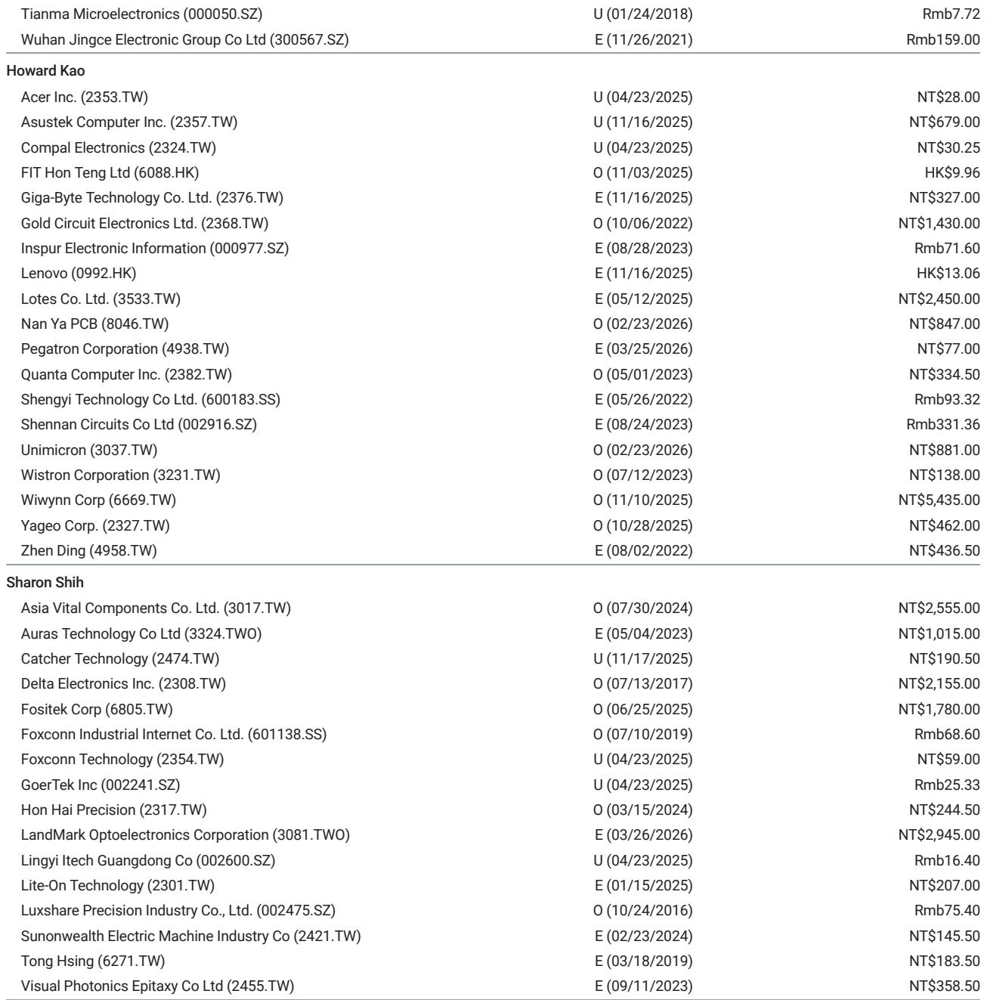
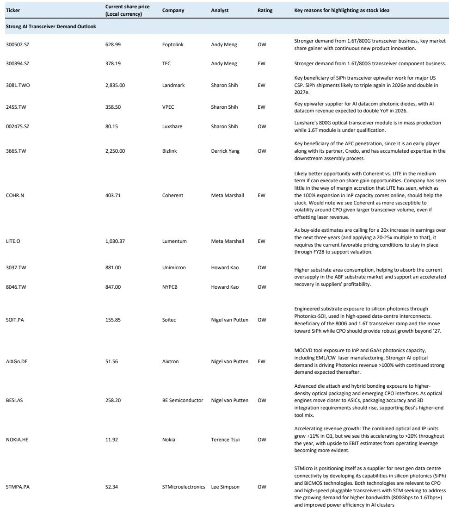

# The AI Transceiver Boom Is Not Priced In: Why Demand Visibility Has Outpaced Even the Most Bullish Forecasts

The most important signal for the AI infrastructure trade is not a new GPU launch or a data center expansion announcement. It is a single sentence from an optical component CEO: "We would be sold out through all of 2028 within two quarters." When the industry leader in indium phosphide lasers says demand is accelerating so rapidly that the company cannot build capacity fast enough to catch up, the implications cascade across the entire AI transceiver ecosystem. This is not a cyclical upswing. This is a structural supply-demand imbalance that has deepened faster than any forecast model anticipated.

For investors who have followed the AI hardware narrative, the story has always been about compute. GPUs, networking switches, and power infrastructure dominated the conversation. But the optical layer—the transceivers that connect racks, clusters, and data centers—has quietly become the bottleneck. And that bottleneck is now tightening. A global investment bank report has revised its AI transceiver shipment forecasts upward by 38% for 2026, 98% for 2027, and 87% for 2028. The magnitude of these revisions tells us something critical: the market has been systematically underestimating the optical content required to support AI workloads at scale.

The thesis is straightforward but underappreciated. As AI training clusters grow from thousands to hundreds of thousands of accelerators, the network architecture shifts from copper-based electrical connections to optical interconnects. Every rack-to-rack link requires transceivers. Every new data center buildout demands more optical lanes. And for every dollar spent on GPUs, an increasing share must go to the optical infrastructure that makes those GPUs useful. The report now projects the AI transceiver total addressable market will grow from $18 billion in 2025 to $102 billion in 2028—a more than fourfold expansion in three years. That is a compound annual growth rate that rivals the early days of cloud computing.

But this is not just a growth story. It is a story about constraints, sUBStitution, and the strategic decisions that will separate winners from also-rans. The key risk is not demand destruction. It is component shortages. And the most interesting development is the accelerating shift toward silicon photonics as an alternative to traditional EML-based solutions. The report's data shows silicon photonics' share of the optical transceiver market rising from 10% in 2018 to 33% in 2024, with expectations that it will become the dominant technology in 2026. This is not a gradual trend. It is a forced migration driven by scarcity.

The question every serious investor must answer is not whether the AI transceiver market will grow. It will. The question is whether the growth is already priced into current valuations, or whether the next wave of revisions—driven by 1.6T adoption, CPO development, and capacity constraints—will create another leg of upside that the consensus has not captured.

## The 1.6T Transition Is Accelerating Faster Than Consensus Expects, Creating a Multi-Year ASP and Margin Tailwind

The most striking revision in the report is not the total shipment numbers. It is the composition. The previous forecast assumed 1.6T transceiver shipments of 19 million units in 2026, 24 million in 2027, and 27 million in 2028. The new forecast jumps to 29 million, 79 million, and 87 million respectively. That is a 52% upward revision for 2026, but a stunning 233% revision for 2027 and 226% for 2028. The market has been treating 1.6T as a 2028-2029 phenomenon. The data now suggests it will be a mainstream volume product by 2027.

Why does this matter for investors? Because 1.6T transceivers carry significantly higher average selling prices and better margins than 800G products. The transition from 800G to 1.6T is not just a performance upgrade. It is a structural improvement in industry economics. For companies like Eoptolink, which the report reiterates as overweight with a price target of Rmb710, the 1.6T ramp represents a step-change in revenue per unit. The same dynamic applies to Lumentum and Coherent, where the US team recently raised price targets to $900 and $330 respectively.

The second-order implication is more nuanced. If 1.6T adoption accelerates, it will compress the lifecycle of 800G products. Companies that are heavily invested in 800G manufacturing capacity may face faster-than-expected depreciation of their capital base. The winners will be those with the technological flexibility to pivot quickly to 1.6T and eventually 3.2T. The report notes that 3.2T R&D is already in the pipeline, suggesting that the pace of generational improvement in optical transceivers is accelerating, not slowing.

This creates a strategic dilemma for investors evaluating pure-play transceiver companies versus diversified optical component suppliers. The pure-play names offer higher exposure to the volume growth, but also higher technology risk if the transition to next-generation products disrupts their existing revenue streams. The diversified suppliers, by contrast, benefit from the overall market expansion while maintaining optionality across multiple product cycles.

## Component Shortages Are Not a Temporary Headwind; They Are Reshaping the Competitive Landscape

The report identifies component shortages as the key risk to rapid volume growth in 2026-2028. But this framing understates the strategic significance of the supply constraint. When Lumentum says it expects 85% CAGR in InP optical lane volume demand through 2030, and when Coherent plans to double InP capacity by year-end, the message is clear: supply is the binding constraint, not demand.

The shortage is concentrated in lasers and pump lasers, particularly EML, CW, and UHP lasers. These are not commodity components. They require specialized manufacturing processes, significant capital investment, and years of process engineering to scale. The report notes that Fabrinet explicitly stated on its earnings call that "datacom revenue would have been a new record by a wide margin" if not for supply constraints, and that the shortages span lasers, memory, and certain ASICs.

This has a direct implication for investment strategy. The value chain is not evenly distributed. The bottleneck components—lasers, optical engines, and advanced packaging—will capture disproportionate value. Companies that control the supply of these constrained inputs will have pricing power, as Lumentum's recent margin performance suggests. Conversely, transceiver assemblers that depend on third-party components may face margin compression as they compete for scarce inputs.

The report's data on silicon photonics adoption is directly connected to this shortage dynamic. Silicon photonics' share of the optical transceiver market has tripled since 2018 and is expected to become dominant in 2026. The narrative has been that silicon photonics offers performance advantages. The reality is that EML shortages are forcing end users to adopt silicon photonics solutions, even if they would prefer traditional approaches. This is not a technology preference. It is a supply-driven sUBStitution.

For investors, this means that companies with strong silicon photonics capabilities may benefit from both the growth in overall transceiver demand and the structural shift in technology mix. The report does not explicitly forecast which companies will gain or lose market share in this transition, but the direction of travel is clear. The winners will be those that can scale silicon photonics manufacturing faster than competitors.

## The CPO Debate Is Over: The Question Is Not Whether, But When and How Much

Co-packaged optics has been a topic of intense debate among investors. Skeptics have argued that CPO will disrupt the pluggable transceiver market, destroying value for existing players. The report takes a different view, and the data supports a more nuanced conclusion.

The report maintains its CPO estimates unchanged from February, projecting CPO switch volume growing from 4,712 units in 2025 to 103,889 units in 2028 under the base case. The bull case goes to 250,000 units, the bear case to 50,000 units. These numbers are not trivial, but they are also not an existential threat to the pluggable transceiver market in the 2026-2028 timeframe. The report explicitly notes that Corning's recent investment from NVIDIA gives the company ample access to fiber and optics for CPO, but that "the bulk of the impact starts in 2028."

This is a critical distinction. The market has a tendency to front-load disruption narratives, pricing in worst-case scenarios years before they materialize. The report's analysis suggests that CPO will be a meaningful factor in the late 2020s and into the 2030s, but the near-term growth story remains firmly anchored in pluggable transceivers. The report notes that views differ on CPO penetration by 2030, with estimates ranging from 10% to 50%. That range is wide enough to suggest significant uncertainty, but narrow enough to confirm that pluggable transceivers will remain the dominant form factor for the foreseeable future.

For investors, the CPO debate creates an opportunity. If the market is overly focused on the long-term disruption risk, it may be undervaluing companies with strong positions in the pluggable transceiver market that will benefit from the 2026-2028 growth wave. The report's upward revisions to 1.6T shipments and total TAM suggest that the near-term opportunity is larger than most models capture.

## What the Report Does Not Fully Answer: The Shape of the Demand Curve After 2028

The report provides detailed forecasts through 2028, but it leaves several important questions open. The first is the shape of the demand curve beyond 2028. If AI transceiver TAM reaches $102 billion in 2028, what happens next? Does growth decelerate as the installed base matures? Or does the transition to 3.2T and beyond create another leg of expansion?

The second open question is the elasticity of supply. The report notes that component shortages are the key risk, but it does not model the probability or impact of a sustained supply crisis. If capacity additions fall short of expectations, the volume growth forecast could prove optimistic. Conversely, if capacity comes online faster than expected, pricing could decline more rapidly, compressing margins.

The third question is the competitive dynamics within China. The report covers Accelink and Eoptolink, both Chinese companies, and raises price targets for both. But the Chinese optical transceiver ecosystem is complex, with multiple players competing for share in a rapidly growing market. The report does not fully address the risk of overcapacity or price wars in the Chinese market.

These open questions are not weaknesses in the analysis. They are the natural boundaries of any forecast. But they do create a framework for investors to think about scenario analysis and position sizing.

## A Decision Framework for Investors: Three Questions to Determine Your Exposure

The report's analysis translates into a practical decision framework for investors evaluating their exposure to the AI transceiver theme. Three questions should guide the assessment.

First, what is your time horizon? If you are investing for the next 12-18 months, the story is about 800G volume growth and the early stages of the 1.6T ramp. The report's 2026 forecast of 73 million units, up from 53 million previously, suggests that near-term catalysts are intact. If your horizon extends to 2027-2028, the story is about the 1.6T adoption curve and the potential for another round of upward revisions as hyperscaler capex continues to accelerate.

Second, where in the value chain do you want exposure? The report suggests that the bottleneck is in lasers and optical components, not in transceiver assembly. Companies that control constrained inputs have pricing power and margin visibility. Companies that assemble transceivers from third-party components face supply risk and potential margin compression. The distinction matters more than the overall market growth rate.

Third, how do you view the CPO risk? If you believe CPO will disrupt the pluggable transceiver market faster than the report's base case suggests, you should underweight pure-play transceiver companies and overweight companies with CPO capabilities. If you believe the report's timeline is accurate, the pluggable transceiver story has several more years of strong growth before CPO becomes a material factor.

The answers to these questions will vary by investor, but the framework provides a structured way to evaluate the opportunity rather than relying on a simple bull or bear narrative.

## The Unresolved Analytical Question That Demands Further Research

The most interesting unresolved question from the report is the relationship between AI transceiver demand and hyperscaler capex. The report cites the top 11 cloud players spending approximately $735-795 billion on cash capex in 2026, representing roughly 60% year-over-year growth. But the report does not model what happens if that capex growth decelerates.

The bull case for AI transceivers assumes that hyperscaler capex will continue to grow at or above current rates. But capex cycles are inherently lumpy. A single quarter of capex guidance below expectations could trigger a significant re-rating of the entire optical supply chain. The report's demand visibility argument is compelling, but it is based on statements from company management and order books that are inherently forward-looking and subject to revision.

This is not a reason to avoid the theme. It is a reason to monitor hyperscaler capex announcements with the same intensity that the market monitors GPU shipments. The optical transceiver trade is a derivative of the broader AI infrastructure buildout, and the leading indicators are capex guidance and data center construction starts.

Join the community to read the full report and review the original charts.

*This article is for learning and discussion only and does not constitute investment advice.*

Personal reading notes and learning share only. Not investment advice.

