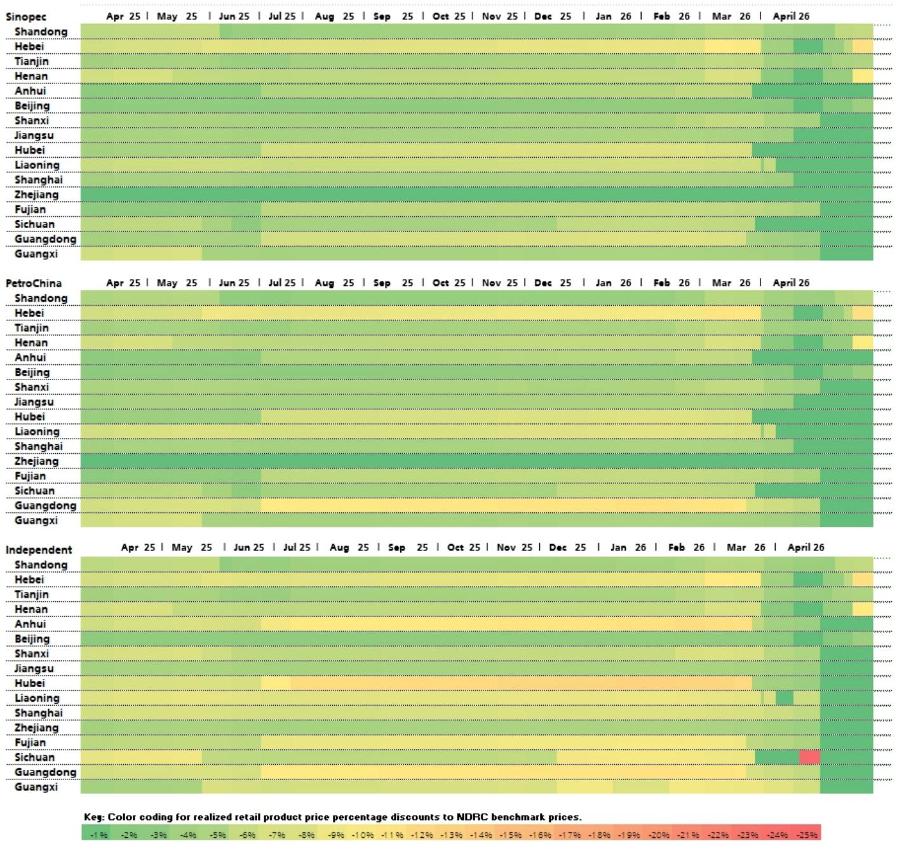
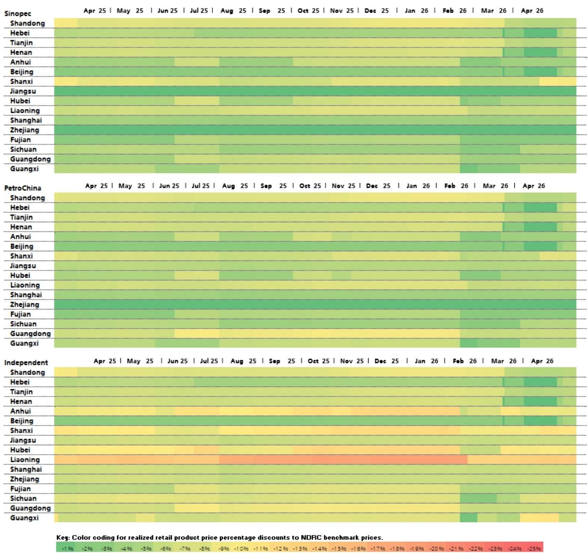

# China's Oil Market Is No Longer a Local Story: The Refining Shock That Reshapes Global Margins

The sharp 20% year-on-year drop in China's crude oil imports in April was not a demand shock. It was a supply-forced recalibration that reveals something more consequential: China's oil market has become a transmission belt for global refining dislocations, not a standalone domestic system. At 38.47 million tonnes, imports hit their lowest level since July 2022, and major refinery utilization collapsed to 70.8% — far below the 2025 average of 80%. But the real story is not the import number itself. It is the structural tension between China's stable crude inventories, its high product stockpiles, and the policy constraints that prevent those inventories from being relieved through exports.

This tension matters now because the global refining system is undergoing its most severe supply disruption in years. More than 3.5 million barrels per day of Gulf Cooperation Council refining capacity has halted operations, with over 2 million barrels per day potentially damaged and requiring repairs. Global offline capacity may have exceeded 12 million barrels per day in April. Against this backdrop, China's decision to suspend refined oil exports in March and then approve only a modest 0.5 million tonnes for May becomes a critical variable. The country holds over 100 days of crude import cover and high gasoline and diesel inventories, yet it is choosing to keep those products at home. That choice has implications for global product markets, regional refining margins, and the strategic positioning of Chinese refiners.

The conventional reading of China's oil data focuses on domestic demand weakness. That is true but insufficient. What the April data reveals is a system under dual pressure: rising crude import costs from higher official selling prices and freight premiums, and a policy framework that limits the natural outlet of export relief. The result is a compressed refining margin environment for Chinese processors, even as global margins are being lifted by supply destruction elsewhere. This asymmetry creates both risk and opportunity, and it demands a more strategic framework for interpreting China's oil flows.

## The Collapse in Refinery Utilization Reveals a Margin Crisis, Not Just a Demand Problem

The drop in major refinery utilization to 70.8% in April, down 5.9 percentage points month-on-month, is often attributed to weak domestic demand for gasoline and diesel. That explanation is incomplete. Domestic retail price ceilings for gasoline and diesel were cut by 135 yuan and 130 yuan per tonne respectively in April, and market average prices fell by nearly 1,000 yuan per tonne for gasoline and 300 yuan for diesel. But these price declines reflect something more structural: the pass-through of higher crude costs is being blocked by weak end-user pricing power.

The critical insight is that Chinese refiners are facing a cost-price squeeze that is independent of absolute demand levels. Crude import costs are rising because of higher official selling prices from Middle Eastern producers and increased freight and insurance premiums linked to geopolitical risk. Simultaneously, domestic product prices are constrained by a demand environment that cannot absorb higher margins. The result is that Chinese refiners are choosing to cut runs rather than produce at negative margins. This is not a demand collapse in the traditional sense. It is a margin-driven production response.

The data on Shandong independent refineries supports this interpretation. Their utilization was relatively stable at 55.2%, up 0.8 percentage points month-on-month. Independent refiners, which typically have more flexible crude sourcing and lower fixed costs, are better positioned to adjust to margin compression. The major state-owned refiners, with larger fixed cost bases and more rigid supply contracts, are the ones cutting runs more aggressively. This divergence within the Chinese refining sector is a signal that the margin problem is concentrated in the higher-cost, less flexible segment of the system.

## China's Export Policy Is the Key Variable That the Market Is Underestimating

The decision to suspend refined oil exports in March and then approve only 0.5 million tonnes for May — double the April level but still only about 30% of pre-conflict volumes — is the most consequential policy choice in the current environment. The stated rationale is ensuring domestic energy supply. But the data suggests a different logic: domestic inventories are already high, and the constraint on exports is not about supply security but about policy preference.

China's crude inventory has remained stable at approximately 1.3 billion barrels since March, equivalent to 76 days of crude oil demand and over 100 days of crude imports. Gasoline and diesel inventories are also elevated. If the concern were genuine supply security, one would expect exports to resume more aggressively to reduce inventory carrying costs and improve refinery economics. The fact that exports remain constrained suggests either a strategic decision to maintain a buffer against further supply disruptions or a political calculation about the optics of exporting refined products while domestic prices are under pressure.

This policy uncertainty creates a significant analytical gap. The market needs to understand whether China's export policy will shift if domestic refining margins deteriorate further, or if the government is willing to accept sustained margin compression as the price of inventory security. The answer to this question will determine whether Chinese product inventories become a source of global supply relief or remain locked in a domestic system that is increasingly disconnected from global pricing.

## The Global Refining Disruption Creates an Asymmetric Margin Environment

The scale of the refining capacity disruption in the Middle East is historically unprecedented. Over 3.5 million barrels per day of GCC refining capacity has halted, with more than 2 million barrels per day potentially requiring repairs. For context, at the peak of drone attacks on Russian refineries in fall 2025, less than 1 million barrels per day was affected. The current disruption is more than three times that scale.

The implications for global product markets are straightforward: reduced product supply will lift refining margins outside the affected regions. European and Asian refiners that can source crude from non-Middle Eastern origins will benefit from higher product prices and wider cracks. This is already visible in the European refining margin data, which shows a significant upward move in 2026 compared to the five-year average.

But Chinese refiners are not positioned to capture this benefit. They face higher crude costs, constrained export volumes, and a domestic demand environment that limits their ability to raise product prices. The asymmetry is stark: global refining margins are being supported by supply destruction, but Chinese refiners are experiencing margin compression because of the specific combination of cost and policy pressures they face. This divergence is likely to persist as long as China's export policy remains restrictive and as long as Middle Eastern crude supply disruptions keep import costs elevated.

## The Report Raises Critical Questions That the Market Has Not Yet Answered

The most important unresolved question is whether China's current inventory build is a strategic buffer or a structural overhang. The data shows stable crude inventories and high product stocks, but it does not reveal the composition of those inventories or the willingness of Chinese authorities to deploy them. If the inventories are held by state-owned entities with long-term strategic mandates, they may not be released even if market conditions warrant it. If they are held by commercial entities facing margin pressure, the incentive to destock is much stronger.

A second open question concerns the trajectory of Chinese export policy. The May approval of 0.5 million tonnes is a marginal increase, but it does not signal a policy shift. The market needs to understand the conditions under which China would resume exports at pre-conflict levels. Would a further deterioration in domestic refining margins trigger a policy response? Or is the export constraint a structural feature of China's energy policy, independent of short-term market conditions?

The third question is about the durability of the global refining disruption. The report notes that over 2 million barrels per day of GCC capacity may be damaged and require repairs. But it does not provide a timeline for those repairs or an assessment of whether the damage is repairable within a reasonable timeframe. If the capacity remains offline for an extended period, the structural support for global refining margins will persist, and the divergence between Chinese and non-Chinese refiners will widen.

## A Decision Framework for Navigating the Current Environment

For readers trying to make sense of this environment, the following framework is more useful than attempting to forecast crude oil prices or demand growth.

First, separate the crude market from the product market. The crude oil market is being driven by supply disruptions and inventory dynamics. The product market is being driven by refining capacity availability and trade policy. These two markets are increasingly disconnected, and strategies that treat them as one will miss important signals.

Second, monitor Chinese export policy as a leading indicator. The monthly export quota announcements are more important than refinery utilization data or import volumes. A sustained increase in export approvals would signal that China is willing to use its product inventories to relieve domestic margin pressure. A continued constraint would confirm that the government is prioritizing inventory security over refinery profitability.

Third, track the divergence between Chinese and non-Chinese refining margins. If Chinese margins continue to compress while global margins expand, the pressure on Chinese refiners to adjust their crude procurement and product output will intensify. This could lead to further import reductions, which would have second-order effects on global crude balances.

Fourth, pay attention to the repair timeline for Middle Eastern refining capacity. The duration of the current disruption is the single most important variable for global product markets. If repairs are completed within months, the margin support will be temporary. If the damage is more severe and requires longer-term reconstruction, the structural shift in global refining economics will be more durable.

Join the community to read the full report and review the original charts.

*This article is for learning and discussion only and does not constitute investment advice.*

Personal reading notes and learning share only. Not investment advice.

