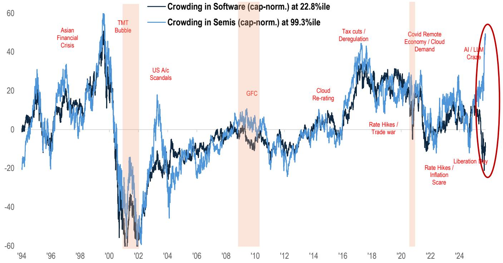

# Retail Investors Are Making a Strategic Bet That Institutional Capital Has Not Yet Endorsed

The most important signal in last week's retail flow data is not the volume of buying, but the direction of rotation. Retail investors are quietly unwinding their software positions while doubling down on semiconductors, creating a positioning divergence that has reached levels not seen in years. This is not random noise. It reflects a deliberate thesis about where the next leg of AI-driven returns will come from, and it stands in stark contrast to how institutional and short-side capital is positioned. For anyone managing a portfolio with a six-to-twelve-month horizon, understanding whether this retail conviction is early insight or late-cycle exuberance is now a critical analytical question.

The data is sharp. In April, Microsoft was the second most bought stock by retail investors, trailing only Tesla. By the second week of May, it became the most sold stock in the retail universe. Meanwhile, semiconductor ETFs such as SOXX and SMH continue to see steady inflows, and retail buying into DRAM names more than quadrupled in a single week. This is not a gentle rebalancing. It is a conviction-driven rotation executed at a pace that suggests retail investors see software as a crowded trade that has peaked and semiconductors as a theme that still has room to run.

The timing of this shift matters. It comes as the broader market prepares for the Trump-Xi meeting, a geopolitical event that historically suppresses risk appetite. Retail investors, however, are not sitting on their hands. They are making active sector bets, and they are doing so with enough conviction to generate meaningful positioning dislocations. The report's crowding analysis confirms that the gap between software and semiconductor positioning has widened further, supported by stellar semiconductor earnings growth of 124% year over year, while software earnings grew at a still-respectable 25%. On the surface, the rotation makes sense. But the deeper question is whether retail is correctly anticipating a structural shift or simply chasing the strongest recent momentum.

## The Software Selloff Is Not About Fundamentals, It Is About Positioning

The most striking feature of the current rotation is that software companies continue to report strong results. The report highlights that software earnings delivered 25% year-over-year growth, and several individual names reported exceptional quarters. Datadog, for example, saw revenue accelerate for the fourth consecutive quarter, new logo bookings doubled, and guidance was raised meaningfully on the back of hyperscaler AI deals. Fortinet, PTC, Cloudflare, and AppLovin all reinforced strong fundamentals. This is not a sector in distress.

So why are retail investors selling? The answer appears to be positioning, not valuation or earnings quality. Retail crowding in software has been easing, and the report notes that net selling of Microsoft and Palantir is a key driver. This suggests that retail investors believe software has already priced in the AI adoption narrative and that the marginal dollar of return will now come from the infrastructure layer rather than the application layer. It is a bet on the hardware that enables AI rather than the software that uses it.

This logic has surface appeal. Semiconductor earnings growth of 124% year over year is extraordinary, and the AI data center buildout continues to drive demand for memory, logic, and networking chips. But the risk is that retail investors are extrapolating a peak growth rate into a permanent trend. If semiconductor earnings growth decelerates in the second half of the year, the positioning could reverse violently. The report's crowding data shows that software positioning is at lows while semiconductor positioning is elevated. That asymmetry is a double-edged sword.

## Short Interest in Software Creates a Squeeze Risk That Retail Is Ignoring

One of the most analytically interesting findings in the report is the divergence in short-side positioning. Shorts continue to build in software, reaching the 100th percentile of herding, which the report explicitly flags as a squeeze risk. In semiconductors, by contrast, short interest remains stable and lower. This means that institutional capital is betting against software, while retail capital is betting against semiconductors by selling software and buying chips.

This creates a fascinating tension. If retail is wrong and software rallies, the combination of low retail positioning and high short interest could produce a powerful squeeze. The report's own language flags squeeze risk explicitly. Yet retail investors are not positioning for that outcome. They are leaning into the trade that has the least squeeze potential. This suggests either that retail is highly confident in its semiconductor thesis or that it is underestimating the risk of a mean-reversion event in software.

The report does not resolve this tension, but it provides the data to frame the question. The crowding gap between software and semiconductors has expanded further, and the short-side data suggests that the next major move could be violent in either direction. For a portfolio manager, the key question is whether to fade the retail rotation or to follow it. The answer depends on whether you believe the semiconductor earnings growth is sustainable and whether the software selloff has created an opportunity for mean reversion.

## The Copper Trade Shows Retail Is Trading Themes, Not Fundamentals

Beyond the software versus semiconductors debate, the report reveals another important pattern: retail investors are increasingly trading thematic narratives with short holding periods. The copper trade is a clear example. Retail investors recorded their largest single-day purchase in the COPX copper ETF on Tuesday, followed by profit-taking on Wednesday. This is not long-term allocation. It is tactical trading around a narrative that includes Chinese demand recovery, AI-driven fundamentals, and supply risks from Middle Eastern sulfur.

This pattern matters because it suggests that retail liquidity is becoming more event-driven and less patient. The report notes that overall retail purchases moderated this week, tracking just below the 12-month average. But within that lower volume, the activity that did occur was concentrated in high-conviction thematic trades. This is consistent with a retail base that is becoming more sophisticated in its ability to identify and trade themes but also more prone to crowding into narratives that may have short half-lives.

For institutional readers, the implication is that retail flow data is now a useful signal for identifying which themes are gaining traction, but it is a poor signal for timing. The copper trade, for example, generated a sharp single-day spike followed by immediate profit-taking. Anyone who followed the initial retail buying without understanding the holding period would have been caught in the reversal. The report's data allows readers to see both the direction and the velocity of retail flows, which is more useful than simply knowing whether retail is buying or selling.

## What the Report Does Not Fully Answer: The Sustainability of the Semiconductor Thesis

The report provides extensive data on current positioning but leaves an important question open. Is the semiconductor earnings growth of 124% year over year sustainable, and if not, what is the catalyst for deceleration? The report notes that semiconductor earnings season was stellar, but it does not analyze whether that growth is being driven by one-time inventory restocking, genuine demand acceleration, or a mix of both. The DRAM data shows that retail buying in memory names more than quadrupled last week, but the report does not provide detail on whether that buying is supported by end-market demand or by anticipation of further price increases.

This is a critical gap. If semiconductor earnings growth is driven by a structural demand shift from AI data centers, then the retail rotation into semiconductors is early and correct. If it is driven by cyclical factors that are peaking, then the rotation is late and dangerous. The report's crowding analysis shows that semiconductor positioning is already elevated relative to history. A deceleration in earnings growth could trigger a rapid unwind.

The report also does not address the question of how the Trump-Xi meeting might alter the semiconductor thesis. Trade policy, export controls, and supply chain disruptions are all live risks for the semiconductor industry. The retail rotation appears to assume that these risks are manageable, but the report provides no analysis of how a negative geopolitical outcome would affect the positioning. Readers are left to weigh this risk themselves.

## A Decision Framework for Acting on Retail Flow Data

For portfolio managers and analysts who want to use retail flow data as an input, the report supports a structured decision framework with three layers.

First, distinguish between flow direction and positioning extremity. The fact that retail is buying semiconductors and selling software is directional information, but the more important signal is that the positioning gap between the two sectors has reached an extreme. Extreme positioning does not predict the direction of the next move, but it does predict that the next move will be sharp. When positioning is this stretched, even a small change in fundamentals can produce a large price move.

Second, overlay short-side data to assess squeeze risk. The report shows that short interest in software is at the 100th percentile of herding, which means that any positive catalyst for software could produce a violent squeeze. Retail is selling into that setup, which means that the software selloff may be self-limiting. If short sellers start to cover, the retail rotation could reverse quickly. The decision framework should treat high short interest as a probabilistic hedge against further software downside.

Third, assess the catalyst calendar. The report is published ahead of the Trump-Xi meeting, which is a binary event for both semiconductors and software. Trade policy outcomes could dramatically alter the relative attractiveness of the two sectors. A positive outcome would likely benefit semiconductors, which are more exposed to global supply chains. A negative outcome would likely benefit software, which is less exposed to tariff risk. The decision framework should map the retail rotation onto the range of possible geopolitical outcomes and size positions accordingly.

## The Full Report Contains the Charts That Make This Analysis Actionable

The data behind this analysis is not abstract. The report includes specific charts that show the crowding divergence, the short-side herding, the DRAM buying acceleration, and the thematic flows into copper and Chinese tech ETFs. These charts allow readers to see the positioning in real time and to make their own judgments about whether the retail rotation is a signal to follow or a signal to fade.

The report also includes detailed single-stock stories that show which names are driving the flows. Microsoft and Palantir are the most sold, while Nvidia, Tesla, and ASML are the most bought. The DRAM data shows a sharp acceleration in buying that may be early or may be late. The copper data shows a tactical trade that may be a leading indicator for a broader commodities rotation.

Join the community to read the full report and review the original charts.

*This article is for learning and discussion only and does not constitute investment advice.*

Personal reading notes and learning share only. Not investment advice.

